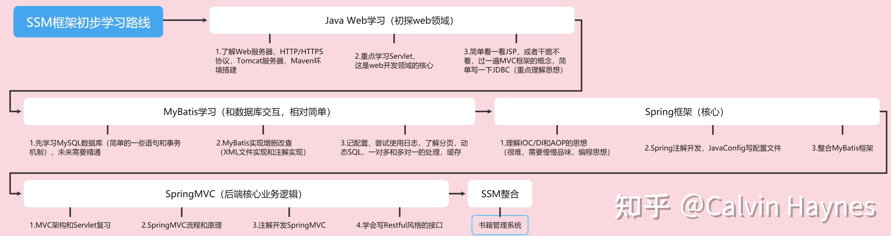

## day01_基础加强

https://www.bilibili.com/video/BV1qv4y1o79t?spm_id_from=333.337.search-card.all.click

	1. Junit单元测试
	2. 反射
	3. 注解


###  Junit单元测试：

* 测试分类：
  1. 黑盒测试：不需要写代码，给输入值，看程序是否能够输出期望的值。
  2. 白盒测试：需要写代码的。关注程序具体的执行流程。

* Junit使用：白盒测试
  * 步骤：
    1. 定义一个测试类(测试用例)
       * 建议：
         * 测试类名：被测试的类名Test		CalculatorTest
         * 包名：xxx.xxx.xx.test		cn.itcast.test

    2. 定义测试方法：可以独立运行
       * 建议：
         * 方法名：test测试的方法名		testAdd()  
         * 返回值：void
         * 参数列表：空参

    3. 给方法加@Test
    4. 导入junit依赖环境

  * 判定结果：
    * 红色：失败
    * 绿色：成功
    * 一般我们会使用断言操作来处理结果
      * Assert.assertEquals(期望的结果,运算的结果);

  * 补充：
    * @Before:
      * 修饰的方法会在测试方法之前被自动执行 
    * @After:
      * 修饰的方法会在测试方法执行之后自动被执行

需要测试的类

```java
package cn.itcast.junit;

/**
 * 计算器类
 */
public class Calculator {


    /**
     * 加法
     * @param a
     * @param b
     * @return
     */
    public int add (int a , int b){
        //int i = 3/0;

        return a - b;
    }

    /**
     * 减法
     * @param a
     * @param b
     * @return
     */
    public int sub (int a , int b){
        return a - b;
    }

}
```

测试类

```java
package cn.itcast.test;

import cn.itcast.junit.Calculator;
import org.junit.After;
import org.junit.Assert;
import org.junit.Before;
import org.junit.Test;

public class CalculatorTest {
    /**
     * 初始化方法：
     *  用于资源申请，所有测试方法在执行之前都会先执行该方法
     */
    @Before
    public void init(){
        System.out.println("init...");
    }

    /**
     * 释放资源方法：
     *  在所有测试方法执行完后，都会自动执行该方法
     */
    @After
    public void close(){
        System.out.println("close...");
    }


    /**
     * 测试add方法
     */
    @Test
    public void testAdd(){
       // System.out.println("我被执行了");
        //1.创建计算器对象
        System.out.println("testAdd...");
        Calculator c  = new Calculator();
        //2.调用add方法
        int result = c.add(1, 2);
        //System.out.println(result);

        //3.断言  我断言这个结果是3
        Assert.assertEquals(3,result);

    }

    @Test
    public void testSub(){
        //1.创建计算器对象
        Calculator c  = new Calculator();
        int result = c.sub(1, 2);
        System.out.println("testSub....");
        Assert.assertEquals(-1,result);
    }
}

```


###  反射：框架设计的灵魂

* 框架：半成品软件。可以在框架的基础上进行软件开发，简化编码
* 反射：将类的**各个组成部分封装为其他对象**，这就是反射机制
  * 好处：
    1. 可以在程序运行过程中，操作这些对象。
    2. 可以解耦，提高程序的可扩展性。

----


* **获取Class对象的方式：**

  1. ==Class.forName("全类名")==：将字节码文件**加载进内存**，返回Class对象
     * 多用于配置文件，将类名定义在配置文件中。读取文件，加载类
  2. 类名.class：通过类名的属性class获取
     * 多用于参数的传递
  3. 对象.getClass()：getClass()方法在Object类中定义着。
     * 多用于对象的获取字节码的方式

  * 结论：
    同一个字节码文件(*.class)在一次程序运行过程中，只会被加载一次，不论通过哪一种方式获取的Class对象都是同一个。

```java
public class ReflectDemo1 {
    public static void main(String[] args) throws Exception {
        //1.Class.forName("全类名")
        Class cls1 = Class.forName("cn.itcast.domain.Person");
        System.out.println(cls1);
        
        //2.类名.class
        Class cls2 = Person.class;
        System.out.println(cls2);
        
        //3.对象.getClass()
        Person p = new Person();
        Class cls3 = p.getClass();
        System.out.println(cls3);

        //== 比较三个对象
        System.out.println(cls1 == cls2);//true
        System.out.println(cls1 == cls3);//true
        Class c = Student.class;
        System.out.println(c == cls1);
    }
}
```


* Class对象功能：

  * 获取功能：

    1. **获取成员变量们**
       * Field[] getFields() ：获取所有public修饰的成员变量
       * Field getField(String name)   获取指定名称的 public修饰的成员变量
       * Field[] getDeclaredFields()  获取所有的成员变量，不考虑修饰符
       * Field getDeclaredField(String name)  

    

    * Field：成员变量
      * 操作：
        1. 设置值
           * void set(Object obj, Object value)  
        2. 获取值
           * get(Object obj) 

        3. 忽略访问权限修饰符的安全检查
           * setAccessible(true):暴力反射

    ```java
    public class ReflectDemo2 {
        public static void main(String[] args) throws Exception {
    
            //0.获取Person的Class对象
            Class personClass = Person.class;
            /*
                 1. 获取成员变量们
                     * Field[] getFields() 
    
                     * Field[] getDeclaredFields()
                     * Field getDeclaredField(String name)
    
             */
            //1.Field[] getFields()获取所有  public修饰！！！！的成员变量
            Field[] fields = personClass.getFields();
            for (Field field : fields) {
                System.out.println(field);
            } 
            System.out.println("------------");
    		
            //2.Field getField(String name)
            Field a = personClass.getField("a");
            //获取成员变量a 的值
            Person p = new Person();
            Object value = a.get(p);
            System.out.println(value);
            //设置a的值
            a.set(p,"张三");
            System.out.println(p);
    
            System.out.println("===================");
    
            //Field[] getDeclaredFields()：获取所有的成员变量，不考虑修饰符
            Field[] declaredFields = personClass.getDeclaredFields();
            for (Field declaredField : declaredFields) {
                System.out.println(declaredField);
            }
            //Field getDeclaredField(String name)
            Field d = personClass.getDeclaredField("d");
            //忽略访问权限修饰符的安全检查
            d.setAccessible(true);//暴力反射
            Object value2 = d.get(p);
            System.out.println(value2);
        }
    }
    
    ```

    2. **获取构造方法们**

    * Constructor<?>[] getConstructors()  
    * Constructor<T> getConstructor(类<?>... parameterTypes)  
    * Constructor<T> getDeclaredConstructor(类<?>... parameterTypes)  
    * Constructor<?>[] getDeclaredConstructors()  

    

    * Constructor:构造方法
      * 创建对象：
        * T newInstance(Object... initargs)  

        * 如果使用空参数构造方法创建对象，操作可以简化：Class对象的newInstance方法

    ```java
    public class ReflectDemo3 {
        public static void main(String[] args) throws Exception {
            //0.获取Person的Class对象
            Class personClass = Person.class;
           
            //Constructor<T> getConstructor(类<?>... parameterTypes)
            Constructor constructor = personClass.getConstructor(String.class, int.class);
            System.out.println(constructor);
            //创建对象
            Object person = constructor.newInstance("张三", 23);
            System.out.println(person);
    
            System.out.println("----------");
    
    
            Constructor constructor1 = personClass.getConstructor();
            System.out.println(constructor1);
            //创建对象
            Object person1 = constructor1.newInstance();
            System.out.println(person1);
    
            Object o = personClass.newInstance(); //空参
            System.out.println(o);
            //constructor1.setAccessible(true);
        }
    }
    
    ```

    3. **获取成员方法们：**

    * Method[] getMethods()  
    * Method getMethod(String name, 类<?>... parameterTypes)  
    * Method[] getDeclaredMethods()  
    * Method getDeclaredMethod(String name, 类<?>... parameterTypes)  

    * Method：方法对象
      * 执行方法：
        * Object invoke(Object obj, Object... args)  

      * 获取方法名称：
        * String getName:获取方法名

    ```java
    public static void main(String[] args) throws Exception {
    
            //0.获取Person的Class对象
            Class personClass = Person.class;
            /*
              3. 获取成员方法们：
                 * Method[] getMethods()
                 * Method getMethod(String name, 类<?>... parameterTypes)
    
                 * Method[] getDeclaredMethods()
                 * Method getDeclaredMethod(String name, 类<?>... parameterTypes)
             */
            //获取指定名称的方法
            Method eat_method = personClass.getMethod("eat");
            Person p = new Person();
            //执行方法
            eat_method.invoke(p);
    
    
            Method eat_method2 = personClass.getMethod("eat", String.class);
            //执行方法 有参方法
            eat_method2.invoke(p,"饭");
    
            System.out.println("-----------------");
    
            //获取所有public修饰的方法
            Method[] methods = personClass.getMethods();
            for (Method method : methods) {
                System.out.println(method);
                String name = method.getName();
                System.out.println(name);
                //method.setAccessible(true);
            }
    
            //获取类名
            String className = personClass.getName();
            System.out.println(className);//cn.itcast.domain.Person
    
        }
    ```

    

    4. **获取全类名**	

    * String getName()  

```java
String className = personClass.getName();
System.out.println(className);//cn.itcast.domain.Person
```

* 案例：
  * 需求：写一个"框架"，不能改变该类的任何代码的前提下，可以帮我们创建任意类的对象，并且执行其中任意方法
    * 实现：
      1. 配置文件
      2. 反射
    * 步骤：
      1. 将需要创建的对象的全类名和需要执行的方法定义在配置文件中
      2. 在程序中加载读取配置文件
      3. 使用反射技术来加载类文件进内存
      4. 创建对象
      5. 执行方法


1 创建类

2 配置文件

```properties
className=cn.itcast.domain.Student
methodName=sleep
```

 3 框架类

```java
/**
 * 框架类
 */
public class ReflectTest {
    public static void main(String[] args) throws Exception {
        //可以创建任意类的对象，可以执行任意方法

        /*
            前提：不能改变该类的任何代码。可以创建任意类的对象，可以执行任意方法
         */
      /*  Person p = new Person();
        p.eat();*/
/*
        Student stu = new Student();
        stu.sleep();*/

        //1.加载配置文件
        //1.1创建Properties对象
        Properties pro = new Properties();
        //1.2加载配置文件，转换为一个集合
        //1.2.1获取class目录下的配置文件
        ClassLoader classLoader = ReflectTest.class.getClassLoader();
        InputStream is = classLoader.getResourceAsStream("pro.properties");
        pro.load(is);

        //2.获取配置文件中定义的数据
        String className = pro.getProperty("className");
        String methodName = pro.getProperty("methodName");


        //3.加载该类进内存
        Class cls = Class.forName(className);
        //4.创建对象
        Object obj = cls.newInstance();
        //5.获取方法对象
        Method method = cls.getMethod(methodName);
        //6.执行方法
        method.invoke(obj);
    }
}
```


### 注解：

* 概念：说明程序的。给计算机看的
* 注释：用文字描述程序的。给程序员看的
* 定义：注解（Annotation），也叫元数据。一种代码级别的说明。它是JDK1.5及以后版本引入的一个特性，与类、接口、枚举是在同一个层次。它可以声明在包、类、字段、方法、局部变量、方法参数等的前面，用来对这些元素进行说明，注释。
* 概念描述：
	* JDK1.5之后的新特性
	* 说明程序的
	* 使用注解：@注解名称


	* 作用分类：
		    ①编写文档：通过代码里标识的注解生成文档【生成文档doc文档】
		②代码分析：通过代码里标识的注解对代码进行分析【使用反射】
		③编译检查：通过代码里标识的注解让编译器能够实现基本的编译检查【Override】

-----------------

* JDK中预定义的一些注解
	* **@Override**	：检测被该注解标注的方法是否是继承自父类(接口)的
	* **@Deprecated**：该注解标注的内容，表示已过时
	* **@SuppressWarnings**：压制警告
		* 一般传递参数all  @SuppressWarnings("all")

* 自定义注解
	* 格式：
		元注解
		
		```java
		public @interface 注解名称{
			属性列表;
		}
		```
		
	* 本质：注解本质上就是一个接口，该接口默认继承Annotation接口
		* public interface MyAnno extends java.lang.annotation.Annotation {}
	
	* 属性：接口中的抽象方法
		* 要求：
			1. 属性的==返回值类型==有下列取值
				* 基本数据类型
				* String
				* 枚举
				* 注解
				* 以上类型的数组
	
			2. 定义了属性，==在使用时需要给属性赋值===
				1. 如果定义属性时，使用default关键字给属性默认初始化值，则使用注解时，可以不进行属性的赋值。
				2. 如果只有一个属性需要赋值，并且属性的名称是value，则value可以省略，直接定义值即可。
				3. 数组赋值时，值使用{}包裹。如果数组中只有一个值，则{}可以省略
				
				```java
				public @interface MyAnno {
				
				    int value();
				    Person per(); //枚举类型
				    MyAnno2 anno2(); //注解类型
				    String[] strs(); //数组类型
				     /*String name() default "张三";*/
				     /*String show2();
				
				     Person per(); 
				     MyAnno2 anno2();
				
				     String[] strs();*/
				}
				```
				
				```java
				@MyAnno(value=12,per = Person.P3,anno2 = @MyAnno2,strs={"bbb","aaa"})
				@MyAnno3
				public class Worker {
				    @MyAnno3
				    public String name = "aaa";
				    @MyAnno3
				    public void show(){
				    }
				}
				```
		
	* 元注解：用于描述注解的注解
		* @Target：描述注解能够作用的位置
			* ==ElementType取值：==
				* TYPE：可以作用于类上
				* METHOD：可以作用于方法上
				* FIELD：可以作用于成员变量上
		* @Retention：描述注解**被保留的阶段**
			* @Retention(RetentionPolicy.RUNTIME)：当前被描述的注解，会保留到class字节码文件中，并被JVM读取到
		* @Documented：描述注解是否被抽取到api文档中
		* @Inherited：描述注解是否被子类继承 

```java
/**

 元注解：用于描述注解的注解
     * @Target：描述注解能够作用的位置
     * @Retention：描述注解被保留的阶段
     * @Documented：描述注解是否被抽取到api文档中
     * @Inherited：描述注解是否被子类继承
 *
 */

@Target({ElementType.TYPE,ElementType.METHOD,ElementType.FIELD})
@Retention(RetentionPolicy.RUNTIME)
@Documented
@Inherited
public @interface MyAnno3 {
}

```

* 在程序使用(解析)注解：获取注解中定义的属性值
	1. 获取注解定义的位置的对象  （Class，Method,Field）
	
	2. 获取指定的注解
		
		* getAnnotation(Class)
	     //其实就是在内存中生成了一个该注解接口的子类实现对象
	   
	            public class ProImpl implements Pro{
	                public String className(){
	                    return "cn.itcast.annotation.Demo1";
	                }
	                public String methodName(){
	                    return "show";
	                }
	            }
	   
	3. 调用注解中的抽象方法获取配置的属性值
	
	   ```java 
	   /**
	    * 描述需要执行的类名，和方法名
	    */
	   
	   @Target({ElementType.TYPE})
	   @Retention(RetentionPolicy.RUNTIME)
	   public @interface Pro {
	   
	       String className();//代表了一套规范
	       String methodName();
	   }
	   ```
	
	   ```java
	   @Pro(className = "cn.itcast.annotation.Demo1",methodName = "show")
	   public class ReflectTest {
	       public static void main(String[] args) throws Exception {
	   
	           /*
	               前提：不能改变该类的任何代码。可以创建任意类的对象，可以执行任意方法
	            */
	   
	           //1.解析注解
	           //1.1获取该类的字节码文件对象
	           Class<ReflectTest> reflectTestClass = ReflectTest.class;
	           //2.获取上边的注解对象
	           //其实就是在内存中生成了一个该注解接口的子类实现对象
	           /*
	   
	               public class ProImpl implements Pro{
	                   public String className(){
	                       return "cn.itcast.annotation.Demo1";
	                   }
	                   public String methodName(){
	                       return "show";
	                   }
	   
	               }
	    */
	   
	           Pro an = reflectTestClass.getAnnotation(Pro.class);
	           //3.调用注解对象中定义的抽象方法，获取返回值
	           String className = an.className();
	           String methodName = an.methodName();
	           System.out.println(className);
	           System.out.println(methodName);
	   
	           //3.加载该类进内存
	           Class cls = Class.forName(className);
	           //4.创建对象
	           Object obj = cls.newInstance();
	           //5.获取方法对象
	           Method method = cls.getMethod(methodName);
	           //6.执行方法
	           method.invoke(obj);
	       }
	   }
	    
	   ```


	* 案例：简单的测试框架
	* 小结：
		1. 以后大多数时候，我们会使用注解，而不是自 定义注解
		2. 注解给谁用？
			1. 编译器
			2. 给解析程序用
		3. 注解不是程序的一部分，可以理解为注解就是一个标签

```java
public class TestCheck {
    public static void main(String[] args) throws IOException {
        //1.创建计算器对象
        Calculator c = new Calculator();
        //2.获取字节码文件对象
        Class cls = c.getClass();
        //3.获取所有方法
        Method[] methods = cls.getMethods();

        int number = 0;//出现异常的次数
        BufferedWriter bw = new BufferedWriter(new FileWriter("bug.txt"));


        for (Method method : methods) {
            //4.判断方法上是否有Check注解
            if(method.isAnnotationPresent(Check.class)){
                //5.有，执行
                try {
                    method.invoke(c);
                } catch (Exception e) {
                    //6.捕获异常

                    //记录到文件中
                    number ++;

                    bw.write(method.getName()+ " 方法出异常了");
                    bw.newLine();
                    bw.write("异常的名称:" + e.getCause().getClass().getSimpleName());
                    bw.newLine();
                    bw.write("异常的原因:"+e.getCause().getMessage());
                    bw.newLine();
                    bw.write("--------------------------");
                    bw.newLine();

                }
            }
        }

        bw.write("本次测试一共出现 "+number+" 次异常");

        bw.flush();
        bw.close();
    }

}

```

## day02_MySQL基础
## day03_MySQL约束
## day04_MySQL多表&事务 
## day05_JDBC
## day06_JDBC连接池&JDBCTemplate 
## day07_HTML 

1. 概念：是最基础的网页开发语言
	* Hyper Text Markup Language 超文本标记语言
		* 超文本:
			* 超文本是用超链接的方法，将各种不同空间的文字信息组织在一起的网状文本.
		* 标记语言:
			* 由标签构成的语言。<标签名称> 如 html，xml
			* 标记语言不是编程语言

2. 快速入门：
	* 语法：
		1. html文档后缀名 .html 或者 .htm
		2. 标签分为
			1. 围堵标签：有开始标签和结束标签。如` <html> </html>`
			2. 自闭和标签：开始标签和结束标签在一起。如 `<br/>`
		3. 标签可以嵌套：
			需要正确嵌套，不能你中有我，我中有你
			错误：`<a><b></a></b>`
			正确：`<a><b></b></a>`
		4. 在开始标签中可以定义属性。属性是由键值对构成，值需要用引号(单双都可)引起来
		5. html的标签不区分大小写，但是建议使用小写。
		
		```html
		<html>	
		    <head>
		        <title>title</title>
		    </head>
		    <body>
		        <FONT color='red'>Hello World</font><br/>
		
		        <font color='green'>Hello World</font>
		    </body>
		</html>
		```
	
3. 标签学习：

  ```xml
  1. 文件标签：构成html最基本的标签
  	* html:html文档的根标签
  	* head：头标签。用于指定html文档的一些属性。引入外部的资源
  	* title：标题标签。
  	* body：体标签
  	* <!DOCTYPE html>：html5中定义该文档是html文档
  ```


	2. 文本标签：和文本有关的标签
			* 注释：<!-- 注释内容 -->
			* <h1> to <h6>：标题标签
				* h1~h6:字体大小逐渐递减
			* <p>：段落标签
			* <br>：换行标签
			* <hr>：展示一条水平线
				* 属性：
					* color：颜色
					* width：宽度
					* size：高度
					* align：对其方式
						* center：居中
						* left：左对齐
						* right：右对齐
			* <b>：字体加粗
			* <i>：字体斜体
			* <font>:字体标签
			* <center>:文本居中
				* 属性：
					* color：颜色
					* size：大小
					* face：字体
	
			* 属性定义：
				* color：
					1. 英文单词：red,green,blue
					2. rgb(值1，值2，值3)：值的范围：0~255  如  rgb(0,0,255)
					3. #值1值2值3：值的范围：00~FF之间。如： #FF00FF
				* width：
					1. 数值：width='20' ,数值的单位，默认是 px(像素)
					2. 数值%：占比相对于父元素的比例

* 案例：公司简介

  ```html
  <!DOCTYPE html>
  <html lang="ch">
  <head>
      <meta charset="UTF-8">
      <title>黑马程序员简介</title>
  </head>
  <body>
  
  <h1>
      公司简介
  </h1>
  <hr color="#ffd700">
  
  <p>
      <font color="#FF0000">"中关村黑马程序员训练营"</font>是由<b><i>传智播客</i></b>联合中关村软件园、CSDN，
      并委托传智播客进行教学实施的软件开发高端培训机构，致力于服务各大软件企业，解决当前软件开发技术飞速发展， 而企业招不到优秀人才的困扰。
  </p>
  
  <p>
      目前，“中关村黑马程序员训练营”已成长为行业“学员质量好、课程内容深、企业满意”的移动开发高端训练基地， 并被评为中关村软件园重点扶持人才企业。
  </p>
  
  <p>
      黑马程序员的学员多为大学毕业后，有理想、有梦想，想从事IT行业，而没有环境和机遇改变自己命运的年轻人。 黑马程序员的学员筛选制度，远比现在90%以上的企业招聘流程更为严格。任何一名学员想成功入学“黑马程序员”，
      必须经历长达2个月的面试流程，这些流程中不仅包括严格的技术测试、自学能力测试，还包括性格测试、压力测试、 品德测试等等测试。毫不夸张地说，黑马程序员训练营所有学员都是精挑细选出来的。百里挑一的残酷筛选制度确
      保学员质量，并降低企业的用人风险。
      中关村黑马程序员训练营不仅着重培养学员的基础理论知识，更注重培养项目实施管理能力，并密切关注技术革新， 不断引入先进的技术，研发更新技术课程，确保学员进入企业后不仅能独立从事开发工作，更能给企业带来新的技术体系和理念。
  </p>
  
  <p>
  
      一直以来，黑马程序员以技术视角关注IT产业发展，以深度分享推进产业技术成长，致力于弘扬技术创新，倡导分享、 开放和协作，努力打造高质量的IT人才服务平台。
  </p>
  
  <hr color="#ffd700">
  
  <font color="gray" size="2">
      <center>
          江苏传智播客教育科技股份有限公司<br>
          版权所有Copyright 2006-2018&copy;, All Rights Reserved 苏ICP备16007882
      </center>
  </font>
  </body>
  </html>
  ```

	```html
	3. 图片标签：
		* img：展示图片
			* 属性：
				* src：指定图片的位置
	
		* 代码：
			 <!--展示一张图片 img-->
	
		    
		
		    <!--
		        相对路径
		            * 以.开头的路径
		                * ./：代表当前目录  ./image/1.jpg
		                * ../:代表上一级目录
		     -->
		
		    
		
		    
	4. 列表标签：
		* 有序列表：
			* ol:
			* li:
		* 无序列表：
			* ul:
			* li:
	5. 链接标签：
		* a:定义一个超链接
			* 属性：
				* href：指定访问资源的URL(统一资源定位符)
				* target：指定打开资源的方式
					* _self:默认值，在当前页面打开
					* _blank：在空白页面打开
	
		* 代码：
			 <!--超链接  a-->
	
		    <a href="http://www.itcast.cn">点我</a>
		    <br>
		
		    <a href="http://www.itcast.cn" target="_self">点我</a>
		    <br>
		    <a href="http://www.itcast.cn" target="_blank">点我</a>
		
		    <br>
		
		    <a href="./5_列表标签.html">列表标签</a><br>
		    <a href="mailto:itcast@itcast.cn">联系我们</a>
		
		    <br>
		    <a href="http://www.itcast.cn"></a>
	6. div和span：
		* div:每一个div占满一整行。块级标签
		* span：文本信息在一行展示，行内标签 内联标签
	
	7. 语义化标签：html5中为了提高程序的可读性，提供了一些标签。
		1. <header>：页眉
		2. <footer>：页脚
	```


```html
	8. 表格标签：
		* table：定义表格
			* width：宽度
			* border：边框
			* cellpadding：定义内容和单元格的距离
			* cellspacing：定义单元格之间的距离。如果指定为0，则单元格的线会合为一条、
			* bgcolor：背景色
			* align：对齐方式
		* tr：定义行
			* bgcolor：背景色
			* align：对齐方式
		* td：定义单元格
			* colspan：合并列
			* rowspan：合并行
		* th：定义表头单元格
		* <caption>：表格标题
		* <thead>：表示表格的头部分
		* <tbody>：表示表格的体部分
		* <tfoot>：表示表格的脚部分
```

案例：旅游网站首页

```
	1. 确定使用table来完成布局	
	2. 如果某一行只有一个单元格，则使用<tr><td></td></tr>
	3. 如果某一行有多个单元格，则使用
		<tr>
			<td>
				<table></table>
			</td>
		</tr>
```


​	4. 代码实现

```html
<!DOCTYPE html>
<html lang="en">
<head>
    <meta charset="UTF-8">
    <title>黑马旅游网</title>
</head>
<body>

<!--采用table来完成布局-->
<!--最外层的table，用于整个页面的布局-->
<table width="100%" align="center">
    <!-- 第1行 -->
    <tr>
        <td>
            
        </td>
    </tr>

    <!-- 第2行 -->
    <tr>
        <td>
            <table width="100%" align="center">
                <tr>
                    <td>
                        
                    </td>
                    <td>
                        
                    </td>
                    <td>
                        
                    </td>
                </tr>
            </table>

        </td>
    </tr>

    <!-- 第3行 -->
    <tr>
        <td>
            <table width="100%" align="center">
                <tr bgcolor="#ffd700" align="center" height="45">
                    <td>
                        <a href="">首页</a>
                    </td>

                    <td>
                        门票
                    </td>

                    <td>
                        门票
                    </td>

                    <td>
                        门票
                    </td>

                    <td>
                        门票
                    </td>

                    <td>
                        门票
                    </td>

                    <td>
                        门票
                    </td>

                    <td>
                        门票
                    </td>

                    <td>
                        门票
                    </td>

                    <td>
                        门票
                    </td>
                </tr>
            </table>
        </td>
    </tr>

    <!-- 第4行 轮播图 -->
    <tr>
        <td>
            
        </td>
    </tr>

    <!-- 第5行 黑马精选-->
    <tr>
        <td>
            
            黑马精选
            <hr color="#ffd700">
        </td>
    </tr>

    <!-- 第6行 -->
    <tr>
        <td>
            <table align="center" width="95%">
                <tr>
                    <td>

                        
                        <p>上海飞三亚五天4晚自由行(春节销售+亲子+蜜月+自由行)</p>
                        <font color="red">&yen; 899</font>
                    </td>

                    <td>

                        
                        <p>上海飞三亚五天4晚自由行(春节销售+亲子+蜜月+自由行)</p>
                        <font color="red">&yen; 899</font>
                    </td>

                    <td>

                        
                        <p>上海飞三亚五天4晚自由行(春节销售+亲子+蜜月+自由行)</p>
                        <font color="red">&yen; 899</font>
                    </td>

                    <td>

                        
                        <p>上海飞三亚五天4晚自由行(春节销售+亲子+蜜月+自由行)</p>
                        <font color="red">&yen; 899</font>
                    </td>
                </tr>
            </table>
        </td>
    </tr>

    <!-- 第7行 国内游 -->
    <tr>
        <td>
            
            国内游
            <hr color="#ffd700">
        </td>
    </tr>

    <!-- 第8行 -->
    <tr>
        <td>
            <table align="center" width="95%">
                <tr>
                    <td rowspan="2">
                        
                    </td>

                    <td>

                        
                        <p>上海飞三亚五天4晚自由行(春节销售+亲子+蜜月+自由行)</p>
                        <font color="red">&yen; 699</font>
                    </td>

                    <td>

                        
                        <p>上海飞三亚五天4晚自由行(春节销售+亲子+蜜月+自由行)</p>
                        <font color="red">&yen; 699</font>
                    </td>

                    <td>

                        
                        <p>上海飞三亚五天4晚自由行(春节销售+亲子+蜜月+自由行)</p>
                        <font color="red">&yen; 699</font>
                    </td>
                </tr>

                <tr>
                    <td>

                        
                        <p>上海飞三亚五天4晚自由行(春节销售+亲子+蜜月+自由行)</p>
                        <font color="red">&yen; 699</font>
                    </td>

                    <td>

                        
                        <p>上海飞三亚五天4晚自由行(春节销售+亲子+蜜月+自由行)</p>
                        <font color="red">&yen; 699</font>
                    </td>

                    <td>

                        
                        <p>上海飞三亚五天4晚自由行(春节销售+亲子+蜜月+自由行)</p>
                        <font color="red">&yen; 699</font>
                    </td>
                </tr>
            </table>
        </td>
    </tr>
    <!-- 第9行 境外游 -->
    <tr>
        <td>
            
            境外游
            <hr color="#ffd700">
        </td>
    </tr>

    <!-- 第10行 -->
    <tr>
        <td>
            <table align="center" width="95%">
                <tr>
                    <td rowspan="2">
                        
                    </td>

                    <td>

                        
                        <p>上海飞三亚五天4晚自由行(春节销售+亲子+蜜月+自由行)</p>
                        <font color="red">&yen; 699</font>
                    </td>

                    <td>

                        
                        <p>上海飞三亚五天4晚自由行(春节销售+亲子+蜜月+自由行)</p>
                        <font color="red">&yen; 699</font>
                    </td>

                    <td>

                        
                        <p>上海飞三亚五天4晚自由行(春节销售+亲子+蜜月+自由行)</p>
                        <font color="red">&yen; 699</font>
                    </td>
                </tr>

                <tr>
                    <td>

                        
                        <p>上海飞三亚五天4晚自由行(春节销售+亲子+蜜月+自由行)</p>
                        <font color="red">&yen; 699</font>
                    </td>

                    <td>

                        
                        <p>上海飞三亚五天4晚自由行(春节销售+亲子+蜜月+自由行)</p>
                        <font color="red">&yen; 699</font>
                    </td>

                    <td>

                        
                        <p>上海飞三亚五天4晚自由行(春节销售+亲子+蜜月+自由行)</p>
                        <font color="red">&yen; 699</font>
                    </td>
                </tr>
            </table>
        </td>
    </tr>
    <!-- 第11行 -->
    <tr>
        <td>
            
        </td>
    </tr>
    <!-- 第12行 -->
    <tr>
        <td align="center" bgcolor="#ffd700" height="40">
            <font color="gray" size="2">
                江苏传智播客教育科技股份有限公司
                版权所有Copyright 2006-2018&copy;, All Rights Reserved 苏ICP备16007882
            </font>
        </td>
    </tr>

</table>

</body>
</html>
```

## day08_HTML&CSS 


- 1 HTML标签：表单标签

```html
* 表单：
		* 概念：用于采集用户输入的数据的。用于和服务器进行交互。
		
	  * form：用于定义表单的。可以定义一个范围，范围代表采集用户数据的范围
	       * 属性：
	    
	        * 
	            * action：指定提交数据的URL
	            * method:指定提交方式
	                * 分类：一共7种，2种比较常用
	                   * get：
	                        1. 请求参数会在地址栏中显示。会封装到请求行中(HTTP协议后讲解)。
	                        2. 请求参数大小是有限制的。
	                        3. 不太安全。
	                   * post：
	                        2. 请求参数不会再地址栏中显示。会封装在请求体中(HTTP协议后讲解)
	                        2. 请求参数的大小没有限制。
	                        3. 较为安全。
	            
	            * 表单项中的数据要想被提交：必须指定其name属性
	              ​		* 表单项标签：
	              ​			* input：可以通过type属性值，改变元素展示的样式
	              ​				* type属性：
	              ​					* text：文本输入框，默认值
	              ​						* placeholder：指定输入框的提示信息，当输入框的内容发生变化，会自动清空提示信息	
	              ​					* password：密码输入框
	              ​					* radio:单选框
	              ​						* 注意：
	              ​							1. 要想让多个单选框实现单选的效果，则多个单选框的name属性值必须一样。
	              ​							2. 一般会给每一个单选框提供value属性，指定其被选中后提交的值
	              ​							3. checked属性，可以指定默认值
	              ​					* checkbox：复选框
	              ​						* 注意：
	              ​							1. 一般会给每一个单选框提供value属性，指定其被选中后提交的值
	              ​							2. checked属性，可以指定默认值
	              ​	
	              					* file：文件选择框
	              					* hidden：隐藏域，用于提交一些信息。
	              					* 按钮：
	              						* submit：提交按钮。可以提交表单
	              						* button：普通按钮
	              						* image：图片提交按钮
	              							* src属性指定图片的路径	

			   * label：指定输入项的文字描述信息
				   * 注意：
					   * label的for属性一般会和 input 的 id属性值 对应。如果对应了，则点击label区域，会让input输入框获取焦点。
			* select: 下拉列表
				* 子元素：option，指定列表项
				
			* textarea：文本域
				* cols：指定列数，每一行有多少个字符
				* rows：默认多少行。
```

- 2 CSS：页面美化和布局控制

```html
    1. 概念： Cascading Style Sheets 层叠样式表
		* 层叠：多个样式可以作用在同一个html的元素上，同时生效
	
	2. 好处：
		1. 功能强大
		2. 将内容展示和样式控制分离
			* 降低耦合度。解耦
			* 让分工协作更容易
			* 提高开发效率


	3. CSS的使用：CSS与html结合方式
		1. 内联样式
			 * 在标签内使用style属性指定css代码
			 * 如：<div style="color:red;">hello css</div>
		2. 内部样式
			* 在head标签内，定义style标签，style标签的标签体内容就是css代码
			* 如：
				<style>
			        div{
			            color:blue;
			        }
			    </style>
				<div>hello css</div>
		3. 外部样式
			1. 定义css资源文件。
			2. 在head标签内，定义link标签，引入外部的资源文件
			* 如：
	    		* a.css文件：
					div{
					    color:green;
					}
				<link rel="stylesheet" href="css/a.css">
				<div>hello css</div>
				<div>hello css</div>
	
		* 注意：
			* 1,2,3种方式 css作用范围越来越大
			* 1方式不常用，后期常用2,3
			* 3种格式可以写为：
				<style>
			        @import "css/a.css";
			    </style>
	
	4. css语法：
		* 格式：
			选择器 {
				属性名1:属性值1;
				属性名2:属性值2;
				...
			}
		* 选择器:筛选具有相似特征的元素
		* 注意：
			* 每一对属性需要使用；隔开，最后一对属性可以不加；


	5. 选择器：筛选具有相似特征的元素
		* 分类：
			1. 基础选择器
				1. id选择器：选择具体的id属性值的元素.建议在一个html页面中id值唯一
			        * 语法：#id属性值{}
			    2. 元素选择器：选择具有相同标签名称的元素
			        * 语法： 标签名称{}
			        * 注意：id选择器优先级高于元素选择器
			    3. 类选择器：选择具有相同的class属性值的元素。
			        * 语法：.class属性值{}
			        * 注意：类选择器选择器优先级高于元素选择器
			2. 扩展选择器：
				1. 选择所有元素：
					* 语法： *{}
				2. 并集选择器：
					* 选择器1,选择器2{}
				
				3. 子选择器：筛选选择器1元素下的选择器2元素
					* 语法：  选择器1 选择器2{}
				4. 父选择器：筛选选择器2的父元素选择器1
					* 语法：  选择器1 > 选择器2{}
	
				5. 属性选择器：选择元素名称，属性名=属性值的元素
					* 语法：  元素名称[属性名="属性值"]{}
	
				6. 伪类选择器：选择一些元素具有的状态
					* 语法： 元素:状态{}
					* 如： <a>
						* 状态：
							* link：初始化的状态
							* visited：被访问过的状态
							* active：正在访问状态
							* hover：鼠标悬浮状态
	6. 属性
		1. 字体、文本
			* font-size：字体大小
			* color：文本颜色
			* text-align：对其方式
			* line-height：行高 
		2. 背景
			* background：
		3. 边框
			* border：设置边框，符合属性
		4. 尺寸
			* width：宽度
			* height：高度
		5. 盒子模型：控制布局
			* margin：外边距
			* padding：内边距
				* 默认情况下内边距会影响整个盒子的大小
				* box-sizing: border-box;  设置盒子的属性，让width和height就是最终盒子的大小
	
			* float：浮动
				* left
				* right

```


## day09_JavaScript基础 


## day10_JavaScript高级 
## day11_BootStrap 
## day12_xml 
## day13_Tomcat&Servlet 

- web服务器软件：
	* 服务器：安装了服务器软件的计算机
	* 服务器软件：接收用户的请求，处理请求，做出响应
	* web服务器软件：接收用户的请求，处理请求，做出响应。
		* 在web服务器软件中，可以部署web项目，让用户通过浏览器来访问这些项目
		* web容器


	* 常见的java相关的web服务器软件：
		* webLogic：oracle公司，大型的JavaEE服务器，支持所有的JavaEE规范，收费的。
		* webSphere：IBM公司，大型的JavaEE服务器，支持所有的JavaEE规范，收费的。
		* JBOSS：JBOSS公司的，大型的JavaEE服务器，支持所有的JavaEE规范，收费的。
		* Tomcat：Apache基金组织，中小型的JavaEE服务器，仅仅支持少量的JavaEE规范servlet/jsp。开源的，免费的。


	* JavaEE：Java语言在企业级开发中使用的技术规范的总和，一共规定了13项大的规范
	
	* Tomcat：web服务器软件
		1. 下载：http://tomcat.apache.org/
		2. 安装：解压压缩包即可。
			* 注意：安装目录建议不要有中文和空格
		3. 卸载：删除目录就行了
		4. 启动：
			* bin/startup.bat ,双击运行该文件即可
			* 访问：浏览器输入：http://localhost:8080 回车访问自己
							  http://别人的ip:8080 访问别人
			
			* 可能遇到的问题：
				1. 黑窗口一闪而过：
					* 原因： 没有正确配置JAVA_HOME环境变量
					* 解决方案：正确配置JAVA_HOME环境变量
	
				2. 启动报错：
					1. 暴力：找到占用的端口号，并且找到对应的进程，杀死该进程
						* netstat -ano
					2. 温柔：修改自身的端口号
						* conf/server.xml
						* <Connector port="8888" protocol="HTTP/1.1"
			               connectionTimeout="20000"
			               redirectPort="8445" />
						* 一般会将tomcat的默认端口号修改为80。80端口号是http协议的默认端口号。
							* 好处：在访问时，就不用输入端口号
		5. 关闭：
			1. 正常关闭：
				* bin/shutdown.bat
				* ctrl+c
			2. 强制关闭：
				* 点击启动窗口的×
		6. 配置:
			* 部署项目的方式：
				1. 直接将项目放到webapps目录下即可。
					* /hello：项目的访问路径-->虚拟目录
					* 简化部署：将项目打成一个war包，再将war包放置到webapps目录下。
						* war包会自动解压缩
	
				2. 配置conf/server.xml文件
					在<Host>标签体中配置
					<Context docBase="D:\hello" path="/hehe" />
					* docBase:项目存放的路径
					* path：虚拟目录
	
				3. 在conf\Catalina\localhost创建任意名称的xml文件。在文件中编写
					<Context docBase="D:\hello" />
					* 虚拟目录：xml文件的名称
			
			* 静态项目和动态项目：
				* 目录结构
					* java动态项目的目录结构：
						-- 项目的根目录
							-- WEB-INF目录：
								-- web.xml：web项目的核心配置文件
								-- classes目录：放置字节码文件的目录
								-- lib目录：放置依赖的jar包


			* 将Tomcat集成到IDEA中，并且创建JavaEE的项目，部署项目。


## Servlet：  server applet
	* 概念：运行在服务器端的小程序
		* Servlet就是一个接口，定义了Java类被浏览器访问到(tomcat识别)的规则。
		* 将来我们自定义一个类，实现Servlet接口，复写方法。


	* 快速入门：
		1. 创建JavaEE项目
		2. 定义一个类，实现Servlet接口
			* public class ServletDemo1 implements Servlet
		3. 实现接口中的抽象方法
		4. 配置Servlet
			 在web.xml中配置：
		    <!--配置Servlet -->
		    <servlet>
		        <servlet-name>demo1</servlet-name>
		        <servlet-class>cn.itcast.web.servlet.ServletDemo1</servlet-class>
		    </servlet>
		
		    <servlet-mapping>
		        <servlet-name>demo1</servlet-name>
		        <url-pattern>/demo1</url-pattern>
		    </servlet-mapping>
	
	* 执行原理：
		1. 当服务器接受到客户端浏览器的请求后，会解析请求URL路径，获取访问的Servlet的资源路径
		2. 查找web.xml文件，是否有对应的<url-pattern>标签体内容。
		3. 如果有，则在找到对应的<servlet-class>全类名
		4. tomcat会将字节码文件加载进内存，并且创建其对象
		5. 调用其方法
	
	* Servlet中的生命周期方法：
		1. 被创建：执行init方法，只执行一次
			* Servlet什么时候被创建？
				* 默认情况下，第一次被访问时，Servlet被创建
				* 可以配置执行Servlet的创建时机。
					* 在<servlet>标签下配置
						1. 第一次被访问时，创建
	                		* <load-on-startup>的值为负数
			            2. 在服务器启动时，创建
			                * <load-on-startup>的值为0或正整数


			* Servlet的init方法，只执行一次，说明一个Servlet在内存中只存在一个对象，Servlet是单例的
				* 多个用户同时访问时，可能存在线程安全问题。
				* 解决：尽量不要在Servlet中定义成员变量。即使定义了成员变量，也不要对修改值
	
		2. 提供服务：执行service方法，执行多次
			* 每次访问Servlet时，Service方法都会被调用一次。
		3. 被销毁：执行destroy方法，只执行一次
			* Servlet被销毁时执行。服务器关闭时，Servlet被销毁
			* 只有服务器正常关闭时，才会执行destroy方法。
			* destroy方法在Servlet被销毁之前执行，一般用于释放资源
	
	* Servlet3.0：
		* 好处：
			* 支持注解配置。可以不需要web.xml了。
	
		* 步骤：
			1. 创建JavaEE项目，选择Servlet的版本3.0以上，可以不创建web.xml
			2. 定义一个类，实现Servlet接口
			3. 复写方法
			4. 在类上使用@WebServlet注解，进行配置
				* @WebServlet("资源路径")


				@Target({ElementType.TYPE})
				@Retention(RetentionPolicy.RUNTIME)
				@Documented
				public @interface WebServlet {
				    String name() default "";//相当于<Servlet-name>
				
				    String[] value() default {};//代表urlPatterns()属性配置
				
				    String[] urlPatterns() default {};//相当于<url-pattern>
				
				    int loadOnStartup() default -1;//相当于<load-on-startup>
				
				    WebInitParam[] initParams() default {};
				
				    boolean asyncSupported() default false;
				
				    String smallIcon() default "";
				
				    String largeIcon() default "";
				
				    String description() default "";
				
				    String displayName() default "";
				}


## IDEA与tomcat的相关配置
	1. IDEA会为每一个tomcat部署的项目单独建立一份配置文件
		* 查看控制台的log：Using CATALINA_BASE:   "C:\Users\fqy\.IntelliJIdea2018.1\system\tomcat\_itcast"
	
	2. 工作空间项目    和     tomcat部署的web项目
		* tomcat真正访问的是“tomcat部署的web项目”，"tomcat部署的web项目"对应着"工作空间项目" 的web目录下的所有资源
		* WEB-INF目录下的资源不能被浏览器直接访问。
	3. 断点调试：使用"小虫子"启动 dubug 启动

## day14_Servlet&HTTP&Request 
## day15_Response 
## day16_Cookie&Session 
## day17_EL&JSTL 
## day18_综合案例(用户信息) 
## day19_Filter&Listener 
## day20_JQuery基础 
## day21_JQuery高级 
## day22_Ajax&Json 
## day23_redis 
## day24_maven 



## day25_综合案例1 
## day26_综合案例2 
## day27_综合案例3 
## day28_综合案例4 
## day29_Linux 
## day30_Linux&Nginx 
