G:\BaiduNetdiskDownload\2021最新JavaWeb（高效学习版）\JavaWeb-视频

# day07 JavaScript

**今日目标**

> * 掌握 JavaScript 的基础语法
> * 掌握 JavaScript 的常用对象（Array、String）
> * 能根据需求灵活运用定时器及通过 js 代码进行页面跳转
> * 能通过DOM 对象对标签进行常规操作
> * 掌握常用的事件
> * 能独立完成表单校验案例

## 1，JavaScript简介

==JavaScript 是一门跨平台、面向对象的脚本语言==，而Java语言也是跨平台的、面向对象的语言，只不过Java是编译语言，是需要编译成字节码文件才能运行的；JavaScript是脚本语言，不需要编译，由浏览器直接解析并执行。

JavaScript 是用来控制网页行为的，它能使网页可交互；那么它可以做什么呢？如改变页面内容、修改指定元素的属性值、对表单进行校验等，下面是这些功能的效果展示：

* **改变页面内容**

  

  当我点击上面左图的 `点击我` 按钮，按钮上面的文本就改为上面右图内容，这就是js 改变页面内容的功能。

* **修改指定元素的属性值**

  

  当我们点击上图的 `开灯` 按钮，效果就是上面右图效果；当我点击 `关灯` 按钮，效果就是上面左图效果。其他这个功能中有两张灯泡的图片（使用img标签进行展示），通过修改 img 标签的 src 属性值改变展示的图片来实现。

* **对表单进行校验**

  

  在上面左图的输入框输入用户名，如果输入的用户名是不满足规则的就展示右图(上) 的效果；如果输入的用户名是满足规则的就展示右图(下) 的效果。

JavaScript 和 Java 是完全不同的语言，不论是概念还是设计，只是名字比较像而已。但是==基础语法类似==，所以我们有java的学习经验，再学习JavaScript 语言就相对比较容易些。

JavaScript（简称：JS） 在 1995 年由 Brendan Eich 发明，并于 1997 年成为一部 ECMA 标准。ECMA 规定了一套标准 就叫 `ECMAScript` ，所有的客户端校验语言必须遵守这个标准，当然 JavaScript 也遵守了这个标准。ECMAScript 6 (简称ES6) 是最新的 JavaScript 版本（发布于 2015 年)，我们的课程就是基于最新的 `ES6` 进行讲解。

## 2，JavaScript引入方式

JavaScript 引入方式就是 HTML 和 JavaScript 的结合方式。JavaScript引入方式有两种：

* 内部脚本：将 JS代码定义在HTML页面中
* 外部脚本：将 JS代码定义在外部 JS文件中，然后引入到 HTML页面中

### 2.1  内部脚本

在 HTML 中，JavaScript 代码必须位于 `<script>` 与 `</script>` 标签之间

**代码如下：**

`alert(数据)` 是 JavaScript 的一个方法，作用是将参数数据以浏览器弹框的形式输出出来。

```html
<!DOCTYPE html>
<html lang="en">
<head>
    <meta charset="UTF-8">
    <title>Title</title>
</head>
<body>

    <script>
        alert("hello js1");
    </script>
</body>
</html>
```

**效果如下：**


从结果可以看到 js 代码已经执行了。

> ==提示：==
>
> * 在 HTML 文档中可以在任意地方，放置任意数量的<script>标签。如下图
>
>   ```html
>   <!DOCTYPE html>
>   <html lang="en">
>   <head>
>       <meta charset="UTF-8">
>       <title>Title</title>
>       <script>
>           alert("hello js1");
>       </script>
>   </head>
>   <body>
>   
>   <script>
>       alert("hello js1");
>   </script>
>   
>   </body>
>   </html>
>   <script>
>       alert("hello js1");
>   </script>
>   ```
>
> * 一般把脚本置于 <body> 元素的底部，可改善显示速度
>
>   因为浏览器在加载页面的时候会从上往下进行加载并解析。 我们应该让用户看到页面内容，然后再展示动态的效果。

### 2.2  外部脚本

**第一步：定义外部 js 文件。如定义名为 demo.js的文件**

项目结构如下：


demo.js 文件内容如下：

```js
alert("hello js");
```

**第二步：在页面中引入外部的js文件**

在页面使用 `script` 标签中使用 `src` 属性指定 js 文件的 URL 路径。

```html
<!DOCTYPE html>
<html lang="en">
<head>
    <meta charset="UTF-8">
    <title>Title</title>
</head>
<body>

<script src="../js/demo.js"></script>
</body>
</html>
```

> ==注意：==
>
> * 外部脚本不能包含 `<script>` 标签
>
>   在js文件中直接写 js 代码即可，不要在 js文件 中写 `script` 标签
>
> * `<script>` 标签**不能**自闭合
>
>   在页面中引入外部js文件时，不能写成 `<script src="../js/demo.js" />`。

## 3，JavaScript基础语法

### 3.1  书写语法

* 区分大小写：与 Java 一样，变量名、函数名以及其他一切东西都是区分大小写的

* 每行结尾的分号**可有可无**

  如果一行上写多个语句时，必须加分号用来区分多个语句。

* 注释

  * 单行注释：// 注释内容
  * 多行注释：/* 注释内容 */

  > 注意：JavaScript 没有文档注释

* 大括号表示代码块

  下面语句大家肯定能看懂，和 java 一样 大括号表示代码块。

  ```js
  if (count == 3) { 
     alert(count); 
  } 
  ```

### 3.2  输出语句

js 可以通过以下方式进行内容的输出，只不过不同的语句输出到的位置不同

* **使用 window.alert() 写入警告框**

  ```html
  <!DOCTYPE html>
  <html lang="en">
  <head>
      <meta charset="UTF-8">
      <title>Title</title>
  </head>
  <body>
      
  <script>
      window.alert("hello js");//写入警告框
  </script>
  </body>
  </html>
  ```

  上面代码通过浏览器打开，我们可以看到如下图弹框效果

  

* **使用 document.write() 写入 HTML 输出**

  ```html
  <!DOCTYPE html>
  <html lang="en">
  <head>
      <meta charset="UTF-8">
      <title>Title</title>
  </head>
  <body>
      
  <script>
      document.write("hello js 2~");//写入html页面
  </script>
  </body>
  </html>
  ```

  上面代码通过浏览器打开，我们可以在页面上看到 `document.write(内容)` 输出的内容

  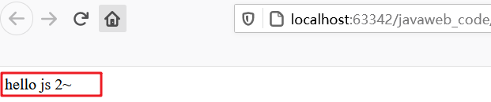

* **使用 console.log() 写入浏览器控制台**

  ```html
  <!DOCTYPE html>
  <html lang="en">
  <head>
      <meta charset="UTF-8">
      <title>Title</title>
  </head>
  <body>
  
  <script>
      console.log("hello js 3");//写入浏览器的控制台
  </script>
  </body>
  </html>
  ```

  上面代码通过浏览器打开，我们可以在不能页面上看到  `console.log(内容)` 输出的内容，它是输出在控制台了，而怎么在控制台查看输出的内容呢？在浏览器界面按 `F12` 就可以看到下图的控制台

  

### 3.3  变量

JavaScript 中用 var 关键字（variable 的缩写）来声明变量。格式 `var 变量名 = 数据值;`。而在JavaScript 是一门弱类型语言，变量==可以存放不同类型的值==；如下在定义变量时赋值为数字数据，还可以将变量的值改为字符串类型的数

```js
var test = 20;
test = "张三";
```

js 中的变量名命名也有如下规则，和java语言基本都相同

* 组成字符可以是任何字母、数字、下划线（_）或美元符号（$）
* 数字不能开头
* 建议使用**驼峰**命名

JavaScript 中 `var` 关键字有点特殊，有以下地方和其他语言不一样

* 作用域：**全局变量**

  ```js
  {
      var age = 20;
  }
  alert(age);  // 在代码块中定义的age 变量，在代码块外边还可以使用
  ```

* 变量可以重复定义

  ```js
  {
      var age = 20;
      var age = 30;//JavaScript 会用 30 将之前 age 变量的 20 替换掉
  }
  alert(age); //打印的结果是 30
  ```

针对如上的问题，==ECMAScript 6 新增了 `let `关键字来定义变量。==它的用法类似于 `var`，但是所声明的变量，只在 `let` 关键字所在的代码块内有效，且不允许重复声明。

例如：

```js
{
    let age = 20;
}
alert(age); 
```

运行上面代码，浏览器并没有弹框输出结果，说明这段代码是有问题的。通过 `F12` 打开开发者模式可以看到如下错误信息


而如果在代码块中定义两个同名的变量，IDEA 开发工具就直接报错了

> 

==ECMAScript 6 新增了 const关键字，用来声明一个只读的常量。一旦声明，常量的值就不能改变。== 通过下面的代码看一下常用的特点就可以了

> 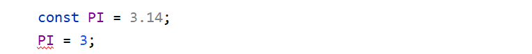

我们可以看到给 PI 这个常量重新赋值时报错了。

### 3.4  数据类型

JavaScript 中提供了两类数据类型：原始类型 和 引用类型。

> 使用 typeof 运算符可以获取数据类型
>
> `alert(typeof age);` 以弹框的形式将 age 变量的数据类型输出

原始数据类型：

* **number**：数字（整数、小数、NaN(Not a Number)）

  ```js
  var age = 20;
  var price = 99.8;
  
  alert(typeof age); // 结果是 ： number
  alert(typeof price);// 结果是 ： number
  ```

  > ==注意：== NaN是一个特殊的number类型的值，后面用到再说

* **string**：字符、字符串，单双引皆可

  ```js
  var ch = 'a';
  var name = '张三'; 
  var addr = "北京";
  
  alert(typeof ch); //结果是  string
  alert(typeof name); //结果是  string
  alert(typeof addr); //结果是  string
  ```

  > ==注意：==在 js 中 双引号和单引号都表示字符串类型的数据

* **boolean**：布尔。true，false

  ```js
  var flag = true;
  var flag2 = false;
  
  alert(typeof flag); //结果是 boolean
  alert(typeof flag2); //结果是 boolean
  ```

* **null**：对象为空

  ```js
   var obj = null;
  
  alert(typeof obj);//结果是 object
  ```

  为什么打印上面的 obj 变量的数据类型，结果是object；这个官方给出了解释，下面是从官方文档截的图

  

* **undefined**：当声明的变量未初始化时，该变量的默认值是 undefined

  ```js
  var a ;
  alert(typeof a); //结果是 undefined
  ```

### 3.5  运算符

JavaScript 提供了如下的运算符。大部分和 Java语言 都是一样的，不同的是 JS 关系运算符中的 `==` 和 `===`，一会我们只演示这两个的区别，其他运算符将不做演示

* 一元运算符：++，--

* 算术运算符：+，-，*，/，%

* 赋值运算符：=，+=，-=…

* 关系运算符：>，<，>=，<=，!=，\==，===…

* 逻辑运算符：&&，||，!

* 三元运算符：条件表达式 ? true_value : false_value 

#### 3.5.1  \==和===区别

**概述:**

* ==：

  1. 判断类型是否一样，如果不一样，则进行==类型转换==

  2. 再去比较其值

* ===：js 中的全等于
  1. 判断类型是否一样，如果不一样，直接返回false
  2. 再去比较其值 

**代码：**

```js
var age1 = 20;
var age2 = "20";

alert(age1 == age2);// true
alert(age1 === age2);// false
```

#### 3.5.2  类型转换

上述讲解 `==` 运算符时，发现会进行类型转换，所以接下来我们来详细的讲解一下 JavaScript 中的类型转换。

* 其他类型转为number

  * string 转换为 number 类型：按照字符串的字面值，转为数字。如果**字面值不是数字，则转为NaN**

    将 string 转换为 number 有两种方式：

    * 使用 `+` 正号运算符：

      ```js
      var str = +"20";
      alert(str + 1) //21
      ```

    * 使用 `parseInt()` 函数(方法)：

      ```js
      var str = "20";
      alert(parseInt(str) + 1);
      ```

    > ==建议使用 `parseInt()` 函数进行转换。==

  * boolean 转换为 number 类型：true 转为1，false转为0

    ```js
    var flag = +false;
    alert(flag); // 0
    ```

* 其他类型转为boolean

  * number 类型转换为 boolean 类型：0和NaN转为false，其他的数字转为true
  * string 类型转换为 boolean 类型：空字符串转为false，其他的字符串转为true
  * null类型转换为 boolean 类型是 false
  * undefined 转换为 boolean 类型是 false

  **代码如下：**

  ```js
  // var flag = 3;
  // var flag = "";
  var flag = undefined;
  
  if(flag){
      alert("转为true");
  }else {
      alert("转为false");
  }
  ```

**使用场景：**

在 Java 中使用字符串前，一般都会先判断字符串不是null，并且不是空字符才会做其他的一些操作，JavaScript也有类型的操作，代码如下：

```js
var str = "abc";

//健壮性判断
if(str != null && str.length > 0){
    alert("转为true");
}else {
    alert("转为false");
}
```

但是由于 JavaScript 会自动进行类型转换，所以上述的判断可以进行简化，代码如下：

```js
var str = "abc";

//健壮性判断
if(str){
    alert("转为true");
}else {
    alert("转为false");
}
```


### 3.6  流程控制语句

JavaScript 中提供了和 Java 一样的流程控制语句，如下

* if 
* switch
* for
* while
* dowhile

#### 3.6.1  if 语句

```js
var count = 3;
if (count == 3) {
    alert(count);
}
```

#### 3.6.2  switch 语句

```js
var num = 3;
switch (num) {
    case 1:
        alert("星期一");
        break;
    case 2:
        alert("星期二");
        break;
    case 3:
        alert("星期三");
        break;
    case 4:
        alert("星期四");
        break;
    case 5:
        alert("星期五");
        break;
    case 6:
        alert("星期六");
        break;
    case 7:
        alert("星期日");
        break;
    default:
        alert("输入的星期有误");
        break;
}
```

#### 3.6.3  for 循环语句

```js
var sum = 0;
for (let i = 1; i <= 100; i++) { //建议for循环小括号中定义的变量使用let
    sum += i;
}
alert(sum);
```

#### 3.6.4  while 循环语句

```js
var sum = 0;
var i = 1;
while (i <= 100) {
    sum += i;
    i++;
}
alert(sum);
```

#### 3.6.5  dowhile 循环语句

```js
var sum = 0;
var i = 1;
do {
    sum += i;
    i++;
}
while (i <= 100);
alert(sum);
```

### 3.7  函数

函数（就是Java中的方法）是被设计为执行特定任务的代码块；JavaScript 函数通过 function 关键词进行定义。

#### 3.7.1  定义格式

函数定义格式有两种：

* 方式1

  ```js
  function 函数名(参数1,参数2..){
      要执行的代码
  }
  ```

* 方式2

  ```js
  var 函数名 = function (参数列表){
      要执行的代码
      return a + b;
  }
  ```

> ==注意：==
>
> * 形式参数不需要类型。因为JavaScript是弱类型语言
>
>   ```js
>   function add(a, b){
>       return a + b;
>   }
>   ```
>
>   上述函数的参数 a 和 b 不需要定义数据类型，因为在每个参数前加上 var 也没有任何意义。
>
> * 返回值也不需要定义类型，可以在函数内部直接使用return返回即可

#### 3.7.2  函数调用

函数调用函数：

```js
函数名称(实际参数列表);
```

eg：

```js
let result = add(10,20);
```

> ==注意：==
>
> * JS中，函数调用可以传递任意个数参数
>
> * 例如  `let result = add(1,2,3);` 
>
>   它是将数据 1 传递给了变量a，将数据 2 传递给了变量 b，而数据 3 没有变量接收。

## 4，JavaScript常用对象

JavaScript 提供了很多对象供使用者来使用。这些对象总共分类三类

* 基本对象

  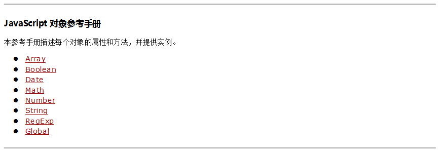

* BOM 对象

  

* DOM对象

  DOM 中的对象就比较多了，下图只是截取部分

  

这小节我们先学习基本对象，而我们先学习 `Array` 数组对象和 `String` 字符串对象。

### 4.1  Array对象

JavaScript Array对象用于定义数组

#### 4.1.1  定义格式

数组的定义格式有两种：

* 方式1

  ```js
  var 变量名 = new Array(元素列表); 
  ```

  例如：

  ```js
  var arr = new Array(1,2,3); //1,2,3 是存储在数组中的数据（元素）
  ```

* 方式2 简化

  ```js
  var 变量名 = [元素列表];
  ```

  例如：

  ```js
  var arr = [1,2,3]; //1,2,3 是存储在数组中的数据（元素）
  ```

  ==注意：Java中的数组静态初始化使用的是{}定义，而 JavaScript 中使用的是 [] 定义==

#### 4.1.2  元素访问

访问数组中的元素和 Java 语言的一样，格式如下：

```js
arr[索引] = 值;
```

**代码演示：**

```js
 // 方式一
var arr = new Array(1,2,3);
// alert(arr);

// 方式二
var arr2 = [1,2,3];
//alert(arr2);

// 访问
arr2[0] = 10;
alert(arr2)
```

#### 4.1.3  特点

JavaScript 中的数组相当于 Java 中集合。数组的**长度是可以变化**的，而 JavaScript  是弱类型，所以可以存储任意的类型的数据。

例如如下代码：

```js
// 变长
var arr3 = [1,2,3];
arr3[10] = 10;
alert(arr3[10]); // 10
alert(arr3[9]);  //undefined
```

上面代码在定义数组中给了三个元素，又给索引是 10 的位置添加了数据 10，那么 `索引3` 到 `索引9` 位置的元素是什么呢？我们之前就介绍了，在 JavaScript 中没有赋值的话，默认就是 `undefined`。

如果给 `arr3` 数组添加字符串的数据，也是可以添加成功的

```js
arr3[5] = "hello";
alert(arr3[5]); // hello
```

#### 4.1.4  属性

Array 对象提供了很多属性，如下图是官方文档截取的

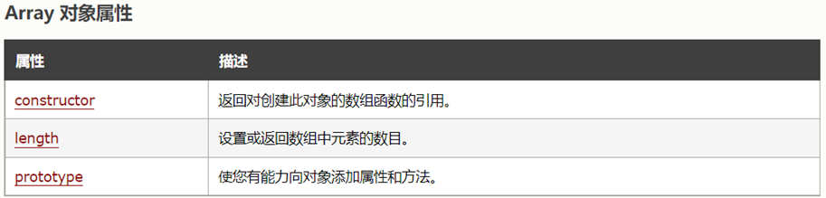

而我们只讲解 `length` 属性，该数组可以动态的获取数组的长度。而有这个属性，我们就可以遍历数组了

```js
var arr = [1,2,3];
for (let i = 0; i < arr.length; i++) {
    alert(arr[i]);
}
```

#### 4.1.5  方法

Array 对象同样也提供了很多方法，如下图是官方文档截取的


而我们在课堂中只演示 `push` 函数和 `splice` 函数。

* push 函数：给数组添加元素，也就是在数组的末尾添加元素

  参数表示要添加的元素

  ```js
  // push:添加方法
  var arr5 = [1,2,3];
  arr5.push(10);
  alert(arr5);  //数组 的元素是 {1,2,3,10}
  ```

* splice 函数：删除元素

  参数1：索引。表示从哪个索引位置删除

  参数2：个数。表示删除几个元素

  ```js
  // splice:删除元素
  var arr5 = [1,2,3];
  arr5.splice(0,1); //从 0 索引位置开始删除，删除一个元素 
  alert(arr5); // {2,3}
  ```

### 4.2  String对象

String对象的创建方式有两种

* 方式1：

  ```js
  var 变量名 = new String(s); 
  ```

* 方式2：

  ```js
  var 变量名 = "数组"; 
  ```

**属性：**

String对象提供了很多属性，下面给大家列举了一个属性 `length` ，该属性是用于动态的获取字符串的长度


**函数：**

String对象提供了很多函数（方法），下面给大家列举了两个方法。


String对象还有一个函数 `trim()` ，该方法在文档中没有体现，但是所有的浏览器都支持；它是用来去掉字符串两端的空格。

代码演示：

```js
var str4 = '  abc   ';
alert(1 + str4 + 1);
```

上面代码会输出内容 `1  abc  1`，很明显可以看到 abc 字符串左右两边是有空格的。接下来使用 `trim()` 函数

```js
var str4 = '  abc   ';
alert(1 + str4.trim() + 1);
```

输出的内容是 `1abc1` 。这就是 `trim()` 函数的作用。

`trim()` 函数在以后开发中还是比较常用的，例如下图所示是登陆界面

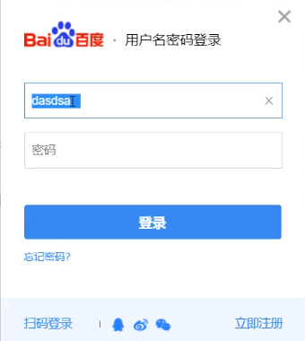 

用户在输入用户名和密码时，可能会习惯的输入一些空格，这样在我们后端程序中判断用户名和密码是否正确，结果肯定是失败。所以我们一般都会对用户输入的字符串数据进行去除前后空格的操作。

### 4.3  自定义对象

在 JavaScript 中自定义对象特别简单，下面就是自定义对象的格式：

```js
var 对象名称 = {
    属性名称1:属性值1,
    属性名称2:属性值2,
    ...,
    函数名称:function (形参列表){},
	...
};
```

调用属性的格式：

```js
对象名.属性名
```

调用函数的格式：

```js
对象名.函数名()
```

接下来通过代码演示一下，让大家体验一下 JavaScript 中自定义对象

```js
var person = {
        name : "zhangsan",
        age : 23,
        eat: function (){
            alert("干饭~");
        }
    };


alert(person.name);  //zhangsan
alert(person.age); //23

person.eat();  //干饭~
```

## 5，BOM

BOM：Browser Object Model 浏览器对象模型。也就是 JavaScript 将浏览器的各个组成部分封装为对象。

我们要操作浏览器的各个组成部分就可以通过操作 BOM 中的对象来实现。比如：我现在想将浏览器地址栏的地址改为 `https://www.itheima.com` 就可以通过使用 BOM 中定义的 `Location` 对象的 `href` 属性，代码： `location.href = "https://itheima.com";` 

 BOM 中包含了如下对象：

* Window：浏览器窗口对象
* Navigator：浏览器对象
* Screen：屏幕对象
* History：历史记录对象
* Location：地址栏对象

下图是 BOM 中的各个对象和浏览器的各个组成部分的对应关系


BOM 中的 `Navigator` 对象和 `Screen` 对象基本不会使用，所以我们的课堂只对 `Window`、`History`、`Location` 对象进行讲解。

### 5.1  Window对象

window 对象是 JavaScript 对浏览器的窗口进行封装的对象。

#### 5.1.1  获取window对象

该对象不需要创建直接使用 `window`，其中 `window. ` 可以省略。比如我们之前使用的 `alert()` 函数，其实就是 `window` 对象的函数，在调用是可以写成如下两种

* 显式使用 `window` 对象调用

  ```js
  window.alert("abc");
  ```

* 隐式调用

  ```
  alert("abc")
  ```

#### 5.1.2  window对象属性

`window` 对象提供了用于获取其他 BOM 组成对象的属性


也就是说，我们想使用 `Location` 对象的话，就可以使用 `window` 对象获取；写成 `window.location`，而 `window.` 可以省略，简化写成 `location` 来获取 `Location` 对象。

#### 5.1.3  window对象函数

`window` 对象提供了很多函数供我们使用，而很多都不常用；下面给大家列举了一些比较常用的函数


> `setTimeout(function,毫秒值)` : 在一定的时间间隔后执行一个function，只执行一次
> `setInterval(function,毫秒值)` :在一定的时间间隔后执行一个function，循环执行

**confirm代码演示：**

```js
// confirm()，点击确定按钮，返回true，点击取消按钮，返回false
var flag = confirm("确认删除？");

alert(flag);
```

下图是 `confirm()` 函数的效果。当我们点击 `确定` 按钮，`flag` 变量值记录的就是 `true` ；当我们点击 `取消` 按钮，`flag` 变量值记录的就是 `false`。


而以后我们在页面删除数据时候如下图每一条数据后都有 `删除` 按钮，有可能是用户的一些误操作，所以对于删除操作需要用户进行再次确认，此时就需要用到 `confirm()` 函数。


**定时器代码演示：**

```js
setTimeout(function (){
    alert("hehe");
},3000);
```

当我们打开浏览器，3秒后才会弹框输出 `hehe`，并且只会弹出一次。

```js
setInterval(function (){
    alert("hehe");
},2000);
```

当我们打开浏览器，每隔2秒都会弹框输出 `hehe`。

#### 5.1.4  案例

**需求：每隔1秒，灯泡切换一次状态**


需求说明：

有如下页面效果，实现定时进行开灯、关灯功能

 

初始页面环境

```html
<!DOCTYPE html>
<html lang="en">
<head>
    <meta charset="UTF-8">
    <title>JavaScript演示</title>
</head>
<body>

<input type="button" onclick="on()" value="开灯">

<input type="button" onclick="off()" value="关灯">

<script>
    function on(){
        document.getElementById('myImage').src='../imgs/on.gif';
    }

    function off(){
        document.getElementById('myImage').src='../imgs/off.gif'
    }

</script>
</body>
</html>
```

代码实现：

```html
<!DOCTYPE html>
<html lang="en">
<head>
    <meta charset="UTF-8">
    <title>JavaScript演示</title>
</head>
<body>

<input type="button" onclick="on()" value="开灯">

<input type="button" onclick="off()" value="关灯">

<script>
    function on(){
        document.getElementById('myImage').src='../imgs/on.gif';
    }

    function off(){
        document.getElementById('myImage').src='../imgs/off.gif'
    }
    
    //定义一个变量，用来记录灯的状态，偶数是开灯状态，奇数是关灯状态
    var x = 0;
    //使用循环定时器
    setInterval(function (){
        if(x % 2 == 0){//表示是偶数，开灯状态，调用 on() 函数
            on();
        }else {  //表示是奇数，关灯状态，调用 off() 函数
            off();
        }
        x ++;//改变变量的值
    },1000);

</script>
</body>
</html>
```

### 5.2  History对象

History 对象是 JavaScript 对历史记录进行封装的对象。

* History 对象的获取

  使用 window.history获取，其中window. 可以省略

* History 对象的函数

  

  这两个函数我们平时在访问其他的一些网站时经常使用对应的效果，如下图

  

  当我们点击向左的箭头，就跳转到前一个访问的页面，这就是 `back()` 函数的作用；当我们点击向右的箭头，就跳转到下一个访问的页面，这就是 `forward()` 函数的作用。

### 5.3  Location对象


Location 对象是 JavaScript 对地址栏封装的对象。可以通过操作该对象，跳转到任意页面。

#### 5.3.1  获取Location对象

使用 window.location获取，其中window. 可以省略

```js
window.location.方法();
location.方法();
```


#### 5.3.2  Location对象属性

Location对象提供了很对属性。以后常用的只有一个属性 `href`


**代码演示：**

```js
alert("要跳转了");
location.href = "https://www.baidu.com";
```

在浏览器首先会弹框显示 `要跳转了`，当我们点击了 `确定` 就会跳转到 百度 的首页。


#### 5.3.3  案例

**需求：3秒跳转到百度首页**

**分析：**

1. 3秒跳转，由此可以确定需要使用到定时器，而只跳转一次，所以使用 `setTimeOut()`
2. 要进行页面跳转，所以需要用到 `location` 对象的 `href` 属性实现

**代码实现：**

```js
document.write("3秒跳转到首页..."); 
setTimeout(function (){
    location.href = "https://www.baidu.com"
},3000);
```

## 6，DOM

### 6.1  概述

DOM：Document Object Model 文档对象模型。也就是 JavaScript 将 HTML 文档的各个组成部分封装为对象。

DOM 其实我们并不陌生，之前在学习 XML 就接触过，只不过 XML 文档中的标签需要我们写代码解析，而 HTML 文档是浏览器解析。封装的对象分为

* Document：整个文档对象
* Element：元素对象
* Attribute：属性对象
* Text：文本对象
* Comment：注释对象

如下图，左边是 HTML 文档内容，右边是 DOM 树


**作用：**

JavaScript 通过 DOM， 就能够对 HTML进行操作了

* 改变 HTML 元素的内容
* 改变 HTML 元素的样式（CSS）
* 对 HTML DOM 事件作出反应
* 添加和删除 HTML 元素

**DOM相关概念：**

DOM 是 W3C（万维网联盟）定义了访问 HTML 和 XML 文档的标准。该标准被分为 3 个不同的部分：

1. 核心 DOM：针对任何结构化文档的标准模型。 XML 和 HTML 通用的标准

   * Document：整个文档对象

   * Element：元素对象

   * Attribute：属性对象

   * Text：文本对象

   * Comment：注释对象

2. XML DOM： 针对 XML 文档的标准模型

3. HTML DOM： 针对 HTML 文档的标准模型

   该标准是在核心 DOM 基础上，对 HTML 中的每个标签都封装成了不同的对象

   * 例如：`` 标签在浏览器加载到内存中时会被封装成 `Image` 对象，同时该对象也是 `Element` 对象。
   * 例如：`<input type='button'>` 标签在浏览器加载到内存中时会被封装成 `Button` 对象，同时该对象也是 `Element` 对象。

### 6.2  获取 Element对象.

HTML 中的 Element 对象可以通过 `Document` 对象获取，而 `Document` 对象是通过 `window` 对象获取。

`Document` 对象中提供了以下获取 `Element` 元素对象的函数

* `getElementById()`：根据id属性值获取，返回单个Element对象
* `getElementsByTagName()`：根据标签名称获取，返回Element对象数组
* `getElementsByName()`：根据name属性值获取，返回Element对象数组
* `getElementsByClassName()`：根据class属性值获取，返回Element对象数组

**代码演示：**

下面有提前准备好的页面：

```html
<!DOCTYPE html>
<html lang="en">
<head>
    <meta charset="UTF-8">
    <title>Title</title>
</head>
<body>
     <br>

    <div class="cls">传智教育</div>   <br>
    <div class="cls">黑马程序员</div> <br>

    <input type="checkbox" name="hobby"> 电影
    <input type="checkbox" name="hobby"> 旅游
    <input type="checkbox" name="hobby"> 游戏
    <br>
    <script>
		//在此处书写js代码
    </script>
</body>
</html>
```

1. 根据 `id` 属性值获取上面的 `img` 元素对象，返回单个对象

   ```js
   var img = document.getElementById("light");
   alert(img);
   ```

   结果如下：

   

   从弹框输出的内容，也可以看出是一个图片元素对象。

2. 根据标签名称获取所有的 `div` 元素对象

   ```js
   var divs = document.getElementsByTagName("div");// 返回一个数组，数组中存储的是 div 元素对象
   // alert(divs.length);  //输出 数组的长度
   //遍历数组
   for (let i = 0; i < divs.length; i++) {
       alert(divs[i]);
   }
   ```

3. 获取所有的满足 `name = 'hobby'` 条件的元素对象

   ```js
   //3. getElementsByName：根据name属性值获取，返回Element对象数组
   var hobbys = document.getElementsByName("hobby");
   for (let i = 0; i < hobbys.length; i++) {
       alert(hobbys[i]);
   }
   ```

4. 获取所有的满足 `class='cls'` 条件的元素对象

   ```js
   //4. getElementsByClassName：根据class属性值获取，返回Element对象数组
   var clss = document.getElementsByClassName("cls");
   for (let i = 0; i < clss.length; i++) { 
       alert(clss[i]);
   }
   ```

### 6.3  HTML Element对象使用

HTML 中的 `Element` 元素对象有很多，不可能全部记住，以后是根据具体的需求查阅文档使用。

下面我们通过具体的案例给大家演示文档的查询和对象的使用；下面提前给大家准备好的页面

```html
<!DOCTYPE html>
<html lang="en">
<head>
    <meta charset="UTF-8">
    <title>Title</title>
</head>
<body>
     <br>

    <div class="cls">传智教育</div>   <br>
    <div class="cls">黑马程序员</div> <br>

    <input type="checkbox" name="hobby"> 电影
    <input type="checkbox" name="hobby"> 旅游
    <input type="checkbox" name="hobby"> 游戏
    <br>
    <script>
        //在此处写js低吗
    </script>
</body>
</html>
```

**需求：**

1. 点亮灯泡

   此案例由于需要改变 `img` 标签 的图片，所以我们查询文档，下图是查看文档的流程：

   

   代码实现：

   ```js
   //1，根据 id='light' 获取 img 元素对象
   var img = document.getElementById("light");
   //2，修改 img 对象的 src 属性来改变图片
   img.src = "../imgs/on.gif";
   ```

2. 将所有的 `div` 标签的标签体内容替换为 `呵呵`

   ```js
   //1，获取所有的 div 元素对象
   var divs = document.getElementsByTagName("div");
   /*
           style:设置元素css样式
           innerHTML：设置元素内容
       */
   //2，遍历数组，获取到每一个 div 元素对象，并修改元素内容
   for (let i = 0; i < divs.length; i++) {
       //divs[i].style.color = 'red';
       divs[i].innerHTML = "呵呵";
   }
   ```

3. 使所有的复选框呈现被选中的状态

   此案例我们需要看 复选框 元素对象有什么属性或者函数是来操作 复选框的选中状态。下图是文档的查看

   

   代码实现：

   ```js
   //1，获取所有的 复选框 元素对象
   var hobbys = document.getElementsByName("hobby");
   //2，遍历数组，通过将 复选框 元素对象的 checked 属性值设置为 true 来改变复选框的选中状态
   for (let i = 0; i < hobbys.length; i++) {
       hobbys[i].checked = true;
   }
   ```

## 7，事件监听

要想知道什么是事件监听，首先先聊聊什么是事件？

HTML 事件是发生在 HTML 元素上的“事情”。比如：页面上的 `按钮被点击`、`鼠标移动到元素之上`、`按下键盘按键` 等都是事件。

事件监听是JavaScript 可以在事件被侦测到时==执行一段逻辑代码。==例如下图当我们点击 `开灯` 按钮，就需要通过 js 代码实现替换图片

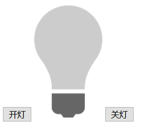

再比如下图输入框，当我们输入了用户名 `光标离开` 输入框，就需要通过 js 代码对输入的内容进行校验，没通过校验就在输入框后提示 `用户名格式有误!`


### 7.1  事件绑定

JavaScript 提供了两种事件绑定方式：

* 方式一：通过 HTML标签中的事件属性进行绑定

  如下面代码，有一个按钮元素，我们是在该标签上定义 `事件属性`，在事件属性中绑定函数。`onclick` 就是 `单击事件` 的事件属性。`onclick='on（）'` 表示该点击事件绑定了一个名为 `on()` 的函数

  ```html
  <input type="butt on" onclick='on()’>
  ```

  下面是点击事件绑定的 `on()` 函数

  ```js
  function on(){
  	alert("我被点了");
  }
  ```

* 方式二：通过 DOM 元素属性绑定

  如下面代码是按钮标签，在该标签上我们并没有使用 `事件属性`，绑定事件的操作需要在 js 代码中实现

  ```html
  <input type="button" id="btn">
  ```

  下面 js 代码是获取了 `id='btn'` 的元素对象，然后==将 `onclick` 作为该对象的属性，并且绑定匿名函数==。该函数是在事件触发后自动执行

  ```js
  document.getElementById("btn").onclick = function (){ 
      alert("我被点了");
  }
  ```

**代码演示：**

```html
<!DOCTYPE html>
<html lang="en">
<head>
    <meta charset="UTF-8">
    <title>Title</title>
</head>
<body>
    <!--方式1：在下面input标签上添加 onclick 属性，并绑定 on() 函数-->
    <input type="button" value="点我" onclick="on()"> <br>
    <input type="button" value="再点我" id="btn">

    <script>
        function on(){
            alert("我被点了");
        }
      	//方式2：获取 id="btn" 元素对象，通过调用 onclick 属性 绑定点击事件
        document.getElementById("btn").onclick = function (){
            alert("我被点了");
        }
    </script>
</body>
</html>
```

### 7.2  常见事件

上面案例中使用到了 `onclick` 事件属性，那都有哪些事件属性供我们使用呢？下面就给大家列举一些比较常用的事件属性

| 事件属性名  | 说明                     |
| ----------- | ------------------------ |
| onclick     | 鼠标单击事件             |
| onblur      | 元素失去焦点             |
| onfocus     | 元素获得焦点             |
| onload      | 某个页面或图像被完成加载 |
| onsubmit    | 当表单提交时触发该事件   |
| onmouseover | 鼠标被移到某元素之上     |
| onmouseout  | 鼠标从某元素移开         |

* `onfocus` 获得焦点事件。

  如下图，当点击了输入框后，输入框就获得了焦点。而下图示例是当获取焦点后会更改输入框的背景颜色。

  

* `onblur  ` 失去焦点事件。

  如下图，当点击了输入框后，输入框就获得了焦点；再点击页面其他位置，那输入框就失去焦点了。下图示例是将输入的文本转换为大写。

  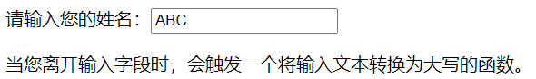

* `onmouseout  ` 鼠标移出事件。

* `onmouseover  `  鼠标移入事件。

  如下图，当鼠标移入到 苹果 图片上时，苹果图片变大；当鼠标移出 苹果图片时，苹果图片变小。

  

* `onsubmit  ` 表单提交事件

  如下是带有表单的页面

  ```html
  <!DOCTYPE html>
  <html lang="en">
  <head>
      <meta charset="UTF-8">
      <title>Title</title>
  </head>
  <body>
      <form id="register" action="#" >
          <input type="text" name="username" />
          <input type="submit" value="提交">
      </form>
      <script>
          
      </script>
  </body>
  </html>
  ```

  如上代码的表单，当我们点击 `提交` 按钮后，表单就会提交，此处默认使用的是 `GET` 提交方式，会将提交的数据拼接到 URL 后。现需要通过 js 代码实现阻止表单提交的功能，js 代码实现如下：

  1. 获取 `form` 表单元素对象。
  2. 给 `form` 表单元素对象绑定 `onsubmit` 事件，并绑定匿名函数。
  3. 该匿名函数如果返回的是true，提交表单；如果返回的是false，阻止表单提交。

  ```js
  document.getElementById("register").onsubmit = function (){
      //onsubmit 返回true，则表单会被提交，返回false，则表单不提交
      return true;
  }
  ```

## 8，表单验证案例

### 8.1  需求


有如下注册页面，对表单进行校验，如果输入的用户名、密码、手机号符合规则，则允许提交；如果不符合规则，则不允许提交。

完成以下需求：

1. 当输入框失去焦点时，验证输入内容是否符合要求

2. 当点击注册按钮时，判断所有输入框的内容是否都符合要求，如果不合符则阻止表单提交

### 8.2  环境准备

下面是初始页面

```html
<!DOCTYPE html>
<html lang="en">
<head>
    <meta charset="UTF-8">
    <title>欢迎注册</title>
    <link href="../css/register.css" rel="stylesheet">
</head>
<body>
    <div class="form-div">
        <div class="reg-content">
            <h1>欢迎注册</h1>
            <span>已有帐号？</span> <a href="#">登录</a>
        </div>
        <form id="reg-form" action="#" method="get">
            <table>
                <tr>
                    <td>用户名</td>
                    <td class="inputs">
                        <input name="username" type="text" id="username">
                        <br>
                        <span id="username_err" class="err_msg" style="display: none">用户名不太受欢迎</span>
                    </td>
                </tr>

                <tr>
                    <td>密码</td>
                    <td class="inputs">
                        <input name="password" type="password" id="password">
                        <br>
                        <span id="password_err" class="err_msg" style="display: none">密码格式有误</span>
                    </td>
                </tr>

                <tr>
                    <td>手机号</td>
                    <td class="inputs"><input name="tel" type="text" id="tel">
                        <br>
                        <span id="tel_err" class="err_msg" style="display: none">手机号格式有误</span>
                    </td>
                </tr>
            </table>
            <div class="buttons">
                <input value="注 册" type="submit" id="reg_btn">
            </div>
            <br class="clear">
        </form>

    </div>


    <script>

    </script>
</body>
</html>
```

### 8.3  验证输入框

此小节完成如下功能：

* 校验用户名。当用户名输入框失去焦点时，判断输入的内容是否符合 `长度是 6-12 位` 规则，不符合使 `id='username_err'` 的span标签显示出来，给出用户提示。
* 校验密码。当密码输入框失去焦点时，判断输入的内容是否符合 `长度是 6-12 位` 规则，不符合使 `id='password_err'` 的span标签显示出来，给出用户提示。
* 校验手机号。当手机号输入框失去焦点时，判断输入的内容是否符合 `长度是 11 位` 规则，不符合使 `id='tel_err'` 的span标签显示出来，给出用户提示。

代码如下：

```js
//1. 验证用户名是否符合规则
//1.1 获取用户名的输入框
var usernameInput = document.getElementById("username");

//1.2 绑定onblur事件 失去焦点 
usernameInput.onblur = function () {
    //1.3 获取用户输入的用户名
    var username = usernameInput.value.trim();

    //1.4 判断用户名是否符合规则：长度 6~12
    if (username.length >= 6 && username.length <= 12) {
        //符合规则
        document.getElementById("username_err").style.display = 'none';
    } else {
        //不合符规则
        document.getElementById("username_err").style.display = '';
    }
}

//1. 验证密码是否符合规则
//1.1 获取密码的输入框
var passwordInput = document.getElementById("password");

//1.2 绑定onblur事件 失去焦点
passwordInput.onblur = function() {
    //1.3 获取用户输入的密码
    var password = passwordInput.value.trim();

    //1.4 判断密码是否符合规则：长度 6~12
    if (password.length >= 6 && password.length <= 12) {
        //符合规则
        document.getElementById("password_err").style.display = 'none';
    } else {
        //不合符规则
        document.getElementById("password_err").style.display = '';
    }
}

//1. 验证手机号是否符合规则
//1.1 获取手机号的输入框
var telInput = document.getElementById("tel");

//1.2 绑定onblur事件 失去焦点
telInput.onblur = function() {
    //1.3 获取用户输入的手机号
    var tel = telInput.value.trim();

    //1.4 判断手机号是否符合规则：长度 11
    if (tel.length == 11) {
        //符合规则
        document.getElementById("tel_err").style.display = 'none';
    } else {
        //不合符规则
        document.getElementById("tel_err").style.display = '';
    }
}
```

### 8.3  验证表单

当用户点击 `注册` 按钮时，需要同时对输入的 `用户名`、`密码`、`手机号` ，如果都符合规则，则提交表单；如果有一个不符合规则，则不允许提交表单。实现该功能需要获取表单元素对象，并绑定 `onsubmit` 事件

```js
//1. 获取表单对象
var regForm = document.getElementById("reg-form");

//2. 绑定onsubmit 事件
regForm.onsubmit = function () {
    
}
```

`onsubmit` 事件绑定的函数需要对输入的 `用户名`、`密码`、`手机号` 进行校验，这些校验我们之前都已经实现过了，这里我们还需要再校验一次吗？不需要，只需要对之前校验的代码进行改造，把每个校验的代码专门抽象到有名字的函数中，方便调用；并且每个函数都要返回结果来去决定是提交表单还是阻止表单提交，代码如下：

```js
//1. 验证用户名是否符合规则
//1.1 获取用户名的输入框
var usernameInput = document.getElementById("username");

//1.2 绑定onblur事件 失去焦点
usernameInput.onblur = checkUsername;

function checkUsername() {
    //1.3 获取用户输入的用户名
    var username = usernameInput.value.trim();

    //1.4 判断用户名是否符合规则：长度 6~12
    var flag = username.length >= 6 && username.length <= 12;
    if (flag) {
        //符合规则
        document.getElementById("username_err").style.display = 'none';
    } else {
        //不合符规则
        document.getElementById("username_err").style.display = '';
    }
    return flag;
}

//1. 验证密码是否符合规则
//1.1 获取密码的输入框
var passwordInput = document.getElementById("password");

//1.2 绑定onblur事件 失去焦点
passwordInput.onblur = checkPassword;

function checkPassword() {
    //1.3 获取用户输入的密码
    var password = passwordInput.value.trim();

    //1.4 判断密码是否符合规则：长度 6~12
    var flag = password.length >= 6 && password.length <= 12;
    if (flag) {
        //符合规则
        document.getElementById("password_err").style.display = 'none';
    } else {
        //不合符规则
        document.getElementById("password_err").style.display = '';
    }
    return flag;
}

//1. 验证手机号是否符合规则
//1.1 获取手机号的输入框
var telInput = document.getElementById("tel");

//1.2 绑定onblur事件 失去焦点
telInput.onblur = checkTel;

function checkTel() {
    //1.3 获取用户输入的手机号
    var tel = telInput.value.trim();

    //1.4 判断手机号是否符合规则：长度 11
    var flag = tel.length == 11;
    if (flag) {
        //符合规则
        document.getElementById("tel_err").style.display = 'none';
    } else {
        //不合符规则
        document.getElementById("tel_err").style.display = '';
    }
    return flag;
}
```

而 `onsubmit` 绑定的函数需要调用 `checkUsername()` 函数、`checkPassword()` 函数、`checkTel()` 函数。

```js
//1. 获取表单对象
var regForm = document.getElementById("reg-form");

//2. 绑定onsubmit 事件
regForm.onsubmit = function () {
    //挨个判断每一个表单项是否都符合要求，如果有一个不合符，则返回false

    var flag = checkUsername() && checkPassword() && checkTel();

    return flag;
}
```

## 9，RegExp对象

RegExp 是正则对象。正则对象是判断指定字符串是否符合规则。

如下图是百度贴吧中的帖子

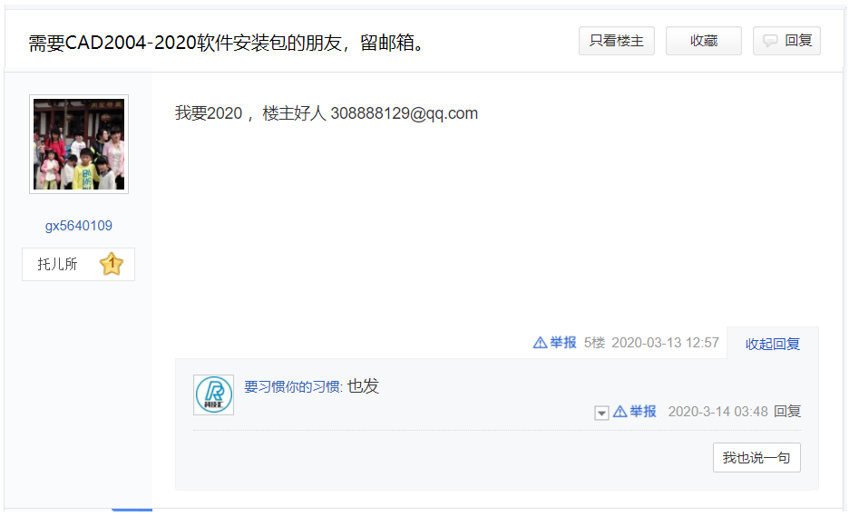

我们可以通过爬虫技术去爬取该页面源代码，然后获取页面中所有的邮箱，后期我们可以给这些邮箱地址发送推广的邮件。那么问题来了，如何才能知道页面内容中哪些事邮箱地址呢？这里就可以使用正则表达式来匹配邮箱。

在 js 中对正则表达式封装的对象就是正则对象。

### 9.1  正则对象使用

#### 9.1.1  创建对象

正则对象有两种创建方式：

* 直接量方式：注意不要加引号

  ```js
  var reg = /正则表达式/;
  ```

* 创建 RegExp 对象

  ```js
  var reg = new RegExp("正则表达式");
  ```

#### 9.1.2  函数

`test(str)` ：判断指定字符串是否符合规则，返回 true或 false

### 9.2  正则表达式

从上面创建正则对象的格式中可以看出不管哪种方式都需要正则表达式，那么什么是正则表达式呢？

正则表达式定义了字符串组成的规则。也就是判断指定的字符串是否符合指定的规则，如果符合返回true，如果不符合返回false。

正则表达式是和语言无关的。很多语言都支持正则表达式，Java语言也支持，只不过正则表达式在不同的语言中的使用方式不同，js 中需要使用正则对象来使用正则表达式。

正则表达式常用的规则如下：

* ^：表示开始

* $：表示结束

* [ ]：代表某个范围内的单个字符，比如： [0-9] 单个数字字符

* .：代表任意单个字符，除了换行和行结束符

* \w：代表单词字符：字母、数字、下划线(_)，相当于 [A-Za-z0-9_]

* \d：代表数字字符： 相当于 [0-9]

量词：

* +：至少一个

* *：零个或多个

* ？：零个或一个

* {x}：x个

* {m,}：至少m个

* {m,n}：至少m个，最多n个

**代码演示：**

```js
// 规则：单词字符，6~12
//1,创建正则对象，对正则表达式进行封装
var reg = /^\w{6,12}$/;

var str = "abcccc";
//2,判断 str 字符串是否符合 reg 封装的正则表达式的规则
var flag = reg.test(str);
alert(flag);
```

### 9.3  改进表单校验案例

表单校验案例中的规则是我们进行一系列的判断来实现的，现在学习了正则对象后，就可以使用正则对象来改进这个案例。

```html
<!DOCTYPE html>
<html lang="en">
<head>
    <meta charset="UTF-8">
    <title>欢迎注册</title>
    <link href="../css/register.css" rel="stylesheet">
</head>
<body>

<div class="form-div">
    <div class="reg-content">
        <h1>欢迎注册</h1>
        <span>已有帐号？</span> <a href="#">登录</a>
    </div>
    <form id="reg-form" action="#" method="get">

        <table>

            <tr>
                <td>用户名</td>
                <td class="inputs">
                    <input name="username" type="text" id="username">
                    <br>
                    <span id="username_err" class="err_msg" style="display: none">用户名不太受欢迎</span>
                </td>

            </tr>

            <tr>
                <td>密码</td>
                <td class="inputs">
                    <input name="password" type="password" id="password">
                    <br>
                    <span id="password_err" class="err_msg" style="display: none">密码格式有误</span>
                </td>
            </tr>


            <tr>
                <td>手机号</td>
                <td class="inputs"><input name="tel" type="text" id="tel">
                    <br>
                    <span id="tel_err" class="err_msg" style="display: none">手机号格式有误</span>
                </td>
            </tr>

        </table>

        <div class="buttons">
            <input value="注 册" type="submit" id="reg_btn">
        </div>
        <br class="clear">
    </form>

</div>


<script>

    //1. 验证用户名是否符合规则
    //1.1 获取用户名的输入框
    var usernameInput = document.getElementById("username");

    //1.2 绑定onblur事件 失去焦点
    usernameInput.onblur = checkUsername;

    function checkUsername() {
        //1.3 获取用户输入的用户名
        var username = usernameInput.value.trim();

        //1.4 判断用户名是否符合规则：长度 6~12,单词字符组成
        var reg = /^\w{6,12}$/;
        var flag = reg.test(username);

        //var flag = username.length >= 6 && username.length <= 12;
        if (flag) {
            //符合规则
            document.getElementById("username_err").style.display = 'none';
        } else {
            //不合符规则
            document.getElementById("username_err").style.display = '';
        }
        return flag;
    }

    //1. 验证密码是否符合规则
    //1.1 获取密码的输入框
    var passwordInput = document.getElementById("password");

    //1.2 绑定onblur事件 失去焦点
    passwordInput.onblur = checkPassword;

    function checkPassword() {
        //1.3 获取用户输入的密码
        var password = passwordInput.value.trim();

        //1.4 判断密码是否符合规则：长度 6~12
        var reg = /^\w{6,12}$/;
        var flag = reg.test(password);

        //var flag = password.length >= 6 && password.length <= 12;
        if (flag) {
            //符合规则
            document.getElementById("password_err").style.display = 'none';
        } else {
            //不合符规则
            document.getElementById("password_err").style.display = '';
        }
        return flag;
    }

    //1. 验证手机号是否符合规则
    //1.1 获取手机号的输入框
    var telInput = document.getElementById("tel");

    //1.2 绑定onblur事件 失去焦点
    telInput.onblur = checkTel;

    function checkTel() {
        //1.3 获取用户输入的手机号
        var tel = telInput.value.trim();

        //1.4 判断手机号是否符合规则：长度 11，数字组成，第一位是1
        //var flag = tel.length == 11;
        var reg = /^[1]\d{10}$/;
        var flag = reg.test(tel);
        if (flag) {
            //符合规则
            document.getElementById("tel_err").style.display = 'none';
        } else {
            //不合符规则
            document.getElementById("tel_err").style.display = '';
        
        return flag;
    }

    //1. 获取表单对象
    var regForm = document.getElementById("reg-form");

    //2. 绑定onsubmit 事件
    regForm.onsubmit = function () {
        //挨个判断每一个表单项是否都符合要求，如果有一个不合符，则返回false

        var flag = checkUsername() && checkPassword() && checkTel();

        return flag;
    }
</script>
</body>
</html>
```


# day08 HTTP&Tomcat&Servlet

**今日目标：**

> * 了解JavaWeb开发的技术栈
> * 理解HTTP协议和HTTP请求与响应数据的格式
> * 掌握Tomcat的使用
> * 掌握在IDEA中使用Tomcat插件
> * 理解Servlet的执行流程和生命周期
> * 掌握Servlet的使用和相关配置

## 1，Web概述

### 1.1 Web和JavaWeb的概念

==Web是全球广域网，也称为万维网(www)，能够通过浏览器访问的网站。==
在我们日常的生活中，经常会使用浏览器去访问`百度`、`京东`、`传智官网`等这些网站，这些网站统称为Web网站。如下就是通过浏览器访问传智官网的界面: 

我们知道了什么是Web，那么JavaWeb又是什么呢？顾名思义==JavaWeb就是用Java技术来解决相关web互联网领域的技术栈。==
等学习完JavaWeb之后，同学们就可以使用Java语言开发我们上述所说的网站。而国内很多大型网站公司也是首选Java语言来解决web互联网相关的问题。那都有哪些公司的系统是使用Java语言的呢?
 
使用Java语言开发互联网系统是有很多技术栈需要大家了解，具体都有哪些呢?

### 1.2 JavaWeb技术栈

了解JavaWeb技术栈之前，有一个很重要的概念要介绍。

#### 1.2.1 B/S架构

什么是B/S架构?
B/S 架构：Browser/Server，浏览器/服务器 架构模式，它的特点是，客户端只需要浏览器，应用程序的逻辑和数据都存储在服务器端。浏览器只需要请求服务器，获取Web资源，服务器把Web资源发送给浏览器即可。大家可以通过下面这张图来回想下我们平常的上网过程:


* 打开浏览器访问百度首页，输入要搜索的内容，点击回车或百度一下，就可以获取和搜索相关的内容
* 思考下搜索的内容并不在我们自己的点上，那么这些内容从何而来？答案很明显是从百度服务器返回给我们的
* 日常百度的小细节x，逢年过节百度的logo会更换不同的图片，服务端发生变化，客户端不需做任务事情就能获取最新内容
* 所以说B/S架构的好处:易于维护升级：服务器端升级后，客户端无需任何部署就可以使用到新的版本。
  了解了什么是B/S架构后，作为后台开发工程师的我们将来主要关注的是服务端的开发和维护工作。在服务端将来会放很多资源,都有哪些资源呢?

#### 1.2.2 静态资源

* 静态资源主要包含HTML、CSS、JavaScript、图片等，主要负责页面的展示。
* 我们之前已经学过前端网页制作`三剑客`(HTML+CSS+JavaScript),使用这些技术我们就可以制作出效果比较丰富的网页，将来展现给用户。但是由于做出来的这些内容都是静态的，这就会导致所有的人看到的内容将是一模一样。
* 在日常上网的过程中，我们除了看到这些好看的页面以外，还会碰到很多动态内容，比如我们常见的百度登录效果:
  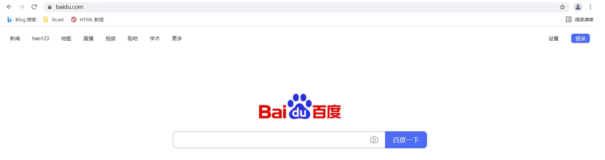
  `张三`登录以后在网页的右上角看到的是 `张三`，而`李四`登录以后看到的则是`李四`。所以不同的用户访问相同的资源看到的内容大多数是不一样的，要想实现这样的效果，光靠静态资源是无法实现的。

#### 1.2.3 动态资源

* 动态资源主要包含Servlet、JSP等，主要用来负责逻辑处理。
* 动态资源处理完逻辑后会把得到的结果交给静态资源来进行展示，动态资源和静态资源要结合一起使用。
* 动态资源虽然可以处理逻辑，但是当用户来登录百度的时候，就需要输入`用户名`和`密码`,这个时候我们就又需要解决的一个问题是，用户在注册的时候填入的用户名和密cc码、以及我们经常会访问到一些数据列表的内容展示(如下图所示)，这些数据都存储在哪里?我们需要的时候又是从哪里来取呢?
  

#### 1.2.4 数据库

* 数据库主要负责存储数据。
* 整个Web的访问过程就如下图所示:
  
  (1)浏览器发送一个请求到服务端，去请求所需要的相关资源;
  (2)资源分为动态资源和静态资源,动态资源可以是使用Java代码按照Servlet和JSP的规范编写的内容;
  (3)在Java代码可以进行业务处理也可以从数据库中读取数据;
  (4)拿到数据后，把数据交给HTML页面进行展示,再结合CSS和JavaScript使展示效果更好;
  (5)服务端将静态资源响应给浏览器;
  (6)浏览器将这些资源进行解析;
  (7)解析后将效果展示在浏览器，用户就可以看到最终的结果。
  在整个Web的访问过程中，会设计到很多技术，这些技术有已经学习过的，也有还未涉及到的内容，都有哪些还没有涉及到呢?

#### 1.2.5 HTTP协议

* HTTP协议:主要定义通信规则
* 浏览器发送请求给服务器，服务器响应数据给浏览器，这整个过程都需要遵守一定的规则，之前大家学习过TCP、UDP，这些都属于规则，这里我们需要使用的是HTTP协议，这也是一种规则。

#### 1.2.6 Web服务器

* Web服务器:负责解析 HTTP 协议，解析请求数据，并发送响应数据
* 浏览器按照HTTP协议发送请求和数据，后台就需要一个Web服务器软件来根据HTTP协议解析请求和数据，然后把处理结果再按照HTTP协议发送给浏览器
* Web服务器软件有很多，我们课程中将学习的是目前最为常用的==Tomcat==服务器

到这为止，关于JavaWeb中用到的技术栈我们就介绍完了，这里面就只有HTTP协议、Servlet、JSP以及Tomcat这些知识是没有学习过的，所以整个Web核心主要就是来学习这些技术。

### 1.3 Web核心课程安排


整个Web核心，我们总共有六天的学习内容，分别是:

* 第一天：HTTP、Tomcat、Servlet
* 第二天：Request(请求)、Response(响应)
* 第三天：JSP、会话技术(Cookie、Session)
* 第四天：Filter(过滤器)、Listener(监听器)
* 第五天：Ajax、Vue、ElementUI
* 第六天：综合案例

(1)Request是从客户端向服务端发出的请求对象，

(2)Response是从服务端响应给客户端的结果对象，

(3)JSP是动态网页技术,

(4)会话技术是用来存储客户端和服务端交互所产生的数据，

(5)过滤器是用来拦截客户端的请求,

(6)监听器是用来监听特定事件,

(7)Ajax、Vue、ElementUI都是属于前端技术

这些技术都该如何来使用，我们后面会一个个进行详细的讲解。接下来我们来学习下HTTP、Tomcat和Servlet。 

## 2, HTTP

### 2.1 简介

**HTTP概念**

HyperText Transfer Protocol，超文本传输协议，规定了浏览器和服务器之间==数据传输的规则==。

* 数据传输的规则指的是请求数据和响应数据需要按照指定的格式进行传输。
* 如果想知道具体的格式，可以打开浏览器，点击`F12`打开开发者工具，点击`Network`来查看某一次请求的请求数据和响应数据具体的格式内容，如下图所示:


> 注意:在浏览器中如果看不到上述内容，需要清除浏览器的浏览数据。chrome浏览器可以使用ctrl+shift+Del进行清除。

==所以学习HTTP主要就是学习请求和响应数据的具体格式内容。==

**HTTP协议特点**

HTTP协议有它自己的一些特点，分别是:

* 基于TCP协议: 面向连接，安全

  TCP是一种面向连接的(建立连接之前是需要经过三次握手)、可靠的、基于字节流的传输层通信协议，在数据传输方面更安全。

* 基于请求-响应模型的:一次请求对应一次响应

  请求和响应是一一对应关系

* HTTP协议是无状态协议:对于事物处理没有记忆能力。每次请求-响应都是独立的

  无状态指的是客户端发送HTTP请求给服务端之后，服务端根据请求响应数据，响应完后，不会记录任何信息。这种特性有优点也有缺点，

  * 缺点:多次请求间不能共享数据
  * 优点:速度快

  请求之间无法共享数据会引发的问题，如:

  * 京东购物，`加入购物车`和`去购物车结算`是两次请求，
  * HTTP协议的无状态特性，加入购物车请求响应结束后，并未记录加入购物车是何商品
  * 发起去购物车结算的请求后，因为无法获取哪些商品加入了购物车，会导致此次请求无法正确展示数据

  具体使用的时候，我们发现京东是可以正常展示数据的，原因是Java早已考虑到这个问题，并提出了使用`会话技术(Cookie、Session)`来解决这个问题。具体如何来做，我们后面会详细讲到。刚才提到HTTP协议是规定了请求和响应数据的格式，那具体的格式是什么呢?

### 2.2 请求数据格式

#### 2.2.1 格式介绍

请求数据总共分为三部分内容，分别是==请求行==、==请求头==、==请求体==


* 请求行: HTTP请求中的第一行数据，请求行包含三块内容，分别是 GET[请求方式] /[请求URL路径] HTTP/1.1[HTTP协议及版本]

  请求方式有七种,最常用的是GET和POST

* 请求头: 第二行开始，格式为key: value形式

  请求头中会包含若干个属性，常见的HTTP请求头有:

  ```
  Host: 表示请求的主机名
  User-Agent: 浏览器版本,例如Chrome浏览器的标识类似Mozilla/5.0 ...Chrome/79，IE浏览器的标识类似Mozilla/5.0 (Windows NT ...)like Gecko；
  Accept：表示浏览器能接收的资源类型，如text/*，image/*或者*/*表示所有；
  Accept-Language：表示浏览器偏好的语言，服务器可以据此返回不同语言的网页；
  Accept-Encoding：表示浏览器可以支持的压缩类型，例如gzip, deflate等。
  ```

   ==这些数据有什么用处?==

  举例说明:服务端可以根据请求头中的内容来获取客户端的相关信息，有了这些信息服务端就可以处理不同的业务需求，比如:

  * 不同浏览器解析HTML和CSS标签的结果会有不一致，所以就会导致相同的代码在不同的浏览器会出现不同的效果
  * 服务端根据客户端请求头中的数据获取到客户端的浏览器类型，就可以根据不同的浏览器设置不同的代码来达到一致的效果
  * 这就是我们常说的浏览器兼容问题

* 请求体: POST请求的最后一部分，存储请求参数

  

  如上图红线框的内容就是请求体的内容，请求体和请求头之间是有一个空行隔开。此时浏览器发送的是POST请求，为什么不能使用GET呢?这时就需要回顾GET和POST两个请求之间的区别了:

  * GET请求请求参数在请求行中，没有请求体，POST请求请求参数在请求体中
  * GET请求请求参数大小有限制，POST没有

#### 2.2.2 实例演示

把 `代码\http` 拷贝到IDEA的工作目录中，比如`D:\workspace\web`目录，


使用IDEA打开


打开后，可以点击项目中的`html\19-表单验证.html`，使用浏览器打开，通过修改页面中form表单的method属性来测试GET请求和POST请求的参数携带方式。


**小结**:

1. 请求数据中包含三部分内容，分别是请求行、请求头和请求体

2. POST请求数据在请求体中，GET请求数据在请求行上

### 2.3 响应数据格式

#### 2.3.1 格式介绍

响应数据总共分为三部分内容，分别是==响应行==、==响应头==、==响应体==


* 响应行：响应数据的第一行,响应行包含三块内容，分别是 HTTP/1.1[HTTP协议及版本] 200[响应状态码] ok[状态码的描述]

* 响应头：第二行开始，格式为key：value形式

  响应头中会包含若干个属性，常见的HTTP响应头有:

  ```
  Content-Type：表示该响应内容的类型，例如text/html，image/jpeg；
  Content-Length：表示该响应内容的长度（字节数）；
  Content-Encoding：表示该响应压缩算法，例如gzip；
  Cache-Control：指示客户端应如何缓存，例如max-age=300表示可以最多缓存300秒
  ```

* 响应体： 最后一部分。存放响应数据

  上图中<html>...</html>这部分内容就是响应体，它和响应头之间有一个空行隔开。

#### 2.3.2 响应状态码

参考: 资料/1.HTTP/《响应状态码.md》

关于响应状态码，我们先主要认识三个状态码，其余的等后期用到了再去掌握:

* 200  ok 客户端请求成功
* 404  Not Found 请求资源不存在
* 500 Internal Server Error 服务端发生不可预期的错误

#### 2.3.3 自定义服务器

在前面我们导入到IDEA中的http项目中，有一个Server.java类，这里面就是自定义的一个服务器代码，主要使用到的是`ServerSocket`和`Socket`

```java
package com.itheima;

import sun.misc.IOUtils;

import java.io.*;
import java.net.ServerSocket;
import java.net.Socket;
import java.nio.charset.StandardCharsets;
import java.nio.file.Files;
/*
    自定义服务器
 */
public class Server {
    public static void main(String[] args) throws IOException {
        ServerSocket ss = new ServerSocket(8080); // 监听指定端口
        System.out.println("server is running...");
        while (true){
            Socket sock = ss.accept();
            System.out.println("connected from " + sock.getRemoteSocketAddress());
            Thread t = new Handler(sock);
            t.start();
        }
    }
}

class Handler extends Thread {
    Socket sock;

    public Handler(Socket sock) {
        this.sock = sock;
    }

    public void run() {
        try (InputStream input = this.sock.getInputStream()) {
            try (OutputStream output = this.sock.getOutputStream()) {
                handle(input, output);
            }
        } catch (Exception e) {
            try {
                this.sock.close();
            } catch (IOException ioe) {
            }
            System.out.println("client disconnected.");
        }
    }

    private void handle(InputStream input, OutputStream output) throws IOException {
        BufferedReader reader = new BufferedReader(new InputStreamReader(input, StandardCharsets.UTF_8));
        BufferedWriter writer = new BufferedWriter(new OutputStreamWriter(output, StandardCharsets.UTF_8));
        // 读取HTTP请求:
        boolean requestOk = false;
        String first = reader.readLine();
        if (first.startsWith("GET / HTTP/1.")) {
            requestOk = true;
        }
        for (;;) {
            String header = reader.readLine();
            if (header.isEmpty()) { // 读取到空行时, HTTP Header读取完毕
                break;
            }
            System.out.println(header);
        }
        System.out.println(requestOk ? "Response OK" : "Response Error");
        if (!requestOk) {
            // 发送错误响应:
            writer.write("HTTP/1.0 404 Not Found\r\n");
            writer.write("Content-Length: 0\r\n");
            writer.write("\r\n");
            writer.flush();
        } else {
            // 发送成功响应:

            //读取html文件，转换为字符串
            BufferedReader br = new BufferedReader(new FileReader("http/html/a.html"));
            StringBuilder data = new StringBuilder();
            String line = null;
            while ((line = br.readLine()) != null){
                data.append(line);
            }
            br.close();
            int length = data.toString().getBytes(StandardCharsets.UTF_8).length;

            writer.write("HTTP/1.1 200 OK\r\n");
            writer.write("Connection: keep-alive\r\n");
            writer.write("Content-Type: text/html\r\n");
            writer.write("Content-Length: " + length + "\r\n");
            writer.write("\r\n"); // 空行标识Header和Body的分隔
            writer.write(data.toString());
            writer.flush();
        }
    }
}
```

上面代码，大家不需要自己写，主要通过上述代码，只需要大家了解到服务器可以使用java完成编写，是可以接受页面发送的请求和响应数据给前端浏览器的，真正用到的Web服务器，我们不会自己写，都是使用目前比较流行的web服务器，比如==Tomcat==

**小结**

1. 响应数据中包含三部分内容，分别是响应行、响应头和响应体

2. 掌握200，404，500这三个响应状态码所代表含义，分布是成功、所访问资源不存在和服务的错误

## 3, Tomcat

### 3.1 简介

#### 3.1.1 什么是Web服务器

Web服务器是一个应用程序（==软件==），对HTTP协议的操作进行封装，使得程序员不必直接对协议进行操作，让Web开发更加便捷。主要功能是"提供网上信息浏览服务"。


 Web服务器是安装在服务器端的一款软件，将来我们把自己写的Web项目部署到Web Tomcat服务器软件中，当Web服务器软件启动后，部署在Web服务器软件中的页面就可以直接通过浏览器来访问了。

**Web服务器软件使用步骤**

* 准备静态资源
* 下载安装Web服务器软件
* 将静态资源部署到Web服务器上
* 启动Web服务器使用浏览器访问对应的资源

上述内容在演示的时候，使用的是Apache下的Tomcat软件，至于Tomcat软件如何使用，后面会详细的讲到。而对于Web服务器来说，实现的方案有很多，Tomcat只是其中的一种，而除了Tomcat以外，还有很多优秀的Web服务器，比如:


Tomcat就是一款软件，我们主要是以学习如何去使用为主。具体我们会从以下这些方向去学习:

1. 简介: 初步认识下Tomcat

2. 基本使用: 安装、卸载、启动、关闭、配置和项目部署，这些都是对Tomcat的基本操作

3. IDEA中如何创建Maven Web项目

4. IDEA中如何使用Tomcat,后面这两个都是我们以后开发经常会用到的方式

首选我们来认识下Tomcat。

**Tomcat**

Tomcat的相关概念:

* Tomcat是Apache软件基金会一个核心项目，是一个开源免费的轻量级Web服务器，支持Servlet/JSP少量JavaEE规范。

* 概念中提到了JavaEE规范，那什么又是JavaEE规范呢?

  JavaEE: Java Enterprise Edition,Java企业版。指Java企业级开发的技术规范总和。包含13项技术规范:JDBC、JNDI、EJB、RMI、JSP、Servlet、XML、JMS、Java IDL、JTS、JTA、JavaMail、JAF。

* 因为Tomcat支持Servlet/JSP规范，所以Tomcat也被称为Web容器、Servlet容器。Servlet需要依赖Tomcat才能运行。

* Tomcat的官网: https://tomcat.apache.org/ 从官网上可以下载对应的版本进行使用。

**Tomcat的LOGO**


**小结**

通过这一节的学习，我们需要掌握以下内容:

1. Web服务器的作用

> 封装HTTP协议操作，简化开发
>
> 可以将Web项目部署到服务器中，对外提供网上浏览服务

2. Tomcat是一个轻量级的Web服务器，支持Servlet/JSP少量JavaEE规范，也称为Web容器，Servlet容器。

### 3.2 基本使用

Tomcat总共分两部分学习，先来学习Tomcat的基本使用，包括Tomcat的==下载、安装、卸载、启动和关闭==。

#### 3.2.1 下载

直接从官网下载


大家可以自行下载，也可以直接使用资料中已经下载好的资源，

Tomcat的软件程序  资料/2. Tomcat/apache-tomcat-8.5.68-windows-x64.zip

Tomcat的源码	资料/2. Tomcat/tomcat源码/apache-tomcat-8.5.68-src.zip

#### 3.2.2 安装

Tomcat是绿色版,直接解压即可

* 在D盘的software目录下，将`apache-tomcat-8.5.68-windows-x64.zip`进行解压缩，会得到一个`apache-tomcat-8.5.68`的目录，Tomcat就已经安装成功。

  ==注意==，Tomcat在解压缩的时候，解压所在的目录可以任意，但最好解压到一个不包含中文和空格的目录，因为后期在部署项目的时候，如果路径有中文或者空格可能会导致程序部署失败。

* 打开`apache-tomcat-8.5.68`目录就能看到如下目录结构，每个目录中包含的内容需要认识下,

  

  bin:目录下有两类文件，一种是以`.bat`结尾的，是Windows系统的可执行文件，一种是以`.sh`结尾的，是Linux系统的可执行文件。

  webapps:就是以后项目部署的目录

  到此，Tomcat的安装就已经完成。

#### 3.2.3 卸载

卸载比较简单，可以直接删除目录即可

#### 3.2.4 启动

双击: bin\startup.bat


启动后，通过浏览器访问 `http://localhost:8080`能看到Apache Tomcat的内容就说明Tomcat已经启动成功。


==注意==: 启动的过程中，控制台有中文乱码，需要修改conf/logging.prooperties


#### 3.2.5 关闭

关闭有三种方式 

* 直接x掉运行窗口:强制关闭[不建议]
* bin\shutdown.bat：正常关闭
* ctrl+c： 正常关闭

#### 3.2.6 配置

**修改端口**

* Tomcat默认的端口是8080，要想修改Tomcat启动的端口号，需要修改 conf/server.xml


> 注: HTTP协议默认端口号为80，如果将Tomcat端口号改为80，则将来访问Tomcat时，将不用输入端口号。

**启动时可能出现的错误**

* Tomcat的端口号取值范围是0-65535之间任意未被占用的端口，如果设置的端口号被占用，启动的时候就会包如下的错误

  

* Tomcat启动的时候，启动窗口一闪而过: 需要检查JAVA_HOME环境变量是否正确配置


#### 3.2.7 部署

* Tomcat部署项目： 将项目放置到webapps目录下，即部署完成。

  * 将 `资料/2. Tomcat/hello` 目录拷贝到Tomcat的webapps目录下

  * 通过浏览器访问`http://localhost/hello/a.html`，能看到下面的内容就说明项目已经部署成功。

    

    但是呢随着项目的增大，项目中的资源也会越来越多，项目在拷贝的过程中也会越来越费时间，该如何解决呢?

* 一般JavaWeb项目会被打包称==war==包，然后将war包放到Webapps目录下，Tomcat会自动解压缩war文件

  * 将 `资料/2. Tomcat/haha.war`目录拷贝到Tomcat的webapps目录下

  * Tomcat检测到war包后会自动完成解压缩，在webapps目录下就会多一个haha目录

  * 通过浏览器访问`http://localhost/haha/a.html`，能看到下面的内容就说明项目已经部署成功。

    

至此，Tomcat的部署就已经完成了，至于如何获得项目对应的war包，后期我们会借助于IDEA工具来生成。

### 3.3 Maven创建Web项目

介绍完Tomcat的基本使用后，我们来学习在IDEA中如何创建Maven Web项目，学习这种方式的原因是以后Tomcat中运行的绝大多数都是Web项目，而使用Maven工具能更加简单快捷的把Web项目给创建出来，所以Maven的Web项目具体如何来构建呢?

在真正创建Maven Web项目之前，我们先要知道Web项目长什么样子，具体的结构是什么?

#### 3.3.1 Web项目结构

Web项目的结构分为:开发中的项目和开发完可以部署的Web项目,这两种项目的结构是不一样的，我们一个个来介绍下:

* Maven Web项目结构: 开发中的项目

  

* 开发完成部署的Web项目

  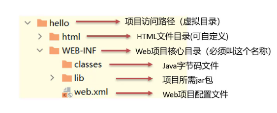

  * 开发项目通过执行Maven打包命令==package==,可以获取到部署的Web项目目录
  * 编译后的Java字节码文件和resources的资源文件，会被放到WEB-INF下的classes目录下
  * pom.xml中依赖坐标对应的jar包，会被放入WEB-INF下的lib目录下

#### 3.3.2 创建Maven Web项目

介绍完Maven Web的项目结构后，接下来使用Maven来创建Web项目，创建方式有两种:使用骨架和不使用骨架

##### **使用骨架**

> 具体的步骤包含:
>
> 1.创建Maven项目
>
> 2.选择使用Web项目骨架
>
> 3.输入Maven项目坐标创建项目
>
> 4.确认Maven相关的配置信息后，完成项目创建
>
> 5.删除pom.xml中多余内容
>
> 6.补齐Maven Web项目缺失的目录结构

1. 创建Maven项目

   

2. 选择使用Web项目骨架

   

3. 输入Maven项目坐标创建项目

   

4. 确认Maven相关的配置信息后，完成项目创建

   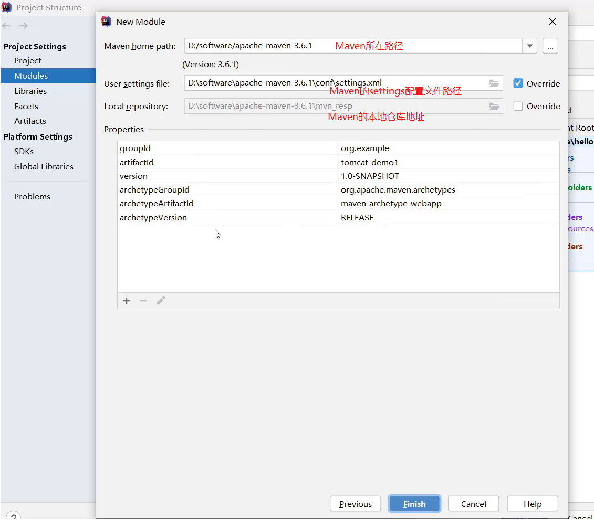

5. 删除pom.xml中多余内容，只留下面的这些内容，注意打包方式 jar和war的区别

   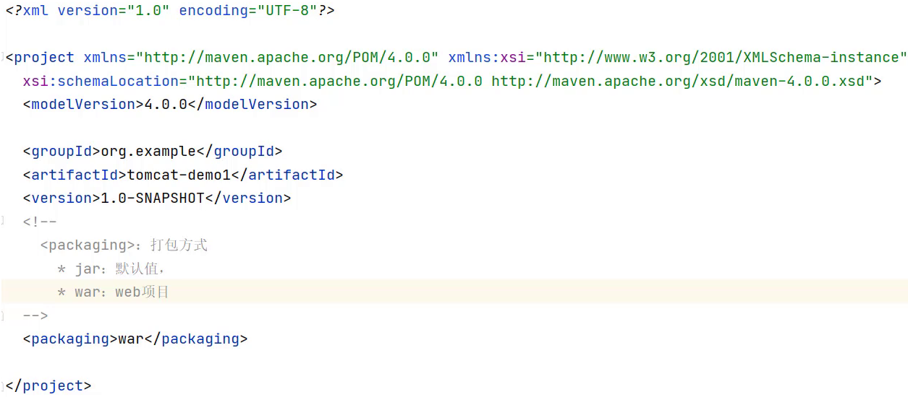

6. 补齐Maven Web项目缺失的目录结构，默认没有java和resources目录，需要手动完成创建补齐，最终的目录结果如下

   


##### 不使用骨架

>具体的步骤包含:
>
>1.创建Maven项目
>
>2.选择不使用Web项目骨架
>
>3.输入Maven项目坐标创建项目
>
>4.在pom.xml设置打包方式为war
>
>5.补齐Maven Web项目缺失webapp的目录结构
>
>6.补齐Maven Web项目缺失WEB-INF/web.xml的目录结构

1. 创建Maven项目

   

2. 选择不使用Web项目骨架

   

3. 输入Maven项目坐标创建项目

   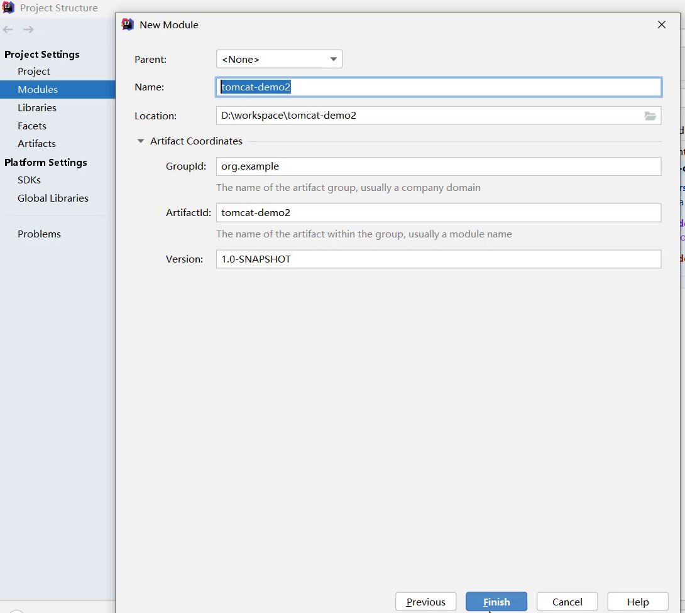

4. 在pom.xml设置打包方式为war,默认是不写代表打包方式为jar

   

5. 补齐Maven Web项目缺失webapp的目录结构

   

6. 补齐Maven Web项目缺失WEB-INF/web.xml的目录结构

   

7. 补充完后，最终的项目结构如下:

   

   

   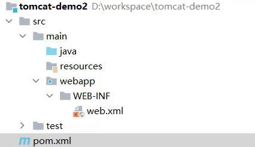

上述两种方式，创建的web项目，都不是很全，需要手动补充内容，至于最终采用哪种方式来创建Maven Web项目，都是可以的，根据各自的喜好来选择使用即可。

**小结**

1.掌握Maven Web项目的目录结构

2.掌握使用骨架的方式创建Maven Web项目


> 3.掌握不使用骨架的方式创建Maven Web项目

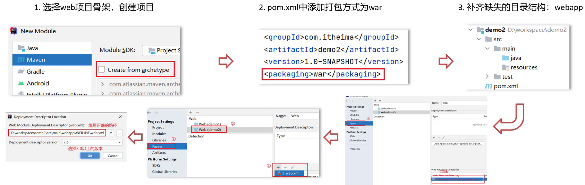

### 3.4 IDEA使用Tomcat

* Maven Web项目创建成功后，通过Maven的package命令可以将项目打包成war包，将war文件拷贝到Tomcat的webapps目录下，启动Tomcat就可以将项目部署成功，然后通过浏览器进行访问即可。
* 然而我们在开发的过程中，项目中的内容会经常发生变化，如果按照上面这种方式来部署测试，是非常不方便的
* 如何在IDEA中能快速使用Tomcat呢?

在IDEA中集成使用Tomcat有两种方式，分别是==集成本地Tomcat==和==Tomcat Maven插件==

#### 3.4.1 集成本地Tomcat

目标: 将刚才本地安装好的Tomcat8集成到IDEA中，完成项目部署，具体的实现步骤

1. 打开添加本地Tomcat的面板

   

2. 指定本地Tomcat的具体路径

   

3. 修改Tomcat的名称，此步骤可以不改，只是让名字看起来更有意义，HTTP port中的端口也可以进行修改，比如把8080改成80

   

4. 将开发项目部署项目到Tomcat中

   

   扩展内容： xxx.war和 xxx.war exploded这两种部署项目模式的区别?

   * war模式是将WEB工程打成war包，把war包发布到Tomcat服务器上

   * war exploded模式是将WEB工程以当前文件夹的位置关系发布到Tomcat服务器上
   * war模式部署成功后，Tomcat的webapps目录下会有部署的项目内容
   * war exploded模式部署成功后，Tomcat的webapps目录下没有，而使用的是项目的target目录下的内容进行部署
   * 建议大家都选war模式进行部署，更符合项目部署的实际情况

5. 部署成功后，就可以启动项目，为了能更好的看到启动的效果，可以在webapp目录下添加a.html页面

   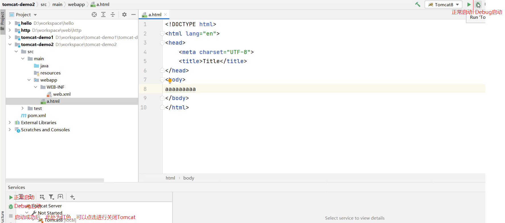

6. 启动成功后，可以通过浏览器进行访问测试

   

7. 最终的注意事项

   

   

至此，IDEA中集成本地Tomcat进行项目部署的内容我们就介绍完了，整体步骤如下，大家需要按照流程进行部署操作练习。

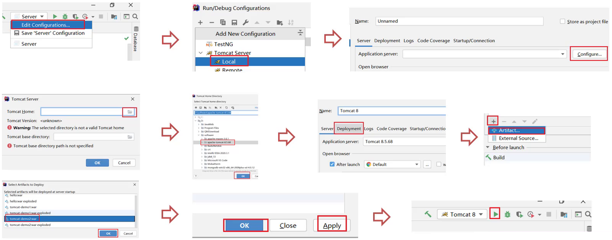

 #### 3.4.2 Tomcat Maven插件

在IDEA中使用本地Tomcat进行项目部署，相对来说步骤比较繁琐，所以我们需要一种更简便的方式来替换它，那就是直接使用Maven中的Tomcat插件来部署项目，具体的实现步骤，只需要两步，分别是:

1. 在pom.xml中添加Tomcat插件

   ```xml
   <build>
       <plugins>
       	<!--Tomcat插件 -->
           <plugin>
               <groupId>org.apache.tomcat.maven</groupId>
               <artifactId>tomcat7-maven-plugin</artifactId>
               <version>2.2</version>
           </plugin>
       </plugins>
   </build>
   ```

2. 使用Maven Helper插件快速启动项目，选中项目，右键-->Run Maven --> tomcat7:run


==注意:==

* 如果选中项目并右键点击后，看不到Run Maven和Debug Maven，这个时候就需要在IDEA中下载Maven Helper插件，具体的操作方式为: File --> Settings --> Plugins --> Maven Helper ---> Install,安装完后按照提示重启IDEA，就可以看到了。


* Maven Tomcat插件目前只有Tomcat7版本，没有更高的版本可以使用
* 使用Maven Tomcat插件，要想修改Tomcat的端口和访问路径，可以直接修改pom.xml

```xml
<build>
    <plugins>
    	<!--Tomcat插件 -->
        <plugin>
            <groupId>org.apache.tomcat.maven</groupId>
            <artifactId>tomcat7-maven-plugin</artifactId>
            <version>2.2</version>
            <configuration>
            	<port>80</port><!--访问端口号 -->
                <!--项目访问路径
					未配置访问路径: http://localhost:80/tomcat-demo2/a.html
					配置/后访问路径: http://localhost:80/a.html
					如果配置成 /hello,访问路径会变成什么?
						答案: http://localhost:80/hello/a.html
				-->
                <path>/</path>
            </configuration>
        </plugin>
    </plugins>
</build>
```

**小结**

通过这一节的学习，大家要掌握在IDEA中使用Tomcat的两种方式，集成本地Tomcat和使用Maven的Tomcat插件。后者更简单，推荐大家使用，但是如果对于Tomcat的版本有比较高的要求，要在Tomcat7以上，这个时候就只能用前者了。

## 4， Servlet

### 4.1 简介


* Servlet是JavaWeb最为核心的内容，它是Java提供的一门==动态==web资源开发技术。

* 使用Servlet就可以实现，根据不同的登录用户在页面上动态显示不同内容。

* Servlet是JavaEE规范之一，其实就是一个接口，将来我们需要定义Servlet类实现Servlet接口，并由web服务器运行Servlet

  

介绍完Servlet是什么以后，接下来我们就按照`快速入门`->`执行流程`->`生命周期`->`体系结构`->`urlPattern配置`->`XML配置`的学习步骤，一步步完成对Servlet的知识学习，首选我们来通过一个入门案例来快速把Servlet用起来。

### 4.2 快速入门

==需求分析: 编写一个Servlet类，并使用IDEA中Tomcat插件进行部署，最终通过浏览器访问所编写的Servlet程序。==

具体的实现步骤为:

1. 创建Web项目`web-demo`，导入Servlet依赖坐标

```xml
<dependency>
    <groupId>javax.servlet</groupId>
    <artifactId>javax.servlet-api</artifactId>
    <version>3.1.0</version>
    <!--
      此处为什么需要添加该标签?
      provided指的是在编译和测试过程中有效,最后生成的war包时不会加入
       因为Tomcat的lib目录中已经有servlet-api这个jar包，如果在生成war包的时候生效就会和Tomcat中的jar包冲突，导致报错
    -->
    <scope>provided</scope>
</dependency>
```

2. 创建:定义一个类，实现Servlet接口，并重写接口中所有方法，并在service方法中输入一句话

```java
package com.itheima.web;

import javax.servlet.*;
import java.io.IOException;
@WebServlet("/demo1")
public class ServletDemo1 implements Servlet {

    public void service(ServletRequest servletRequest, ServletResponse servletResponse) throws ServletException, IOException {
        System.out.println("servlet hello world~");
    }
    public void init(ServletConfig servletConfig) throws ServletException {

    }

    public ServletConfig getServletConfig() {
        return null;
    }

    public String getServletInfo() {
        return null;
    }

    public void destroy() {

    }
}
```

3. 配置:在类上使用@WebServlet注解，配置该Servlet的访问路径

```java
@WebServlet("/demo1")
```

4. 访问:启动Tomcat,浏览器中输入URL地址访问该Servlet

```
http://localhost:8080/web-demo/demo1
```

5. 器访问后，在控制台会打印`servlet hello world~` 说明servlet程序已经成功运行。

至此，Servlet的入门案例就已经完成，大家可以按照上面的步骤进行练习了。

### 4.3 执行流程

Servlet程序已经能正常运行，但是我们需要思考个问题: 我们并没有创建ServletDemo1类的对象，也没有调用对象中的service方法，为什么在控制台就打印了`servlet hello world~`这句话呢?

要想回答上述问题，我们就需要对Servlet的执行流程进行一个学习。


* 浏览器发出`http://localhost:8080/web-demo/demo1`请求，从请求中可以解析出三部分内容，分别是`localhost:8080`、`web-demo`、`demo1`
  * 根据`localhost:8080`可以找到要访问的Tomcat Web服务器
  * 根据`web-demo`可以找到部署在Tomcat服务器上的web-demo项目
  * 根据`demo1`可以找到要访问的是项目中的哪个Servlet类，根据@WebServlet后面的值进行匹配
* 找到ServletDemo1这个类后，Tomcat Web服务器就会为ServletDemo1这个类创建一个对象，然后调用对象中的service方法
  * ServletDemo1实现了Servlet接口，所以类中必然会重写service方法供Tomcat Web服务器进行调用
  * service方法中有ServletRequest和ServletResponse两个参数，ServletRequest封装的是请求数据，ServletResponse封装的是响应数据，后期我们可以通过这两个参数实现前后端的数据交互

**小结**

介绍完Servlet的执行流程，需要大家掌握两个问题：

1. Servlet由谁创建?Servlet方法由谁调用?

> Servlet由web服务器创建，Servlet方法由web服务器调用

2. 服务器怎么知道Servlet中一定有service方法?

> 因为我们自定义的Servlet,必须实现Servlet接口并复写其方法，而Servlet接口中有service方法

### 4.4 生命周期

介绍完Servlet的执行流程后，我们知道Servlet是由Tomcat Web服务器帮我们创建的。

接下来咱们再来思考一个问题:==Tomcat什么时候创建的Servlet对象?==

要想回答上述问题，我们就需要对Servlet的生命周期进行一个学习。

* 生命周期: 对象的生命周期指一个对象从被创建到被销毁的整个过程。

* Servlet运行在Servlet容器(web服务器)中，其生命周期由容器来管理，分为4个阶段：

  1. ==加载和实例化==：默认情况下，当Servlet第一次被访问时，由容器创建Servlet对象

  ```xml
  默认情况，Servlet会在第一次访问被容器创建，但是如果创建Servlet比较耗时的话，那么第一个访问的人等待的时间就比较长，用户的体验就比较差，那么我们能不能把Servlet的创建放到服务器启动的时候来创建，具体如何来配置?
  
  @WebServlet(urlPatterns = "/demo1",loadOnStartup = 1)
  loadOnstartup的取值有两类情况
  	（1）负整数:第一次访问时创建Servlet对象
  	（2）0或正整数:服务器启动时创建Servlet对象，数字越小优先级越高
  ```

  2. ==初始化==：在Servlet实例化之后，容器将调用Servlet的==init()==方法初始化这个对象，完成一些如加载配置文件、创建连接等初始化的工作。该方法只==调用一次==
  3. ==请求处理==：==每次==请求Servlet时，Servlet容器都会调用Servlet的==service()==方法对请求进行处理
  4. ==服务终止==：当需要释放内存或者容器关闭时，容器就会调用Servlet实例的==destroy()==方法完成资源的释放。在destroy()方法调用之后，容器会释放这个Servlet实例，该实例随后会被Java的垃圾收集器所回收

* 通过案例演示下上述的生命周期

  ```java
  package com.itheima.web;
  
  import javax.servlet.*;
  import javax.servlet.annotation.WebServlet;
  import java.io.IOException;
  /**
  * Servlet生命周期方法
  */
  @WebServlet(urlPatterns = "/demo2",loadOnStartup = 1)
  public class ServletDemo2 implements Servlet {
  
      /**
       *  初始化方法
       *  1.调用时机：默认情况下，Servlet被第一次访问时，调用
       *      * loadOnStartup: 默认为-1，修改为0或者正整数，则会在服务器启动的时候，调用
       *  2.调用次数: 1次
       * @param config
       * @throws ServletException
       */
      public void init(ServletConfig config) throws ServletException {
          System.out.println("init...");
      }
  
      /**
       * 提供服务
       * 1.调用时机:每一次Servlet被访问时，调用
       * 2.调用次数: 多次
       * @param req
       * @param res
       * @throws ServletException
       * @throws IOException
       */
      public void service(ServletRequest req, ServletResponse res) throws ServletException, IOException {
          System.out.println("servlet hello world~");
      }
  
      /**
       * 销毁方法
       * 1.调用时机：内存释放或者服务器关闭的时候，Servlet对象会被销毁，调用
       * 2.调用次数: 1次
       */
      public void destroy() {
          System.out.println("destroy...");
      }
      public ServletConfig getServletConfig() {
          return null;
      }
  
      public String getServletInfo() {
          return null;
      }
  
  
  }
  ```

  ==注意:如何才能让Servlet中的destroy方法被执行？==

  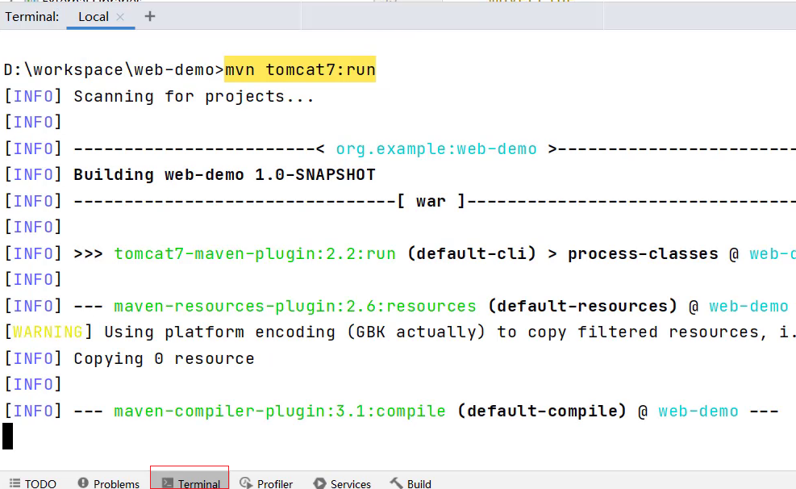

在Terminal命令行中，先使用`mvn tomcat7:run`启动，然后再使用`ctrl+c`关闭tomcat

**小结**

这节中需要掌握的内容是:

1. Servlet对象在什么时候被创建的?

> 默认是第一次访问的时候被创建，可以使用@WebServlet(urlPatterns = "/demo2",loadOnStartup = 1)的loadOnStartup 修改成在服务器启动的时候创建。

2. Servlet生命周期中涉及到的三个方法，这三个方法是什么?什么时候被调用?调用几次?

>涉及到三个方法，分别是 init()、service()、destroy()
>
>init方法在Servlet对象被创建的时候执行，只执行1次
>
>service方法在Servlet被访问的时候调用，每访问1次就调用1次
>
>destroy方法在Servlet对象被销毁的时候调用，只执行1次

### 4.5 方法介绍

Servlet中总共有5个方法，我们已经介绍过其中的三个，剩下的两个方法作用分别是什么？

我们先来回顾下前面讲的三个方法，分别是:

* 初始化方法，在Servlet被创建时执行，只执行一次

```java
void init(ServletConfig config) 
```

* 提供服务方法， 每次Servlet被访问，都会调用该方法

```java
void service(ServletRequest req, ServletResponse res)
```

* 销毁方法，当Servlet被销毁时，调用该方法。在内存释放或服务器关闭时销毁Servlet

```java
void destroy() 
```

剩下的两个方法是:

* 获取Servlet信息

```java
String getServletInfo() 
//该方法用来返回Servlet的相关信息，没有什么太大的用处，一般我们返回一个空字符串即可
public String getServletInfo() {
    return "";
}
```

* 获取ServletConfig对象

```java
ServletConfig getServletConfig()
```

ServletConfig对象，在init方法的参数中有，而Tomcat Web服务器在创建Servlet对象的时候会调用init方法，必定会传入一个ServletConfig对象，我们只需要将服务器传过来的ServletConfig进行返回即可。具体如何操作?

```java
package com.itheima.web;

import javax.servlet.*;
import javax.servlet.annotation.WebServlet;
import java.io.IOException;

/**
 * Servlet方法介绍
 */
@WebServlet(urlPatterns = "/demo3",loadOnStartup = 1)
public class ServletDemo3 implements Servlet {

    private ServletConfig servletConfig;
    /**
     *  初始化方法
     *  1.调用时机：默认情况下，Servlet被第一次访问时，调用
     *      * loadOnStartup: 默认为-1，修改为0或者正整数，则会在服务器启动的时候，调用
     *  2.调用次数: 1次
     * @param config
     * @throws ServletException
     */
    public void init(ServletConfig config) throws ServletException {
        this.servletConfig = config;
        System.out.println("init...");
    }
    public ServletConfig getServletConfig() {
        return servletConfig;
    }
    
    /**
     * 提供服务
     * 1.调用时机:每一次Servlet被访问时，调用
     * 2.调用次数: 多次
     * @param req
     * @param res
     * @throws ServletException
     * @throws IOException
     */
    public void service(ServletRequest req, ServletResponse res) throws ServletException, IOException {
        System.out.println("servlet hello world~");
    }

    /**
     * 销毁方法
     * 1.调用时机：内存释放或者服务器关闭的时候，Servlet对象会被销毁，调用
     * 2.调用次数: 1次
     */
    public void destroy() {
        System.out.println("destroy...");
    }
    
    public String getServletInfo() {
        return "";
    }
}
```

getServletInfo()和getServletConfig()这两个方法使用的不是很多，大家了解下。

### 4.6 体系结构

通过上面的学习，我们知道要想编写一个Servlet就必须要实现Servlet接口，重写接口中的5个方法，虽然已经能完成要求，但是编写起来还是比较麻烦的，因为我们更关注的其实只有service方法，那有没有更简单方式来创建Servlet呢?

要想解决上面的问题，我们需要先对Servlet的体系结构进行下了解:


因为我们将来开发B/S架构的web项目，都是针对HTTP协议，所以我们自定义Servlet,会通过继承==HttpServlet==

具体的编写格式如下:

```java
@WebServlet("/demo4")
public class ServletDemo4 extends HttpServlet {
    @Override
    protected void doGet(HttpServletRequest req, HttpServletResponse resp) throws ServletException, IOException {
        //TODO GET 请求方式处理逻辑
        System.out.println("get...");
    }
    @Override
    protected void doPost(HttpServletRequest req, HttpServletResponse resp) throws ServletException, IOException {
        //TODO Post 请求方式处理逻辑
        System.out.println("post...");
    }
}
```

* 要想发送一个GET请求，请求该Servlet，只需要通过浏览器发送`http://localhost:8080/web-demo/demo4`,就能看到doGet方法被执行了
* 要想发送一个POST请求，请求该Servlet，单单通过浏览器是无法实现的，这个时候就需要编写一个form表单来发送请求，在webapp下创建一个`a.html`页面，内容如下:

```html
<!DOCTYPE html>
<html lang="en">
<head>
    <meta charset="UTF-8">
    <title>Title</title>
</head>
<body>
    <form action="/web-demo/demo4" method="post">
        <input name="username"/><input type="submit"/>
    </form>
</body>
</html>
```

启动测试，即可看到doPost方法被执行了。

Servlet的简化编写就介绍完了，接着需要思考两个问题:

1. HttpServlet中为什么要根据请求方式的不同，调用不同的方法?
2. 如何调用?

针对问题一，我们需要回顾之前的知识点==前端发送GET和POST请求的时候，参数的位置不一致，GET请求参数在请求行中，POST请求参数在请求体中==，为了能处理不同的请求方式，我们得在service方法中进行判断，然后写不同的业务处理，这样能实现，但是每个Servlet类中都将有相似的代码，针对这个问题，有什么可以优化的策略么?

```java
package com.itheima.web;

import javax.servlet.*;
import javax.servlet.annotation.WebServlet;
import javax.servlet.http.HttpServlet;
import javax.servlet.http.HttpServletRequest;
import javax.servlet.http.HttpServletResponse;
import java.io.IOException;


@WebServlet("/demo5")
public class ServletDemo5 implements Servlet {

    public void init(ServletConfig config) throws ServletException {

    }

    public ServletConfig getServletConfig() {
        return null;
    }

    public void service(ServletRequest req, ServletResponse res) throws ServletException, IOException {
        //如何调用?
        //获取请求方式，根据不同的请求方式进行不同的业务处理
        HttpServletRequest request = (HttpServletRequest)req;
       //1. 获取请求方式
        String method = request.getMethod();
        //2. 判断
        if("GET".equals(method)){
            // get方式的处理逻辑
        }else if("POST".equals(method)){
            // post方式的处理逻辑
        }
    }

    public String getServletInfo() {
        return null;
    }

    public void destroy() {

    }
}

```

要解决上述问题，我们可以对Servlet接口进行继承封装，来简化代码开发。

```java
package com.itheima.web;

import javax.servlet.*;
import javax.servlet.http.HttpServletRequest;
import java.io.IOException;

public class MyHttpServlet implements Servlet {
    public void init(ServletConfig config) throws ServletException {

    }

    public ServletConfig getServletConfig() {
        return null;
    }

    public void service(ServletRequest req, ServletResponse res) throws ServletException, IOException {
        HttpServletRequest request = (HttpServletRequest)req;
        //1. 获取请求方式
        String method = request.getMethod();
        //2. 判断
        if("GET".equals(method)){
            // get方式的处理逻辑
            doGet(req,res);
        }else if("POST".equals(method)){
            // post方式的处理逻辑
            doPost(req,res);
        }
    }

    //protected 子类可以看到
    protected void doPost(ServletRequest req, ServletResponse res) {
    }

    protected void doGet(ServletRequest req, ServletResponse res) {
    }

    public String getServletInfo() {
        return null;
    }

    public void destroy() {

    }
}

```

有了MyHttpServlet这个类，以后我们再编写Servlet类的时候，只需要继承MyHttpServlet，重写父类中的doGet和doPost方法，就可以用来处理GET和POST请求的业务逻辑。接下来，可以把ServletDemo5代码进行改造

```java
@WebServlet("/demo5")
public class ServletDemo5 extends MyHttpServlet {

    @Override
    protected void doGet(ServletRequest req, ServletResponse res) {
        System.out.println("get...");
    }

    @Override
    protected void doPost(ServletRequest req, ServletResponse res) {
        System.out.println("post...");
    }
}

```

将来页面发送的是GET请求，则会进入到doGet方法中进行执行，如果是POST请求，则进入到doPost方法。这样代码在编写的时候就相对来说更加简单快捷。

类似MyHttpServlet这样的类Servlet中已经为我们提供好了，就是HttpServlet,翻开源码，大家可以搜索`service()`方法，你会发现HttpServlet做的事更多，不仅可以处理GET和POST还可以处理其他五种请求方式。

```java
protected void service(HttpServletRequest req, HttpServletResponse resp)
        throws ServletException, IOException
    {
        String method = req.getMethod();

        if (method.equals(METHOD_GET)) {
            long lastModified = getLastModified(req);
            if (lastModified == -1) {
                // servlet doesn't support if-modified-since, no reason
                // to go through further expensive logic
                doGet(req, resp);
            } else {
                long ifModifiedSince = req.getDateHeader(HEADER_IFMODSINCE);
                if (ifModifiedSince < lastModified) {
                    // If the servlet mod time is later, call doGet()
                    // Round down to the nearest second for a proper compare
                    // A ifModifiedSince of -1 will always be less
                    maybeSetLastModified(resp, lastModified);
                    doGet(req, resp);
                } else {
                    resp.setStatus(HttpServletResponse.SC_NOT_MODIFIED);
                }
            }

        } else if (method.equals(METHOD_HEAD)) {
            long lastModified = getLastModified(req);
            maybeSetLastModified(resp, lastModified);
            doHead(req, resp);

        } else if (method.equals(METHOD_POST)) {
            doPost(req, resp);
            
        } else if (method.equals(METHOD_PUT)) {
            doPut(req, resp);
            
        } else if (method.equals(METHOD_DELETE)) {
            doDelete(req, resp);
            
        } else if (method.equals(METHOD_OPTIONS)) {
            doOptions(req,resp);
            
        } else if (method.equals(METHOD_TRACE)) {
            doTrace(req,resp);
            
        } else {
            //
            // Note that this means NO servlet supports whatever
            // method was requested, anywhere on this server.
            //

            String errMsg = lStrings.getString("http.method_not_implemented");
            Object[] errArgs = new Object[1];
            errArgs[0] = method;
            errMsg = MessageFormat.format(errMsg, errArgs);
            
            resp.sendError(HttpServletResponse.SC_NOT_IMPLEMENTED, errMsg);
        }
    }
```

**小结**

通过这一节的学习，要掌握:

1. HttpServlet的使用步骤

> 继承HttpServlet
>
> 重写doGet和doPost方法

2. HttpServlet原理

> 获取请求方式，并根据不同的请求方式，调用不同的doXxx方法

### 4.7 urlPattern配置

Servlet类编写好后，要想被访问到，就需要配置其访问路径（==urlPattern==）

* 一个Servlet,可以配置多个urlPattern

  

  ```java
  package com.itheima.web;
  
  import javax.servlet.ServletRequest;
  import javax.servlet.ServletResponse;
  import javax.servlet.annotation.WebServlet;
  
  /**
  * urlPattern: 一个Servlet可以配置多个访问路径
  */
  @WebServlet(urlPatterns = {"/demo7","/demo8"})
  public class ServletDemo7 extends MyHttpServlet {
  
      @Override
      protected void doGet(ServletRequest req, ServletResponse res) {
          
          System.out.println("demo7 get...");
      }
      @Override
      protected void doPost(ServletRequest req, ServletResponse res) {
      }
  }
  ```

  在浏览器上输入`http://localhost:8080/web-demo/demo7`,`http://localhost:8080/web-demo/demo8`这两个地址都能访问到ServletDemo7的doGet方法。

* ==urlPattern配置规则==

  * 精确匹配

    

    ```java
    /**
     * UrlPattern:
     * * 精确匹配
     */
    @WebServlet(urlPatterns = "/user/select")
    public class ServletDemo8 extends MyHttpServlet {
    
        @Override
        protected void doGet(ServletRequest req, ServletResponse res) {
    
            System.out.println("demo8 get...");
        }
        @Override
        protected void doPost(ServletRequest req, ServletResponse res) {
        }
    }
    ```

    访问路径`http://localhost:8080/web-demo/user/select`

  * 目录匹配

    

    ```java
    package com.itheima.web;
    
    import javax.servlet.ServletRequest;
    import javax.servlet.ServletResponse;
    import javax.servlet.annotation.WebServlet;
    
    /**
     * UrlPattern:
     * * 目录匹配: /user/*
     */
    @WebServlet(urlPatterns = "/user/*")
    public class ServletDemo9 extends MyHttpServlet {
    
        @Override
        protected void doGet(ServletRequest req, ServletResponse res) {
    
            System.out.println("demo9 get...");
        }
        @Override
        protected void doPost(ServletRequest req, ServletResponse res) {
        }
    }
    ```

    访问路径`http://localhost:8080/web-demo/user/任意`

    ==思考:==

    1. 访问路径`http://localhost:8080/web-demo/user`是否能访问到demo9的doGet方法?
    2. 访问路径`http://localhost:8080/web-demo/user/a/b`是否能访问到demo9的doGet方法?
    3. 访问路径`http://localhost:8080/web-demo/user/select`是否能访问到demo9还是demo8的doGet方法?

    答案是: 能、能、demo8，进而我们可以得到的结论是`/user/*`中的`/*`代表的是零或多个层级访问目录同时精确匹配优先级要高于目录匹配。

  * 扩展名匹配

    

    ```java
    package com.itheima.web;
    
    import javax.servlet.ServletRequest;
    import javax.servlet.ServletResponse;
    import javax.servlet.annotation.WebServlet;
    
    /**
     * UrlPattern:
     * * 扩展名匹配: *.do
     */
    @WebServlet(urlPatterns = "*.do")
    public class ServletDemo10 extends MyHttpServlet {
    
        @Override
        protected void doGet(ServletRequest req, ServletResponse res) {
    
            System.out.println("demo10 get...");
        }
        @Override
        protected void doPost(ServletRequest req, ServletResponse res) {
        }
    }
    ```

    访问路径`http://localhost:8080/web-demo/任意.do`

    ==注意==:

    1. 如果路径配置的不是扩展名，那么在路径的前面就必须要加`/`否则会报错

    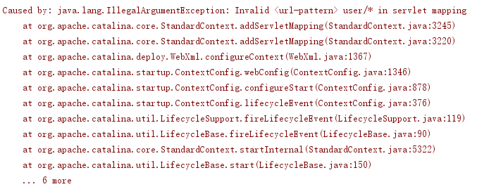

    2. 如果路径配置的是`*.do`,那么在*.do的前面不能加`/`,否则会报错

    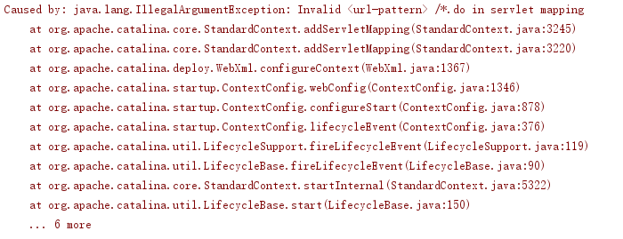

  * 任意匹配

    

    ```java
    package com.itheima.web;
    
    import javax.servlet.ServletRequest;
    import javax.servlet.ServletResponse;
    import javax.servlet.annotation.WebServlet;
    
    /**
     * UrlPattern:
     * * 任意匹配： /
     */
    @WebServlet(urlPatterns = "/")
    public class ServletDemo11 extends MyHttpServlet {
    
        @Override
        protected void doGet(ServletRequest req, ServletResponse res) {
    
            System.out.println("demo11 get...");
        }
        @Override
        protected void doPost(ServletRequest req, ServletResponse res) {
        }
    }
    ```

    访问路径`http://localhost:8080/demo-web/任意`

    ```java
    package com.itheima.web;
    
    import javax.servlet.ServletRequest;
    import javax.servlet.ServletResponse;
    import javax.servlet.annotation.WebServlet;
    
    /**
     * UrlPattern:
     * * 任意匹配： /*
     */
    @WebServlet(urlPatterns = "/*")
    public class ServletDemo12 extends MyHttpServlet {
    
        @Override
        protected void doGet(ServletRequest req, ServletResponse res) {
    
            System.out.println("demo12 get...");
        }
        @Override
        protected void doPost(ServletRequest req, ServletResponse res) {
        }
    }
    
    ```

    访问路径`http://localhost:8080/demo-web/任意

    ==注意:==`/`和`/*`的区别?

    1. 当我们的项目中的Servlet配置了 "/",会覆盖掉tomcat中的DefaultServlet,当其他的url-pattern都匹配不上时都会走这个Servlet

    2. 当我们的项目中配置了"/*",意味着匹配任意访问路径

    3. DefaultServlet是用来处理静态资源，如果配置了"/"会把默认的覆盖掉，就会引发请求静态资源的时候没有走默认的而是走了自定义的Servlet类，最终导致静态资源不能被访问

**小结**

1. urlPattern总共有四种配置方式，分别是精确匹配、目录匹配、扩展名匹配、任意匹配

2. 五种配置的优先级为 精确匹配 > 目录匹配> 扩展名匹配 > /* > / ,无需记，以最终运行结果为准。

### 4.8 XML配置

前面对应Servlet的配置，我们都使用的是@WebServlet,这个是Servlet从3.0版本后开始支持注解配置，3.0版本前只支持XML配置文件的配置方法。

对于XML的配置步骤有两步:

* 编写Servlet类

```java
package com.itheima.web;

import javax.servlet.ServletRequest;
import javax.servlet.ServletResponse;
import javax.servlet.annotation.WebServlet;

public class ServletDemo13 extends MyHttpServlet {

    @Override
    protected void doGet(ServletRequest req, ServletResponse res) {

        System.out.println("demo13 get...");
    }
    @Override
    protected void doPost(ServletRequest req, ServletResponse res) {
    }
}
```

* 在web.xml中配置该Servlet

```xml
<?xml version="1.0" encoding="UTF-8"?>
<web-app xmlns="http://xmlns.jcp.org/xml/ns/javaee"
         xmlns:xsi="http://www.w3.org/2001/XMLSchema-instance"
         xsi:schemaLocation="http://xmlns.jcp.org/xml/ns/javaee http://xmlns.jcp.org/xml/ns/javaee/web-app_4_0.xsd"
         version="4.0">
    
    
    
    <!-- 
        Servlet 全类名
    -->
    <servlet>
        <!-- servlet的名称，名字任意-->
        <servlet-name>demo13</servlet-name>
        <!--servlet的类全名-->
        <servlet-class>com.itheima.web.ServletDemo13</servlet-class>
    </servlet>

    <!-- 
        Servlet 访问路径
    -->
    <servlet-mapping>
        <!-- servlet的名称，要和上面的名称一致-->
        <servlet-name>demo13</servlet-name>
        <!-- servlet的访问路径-->
        <url-pattern>/demo13</url-pattern>
    </servlet-mapping>
</web-app>
```

这种配置方式和注解比起来，确认麻烦很多，所以建议大家使用注解来开发。但是大家要认识上面这种配置方式，因为并不是所有的项目都是基于注解开发的。


# day09 Request&Response

**今日目标**

>* 掌握Request对象的概念与使用
>* 掌握Response对象的概念与使用
>* 能够完成用户登录注册案例的实现
>* 能够完成SqlSessionFactory工具类的抽取

## 1，Request和Response的概述

==Request是请求对象，Response是响应对象。==这两个对象在我们使用Servlet的时候有看到：

此时，我们就需要思考一个问题request和response这两个参数的作用是什么?

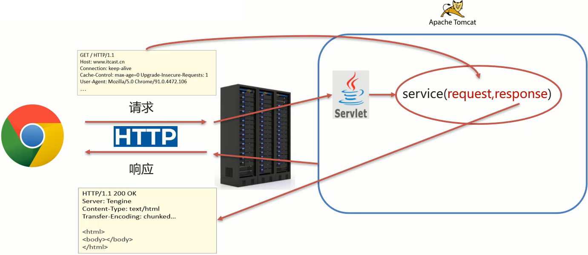

* request:==获取==请求数据
  * 浏览器会发送HTTP请求到后台服务器[Tomcat]
  * HTTP的请求中会包含很多请求数据[请求行+请求头+请求体]
  * 后台服务器[Tomcat]会对HTTP请求中的数据进行解析并把解析结果存入到一个对象中
  * 所存入的对象即为request对象，所以我们可以从request对象中获取请求的相关参数
  * 获取到数据后就可以继续后续的业务，比如获取用户名和密码就可以实现登录操作的相关业务
* response:==设置==响应数据
  * 业务处理完后，后台就需要给前端返回业务处理的结果即响应数据
  * 把响应数据封装到response对象中
  * 后台服务器[Tomcat]会解析response对象,按照[响应行+响应头+响应体]格式拼接结果
  * 浏览器最终解析结果，把内容展示在浏览器给用户浏览

对于上述所讲的内容，我们通过一个案例来初步体验下request和response对象的使用。

```java
@WebServlet("/demo3")
public class ServletDemo3 extends HttpServlet {
    @Override
    protected void doGet(HttpServletRequest request, HttpServletResponse response) throws ServletException, IOException {
        //使用request对象 获取请求数据
        String name = request.getParameter("name");//url?name=zhangsan

        //使用response对象 设置响应数据
        response.setHeader("content-type","text/html;charset=utf-8");
        response.getWriter().write("<h1>"+name+",欢迎您！</h1>");
    }

    @Override
    protected void doPost(HttpServletRequest request, HttpServletResponse response) throws ServletException, IOException {
        System.out.println("Post...");
    }
}
```

启动成功后就可以通过浏览器来访问，并且根据传入参数的不同就可以在页面上展示不同的内容:

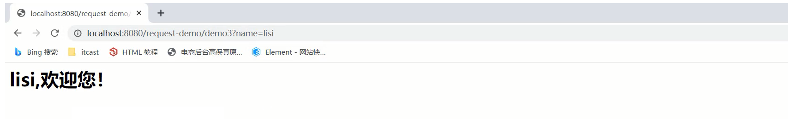

**小结**

在这节中，我们主要认识了下request对象和reponse对象:

* request对象是用来封装请求数据的对象
* response对象是用来封装响应数据的对象

目前我们只知道这两个对象是用来干什么的，那么它们具体是如何实现的，就需要我们继续深入的学习。接下来，就先从Request对象来学习,主要学习下面这些内容:

* request继承体系

* request获取请求参数
* request请求转发

## 2，Request对象

### 2.1 Request继承体系

在学习这节内容之前，我们先思考一个问题，前面在介绍Request和Reponse对象的时候，比较细心的同学可能已经发现：

* 当我们的Servlet类实现的是Servlet接口的时候，service方法中的参数是ServletRequest和ServletResponse
* 当我们的Servlet类继承的是HttpServlet类的时候，doGet和doPost方法中的参数就变成HttpServletRequest和HttpServletReponse

那么，

* ServletRequest和HttpServletRequest的关系是什么?
* request对象是有谁来创建的?
* request提供了哪些API,这些API从哪里查? 

首先，我们先来看下Request的继承体系:


从上图中可以看出，ServletRequest和HttpServletRequest都是Java提供的，所以我们可以打开JavaEE提供的API文档[参考: 资料/JavaEE7-api.chm],打开后可以看到:


所以ServletRequest和HttpServletRequest是继承关系，并且两个都是接口，接口是无法创建对象，这个时候就引发了下面这个问题:


这个时候，我们就需要用到Request继承体系中的`RequestFacade`:

* 该类实现了HttpServletRequest接口，也间接实现了ServletRequest接口。
* Servlet类中的service方法、doGet方法或者是doPost方法最终都是由Web服务器[Tomcat]来调用的，所以Tomcat提供了方法参数接口的具体实现类，并完成了对象的创建
* 要想了解RequestFacade中都提供了哪些方法，我们可以直接查看JavaEE的API文档中关于ServletRequest和HttpServletRequest的接口文档，因为RequestFacade实现了其接口就需要重写接口中的方法

对于上述结论，要想验证，可以编写一个Servlet，在方法中把request对象打印下，就能看到最终的对象是不是RequestFacade,代码如下:

```java
@WebServlet("/demo2")
public class ServletDemo2 extends HttpServlet {
    @Override
    protected void doGet(HttpServletRequest request, HttpServletResponse response) throws ServletException, IOException {
        System.out.println(request);
    }

    @Override
    protected void doPost(HttpServletRequest request, HttpServletResponse response) throws ServletException, IOException {
    }
}
```

启动服务器，运行访问`http://localhost:8080/request-demo/demo2`,得到运行结果:


**小结**

* Request的继承体系为ServletRequest-->HttpServletRequest-->RequestFacade
* Tomcat需要解析请求数据，封装为request对象,并且创建request对象传递到service方法
* 使用request对象，可以查阅JavaEE API文档的HttpServletRequest接口中方法说明

### 2.2 Request获取请求数据

HTTP请求数据总共分为三部分内容，分别是==请求行、请求头、请求体==，对于这三部分内容的数据，分别该如何获取，首先我们先来学习请求行数据如何获取?

#### 2.2.1 获取请求行数据

请求行包含三块内容，分别是`请求方式`、`请求资源路径`、`HTTP协议及版本`


对于这三部分内容，request对象都提供了对应的API方法来获取，具体如下:

* 获取请求方式: `GET`

```
String getMethod()
```

* 获取虚拟目录(项目访问路径): `/request-demo`

```
String getContextPath()
```

* 获取URL(统一资源定位符): `http://localhost:8080/request-demo/req1`

```
StringBuffer getRequestURL()
```

* 获取URI(统一资源标识符): `/request-demo/req1`

```
String getRequestURI()
```

* 获取请求参数(GET方式): `username=zhangsan&password=123`

```
String getQueryString()
```

介绍完上述方法后，咱们通过代码把上述方法都使用下:

```java
/**
 * request 获取请求数据
 */
@WebServlet("/req1")
public class RequestDemo1 extends HttpServlet {
    @Override
    protected void doGet(HttpServletRequest req, HttpServletResponse resp) throws ServletException, IOException {
        // String getMethod()：获取请求方式： GET
        String method = req.getMethod();
        System.out.println(method);//GET
        // String getContextPath()：获取虚拟目录(项目访问路径)：/request-demo
        String contextPath = req.getContextPath();
        System.out.println(contextPath);
        // StringBuffer getRequestURL(): 获取URL(统一资源定位符)：http://localhost:8080/request-demo/req1
        StringBuffer url = req.getRequestURL();
        System.out.println(url.toString());
        // String getRequestURI()：获取URI(统一资源标识符)： /request-demo/req1
        String uri = req.getRequestURI();
        System.out.println(uri);
        // String getQueryString()：获取请求参数（GET方式）： username=zhangsan
        String queryString = req.getQueryString();
        System.out.println(queryString);
    }
    @Override
    protected void doPost(HttpServletRequest req, HttpServletResponse resp) throws ServletException, IOException {
    }
}
```

启动服务器，访问`http://localhost:8080/request-demo/req1?username=zhangsan&passwrod=123`，获取的结果如下:


#### 2.2.2 获取请求头数据

对于请求头的数据，格式为`key: value`如下:


所以根据请求头名称获取对应值的方法为:

```
String getHeader(String name)
```

接下来，在代码中如果想要获取客户端浏览器的版本信息，则可以使用

```java
/**
 * request 获取请求数据
 */
@WebServlet("/req1")
public class RequestDemo1 extends HttpServlet {
    @Override
    protected void doGet(HttpServletRequest req, HttpServletResponse resp) throws ServletException, IOException {
        //获取请求头: user-agent: 浏览器的版本信息
        String agent = req.getHeader("user-agent");
		System.out.println(agent);
    }
    @Override
    protected void doPost(HttpServletRequest req, HttpServletResponse resp) throws ServletException, IOException {
    }
}

```

重新启动服务器后，`http://localhost:8080/request-demo/req1?username=zhangsan&passwrod=123`，获取的结果如下:


#### 2.2.3 获取请求体数据

浏览器在发送GET请求的时候是没有请求体的，所以需要把请求方式变更为POST，请求体中的数据格式如下:


对于请求体中的数据，Request对象提供了如下两种方式来获取其中的数据，分别是:

* 获取字节输入流，如果前端发送的是字节数据，比如传递的是文件数据，则使用该方法

```
ServletInputStream getInputStream()
该方法可以获取字节
```

* 获取字符输入流，如果前端发送的是纯文本数据，则使用该方法

```
BufferedReader getReader()
```

接下来，大家需要思考，要想获取到请求体的内容该如何实现?

>具体实现的步骤如下:
>
>1.准备一个页面，在页面中添加form表单,用来发送post请求
>
>2.在Servlet的doPost方法中获取请求体数据
>
>3.在doPost方法中使用request的getReader()或者getInputStream()来获取
>
>4.访问测试

1. 在项目的webapp目录下添加一个html页面，名称为：`req.html`

```html
<!DOCTYPE html>
<html lang="en">
<head>
    <meta charset="UTF-8">
    <title>Title</title>
</head>
<body>
<!-- 
    action:form表单提交的请求地址
    method:请求方式，指定为post
-->
<form action="/request-demo/req1" method="post">
    <input type="text" name="username">
    <input type="password" name="password">
    <input type="submit">
</form>
</body>
</html>
```

2. 在Servlet的doPost方法中获取数据

```java
/**
 * request 获取请求数据
 */
@WebServlet("/req1")
public class RequestDemo1 extends HttpServlet {
    @Override
    protected void doGet(HttpServletRequest req, HttpServletResponse resp) throws ServletException, IOException {
    }
    @Override
    protected void doPost(HttpServletRequest req, HttpServletResponse resp) throws ServletException, IOException {
        //在此处获取请求体中的数据
    }
}
```

3. 调用getReader()或者getInputStream()方法，因为目前前端传递的是纯文本数据，所以我们采用getReader()方法来获取

```java
/**
 * request 获取请求数据
 */
@WebServlet("/req1")
public class RequestDemo1 extends HttpServlet {
    @Override
    protected void doGet(HttpServletRequest req, HttpServletResponse resp) throws ServletException, IOException {
    }
    @Override
    protected void doPost(HttpServletRequest req, HttpServletResponse resp) throws ServletException, IOException {
         //获取post 请求体：请求参数 
        //1. 获取字符输入流
        BufferedReader br = req.getReader();
        //2. 读取数据
        String line = br.readLine();
        System.out.println(line);
    }
}
```

==注意==

BufferedReader流是通过request对象来获取的，当请求完成后request对象就会被销毁，request对象被销毁后，BufferedReader流就会自动关闭，所以此处就不需要手动关闭流了。

4. 启动服务器，通过浏览器访问`http://localhost:8080/request-demo/req.html`


点击`提交`按钮后，就可以在控制台看到前端所发送的请求数据


**小结**

HTTP请求数据中包含了`请求行`、`请求头`和`请求体`，针对这三部分内容，Request对象都提供了对应的API方法来获取对应的值:

* 请求行
  * getMethod()获取请求方式
  * getContextPath()获取项目访问路径
  * getRequestURL()获取请求URL
  * getRequestURI()获取请求URI
  * getQueryString()获取GET请求方式的请求参数
* 请求头
  * getHeader(String name)根据请求头名称获取其对应的值
* 请求体
  * 注意: ==浏览器发送的POST请求才有请求体==
  * 如果是纯文本数据:getReader()
  * 如果是字节数据如文件数据:getInputStream()

#### 2.2.4 获取请求参数的通用方式

在学习下面内容之前，我们先提出两个问题:

* 什么是请求参数?
* 请求参数和请求数据的关系是什么?

1.什么是请求参数?

为了能更好的回答上述两个问题，我们拿用户登录的例子来说明

1.1 想要登录网址，需要进入登录页面

1.2 在登录页面输入用户名和密码

1.3 将用户名和密码提交到后台

1.4 后台校验用户名和密码是否正确

1.5 如果正确，则正常登录，如果不正确，则提示用户名或密码错误

上述例子中，用户名和密码其实就是我们所说的请求参数。

2.什么是请求数据?

请求数据则是包含请求行、请求头和请求体的所有数据

3.请求参数和请求数据的关系是什么?

3.1 请求参数是请求数据中的部分内容

3.2 如果是GET请求，请求参数在请求行中

3.3 如果是POST请求，请求参数一般在请求体中

对于请求参数的获取,常用的有以下两种:

* GET方式:

```
String getQueryString()
```

* POST方式:

```
BufferedReader getReader();
```

有了上述的知识储备，我们来实现一个案例需求:

（1）发送一个GET请求并携带用户名，后台接收后打印到控制台

（2）发送一个POST请求并携带用户名，后台接收后打印到控制台

此处大家需要注意的是GET请求和POST请求接收参数的方式不一样，具体实现的代码如下:

```java
@WebServlet("/req1")
public class RequestDemo1 extends HttpServlet {
    @Override
    protected void doGet(HttpServletRequest req, HttpServletResponse resp) throws ServletException, IOException {

        String result = req.getQueryString();
        System.out.println(result);

    }
    @Override
    protected void doPost(HttpServletRequest req, HttpServletResponse resp) throws ServletException, IOException {
        BufferedReader br = req.getReader();
        String result = br.readLine();
        System.out.println(result);
    }
}
```

* 对于上述的代码，会存在什么问题呢?

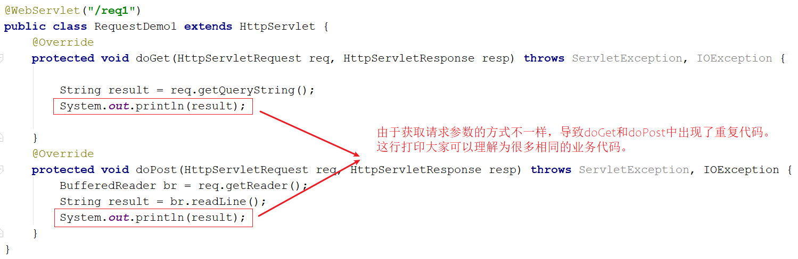

* 如何解决上述重复代码的问题呢?


当然，也可以在doGet中调用doPost,在doPost中完成参数的获取和打印,另外需要注意的是，doGet和doPost方法都必须存在，不能删除任意一个。

==GET请求和POST请求获取请求参数的方式不一样，在获取请求参数这块该如何实现呢?==

要想实现，我们就需要==思考==:

GET请求方式和POST请求方式区别主要在于获取请求参数的方式不一样，是否可以提供一种==统一==获取请求参数的方式，从而==统一==doGet和doPost方法内的代码?

解决方案一:

```java
@WebServlet("/req1")
public class RequestDemo1 extends HttpServlet {
    @Override
    protected void doGet(HttpServletRequest req, HttpServletResponse resp) throws ServletException, IOException {
        //获取请求方式
        String method = req.getMethod();
        //获取请求参数
        String params = "";
        if("GET".equals(method)){
            params = req.getQueryString();
        }else if("POST".equals(method)){
            BufferedReader reader = req.getReader();
            params = reader.readLine();
        }
        //将请求参数进行打印控制台
        System.out.println(params);
      
    }
    @Override
    protected void doPost(HttpServletRequest req, HttpServletResponse resp) throws ServletException, IOException {
        this.doGet(req,resp);
    }
}
```

使用request的getMethod()来获取请求方式，根据请求方式的不同分别获取请求参数值，这样就可以解决上述问题，但是以后每个Servlet都需要这样写代码，实现起来比较麻烦，这种方案我们不采用

解决方案二:

request对象已经将上述获取请求参数的方法进行了封装，并且request提供的方法实现的功能更强大，以后只需要调用request提供的方法即可，在request的方法中都实现了哪些操作?

(1)根据不同的请求方式获取请求参数，获取的内容如下:

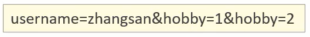

(2)把获取到的内容进行分割，内容如下:

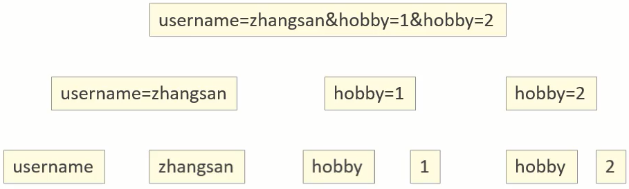

(3)把分割后端数据，存入到一个Map集合中:

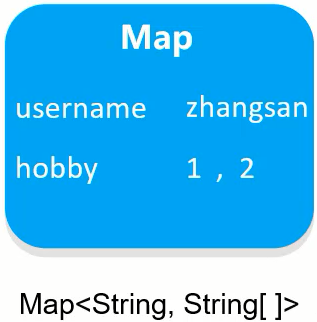

**注意**:因为参数的值可能是一个，也可能有多个，所以Map的值的类型为String数组。

基于上述理论，request对象为我们提供了如下方法:

* 获取所有参数Map集合

```
Map<String,String[]> getParameterMap()
```

* 根据名称获取参数值（数组）

```
String[] getParameterValues(String name)
```

* 根据名称获取参数值(单个值)

```
String getParameter(String name)
```

接下来，我们通过案例来把上述的三个方法进行实例演示:

1.修改req.html页面，添加爱好选项，爱好可以同时选多个

```html
<!DOCTYPE html>
<html lang="en">
<head>
    <meta charset="UTF-8">
    <title>Title</title>
</head>
<body>
<form action="/request-demo/req2" method="get">
    <input type="text" name="username"><br>
    <input type="password" name="password"><br>
    <input type="checkbox" name="hobby" value="1"> 游泳
    <input type="checkbox" name="hobby" value="2"> 爬山 <br>
    <input type="submit">

</form>
</body>
</html>
```

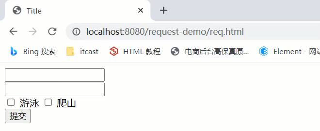

2.在Servlet代码中获取页面传递GET请求的参数值

 2.1获取GET方式的所有请求参数

```java
/**
 * request 通用方式获取请求参数
 */
@WebServlet("/req2")
public class RequestDemo2 extends HttpServlet {
    @Override
    protected void doGet(HttpServletRequest req, HttpServletResponse resp) throws ServletException, IOException {
        //GET请求逻辑
        System.out.println("get....");
        //1. 获取所有参数的Map集合
        Map<String, String[]> map = req.getParameterMap();
        for (String key : map.keySet()) {
            // username:zhangsan lisi
            System.out.print(key+":");

            //获取值
            String[] values = map.get(key);
            for (String value : values) {
                System.out.print(value + " ");
            }

            System.out.println();
        }
    }

    @Override
    protected void doPost(HttpServletRequest req, HttpServletResponse resp) throws ServletException, IOException {
    }
}
```

获取的结果为:


 2.2获取GET请求参数中的爱好，结果是数组值

```java
/**
 * request 通用方式获取请求参数
 */
@WebServlet("/req2")
public class RequestDemo2 extends HttpServlet {
    @Override
    protected void doGet(HttpServletRequest req, HttpServletResponse resp) throws ServletException, IOException {
        //GET请求逻辑
        //...
        System.out.println("------------");
        String[] hobbies = req.getParameterValues("hobby");
        for (String hobby : hobbies) {
            System.out.println(hobby);
        }
    }

    @Override
    protected void doPost(HttpServletRequest req, HttpServletResponse resp) throws ServletException, IOException {
    }
}
```

获取的结果为:


 2.3获取GET请求参数中的用户名和密码，结果是单个值

```java
/**
 * request 通用方式获取请求参数
 */
@WebServlet("/req2")
public class RequestDemo2 extends HttpServlet {
    @Override
    protected void doGet(HttpServletRequest req, HttpServletResponse resp) throws ServletException, IOException {
        //GET请求逻辑
        //...
        String username = req.getParameter("username");
        String password = req.getParameter("password");
        System.out.println(username);
        System.out.println(password);
    }

    @Override
    protected void doPost(HttpServletRequest req, HttpServletResponse resp) throws ServletException, IOException {
    }
}
```

获取的结果为:


3.在Servlet代码中获取页面传递POST请求的参数值

 3.1将req.html页面form表单的提交方式改成post

 3.2将doGet方法中的内容复制到doPost方法中即可

**小结**

* req.getParameter()方法使用的频率会比较高

* 以后我们再写代码的时候，就只需要按照如下格式来编写:

```
public class RequestDemo1 extends HttpServlet {
    @Override
    protected void doGet(HttpServletRequest req, HttpServletResponse resp) throws ServletException, IOException {
       //采用request提供的获取请求参数的通用方式来获取请求参数
       //编写其他的业务代码...
    }
    @Override
    protected void doPost(HttpServletRequest req, HttpServletResponse resp) throws ServletException, IOException {
        this.doGet(req,resp);
    }
}
```

### 2.3 IDEA快速创建Servlet

使用通用方式获取请求参数后，屏蔽了GET和POST的请求方式代码的不同，则代码可以定义如下格式:


由于格式固定，所以我们可以使用IDEA提供的模板来制作一个Servlet的模板，这样我们后期在创建Servlet的时候就会更高效，具体如何实现:

(1)按照自己的需求，修改Servlet创建的模板内容


（2）使用servlet模板创建Servlet类


### 2.4 请求参数中文乱码问题

问题展示:

(1)将req.html页面的请求方式修改为get

```
<!DOCTYPE html>
<html lang="en">
<head>
    <meta charset="UTF-8">
    <title>Title</title>
</head>
<body>
<form action="/request-demo/req2" method="get">
    <input type="text" name="username"><br>
    <input type="password" name="password"><br>
    <input type="checkbox" name="hobby" value="1"> 游泳
    <input type="checkbox" name="hobby" value="2"> 爬山 <br>
    <input type="submit">

</form>
</body>
</html>
```

(2)在Servlet方法中获取参数，并打印

```java
/**
 * 中文乱码问题解决方案
 */
@WebServlet("/req4")
public class RequestDemo4 extends HttpServlet {
    @Override
    protected void doGet(HttpServletRequest request, HttpServletResponse response) throws ServletException, IOException {
       //1. 获取username
       String username = request.getParameter("username");
       System.out.println(username);
    }

    @Override
    protected void doPost(HttpServletRequest request, HttpServletResponse response) throws ServletException, IOException {
        this.doGet(request, response);
    }
}
```

（3）启动服务器，页面上输入中文参数

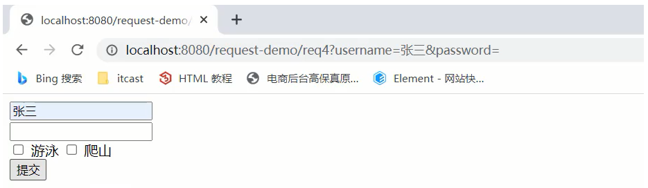

（4）查看控制台打印内容


（5）把req.html页面的请求方式改成post,再次发送请求和中文参数


（6）查看控制台打印内容，依然为乱码


通过上面的案例，会发现，不管是GET还是POST请求，在发送的请求参数中如果有中文，在后台接收的时候，都会出现中文乱码的问题。具体该如何解决呢？

#### 2.4.1 POST请求解决方案

* 分析出现中文乱码的原因：
  * POST的请求参数是通过request的getReader()来获取流中的数据
  * TOMCAT在获取流的时候采用的编码是ISO-8859-1
  * ISO-8859-1编码是不支持中文的，所以会出现乱码
* 解决方案：
  * 页面设置的编码格式为UTF-8
  * 把TOMCAT在获取流数据之前的编码设置为UTF-8
  * 通过request.setCharacterEncoding("UTF-8")设置编码,UTF-8也可以写成小写

修改后的代码为:

```java
/**
 * 中文乱码问题解决方案
 */
@WebServlet("/req4")
public class RequestDemo4 extends HttpServlet {
    @Override
    protected void doGet(HttpServletRequest request, HttpServletResponse response) throws ServletException, IOException {
        //1. 解决乱码: POST getReader()
        //设置字符输入流的编码，设置的字符集要和页面保持一致
        request.setCharacterEncoding("UTF-8");
       //2. 获取username
       String username = request.getParameter("username");
       System.out.println(username);
    }

    @Override
    protected void doPost(HttpServletRequest request, HttpServletResponse response) throws ServletException, IOException {
        this.doGet(request, response);
    }
}
```

重新发送POST请求，就会在控制台看到正常展示的中文结果。

至此POST请求中文乱码的问题就已经解决，但是这种方案不适用于GET请求，这个原因是什么呢，咱们下面再分析。

#### 2.4.2 GET请求解决方案

刚才提到一个问题是`POST请求的中文乱码解决方案为什么不适用GET请求？`

* GET请求获取请求参数的方式是`request.getQueryString()`
* POST请求获取请求参数的方式是`request.getReader()`
* request.setCharacterEncoding("utf-8")是设置request处理流的编码
* getQueryString方法并没有通过流的方式获取数据

所以GET请求不能用设置编码的方式来解决中文乱码问题，那问题又来了，如何解决GET请求的中文乱码呢? 

1. 首先我们需要先分析下GET请求出现乱码的原因:

 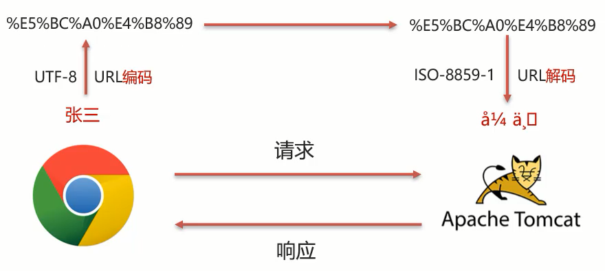

(1)浏览器通过HTTP协议发送请求和数据给后台服务器（Tomcat)

(2)浏览器在发送HTTP的过程中会对中文数据进行URL==编码==

(3)在进行URL编码的时候会采用页面`<meta>`标签指定的UTF-8的方式进行编码，`张三`编码后的结果为`%E5%BC%A0%E4%B8%89`

(4)后台服务器(Tomcat)接收到`%E5%BC%A0%E4%B8%89`后会默认按照`ISO-8859-1`进行URL==解码==

(5)由于前后编码与解码采用的格式不一样，就会导致后台获取到的数据为乱码。

思考: 如果把`req.html`页面的`<meta>`标签的charset属性改成`ISO-8859-1`,后台不做操作，能解决中文乱码问题么?

答案是否定的，因为`ISO-8859-1`本身是不支持中文展示的，所以改了<meta>标签的charset属性后，会导致页面上的中文内容都无法正常展示。

分析完上面的问题后，我们会发现，其中有两个我们不熟悉的内容就是==URL编码==和==URL解码==，什么是URL编码，什么又是URL解码呢?

**URL编码**

这块知识我们只需要了解下即可,具体编码过程分两步，分别是:

(1)将字符串按照编码方式转为二进制

(2)每个字节转为2个16进制数并在前边加上%

`张三`按照UTF-8的方式转换成二进制的结果为:

```
1110 0101 1011 1100 1010 0000 1110 0100 1011 1000 1000 1001
```

这个结果是如何计算的?

使用`http://www.mytju.com/classcode/tools/encode_utf8.asp`，输入`张三`


就可以获取张和三分别对应的10进制，然后在使用计算器，选择程序员模式，计算出对应的二进制数据结果:


在计算的十六进制结果中，每两位前面加一个%,就可以获取到`%E5%BC%A0%E4%B8%89`。

当然你从上面所提供的网站中就已经能看到编码16进制的结果了:

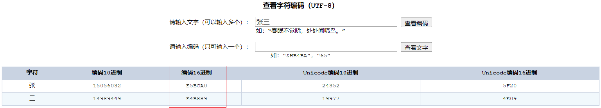

但是对于上面的计算过程，如果没有工具，纯手工计算的话，相对来说还是比较复杂的，我们也不需要进行手动计算，在Java中已经为我们提供了编码和解码的API工具类可以让我们更快速的进行编码和解码:

编码:

```java
java.net.URLEncoder.encode("需要被编码的内容","字符集(UTF-8)")
```

解码:

```java
java.net.URLDecoder.decode("需要被解码的内容","字符集(UTF-8)")
```

接下来咱们对`张三`来进行编码和解码

```
public class URLDemo {

  public static void main(String[] args) throws UnsupportedEncodingException {
        String username = "张三";
        //1. URL编码
        String encode = URLEncoder.encode(username, "utf-8");
        System.out.println(encode); //打印:%E5%BC%A0%E4%B8%89

       //2. URL解码
       //String decode = URLDecoder.decode(encode, "utf-8");//打印:张三
       String decode = URLDecoder.decode(encode, "ISO-8859-1");//打印:`å¼ ä¸ `
       System.out.println(decode);
    }
}

```

到这，我们就可以分析出GET请求中文参数出现乱码的原因了，

* 浏览器把中文参数按照`UTF-8`进行URL编码
* Tomcat对获取到的内容进行了`ISO-8859-1`的URL解码
* 在控制台就会出现类上`å¼ ä¸‰`的乱码，最后一位是个空格

2. 清楚了出现乱码的原因，接下来我们就需要想办法进行解决


从上图可以看住，

* 在进行编码和解码的时候，不管使用的是哪个字符集，他们对应的`%E5%BC%A0%E4%B8%89`是一致的

* 那他们对应的二进制值也是一样的，为:

  * ```
    1110 0101 1011 1100 1010 0000 1110 0100 1011 1000 1000 1001
    ```

* 为所以我们可以考虑把`å¼ ä¸‰`转换成字节，在把字节转换成`张三`，在转换的过程中是它们的编码一致，就可以解决中文乱码问题。

具体的实现步骤为:

>1.按照ISO-8859-1编码获取乱码`å¼ ä¸‰`对应的字节数组
>
>2.按照UTF-8编码获取字节数组对应的字符串

实现代码如下:

```
public class URLDemo {

  public static void main(String[] args) throws UnsupportedEncodingException {
        String username = "张三";
        //1. URL编码
        String encode = URLEncoder.encode(username, "utf-8");
        System.out.println(encode);
        //2. URL解码
        String decode = URLDecoder.decode(encode, "ISO-8859-1");

        System.out.println(decode); //此处打印的是对应的乱码数据

        //3. 转换为字节数据,编码
        byte[] bytes = decode.getBytes("ISO-8859-1");
        for (byte b : bytes) {
            System.out.print(b + " ");
        }
		//此处打印的是:-27 -68 -96 -28 -72 -119
        //4. 将字节数组转为字符串，解码
        String s = new String(bytes, "utf-8");
        System.out.println(s); //此处打印的是张三
    }
}
```

**说明**:在第18行中打印的数据是`-27 -68 -96 -28 -72 -119`和`张三`转换成的二进制数据`1110 0101 1011 1100 1010 0000 1110 0100 1011 1000 1000 1001`为什么不一样呢？

其实打印出来的是十进制数据，我们只需要使用计算机换算下就能得到他们的对应关系，如下图:


至此对于GET请求中文乱码的解决方案，我们就已经分析完了，最后在代码中去实现下:

```java
/**
 * 中文乱码问题解决方案
 */
@WebServlet("/req4")
public class RequestDemo4 extends HttpServlet {
    @Override
    protected void doGet(HttpServletRequest request, HttpServletResponse response) throws ServletException, IOException {
        //1. 解决乱码：POST，getReader()
        //request.setCharacterEncoding("UTF-8");//设置字符输入流的编码

        //2. 获取username
        String username = request.getParameter("username");
        System.out.println("解决乱码前："+username);

        //3. GET,获取参数的方式：getQueryString
        // 乱码原因：tomcat进行URL解码，默认的字符集ISO-8859-1
       /* //3.1 先对乱码数据进行编码：转为字节数组
        byte[] bytes = username.getBytes(StandardCharsets.ISO_8859_1);
        //3.2 字节数组解码
        username = new String(bytes, StandardCharsets.UTF_8);*/

        username  = new String(username.getBytes(StandardCharsets.ISO_8859_1),StandardCharsets.UTF_8);

        System.out.println("解决乱码后："+username);

    }

    @Override
    protected void doPost(HttpServletRequest request, HttpServletResponse response) throws ServletException, IOException {
        this.doGet(request, response);
    }
}
```

**注意**

* 把`request.setCharacterEncoding("UTF-8")`代码注释掉后，会发现GET请求参数乱码解决方案同时也可也把POST请求参数乱码的问题也解决了
* 只不过对于POST请求参数一般都会比较多，采用这种方式解决乱码起来比较麻烦，所以对于POST请求还是建议使用设置编码的方式进行。

另外需要说明一点的是==Tomcat8.0之后，已将GET请求乱码问题解决，设置默认的解码方式为UTF-8==

**小结**

1. 中文乱码解决方案

* POST请求和GET请求的参数中如果有中文，后台接收数据就会出现中文乱码问题

  GET请求在Tomcat8.0以后的版本就不会出现了

* POST请求解决方案是:设置输入流的编码

  ```
  request.setCharacterEncoding("UTF-8");
  注意:设置的字符集要和页面保持一致
  ```

* 通用方式（GET/POST）：需要先解码，再编码

  ```
  new String(username.getBytes("ISO-8859-1"),"UTF-8");
  ```

2. URL编码实现方式:

* 编码:

  ```
  URLEncoder.encode(str,"UTF-8");
  ```

* 解码:

  ```
  URLDecoder.decode(s,"ISO-8859-1");
  ```

### 2.5 Request请求转发

1. ==请求转发(forward):一种在服务器内部的资源跳转方式。==


(1)浏览器发送请求给服务器，服务器中对应的资源A接收到请求

(2)资源A处理完请求后将请求发给资源B

(3)资源B处理完后将结果响应给浏览器

(4)请求从资源A到资源B的过程就叫==请求转发==

2. 请求转发的实现方式:

```
req.getRequestDispatcher("资源B路径").forward(req,resp);
```

具体如何来使用，我们先来看下需求:


针对上述需求，具体的实现步骤为:

>1.创建一个RequestDemo5类，接收/req5的请求，在doGet方法中打印`demo5`
>
>2.创建一个RequestDemo6类，接收/req6的请求，在doGet方法中打印`demo6`
>
>3.在RequestDemo5的方法中使用
>
>​	req.getRequestDispatcher("/req6").forward(req,resp)进行请求转发
>
>4.启动测试

(1)创建RequestDemo5类

```java
/**
 * 请求转发
 */
@WebServlet("/req5")
public class RequestDemo5 extends HttpServlet {
    @Override
    protected void doGet(HttpServletRequest request, HttpServletResponse response) throws ServletException, IOException {
        System.out.println("demo5...");
    }

    @Override
    protected void doPost(HttpServletRequest request, HttpServletResponse response) throws ServletException, IOException {
        this.doGet(request, response);
    }
}
```

(2)创建RequestDemo6类

```java
/**
 * 请求转发
 */
@WebServlet("/req6")
public class RequestDemo6 extends HttpServlet {
    @Override
    protected void doGet(HttpServletRequest request, HttpServletResponse response) throws ServletException, IOException {
        System.out.println("demo6...");
    }

    @Override
    protected void doPost(HttpServletRequest request, HttpServletResponse response) throws ServletException, IOException {
        this.doGet(request, response);
    }
}
```

(3)在RequestDemo5的doGet方法中进行请求转发

```java
/**
 * 请求转发
 */
@WebServlet("/req5")
public class RequestDemo5 extends HttpServlet {
    @Override
    protected void doGet(HttpServletRequest request, HttpServletResponse response) throws ServletException, IOException {
        System.out.println("demo5...");
        //请求转发
        request.getRequestDispatcher("/req6").forward(request,response);
    }

    @Override
    protected void doPost(HttpServletRequest request, HttpServletResponse response) throws ServletException, IOException {
        this.doGet(request, response);
    }
}
```

(4)启动测试

访问`http://localhost:8080/request-demo/req5`,就可以在控制台看到如下内容:


说明请求已经转发到了`/req6`

3. 请求转发资源间共享数据:使用Request对象

此处主要解决的问题是把请求从`/req5`转发到`/req6`的时候，如何传递数据给`/req6`。

需要使用request对象提供的三个方法:

* 存储数据到request域[范围,数据是存储在request对象]中

```
void setAttribute(String name,Object o);
```

* 根据key获取值

```
Object getAttribute(String name);
```

* 根据key删除该键值对

```
void removeAttribute(String name);
```

接着上个需求来:

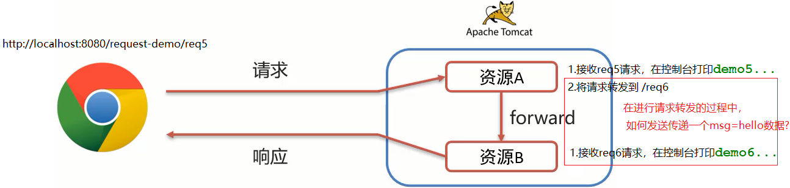

> 1.在RequestDemo5的doGet方法中转发请求之前，将数据存入request域对象中
>
> 2.在RequestDemo6的doGet方法从request域对象中获取数据，并将数据打印到控制台
>
> 3.启动访问测试

(1)修改RequestDemo5中的方法

```java
@WebServlet("/req5")
public class RequestDemo5 extends HttpServlet {
    @Override
    protected void doGet(HttpServletRequest request, HttpServletResponse response) throws ServletException, IOException {
        System.out.println("demo5...");
        //存储数据
        request.setAttribute("msg","hello");
        //请求转发
        request.getRequestDispatcher("/req6").forward(request,response);

    }

    @Override
    protected void doPost(HttpServletRequest request, HttpServletResponse response) throws ServletException, IOException {
        this.doGet(request, response);
    }
}
```

(2)修改RequestDemo6中的方法

```java
/**
 * 请求转发
 */
@WebServlet("/req6")
public class RequestDemo6 extends HttpServlet {
    @Override
    protected void doGet(HttpServletRequest request, HttpServletResponse response) throws ServletException, IOException {
        System.out.println("demo6...");
        //获取数据
        Object msg = request.getAttribute("msg");
        System.out.println(msg);

    }

    @Override
    protected void doPost(HttpServletRequest request, HttpServletResponse response) throws ServletException, IOException {
        this.doGet(request, response);
    }
}
```

(3)启动测试

访问`http://localhost:8080/request-demo/req5`,就可以在控制台看到如下内容:


此时就可以实现在转发多个资源之间共享数据。

4. 请求转发的特点

* 浏览器地址栏路径不发生变化

  虽然后台从`/req5`转发到`/req6`,但是浏览器的地址一直是`/req5`,未发生变化

  

* 只能转发到当前服务器的内部资源

  不能从一个服务器通过转发访问另一台服务器

* 一次请求，可以在转发资源间使用request共享数据

  虽然后台从`/req5`转发到`/req6`，但是这个==只有一次请求==

## 3，Response对象

前面讲解完Request对象，接下来我们回到刚开始的那张图:


* Request:使用request对象来==获取==请求数据
* Response:使用response对象来==设置==响应数据

Reponse的继承体系和Request的继承体系也非常相似:


 介绍完Response的相关体系结构后，接下来对于Response我们需要学习如下内容:

* Response设置响应数据的功能介绍
* Response完成重定向
* Response响应字符数据
* Response响应字节数据

### 3.1 Response设置响应数据功能介绍

HTTP响应数据总共分为三部分内容，分别是==响应行、响应头、响应体==，对于这三部分内容的数据，respone对象都提供了哪些方法来进行设置?

1. 响应行


对于响应头，比较常用的就是设置响应状态码:

```
void setStatus(int sc);
```

2. 响应头


设置响应头键值对：

```
void setHeader(String name,String value);
```

3. 响应体


对于响应体，是通过字符、字节输出流的方式往浏览器写，

获取字符输出流: 

```
PrintWriter getWriter();
```

获取字节输出流

```
ServletOutputStream getOutputStream();
```

介绍完这些方法后，后面我们会通过案例把这些方法都用一用，首先先来完成下重定向的功能开发。

### 3.2 Respones请求重定向

1. ==Response重定向(redirect):一种资源跳转方式。==


(1)浏览器发送请求给服务器，服务器中对应的资源A接收到请求

(2)资源A现在无法处理该请求，就会给浏览器响应一个302的状态码+location的一个访问资源B的路径

(3)浏览器接收到响应状态码为302就会重新发送请求到location对应的访问地址去访问资源B

(4)资源B接收到请求后进行处理并最终给浏览器响应结果，这整个过程就叫==重定向==

2. 重定向的实现方式:

```java
resp.setStatus(302);
resp.setHeader("location","资源B的访问路径");
```

具体如何来使用，我们先来看下需求:


针对上述需求，具体的实现步骤为:

> 1.创建一个ResponseDemo1类，接收/resp1的请求，在doGet方法中打印`resp1....`
>
> 2.创建一个ResponseDemo2类，接收/resp2的请求，在doGet方法中打印`resp2....`
>
> 3.在ResponseDemo1的方法中使用
>
> ​	response.setStatus(302);
>
> ​	response.setHeader("Location","/request-demo/resp2") 来给前端响应结果数据
>
> 4.启动测试

(1)创建ResponseDemo1类

```java
@WebServlet("/resp1")
public class ResponseDemo1 extends HttpServlet {
    @Override
    protected void doGet(HttpServletRequest request, HttpServletResponse response) throws ServletException, IOException {
        System.out.println("resp1....");
    }

    @Override
    protected void doPost(HttpServletRequest request, HttpServletResponse response) throws ServletException, IOException {
        this.doGet(request, response);
    }
}
```

(2)创建ResponseDemo2类

```java
@WebServlet("/resp2")
public class ResponseDemo2 extends HttpServlet {
    @Override
    protected void doGet(HttpServletRequest request, HttpServletResponse response) throws ServletException, IOException {
        System.out.println("resp2....");
    }

    @Override
    protected void doPost(HttpServletRequest request, HttpServletResponse response) throws ServletException, IOException {
        this.doGet(request, response);
    }
}
```

(3)在ResponseDemo1的doGet方法中给前端响应数据

```java
@WebServlet("/resp1")
public class ResponseDemo1 extends HttpServlet {
    @Override
    protected void doGet(HttpServletRequest request, HttpServletResponse response) throws ServletException, IOException {
        System.out.println("resp1....");
        //重定向
        //1.设置响应状态码 302
        response.setStatus(302);
        //2. 设置响应头 Location
        response.setHeader("Location","/request-demo/resp2");
    }

    @Override
    protected void doPost(HttpServletRequest request, HttpServletResponse response) throws ServletException, IOException {
        this.doGet(request, response);
    }
}
```

(4)启动测试

访问`http://localhost:8080/request-demo/resp1`,就可以在控制台看到如下内容:


说明`/resp1`和`/resp2`都被访问到了。到这重定向就已经完成了。

虽然功能已经实现，但是从设置重定向的两行代码来看，会发现除了重定向的地址不一样，其他的内容都是一模一样，所以response对象给我们提供了简化的编写方式为:

```
resposne.sendRedirect("/request-demo/resp2")
```

所以第3步中的代码就可以简化为：

```java
@WebServlet("/resp1")
public class ResponseDemo1 extends HttpServlet {
    @Override
    protected void doGet(HttpServletRequest request, HttpServletResponse response) throws ServletException, IOException {
        System.out.println("resp1....");
        //重定向
        resposne.sendRedirect("/request-demo/resp2")；
    }

    @Override
    protected void doPost(HttpServletRequest request, HttpServletResponse response) throws ServletException, IOException {
        this.doGet(request, response);
    }
}
```

3. 重定向的特点

* 浏览器地址栏路径发送变化

  当进行重定向访问的时候，由于是由浏览器发送的两次请求，所以地址会发生变化

  

* 可以重定向到任何位置的资源(服务内容、外部均可)

  因为第一次响应结果中包含了浏览器下次要跳转的路径，所以这个路径是可以任意位置资源。

* 两次请求，不能在多个资源使用request共享数据

  因为浏览器发送了两次请求，是两个不同的request对象，就无法通过request对象进行共享数据

介绍完==请求重定向==和==请求转发==以后，接下来需要把这两个放在一块对比下:


以后到底用哪个，还是需要根据具体的业务来决定。

### 3.3 路径问题

1. 问题1：转发的时候路径上没有加`/request-demo`而重定向加了，那么到底什么时候需要加，什么时候不需要加呢?

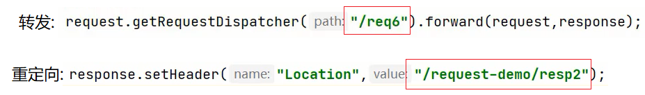

其实判断的依据很简单，只需要记住下面的规则即可:

* 浏览器使用:需要加虚拟目录(项目访问路径)
* 服务端使用:不需要加虚拟目录

对于转发来说，因为是在服务端进行的，所以不需要加虚拟目录

对于重定向来说，路径最终是由浏览器来发送请求，就需要添加虚拟目录。

掌握了这个规则，接下来就通过一些练习来强化下知识的学习:

* `<a href='路劲'>`
* `<form action='路径'>`
* req.getRequestDispatcher("路径")
* resp.sendRedirect("路径")

答案:

```
1.超链接，从浏览器发送，需要加
2.表单，从浏览器发送，需要加
3.转发，是从服务器内部跳转，不需要加
4.重定向，是由浏览器进行跳转，需要加。
```

2. 问题2：在重定向的代码中，`/request-demo`是固定编码的，如果后期通过Tomcat插件配置了项目的访问路径，那么所有需要重定向的地方都需要重新修改，该如何优化?


答案也比较简单，我们可以在代码中动态去获取项目访问的虚拟目录，具体如何获取，我们可以借助前面咱们所学习的request对象中的getContextPath()方法，修改后的代码如下:

```java
@WebServlet("/resp1")
public class ResponseDemo1 extends HttpServlet {
    @Override
    protected void doGet(HttpServletRequest request, HttpServletResponse response) throws ServletException, IOException {
        System.out.println("resp1....");

        //简化方式完成重定向
        //动态获取虚拟目录
        String contextPath = request.getContextPath();
        response.sendRedirect(contextPath+"/resp2");
    }

    @Override
    protected void doPost(HttpServletRequest request, HttpServletResponse response) throws ServletException, IOException {
        this.doGet(request, response);
    }
}
```

重新启动访问测试，功能依然能够实现，此时就可以动态获取项目访问的虚拟路径，从而降低代码的耦合度。

### 3.4 Response响应字符数据

要想将字符数据写回到浏览器，我们需要两个步骤:

* 通过Response对象获取字符输出流： PrintWriter writer = resp.getWriter();

* 通过字符输出流写数据: writer.write("aaa");

接下来，我们实现通过些案例把响应字符数据给实际应用下:

1. 返回一个简单的字符串`aaa`

```java
/**
 * 响应字符数据：设置字符数据的响应体
 */
@WebServlet("/resp3")
public class ResponseDemo3 extends HttpServlet {
    @Override
    protected void doGet(HttpServletRequest request, HttpServletResponse response) throws ServletException, IOException {
        response.setContentType("text/html;charset=utf-8");
        //1. 获取字符输出流
        PrintWriter writer = response.getWriter();
		 writer.write("aaa");
    }
    @Override
    protected void doPost(HttpServletRequest request, HttpServletResponse response) throws ServletException, IOException {
        this.doGet(request, response);
    }
}
```

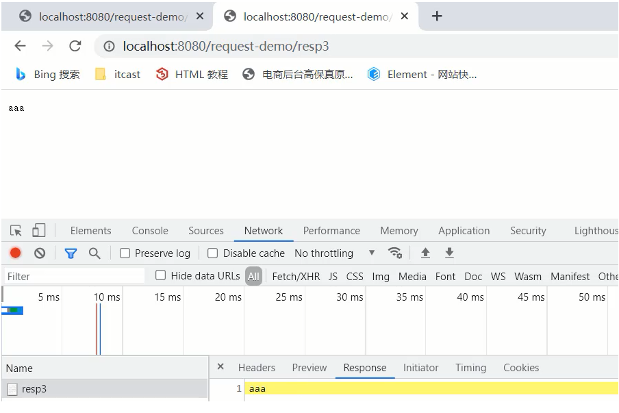

2. 返回一串html字符串，并且能被浏览器解析

```
PrintWriter writer = response.getWriter();
//content-type，告诉浏览器返回的数据类型是HTML类型数据，这样浏览器才会解析HTML标签
response.setHeader("content-type","text/html");
writer.write("<h1>aaa</h1>");
```


==注意:==一次请求响应结束后，response对象就会被销毁掉，所以不要手动关闭流。

3. 返回一个中文的字符串`你好`，需要注意设置响应数据的编码为`utf-8`

```
//设置响应的数据格式及数据的编码
response.setContentType("text/html;charset=utf-8");
writer.write("你好");
```


### 3.3 Response响应字节数据

要想将字节数据写回到浏览器，我们需要两个步骤:

- 通过Response对象获取字节输出流：ServletOutputStream outputStream = resp.getOutputStream();

- 通过字节输出流写数据: outputStream.write(字节数据);

接下来，我们实现通过些案例把响应字符数据给实际应用下:

1. 返回一个图片文件到浏览器

```java
/**
 * 响应字节数据：设置字节数据的响应体
 */
@WebServlet("/resp4")
public class ResponseDemo4 extends HttpServlet {
    @Override
    protected void doGet(HttpServletRequest request, HttpServletResponse response) throws ServletException, IOException {
        //1. 读取文件
        FileInputStream fis = new FileInputStream("d://a.jpg");
        //2. 获取response字节输出流
        ServletOutputStream os = response.getOutputStream();
        //3. 完成流的copy
        byte[] buff = new byte[1024];
        int len = 0;
        while ((len = fis.read(buff))!= -1){
            os.write(buff,0,len);
        }
        fis.close();
    }

    @Override
    protected void doPost(HttpServletRequest request, HttpServletResponse response) throws ServletException, IOException {
        this.doGet(request, response);
    }
}
```


上述代码中，对于流的copy的代码还是比较复杂的，所以我们可以使用别人提供好的方法来简化代码的开发，具体的步骤是:

(1)pom.xml添加依赖

```xml
<dependency>
    <groupId>commons-io</groupId>
    <artifactId>commons-io</artifactId>
    <version>2.6</version>
</dependency>
```

(2)调用工具类方法

```
//fis:输入流
//os:输出流
IOUtils.copy(fis,os);
```

优化后的代码:

```java
/**
 * 响应字节数据：设置字节数据的响应体
 */
@WebServlet("/resp4")
public class ResponseDemo4 extends HttpServlet {
    @Override
    protected void doGet(HttpServletRequest request, HttpServletResponse response) throws ServletException, IOException {
        //1. 读取文件
        FileInputStream fis = new FileInputStream("d://a.jpg");
        //2. 获取response字节输出流
        ServletOutputStream os = response.getOutputStream();
        //3. 完成流的copy
      	IOUtils.copy(fis,os);
        fis.close();
    }

    @Override
    protected void doPost(HttpServletRequest request, HttpServletResponse response) throws ServletException, IOException {
        this.doGet(request, response);
    }
}
```

## 4，用户注册登录案例

接下来我们通过两个比较常见的案例，一个是==注册==，一个是==登录==来对今天学习的内容进行一个实战演练，首先来实现用户登录。

### 4.1 用户登录

#### 4.1.1 需求分析


1. 用户在登录页面输入用户名和密码，提交请求给LoginServlet
2. 在LoginServlet中接收请求和数据[用户名和密码]
3. 在LoginServlt中通过Mybatis实现调用UserMapper来根据用户名和密码查询数据库表
4. 将查询的结果封装到User对象中进行返回
5. 在LoginServlet中判断返回的User对象是否为null
6. 如果为nul，说明根据用户名和密码没有查询到用户，则登录失败，返回"登录失败"数据给前端
7. 如果不为null,则说明用户存在并且密码正确，则登录成功，返回"登录成功"数据给前端

#### 4.1.2 环境准备

1. 复制资料中的静态页面到项目的webapp目录下

参考`资料\1. 登陆注册案例\1. 静态页面`,拷贝完效果如下:

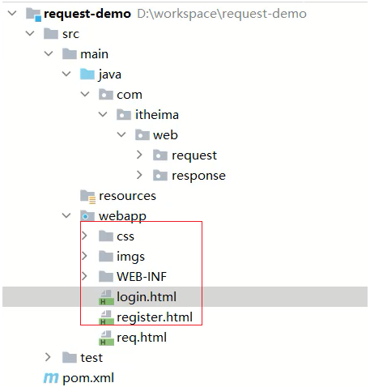

2. 创建db1数据库，创建tb_user表，创建User实体类

2.1 将`资料\1. 登陆注册案例\2. MyBatis环境\tb_user.sql`中的sql语句执行下:


 2.2 将`资料\1. 登陆注册案例\2. MyBatis环境\User.java`拷贝到com.itheima.pojo


3. 在项目的pom.xml导入Mybatis和Mysql驱动坐标

```xml
<dependency>
    <groupId>org.mybatis</groupId>
    <artifactId>mybatis</artifactId>
    <version>3.5.5</version>
</dependency>

<dependency>
    <groupId>mysql</groupId>
    <artifactId>mysql-connector-java</artifactId>
    <version>5.1.34</version>
</dependency>
```

4. 创建mybatis-config.xml核心配置文件，UserMapper.xml映射文件,UserMapper接口

4.1  将`资料\1. 登陆注册案例\2. MyBatis环境\mybatis-config.xml`拷贝到resources目录下


```xml
<?xml version="1.0" encoding="UTF-8" ?>
<!DOCTYPE configuration
        PUBLIC "-//mybatis.org//DTD Config 3.0//EN"
        "http://mybatis.org/dtd/mybatis-3-config.dtd">
<configuration>
    <!--起别名-->
    <typeAliases>
        <package name="com.itheima.pojo"/>
    </typeAliases>

    <environments default="development">
        <environment id="development">
            <transactionManager type="JDBC"/>
            <dataSource type="POOLED">
                <property name="driver" value="com.mysql.jdbc.Driver"/>
                <!--
                    useSSL:关闭SSL安全连接 性能更高
                    useServerPrepStmts:开启预编译功能
                    &amp; 等同于 & ,xml配置文件中不能直接写 &符号
                -->
                <property name="url" value="jdbc:mysql:///db1?useSSL=false&amp;useServerPrepStmts=true"/>
                <property name="username" value="root"/>
                <property name="password" value="1234"/>
            </dataSource>
        </environment>
    </environments>
    <mappers>
        <!--扫描mapper-->
        <package name="com.itheima.mapper"/>
    </mappers>
</configuration>
```

4.2 在com.itheima.mapper包下创建UserMapper接口

```java
public interface UserMapper {

}
```

4.3 将`资料\1. 登陆注册案例\2. MyBatis环境\UserMapper.xml`拷贝到resources目录下

==注意：在resources下创建UserMapper.xml的目录时，要使用/分割==

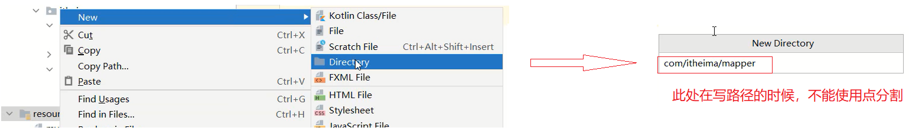

至此我们所需要的环境就都已经准备好了，具体该如何实现?

#### 4.1.3 代码实现

1. 在UserMapper接口中提供一个根据用户名和密码查询用户对象的方法

```java
/**
     * 根据用户名和密码查询用户对象
     * @param username
     * @param password
     * @return
     */
    @Select("select * from tb_user where username = #{username} and password = #{password}")
    User select(@Param("username") String username,@Param("password")  String password);
```

**说明**

@Param注解的作用:用于传递参数,是方法的参数可以与SQL中的字段名相对应。

2. 修改loign.html

```html
<!DOCTYPE html>
<html lang="en">

<head>
    <meta charset="UTF-8">
    <title>login</title>
    <link href="css/login.css" rel="stylesheet">
</head>

<body>
<div id="loginDiv">
    <form action="/request-demo/loginServlet" method="post" id="form">
        <h1 id="loginMsg">LOGIN IN</h1>
        <p>Username:<input id="username" name="username" type="text"></p>

        <p>Password:<input id="password" name="password" type="password"></p>

        <div id="subDiv">
            <input type="submit" class="button" value="login up">
            <input type="reset" class="button" value="reset">&nbsp;&nbsp;&nbsp;
            <a href="register.html">没有账号？点击注册</a>
        </div>
    </form>
</div>

</body>
</html>
```

3. 编写LoginServlet

```java
@WebServlet("/loginServlet")
public class LoginServlet extends HttpServlet {
    @Override
    protected void doGet(HttpServletRequest request, HttpServletResponse response) throws ServletException, IOException {
        //1. 接收用户名和密码
        String username = request.getParameter("username");
        String password = request.getParameter("password");

        //2. 调用MyBatis完成查询
        //2.1 获取SqlSessionFactory对象
        String resource = "mybatis-config.xml";
        InputStream inputStream = Resources.getResourceAsStream(resource);
        SqlSessionFactory sqlSessionFactory = new SqlSessionFactoryBuilder().build(inputStream);
        //2.2 获取SqlSession对象
        SqlSession sqlSession = sqlSessionFactory.openSession();
        //2.3 获取Mapper
        UserMapper userMapper = sqlSession.getMapper(UserMapper.class);
        //2.4 调用方法
        User user = userMapper.select(username, password);
        //2.5 释放资源
        sqlSession.close();


        //获取字符输出流，并设置content type
        response.setContentType("text/html;charset=utf-8");
        PrintWriter writer = response.getWriter();
        //3. 判断user释放为null
        if(user != null){
            // 登陆成功
            writer.write("登陆成功");
        }else {
            // 登陆失败
            writer.write("登陆失败");
        }
    }

    @Override
    protected void doPost(HttpServletRequest request, HttpServletResponse response) throws ServletException, IOException {
        this.doGet(request, response);
    }
}
```

4. 启动服务器测试

4.1 如果用户名和密码输入错误，则


4.2 如果用户名和密码输入正确，则

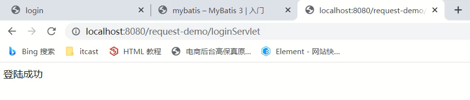

至此用户的登录功能就已经完成了~

### 4.2 用户注册

#### 4.2.1 需求分析

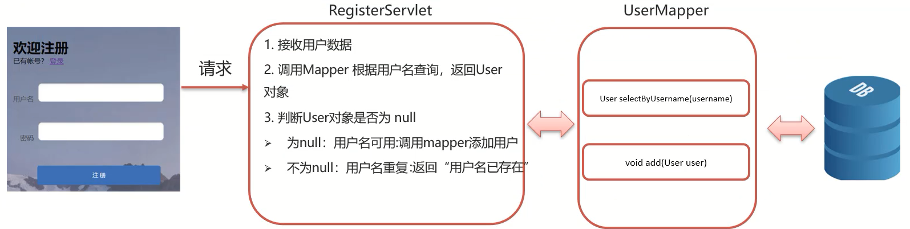

1. 用户在注册页面输入用户名和密码，提交请求给RegisterServlet
2. 在RegisterServlet中接收请求和数据[用户名和密码]
3. 在RegisterServlet中通过Mybatis实现调用UserMapper来根据用户名查询数据库表
4. 将查询的结果封装到User对象中进行返回
5. 在RegisterServlet中判断返回的User对象是否为null
6. 如果为nul，说明根据用户名可用，则调用UserMapper来实现添加用户
7. 如果不为null,则说明用户不可以，返回"用户名已存在"数据给前端

#### 4.2.2 代码编写

1. 编写UserMapper提供根据用户名查询用户数据方法和添加用户方法

```java
/**
* 根据用户名查询用户对象
* @param username
* @return
*/
@Select("select * from tb_user where username = #{username}")
User selectByUsername(String username);

/**
* 添加用户
* @param user
*/
@Insert("insert into tb_user values(null,#{username},#{password})")
void add(User user);
```

2. 修改register.html

```html
<!DOCTYPE html>
<html lang="en">
<head>
    <meta charset="UTF-8">
    <title>欢迎注册</title>
    <link href="css/register.css" rel="stylesheet">
</head>
<body>

<div class="form-div">
    <div class="reg-content">
        <h1>欢迎注册</h1>
        <span>已有帐号？</span> <a href="login.html">登录</a>
    </div>
    <form id="reg-form" action="/request-demo/registerServlet" method="post">

        <table>

            <tr>
                <td>用户名</td>
                <td class="inputs">
                    <input name="username" type="text" id="username">
                    <br>
                    <span id="username_err" class="err_msg" style="display: none">用户名不太受欢迎</span>
                </td>

            </tr>

            <tr>
                <td>密码</td>
                <td class="inputs">
                    <input name="password" type="password" id="password">
                    <br>
                    <span id="password_err" class="err_msg" style="display: none">密码格式有误</span>
                </td>
            </tr>

        </table>

        <div class="buttons">
            <input value="注 册" type="submit" id="reg_btn">
        </div>
        <br class="clear">
    </form>

</div>
</body>
</html>
```

3. 创建RegisterServlet类

```java
@WebServlet("/registerServlet")
public class RegisterServlet extends HttpServlet {
    @Override
    protected void doGet(HttpServletRequest request, HttpServletResponse response) throws ServletException, IOException {
        //1. 接收用户数据
        String username = request.getParameter("username");
        String password = request.getParameter("password");

        //封装用户对象
        User user = new User();
        user.setUsername(username);
        user.setPassword(password);

        //2. 调用mapper 根据用户名查询用户对象
        //2.1 获取SqlSessionFactory对象
        String resource = "mybatis-config.xml";
        InputStream inputStream = Resources.getResourceAsStream(resource);
        SqlSessionFactory sqlSessionFactory = new SqlSessionFactoryBuilder().build(inputStream);
        //2.2 获取SqlSession对象
        SqlSession sqlSession = sqlSessionFactory.openSession();
        //2.3 获取Mapper
        UserMapper userMapper = sqlSession.getMapper(UserMapper.class);

        //2.4 调用方法
        User u = userMapper.selectByUsername(username);

        //3. 判断用户对象释放为null
        if( u == null){
            // 用户名不存在，添加用户
            userMapper.add(user);

            // 提交事务
            sqlSession.commit();
            // 释放资源
            sqlSession.close();
        }else {
            // 用户名存在，给出提示信息
            response.setContentType("text/html;charset=utf-8");
            response.getWriter().write("用户名已存在");
        }

    }

    @Override
    protected void doPost(HttpServletRequest request, HttpServletResponse response) throws ServletException, IOException {
        this.doGet(request, response);
    }
}
```

4. 启动服务器进行测试

4.1 如果测试成功，则在数据库中就能查看到新注册的数据

4.2 如果用户已经存在，则在页面上展示 `用户名已存在` 的提示信息

### 4.3 SqlSessionFactory工具类抽取

上面两个功能已经实现，但是在写Servlet的时候，因为需要使用Mybatis来完成数据库的操作，所以对于Mybatis的基础操作就出现了些重复代码，如下

```java
String resource = "mybatis-config.xml";
InputStream inputStream = Resources.getResourceAsStream(resource);
SqlSessionFactory sqlSessionFactory = new 
	SqlSessionFactoryBuilder().build(inputStream);
```

有了这些重复代码就会造成一些问题:

* 重复代码不利于后期的维护
* SqlSessionFactory工厂类进行重复创建
  * 就相当于每次买手机都需要重新创建一个手机生产工厂来给你制造一个手机一样，资源消耗非常大但性能却非常低。所以这么做是不允许的。

那如何来优化呢？

* 代码重复可以抽取工具类
* 对指定代码**只需要执行一次可以使用静态代码块**

有了这两个方向后，代码具体该如何编写?

```java
public class SqlSessionFactoryUtils {

    private static SqlSessionFactory sqlSessionFactory;

    static {
        //静态代码块会随着类的加载而自动执行，且只执行一次
        try {
            String resource = "mybatis-config.xml";
            InputStream inputStream = Resources.getResourceAsStream(resource);
            sqlSessionFactory = new SqlSessionFactoryBuilder().build(inputStream);
        } catch (IOException e) {
            e.printStackTrace();
        } 
    }


    public static SqlSessionFactory getSqlSessionFactory(){
        return sqlSessionFactory;
    }
}
```

工具类抽取以后，以后在对Mybatis的SqlSession进行操作的时候，就可以直接使用

```java
SqlSessionFactory sqlSessionFactory =SqlSessionFactoryUtils.getSqlSessionFactory();
```

这样就可以很好的解决上面所说的代码重复和重复创建工厂导致性能低的问题了。


# day10 JSP

**今日目标：**

> * 理解 JSP 及 JSP 原理
> * 能在 JSP中使用 `EL表达式` 和 `JSTL标签`
> * 理解 `MVC模式` 和 `三层架构`
> * 能完成品牌数据的增删改查功能

## 1，JSP 概述

==JSP（全称：Java Server Pages）：Java 服务端页面。==是一种动态的网页技术，其中既可以定义 HTML、JS、CSS等静态内容，还可以定义 Java代码的动态内容，也就是 `JSP = HTML + Java`。如下就是jsp代码

```jsp
<html>
    <head>
        <title>Title</title>
    </head>
    <body>
        <h1>JSP,Hello World</h1>
        <%
        	System.out.println("hello,jsp~");
        %>
    </body>
</html>
```

上面代码 `h1` 标签内容是展示在页面上，而 Java 的输出语句是输出在 idea 的控制台。

那么，JSP 能做什么呢？现在我们只用 `servlet` 实现功能，看存在什么问题。如下图所示，当我们登陆成功后，需要在页面上展示用户名

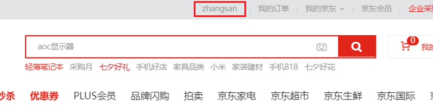 

上图的用户名是动态展示，也就是谁登陆就展示谁的用户名。只用 `servlet` 如何实现呢？在今天的资料里已经提供好了一个 `LoginServlet` ，该 `servlet` 就是实现这个功能的，现将资料中的 `LoginServlet.java` 拷贝到 `request-demo` 项目中来演示。接下来启动服务器并访问登陆页面

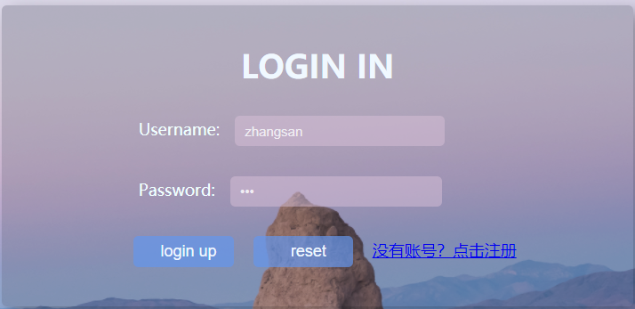

输入了 `zhangsan` 用户的登陆信息后点击 `登陆` 按钮，就能看到如下图效果


当然如果是 `lisi` 登陆的，在该页面展示的就是 `lisi,欢迎您`，动态的展示效果就实现了。那么 `LoginServlet` 到底是如何实现的，我们看看它里面的内容


上面的代码有大量使用到 `writer` 对象向页面写标签内容，这样我们的代码就显得很麻烦；将来如果展示的效果出现了问题，排错也显得有点力不从心。而 JSP 是如何解决这个问题的呢？在资料中也提供了一个 `login.jsp` 页面，该页面也能实现该功能，现将该页面拷贝到项目的 `webapp`下，需要修改 `login.html` 中表单数据提交的路径为下图


重新启动服务器并进行测试，发现也可以实现同样的功能。那么 `login.jsp` 又是如何实现的呢？那我们来看看 `login.jsp` 的代码

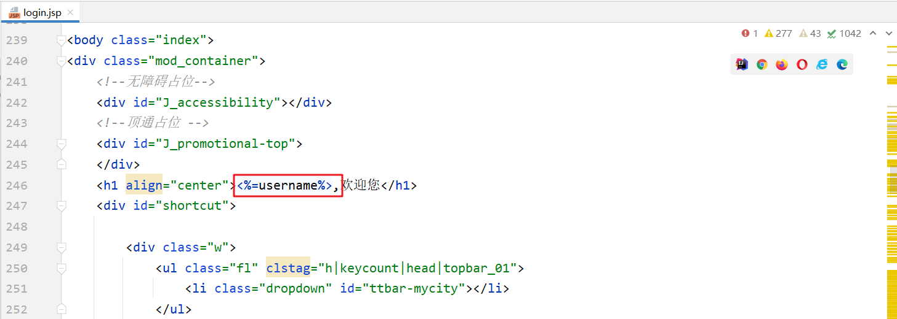

上面代码可以看到里面基本都是 `HTML` 标签，而动态数据使用 Java 代码进行展示；这样操作看起来要比用 `servlet` 实现要舒服很多。

JSP 作用：简化开发，避免了在Servlet中直接输出HTML标签。

## 2，JSP 快速入门

接下来我们做一个简单的快速入门代码。

### 2.1  搭建环境

创建一个maven的 web 项目，项目结构如下：


`pom.xml` 文件内容如下：

```xml
<?xml version="1.0" encoding="UTF-8"?>
<project xmlns="http://maven.apache.org/POM/4.0.0"
         xmlns:xsi="http://www.w3.org/2001/XMLSchema-instance"
         xsi:schemaLocation="http://maven.apache.org/POM/4.0.0 http://maven.apache.org/xsd/maven-4.0.0.xsd">
    <modelVersion>4.0.0</modelVersion>

    <groupId>org.example</groupId>
    <artifactId>jsp-demo</artifactId>
    <version>1.0-SNAPSHOT</version>
    <packaging>war</packaging>

    <properties>
        <maven.compiler.source>8</maven.compiler.source>
        <maven.compiler.target>8</maven.compiler.target>
    </properties>

    <dependencies>
      <dependency>
            <groupId>javax.servlet</groupId>
            <artifactId>javax.servlet-api</artifactId>
            <version>3.1.0</version>
            <scope>provided</scope>
        </dependency>
    </dependencies>

    <build>
        <plugins>
            <plugin>
                <groupId>org.apache.tomcat.maven</groupId>
                <artifactId>tomcat7-maven-plugin</artifactId>
                <version>2.2</version>
            </plugin>
        </plugins>
    </build>
</project>
```

### 2.2  导入 JSP 依赖

在 `dependencies` 标签中导入 JSP 的依赖，如下

```xml
<dependency>
    <groupId>javax.servlet.jsp</groupId>
    <artifactId>jsp-api</artifactId>
    <version>2.2</version>
    <scope>provided</scope>
</dependency>
```

该依赖的 `scope` 必须设置为 `provided`，因为 tomcat 中有这个jar包了，所以在打包时我们是不希望将该依赖打进到我们工程的war包中。

### 2.3  创建 jsp 页面

在项目的 `webapp` 下创建jsp页面


通过上面方式创建一个名为 `hello.jsp` 的页面。

### 2.4  编写代码

在 `hello.jsp` 页面中书写 `HTML` 标签和 `Java` 代码，如下

```jsp
<%@ page contentType="text/html;charset=UTF-8" language="java" %>
<html>
<head>
    <title>Title</title>
</head>
<body>
    <h1>hello jsp</h1>

    <%
        System.out.println("hello,jsp~");
    %>
</body>
</html>
```

### 2.5  测试

启动服务器并在浏览器地址栏输入 `http://localhost:8080/jsp-demo/hello.jsp`，我们可以在页面上看到如下内容

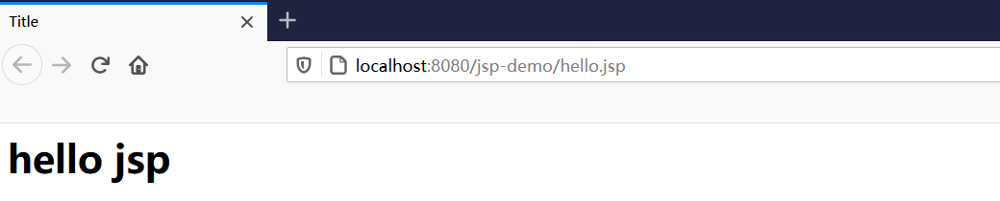

同时也可以看到在 `idea` 的控制台看到输出的 `hello,jsp~` 内容。

## 3，JSP 原理

我们之前说 JSP 就是一个页面，那么在 JSP 中写 `html` 标签，我们能理解，但是为什么还可以写 `Java` 代码呢？

因为 ==JSP 本质上就是一个 Servlet。==接下来我们聊聊访问jsp时的流程


1. 浏览器第一次访问 `hello.jsp` 页面
2. `tomcat` 会将 `hello.jsp` 转换为名为 `hello_jsp.java` 的一个 `Servlet`
3. `tomcat` 再将转换的 `servlet` 编译成字节码文件 `hello_jsp.class`
4. `tomcat` 会执行该字节码文件，向外提供服务

我们可以到项目所在磁盘目录下找 `target\tomcat\work\Tomcat\localhost\jsp-demo\org\apache\jsp` 目录，而这个目录下就能看到转换后的 `servlet`

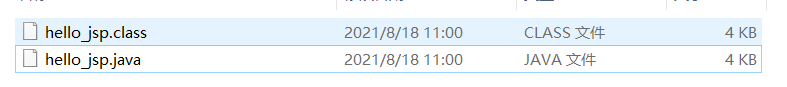

打开 `hello_jsp.java` 文件，来查看里面的代码


由上面的类的继承关系可以看到继承了名为 `HttpJspBase` 这个类，那我们在看该类的继承关系。到资料中的找如下目录： `资料\tomcat源码\apache-tomcat-8.5.68-src\java\org\apache\jasper\runtime` ，该目录下就有 `HttpJspBase` 类，查看该类的继承关系


可以看到该类继承了 `HttpServlet` ；那么 `hello_jsp` 这个类就间接的继承了 `HttpServlet` ，也就说明 `hello_jsp` 是一个 `servlet`。

继续阅读 `hello_jsp` 类的代码，可以看到有一个名为 `_jspService()` 的方法，该方法就是每次访问 `jsp` 时自动执行的方法，和 `servlet` 中的 `service` 方法一样 。

而在 `_jspService()` 方法中可以看到往浏览器写标签的代码：

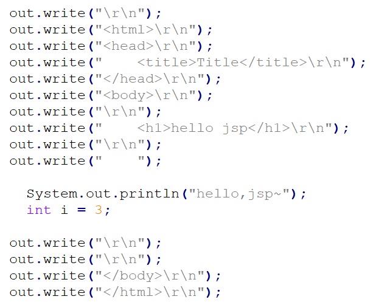

以前我们自己写 `servlet` 时，这部分代码是由我们自己来写，现在有了 `jsp` 后，由tomcat完成这部分功能。

## 4，JSP 脚本

JSP脚本用于在 JSP页面内定义 Java代码。在之前的入门案例中我们就在 JSP 页面定义的 Java 代码就是 JSP 脚本。

### 4.1  JSP 脚本分类

JSP 脚本有如下三个分类：

* <%...%>：内容会直接放到_jspService()方法之中
* <%=…%>：内容会放到out.print()中，作为out.print()的参数
* <%!…%>：内容会放到_jspService()方法之外，被类直接包含

**代码演示：**

在 `hello.jsp` 中书写

```jsp
<%
    System.out.println("hello,jsp~");
    int i = 3;
%>
```

通过浏览器访问 `hello.jsp` 后，查看转换的 `hello_jsp.java` 文件，i 变量定义在了 `_jspService()` 方法中


在 `hello.jsp` 中书写

```jsp
<%="hello"%>
<%=i%>
```

通过浏览器访问 `hello.jsp` 后，查看转换的 `hello_jsp.java` 文件，该脚本的内容被放在了 `out.print()` 中，作为参数


在 `hello.jsp` 中书写

```jsp
<%!
    void  show(){}
	String name = "zhangsan";
%>
```

通过浏览器访问 `hello.jsp` 后，查看转换的 `hello_jsp.java` 文件，该脚本的内容被放在了成员位置


### 4.2  案例

#### 4.2.1  需求

使用JSP脚本展示品牌数据

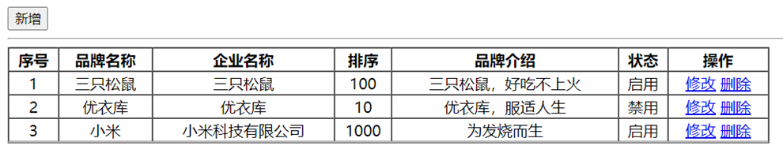

说明：

* 在资料 `资料\1. JSP案例素材` 中提供了 `brand.html` 静态页面
* 在该案例中数据不从数据库中查询，而是在 JSP 页面上写死

#### 4.2.2  实现

* 将资料 `资料\1. JSP案例素材` 中的 `Brand.java` 文件放置到项目的 `com.itheima.pojo` 包下

* 在项目的 `webapp` 中创建 `brand.jsp` ，并将 `brand.html`页面中的内容拷贝过来。`brand.jsp` 内容如下

  ```jsp
  <%@ page contentType="text/html;charset=UTF-8" language="java" %>
  <!DOCTYPE html>
  <html lang="en">
  <head>
      <meta charset="UTF-8">
      <title>Title</title>
  </head>
  <body>
  <input type="button" value="新增"><br>
  <hr>
      <table border="1" cellspacing="0" width="800">
          <tr>
              <th>序号</th>
              <th>品牌名称</th>
              <th>企业名称</th>
              <th>排序</th>
              <th>品牌介绍</th>
              <th>状态</th>
              <th>操作</th>
  
          </tr>
          <tr align="center">
              <td>1</td>
              <td>三只松鼠</td>
              <td>三只松鼠</td>
              <td>100</td>
              <td>三只松鼠，好吃不上火</td>
              <td>启用</td>
              <td><a href="#">修改</a> <a href="#">删除</a></td>
          </tr>
  
          <tr align="center">
              <td>2</td>
              <td>优衣库</td>
              <td>优衣库</td>
              <td>10</td>
              <td>优衣库，服适人生</td>
              <td>禁用</td>
  
              <td><a href="#">修改</a> <a href="#">删除</a></td>
          </tr>
  
          <tr align="center">
              <td>3</td>
              <td>小米</td>
              <td>小米科技有限公司</td>
              <td>1000</td>
              <td>为发烧而生</td>
              <td>启用</td>
  
              <td><a href="#">修改</a> <a href="#">删除</a></td>
          </tr>
      </table>
  </body>
  </html>
  ```

  现在页面中的数据都是假数据。

* 在 `brand.jsp` 中准备一些数据

  ```jsp
  <%
      // 查询数据库
      List<Brand> brands = new ArrayList<Brand>();
      brands.add(new Brand(1,"三只松鼠","三只松鼠",100,"三只松鼠，好吃不上火",1));
      brands.add(new Brand(2,"优衣库","优衣库",200,"优衣库，服适人生",0));
      brands.add(new Brand(3,"小米","小米科技有限公司",1000,"为发烧而生",1));
  %>
  ```

  > ==注意：==这里的类是需要导包的

* 将 `brand.jsp` 页面中的 `table` 标签中的数据改为动态的

  ```jsp
  <table border="1" cellspacing="0" width="800">
      <tr>
          <th>序号</th>
          <th>品牌名称</th>
          <th>企业名称</th>
          <th>排序</th>
          <th>品牌介绍</th>
          <th>状态</th>
          <th>操作</th>
  
      </tr>
      
      <%
       for (int i = 0; i < brands.size(); i++) {
           //获取集合中的 每一个 Brand 对象
           Brand brand = brands.get(i);
       }
      %>
      <tr align="center">
          <td>1</td>
          <td>三只松鼠</td>
          <td>三只松鼠</td>
          <td>100</td>
          <td>三只松鼠，好吃不上火</td>
          <td>启用</td>
          <td><a href="#">修改</a> <a href="#">删除</a></td>
      </tr>
  </table>
  ```

  上面的for循环需要将 `tr` 标签包裹起来，这样才能实现循环的效果，代码改进为

  ```jsp
  <table border="1" cellspacing="0" width="800">
      <tr>
          <th>序号</th>
          <th>品牌名称</th>
          <th>企业名称</th>
          <th>排序</th>
          <th>品牌介绍</th>
          <th>状态</th>
          <th>操作</th>
  
      </tr>
      
      <%
       for (int i = 0; i < brands.size(); i++) {
           //获取集合中的 每一个 Brand 对象
           Brand brand = brands.get(i);
      %>
      	 <tr align="center">
              <td>1</td>
              <td>三只松鼠</td>
              <td>三只松鼠</td>
              <td>100</td>
              <td>三只松鼠，好吃不上火</td>
              <td>启用</td>
              <td><a href="#">修改</a> <a href="#">删除</a></td>
          </tr>
      <%
       }
      %>
     
  </table>
  ```

  > 注意：<%%> 里面写的是 Java 代码，而外边写的是 HTML 标签

  上面代码中的 `td` 标签中的数据都需要是动态的，所以还需要改进

  ```jsp
  <table border="1" cellspacing="0" width="800">
      <tr>
          <th>序号</th>
          <th>品牌名称</th>
          <th>企业名称</th>
          <th>排序</th>
          <th>品牌介绍</th>
          <th>状态</th>
          <th>操作</th>
  
      </tr>
      
      <%
       for (int i = 0; i < brands.size(); i++) {
           //获取集合中的 每一个 Brand 对象
           Brand brand = brands.get(i);
      %>
      	 <tr align="center">
              <td><%=brand.getId()%></td>
              <td><%=brand.getBrandName()%></td>
              <td><%=brand.getCompanyName()%></td>
              <td><%=brand.getOrdered()%></td>
              <td><%=brand.getDescription()%></td>
              <td><%=brand.getStatus() == 1 ? "启用":"禁用"%></td>
              <td><a href="#">修改</a> <a href="#">删除</a></td>
          </tr>
      <%
       }
      %>
     
  </table>
  ```

#### 4.2.3  成品代码

```jsp
<%@ page import="com.itheima.pojo.Brand" %>
<%@ page import="java.util.List" %>
<%@ page import="java.util.ArrayList" %>
<%@ page contentType="text/html;charset=UTF-8" language="java" %>

<%
    // 查询数据库
    List<Brand> brands = new ArrayList<Brand>();
    brands.add(new Brand(1,"三只松鼠","三只松鼠",100,"三只松鼠，好吃不上火",1));
    brands.add(new Brand(2,"优衣库","优衣库",200,"优衣库，服适人生",0));
    brands.add(new Brand(3,"小米","小米科技有限公司",1000,"为发烧而生",1));

%>


<!DOCTYPE html>
<html lang="en">
<head>
    <meta charset="UTF-8">
    <title>Title</title>
</head>
<body>
<input type="button" value="新增"><br>
<hr>
<table border="1" cellspacing="0" width="800">
    <tr>
        <th>序号</th>
        <th>品牌名称</th>
        <th>企业名称</th>
        <th>排序</th>
        <th>品牌介绍</th>
        <th>状态</th>
        <th>操作</th>
    </tr>
    <%
        for (int i = 0; i < brands.size(); i++) {
            Brand brand = brands.get(i);
    %>

    <tr align="center">
        <td><%=brand.getId()%></td>
        <td><%=brand.getBrandName()%></td>
        <td><%=brand.getCompanyName()%></td>
        <td><%=brand.getOrdered()%></td>
        <td><%=brand.getDescription()%></td>
		<td><%=brand.getStatus() == 1 ? "启用":"禁用"%></td>
        <td><a href="#">修改</a> <a href="#">删除</a></td>
    </tr>

    <%
        }
    %>
</table>
</body>
</html>
```

#### 4.2.4  测试

在浏览器地址栏输入 `http://localhost:8080/jsp-demo/brand.jsp` ，页面展示效果如下


### 4.3  JSP 缺点

通过上面的案例，我们可以看到 JSP 的很多缺点。

由于 JSP页面内，既可以定义 HTML 标签，又可以定义 Java代码，造成了以下问题：

* 书写麻烦：特别是复杂的页面

  既要写 HTML 标签，还要写 Java 代码

* 阅读麻烦

  上面案例的代码，相信你后期再看这段代码时还需要花费很长的时间去梳理

* 复杂度高：运行需要依赖于各种环境，JRE，JSP容器，JavaEE…

* 占内存和磁盘：JSP会自动生成.java和.class文件占磁盘，运行的是.class文件占内存

* 调试困难：出错后，需要找到自动生成的.java文件进行调试

* 不利于团队协作：前端人员不会 Java，后端人员不精 HTML

  如果页面布局发生变化，前端工程师对静态页面进行修改，然后再交给后端工程师，由后端工程师再将该页面改为 JSP 页面

由于上述的问题， ==JSP 已逐渐退出历史舞台，==以后开发更多的是使用 ==HTML +  Ajax== 来替代。Ajax 是我们后续会重点学习的技术。有个这个技术后，前端工程师负责前端页面开发，而后端工程师只负责前端代码开发。下来对技术的发展进行简单的说明

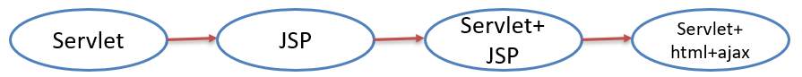

1. 第一阶段：使用 `servlet` 即实现逻辑代码编写，也对页面进行拼接。这种模式我们之前也接触过

2. 第二阶段：随着技术的发展，出现了 `JSP` ，人们发现 `JSP` 使用起来比 `Servlet` 方便很多，但是还是要在 `JSP` 中嵌套 `Java` 代码，也不利于后期的维护

3. 第三阶段：使用 `Servlet` 进行逻辑代码开发，而使用 `JSP` 进行数据展示

   

4. 第四阶段：使用 `servlet` 进行后端逻辑代码开发，而使用 `HTML` 进行数据展示。而这里面就存在问题，`HTML` 是静态页面，怎么进行动态数据展示呢？这就是 `ajax` 的作用了。

那既然 JSP 已经逐渐的退出历史舞台，那我们为什么还要学习 `JSP` 呢？原因有两点：

* 一些公司可能有些老项目还在用 `JSP` ，所以要求我们必须动 `JSP`
* 我们如果不经历这些复杂的过程，就不能体现后面阶段开发的简单

接下来我们来学习第三阶段，使用 `EL表达式` 和 `JSTL` 标签库替换 `JSP` 中的 `Java` 代码。

## 5，EL 表达式

### 5.1  概述

EL（全称Expression Language ）表达式语言，用于简化 JSP 页面内的 Java 代码。

EL 表达式的主要作用是 ==获取数据==。其实就是从域对象中获取数据，然后将数据展示在页面上。

而 EL 表达式的语法也比较简单，==${expression}== 。例如：${brands} 就是获取域中存储的 key 为 brands 的数据。

### 5.2  代码演示

* 定义servlet，在 servlet 中封装一些数据并存储到 request 域对象中并转发到 `el-demo.jsp` 页面。

  ```java
  @WebServlet("/demo1")
  public class ServletDemo1 extends HttpServlet {
      @Override
      protected void doGet(HttpServletRequest request, HttpServletResponse response) throws ServletException, IOException {
          //1. 准备数据
          List<Brand> brands = new ArrayList<Brand>();
          brands.add(new Brand(1,"三只松鼠","三只松鼠",100,"三只松鼠，好吃不上火",1));
          brands.add(new Brand(2,"优衣库","优衣库",200,"优衣库，服适人生",0));
          brands.add(new Brand(3,"小米","小米科技有限公司",1000,"为发烧而生",1));
  
          //2. 存储到request域中
          request.setAttribute("brands",brands);
  
          //3. 转发到 el-demo.jsp
          request.getRequestDispatcher("/el-demo.jsp").forward(request,response);
      }
  
      @Override
      protected void doPost(HttpServletRequest request, HttpServletResponse response) throws ServletException, IOException {
          this.doGet(request, response);
      }
  }
  ```

  > ==注意：== 此处需要用转发，因为转发才可以使用 request 对象作为域对象进行数据共享

* 在 `el-demo.jsp` 中通过 EL表达式 获取数据

  ```jsp
  <%@ page contentType="text/html;charset=UTF-8" language="java" %>
  <html>
  <head>
      <title>Title</title>
  </head>
  <body>
      ${brands}
  </body>
  </html>
  ```

* 在浏览器的地址栏输入 `http://localhost:8080/jsp-demo/demo1` ，页面效果如下：

  

### 5.3  域对象

JavaWeb中有四大域对象，分别是：

* page：当前页面有效
* request：当前请求有效
* session：当前会话有效
* application：当前应用有效

el 表达式获取数据，会依次从这4个域中寻找，直到找到为止。而这四个域对象的作用范围如下图所示


例如： ${brands}，el 表达式获取数据，会先从page域对象中获取数据，如果没有再到 requet 域对象中获取数据，如果再没有再到 session 域对象中获取，如果还没有才会到 application 中获取数据。

## 6，JSTL标签

### 6.1  概述

JSP标准标签库(Jsp Standarded Tag Library) ，使用标签取代JSP页面上的Java代码。如下代码就是JSTL标签

```jsp
<c:if test="${flag == 1}">
    男
</c:if>
<c:if test="${flag == 2}">
    女
</c:if>
```

上面代码看起来是不是比 JSP 中嵌套 Java 代码看起来舒服好了。而且前端工程师对标签是特别敏感的，他们看到这段代码是能看懂的。

JSTL 提供了很多标签，如下图


我们只对两个最常用的标签进行讲解，`<c:forEach>` 标签和 `<c:if>` 标签。

JSTL 使用也是比较简单的，分为如下步骤：

* 导入坐标

  ```xml
  <dependency>
      <groupId>jstl</groupId>
      <artifactId>jstl</artifactId>
      <version>1.2</version>
  </dependency>
  <dependency>
      <groupId>taglibs</groupId>
      <artifactId>standard</artifactId>
      <version>1.1.2</version>
  </dependency>
  ```

* 在JSP页面上引入JSTL标签库

  ```jsp
  <%@ taglib prefix="c" uri="http://java.sun.com/jsp/jstl/core" %> 
  ```

* 使用标签

### 6.2  if 标签

`<c:if>`：相当于 if 判断

* 属性：test，用于定义条件表达式

```jsp
<c:if test="${flag == 1}">
    男
</c:if>
<c:if test="${flag == 2}">
    女
</c:if>
```

**代码演示：**

* 定义一个 `servlet` ，在该 `servlet` 中向 request 域对象中添加 键是 `status` ，值为 `1` 的数据

  ```java
  @WebServlet("/demo2")
  public class ServletDemo2 extends HttpServlet {
      @Override
      protected void doGet(HttpServletRequest request, HttpServletResponse response) throws ServletException, IOException {
          //1. 存储数据到request域中
          request.setAttribute("status",1);
  
          //2. 转发到 jstl-if.jsp
          数据request.getRequestDispatcher("/jstl-if.jsp").forward(request,response);
      }
  
      @Override
      protected void doPost(HttpServletRequest request, HttpServletResponse response) throws ServletException, IOException {
          this.doGet(request, response);
      }
  }
  ```

* 定义 `jstl-if.jsp` 页面，在该页面使用 `<c:if>` 标签

  ```jsp
  <%@ page contentType="text/html;charset=UTF-8" language="java" %>
  <%@ taglib prefix="c" uri="http://java.sun.com/jsp/jstl/core" %>
  <html>
  <head>
      <title>Title</title>
  </head>
  <body>
      <%--
          c:if：来完成逻辑判断，替换java  if else
      --%>
      <c:if test="${status ==1}">
          启用
      </c:if>
  
      <c:if test="${status ==0}">
          禁用
      </c:if>
  </body>
  </html>
  ```

  > ==注意：== 在该页面已经要引入 JSTL核心标签库
  >
  > `<%@ taglib prefix="c" uri="http://java.sun.com/jsp/jstl/core" %>`

### 6.3  forEach 标签

`<c:forEach>`：相当于 for 循环。java中有增强for循环和普通for循环，JSTL 中的 `<c:forEach>` 也有两种用法

#### 6.3.1  用法一

类似于 Java 中的增强for循环。涉及到的 `<c:forEach>` 中的属性如下

* items：被遍历的容器

* var：遍历产生的临时变量

* varStatus：遍历状态对象

如下代码，是从域对象中获取名为 brands 数据，该数据是一个集合；遍历遍历，并给该集合中的每一个元素起名为 `brand`，是 Brand对象。在循环里面使用 EL表达式获取每一个Brand对象的属性值

```jsp
<c:forEach items="${brands}" var="brand">
    <tr align="center">
        <td>${brand.id}</td>
        <td>${brand.brandName}</td>
        <td>${brand.companyName}</td>
        <td>${brand.description}</td>
    </tr>
</c:forEach>
```

**代码演示：**

* `servlet` 还是使用之前的名为 `ServletDemo1` 。

* 定义名为 `jstl-foreach.jsp` 页面，内容如下：

  ```jsp
  <%@ page contentType="text/html;charset=UTF-8" language="java" %>
  <%@ taglib prefix="c" uri="http://java.sun.com/jsp/jstl/core" %>
  
  <!DOCTYPE html>
  <html lang="en">
  <head>
      <meta charset="UTF-8">
      <title>Title</title>
  </head>
  <body>
  <input type="button" value="新增"><br>
  <hr>
  <table border="1" cellspacing="0" width="800">
      <tr>
          <th>序号</th>
          <th>品牌名称</th>
          <th>企业名称</th>
          <th>排序</th>
          <th>品牌介绍</th>
          <th>状态</th>
          <th>操作</th>
      </tr>
  
      <c:forEach items="${brands}" var="brand" varStatus="status">
          <tr align="center">
              <%--<td>${brand.id}</td>--%>
              <td>${status.count}</td>
              <td>${brand.brandName}</td>
              <td>${brand.companyName}</td>
              <td>${brand.ordered}</td>
              <td>${brand.description}</td>
              <c:if test="${brand.status == 1}">
                  <td>启用</td>
              </c:if>
              <c:if test="${brand.status != 1}">
                  <td>禁用</td>
              </c:if>
              <td><a href="#">修改</a> <a href="#">删除</a></td>
          </tr>
      </c:forEach>
  </table>
  </body>
  </html>
  ```

#### 6.3.2  用法二

类似于 Java 中的普通for循环。涉及到的 `<c:forEach>` 中的属性如下

* begin：开始数

* end：结束数

* step：步长

实例代码：

从0循环到10，变量名是 `i` ，每次自增1

```jsp
<c:forEach begin="0" end="10" step="1" var="i">
    ${i}
</c:forEach>
```

## 7，MVC模式和三层架构

MVC 模式和三层架构是一些理论的知识，将来我们使用了它们进行代码开发会让我们代码维护性和扩展性更好。

### 7.1  MVC模式

MVC 是一种分层开发的模式，其中：

* M：Model，业务模型，处理业务

* V：View，视图，界面展示

* C：Controller，控制器，处理请求，调用模型和视图


控制器（serlvlet）用来接收浏览器发送过来的请求，控制器调用模型（JavaBean）来获取数据，比如从数据库查询数据；控制器获取到数据后再交由视图（JSP）进行数据展示。

**MVC 好处：**

* 职责单一，互不影响。每个角色做它自己的事，各司其职。

* 有利于分工协作。

* 有利于组件重用

### 7.2  三层架构

三层架构是将我们的项目分成了三个层面，分别是 `表现层`、`业务逻辑层`、`数据访问层`。


* 数据访问层：对数据库的CRUD基本操作
* 业务逻辑层：对业务逻辑进行封装，组合数据访问层层中基本功能，形成复杂的业务逻辑功能。例如 `注册业务功能` ，我们会先调用 `数据访问层` 的 `selectByName()` 方法判断该用户名是否存在，如果不存在再调用 `数据访问层` 的 `insert()` 方法进行数据的添加操作
* 表现层：接收请求，封装数据，调用业务逻辑层，响应数据

而整个流程是，浏览器发送请求，表现层的Servlet接收请求并调用业务逻辑层的方法进行业务逻辑处理，而业务逻辑层方法调用数据访问层方法进行数据的操作，依次返回到serlvet，然后servlet将数据交由 JSP 进行展示。

三层架构的每一层都有特有的包名称：

* 表现层： `com.itheima.controller` 或者 `com.itheima.web`
* 业务逻辑层：`com.itheima.service`
* 数据访问层：`com.itheima.dao` 或者 `com.itheima.mapper`

后期我们还会学习一些框架，不同的框架是对不同层进行封装的


### 7.3  MVC 和 三层架构

通过 MVC 和 三层架构 的学习，有些人肯定混淆了。那他们有什么区别和联系？


如上图上半部分是 MVC 模式，上图下半部分是三层架构。 `MVC 模式` 中的 C（控制器）和 V（视图）就是 `三层架构` 中的表现层，而 `MVC 模式` 中的 M（模型）就是 `三层架构` 中的 业务逻辑层 和 数据访问层。

可以将 `MVC 模式` 理解成是一个大的概念，而 `三层架构` 是对 `MVC 模式` 实现架构的思想。 那么我们以后按照要求将不同层的代码写在不同的包下，每一层里功能职责做到单一，将来如果将表现层的技术换掉，而业务逻辑层和数据访问层的代码不需要发生变化。

## 8，案例

**需求：完成品牌数据的增删改查操作**

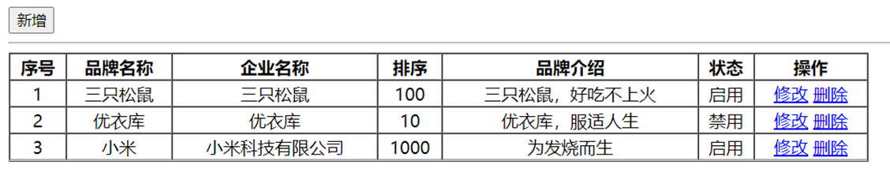

这个功能我们之前一直在做，而这个案例是将今天学习的所有的内容（包含 MVC模式 和 三层架构）进行应用，并将整个流程贯穿起来。

### 8.1  环境准备

环境准备工作，我们分以下步骤实现：

* 创建新的模块 brand_demo，引入坐标

* 创建三层架构的包结构

* 数据库表 tb_brand

* 实体类 Brand

* MyBatis 基础环境

  * Mybatis-config.xml

  * BrandMapper.xml

  * BrandMapper接口

#### 8.1.1  创建工程

创建新的模块 brand_demo，引入坐标。我们只要分析出要用到哪儿些技术，那么需要哪儿些坐标也就明确了

* 需要操作数据库。mysql的驱动包
* 要使用mybatis框架。mybaits的依赖包
* web项目需要用到servlet和jsp。servlet和jsp的依赖包
* 需要使用 jstl 进行数据展示。jstl的依赖包

`pom.xml` 内容如下：

```xml
<?xml version="1.0" encoding="UTF-8"?>
<project xmlns="http://maven.apache.org/POM/4.0.0"
         xmlns:xsi="http://www.w3.org/2001/XMLSchema-instance"
         xsi:schemaLocation="http://maven.apache.org/POM/4.0.0 http://maven.apache.org/xsd/maven-4.0.0.xsd">
    <modelVersion>4.0.0</modelVersion>
    <groupId>org.example</groupId>
    <artifactId>brand-demo</artifactId>
    <version>1.0-SNAPSHOT</version>
    <packaging>war</packaging>

    <properties>
        <maven.compiler.source>8</maven.compiler.source>
        <maven.compiler.target>8</maven.compiler.target>
    </properties>

    <dependencies>
        <!-- mybatis -->
        <dependency>
            <groupId>org.mybatis</groupId>
            <artifactId>mybatis</artifactId>
            <version>3.5.5</version>
        </dependency>

        <!--mysql-->
        <dependency>
            <groupId>mysql</groupId>
            <artifactId>mysql-connector-java</artifactId>
            <version>5.1.34</version>
        </dependency>

        <!--servlet-->
        <dependency>
            <groupId>javax.servlet</groupId>
            <artifactId>javax.servlet-api</artifactId>
            <version>3.1.0</version>
            <scope>provided</scope>
        </dependency>

        <!--jsp-->
        <dependency>
            <groupId>javax.servlet.jsp</groupId>
            <artifactId>jsp-api</artifactId>
            <version>2.2</version>
            <scope>provided</scope>
        </dependency>

        <!--jstl-->
        <dependency>
            <groupId>jstl</groupId>
            <artifactId>jstl</artifactId>
            <version>1.2</version>
        </dependency>
        <dependency>
            <groupId>taglibs</groupId>
            <artifactId>standard</artifactId>
            <version>1.1.2</version>
        </dependency>
    </dependencies>

    <build>
        <plugins>
            <plugin>
                <groupId>org.apache.tomcat.maven</groupId>
                <artifactId>tomcat7-maven-plugin</artifactId>
                <version>2.2</version>
            </plugin>
        </plugins>
    </build>
</project>
```

#### 8.1.2  创建包

创建不同的包结构，用来存储不同的类。包结构如下

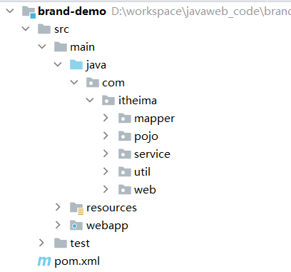

#### 8.1.3  创建表

```sql
-- 删除tb_brand表
drop table if exists tb_brand;
-- 创建tb_brand表
create table tb_brand
(
    -- id 主键
    id           int primary key auto_increment,
    -- 品牌名称
    brand_name   varchar(20),
    -- 企业名称
    company_name varchar(20),
    -- 排序字段
    ordered      int,
    -- 描述信息
    description  varchar(100),
    -- 状态：0：禁用  1：启用
    status       int
);
-- 添加数据
insert into tb_brand (brand_name, company_name, ordered, description, status)
values ('三只松鼠', '三只松鼠股份有限公司', 5, '好吃不上火', 0),
       ('华为', '华为技术有限公司', 100, '华为致力于把数字世界带入每个人、每个家庭、每个组织，构建万物互联的智能世界', 1),
       ('小米', '小米科技有限公司', 50, 'are you ok', 1);
```

#### 8.1.4  创建实体类

在 `pojo` 包下创建名为 `Brand` 的类。

```java
public class Brand {
    // id 主键
    private Integer id;
    // 品牌名称
    private String brandName;
    // 企业名称
    private String companyName;
    // 排序字段
    private Integer ordered;
    // 描述信息
    private String description;
    // 状态：0：禁用  1：启用
    private Integer status;


    public Brand() {
    }

    public Brand(Integer id, String brandName, String companyName, String description) {
        this.id = id;
        this.brandName = brandName;
        this.companyName = companyName;
        this.description = description;
    }

    public Brand(Integer id, String brandName, String companyName, Integer ordered, String description, Integer status) {
        this.id = id;
        this.brandName = brandName;
        this.companyName = companyName;
        this.ordered = ordered;
        this.description = description;
        this.status = status;
    }

    public Integer getId() {
        return id;
    }

    public void setId(Integer id) {
        this.id = id;
    }

    public String getBrandName() {
        return brandName;
    }

    public void setBrandName(String brandName) {
        this.brandName = brandName;
    }

    public String getCompanyName() {
        return companyName;
    }

    public void setCompanyName(String companyName) {
        this.companyName = companyName;
    }

    public Integer getOrdered() {
        return ordered;
    }

    public void setOrdered(Integer ordered) {
        this.ordered = ordered;
    }

    public String getDescription() {
        return description;
    }

    public void setDescription(String description) {
        this.description = description;
    }

    public Integer getStatus() {
        return status;
    }

    public void setStatus(Integer status) {
        this.status = status;
    }

    @Override
    public String toString() {
        return "Brand{" +
                "id=" + id +
                ", brandName='" + brandName + '\'' +
                ", companyName='" + companyName + '\'' +
                ", ordered=" + ordered +
                ", description='" + description + '\'' +
                ", status=" + status +
                '}';
    }
}

```

#### 8.1.5   准备mybatis环境

定义核心配置文件 `Mybatis-config.xml` ，并将该文件放置在 `resources` 下

```xml
<?xml version="1.0" encoding="UTF-8" ?>
<!DOCTYPE configuration
        PUBLIC "-//mybatis.org//DTD Config 3.0//EN"
        "http://mybatis.org/dtd/mybatis-3-config.dtd">
<configuration>
    <!--起别名-->
    <typeAliases>
        <package name="com.itheima.pojo"/>
    </typeAliases>

    <environments default="development">
        <environment id="development">
            <transactionManager type="JDBC"/>
            <dataSource type="POOLED">
                <property name="driver" value="com.mysql.jdbc.Driver"/>
                <property name="url" value="jdbc:mysql:///db1?useSSL=false&amp;useServerPrepStmts=true"/>
                <property name="username" value="root"/>
                <property name="password" value="1234"/>
            </dataSource>
        </environment>
    </environments>
    <mappers>
        <!--扫描mapper-->
        <package name="com.itheima.mapper"/>
    </mappers>
</configuration>
```

在 `resources` 下创建放置映射配置文件的目录结构 `com/itheima/mapper`，并在该目录下创建映射配置文件 `BrandMapper.xml`

```xml
<?xml version="1.0" encoding="UTF-8" ?>
<!DOCTYPE mapper
        PUBLIC "-//mybatis.org//DTD Mapper 3.0//EN"
        "http://mybatis.org/dtd/mybatis-3-mapper.dtd">
<mapper namespace="com.itheima.mapper.BrandMapper">
    
</mapper>
```

### 8.2  查询所有

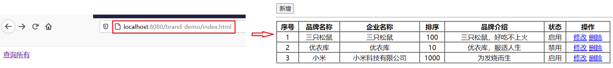

当我们点击 `index.html` 页面中的 `查询所有` 这个超链接时，就能查询到上图右半部分的数据。

对于上述的功能，点击 `查询所有` 超链接是需要先请后端的 `servlet` ，由 `servlet` 跳转到对应的页面进行数据的动态展示。而整个流程如下图：


#### 8.2.1  编写BrandMapper

在 `mapper` 包下创建创建 `BrandMapper` 接口，在接口中定义 `selectAll()` 方法

```java
/**
  * 查询所有
  * @return
  */
@Select("select * from tb_brand")
List<Brand> selectAll();
```

#### 8.2.2  编写工具类

在 `com.itheima` 包下创建 `utils` 包，并在该包下创建名为 `SqlSessionFactoryUtils` 工具类

```java
public class SqlSessionFactoryUtils {

    private static SqlSessionFactory sqlSessionFactory;

    static {
        //静态代码块会随着类的加载而自动执行，且只执行一次
        try {
            String resource = "mybatis-config.xml";
            InputStream inputStream = Resources.getResourceAsStream(resource);
            sqlSessionFactory = new SqlSessionFactoryBuilder().build(inputStream);
        } catch (IOException e) {
            e.printStackTrace();
        }
    }

    public static SqlSessionFactory getSqlSessionFactory(){
        return sqlSessionFactory;
    }
}
```

#### 8.2.3  编写BrandService

在 `service` 包下创建 `BrandService` 类

```java
public class BrandService {
    SqlSessionFactory factory = SqlSessionFactoryUtils.getSqlSessionFactory();

    /**
     * 查询所有
     * @return
     */
    public List<Brand> selectAll(){
        //调用BrandMapper.selectAll()

        //2. 获取SqlSession
        SqlSession sqlSession = factory.openSession();
        //3. 获取BrandMapper
        BrandMapper mapper = sqlSession.getMapper(BrandMapper.class);

        //4. 调用方法
        List<Brand> brands = mapper.selectAll();

        sqlSession.close();

        return brands;
    }
}
```

#### 8.2.4  编写Servlet

在 `web` 包下创建名为 `SelectAllServlet` 的 `servlet`，该 `servlet` 的逻辑如下：

* 调用 `BrandService` 的 `selectAll()` 方法进行业务逻辑处理，并接收返回的结果
* 将上一步返回的结果存储到 `request` 域对象中
* 跳转到 `brand.jsp` 页面进行数据的展示

具体的代码如下：

```java
@WebServlet("/selectAllServlet")
public class SelectAllServlet extends HttpServlet {
    private  BrandService service = new BrandService();

    @Override
    protected void doGet(HttpServletRequest request, HttpServletResponse response) throws ServletException, IOException {

        //1. 调用BrandService完成查询
        List<Brand> brands = service.selectAll();
        //2. 存入request域中
        request.setAttribute("brands",brands);
        //3. 转发到brand.jsp
        request.getRequestDispatcher("/brand.jsp").forward(request,response);
    }

    @Override
    protected void doPost(HttpServletRequest request, HttpServletResponse response) throws ServletException, IOException {
        this.doGet(request, response);
    }
}
```

#### 8.2.5  编写brand.jsp页面

将资料 `资料\2. 品牌增删改查案例\静态页面` 下的 `brand.html` 页面拷贝到项目的 `webapp` 目录下，并将该页面改成 `brand.jsp` 页面，而 `brand.jsp` 页面在表格中使用 `JSTL` 和 `EL表达式` 从request域对象中获取名为 `brands` 的集合数据并展示出来。页面内容如下：

```jsp
<%@ page contentType="text/html;charset=UTF-8" language="java" %>
<%@ taglib prefix="c" uri="http://java.sun.com/jsp/jstl/core" %>

<!DOCTYPE html>
<html lang="en">
<head>
    <meta charset="UTF-8">
    <title>Title</title>
</head>
<body>
<hr>
<table border="1" cellspacing="0" width="80%">
    <tr>
        <th>序号</th>
        <th>品牌名称</th>
        <th>企业名称</th>
        <th>排序</th>
        <th>品牌介绍</th>
        <th>状态</th>
        <th>操作</th>
    </tr>

    <c:forEach items="${brands}" var="brand" varStatus="status">
        <tr align="center">
            <%--<td>${brand.id}</td>--%>
            <td>${status.count}</td>
            <td>${brand.brandName}</td>
            <td>${brand.companyName}</td>
            <td>${brand.ordered}</td>
            <td>${brand.description}</td>
            <c:if test="${brand.status == 1}">
                <td>启用</td>
            </c:if>
            <c:if test="${brand.status != 1}">
                <td>禁用</td>
            </c:if>
            <td><a href="/brand-demo/selectByIdServlet?id=${brand.id}">修改</a> <a href="#">删除</a></td>
        </tr>
    </c:forEach>
</table>
</body>
</html>
```

#### 8.2.6  测试

启动服务器，并在浏览器输入 `http://localhost:8080/brand-demo/index.html`，看到如下 `查询所有` 的超链接，点击该链接就可以查询出所有的品牌数据

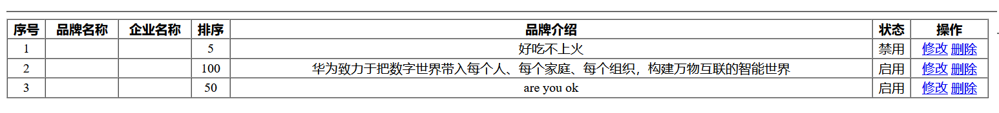

为什么出现这个问题呢？是因为查询到的字段名和实体类对象的属性名没有一一对应。相比看到这大家一定会解决了，就是在映射配置文件中使用 `resultMap` 标签定义映射关系。映射配置文件内容如下：

```xml
<?xml version="1.0" encoding="UTF-8" ?>
<!DOCTYPE mapper
        PUBLIC "-//mybatis.org//DTD Mapper 3.0//EN"
        "http://mybatis.org/dtd/mybatis-3-mapper.dtd">
<mapper namespace="com.itheima.mapper.BrandMapper">

    <resultMap id="brandResultMap" type="brand">
        <result column="brand_name" property="brandName"></result>
        <result column="company_name" property="companyName"></result>
    </resultMap>
</mapper>
```

并且在 `BrandMapper` 接口中的 `selectAll()` 上使用 `@ResuleMap` 注解指定使用该映射

```java
/**
  * 查询所有
  * @return
  */
@Select("select * from tb_brand")
@ResultMap("brandResultMap")
List<Brand> selectAll();
```

重启服务器，再次访问就能看到我们想要的数据了

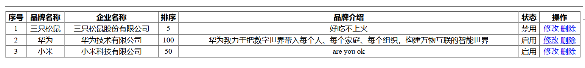

### 8.3  添加

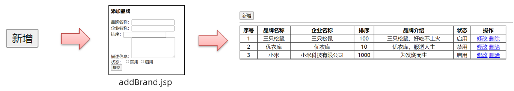

上图是做 添加 功能流程。点击 `新增` 按钮后，会先跳转到 `addBrand.jsp` 新增页面，在该页面输入要添加的数据，输入完毕后点击 `提交` 按钮，需要将数据提交到后端，而后端进行数据添加操作，并重新将所有的数据查询出来。整个流程如下：


接下来我们根据流程来实现功能：

#### 8.3.1  编写BrandMapper方法

在 `BrandMapper` 接口，在接口中定义 `add(Brand brand)` 方法

```java
@Insert("insert into tb_brand values(null,#{brandName},#{companyName},#{ordered},#{description},#{status})")
void add(Brand brand);
```

#### 8.3.2  编写BrandService方法

在 `BrandService` 类中定义添加品牌数据方法 `add(Brand brand)`

```java
 	/**
     * 添加
     * @param brand
     */
    public void add(Brand brand){

        //2. 获取SqlSession
        SqlSession sqlSession = factory.openSession();
        //3. 获取BrandMapper
        BrandMapper mapper = sqlSession.getMapper(BrandMapper.class);

        //4. 调用方法
        mapper.add(brand);

        //提交事务
        sqlSession.commit();
        //释放资源
        sqlSession.close();
    }
```

#### 8.3.3  改进brand.jsp页面

我们需要在该页面表格的上面添加 `新增` 按钮

```html
<input type="button" value="新增" id="add"><br>
```

并给该按钮绑定单击事件，当点击了该按钮需要跳转到 `brand.jsp` 添加品牌数据的页面

```html
<script>
    document.getElementById("add").onclick = function (){
        location.href = "/brand-demo/addBrand.jsp";
    }
</script>
```

> ==注意：==该 `script` 标签建议放在 `body` 结束标签前面。

#### 8.3.4  编写addBrand.jsp页面

从资料 `资料\2. 品牌增删改查案例\静态页面` 中将 `addBrand.html` 页面拷贝到项目的 `webapp` 下，并改成 `addBrand.jsp` 动态页面

```jsp
<%@ page contentType="text/html;charset=UTF-8" language="java" %>
<!DOCTYPE html>
<html lang="en">

<head>
    <meta charset="UTF-8">
    <title>添加品牌</title>
</head>
<body>
<h3>添加品牌</h3>
<form action="/brand-demo/addServlet" method="post">
    品牌名称：<input name="brandName"><br>
    企业名称：<input name="companyName"><br>
    排序：<input name="ordered"><br>
    描述信息：<textarea rows="5" cols="20" name="description"></textarea><br>
    状态：
    <input type="radio" name="status" value="0">禁用
    <input type="radio" name="status" value="1">启用<br>

    <input type="submit" value="提交">
</form>
</body>
</html>
```

#### 8.3.5  编写servlet

在 `web` 包下创建 `AddServlet` 的 `servlet`，该 `servlet` 的逻辑如下:

* 设置处理post请求乱码的字符集
* 接收客户端提交的数据
* 将接收到的数据封装到 `Brand` 对象中
* 调用 `BrandService` 的`add()` 方法进行添加的业务逻辑处理
* 跳转到 `selectAllServlet` 资源重新查询数据

具体的代码如下：

```java
@WebServlet("/addServlet")
public class AddServlet extends HttpServlet {
    private BrandService service = new BrandService();


    @Override
    protected void doGet(HttpServletRequest request, HttpServletResponse response) throws ServletException, IOException {

        //处理POST请求的乱码问题
        request.setCharacterEncoding("utf-8");

        //1. 接收表单提交的数据，封装为一个Brand对象
        String brandName = request.getParameter("brandName");
        String companyName = request.getParameter("companyName");
        String ordered = request.getParameter("ordered");
        String description = request.getParameter("description");
        String status = request.getParameter("status");

        //封装为一个Brand对象
        Brand brand = new Brand();
        brand.setBrandName(brandName);
        brand.setCompanyName(companyName);
        brand.setOrdered(Integer.parseInt(ordered));
        brand.setDescription(description);
        brand.setStatus(Integer.parseInt(status));

        //2. 调用service 完成添加
        service.add(brand);

        //3. 转发到查询所有Servlet
        request.getRequestDispatcher("/selectAllServlet").forward(request,response);
    }

    @Override
    protected void doPost(HttpServletRequest request, HttpServletResponse response) throws ServletException, IOException {
        this.doGet(request, response);
    }
}
```

#### 8.3.6  测试

 点击 `brand.jsp` 页面的 `新增` 按钮，会跳转到 `addBrand.jsp`页面

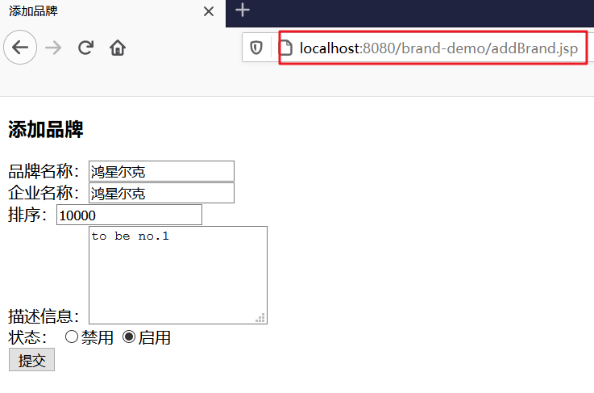

点击 `提交` 按钮，就能看到如下页面，里面就包含我们刚添加的数据

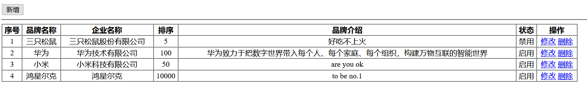

### 8.4  修改 

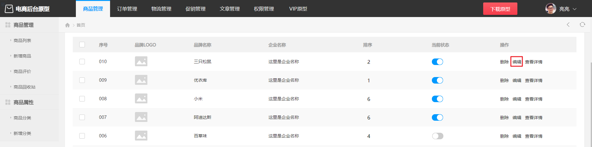

点击每条数据后面的 `编辑` 按钮会跳转到修改页面，如下图：


在该修改页面我们可以看到将 `编辑` 按钮所在行的数据 ==回显== 到表单，然后需要修改那个数据在表单中进行修改，然后点击 `提交` 的按钮将数据提交到后端，后端再将数据存储到数据库中。

从上面的例子我们知道 `修改` 功能需要从两方面进行实现，数据回显和修改操作。

#### 8.4.1  回显数据

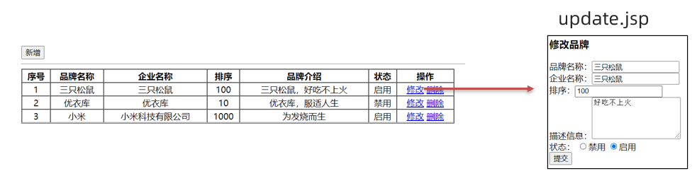

上图就是回显数据的效果。要实现这个效果，那当点击 `修改` 按钮时不能直接跳转到 `update.jsp` 页面，而是需要先带着当前行数据的 `id` 请求后端程序，后端程序根据 `id` 查询数据，将数据存储到域对象中跳转到 `update.jsp` 页面进行数据展示。整体流程如下


##### 8.4.1.1  编写BrandMapper方法

在 `BrandMapper` 接口，在接口中定义 `selectById(int id)` 方法

```java
	/**
     * 根据id查询
     * @param id
     * @return
     */
    @Select("select * from tb_brand where id = #{id}")
    @ResultMap("brandResultMap")
    Brand selectById(int id);
```

##### 8.4.1.2  编写BrandService方法

在 `BrandService` 类中定义根据id查询数据方法 `selectById(int id)` 

```java
    /**
     * 根据id查询
     * @return
     */
    public Brand selectById(int id){
        //调用BrandMapper.selectAll()
        //2. 获取SqlSession
        SqlSession sqlSession = factory.openSession();
        //3. 获取BrandMapper
        BrandMapper mapper = sqlSession.getMapper(BrandMapper.class);
        //4. 调用方法
        Brand brand = mapper.selectById(id);
        sqlSession.close();
        return brand;
    }
```

##### 8.4.1.3  编写servlet

在 `web` 包下创建 `SelectByIdServlet` 的 `servlet`，该 `servlet` 的逻辑如下:

* 获取请求数据 `id`
* 调用 `BrandService` 的 `selectById()` 方法进行数据查询的业务逻辑
* 将查询到的数据存储到 request 域对象中
* 跳转到 `update.jsp` 页面进行数据真实

具体代码如下：

```java
@WebServlet("/selectByIdServlet")
public class SelectByIdServlet extends HttpServlet {
    private  BrandService service = new BrandService();

    @Override
    protected void doGet(HttpServletRequest request, HttpServletResponse response) throws ServletException, IOException {
        //1. 接收id
        String id = request.getParameter("id");
        //2. 调用service查询
        Brand brand = service.selectById(Integer.parseInt(id));
        //3. 存储到request中
        request.setAttribute("brand",brand);
        //4. 转发到update.jsp
        request.getRequestDispatcher("/update.jsp").forward(request,response);
    }

    @Override
    protected void doPost(HttpServletRequest request, HttpServletResponse response) throws ServletException, IOException {
        this.doGet(request, response);
    }
}
```

##### 8.4.1.4  编写update.jsp页面

拷贝 `addBrand.jsp` 页面，改名为 `update.jsp` 并做出以下修改：

* `title` 标签内容改为 `修改品牌`

* `form` 标签的 `action` 属性值改为 `/brand-demo/updateServlet`

* `input` 标签要进行数据回显，需要设置 `value` 属性

  ```jsp
  品牌名称：<input name="brandName" value="${brand.brandName}"><br>
  企业名称：<input name="companyName" value="${brand.companyName}"><br>
  排序：<input name="ordered" value="${brand.ordered}"><br>
  ```

* `textarea` 标签要进行数据回显，需要在标签体中使用 `EL表达式`

  ```jsp
  描述信息：<textarea rows="5" cols="20" name="description">${brand.description} </textarea><br>
  ```

* 单选框使用 `if` 标签需要判断 `brand.status` 的值是 1 还是 0 在指定的单选框上使用 `checked` 属性，表示被选中状态

  ```jsp
  状态：
  <c:if test="${brand.status == 0}">
      <input type="radio" name="status" value="0" checked>禁用
      <input type="radio" name="status" value="1">启用<br>
  </c:if>
  
  <c:if test="${brand.status == 1}">
      <input type="radio" name="status" value="0" >禁用
      <input type="radio" name="status" value="1" checked>启用<br>
  </c:if>
  ```

综上，`update.jsp` 代码如下：

```jsp
<%@ page contentType="text/html;charset=UTF-8" language="java" %>
<%@ taglib prefix="c" uri="http://java.sun.com/jsp/jstl/core" %>
<!DOCTYPE html>
<html lang="en">
<head>
    <meta charset="UTF-8">
    <title>修改品牌</title>
</head>
<body>
<h3>修改品牌</h3>
<form action="/brand-demo/updateServlet" method="post">

    品牌名称：<input name="brandName" value="${brand.brandName}"><br>
    企业名称：<input name="companyName" value="${brand.companyName}"><br>
    排序：<input name="ordered" value="${brand.ordered}"><br>
    描述信息：<textarea rows="5" cols="20" name="description">${brand.description} </textarea><br>
    状态：
    <c:if test="${brand.status == 0}">
        <input type="radio" name="status" value="0" checked>禁用
        <input type="radio" name="status" value="1">启用<br>
    </c:if>

    <c:if test="${brand.status == 1}">
        <input type="radio" name="status" value="0" >禁用
        <input type="radio" name="status" value="1" checked>启用<br>
    </c:if>

    <input type="submit" value="提交">
</form>
</body>
</html>
```

#### 8.4.2  修改数据

做完回显数据后，接下来我们要做修改数据了，而下图是修改数据的效果：

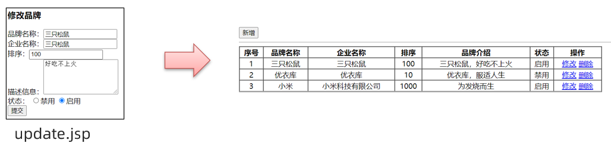

在修改页面进行数据修改，点击 `提交` 按钮，会将数据提交到后端程序，后端程序会对表中的数据进行修改操作，然后重新进行数据的查询操作。整体流程如下：


##### 8.4.2.1  编写BrandMapper方法

在 `BrandMapper` 接口，在接口中定义 `update(Brand brand)` 方法

```java
/**
  * 修改
  * @param brand
  */
@Update("update tb_brand set brand_name = #{brandName},company_name = #{companyName},ordered = #{ordered},description = #{description},status = #{status} where id = #{id}")
void update(Brand brand);
```

##### 8.4.2.2  编写BrandService方法

在 `BrandService` 类中定义根据id查询数据方法 `update(Brand brand)` 

```java
	/**
     * 修改
     * @param brand
     */
    public void update(Brand brand){
        //2. 获取SqlSession
        SqlSession sqlSession = factory.openSession();
        //3. 获取BrandMapper
        BrandMapper mapper = sqlSession.getMapper(BrandMapper.class);
        //4. 调用方法
        mapper.update(brand);
        //提交事务
        sqlSession.commit();
        //释放资源
        sqlSession.close();
    }
```

##### 8.4.2.3  编写servlet

在 `web` 包下创建 `AddServlet` 的 `servlet`，该 `servlet` 的逻辑如下:

* 设置处理post请求乱码的字符集
* 接收客户端提交的数据
* 将接收到的数据封装到 `Brand` 对象中
* 调用 `BrandService` 的`update()` 方法进行添加的业务逻辑处理
* 跳转到 `selectAllServlet` 资源重新查询数据

具体的代码如下：

```java
@WebServlet("/updateServlet")
public class UpdateServlet extends HttpServlet {
    private BrandService service = new BrandService();

    @Override
    protected void doGet(HttpServletRequest request, HttpServletResponse response) throws ServletException, IOException {

        //处理POST请求的乱码问题
        request.setCharacterEncoding("utf-8");
        //1. 接收表单提交的数据，封装为一个Brand对象
        String id = request.getParameter("id");
        String brandName = request.getParameter("brandName");
        String companyName = request.getParameter("companyName");
        String ordered = request.getParameter("ordered");
        String description = request.getParameter("description");
        String status = request.getParameter("status");

        //封装为一个Brand对象
        Brand brand = new Brand();
        brand.setId(Integer.parseInt(id));
        brand.setBrandName(brandName);
        brand.setCompanyName(companyName);
        brand.setOrdered(Integer.parseInt(ordered));
        brand.setDescription(description);
        brand.setStatus(Integer.parseInt(status));

        //2. 调用service 完成修改
        service.update(brand);

        //3. 转发到查询所有Servlet
        request.getRequestDispatcher("/selectAllServlet").forward(request,response);
    }

    @Override
    protected void doPost(HttpServletRequest request, HttpServletResponse response) throws ServletException, IOException {
        this.doGet(request, response);
    }
}
```

==存在问题：update.jsp 页面提交数据时是没有携带主键数据的，而后台修改数据需要根据主键进行修改。==

针对这个问题，我们不希望页面将主键id展示给用户看，但是又希望在提交数据时能将主键id提交到后端。此时我们就想到了在学习 HTML 时学习的隐藏域，在 `update.jsp` 页面的表单中添加如下代码：

```jsp
<%--隐藏域，提交id--%>
<input type="hidden" name="id" value="${brand.id}">
```

`update.jsp` 页面的最终代码如下：

```jsp
<%@ page contentType="text/html;charset=UTF-8" language="java" %>
<%@ taglib prefix="c" uri="http://java.sun.com/jsp/jstl/core" %>
<!DOCTYPE html>
<html lang="en">
<head>
    <meta charset="UTF-8">
    <title>修改品牌</title>
</head>
<body>
<h3>修改品牌</h3>
<form action="/brand-demo/updateServlet" method="post">

    <%--隐藏域，提交id--%>
    <input type="hidden" name="id" value="${brand.id}">

    品牌名称：<input name="brandName" value="${brand.brandName}"><br>
    企业名称：<input name="companyName" value="${brand.companyName}"><br>
    排序：<input name="ordered" value="${brand.ordered}"><br>
    描述信息：<textarea rows="5" cols="20" name="description">${brand.description} </textarea><br>
    状态：
    <c:if test="${brand.status == 0}">
        <input type="radio" name="status" value="0" checked>禁用
        <input type="radio" name="status" value="1">启用<br>
    </c:if>

    <c:if test="${brand.status == 1}">
        <input type="radio" name="status" value="0" >禁用
        <input type="radio" name="status" value="1" checked>启用<br>
    </c:if>
    <input type="submit" value="提交">
</form>
</body>
</html>
```


# day10 会话技术

**今日目标** 

> * 理解什么是会话跟踪技术
>
> * 掌握Cookie的使用
> * 掌握Session的使用
> * 完善用户登录注册案例的功能

## 1，会话跟踪技术的概述

对于`会话跟踪`这四个词，我们需要拆开来进行解释，首先要理解什么是`会话`，然后再去理解什么是`会话跟踪`:

* 会话:用户打开浏览器，访问web服务器的资源，会话建立，直到有一方断开连接，会话结束。在一次会话中可以包含==多次==请求和响应。

  * 从浏览器发出请求到服务端响应数据给前端之后，一次会话(在浏览器和服务器之间)就被建立了
  * 会话被建立后，如果浏览器或服务端都没有被关闭，则会话就会持续建立着
  * 浏览器和服务器就可以继续使用该会话进 行请求发送和响应，上述的整个过程就被称之为==会话==。

  用实际场景来理解下会话，比如在我们访问京东的时候，当打开浏览器进入京东首页后，浏览器和京东的服务器之间就建立了一次会话，后面的搜索商品,查看商品的详情,加入购物车等都是在这一次会话中完成。

  思考:下图中总共建立了几个会话?

  

  每个浏览器都会与服务端建立了一个会话，加起来总共是==3==个会话。

* 会话跟踪:一种维护浏览器状态的方法，服务器需要识别多次请求是否来自于同一浏览器，以便在同一次会话的多次请求间==共享数据==。

  * 服务器会收到多个请求，这多个请求可能来自多个浏览器，如上图中的6个请求来自3个浏览器
  * 服务器需要用来识别请求是否来自同一个浏览器
  * 服务器用来识别浏览器的过程，这个过程就是==会话跟踪==
  * 服务器识别浏览器后就可以在同一个会话中多次请求之间来共享数据

  那么我们又有一个问题需要思考，一个会话中的多次请求为什么要共享数据呢?有了这个数据共享功能后能实现哪些功能呢?

  * 购物车: `加入购物车`和`去购物车结算`是两次请求，但是后面这次请求要想展示前一次请求所添加的商品，就需要用到数据共享。

    

  * 页面展示用户登录信息:很多网站，登录后访问多个功能发送多次请求后，浏览器上都会有当前登录用户的信息[用户名]，比如百度、京东、码云等。

    

  * 网站登录页面的`记住我`功能:当用户登录成功后，勾选`记住我`按钮后下次再登录的时候，网站就会自动填充用户名和密码，简化用户的登录操作，多次登录就会有多次请求，他们之间也涉及到共享数据

    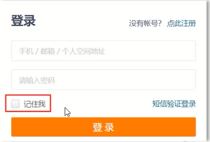

  * 登录页面的验证码功能:生成验证码和输入验证码点击注册这也是两次请求，这两次请求的数据之间要进行对比，相同则允许注册，不同则拒绝注册，该功能的实现也需要在同一次会话中共享数据。

    

通过这几个例子的讲解，相信大家对`会话追踪`技术已经有了一定的理解，该技术在实际开发中也非常重要。那么接下来我们就需要去学习下`会话跟踪`技术，在学习这些技术之前，我们需要思考:为什么现在浏览器和服务器不支持数据共享呢?

* 浏览器和服务器之间使用的是HTTP请求来进行数据传输
* HTTP协议是==无状态==的，每次浏览器向服务器请求时，服务器都会将该请求视为==新的==请求
* HTTP协议设计成无状态的目的是让每次请求之间相互独立，互不影响
* 请求与请求之间独立后，就无法实现多次请求之间的数据共享

分析完具体的原因后，那么该如何实现会话跟踪技术呢? 具体的实现方式有:

(1)客户端会话跟踪技术：==Cookie==

(2)服务端会话跟踪技术：==Session==

这两个技术都可以实现会话跟踪，它们之间最大的区别:==Cookie是存储在浏览器端而Session是存储在服务器端==

具体的学习思路为:

* CooKie的基本使用、原理、使用细节
* Session的基本使用、原理、使用细节 
* Cookie和Session的综合案例

**小结**

在这节中，我们主要介绍了下什么是会话和会话跟踪技术，需要注意的是:

* HTTP协议是无状态的，靠HTTP协议是无法实现会话跟踪
* 想要实现会话跟踪，就需要用到Cookie和Session

这个Cookie和Session具体该如何使用，接下来就先从Cookie来学起。

## 2，Cookie

学习Cookie，我们主要解决下面几个问题:

* 什么是Cookie?
* Cookie如何来使用?
* Cookie是如何实现的?
* Cookie的使用注意事项有哪些?

### 2.1 Cookie的基本使用

**1.概念**

==Cookie==：客户端会话技术，将数据保存到客户端，以后每次请求都携带Cookie数据进行访问。

**2.Cookie的工作流程**


* 服务端提供了两个Servlet，分别是ServletA和ServletB
* 浏览器发送HTTP请求1给服务端，服务端ServletA接收请求并进行业务处理
* 服务端ServletA在处理的过程中可以创建一个Cookie对象并将`name=zs`的数据存入Cookie
* 服务端ServletA在响应数据的时候，会把Cookie对象响应给浏览器
* 浏览器接收到响应数据，会把Cookie对象中的数据存储在浏览器内存中，此时浏览器和服务端就==建立了一次会话==
* ==在同一次会话==中浏览器再次发送HTTP请求2给服务端ServletB，浏览器会携带Cookie对象中的所有数据
* ServletB接收到请求和数据后，就可以获取到存储在Cookie对象中的数据，这样同一个会话中的多次请求之间就实现了数据共享

**3.Cookie的基本使用**

对于Cookie的使用，我们更关注的应该是后台代码如何操作Cookie，对于Cookie的操作主要分两大类，本别是==发送Cookie==和==获取Cookie==,对于上面这两块内容，分别该如何实现呢?

3.1 发送Cookie

* 创建Cookie对象，并设置数据

```
Cookie cookie = new Cookie("key","value");
```

* 发送Cookie到客户端：使用==response==对象

```
response.addCookie(cookie);
```

介绍完发送Cookie对应的步骤后，接下面通过一个案例来完成Cookie的发送，具体实现步骤为:

> 需求:在Servlet中生成Cookie对象并存入数据，然后将数据发送给浏览器
>
> 1.创建Maven项目,项目名称为cookie-demo，并在pom.xml添加依赖
>
> 2.编写Servlet类，名称为AServlet
>
> 3.在AServlet中创建Cookie对象，存入数据，发送给前端
>
> 4.启动测试，在浏览器查看Cookie对象中的值

(1)创建Maven项目cookie-demo，并在pom.xml添加依赖

```xml
<properties>
    <maven.compiler.source>8</maven.compiler.source>
    <maven.compiler.target>8</maven.compiler.target>
</properties>

<dependencies>
    <!--servlet-->
    <dependency>
        <groupId>javax.servlet</groupId>
        <artifactId>javax.servlet-api</artifactId>
        <version>3.1.0</version>
        <scope>provided</scope>
    </dependency>
    <!--jsp-->
    <dependency>
        <groupId>javax.servlet.jsp</groupId>
        <artifactId>jsp-api</artifactId>
        <version>2.2</version>
        <scope>provided</scope>
    </dependency>
    <!--jstl-->
    <dependency>
        <groupId>jstl</groupId>
        <artifactId>jstl</artifactId>
        <version>1.2</version>
    </dependency>
    <dependency>
        <groupId>taglibs</groupId>
        <artifactId>standard</artifactId>
        <version>1.1.2</version>
    </dependency>
</dependencies>
<build>
    <plugins>
        <plugin>
            <groupId>org.apache.tomcat.maven</groupId>
            <artifactId>tomcat7-maven-plugin</artifactId>
            <version>2.2</version>
        </plugin>
    </plugins>
</build>
```

(2)编写Servlet类，名称为AServlet

```java
@WebServlet("/aServlet")
public class AServlet extends HttpServlet {
    @Override
    protected void doGet(HttpServletRequest request, HttpServletResponse response) throws ServletException, IOException {

    }

    @Override
    protected void doPost(HttpServletRequest request, HttpServletResponse response) throws ServletException, IOException {
        this.doGet(request, response);
    }
}
```

(3)在Servlet中创建Cookie对象，存入数据，发送给前端

```java
@WebServlet("/aServlet")
public class AServlet extends HttpServlet {
    @Override
    protected void doGet(HttpServletRequest request, HttpServletResponse response) throws ServletException, IOException {
        //发送Cookie
        //1. 创建Cookie对象
        Cookie cookie = new Cookie("username","zs");
        //2. 发送Cookie，response
        response.addCookie(cookie);
    }

    @Override
    protected void doPost(HttpServletRequest request, HttpServletResponse response) throws ServletException, IOException {
        this.doGet(request, response);
    }
}
```

（4）启动测试，在浏览器查看Cookie对象中的值

访问`http://localhost:8080/cookie-demo/aServlet`

chrome浏览器查看Cookie的值，有两种方式,分布式:

方式一:


方式二:选中打开开发者工具或者 使用快捷键F12 或者 Ctrl+Shift+I


3.2 获取Cookie

- 获取客户端携带的所有Cookie，使用==request==对象

```java
Cookie[] cookies = request.getCookies();
```

- 遍历数组，获取每一个Cookie对象：for
- 使用Cookie对象方法获取数据

```java
cookie.getName();
cookie.getValue();
```

介绍完获取Cookie对应的步骤后，接下面再通过一个案例来完成Cookie的获取，具体实现步骤为:

> 需求:在Servlet中获取前一个案例存入在Cookie对象中的数据
>
> 1.编写一个新Servlet类，名称为BServlet
>
> 2.在BServlet中使用request对象获取Cookie数组，遍历数组，从数据中获取指定名称对应的值
>
> 3.启动测试，在控制台打印出获取的值

(1)编写一个新Servlet类，名称为BServlet

```java
@WebServlet("/bServlet")
public class BServlet extends HttpServlet {
    @Override
    protected void doGet(HttpServletRequest request, HttpServletResponse response) throws ServletException, IOException {

    }

    @Override
    protected void doPost(HttpServletRequest request, HttpServletResponse response) throws ServletException, IOException {
        this.doGet(request, response);
    }
}
```

（2）在BServlet中使用request对象获取Cookie数组，遍历数组，从数据中获取指定名称对应的值

```java
@WebServlet("/bServlet")
public class BServlet extends HttpServlet {
    @Override
    protected void doGet(HttpServletRequest request, HttpServletResponse response) throws ServletException, IOException {
        //获取Cookie
        //1. 获取Cookie数组
        Cookie[] cookies = request.getCookies();
        //2. 遍历数组
        for (Cookie cookie : cookies) {
            //3. 获取数据
            String name = cookie.getName();
            if("username".equals(name)){
                String value = cookie.getValue();
                System.out.println(name+":"+value);
                break;
            }
        }

    }

    @Override
    protected void doPost(HttpServletRequest request, HttpServletResponse response) throws ServletException, IOException {
        this.doGet(request, response);
    }
}
```

（3）启动测试，在控制台打印出获取的值

访问`http://localhost:8080/cookie-demo/bServlet`


在IDEA控制台就能看到输出的结果:


==思考:==测试的时候

* 在访问AServlet和BServlet的中间把关闭浏览器,重启浏览器后访问BServlet能否获取到Cookie中的数据?

这个问题，我们会在Cookie的使用细节中讲，大家可以动手先试下。

**小结**

在这节中，我们主要讲解了Cookie的基本使用,包含两部分内容

- 发送Cookie:
  - 创建Cookie对象，并设置值:Cookie cookie = new Cookie("key","value");
  - 发送Cookie到客户端使用的是Reponse对象:response.addCookie(cookie);
- 获取Cookie:
  - 使用Request对象获取Cookie数组:Cookie[] cookies = request.getCookies();
  - 遍历数组
  - 获取数组中每个Cookie对象的值:cookie.getName()和cookie.getValue()

介绍完Cookie的基本使用之后，那么Cookie的底层到底是如何实现一次会话两次请求之间的数据共享呢?

### 2.2 Cookie的原理分析

对于Cookie的实现原理是基于HTTP协议的,其中设计到HTTP协议中的两个请求头信息:

* 响应头:set-cookie
* 请求头: cookie


* 前面的案例中已经能够实现，AServlet给前端发送Cookie,BServlet从request中获取Cookie的功能
* 对于AServlet响应数据的时候，Tomcat服务器都是基于HTTP协议来响应数据
* 当Tomcat发现后端要返回的是一个Cookie对象之后，Tomcat就会在响应头中添加一行数据==`Set-Cookie:username=zs`==
* 浏览器获取到响应结果后，从响应头中就可以获取到`Set-Cookie`对应值`username=zs`,并将数据存储在浏览器的内存中
* 浏览器再次发送请求给BServlet的时候，浏览器会自动在请求头中添加==`Cookie: username=zs`==发送给服务端BServlet
* Request对象会把请求头中cookie对应的值封装成一个个Cookie对象，最终形成一个数组
* BServlet通过Request对象获取到Cookie[]后，就可以从中获取自己需要的数据

接下来，使用刚才的案例，把上述结论验证下:

(1)访问AServlet对应的地址`http://localhost:8080/cookie-demo/aServlet`

使用Chrom浏览器打开开发者工具(F12或Crtl+Shift+I)进行查看==响应头==中的数据


（2）访问BServlet对应的地址`http://localhost:8080/cookie-demo/bServlet

使用Chrom浏览器打开开发者工具(F12或Crtl+Shift+I)进行查看==请求头==中的数据


### 2.3 Cookie的使用细节

在这节我们主要讲解两个知识，第一个是Cookie的存活时间，第二个是Cookie如何存储中文，首先来学习下Cookie的存活时间。

#### 2.3.1 Cookie的存活时间

前面让大家思考过一个问题:


(1)浏览器发送请求给AServlet,AServlet会响应一个存有`usernanme=zs`的Cookie对象给浏览器

(2)浏览器接收到响应数据将cookie存入到浏览器内存中

(3)当浏览器再次发送请求给BServlet,BServlet就可以使用Request对象获取到Cookie数据

(4)在发送请求到BServlet之前，如果把浏览器关闭再打开进行访问，BServlet能否获取到Cookie数据?

==注意：浏览器关闭再打开不是指打开一个新的选显卡，而且必须是先关闭再打开，顺序不能变。==

针对上面这个问题，通过演示，会发现，BServlet中无法再获取到Cookie数据，这是为什么呢?

* 默认情况下，Cookie存储在浏览器内存中，当浏览器关闭，内存释放，则Cookie被销毁

这个结论就印证了上面的演示效果，但是如果使用这种默认情况下的Cookie,有些需求就无法实现，比如:


上面这个网站的登录页面上有一个`记住我`的功能，这个功能大家都比较熟悉

* 第一次输入用户名和密码并勾选`记住我`然后进行登录
* 下次再登陆的时候，用户名和密码就会被自动填充，不需要再重新输入登录
* 比如`记住我`这个功能需要记住用户名和密码一个星期，那么使用默认情况下的Cookie就会出现问题
* 因为默认情况，浏览器一关，Cookie就会从浏览器内存中删除，对于`记住我`功能就无法实现

所以我们现在就遇到一个难题是如何将Cookie持久化存储?

Cookie其实已经为我们提供好了对应的API来完成这件事，这个API就是==setMaxAge==,

* 设置Cookie存活时间

```
setMaxAge(int seconds)
```

参数值为:

1.正数：将Cookie写入浏览器所在电脑的硬盘，持久化存储。到时间自动删除

2.负数：默认值，Cookie在当前浏览器内存中，当浏览器关闭，则Cookie被销毁

3.零：删除对应Cookie

接下来，咱们就在AServlet中去设置Cookie的存活时间。

```java
@WebServlet("/aServlet")
public class AServlet extends HttpServlet {
    @Override
    protected void doGet(HttpServletRequest request, HttpServletResponse response) throws ServletException, IOException {
        //发送Cookie
        //1. 创建Cookie对象
        Cookie cookie = new Cookie("username","zs");
        //设置存活时间   ，1周 7天
        cookie.setMaxAge(60*60*24*7); //易阅读，需程序计算
		//cookie.setMaxAge(604800); //不易阅读(可以使用注解弥补)，程序少进行一次计算
        //2. 发送Cookie，response
        response.addCookie(cookie);
    }

    @Override
    protected void doPost(HttpServletRequest request, HttpServletResponse response) throws ServletException, IOException {
        this.doGet(request, response);
    }
}
```

修改完代码后，启动测试，访问`http://localhost:8080/cookie-demo/aServlet`

* 访问一个AServlet后，把浏览器关闭重启后，再去访问`http://localhost:8080/cookie-demo/bServet`,能在控制台打印出`username:zs`,说明Cookie没有随着浏览器关闭而被销毁
* 通过浏览器查看Cookie的内容，会发现Cookie的相关信息


#### 2.3.2 Cookie存储中文

首先，先来演示一个效果，将之前`username=zs`的值改成`username=张三`，把汉字`张三`存入到Cookie中，看是什么效果:

```java
@WebServlet("/aServlet")
public class AServlet extends HttpServlet {
    @Override
    protected void doGet(HttpServletRequest request, HttpServletResponse response) throws ServletException, IOException {
 		//发送Cookie
        String value = "张三";
        Cookie cookie = new Cookie("username",value);
        //设置存活时间   ，1周 7天
        cookie.setMaxAge(60*60*24*7);
        //2. 发送Cookie，response
        response.addCookie(cookie);
    }

    @Override
    protected void doPost(HttpServletRequest request, HttpServletResponse response) throws ServletException, IOException {
        this.doGet(request, response);
    }
}
```

启动访问测试，访问`http://localhost:8080/cookie-demo/aServlet`会发现浏览器会提示错误信息

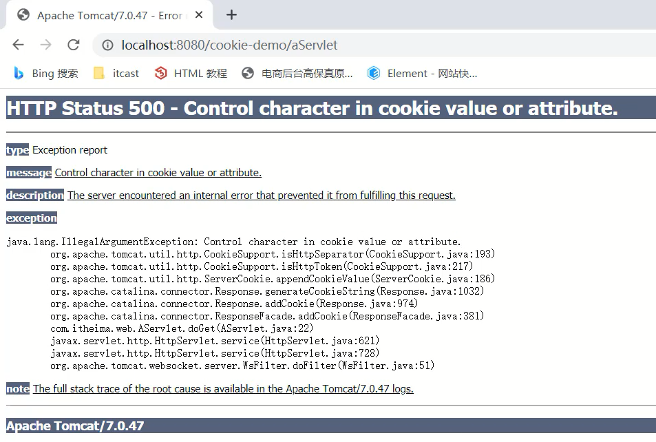

通过上面的案例演示，我们得到一个结论:

* Cookie不能直接存储中文

Cookie不能存储中文，但是如果有这方面的需求，这个时候该如何解决呢?

这个时候，我们可以使用之前学过的一个知识点叫`URL编码`，所以如果需要存储中文，就需要进行转码，具体的实现思路为:

> 1.在AServlet中对中文进行URL编码，采用URLEncoder.encode()，将编码后的值存入Cookie中
>
> 2.在BServlet中获取Cookie中的值,获取的值为URL编码后的值
>
> 3.将获取的值在进行URL解码,采用URLDecoder.decode()，就可以获取到对应的中文值

(1)在AServlet中对中文进行URL编码

```java
@WebServlet("/aServlet")
public class AServlet extends HttpServlet {
    @Override
    protected void doGet(HttpServletRequest request, HttpServletResponse response) throws ServletException, IOException {
        //发送Cookie
        String value = "张三";
        //对中文进行URL编码
        value = URLEncoder.encode(value, "UTF-8");
        System.out.println("存储数据："+value);
        //将编码后的值存入Cookie中 
        Cookie cookie = new Cookie("username",value);
        //设置存活时间   ，1周 7天
        cookie.setMaxAge(60*60*24*7);
        //2. 发送Cookie，response
        response.addCookie(cookie);
    }

    @Override
    protected void doPost(HttpServletRequest request, HttpServletResponse response) throws ServletException, IOException {
        this.doGet(request, response);
    }
}
```

(2)在BServlet中获取值，并对值进行解码

```java
@WebServlet("/bServlet")
public class BServlet extends HttpServlet {
    @Override
    protected void doGet(HttpServletRequest request, HttpServletResponse response) throws ServletException, IOException {
        //获取Cookie
        //1. 获取Cookie数组
        Cookie[] cookies = request.getCookies();
        //2. 遍历数组
        for (Cookie cookie : cookies) {
            //3. 获取数据
            String name = cookie.getName();
            if("username".equals(name)){
                String value = cookie.getValue();//获取的是URL编码后的值 %E5%BC%A0%E4%B8%89
                //URL解码
                value = URLDecoder.decode(value,"UTF-8");
                System.out.println(name+":"+value);//value解码后为 张三
                break;
            }
        }

    }

    @Override
    protected void doPost(HttpServletRequest request, HttpServletResponse response) throws ServletException, IOException {
        this.doGet(request, response);
    }
}
```

至此，我们就可以将中文存入Cookie中进行使用。

**小结**

Cookie的使用细节中，我们讲了Cookie的`存活时间`和`存储中文`:

* 存活时间，需要掌握setMaxAage()API的使用

* 存储中文，需要掌握URL编码和解码的使用

## 3，Session

Cookie已经能完成一次会话多次请求之间的数据共享，之前我们还提到过Session也可以实现，那么:

- 什么是Session?
- Session如何来使用?
- Session是如何实现的?
- Session的使用注意事项有哪些?

### 3.1 Session的基本使用

**1.概念**

==Session==：服务端会话跟踪技术：将数据保存到服务端。

* Session是存储在服务端而Cookie是存储在客户端
* 存储在客户端的数据容易被窃取和截获，存在很多不安全的因素
* 存储在服务端的数据相比于客户端来说就更安全

**2.Session的工作流程**

 

* 在服务端的AServlet获取一个Session对象，把数据存入其中
* 在服务端的BServlet获取到相同的Session对象，从中取出数据
* 就可以实现一次会话中多次请求之间的数据共享了
* 现在最大的问题是如何保证AServlet和BServlet使用的是同一个Session对象(在原理分析会讲解)?

**3.Session的基本使用**

在JavaEE中提供了HttpSession接口，来实现一次会话的多次请求之间数据共享功能。

具体的使用步骤为:

* 获取Session对象,使用的是request对象

```
HttpSession session = request.getSession();
```

* Session对象提供的功能:

  * 存储数据到 session 域中

    ```
    void setAttribute(String name, Object o)
    ```

  * 根据 key，获取值

    ```
    Object getAttribute(String name)
    ```

  * 根据 key，删除该键值对

    ```
    void removeAttribute(String name)
    ```

介绍完Session相关的API后，接下来通过一个案例来完成对Session的使用，具体实现步骤为:

> 需求:在一个Servlet中往Session中存入数据，在另一个Servlet中获取Session中存入的数据
>
> 1.创建名为SessionDemo1的Servlet类
>
> 2.创建名为SessionDemo2的Servlet类
>
> 3.在SessionDemo1的方法中:获取Session对象、存储数据
>
> 4.在SessionDemo2的方法中:获取Session对象、获取数据
>
> 5.启动测试

(1)创建名为SessionDemo1的Servlet类

```java
@WebServlet("/demo1")
public class SessionDemo1 extends HttpServlet {
    @Override
    protected void doGet(HttpServletRequest request, HttpServletResponse response) throws ServletException, IOException {
    
    }

    @Override
    protected void doPost(HttpServletRequest request, HttpServletResponse response) throws ServletException, IOException {
        this.doGet(request, response);
    }
}
```

(2)创建名为SessionDemo2的Servlet类

```java
@WebServlet("/demo2")
public class SessionDemo2 extends HttpServlet {
    @Override
    protected void doGet(HttpServletRequest request, HttpServletResponse response) throws ServletException, IOException {
    
    }

    @Override
    protected void doPost(HttpServletRequest request, HttpServletResponse response) throws ServletException, IOException {
        this.doGet(request, response);
    }
}
```

(3)SessionDemo1:获取Session对象、存储数据

```java
@WebServlet("/demo1")
public class SessionDemo1 extends HttpServlet {
    @Override
    protected void doGet(HttpServletRequest request, HttpServletResponse response) throws ServletException, IOException {
    	//存储到Session中
        //1. 获取Session对象
        HttpSession session = request.getSession();
        //2. 存储数据
        session.setAttribute("username","zs");
    }

    @Override
    protected void doPost(HttpServletRequest request, HttpServletResponse response) throws ServletException, IOException {
        this.doGet(request, response);
    }
}
```

(4)SessionDemo2:获取Session对象、获取数据

```java
@WebServlet("/demo2")
public class SessionDemo2 extends HttpServlet {
    @Override
    protected void doGet(HttpServletRequest request, HttpServletResponse response) throws ServletException, IOException {
        //获取数据，从session中
        //1. 获取Session对象
        HttpSession session = request.getSession();
        //2. 获取数据
        Object username = session.getAttribute("username");
        System.out.println(username);
    }

    @Override
    protected void doPost(HttpServletRequest request, HttpServletResponse response) throws ServletException, IOException {
        this.doGet(request, response);
    }
}
```

(5)启动测试，

* 先访问`http://localhost:8080/cookie-demo/demo1`,将数据存入Session
* 在访问`http://localhost:8080/cookie-demo/demo2`,从Session中获取数据
* 查看控制台


通过案例的效果，能看到Session是能够在一次会话中两次请求之间共享数据。

**小结**

至此Session的基本使用就已经完成了，重点要掌握的是:

* Session的获取

  ```
  HttpSession session = request.getSession();
  ```

* Session常用方法的使用

  ```
  void setAttribute(String name, Object o)
  Object getAttribute(String name)
  ```

  **注意:**Session中可以存储的是一个Object类型的数据，也就是说Session中可以存储任意数据类型。

介绍完Session的基本使用之后，那么Session的底层到底是如何实现一次会话两次请求之间的数据共享呢?

### 3.2 Session的原理分析

* Session是基于Cookie实现的

这句话其实不太能详细的说明Session的底层实现，接下来，咱们一步步来分析下Session的具体实现原理:

(1)前提条件


Session要想实现一次会话多次请求之间的数据共享，就必须要保证多次请求获取Session的对象是同一个。

那么它们是一个对象么？要验证这个结论也很简单，只需要在上面案例中的两个Servlet中分别打印下Session对象

SessionDemo1

```java
@WebServlet("/demo1")
public class SessionDemo1 extends HttpServlet {
    @Override
    protected void doGet(HttpServletRequest request, HttpServletResponse response) throws ServletException, IOException {
    	//存储到Session中
        //1. 获取Session对象
        HttpSession session = request.getSession();
        System.out.println(session);
        //2. 存储数据
        session.setAttribute("username","zs");
    }

    @Override
    protected void doPost(HttpServletRequest request, HttpServletResponse response) throws ServletException, IOException {
        this.doGet(request, response);
    }
}
```

SessionDemo2

```java
@WebServlet("/demo2")
public class SessionDemo2 extends HttpServlet {
    @Override
    protected void doGet(HttpServletRequest request, HttpServletResponse response) throws ServletException, IOException {
        //获取数据，从session中
        //1. 获取Session对象
        HttpSession session = request.getSession();
        System.out.println(session);
        //2. 获取数据
        Object username = session.getAttribute("username");
        System.out.println(username);
    }

    @Override
    protected void doPost(HttpServletRequest request, HttpServletResponse response) throws ServletException, IOException {
        this.doGet(request, response);
    }
}
```

启动测试，分别访问

`http://localhost:8080/cookie-demo/demo1`

`http://localhost:8080/cookie-demo/demo2`


通过打印可以得到如下结论:

* 两个Servlet类中获取的Session对象是同一个
* 把demo1和demo2请求刷新多次，控制台最终打印的结果都是同一个

那么问题又来了，如果新开一个浏览器，访问demo1或者demo2,打印在控制台的Session还是同一个对象么?


==注意:在一台电脑上演示的时候，如果是相同的浏览器必须要把浏览器全部关掉重新打开，才算新开的一个浏览器。==

当然也可以使用不同的浏览器进行测试，就不需要把之前的浏览器全部关闭。

测试的结果：如果是不同浏览器或者重新打开浏览器后，打印的Session就不一样了。

所以Session实现的也是一次会话中的多次请求之间的数据共享。

那么最主要的问题就来了，Session是如何保证在一次会话中获取的Session对象是同一个呢?


(1)demo1在第一次获取session对象的时候，session对象会有一个唯一的标识，假如是`id:10`

(2)demo1在session中存入其他数据并处理完成所有业务后，需要通过Tomcat服务器响应结果给浏览器

(3)Tomcat服务器发现业务处理中使用了session对象，就会把session的唯一标识`id:10`当做一个cookie，添加`Set-Cookie:JESSIONID=10`到响应头中，并响应给浏览器

(4)浏览器接收到响应结果后，会把响应头中的coookie数据存储到浏览器的内存中

(5)浏览器在同一会话中访问demo2的时候，会把cookie中的数据按照`cookie: JESSIONID=10`的格式添加到请求头中并发送给服务器Tomcat

(6)demo2获取到请求后，从请求头中就读取cookie中的JSESSIONID值为10，然后就会到服务器内存中寻找`id:10`的session对象，如果找到了，就直接返回该对象，如果没有则新创建一个session对象

(7)关闭打开浏览器后，因为浏览器的cookie已被销毁，所以就没有JESSIONID的数据，服务端获取到的session就是一个全新的session对象

至此，`Session是基于Cookie来实现的`这就话，我们就解释完了，接下来通过实例来演示下:

(1)使用chrome浏览器访问`http://localhost:8080/cookie-demo/demo1`,打开开发者模式(F12或Ctrl+Shift+I),查看==响应头(Response Headers)==数据:


(2)使用chrome浏览器再次访问`http://localhost:8080/cookie-demo/demo2`，查看==请求头(Request Headers)==数据:


**小结**

介绍完Session的原理，我们只需要记住

* Session是基于Cookie来实现的

### 3.3 Session的使用细节

这节我们会主要讲解两个知识，第一个是Session的钝化和活化，第二个是Session的销毁，首先来学习什么是Session的钝化和活化？

#### 3.3.1 Session钝化与活化

首先需要大家思考的问题是: 

* 服务器重启后，Session中的数据是否还在?

要想回答这个问题，我们可以先看下下面这幅图，

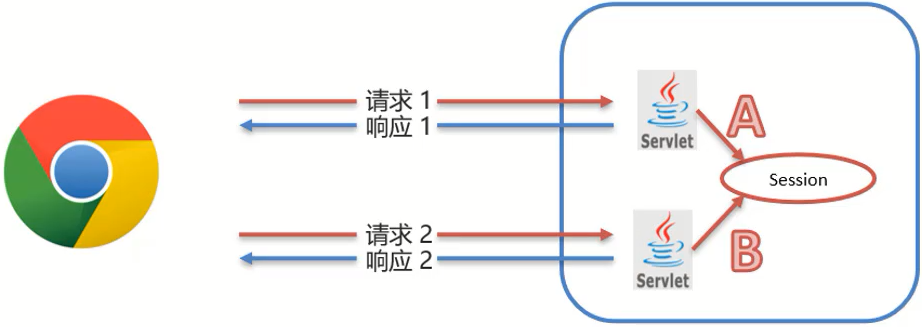 

(1)服务器端AServlet和BServlet共用的session对象应该是存储在服务器的内存中

(2)服务器重新启动后，内存中的数据应该是已经被释放，对象也应该都销毁了

所以session数据应该也已经不存在了。但是如果session不存在会引发什么问题呢?

举个例子说明下，

(1)用户把需要购买的商品添加到购物车，因为要实现同一个会话多次请求数据共享，所以假设把数据存入Session对象中

(2)用户正要付钱的时候接到一个电话，付钱的动作就搁浅了

(3)正在用户打电话的时候，购物网站因为某些原因需要重启

(4)重启后session数据被销毁，购物车中的商品信息也就会随之而消失

(5)用户想再次发起支付，就会出为问题

所以说对于session的数据，我们应该做到就算服务器重启了，也应该能把数据保存下来才对。

分析了这么多，那么Tomcat服务器在重启的时候，session数据到底会不会保存以及是如何保存的，我们可以通过实际案例来演示下:

==注意:这里所说的关闭和启动应该要确保是正常的关闭和启动。==

那如何才是正常关闭Tomcat服务器呢?

需要使用命令行的方式来启动和停止Tomcat服务器:

==启动==:进入到项目pom.xml所在目录，执行`tomcat7:run`


==停止==:在启动的命令行界面，输入`ctrl+c`


有了上述两个正常启动和关闭的方式后，接下来的测试流程是:

(1)先启动Tomcat服务器 

(2)访问`http://localhost:8080/cookie-demo/demo1`将数据存入session中

(3)正确停止Tomcat服务器

(4)再次重新启动Tomcat服务器

(5)访问`http://localhost:8080/cookie-demo/demo2` 查看是否能获取到session中的数据


经过测试，会发现只要服务器是正常关闭和启动，session中的数据是可以被保存下来的。

那么Tomcat服务器到底是如何做到的呢?

具体的原因就是:Session的钝化和活化:

* 钝化：在服务器正常关闭后，Tomcat会自动将Session数据写入硬盘的文件中

  * 钝化的数据路径为:`项目目录\target\tomcat\work\Tomcat\localhost\项目名称\SESSIONS.ser`

    

* 活化：再次启动服务器后，从文件中加载数据到Session中

  * 数据加载到Session中后，路径中的`SESSIONS.ser`文件会被删除掉

对于上述的整个过程，大家只需要了解下即可。因为所有的过程都是Tomcat自己完成的，不需要我们参与。

**小结**

Session的钝化和活化介绍完后，需要我们注意的是:

* session数据存储在服务端，服务器重启后，session数据会被保存

* 浏览器被关闭启动后，重新建立的连接就已经是一个全新的会话，获取的session数据也是一个新的对象

* session的数据要想共享，浏览器不能关闭，所以session数据不能长期保存数据
* cookie是存储在客户端，是可以长期保存

#### 3.3.2 Session销毁

session的销毁会有两种方式:

* 默认情况下，无操作，30分钟自  动销毁

  * 对于这个失效时间，是可以通过配置进行修改的

    * 在项目的web.xml中配置

      ```xml
      <?xml version="1.0" encoding="UTF-8"?>
      <web-app xmlns="http://xmlns.jcp.org/xml/ns/javaee"
               xmlns:xsi="http://www.w3.org/2001/XMLSchema-instance"
               xsi:schemaLocation="http://xmlns.jcp.org/xml/ns/javaee http://xmlns.jcp.org/xml/ns/javaee/web-app_3_1.xsd"
               version="3.1">
      
          <session-config>
              <session-timeout>100</session-timeout>
          </session-config>
      </web-app>
      ```

    * 如果没有配置，默认是30分钟，默认值是在Tomcat的web.xml配置文件中写死的

      

* 调用Session对象的invalidate()进行销毁

  * 在SessionDemo2类中添加session销毁的方法

    ```java
    @WebServlet("/demo2")
    public class SessionDemo2 extends HttpServlet {
        @Override
        protected void doGet(HttpServletRequest request, HttpServletResponse response) throws ServletException, IOException {
            //获取数据，从session中
    
            //1. 获取Session对象
            HttpSession session = request.getSession();
            System.out.println(session);
    
            // 销毁
            session.invalidate();
            //2. 获取数据
            Object username = session.getAttribute("username");
            System.out.println(username);
        }
    
        @Override
        protected void doPost(HttpServletRequest request, HttpServletResponse response) throws ServletException, IOException {
            this.doGet(request, response);
        }
    }
    ```

  * 启动访问测试，先访问demo1将数据存入到session，再次访问demo2从session中获取数据

    

  * 该销毁方法一般会在用户退出的时候，需要将session销毁掉。

**Cookie和Session小结**

* Cookie 和 Session 都是来完成一次会话内多次请求间==数据共享==的。

所需两个对象放在一块，就需要思考:

Cookie和Session的区别是什么?

Cookie和Session的应用场景分别是什么?

* 区别:
  * 存储位置：Cookie 是将数据存储在客户端，Session 将数据存储在服务端
  * 安全性：Cookie不安全，Session安全
  * 数据大小：Cookie最大3KB，Session无大小限制
  * 存储时间：Cookie可以通过setMaxAge()长期存储，Session默认30分钟
  * 服务器性能：Cookie不占服务器资源，Session占用服务器资源
* 应用场景:
  * 购物车:使用Cookie来存储
  * 以登录用户的名称展示:使用Session来存储
  * 记住我功能:使用Cookie来存储
  * 验证码:使用session来存储
* 结论
  * Cookie是用来保证用户在未登录情况下的身份识别
  * Session是用来保存用户登录后的数据

介绍完Cookie和Session以后，具体用哪个还是需要根据具体的业务进行具体分析。

## 4，用户登录注册案例

### 4.1 需求分析

 需求说明：

1. 完成用户登录功能，如果用户勾选“记住用户” ，则下次访问登录页面==自动==填充用户名密码

2. 完成注册功能，并实现==验证码==功能


### 4.2 用户登录功能

1. 需求:

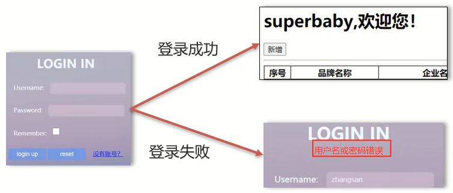

* 用户登录成功后，跳转到列表页面，并在页面上展示当前登录的用户名称
* 用户登录失败后，跳转回登录页面，并在页面上展示对应的错误信息

2. 实现流程分析


(1)前端通过表单发送请求和数据给Web层的LoginServlet

(2)在LoginServlet中接收请求和数据[用户名和密码]

(3)LoginServlet接收到请求和数据后，调用Service层完成根据用户名和密码查询用户对象

(4)在Service层需要编写UserService类，在类中实现login方法，方法中调用Dao层的UserMapper

(5)在UserMapper接口中，声明一个根据用户名和密码查询用户信息的方法

(6)Dao层把数据查询出来以后，将返回数据封装到User对象，将对象交给Service层

(7)Service层将数据返回给Web层

(8)Web层获取到User对象后，判断User对象，如果为Null,则将错误信息响应给登录页面，如果不为Null，则跳转到列表页面，并把当前登录用户的信息存入Session携带到列表页面。

3. 具体实现

(1)完成Dao层的代码编写

(1.1)将`04-资料\1. 登录注册案例\2. MyBatis环境\UserMapper.java`放到com.itheima.mapper`包下:

```java
public interface UserMapper {
    /**
     * 根据用户名和密码查询用户对象
     * @param username
     * @param password
     * @return
     */
    @Select("select * from tb_user where username = #{username} and password = #{password}")
    User select(@Param("username") String username,@Param("password")  String password);

    /**
     * 根据用户名查询用户对象
     * @param username
     * @return
     */
    @Select("select * from tb_user where username = #{username}")
    User selectByUsername(String username);

    /**
     * 添加用户
     * @param user
     */
    @Insert("insert into tb_user values(null,#{username},#{password})")
    void add(User user);
}
```

(1.2)将`04-资料\1. 登录注册案例\2. MyBatis环境\User.java`放到`com.itheima.pojo`包下:

```java
public class User {

    private Integer id;
    private String username;
    private String password;

    public Integer getId() {
        return id;
    }

    public void setId(Integer id) {
        this.id = id;
    }

    public String getUsername() {
        return username;
    }

    public void setUsername(String username) {
        this.username = username;
    }

    public String getPassword() {
        return password;
    }

    public void setPassword(String password) {
        this.password = password;
    }

    @Override
    public String toString() {
        return "User{" +
                "id=" + id +
                ", username='" + username + '\'' +
                ", password='" + password + '\'' +
                '}';
    }
}
```

(1.3)将`04-资料\1. 登录注册案例\2. MyBatis环境\UserMapper.xml`放入到resources/com/itheima/mapper`目录下:

```xml
<?xml version="1.0" encoding="UTF-8" ?>
<!DOCTYPE mapper
        PUBLIC "-//mybatis.org//DTD Mapper 3.0//EN"
        "http://mybatis.org/dtd/mybatis-3-mapper.dtd">
<mapper namespace="com.itheima.mapper.UserMapper">

</mapper>
```

(2)完成Service层的代码编写

(2.1)在`com.itheima.service`包下，创建UserService类

```java
public class UserService {
    //1.使用工具类获取SqlSessionFactory
    SqlSessionFactory factory = SqlSessionFactoryUtils.getSqlSessionFactory();
    /**
     * 登录方法
     * @param username
     * @param password
     * @return
     */
    public User login(String username,String password){
        //2. 获取SqlSession
        SqlSession sqlSession = factory.openSession();
        //3. 获取UserMapper
        UserMapper mapper = sqlSession.getMapper(UserMapper.class);
        //4. 调用方法
        User user = mapper.select(username, password);
        //释放资源
        sqlSession.close();

        return  user;
    }
}
```

(3)完成页面和Web层的代码编写

(3.1)将`04-资料\1. 登录注册案例\1. 静态页面`拷贝到项目的`webapp`目录下:


(3.2)将login.html内容修改成login.jsp

```jsp
<%@ page contentType="text/html;charset=UTF-8" language="java" %>
<!DOCTYPE html>
<html lang="en">

<head>
    <meta charset="UTF-8">
    <title>login</title>
    <link href="css/login.css" rel="stylesheet">
</head>

<body>
<div id="loginDiv" style="height: 350px">
    <form action="/brand-demo/loginServlet" method="post" id="form">
        <h1 id="loginMsg">LOGIN IN</h1>
        <div id="errorMsg">用户名或密码不正确</div>
        <p>Username:<input id="username" name="username" type="text"></p>
        <p>Password:<input id="password" name="password" type="password"></p>
        <p>Remember:<input id="remember" name="remember" type="checkbox"></p>
        <div id="subDiv">
            <input type="submit" class="button" value="login up">
            <input type="reset" class="button" value="reset">&nbsp;&nbsp;&nbsp;
            <a href="register.html">没有账号？</a>
        </div>
    </form>
</div>
</body>
</html>
```

(3.3)创建LoginServlet类

```java
@WebServlet("/loginServlet")
public class LoginServlet extends HttpServlet {
    private UserService service = new UserService();

    @Override
    protected void doGet(HttpServletRequest request, HttpServletResponse response) throws ServletException, IOException {
        //1. 获取用户名和密码
        String username = request.getParameter("username");
        String password = request.getParameter("password");
   
        //2. 调用service查询
        User user = service.login(username, password);

        //3. 判断
        if(user != null){
            //登录成功，跳转到查询所有的BrandServlet
            
            //将登陆成功后的user对象，存储到session
            HttpSession session = request.getSession();
            session.setAttribute("user",user);
            
            String contextPath = request.getContextPath();
            response.sendRedirect(contextPath+"/selectAllServlet");
        }else {
            // 登录失败,
            // 存储错误信息到request
            request.setAttribute("login_msg","用户名或密码错误");
            // 跳转到login.jsp
            request.getRequestDispatcher("/login.jsp").forward(request,response);

        }
    }

    @Override
    protected void doPost(HttpServletRequest request, HttpServletResponse response) throws ServletException, IOException {
        this.doGet(request, response);
    }
}
```

(3.4)在brand.jsp中<body>标签下添加欢迎当前用户的提示信息:

```jsp
<h1>${user.username},欢迎您</h1>
```

(3.5) 修改login.jsp，将错误信息使用EL表达式来获取

```jsp
修改前内容:<div id="errorMsg">用户名或密码不正确</div>
修改后内容: <div id="errorMsg">${login_msg}</div>
```

(4)启动，访问测试

(4.1) 进入登录页面，输入错误的用户名或密码


(4.2)输入正确的用户和密码信息


**小结**

* 在LoginServlet中，将登录成功的用户数据存入session中，方法在列表页面中获取当前登录用户信息进行展示
* 在LoginServlet中，将登录失败的错误信息存入到request中，如果存入到session中就会出现这次会话的所有请求都有登录失败的错误信息，这个是不需要的，所以不用存入到session中

### 4.3 记住我-设置Cookie

1. 需求:

如果用户勾选“记住用户” ，则下次访问登陆页面自动填充用户名密码。这样可以提升用户的体验。

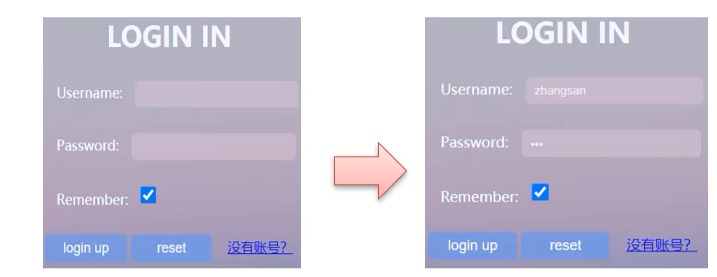

对应上面这个需求，最大的问题就是: 如何自动填充用户名和密码?

2. 实现流程分析

因为`记住我`功能要实现的效果是，就算用户把浏览器关闭过几天再来访问也能自动填充，所以需要将登陆信息存入一个可以长久保存，并且能够在浏览器关闭重新启动后依然有效的地方，就是我们前面讲的==Cookie==,所以:

* 将用户名和密码写入==Cookie==中，并且持久化存储Cookie,下次访问浏览器会自动携带Cookie

* 在页面获取Cookie数据后，设置到用户名和密码框中

* 何时写入Cookie?
  * 用户必须登陆成功后才需要写
  * 用户必须在登录页面勾选了`记住我`的复选框


(1)前端需要在发送请求和数据的时候，多携带一个用户是否勾选`Remember`的数据

(2)LoginServlet获取到数据后，调用Service完成用户名和密码的判定

(3)登录成功，并且用户在前端勾选了`记住我`，需要往Cookie中写入用户名和密码的数据，并设置Cookie存活时间

(4)设置成功后，将数据响应给前端

3. 具体实现

(1)在login.jsp为复选框设置值

```jsp
<%@ page contentType="text/html;charset=UTF-8" language="java" %>
<!DOCTYPE html>
<html lang="en">

<head>
    <meta charset="UTF-8">
    <title>login</title>
    <link href="css/login.css" rel="stylesheet">
</head>

<body>
<div id="loginDiv" style="height: 350px">
    <form action="/brand-demo/loginServlet" method="post" id="form">
        <h1 id="loginMsg">LOGIN IN</h1>
        <div id="errorMsg">${login_msg}</div>
        <p>Username:<input id="username" name="username" type="text"></p>
        <p>Password:<input id="password" name="password" type="password"></p>
        <p>Remember:<input id="remember" name="remember" value="1" type="checkbox"></p>
        <div id="subDiv">
            <input type="submit" class="button" value="login up">
            <input type="reset" class="button" value="reset">&nbsp;&nbsp;&nbsp;
            <a href="register.html">没有账号？</a>
        </div>
    </form>
</div>
</body>
</html>
```

(2)在LoginServlet获取复选框的值并在登录成功后进行设置Cookie

```java
@WebServlet("/loginServlet")
public class LoginServlet extends HttpServlet {
    private UserService service = new UserService();

    @Override
    protected void doGet(HttpServletRequest request, HttpServletResponse response) throws ServletException, IOException {
        //1. 获取用户名和密码
        String username = request.getParameter("username");
        String password = request.getParameter("password");

        //获取复选框数据
        String remember = request.getParameter("remember");

        //2. 调用service查询
        User user = service.login(username, password);

        //3. 判断
        if(user != null){
            //登录成功，跳转到查询所有的BrandServlet

            //判断用户是否勾选记住我，字符串写前面是为了避免出现空指针异常
            if("1".equals(remember)){
                //勾选了，发送Cookie
                //1. 创建Cookie对象
                Cookie c_username = new Cookie("username",username);
                Cookie c_password = new Cookie("password",password);
                // 设置Cookie的存活时间
                c_username.setMaxAge( 60 * 60 * 24 * 7);
                c_password.setMaxAge( 60 * 60 * 24 * 7);
                //2. 发送
                response.addCookie(c_username);
                response.addCookie(c_password);
            }

            //将登陆成功后的user对象，存储到session
            HttpSession session = request.getSession();
            session.setAttribute("user",user);

            String contextPath = request.getContextPath();
            response.sendRedirect(contextPath+"/selectAllServlet");
        }else {
            // 登录失败,

            // 存储错误信息到request
            request.setAttribute("login_msg","用户名或密码错误");

            // 跳转到login.jsp
            request.getRequestDispatcher("/login.jsp").forward(request,response);

        }
    }

    @Override
    protected void doPost(HttpServletRequest request, HttpServletResponse response) throws ServletException, IOException {
        this.doGet(request, response);
    }
}
```

(3)启动访问测试，

只有当前用户名和密码输入正确，并且勾选了Remeber的复选框，在响应头中才可以看得cookie的相关数据


### 4.4 记住我-获取Cookie

1. 需求

登录成功并勾选了Remeber后，后端返回给前端的Cookie数据就已经存储好了，接下来就需要在页面获取Cookie中的数据，并把数据设置到登录页面的用户名和密码框中。


如何在页面直接获取Cookie中的值呢?

2. 实现流程分析

在页面可以使用EL表达式，${cookie.==key==.value}

key:指的是存储在cookie中的键名称


(1)在login.jsp用户名的表单输入框使用value值给表单元素添加默认值，value可以使用`${cookie.username.value}`

(2)在login.jsp密码的表单输入框使用value值给表单元素添加默认值，value可以使用`${cookie.password.value}`

3. 具体实现

(1)修改login.jsp页面

```jsp
<%@ page contentType="text/html;charset=UTF-8" language="java" %>
<!DOCTYPE html>
<html lang="en">

<head>
    <meta charset="UTF-8">
    <title>login</title>
    <link href="css/login.css" rel="stylesheet">
</head>

<body>
<div id="loginDiv" style="height: 350px">
    <form action="/brand-demo/loginServlet" method="post" id="form">
        <h1 id="loginMsg">LOGIN IN</h1>
        <div id="errorMsg">${login_msg}</div>
        <p>Username:<input id="username" name="username" value="${cookie.username.value}" type="text"></p>

        <p>Password:<input id="password" name="password" value="${cookie.password.value}" type="password"></p>
        <p>Remember:<input id="remember" name="remember" value="1" type="checkbox"></p>
        <div id="subDiv">
            <input type="submit" class="button" value="login up">
            <input type="reset" class="button" value="reset">&nbsp;&nbsp;&nbsp;
            <a href="register.html">没有账号？</a>
        </div>
    </form>
</div>
</body>
</html>
```

4. 访问测试，重新访问登录页面，就可以看得用户和密码已经被填充。


### 4.5 用户注册功能

1. 需求

* 注册功能：保存用户信息到数据库
* 验证码功能
  * 展示验证码：展示验证码图片，并可以点击切换
  * 校验验证码：验证码填写不正确，则注册失败


2. 实现流程分析

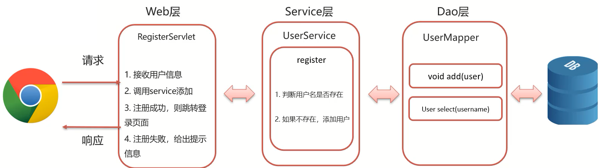

(1)前端通过表单发送请求和数据给Web层的RegisterServlet

(2)在RegisterServlet中接收请求和数据[用户名和密码]

(3)RegisterServlet接收到请求和数据后，调用Service层完成用户信息的保存

(4)在Service层需要编写UserService类，在类中实现register方法，需要判断用户是否已经存在，如果不存在，则完成用户数据的保存

(5)在UserMapper接口中，声明两个方法，一个是根据用户名查询用户信息方法，另一个是保存用户信息方法

(6)在UserService类中保存成功则返回true，失败则返回false,将数据返回给Web层

(7)Web层获取到结果后，如果返回的是true,则提示`注册成功`，并转发到登录页面，如果返回false则提示`用户名已存在`并转发到注册页面

3. 具体实现

(1)Dao层代码参考资料中的内容完成

(2)编写Service层代码

```java
public class UserService {
    //1.使用工具类获取SqlSessionFactory
    SqlSessionFactory factory = SqlSessionFactoryUtils.getSqlSessionFactory();
    /**
     * 注册方法
     * @return
     */

    public boolean register(User user){
        //2. 获取SqlSession
        SqlSession sqlSession = factory.openSession();
        //3. 获取UserMapper
        UserMapper mapper = sqlSession.getMapper(UserMapper.class);
        //4. 判断用户名是否存在
        User u = mapper.selectByUsername(user.getUsername());

        if(u == null){
            // 用户名不存在，注册
            mapper.add(user);
            sqlSession.commit();
        }
        sqlSession.close();

        return u == null;

    }
}
```

(3)完成页面和Web层的代码编写

(3.1)将register.html内容修改成register.jsp

```jsp
<%@ page contentType="text/html;charset=UTF-8" language="java" %>
<!DOCTYPE html>
<html lang="en">
<head>
    <meta charset="UTF-8">
    <title>欢迎注册</title>
    <link href="css/register.css" rel="stylesheet">
</head>
<body>
<div class="form-div">
    <div class="reg-content">
        <h1>欢迎注册</h1>
        <span>已有帐号？</span> <a href="login.html">登录</a>
    </div>
    <form id="reg-form" action="/brand-demo/registerServlet" method="post">
        <table>
            <tr>
                <td>用户名</td>
                <td class="inputs">
                    <input name="username" type="text" id="username">
                    <br>
                    <span id="username_err" class="err_msg" style="display:none">用户名不太受欢迎</span>
                </td>
            </tr>
            <tr>
                <td>密码</td>
                <td class="inputs">
                    <input name="password" type="password" id="password">
                    <br>
                    <span id="password_err" class="err_msg" style="display: none">密码格式有误</span>
                </td>
            </tr>
            <tr>
                <td>验证码</td>
                <td class="inputs">
                    <input name="checkCode" type="text" id="checkCode">
                    
                    <a href="#" id="changeImg" >看不清？</a>
                </td>
            </tr>
        </table>
        <div class="buttons">
            <input value="注 册" type="submit" id="reg_btn">
        </div>
        <br class="clear">
    </form>
</div>
</body>
</html>
```

(3.2)编写RegisterServlet

```java
@WebServlet("/registerServlet")
public class RegisterServlet extends HttpServlet {
    private UserService service = new UserService();

    @Override
    protected void doGet(HttpServletRequest request, HttpServletResponse response) throws ServletException, IOException {
       //1. 获取用户名和密码数据
        String username = request.getParameter("username");
        String password = request.getParameter("password");
        
        User user = new User();
        user.setUsername(username);
        user.setPassword(password);

        //2. 调用service 注册
        boolean flag = service.register(user);
        //3. 判断注册成功与否
        if(flag){
             //注册功能，跳转登陆页面
            request.setAttribute("register_msg","注册成功，请登录");
            request.getRequestDispatcher("/login.jsp").forward(request,response);
        }else {
            //注册失败，跳转到注册页面

            request.setAttribute("register_msg","用户名已存在");
            request.getRequestDispatcher("/register.jsp").forward(request,response);
        }


    }

    @Override
    protected void doPost(HttpServletRequest request, HttpServletResponse response) throws ServletException, IOException {
        this.doGet(request, response);
    }
}
```

(3.3)需要在页面上展示后台返回的错误信息，需要修改register.jsp

```jsp
修改前:<span id="username_err" class="err_msg" style="display:none">用户名不太受欢迎</span>
修改后:<span id="username_err" class="err_msg">${register_msg}</span>
```

(3.4)如果注册成功，需要把成功信息展示在登录页面，所以也需要修改login.jsp

```jsp
修改前:<div id="errorMsg">${login_msg}</div>
修改后:<div id="errorMsg">${login_msg} ${register_msg}</div>
```

(3.5)修改login.jsp，将注册跳转地址修改为register.jsp

```jsp
修改前：<a href="register.html">没有账号？</a>
修改后: <a href="register.jsp">没有账号？</a>
```

(3.6)启动测试，

如果是注册的用户信息已经存在:


如果注册的用户信息不存在，注册成功:


### 4.6 验证码-展示

1. 需求分析

展示验证码：展示验证码图片，并可以点击切换


验证码的生成是通过工具类来实现的，具体的工具类参考

`04-资料\1. 登录注册案例\CheckCodeUtil.java`

在该工具类中编写main方法进行测试:

```java
public static void main(String[] args) throws IOException {
    //生成验证码的图片位置
    OutputStream fos = new FileOutputStream("d://a.jpg");
    //checkCode为最终验证码的数据
    String checkCode = CheckCodeUtil.outputVerifyImage(100, 50, fos, 4);
    System.out.println(checkCode);
}

```

生成完验证码以后，我们就可以知晓:

* 验证码就是使用Java代码生成的一张图片
* 验证码的作用:防止机器自动注册，攻击服务器

2. 实现流程分析


(1)前端发送请求给CheckCodeServlet

(2)CheckCodeServlet接收到请求后，生成验证码图片，将图片用Reponse对象的输出流写回到前端

思考:如何将图片写回到前端浏览器呢?

(1)Java中已经有工具类生成验证码图片，测试类中只是把图片生成到磁盘上
(2)生成磁盘的过程中使用的是OutputStream流，如何把这个图片生成在页面呢?
(3)前面在将Reponse对象的时候，它有一个方法可以获取其字节输出流，getOutputStream()
(4)综上所述，我们可以把写往磁盘的流对象更好成Response的字节流，即可完成图片响应给前端

3. 具体实现

(1)修改Register.jsp页面，将验证码的图片从后台获取

```jsp
<tr>
    <td>验证码</td>
        <td class="inputs">
        <input name="checkCode" type="text" id="checkCode">
        
        <a href="#" id="changeImg" >看不清？</a>
    </td>
</tr>

<script>
    document.getElementById("changeImg").onclick = function () {
       	//路径后面添加时间戳的目的是避免浏览器进行缓存静态资源
        document.getElementById("checkCodeImg").src = "/brand-demo/checkCodeServlet?"+new Date().getMilliseconds();
    }
</script>
```

(2)编写CheckCodeServlet类，用来接收请求生成验证码

```java
@WebServlet("/checkCodeServlet")
public class CheckCodeServlet extends HttpServlet {
    @Override
    protected void doGet(HttpServletRequest request, HttpServletResponse response) throws ServletException, IOException {
        // 生成验证码
        ServletOutputStream os = response.getOutputStream();
        String checkCode = CheckCodeUtil.outputVerifyImage(100, 50, os, 4);
    }

    @Override
    protected void doPost(HttpServletRequest request, HttpServletResponse response) throws ServletException, IOException {
        this.doGet(request, response);
    }
}
```

### 4.7验证码-校验

1. 需求

* 判断程序生成的验证码 和 用户输入的验证码 是否一样，如果不一样，则阻止注册
* 验证码图片访问和提交注册表单是==两次==请求，所以要将程序生成的验证码存入Session中


思考:为什么要把验证码数据存入到Session中呢?

* 生成验证码和校验验证码是两次请求，此处就需要在一个会话的两次请求之间共享数据
* 验证码属于安全数据类的，所以我们选中Session来存储验证码数据。

2. 实现流程分析


(1)在CheckCodeServlet中生成验证码的时候，将验证码数据存入Session对象

(2)前端将验证码和注册数据提交到后台，交给RegisterServlet类

(3)RegisterServlet类接收到请求和数据后，其中就有验证码，和Session中的验证码进行对比

(4)如果一致，则完成注册，如果不一致，则提示错误信息

3. 具体实现

(1)修改CheckCodeServlet类，将验证码存入Session对象

```java
@WebServlet("/checkCodeServlet")
public class CheckCodeServlet extends HttpServlet {
    @Override
    protected void doGet(HttpServletRequest request, HttpServletResponse response) throws ServletException, IOException {

        // 生成验证码
        ServletOutputStream os = response.getOutputStream();
        String checkCode = CheckCodeUtil.outputVerifyImage(100, 50, os, 4);

        // 存入Session
        HttpSession session = request.getSession();
        session.setAttribute("checkCodeGen",checkCode);


    }

    @Override
    protected void doPost(HttpServletRequest request, HttpServletResponse response) throws ServletException, IOException {
        this.doGet(request, response);
    }
}
```

(2)在RegisterServlet中，获取页面的和session对象中的验证码，进行对比

```java
package com.itheima.web;

import com.itheima.pojo.User;
import com.itheima.service.UserService;

import javax.servlet.ServletException;
import javax.servlet.annotation.WebServlet;
import javax.servlet.http.*;
import java.io.IOException;

@WebServlet("/registerServlet")
public class RegisterServlet extends HttpServlet {
    private UserService service = new UserService();

    @Override
    protected void doGet(HttpServletRequest request, HttpServletResponse response) throws ServletException, IOException {
       //1. 获取用户名和密码数据
        String username = request.getParameter("username");
        String password = request.getParameter("password");

        User user = new User();
        user.setUsername(username);
        user.setPassword(password);

        // 获取用户输入的验证码
        String checkCode = request.getParameter("checkCode");

        // 程序生成的验证码，从Session获取
        HttpSession session = request.getSession();
        String checkCodeGen = (String) session.getAttribute("checkCodeGen");

        // 比对
        if(!checkCodeGen.equalsIgnoreCase(checkCode)){

            request.setAttribute("register_msg","验证码错误");
            request.getRequestDispatcher("/register.jsp").forward(request,response);

            // 不允许注册
            return;
        }
        //2. 调用service 注册
        boolean flag = service.register(user);
        //3. 判断注册成功与否
        if(flag){
             //注册功能，跳转登陆页面

            request.setAttribute("register_msg","注册成功，请登录");
            request.getRequestDispatcher("/login.jsp").forward(request,response);
        }else {
            //注册失败，跳转到注册页面

            request.setAttribute("register_msg","用户名已存在");
            request.getRequestDispatcher("/register.jsp").forward(request,response);
        }


    }

    @Override
    protected void doPost(HttpServletRequest request, HttpServletResponse response) throws ServletException, IOException {
        this.doGet(request, response);
    }
}
```

至此，用户的注册登录功能就已经完成了。

(8)
