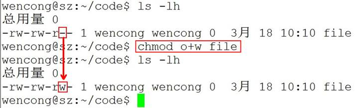

*Linux**系统编程-第01天（基本命令）

## 00. 目录

## 01. 学习目标

- 说出Linux下的目录结构和常见目录的作用
- 熟练使用Linux下的相对路径和绝对路径
- 熟练使用Linux下常用文件和目录操作相关的命令
- 熟练使用修改用户权限、用户和用户组相关的命令
- 熟练使用find命令相关参数进行文件查找
- 熟练使用grep命令根据文件内容进行文件的查找

 

## 02. Linux/Unix操作系统简介

### 2.1 Linux操作系统的目标(了解)

- 方便性：使计算机系统易于使用

- 有效性：以更有效的方式使用计算机系统资源

- 扩展性：方便用户有效开发、测试和引进新功能

- 开放性：所谓开放性，是指系统能遵循世界标准规范，特别是遵循开放系统互连OSI 国际标准。

  

### 2.2 Linux操作系统的作用(了解)

操作系统在计算机系统中承上启下的地位：向下封装硬件，向上提供操作接口。


### 2.3 Unix家族 (了解)

- 1965：贝尔实验室（Bell Labs）加入一项由通用电气和麻省理工学院合作的计划，该计划要建立一套多使用者、多任务、多层次的MULTICS操作系统。后来因为项目太为复杂失败。
- 1969：其主要开发者Thompson（后被称为UNIX之父）和Ritchie领导一组开发者，开发了一个新的多任务操作系统—UNICS，后来被改名为Unix，最初的Unix是用B语言和汇编语言混合编写而成。
- 1971：两人在贝尔实验室共同发明了C语言，并于1973用C语言重写了Unix。
- 1974：UNIX第一次出现在贝尔实验室以外。此后UNIX被政府机关，研究机构，企业和大学注意到，并逐渐流行开来。
- 1980：有两个最主要的Unix的版本线，一个是Berkeley的BSD UNIX，另一个是AT&T的Unix，两者的竞争最终引发了Unix的战争，最终导致Unix出现各种各样的变种。
- 1982：AT&T基于版本7开发了UNIX System Ⅲ的第一个商业版本，并不再开源。
- 1992~2001：由于版权问题，AT&T公司与BSD开发组开始了一场将近10年的版权官司。UNIX由于其昂贵的费用，仅局限于大型机的应用；BSD因为版权问题，失去了宝贵的发展时期。

 

### 2.4 Linux家族(了解)

- Minix（mini-UNIX）最初是由Andrew Tanenbaum教授，仿照4.3BSD的源代码，白手起家完成了12000行C语言的编写工作这个系统只是一个教学工具，没有什么实际应用价值。
- 1990年，Linus Torvalds决定编写一个自己的Minix内核，初名为Linus' Minix，意为Linus的Minix内核，后来改名为Linux，此内核于1991年正式发布，并逐渐引起人们的注意。
- Linux操作系统的诞生、发展、和成长过程依赖于五个重要支柱：unix操作系统、minix操作系统、GNU计划、POSIX标准和互联网。
- GNU计划：GNU是“GNU is Not Unix”的递归缩写，由Richard M.Stallman于1984年创办,旨在开发一个免费、类unix的操作系统-GNU系统及其开发工具；Emacs编辑系统、BASH shell程序、GCC、GDB等开发工具都是GNU组织的产品。
- 1992年Linux与其他GNU软件结合，完全自由的操作系统正式诞生。该操作系统往往被称为“GNU/Linux”或简称Linux。
- POSIX标准：POSIX标准定义了操作系统应该为应用程序提供的接口标准，POSIX标准用来统一Unix、Linux各分支编程接口，以提高其通用性和可移植性。

 

### 2.5 Linux和Unix的联系(了解)

- UNIX系统是工作站上最常用的操作系统，它是一个多用户、多任务的实时操作系统，允许多人同时访问计算机， 并同时运行多个任务。UNIX系统具有稳定、高效、安全、方便、功能强大等诸多优点，自20世纪70年代开始便运行在许多大型和小型计算机上。

- UNIX虽然是一个安全、稳定且功能强大的操作系统，但它也一直是一种大型的而且对运行平台要求很高的操作系统，只能在工作站或小型机上才能发挥全部功能，并且价格昂贵，对普通用户来说是可望而不可及的，这为后来Linux的崛起提供了机会，Linux是一个类UNIX操作系统。

- Linux是免费的、不受版权制约、与UNIX兼容的操作系统。

- Linux在x86架构上实现了UNIX系统的全部特性，具有多用户多任务的能力，同时保持了高效性和稳定性。

- Linux具有如下的优秀的特点：

  \1) 开放性；

  \2) 完全免费；

  \3) 多用户；

  \4) 多任务；

  \5) 良好的用户界面；

  \6) 设备独立性；

  \7) 提供了丰富的网络功能；

  \8) 可靠的系统安全性；

  \9) 良好的可移植性。

 

### 2.6 Linux内核介绍(了解)

内核(kernel)是系统的心脏，是运行程序和管理像磁盘和打印机等硬件设备的核心程序，它提供了一个在裸设备与应用程序间的抽象层。

Linux内核版本又分为**稳定版**和**开发版**，两种版本是相互关联，相互循环：

- 稳定版：具有工业级强度，可以广泛地应用和部署。新的稳定版相对于较旧的只是修正一些bug或加入一些新的驱动程序。
- 开发版：由于要试验各种解决方案，所以变化很快。

内核源码网址：http://www.kernel.org，所有来自全世界的对Linux源码的修改最终都会汇总到这个网站，由Linus领导的开源社区对其进行甄别和修改最终决定是否进入到Linux主线内核源码中。

OpenWRT(Linux内核 + 文件系统)

**Linux内核代码图：**


**Linux内核源码获取方式：**

| Protocol                                     | Location                                                     |
| :------------------------------------------- | :----------------------------------------------------------- |
| [HTTP](https://www.ietf.org/rfc/rfc2616.txt) | https://www.kernel.org/pub/                                  |
| [GIT](https://git-scm.com/)                  | https://git.kernel.org/                                      |
| [RSYNC](https://rsync.samba.org/)            | [rsync://rsync.kernel.org/pub/](rsync://rsync.kernel.org/pub/) |

 

### 2.7 Linux发行版本(了解)

Linux发行版 (也被叫做 GNU/Linux 发行版) 通常包含了包括桌面环境、办公套件、媒体播放器、数据库等应用软件。

这些操作系统通常由Linux内核、以及来自GNU计划的大量的函式库，和基于X Window的图形界面，在X Window中用户同样可以通过使用鼠标对窗口、菜单等进行操作来完成相应的工作。

X Window系统是一个非常出色的图形窗口系统，是类UNIX系统的图形用户界面的工业标准。X Window系统最重要的特征之一就是它的结构与设备无关。

X Window系统的**主要特点**有如下几点：

- X Window系统是客户机/服务器结构的。X Window的实现是与操作系统内核分开的，其主要由X Server和X Client两部分组成。
- X Window系统不是Unix/Linux操作系统的必须的构成部分，而只是一个可选的应用程序组件。

 

**Best Linux distro for developers in 2018**

| **POSITION** | **2015**   | **2014**   | 2018                                     |
| :----------- | :--------- | :--------- | :--------------------------------------- |
| 1            | Linux Mint | Linux Mint | [Arch Linux](https://www.archlinux.org/) |
| 2            | Debian     | Ubuntu     | [Debian](https://www.debian.org/)        |
| 3            | Ubuntu     | Debian     | [Raspbian](http://raspbian.org/)         |
| 4            | openSUSE   | openSUSE   | [Gentoo](https://www.gentoo.org/)        |
| 5            | Fedora     | Fedora     | [Ubuntu](https://www.ubuntu.com/)        |
| 6            | Mageia     | Mageia     | [Fedora](https://getfedora.org/)         |
| 7            | Manjaro    | Arch       | [OpenSUSE](https://www.opensuse.org/)    |
| 8            | CentOS     | Elementary | [CentOS](https://www.centos.org/)        |
| 9            | Arch       | CentOS     | [Solus](https://solus-project.com/)      |
| 10           | Elementary | Zorin      | [Puppy Linux](http://puppylinux.org/)    |

参考网址：[Best Linux distro for developers in 2018](https://www.techradar.com/news/best-linux-distro-for-developers)

推荐使用Ubuntu Centos

### 2.8 Unix/Linux开发应用领域介绍(了解)

- Unix/Linux服务器

  是目前Unix/Linux应用最多的一个领域，可以提供Web、FTP、Gopher、SMTP/POP3、Proxy/Cache、DNS等服务器，支持服务器集群，支持虚拟主机、虚拟服务、VPN等。

- 嵌入式Linux系统

  嵌入式Linux是将流行的Linux操作系统进行剪裁修改，能够在嵌入式计算机系统上运行的一种操作系统。Linux嵌入式系统能够支持多种CPU和硬件平台，性能稳定，剪裁性好，开发和使用容易。其中包括Embedix、uCLinux、muLinux等。

- 桌面应用

  近年来，Linux系统特别强调在桌面应用方面的改进，并且已达到相当的水平，完全可以作为一种集办公应用、多媒体应用、网络应用等多方面功能于一体的图形界面操作系统，在办公应用方面，Unix/Linux集成了openOffice、SUN公司的StarOffice以及KOffice等工具。

- 电子政务

  随着Linux的快速发展，Linux已逐渐成为Windows系统重要的竞争力量。尤其是Linux在安全性方面的独特优势，又使得Linux在政府应用领域得到很大的发展。目前一些国家正将其电子政务系统向Linux平台迁移。中国政府也对Linux给予极大的支持。

OpenWrt

 

 

 

## 03. Linux目录结构

### 3.1 Win和Linux文件系统区别 (了解)

在 windows 平台下，打开“计算机”，我们看到的是一个个的驱动器盘符：

每个驱动器都有自己的根目录结构，这样形成了多个树并列的情形，如图所示：

在 Linux 下，我们是看不到这些驱动器盘符，我们看到的是文件夹（目录）：


在早期的 UNIX 系统中，各个厂家各自定义了自己的 UNIX 系统文件目录，比较混乱。Linux 面世不久后，对文件目录进行了标准化，于1994年对根文件目录做了统一的规范，推出 FHS ( Filesystem Hierarchy Standard ) 的 Linux 文件系统层次结构标准。FHS 标准规定了 Linux 根目录各文件夹的名称及作用，统一了Linux界命名混乱的局面。

和Windows操作系统类似，所有Unix/Linux的数据都是由文件系统按照树型目录结构管理的。而且Unix/Linux操作系统同样要区分文件的类型，判断文件的存取属性和可执行属性。

Unix/Linux也采用了树状结构的文件系统，它由目录和目录下的文件一起构成。但Unix/Linux文件系统不使用驱动器这个概念，而是使用单一的根目录结构，所有的分区都挂载到单一的“/”目录上，其结构示意图如图所示：


无论何种版本的 Linux 发行版，桌面、应用是 Linux 的外衣，文件组织、目录结构才是Linux的内心。

### 3.2 Linux常见目录介绍(熟悉)

- **/：**根目录，一般根目录下只存放目录，在Linux下有且只有一个根目录。所有的东西都是从这里开始。当你在终端里输入“/home”，你其实是在告诉电脑，先从/（根目录）开始，再进入到home目录。
- **/bin:** **/usr/bin:** 可执行二进制文件的目录，如常用的命令ls、tar、mv、cat等。
- **/boot：**放置linux系统启动时用到的一些文件，如Linux的内核文件：/boot/vmlinuz，系统引导管理器：/boot/grub。
- **/dev：**存放linux系统下的设备文件，访问该目录下某个文件，相当于访问某个设备，常用的是挂载光驱 mount /dev/cdrom /mnt。
- **/etc**：系统配置文件存放的目录，不建议在此目录下存放可执行文件，重要的配置文件有 /etc/inittab、/etc/fstab、/etc/init.d、/etc/X11、/etc/sysconfig、/etc/xinetd.d。
- **/home：**系统默认的用户家目录，新增用户账号时，用户的家目录都存放在此目录下，~表示当前用户的家目录，~edu 表示用户 edu 的家目录。
- **/lib: /usr/lib: /usr/local/lib**系统使用的函数库的目录，程序在执行过程中，需要调用一些额外的参数时需要函数库的协助。
- **/lost+fount：**系统异常产生错误时，会将一些遗失的片段放置于此目录下。
- **/mnt:/media：**光盘默认挂载点，通常光盘挂载于 /mnt/cdrom 下，也不一定，可以选择任意位置进行挂载。
- **/opt：**给主机额外安装软件所摆放的目录。
- **/proc**：此目录的数据都在内存中，如系统核心，外部设备，网络状态，由于数据都存放于内存中，所以不占用磁盘空间，比较重要的目录有 /proc/cpuinfo、/proc/interrupts、/proc/dma、/proc/ioports、/proc/net/* 等。
- **/root：**系统管理员root的家目录。
- **/sbin:/usr/sbin:/usr/local/sbin：**放置系统管理员使用的可执行命令，如fdisk、shutdown、mount 等。与 /bin 不同的是，这几个目录是给系统管理员 root使用的命令，一般用户只能"查看"而不能设置和使用。
- **/tmp\****：**一般用户或正在执行的程序临时存放文件的目录，任何人都可以访问，重要数据不可放置在此目录下。
- **/srv：**服务启动之后需要访问的数据目录，如 www 服务需要访问的网页数据存放在 /srv/www 内。
- **/usr**：应用程序存放目录，/usr/bin 存放应用程序，/usr/share 存放共享数据，/usr/lib 存放不能直接运行的，却是许多程序运行所必需的一些函数库文件。/usr/local: 存放软件升级包。/usr/share/doc: 系统说明文件存放目录。/usr/share/man: 程序说明文件存放目录。
- **/var：**放置系统执行过程中经常变化的文件，如随时更改的日志文件 /var/log，/var/log/message：所有的登录文件存放目录，/var/spool/mail：邮件存放的目录，/var/run:程序或服务启动后，其PID存放在该目录下。

## 04. Linux命令解析器

### 4.1 概述

- 很多人可能在电视或电影中看到过类似的场景，黑客面对一个黑色的屏幕，上面飘着密密麻麻的字符，梆梆一顿敲，就完成了窃取资料的任务。
- Linux 刚出世时没有什么图形界面，所有的操作全靠命令完成，就如同电视里的黑客那样，充满了神秘与晦涩。
- 近几年来，尽管 Linux 发展得非常迅速，图形界面越来越友好，但是在真正的开发过程中，Linux 命令行的应用还是占有非常重要的席位，而且许多Linux功能在命令行界面要比图形化界面下运行的快。可以说不会命令行，就不算会 Linux。
- Linux 提供了大量的命令，利用它可以有效地完成大量的工作，如磁盘操作、文件存取、目录操作、进程管理、文件权限设定等。Linux 发行版本最少的命令也有 200 多个，这里只介绍比较重要和使用频率最多的命令。

### 4.2 shell命令解释器

命令解析器的作用：交互式地解释、执行用户输入的命令，将用户的操作翻译成机器可以识别的语言，完成相应功能。


Linux系统中提供了好几种不同的命令解释器，如shell(/bin/sh)、bash(/bin/bash)等，一般默认使用bash作为默认的解释器。

## 05. Bash解析器常用快捷键(熟练)

**5.1 Tab键**

- 补齐命令
- 补齐路径
- 显示当前目录下的所有目录

**5.2 清屏**

clear作用为清除终端上的显示(类似于DOS的cls清屏功能)，也可使用快捷键：Ctrl + L ( “L” 为字母 )。

> deng@itcast:~$ clear

**5.3 中断进程**

ctlr+c的作用是中断终端的操作。

> deng@itcast:/$ sleep 3000

**5.4 遍历输入的历史命令**

- 从当前位置向上遍历：ctrl + p （**↑**）
- 从当前位置向下遍历： ctrl + n（**↓**）

**5.5 光标相关操作**

- 光标左移： ctrl + b （**←**）
- 坐标右移： ctrl + f （**→**）
- 移动到头部： ctrl + a（**Home**）
- 移动到尾部： ctlr + e（**End**）

**5.6 字符删除**

- 删除光标前边的字符：ctrl + h（Backspace）

- 删除光标后边的字符：ctrl + d

  光标后边的字符即光标覆盖的字符

- 删除光标前所有内容：ctrl + u

- 删除光标后所有内容：ctrl + k

## 06. Linux系统相关快捷键(了解)

**6.1 图形打开终端方式：(三种方式)**

1）Alt + F2 打开运行输入 gnome-terminal

2） 搜索您的计算机 --> 输入终端 --> 打开

3）右击桌面打开终端

 

**6.2 终端相关快捷键**

(终端必须选中)

Ctrl + Shift + N 新建一个终端 

Ctrl + Shift + T 在终端里新建一个标签

 Ctrl + Shift + W 关闭标签页 

Ctrl + Shift + Q 关闭窗口

Ctrl + Shift + C 复制

 Ctrl + Shift + V 粘贴

Alt + [1 - 9] 标签之间切换 Ctrl + Shift + = 放大终端字体 Ctrl + - 缩小终端字体 Ctrl + 0 普通大小 F11 全屏 再次按F11退出全屏 Ctrl + D 关闭当前一个终端 Alt + F4 关闭整个终端 Ctrl + Shift + F 查找


终端字体推荐使用：DejaVu Sans Mono Book

编辑--> 配置文件首选项--> 常规


Alt + Tab 应用程序间切换 Ctrl + Alt + Backspace 注销 Ctrl + Alt + F7 回到图形界面

Ctrl + Alt + F1到 Ctrl + Alt + F6 可以访问6个虚拟控制台

 

## 07. 内建命令和外部命令(掌握)

**7.1 什么是内建命令**

shel内建命令是指bash（或其它版本）工具中集成的命令。一般都会有一个与之同名的系统命令，比如bash中的echo命令与/bin/echo是两个不同的命令，尽管他们行为大体相仿。当在bash中键入一个命令时系统会先看他是否是一个内建命令，如果不是才会查看是否是系统命令或第三方工具。所以在bash中键入echo命令实际上执行bash工具集中的bash命令也就是内建命令，而不是/bin/echo这个系统命令。

**7.2 外部命令**

外部命令是安装外部软件所带的命令

**7.3 内建命令和外部命令对比**

内建命令要比系统论命令有比较高的执行效率。外部命令执行时往往需要fork出（产生出）一个子进程，而内建命令一般不用。外部命令是在bash之外额外安装的，通常放在/bin，/usr/bin，/sbin，/usr/sbin......等等。可通过“echo $PATH”命令查看外部命令的存储路径，比如：ls、vi等。

**7.4 命令类型查看方法**

使用type命令查看：

**格式：**

type [-afptP] 名称 [名称 ...] 显示命令类型的信息。

使用方法示例：

> deng@itcast:~$ type -a cd
>
> cd 是 shell 内建
>
> deng@itcast:~$ type -a echo
>
> echo 是 shell 内建
>
> echo 是 /bin/echo
>
> deng@itcast:~$ type -a ls
>
> ls 是 `ls --color=auto' 的别名
>
> ls 是 /bin/ls

 

## 08. Linux命令格式(掌握)

**command [ -options] [parameter1] …**

**说明:**

- command：命令名，相应功能的英文单词或单词的缩写
- [-options]：选项，可用来对命令进行控制，也可以省略，[]代表可选
- parameter1 …：传给命令的参数，可以是零个一个或多个


## 09. 帮助文档查看方法

### 9.1 man(有问题找男人)

man 是 Linux 提供的一个手册，包含了绝大部分的命令、函数使用说明。

该手册分成很多章节（section），使用 man 时可以指定不同的章节来浏览不同的内容。

**man** **中各个** **section** **意义如下：**

> deng@itcast:~$ man man

1)．Standard commands（标准命令）

2)．System calls（系统调用，如open,write）

3)．Library functions（库函数，如printf,fopen）

4)．Special devices（设备文件的说明，/dev下各种设备）

5)．File formats（文件格式，如passwd）

6)．Games and toys（游戏和娱乐）

7)．Miscellaneous（杂项、惯例与协定等，例如Linux档案系统、网络协定、ASCII 码；environ全局变量）

8)．Administrative Commands（管理员命令，如ifconfig）

**man使用格式如下：**

man [选项] 命令名

**man设置了如下的功能键:**

| **功能键** | **功能**             |
| :--------- | :------------------- |
| 空格键     | 显示手册页的下一屏   |
| Enter键    | 一次滚动手册页的一行 |
| b          | 回滚一屏             |
| f          | 前滚一屏             |
| q          | 退出man命令          |
| h          | 列出所有功能键       |
| /word      | 搜索word字符串       |

 

**用法示例：**

> man -k passwd 搜索关键词passwd man -a passwd 浏览passwd所有相关的页 man -f passwd 等价于whatis man 1 printf 浏览printf第1页介绍 man 2 read 浏览read第2页介绍 man 3 printf 浏览printf第3页介绍 man 5 passwd 浏览passwd第5页介绍 man 8 chpasswd 浏览chpasswd第8页介绍

 

如，我们想查看 ls 的用法：**man 1 ls** ( 1：为数字“1”，代表第 1 个 section，标准命令 ) :


 

实际上，我们不用指定第几个章节也用查看，如，**man ls**。但是，有这个一种情况，假如，命令的名字和函数的名字刚好重名（如：printf），它既是命令，也可以是库函数，如果，我们不指定章节号，man printf，它只查看命令的用法，不会查询函数的用法，因为 man 是按照手册的章节号的顺序进行搜索的。


 

所以，使用 man 手册时，最好指定章节号：


 

### 9.2 内建命令(help)

**格式： help + 内建命令**

应用示例：


 

### 9.3 外部命令(--help)

一般是 Linux 命令自带的帮助信息，并不是所有命令都自带这个选项。

如我们想查看命令 ls 的用法：**ls --help**


 

## 10. 绝对路径和相对路径

Unix/Linux路径由到达定位文件的目录组成。在Unix/Linux系统中组成路径的目录分割符为斜杠“/”，而DOS则用反斜杠“\”来分割各个目录。

路径分为**绝对路径**和**相对路径**：

**1）绝对路径**

- 绝对路径是从**目录树的树根“/”目录开始往下直至到达文件所经过的所有节点目录。**
- 下级目录接在上级目录后面用“/”隔开。
- 注意：绝对路径都是从“/”开始的，所以第一个字符一定是“/”。

 

/home/test

test

/var/ftp/pub


**2）相对路径**

- 相对路径是指目标目录相对于当前目录的位置。
- 如果不在当前目录下，则需要使用两个特殊目录“.”和“..”了。目录**“.”指向当前目录**，而目录“..”。

举例说明：

 

## 11. 目录相关的命令

### 11.1 pwd

格式：

pwd [-LP] 打印当前工作目录的名字。

 

使用pwd命令可以显示当前的工作目录，该命令很简单，直接输入pwd即可，后面不带参数。

> deng@itcast:~$ pwd
>
> /home/deng

### 11.2 cd

在使用Unix/Linux的时候，经常需要更换工作目录。cd命令可以帮助用户切换工作目录。Linux所有的目录和文件名大小写敏感。

cd后面可跟绝对路径，也可以跟相对路径。如果省略目录，则默认切换到当前用户的主目录。

| **命令** | **含义**                                                     |
| :------- | :----------------------------------------------------------- |
| cd       | 切换到当前用户的主目录(/home/用户目录)，用户登陆的时候，默认的目录就是用户的主目录。 |
| cd ~     | 切换到当前用户的主目录(/home/用户目录)                       |
| cd .     | 切换到当前目录                                               |
| cd ..    | 切换到上级目录                                               |
| cd -     | 可进入上一个进入的目录                                       |

 

命令使用实例：


**注意：**如果路径是从根路径开始的，则路径的前面需要加上 “ / ”，如 “ /mnt ”，通常进入某个目录里的文件夹，前面不用加 “ / ”。


 

### 11.3 mkdir

用法：mkdir [选项]... 目录...

通过mkdir命令可以创建一个新的目录(不能新建普通文件)。参数-p可递归创建目录。

需要注意的是新建目录的名称不能与当前目录中已有的目录或文件同名，并且目录创建者必须对当前目录具有写权限。

 

使用示例：

> mkdir test 在当前目录下创建test目录 mkdir /tmp/test 在根目录下tmp目录里创建test目录 mkdir file{1..100} 在当前目录下创建file1到file100的目录,这里会创建100个目录 mkdir "file{1..100}" 在当前目录下创建file{1..100}目录,这里只创建一个目录 mkdir -p a/b/c 在当前目录下创建a/b/c目录树 mkdir "a b" 创建以"a b"命名的一个目录 mkdir a\ b 创建以"a b"命名的一个目录 mkdir a b 创建目录a和目录b

 

### 11.4 rmdir

用法：rmdir [选项]... 目录... 删除指定的空目录。

可使用rmdir命令删除一个目录。必须离开目录，并且目录必须为空目录，不然提示删除失败。

使用示例：

> rmdir test 删除当前目录的test目录，test必须是空目录 rmdir /tmp/test 删除/tmp下的test目录 rmdir file{1..100} 删除file1到file100的目录 rmdir "file{1..100}" 删除file{1..100}目录 rmdir "a b" 删除a b这个目录 rmdir a\ b 删除"a b"目录 rmdir a b c 删除目录a 目录b 目录c

 

## 12. 文件类型

Unix/Linux对数据文件(*.mp3、*.bmp)，程序文件(*.c、*.h、*.o)，设备文件（LCD、触摸屏、鼠标），网络文件( socket ) 等的管理都抽象为文件，使用统一的方式方法管理。 **Linux下一切皆文件。**

在Unix/Linux操作系统中也必须区分文件类型，通过文件类型可以判断文件属于可执行文件、文本文件还是数据文件。在Unix/Linux系统中文件可以没有扩展名。

 

**文件类型分类**

通常，Unix/Linux系统中常用的文件类型有7种：普通文件、目录文件、设备文件、管道文件、链接文件和套接字。


**1）普通文件**

普通文件是计算机操作系统用于存放数据、程序等信息的文件，一般都长期存放于外存储器（磁盘、磁带等）中。普通文件一般包括**文本文件、数据文件、可执行的二进制程序文件**等。

在Unix/Linux中可以通过file命令来查看文件的类型。如果file文件后面携带文件名，则查看指定文件的类型，如果携带通配符“*”，则可以查看当前目录下的所有文件的类型。

**2）目录文件**

Unix/Linux系统把目录看成是一种特殊的文件，利用它构成文件系统的树型结构。

目录文件只允许系统管理员对其进行修改，用户进程可以读取目录文件，但不能对它们进行修改。

每个目录文件至少包括两个条目，“..”表示上一级目录，“.”表示该目录本身。

**3）设备文件**

Unix/Linux系统把每个设备都映射成一个文件，这就是设备文件。它是用于向I/O设备提供连接的一种文件，分为字符设备和块设备文件。

字符设备的存取以一个字符为单位，块设备的存取以字符块为单位。每一种I/O设备对应一个设备文件，存放在/dev目录中，如行式打印机对应/dev/lp，第一个软盘驱动器对应/dev/fd0。

> deng@itcast:~/share$ echo "hello world" > /dev/pts/22 hello world

**4）管道文件**

管道文件也是Unix/Linux中较特殊的文件类型，这类文件多用于进程间的通信。


**5）链接文件**

似于 windows 下的快捷方式，链接又可以分为软链接（符号链接）和硬链接。

 

**示例：**

普通文件

> deng@itcast:~/test$ ls -l /etc/passwd
>
> -rw-r--r-- 1 root root 2372 3月 21 22:48 /etc/passwd

目录文件

> deng@itcast:~/test$ ls -ld /etc
>
> drwxr-xr-x 134 root root 12288 5月 28 11:28 /etc

字符设备

> deng@itcast:~/test$ ls -l /dev/input/mouse0
>
> crw-rw---- 1 root input 13, 32 5月 26 17:01 /dev/input/mouse0

块设备

> deng@itcast:~/test$ ls -l /dev/sda1
>
> brw-rw---- 1 root disk 8, 1 5月 26 17:01 /dev/sda1

创建一个管道文件

> deng@itcast:~/test$ mkfifo fifo
>
> deng@itcast:~/test$ ls -l fifo
>
> prw-rw-r-- 1 deng deng 0 5月 28 11:59 fifo

 

符号链接

> deng@itcast:~/test$ ls -l /bin/sh
>
> lrwxrwxrwx 1 root root 4 11月 17 2017 /bin/sh -> dash
>
> deng@itcast:~/test$

 

套接字文件

> deng@itcast:~/tmp/test$ ls -l /run/systemd/notify
>
> srwxrwxrwx 1 root root 0 8月 8 11:00 /run/systemd/notify

 

## 13. 文件相关命令

### 13.1 ls

ls是英文单词list的简写，其功能为列出目录的内容，是用户最常用的命令之一，它类似于DOS下的dir命令。

Linux文件或者目录名称最长可以有256个字符，“.”代表当前目录，“..”代表上一级目录，以“.”开头的文件为隐藏文件，需要用 -a 参数才能显示。

 

**用法：ls [选项]... [文件]...**

ls常用参数：

| **参数** | **含义**                                     |
| :------- | :------------------------------------------- |
| -a       | 显示指定目录下所有子目录与文件，包括隐藏文件 |
| -l       | 以列表方式显示文件的详细信息                 |
| -h       | 配合 -l 以人性化的方式显示文件大小           |

使用示例：

> ls -al 显示所有文件包括隐藏文件列表 ls -lt 显示按日期时间排序后的文件列表 等价于ls -l -t ls -lh 显示计算大小为KB为单位的文件列表 ls -dl 显示文件夹详细列表


 

图中列出的信息含义如下图所示：


 

与DOS下的文件操作类似，在Unix/Linux系统中，也同样允许使用特殊字符来同时引用多个文件名，这些特殊字符被称为通配符。 "

| **通配符（了解)** | **含义**                                                     |
| :---------------- | :----------------------------------------------------------- |
| *                 | 文件代表文件名中所有字符                                     |
| ls te*            | 查找以te开头的文件                                           |
| ls *html          | 查找结尾为html的文件                                         |
| ？                | 代表文件名中任意一个字符                                     |
| ls ?.c            | 只找第一个字符任意，后缀为.c的文件                           |
| ls a.?            | 只找只有3个字符，前2字符为a.，最后一个字符任意的文件         |
| []                | [”和“]”将字符组括起来，表示可以匹配字符组中的任意一个。“-”用于表示字符范围。 |
| [abc]             | 匹配a、b、c中的任意一个                                      |
| [a-f]             | 匹配从a到f范围内的的任意一个字符                             |
| ls [a-f]*         | 找到从a到f范围内的的任意一个字符开头的文件                   |
| ls a-f            | 查找文件名为a-f的文件,当“-”处于方括号之外失去通配符的作用    |
| \                 | 如果要使通配符作为普通字符使用，可以在其前面加上转义字符。“?”和“*”处于方括号内时不用使用转义字符就失去通配符的作用。 |
| ls *a             | 查找文件名为*a的文件                                         |

 

使用示例：

deng@itcast:~/test$ ls [123].html 1.html 2.html 3.html

deng@itcast:~/test$ ls [1-9].html 1.html 2.html 3.html 4.html 5.html 6.html 7.html 8.html 9.html

### 13.2 touch

**用法：touch [选项]... 文件...**

1）如果文件不存在, 创建新文件(只能是普通文件，不能是文件夹)

2）如果文件存在, 更新文件时间

示例：

> touch file 创建file空文件，如果file存在则更新file的存取和修改时间 touch file{2,3,4} 同时创建file2,file3,file4三个空文件 touch "file{2,3,4}" 创建file{2,3,4}一个空文件

### 13.3 cp

cp命令的功能是将给出的文件或目录复制到另一个文件或目录中，相当于DOS下的copy命令 。

常用选项说明：

| 选项 | 含义                                                         |
| :--- | :----------------------------------------------------------- |
| -a   | 该选项通常在复制目录时使用，它保留链接、文件属性，并递归地复制目录，简单而言，保持文件原有属性。 |
| -f   | 删除已经存在的目标文件而不提示                               |
| -i   | 交互式复制，在覆盖目标文件之前将给出提示要求用户确认         |
| -r   | 若给出的源文件是目录文件，则cp将递归复制该目录下的所有子目录和文件，目标文件必须为一个目录名。 |
| -v   | 显示拷贝进度                                                 |

 

示例：

> cp file dirs/ 把file文件复制到dirs目录下 cp file1 file2 dirs/ 把file1 file2文件拷贝到dirs目录下 cp -i file1 file2 把文件file1拷贝到file2中，并且提示 cp -t dirs file1 把文件file1拷贝到dirs目录下 cp -r dir1/ dir2/ 把dir1目录复制到dir2目录下 cp -R dir1 dir2 把dir1目录拷贝到dir2目录下 cp -a file dirs/ 把file文件复制到dirs目录下，保留文件的原来属性 cp -rf dir1/ dir2/ 强制复制文件夹，不提示 cp -rvf dir1/ dir2/ 把dir1目录复制到dir2目录下，并且显示复制过程

### 13.4 rm

可通过rm删除文件或目录。使用rm命令要小心，因为文件删除后不能恢复。为了防止文件误删，可以在rm后使用-i参数以逐个确认要删除的文件。

常用参数及含义如下表所示：

| **参数** | **含义**                                         |
| :------- | :----------------------------------------------- |
| -i       | 以进行交互式方式执行                             |
| -f       | 强制删除，忽略不存在的文件，无需提示             |
| -r       | 递归地删除目录下的内容，删除文件夹时必须加此参数 |


示例：

> rm a 删除文件a,在删除之前用户需确认删除该文件 rm a b c 删除文件a b c,在删除之前用户需确认是否删除该文件 rm -i a 删除文件a,在删除之前用户需确认是否删除该文件 rm -f a 删除文件a,强制删除该文件,不需要用户确认是否删除 rm -v a 删除文件a,删除之后会显式结果 rm -r dirs 递归删除目录dirs,并且每一次删除都需要用户确认是否删除 rm -rf dirs 强制递归删除目录dirs,每一次删除都不需要用户确认是否删除
>
> rm file* 删除所有file打头的文件 rm -i file* 提示是否确定删除 rm -f file* 不提示，强行删除 rm -r dir2 删除目录 rm -f [ab].txt 等价于rm -f a.txt b.txt rm -f [^ab].txt 删除除a.txt b.txt以外的所有?.txt rm -f ?.txt ?代表一个字符 rm -f ???.txt

### 13.5 mv

用户可以使用mv命令来移动文件或目录，也可以给文件或目录重命名。

常用选项说明：

| **选项** | **含义**                                                     |
| :------- | :----------------------------------------------------------- |
| -f       | 禁止交互式操作，如有覆盖也不会给出提示                       |
| -i       | 确认交互方式操作，如果mv操作将导致对已存在的目标文件的覆盖，系统会询问是否重写，要求用户回答以避免误覆盖文件 |
| -v       | 显示移动进度                                                 |

 

示例：

> mv file file2 把file文件重命名为file2 mv file dirs/ 把file文件移动到dirs目录下 mv file1 file2 dirs/ 把file1 file2文件剪切到dirs目录下 mv dir1 dir2 dir3/ 把dir1 dir2目录剪切到dir3目录下 mv -i file1 dir1/ 把file1文件剪切到dir1目录下,如果存在覆盖就提示用户 mv -f file1 dir1/ 把file1文件剪切到dir1目录下,如果存在覆盖也不提示用户 mv -u dir1/* dir2/ 把dir1目录下所有文件移动到dir2目录下，并且根据文件时间来决定要不要移动

 

## 14. 文件内容查看命令

### 14.1 cat

cat 将文件内容一次性输出到终端。

缺点：终端显示的内容有限，如果文件太长无法全部显示。

 

gedit 文件名

示例：

> cat /etc/passwd 查看/etc/passwd内容
>
> cat -n /etc/passwd 查看/etc/passwd内容,对输出的所有行编号
>
> cat -b /etc/passwd 查看/etc/passwd内容并且给非空行编号
>
> cat -A /etc/passwd 等价于 -vET
>
>  


### 14.2 more(了解)

more命令将文件内容分页显示到终端，但是只能一直向下浏览，不能回退：

> deng@itcast:~$ more /etc/passwd

相关说明：

| **命令**      | **作用**   |
| :------------ | :--------- |
| 回车          | 显示下一行 |
| 空格          | 显示下一页 |
| q（ctrl + c） | 退出       |
| h             | 获取帮助   |

 

示例：


### 14.3 less

less命令将文件内容分页显示到终端，可以自由上下浏览

| **命令**       | **作用**   |
| :------------- | :--------- |
| 回车(ctrl + n) | 显示下一行 |
| ctrl + p       | 显示上一行 |
| 空格(PageDown) | 显示下一页 |
| PageUp         | 显示上一页 |
| q              | 退出       |
| h              | 获取帮助   |

> deng@itcast:~/share/test$ less /etc/passwd

### 14.4 head

- head命令从文件头部开始查看前 n 行的内容。
- 如果没有指定行数，默认显示前10行内容。

命令格式：

head –n[行数] 文件名

示例：

> head /etc/passwd 查看/etc/passwd前10行内容 
>
> head -c 30 /etc/passwd 查看/etc/passwd前30个字符
>
> head -30 /etc/passwd 查看/etc/passwd前30行 
>
> head -n 30 /etc/passwd 查看/etc/passwd前30行内容 
>
> head -q /etc/passwd 查看/etc/passwd的内容,但是不打印头信息 
>
> head -v /etc/passwd 查看/etc/passwd的内容,但是打印头信息

 

### 14.5 tail

- 从文件尾部向上查看最后 n 行的内容
- 使用方式：tail –n[行数] 文件名
- 如果没有指定行数，默认显示最后10行内容

 

示例：

> tail /etc/passwd 查看/etc/passwd后10行内容 tail -n 30 /etc/passwd 查看/etc/passwd后30行内容 tail -c 30 /etc/passwd 查看/etc/passwd后30个字符 tail -f /etc/passwd 实时查看/etc/passwd文件内容 tail -q /etc/passwd 查看/etc/passwd的内容,但是不打印头信息 tail -v /etc/passwd 查看/etc/passwd的内容,但是打印头信息

 

## 15. du和df命令 (了解)

### 15.1 du

du命令用于查看某个目录大小。

du命令的使用格式如下：

du [选项] 目录或文件名

| **选项** | **含义**                                           |
| :------- | :------------------------------------------------- |
| -a       | 递归显示指定目录中各文件和子目录中文件占用的数据块 |
| -s       | 显示指定文件或目录占用的数据块                     |
| -b       | 以字节为单位显示磁盘占用情况                       |
| -h       | 以K，M，G为单位，提高信息的可读性                  |

 


### 15.2 df

df命令用于检测文件系统的磁盘空间占用和空余情况，可以显示所有文件系统对节点和磁盘块的使用情况。

| **选项** | **含义**                          |
| :------- | :-------------------------------- |
| -a       | 显示所有文件系统的磁盘使用情况    |
| -m       | 以1024字节为单位显示              |
| -h       | 以K，M，G为单位，提高信息的可读性 |


 

## 16. 查找相关命令(重点)

### 16.1 find

find命令功能非常强大，通常用来在特定的目录下搜索符合条件的文件，也可以用来搜索特定用户属主的文件。

**按文件名查询：使用参数 -name**

**命令：find + 路径 + -name +“文件名”**

示例：find /home -name “a.txt”

**按文件大小查询：使用参数 -size**

命令：find + 路径 + -size + 范围

范围

Ø 大于：+表示 -- +100k

Ø 小于：-表示 -- -100k

Ø 等于: 不需要添加符号 -- 100k

大小

Ø M 必须大写（10M）

Ø k 必须小写（20k）

例子: 查询目录为家目录

等于100k的文件: find ~/ -size 100k

大于100k的文件: find ~/ -size +100k

大于50k, 小于100k的文件: find ~/ -size +50k -size -100k


**按文件类型查询：使用参数 -type**

命令：find + 路径 + -type + 类型

类型

Ø 普通文件类型用 **f** 表示而不是-

Ø d -> 目录

Ø l -> 符号链接

Ø b -> 块设备文件

Ø c -> 字符设备文件

Ø s -> socket文件，网络套接字

Ø p -> 管道

查找指定目录下的普通文件： find /home -type f

> 查找根目录下所有的普通文件
>
> deng@itcast:~$ find / -type f
>
> 查找根目录中所有的目录稳步
>
> deng@itcast:~$ find / -type d
>
> 查找根目录所有的字符设备
>
> deng@itcast:~$ find / -type c
>
> 查找根目录下所有的块设备
>
> deng@itcast:~$ find / -type b
>
> 查找根目录下所有的符号链接
>
> deng@itcast:~$ find / -type l
>
> 查找根目录下所有的套接字
>
> deng@itcast:~$ find / -type s
>
> 查找根目录下所有的管道
>
> deng@itcast:~$ find / -type p

 

示例：

```

find /etc -name grub.conf   查找/etc目录下的grub.conf文件
find / -name "*.conf"       查找/下所有.conf文件
find  / -iname grub.conf    查找/目录下的grub.conf文件，忽略大小写
find / -maxdepth 2 -name grub.conf     可以使用-maxdepath参数来控制查找的层次，就是说只查当前目录和子目录,最多查2级目录
find / -mindepth 2 -name grub.conf     最少查二级目录
find /etc -type d           查找/etc/下所有的目录
find /etc -type f           查找/etc/下的所有普通文件
find /etc -type l -name *.conf      查找/etc/下软链接文件是.conf结尾的文件
find /etc -type s           查找/etc/下所有socket文件
find /etc -type c           查找/etc/下的所有字符设备文件
find /etc -type p           查找/etc/下所有管道文件
find /etc -user root        查找/etc/所属用户是root的文件
find /etc -group root       查找/etc/所属用户组是root的文件
find /etc -uid 500          查找/etc/下uid是500的文件,和-user类似
find /etc -gid 500          查找/etc/下gid是500的文件,和-group类似
find /etc -nouser           查找没有所属用户的文件
find /etc -nogroup          查找没有所属用户组的文件
find /etc -perm 777 -type d    查找/etc/下权限为777的目录
find . -perm  111           查找权限是111的文件
find . -size +10M           查找当前目录下大于10M的文件，单位可以有K,M,G,b等
find / -size -2M            查找根目录下少于2M的文件
find / -mtime 1             查找根目录下1天以前修改的所有文件
find / -mtime +2            查找根目录下2天以前修改的所有文件
find / -mtime -3            查找根目录下最近3天内修改的所有文件
find / -atime 1             查找根目录下1天以前访问或读过的所有文件
find / -atime -1            查找根目录下最近1天内读过或访问的文件
find / -ctime -3            查找根目录下最近3天内状态发生改变的文件
find / -cmin -3             查找根目录下最近3分钟内状态发生改变的文件
find / -empty               查找根目录下所有空白文件或者空目录
find / -false               查找根目录下总是错误的文件
高级用法：
find / -false -exec ls -l {} \;   查找根目录下总是错误的文件并且用ls -l查看
find . -name "*.conf" -exec rm -rf {} \;
find . -name "*.conf" | xargs rm -rf 删除当前目录下所有以 .conf 结尾的文件

deng@itcast:~$ find cmd/ -name "txt" -ok  rm -rf {} \;  删除之前做确认
< rm ... cmd/txt > ? y
```


### 16.2 grep

Linux系统中grep命令是一种强大的文本搜索工具，grep允许对文本文件进行模式查找。如果找到匹配模式， grep打印包含模式的所有行。

grep一般格式为：

**grep [-选项] ‘搜索内容串’ 文件名**

在grep命令中输入字符串参数时，最好引号或双引号括起来。例如：grep ‘a ’1.txt。

 

常用选项说明：

| **选项** | **含义**                                 |
| :------- | :--------------------------------------- |
| -v       | 显示不包含匹配文本的所有行（相当于求反） |
| -n       | 显示匹配行及行号                         |
| -i       | 忽略大小写                               |

 

命令：grep -r + “查找的关键字” + 路径

搜索目录需要添加参数： -r

查找 /home/itcast 下包含“hello，world“字符串的文件

grep -r "hello，world" /home/itcast

示例：

> grep -a hello /bin/ls 将二进制文件以文本文件的方式搜索hello 
>
> grep -i hello /etc/passwd 在/etc/passwd文件里找hello并且忽略大小写查找 
>
> grep -n hello /etc/passwd 搜索hello结果并显示在文件里出现的行号 
>
> grep -w hello /etc/passwd 搜索完全匹配hello单词的行 
>
> grep -v hello /etc/passwd 显示出在/etc/passwd文件里没有hello的行 
>
> grep -r hello /etc/ 在/etc/目录里所有文件里找hello并显示结果 
>
> grep -i hello /etc/passwd --color=auto 在/etc/passwd文件中找hello并且忽略大小写，然后高亮显示匹配的关键字

## 17. 管道

管道(**|**)：一个命令的输出可以通过管道做为另一个命令的输入。

管道我们可以理解现实生活中的管子，管子的一头塞东西进去，另一头取出来，这里“ | ”的左右分为两端，左端塞东西(写)，右端取东西(读)。

> cat /etc/passwd | less

 

## 18. 压缩包管理(重点)

 

### 18.1 tar

计算机中的数据经常需要备份，tar是Unix/Linux中最常用的备份工具，此命令可以把一系列文件归档到一个大文件中，也可以把档案文件解开以恢复数据。

tar使用格式

> tar [选项] 打包文件名 文件

tar命令很特殊，其选项前面可以使用“-”，也可以不使用。

常用参数：

| **参数** | **含义**                                                  |
| :------- | :-------------------------------------------------------- |
| -c       | 生成档案文件，创建打包文件                                |
| -v       | 列出归档解档的详细过程，显示进度                          |
| -f       | 指定档案文件名称，f后面一定是.tar文件，所以必须放选项最后 |
| -t       | 列出档案中包含的文件                                      |
| -x       | 解开档案文件                                              |

注意：除了f需要放在参数的最后，其它参数的顺序任意。


 

tar -cvf 创建归档文件

tar -xvf 解除归档文件(还原)

tar -tvf 查看归档文件内容

### 18.2 gzip

l tar与gzip命令结合使用实现文件打包、压缩。

l tar只负责打包文件，但不压缩，用gzip压缩tar打包后的文件，其扩展名一般用xxxx.tar.gz。


gzip使用格式如下：

> gzip [选项] 被压缩文件


常用选项：

| **选项** | **含义**       |
| :------- | :------------- |
| -d       | 解压           |
| -r       | 压缩所有子目录 |

一次性压缩多个文件: gzip后面不能跟目录


****


tar这个命令并没有压缩的功能，它只是一个打包的命令，但是在tar命令中增加一个选项(-z)可以调用gzip实现了一个压缩的功能，实行一个先打包后压缩的过程。


**压缩用法：**tar cvzf 压缩包包名 文件1 文件2 ...

| -z   | 指定压缩包的格式为：file.tar.gz |
| :--- | :------------------------------ |
|      |                                 |


例如：**tar zcvf test.tar.gz 1.c 2.c 3.c 4.c**把 1.c 2.c 3.c 4.c 压缩成 test.tar.gz

**解压用法：** tar zxvf 压缩包包名

| **参数** | **含义**                        |
| :------- | :------------------------------ |
| -z       | 指定压缩包的格式为：file.tar.gz |


**解压到指定目录：**-C （大写字母“C”）


例子：tar -xvf new.tar.gz -C ./test/ 将 new.tar.gz 解压到当前目录下的 test 目录下：


### 18.3 bzip2

- tar与bzip2命令结合使用实现文件打包、压缩(用法和gzip一样)。
- tar只负责打包文件，但不压缩，用bzip2压缩tar打包后的文件，其扩展名一般用xxxx.tar.bz2。
- 在tar命令中增加一个选项(-j)可以调用bzip2实现了一个压缩的功能，实行一个先打包后压缩的过程。
- 压缩用法：tar jcvf 压缩包包名 文件...(tar jcvf bk.tar.bz2 *.c)
- 解压用法：tar jxvf 压缩包包名 (tar jxvf bk.tar.bz2)

 

tar -czvf

tar -cjvf

tar -xzvf

tar -xjvf

tar -xvf 万能解压 (gzip bzip2)

生成一个bz2压缩包

> deng@itcast:~/share$ tar -cjvf test.tar.bz2 test

解压bz2压缩包

> deng@itcast:~/share$ tar -xjvf share.tar.bz2

 

### 18.4 zip和unzip

l 通过zip压缩文件的目标文件不需要指定扩展名，默认扩展名为zip。

l 压缩文件：zip -r 目标文件(没有扩展名) 源文件

l 解压文件：unzip -d 解压后目录文件 压缩文件

****

 

## 19. 文件权限管理

 

### 19.1 文件权限

文件权限就是文件的访问控制权限，即哪些用户和组群可以访问文件以及可以执行什么样的操作。

Unix/Linux系统是一个典型的多用户系统，不同的用户处于不同的地位，对文件和目录有不同的访问权限。为了保护系统的安全性，Unix/Linux系统除了对用户权限作了严格的界定外，还在用户身份认证、访问控制、传输安全、文件读写权限等方面作了周密的控制。

在 Unix/Linux中的每一个文件或目录都包含有访问权限，这些访问权限决定了谁能访问和如何访问这些文件和目录。

### 19.2 访问用户分类

通过设定权限可以从以下三种访问方式限制访问权限：

**1）只允许用户自己访问（所有者）**

所有者就是创建文件的用户，用户是所有用户所创建文件的所有者，用户可以允许所在的用户组能访问用户的文件。


**2）允许一个预先指定的用户组中的用户访问（用户组）**

用户都组合成用户组，例如，某一类或某一项目中的所有用户都能够被系统管理员归为一个用户组，一个用户能够授予所在用户组的其他成员的文件访问权限。


**3）允许系统中的任何用户访问（其他用户）**

用户也将自己的文件向系统内的所有用户开放，在这种情况下，系统内的所有用户都能够访问用户的目录或文件。在这种意义上，系统内的其他所有用户就是 other 用户类


这有点类似于 QQ 空间的访问权限：

l 这个 QQ 空间是属于我的，我相当于管理者（也就是“所有者”），我想怎么访问就怎么访问。

l 同时，我可以设置允许 QQ 好友访问，而这些 QQ 好友则类似于“用户组”。

l 当然，我可以允许所有人访问，这里的所有人则类似于(不完全等价)“其他用户”。

### 19.3 访问权限说明

用户能够控制一个给定的文件或目录的访问程度，一个文件或目录可能有读、写及执行权限：

- 读权限（r）

对文件而言，具有读取文件内容的权限；对目录来说，具有浏览目录的权限。

- 写权限（w）

对文件而言，具有新增、修改文件内容的权限；对目录来说，具有删除、移动目录内文件的权限。

- 可执行权限（x）

对文件而言，具有执行文件的权限；对目录了来说该用户具有进入目录的权限。

注意：通常，Unix/Linux系统只允许文件的属主(所有者)或超级用户改变文件的读写权限。

 

### 19.4 chmod(掌握)

chmod 修改文件权限有两种使用格式：字母法与数字法。

**字母法：**chmod u/g/o/a +/-/= rwx 文件

| **[ u/g/o/a ]** | **含义**                                                  |
| :-------------- | :-------------------------------------------------------- |
| u               | user 表示该文件的所有者                                   |
| g               | group 表示与该文件的所有者属于同一组( group )者，即用户组 |
| o               | other 表示其他以外的人                                    |
| a               | all 表示这三者皆是                                        |


| **[ +-= ]** | **含义** |
| :---------- | :------- |
| +           | 增加权限 |
| -           | 撤销权限 |
| =           | 设定权限 |


| **rwx** | **含义**                                                     |
| :------ | :----------------------------------------------------------- |
| r       | read 表示可读取，对于一个目录，如果没有r权限，那么就意味着不能通过ls查看这个目录内部的内容。 |
| w       | write 表示可写入，对于一个目录，如果没有w权限，那么就意味着不能在目录下创建新的文件。 |
| x       | excute 表示可执行，对于一个目录，如果没有x权限，那么就意味着不能通过cd进入这个目录。 |

 

**chmod o+w file** 给文件file的其它用户增加写权限：




**chmod u-r file** 给文件file的拥有者减去读的权限：


**chmod g=x file**设置文件file的所属组权限为可执行，同时去除读、写权限：


**数字法：**“rwx” 这些权限也可以用数字来代替

| r    | 读取权限，数字代号为 "4"      |
| :--- | :---------------------------- |
| w    | 写入权限，数字代号为 "2"      |
| x    | 执行权限，数字代号为 "1"      |
| -    | 不具任何权限，数字t代号为 "0" |


如执行：chmod u=rwx,g=rx,o=r filename

就等同于：chmod u=7,g=5,o=4 filename(不可以执行)

**chmod 751 file\****：**

l 文件所有者：读、写、执行权限

l 同组用户：读、执行的权限

l 其它用户：执行的权限


chmod 777 file：所有用户拥有读、写、执行权限


注意：如果想递归所有目录加上相同权限，需要加上参数“ -R ”。

如：chmod 777 test/ -R 递归 test 目录下所有文件加 777 权限。

 

 

### 19.5 chown(了解)

l chown用于修改文件所有者

l 使用方法：chown 用户名 文件或目录名

 


将文件所属者修改为root用户

> deng@itcast:~/share/test的密码： ls -l txt -rw-rw-r-- 1 root deng 0 10月 10 11:12 txt

将文件所属者改为deng 所属组改为root

> deng@itcast:~/share/test ls -l txt -rw-rw-r-- 1 deng root 0 10月 10 11:12 txt

单独只修改文件所属组

> deng@itcast:~/share/test ls -l txt -rw-rw-r-- 1 deng root 0 10月 10 11:12 txt

### 19.6 chgrp (了解)

l chgrp用于修改文件所属组

l 使用方法：chgrp 用户组名 文件或目录名

 


 

单独修改文件所属组

> deng@itcast:~/share/test ls -l txt -rw-rw-r-- 1 deng deng 0 10月 10 11:12 txt

 

## 20. 进程管理(后面再讲)

### 20.1 ps

进程是一个具有一定独立功能的程序，它是操作系统动态执行的基本单元。

ps命令可以查看进程的详细状况，常用选项(选项可以不加“-”)如下：

| **选项** | **含义**                                 |
| :------- | :--------------------------------------- |
| -a       | 显示终端上的所有进程，包括其他用户的进程 |
| -u       | 显示进程的详细状态                       |
| -x       | 显示没有控制终端的进程                   |
| -w       | 显示加宽，以便显示更多的信息             |
| -r       | 只显示正在运行的进程                     |

ps aux

ps ef

ps -a


### 20.2 top

top命令用来动态显示运行中的进程。top命令能够在运行后，在指定的时间间隔更新显示信息。可以在使用top命令时加上-d 来指定显示信息更新的时间间隔。


在top命令执行后，可以按下按键得到对显示的结果进行排序：

| **按键** | **含义**                           |
| :------- | :--------------------------------- |
| M        | 根据内存使用量来排序               |
| P        | 根据CPU占有率来排序                |
| T        | 根据进程运行时间的长短来排序       |
| U        | 可以根据后面输入的用户名来筛选进程 |
| K        | 可以根据后面输入的PID来杀死进程。  |
| q        | 退出                               |
| h        | 获得帮助                           |


 

### 20.3 kill

kill命令指定进程号的进程，需要配合 ps 使用。

使用格式：

kill [-signal] pid

信号值从0到15，其中9为绝对终止，可以处理一般信号无法终止的进程。


**kill 9133** ：9133 为应用程序所对应的进程号


有些进程不能直接杀死，这时候我们需要加一个参数“ -9 ”，“ -9 ” 代表强制结束：


 

### 20.4 killall

 

通过进程名字杀死进程


## 21. 软件安装和卸载

### 21.1 在线安装

如果是在ubuntu平台，软件的安装可以通过互联网在线安装，更加方便快捷：

| **命令**                 | **含义**               |
| :----------------------- | :--------------------- |
| sudo apt-get update      | 获得最新的软件包的列表 |
| sudo apt-get install xxx | 从源中安装xxx软件      |
| sudo apt-get remove xxx  | 删除xxx软件            |
| sudo apt-get clean       | 清理安装包             |


 

### 21.2 软件包安装

在Ubuntu下安装文件为deb格式

软件安装

sudo dpkg -i xxx.deb

软件卸载

sudo dpkg -r 软件名

 

示例:

tree软件安装

> deng@itcast:~$ sudo dpkg -i tree_1.6.0-1_amd64.deb

tree软件卸载

> deng@itcast:~$ sudo dpkg -r tree

## 22. 重定向

重定向

标准输入 代码 0 默认设备为键盘
​ 标准输出 代码 1 默认设备为屏幕
​ 错误输出 代码 2 默认设备为屏幕

ls /etc/passwd > output.txt 标准正确输出重定向到output.txt ls /etc/shadow >> output.txt 标准正确输出追加重定向到output.txt ls dddddd 2> error.txt 标准错误输出重定向到error.txt ls ddddd 2>> error.txt 标准错误输出重定向到error.txt,追加的方式 ls dddddd 2> /dev/null 标准错误输出重定向到黑洞 ls ddddd /etc/passwd &> /dev/null 标准正确输出标准错误输出全都重定向到黑洞 ls ddddd /etc/passwd &>> txt 标准正确输出标准错误输出以追加的方式全都重定向到txt

cat < file 标准输入重定向,file作为cat输入的内容

## 23. 其它命令

### 23.1 tree

tree 以树状形式查看指定目录内容，使用该命令需要安装软件 tree：

> sudo apt install tree


常用选项：

| -L n | 查看n层目录 |
| :--- | :---------- |
|      |             |


 

### 23.2 ln(掌握)

ln命令主要用于创建链接文件。Linux链接文件类似于Windows下的快捷方式。


链接文件分为软链接和硬链接：

- 软链接：软链接不占用磁盘空间，源文件删除则软链接失效。
- 硬链接：硬链接只能链接普通文件，不能链接目录。


使用格式：

ln 源文件 链接文件

ln -s 源文件 链接文件


如果没有-s选项代表建立一个硬链接文件，两个文件占用相同大小的硬盘空间，即使删除了源文件，链接文件还是存在，所以-s选项是更常见的形式。

注意：如果软链接文件和源文件不在同一个目录，源文件最好要使用绝对路径，不要使用相对路径。

 


 

readlink命令读取符号链接文件的内容(存储目标文件的路径)

> deng@itcast:~/share$ readlink a_link2 /home/deng/share/a


​	


​	