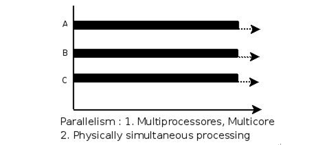
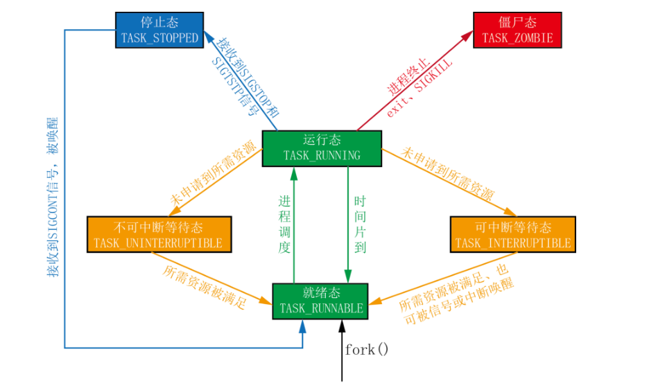
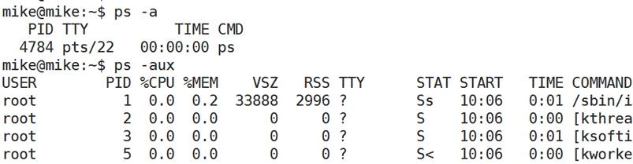
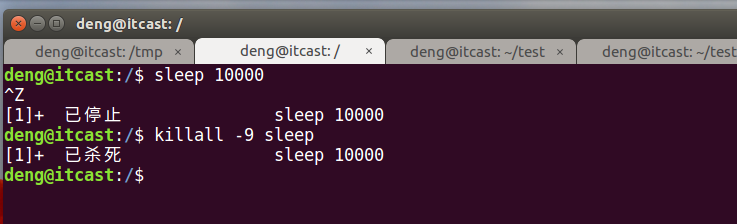
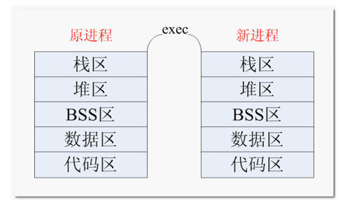

G:\BaiduNetdiskDownload\01-第一章 Linux系统编程视频

## 00. 目录

## 01. 学习目标

- 掌握目录遍历相关的函数使用
- 了解进程相关的概念
- 掌握fork/getpid/getppid函数的使用
- 熟练掌握ps/kill命令的使用
- 熟练掌握execl/execlp函数的使用
- 说出什么是孤儿进程和僵尸进程

 

## 02. 进程和程序 (理解)

我们平时写的 C 语言代码，通过编译器编译，最终它会成为一个可执行程序，当这个可执行程序运行起来后（没有结束之前），它就成为了一个**进程**。

程序是存放在存储介质上的一个可执行文件，而进程是程序执行的过程。进程的状态是变化的，其包括进程的创建、调度和消亡。程序是静态的，进程是动态的。

示例：

程序就类似于剧本(纸)，进程类似于戏(舞台、演员、灯光、道具...)，同一个剧本可以在多个舞台同时上演。同样，同一个程序也可以加载为不同的进程(彼此之间互不影响)。

在 Linux 系统中，操作系统是通过进程去完成一个一个的任务，**进程是管理事务的基本单元。**

进程拥有自己独立的**处理环境**（如：当前需要用到哪些环境变量，程序运行的目录在哪，当前是哪个用户在运行此程序等）和**系统资源**（如：处理器 CPU 占用率、存储器、I/O设备、数据、程序）。

我们可以这么理解，公司相当于操作系统，部门相当于进程，公司通过部门来管理（系统通过进程管理），对于各个部门，每个部门有各自的资源，如人员、电脑设备、打印机等。

 

## 03. 单道、多道程序设计(了解)

### 3.1 单道程序设计

所有进程一个一个排队执行。若A阻塞，B只能等待，即使CPU处于空闲状态。而在人机交互时阻塞的出现是必然的。所有这种模型在系统资源利用上及其不合理，在计算机发展历史上存在不久，大部分便被淘汰了。

### 3.2 多道程序设计

在计算机内存中同时存放几道相互独立的程序，它们在管理程序控制之下，相互穿插的运行。多道程序设计必须有硬件基础作为保证。

在计算机中**时钟中断**即为多道程序设计模型的理论基础。并发时，任意进程在执行期间都不希望放弃cpu。因此系统需要一种强制让进程让出cpu资源的手段。时钟中断有硬件基础作为保障，对进程而言不可抗拒。 操作系统中的中断处理函数，来负责调度程序执行。

在多道程序设计模型中，多个进程轮流使用CPU (分时复用CPU资源)。而当下常见CPU为纳秒级，1秒可以执行大约10亿条指令。由于人眼的反应速度是毫秒级，所以看似同时在运行。

> 1s = 1000ms
>
> 1ms = 1000us
>
> 1us = 1000ns
>
> 1s = 1000000000ns

 

## 04. 并行和并发(理解)

**并行(parallel)：**指在同一时刻，有多条指令在多个处理器上同时执行。




**并发(concurrency)：**指在同一时刻只能有一条指令执行，但多个进程指令被快速的轮换执行，使得在宏观上具有多个进程同时执行的效果，但在微观上并不是同时执行的，只是把时间分成若干段，使多个进程快速交替的执行。


 

举例说明：

- 并行是两个队列**同时**使用两台咖啡机
- 并发是两个队列**交替**使用一台咖啡机


## 05. MMU(了解)

MMU是Memory Management Unit的缩写，中文名是[内存管理](https://baike.baidu.com/item/内存管理)单元，它是[中央处理器](https://baike.baidu.com/item/中央处理器)（CPU）中用来管理[虚拟存储器](https://baike.baidu.com/item/虚拟存储器)、物理存储器的控制线路，同时也负责[虚拟地址](https://baike.baidu.com/item/虚拟地址)映射为[物理地址](https://baike.baidu.com/item/物理地址)，以及提供硬件机制的内存访问授权，多用户多进程操作系统。


 

## 06. 进程控制块PCB(了解)

进程运行时，内核为进程每个进程分配一个PCB（进程控制块），维护进程相关的信息，Linux内核的进程控制块是task_struct结构体。


在 /usr/src/linux-headers-xxx/include/linux/sched.h 文件中可以查看struct task_struct 结构体定义：

> deng@itcast:~/share$ vim /usr/src/linux-headers-4.10.0-28/include/linux/sched.h


 

其内部成员有很多，我们掌握以下部分即可：

- 进程id。系统中每个进程有唯一的id，在C语言中用pid_t类型表示，其实就是一个非负整数。
- 进程的状态，有就绪、运行、挂起、停止等状态。
- 进程切换时需要保存和恢复的一些CPU寄存器。
- 描述虚拟地址空间的信息。
- 描述控制终端的信息。
- 当前工作目录（Current Working Directory）。
- umask掩码。
- 文件描述符表，包含很多指向file结构体的指针。
- 和信号相关的信息。
- 用户id和组id。
- 会话（Session）和进程组。
- 进程可以使用的资源上限（Resource Limit）。

 

## 07. 进程的状态(重点)

进程状态反映进程执行过程的变化。这些状态随着进程的执行和外界条件的变化而转换。

在三态模型中，进程状态分为三个基本状态，即**运行态，就绪态，阻塞态**。

在五态模型中，进程分为**新建态、终止态，运行态，就绪态，阻塞态**。



**①TASK_RUNNING：**进程正在被CPU执行。当一个进程刚被创建时会处于TASK_RUNNABLE，表示己经准备就绪，正等待被调度。

　　**②TASK_INTERRUPTIBLE（可中断）：**进程正在睡眠（也就是说它被阻塞）等待某些条件的达成。一旦这些条件达成，内核就会把进程状态设置为运行。处于**此状态的进程也会因为接收到信号而提前被唤醒**，**比如给一个TASK_INTERRUPTIBLE状态的进程发送SIGKILL信号，这个进程将先被唤醒（进入TASK_RUNNABLE状态），然后再响应SIGKILL信号而退出**（变为TASK_ZOMBIE状态），并不会从TASK_INTERRUPTIBLE状态直接退出。

　　**③TASK_UNINTERRUPTIBLE（不可中断）：**处于等待中的进程，待资源满足时被唤醒，**但不可以由其它进程通过信号或中断唤醒**。由于不接受外来的任何信号，**因此无法用kill杀掉这些处于该状态的进程**。而**TASK_UNINTERRUPTIBLE状态存在的意义就在于**，**内核的某些处理流程是不能被打断的**。如果响应异步信号，程序的执行流程中就会被插入一段用于处理异步信号的流程，于是原有的流程就被中断了，这可能使某些设备陷入不可控的状态。处于TASK_UNINTERRUPTIBLE状态一般总是非常短暂的，通过ps命令基本上不可能捕捉到。

　　**④TASK_ZOMBIE（僵死）：**表示进程已经结束了，**但是其父进程还没有调用wait4或waitpid()来释放进程描述符**。为了父进程能够获知它的消息，子进程的进程描述符仍然被保留着。一旦父进程调用了wait4()，进程描述符就会被释放。

　　**⑤TASK_STOPPED（停止）：**进程停止执行。当进程接收到SIGSTOP，SIGTSTP，SIGTTIN，SIGTTOU等信号的时候。此外，**在调试期间接收到任何信号**，都会使进程进入这种状态。**当接收到SIGCONT信号，会重新回到TASK_RUNNABLE**。

如何查看进程状态：


 

stat中的参数意义如下：

| **参数** | **含义**                               |
| :------- | :------------------------------------- |
| D        | 不可中断 Uninterruptible（usually IO） |
| R        | 正在运行，或在队列中的进程             |
| S(大写)  | 处于休眠状态                           |
| T        | 停止或被追踪                           |
| Z        | 僵尸进程                               |
| W        | 进入内存交换（从内核2.6开始无效）      |
| X        | 死掉的进程                             |
| <        | 高优先级                               |
| N        | 低优先级                               |
| s        | 包含子进程                             |
| +        | 位于前台的进程组                       |

 

### 7.1 ps

进程是一个具有一定独立功能的程序，它是操作系统动态执行的基本单元。

ps命令可以查看进程的详细状况，常用选项(选项可以不加“-”)如下：

| **选项** | **含义**                                 |
| :------- | :--------------------------------------- |
| -a       | 显示终端上的所有进程，包括其他用户的进程 |
| -u       | 显示进程的详细状态                       |
| -x       | 显示没有控制终端的进程                   |
| -w       | 显示加宽，以便显示更多的信息             |
| -r       | 只显示正在运行的进程                     |

ps aux

ps ef

ps -a



### 20.2 top

top命令用来动态显示运行中的进程。top命令能够在运行后，在指定的时间间隔更新显示信息。可以在使用top命令时加上-d 来指定显示信息更新的时间间隔。


在top命令执行后，可以按下按键得到对显示的结果进行排序：

| **按键** | **含义**                           |
| :------- | :--------------------------------- |
| M        | 根据内存使用量来排序               |
| P        | 根据CPU占有率来排序                |
| T        | 根据进程运行时间的长短来排序       |
| U        | 可以根据后面输入的用户名来筛选进程 |
| K        | 可以根据后面输入的PID来杀死进程。  |
| q        | 退出                               |
| h        | 获得帮助                           |


 

### 20.3 kill

kill命令指定进程号的进程，需要配合 ps 使用。

使用格式：

kill [-signal] pid

信号值从0到15，其中9为绝对终止，可以处理一般信号无法终止的进程。


**kill 9133** ：9133 为应用程序所对应的进程号


有些进程不能直接杀死，这时候我们需要加一个参数“ -9 ”，“ -9 ” 代表强制结束：


 

### 20.4 killall

 

通过进程名字杀死进程



 

## 08. 进程号和相关函数

每个进程都由一个进程号来标识，其类型为 pid_t（整型），进程号的范围：0～32767。进程号总是唯一的，但进程号可以重用。当一个进程终止后，其进程号就可以再次使用。


 

接下来，再给大家介绍三个不同的进程号。

**进程号（PID）**：

标识进程的一个非负整型数。

**父进程号（PPID）**：

任何进程（ 除 init 进程）都是由另一个进程创建，该进程称为被创建进程的父进程，对应的进程号称为父进程号（PPID）。如，A 进程创建了 B 进程，A 的进程号就是 B 进程的父进程号。

**进程组号（PGID）**：

进程组是一个或多个进程的集合。他们之间相互关联，进程组可以接收同一终端的各种信号，关联的进程有一个进程组号（PGID） 。这个过程有点类似于 QQ 群，组相当于 QQ 群，各个进程相当于各个好友，把各个好友都拉入这个 QQ 群里，主要是方便管理，特别是通知某些事时，只要在群里吼一声，所有人都收到，简单粗暴。但是，这个进程组号和 QQ 群号是有点区别的，默认的情况下，当前的进程号会当做当前的进程组号。

### 8.1 getpid函数

```c
#include <sys/types.h>
#include <unistd.h>
​
pid_t getpid(void);
功能：
    获取本进程号（PID）
参数：
    无
返回值：
    本进程号
```

 

### 8.2 getppid函数

```c
#include <sys/types.h>
#include <unistd.h>

pid_t getppid(void);
功能：
    获取调用此函数的进程的父进程号（PPID）
参数：
    无
返回值：
    调用此函数的进程的父进程号（PPID）
```


### 8.3 getpgid函数

```
#include <sys/types.h>
#include <unistd.h>

pid_t getpgid(pid_t pid);
功能：
    获取进程组号（PGID）
参数：
    pid：进程号
返回值：
    参数为 0 时返回当前进程组号，否则返回参数指定的进程的进程组号
```

示例程序:

```
int main()
{
    pid_t pid, ppid, pgid;

    pid = getpid();
    printf("pid = %d\n", pid);

    ppid = getppid();
    printf("ppid = %d\n", ppid);

    pgid = getpgid(pid);
    printf("pgid = %d\n", pgid);

    return 0;
}
```


## 09. 进程的创建（重点）

系统允许一个进程创建新进程，新进程即为子进程，子进程还可以创建新的子进程，形成进程树结构模型。

```
#include <sys/types.h>
#include <unistd.h>
​
pid_t fork(void);
功能：
    用于从一个已存在的进程中创建一个新进程，新进程称为子进程，原进程称为父进程。
参数：
    无
返回值：
    成功：子进程中返回 0，父进程中返回子进程 ID。pid_t，为整型。
    失败：返回-1。
    失败的两个主要原因是：
        1）当前的进程数已经达到了系统规定的上限，这时 errno 的值被设置为 EAGAIN。
        2）系统内存不足，这时 errno 的值被设置为 ENOMEM。
```

**示例代码：**

```
int main()
{
    fork();
    printf("id ==== %d\n", getpid());   // 获取进程号  

    return 0;
}
```

**运行结果如下：**


从运行结果，我们可以看出，fork() 之后的打印函数打印了两次，而且打印了两个进程号，这说明，fork() 之后确实创建了一个新的进程，新进程为子进程，原来的进程为父进程。

 

## 10. 父子进程关系

使用 fork() 函数得到的子进程是父进程的一个复制品，它从父进程处继承了整个进程的地址空间：包括进程上下文（进程执行活动全过程的静态描述）、进程堆栈、打开的文件描述符、信号控制设定、进程优先级、进程组号等。

子进程所独有的只有它的进程号，计时器等（只有小量信息）。因此，使用 fork() 函数的代价是很大的。


简单来说， 一个进程调用 fork() 函数后，系统先给新的进程分配资源，例如存储数据和代码的空间。然后把原来的进程的所有值都复制到新的新进程中，只有少数值与原来的进程的值不同。相当于克隆了一个自己。

实际上，更准确来说，Linux 的 fork() 使用是通过写时拷贝 (copy- on-write) 实现。写时拷贝是一种可以推迟甚至避免拷贝数据的技术。内核此时并不复制整个进程的地址空间，而是让父子进程共享同一个地址空间。只用在需要写入的时候才会复制地址空间，从而使各个进行拥有各自的地址空间。也就是说，资源的复制是在需要写入的时候才会进行，在此之前，只有以只读方式共享。

注意：fork之后父子进程共享文件，fork产生的子进程与父进程相同的文件文件描述符指向相同的文件表，引用计数增加，共享文件文件偏移指针。

 

## 11. 区分父子进程

子进程是父进程的一个复制品，可以简单认为父子进程的代码一样的。那大家想过没有，这样的话，父进程做了什么事情，子进程也做什么事情（如上面的例子），是不是不能实现满足我们实现多任务的要求呀，那我们是不是要想个办法区别父子进程呀，这就通过 fork() 的返回值。

fork() 函数被调用一次，但返回两次。两次返回的区别是：子进程的返回值是 0，而父进程的返回值则是新子进程的进程 ID。

 

**测试程序：**

```
int main()
{
    pid_t pid;
    pid = fork();
    if (pid < 0)
    {   // 没有创建成功  
        perror("fork");
        return 0;
    }
​
    if (0 == pid)
    { // 子进程  
        while (1)
        {
            printf("I am son\n");
            sleep(1);
        }
    }
    else if (pid > 0)
    { // 父进程  
        while (1)
        {
            printf("I am father\n");
            sleep(1);
        }
    }
​
    return 0;
}
```

运行结果如下：

 

通过运行结果，可以看到，父子进程各做一件事（各自打印一句话）。这里，我们只是看到只有一份代码，实际上，fork() 以后，有两个地址空间在独立运行着，有点类似于有两个独立的程序（父子进程）在运行着。

一般来说，在 fork() 之后是父进程先执行还是子进程先执行是不确定的。这取决于内核所使用的调度算法。

需要注意的是，在子进程的地址空间里，子进程是从 fork() 这个函数后才开始执行代码。


 

## 12. 父子进程地址空间

父子进程各自的地址空间是独立的

```

int a = 10;     // 全局变量
​
int main()
{
    int b = 20; //局部变量
    pid_t pid;
    pid = fork();
    if (pid < 0)
    {   // 没有创建成功
        perror("fork");
    }
​
    if (0 == pid)
    { // 子进程
        a = 111;
        b = 222;    // 子进程修改其值
        printf("son: a = %d, b = %d\n", a, b);
    }
    else if (pid > 0)
    { // 父进程
        sleep(1);   // 保证子进程先运行
        printf("father: a = %d, b = %d\n", a, b);
    }
​
    return 0;
}
```

运行结果如下：

 

通过得知，在子进程修改变量 a，b 的值，并不影响到父进程 a，b 的值。

 

## 13. 进程相关命令

### 13.1 ps命令

ps命令可以查看进程的详细状况，常用选项(选项可以不加“-”)如下：

| **选项** | **含义**                                 |
| :------- | :--------------------------------------- |
| -a       | 显示终端上的所有进程，包括其他用户的进程 |
| -u       | 显示进程的详细状态                       |
| -x       | 显示没有控制终端的进程                   |
| -j       | 列出与作业控制相关的信息                 |

显示当前用户下所有进程：**ps aux**


 

以比较完整的格式显示所有的进程：ps ajx


 

### 13.2 kill命令

命令功能: 发送指定的信号到相应进程。

**kill 9133**：9133 为应用程序所对应的进程号


 

查看信号编号: kill -l(字母)


有些进程不能直接杀死，这时候我们需要加一个参数“-9”，使用9号信号SIGKILL

杀死进程: kill -SIGKILL/(-9) 89899【进程标识号】

 

## 14. GDB调试多进程

使用gdb调试的时候，gdb只能跟踪一个进程。可以在fork函数调用之前，通过指令设置gdb调试工具跟踪父进程或者是跟踪子进程。默认跟踪父进程。

- set follow-fork-mode child 设置gdb在fork之后跟踪子进程。
- set follow-fork-mode parent 设置跟踪父进程（默认）。

注意，一定要在fork函数调用之前设置才有效。

 

## 15. 进程退出函数

相关函数：

```
#include <stdlib.h>
void exit(int status);
​
#include <unistd.h>
void _exit(int status);
功能：
    结束调用此函数的进程。
参数：
    status：返回给父进程的参数（低 8 位有效），至于这个参数是多少根据需要来填写。
返回值：
    无
```

exit() 和 *exit() 函数功能和用法是一样的，无非时所包含的头文件不一样，还有的区别就是：exit()属于标准库函数，*exit()属于系统调用函数。


 

## 16. 等待子进程退出函数

### 16.1 概述

在每个进程退出的时候，内核释放该进程所有的资源、包括打开的文件、占用的内存等。但是仍然为其保留一定的信息，这些信息主要主要指进程控制块PCB的信息（包括进程号、退出状态、运行时间等）。

父进程可以通过调用wait或waitpid得到它的退出状态同时彻底清除掉这个进程。

wait() 和 waitpid() 函数的功能一样，区别在于，wait() 函数会阻塞，waitpid() 可以设置不阻塞，waitpid() 还可以指定等待哪个子进程结束。

注意：一次wait或waitpid调用只能清理一个子进程，清理多个子进程应使用循环。

### 16.2 wait函数

函数说明：

```
#include <sys/types.h>
#include <sys/wait.h>
​
pid_t wait(int *status);
功能：
    等待任意一个子进程结束，如果任意一个子进程结束了，此函数会回收该子进程的资源。
参数：
    status : 进程退出时的状态信息。
返回值：
    成功：已经结束子进程的进程号
    失败： -1
```


调用 wait() 函数的进程会挂起（阻塞），直到它的一个子进程退出或收到一个不能被忽视的信号时才被唤醒（相当于继续往下执行）。

若调用进程没有子进程，该函数立即返回；若它的子进程已经结束，该函数同样会立即返回，并且会回收那个早已结束进程的资源。

所以，wait()函数的主要功能为回收已经结束子进程的资源。

如果参数 status 的值不是 NULL，wait() 就会把子进程退出时的状态取出并存入其中，这是一个整数值（int），指出了子进程是正常退出还是被非正常结束的。

这个退出信息在一个 int 中包含了多个字段，直接使用这个值是没有意义的，我们需要用宏定义取出其中的每个字段。

 

**宏函数可分为如下三组：**

\1) WIFEXITED(status)

为非0 → 进程正常结束

WEXITSTATUS(status)

如上宏为真，使用此宏 → 获取进程退出状态 (exit的参数)

\2) WIFSIGNALED(status)

为非0 → 进程异常终止

WTERMSIG(status)

如上宏为真，使用此宏 → 取得使进程终止的那个信号的编号。

\3) WIFSTOPPED(status)

为非0 → 进程处于暂停状态

WSTOPSIG(status)

如上宏为真，使用此宏 → 取得使进程暂停的那个信号的编号。

WIFCONTINUED(status)

为真 → 进程暂停后已经继续运行

 

### 16.3 waitpid函数

函数说明：

```
#include <sys/types.h>
#include <sys/wait.h>
​
pid_t waitpid(pid_t pid, int *status, int options);
功能：
    等待子进程终止，如果子进程终止了，此函数会回收子进程的资源。
​
参数：
    pid : 参数 pid 的值有以下几种类型：
      pid > 0  等待进程 ID 等于 pid 的子进程。
      pid = 0  等待同一个进程组中的任何子进程，如果子进程已经加入了别的进程组，waitpid 不会等待它。
      pid = -1 等待任一子进程，此时 waitpid 和 wait 作用一样。
      pid < -1 等待指定进程组中的任何子进程，这个进程组的 ID 等于 pid 的绝对值。
​
    status : 进程退出时的状态信息。和 wait() 用法一样。
​
    options : options 提供了一些额外的选项来控制 waitpid()。
            0：同 wait()，阻塞父进程，等待子进程退出。
            WNOHANG：没有任何已经结束的子进程，则立即返回。
            WUNTRACED：如果子进程暂停了则此函数马上返回，并且不予以理会子进程的结束状态。（由于涉及到一些跟踪调试方面的知识，加之极少用到）
                 
返回值：
    waitpid() 的返回值比 wait() 稍微复杂一些，一共有 3 种情况：
        1) 当正常返回的时候，waitpid() 返回收集到的已经回收子进程的进程号；
        2) 如果设置了选项 WNOHANG，而调用中 waitpid() 发现没有已退出的子进程可等待，则返回 0；
        3) 如果调用中出错，则返回-1，这时 errno 会被设置成相应的值以指示错误所在，如：当 pid 所对应的子进程不存在，或此进程存在，但不是调用进程的子进程，waitpid() 就会出错返回，这时 errno 被设置为 ECHILD；
​
```


## 17. 孤儿进程

父进程运行结束，但子进程还在运行（未运行结束）的子进程就称为孤儿进程（Orphan Process）。

每当出现一个孤儿进程的时候，内核就把孤儿进程的父进程设置为 init ，而 init 进程会循环地 wait() 它的已经退出的子进程。这样，当一个孤儿进程凄凉地结束了其生命周期的时候，init 进程就会代表党和政府出面处理它的一切善后工作。

因此孤儿进程并不会有什么危害。

 

## 18. 僵尸进程

进程终止，父进程尚未回收，子进程残留资源（PCB）存放于内核中，变成僵尸（Zombie）进程。

这样就会导致一个问题，如果进程不调用wait() 或 waitpid() 的话， 那么保留的那段信息就不会释放，其进程号就会一直被占用，但是系统所能使用的进程号是有限的，如果大量的产生僵尸进程，将因为没有可用的进程号而导致系统不能产生新的进程，此即为僵尸进程的危害，应当避免。

 

## 19. 进程替换

**概述**

在 Windows 平台下，我们可以通过双击运行可执行程序，让这个可执行程序成为一个进程；而在 Linux 平台，我们可以通过 ./ 运行，让一个可执行程序成为一个进程。

但是，如果我们本来就运行着一个程序（进程），我们如何在这个进程内部启动一个外部程序，由内核将这个外部程序读入内存，使其执行起来成为一个进程呢？这里我们通过 exec 函数族实现。

exec 函数族，顾名思义，就是一簇函数，在 Linux 中，并不存在 exec() 函数，exec 指的是一组函数，一共有 6 个：

```

#include <unistd.h>
extern char **environ;
​
int execl(const char *path, const char *arg, .../* (char  *) NULL */);
int execlp(const char *file, const char *arg, ... /* (char  *) NULL */);
int execle(const char *path, const char *arg, .../*, (char *) NULL, char * const envp[] */);
int execv(const char *path, char *const argv[]);
int execvp(const char *file, char *const argv[]);
int execvpe(const char *file, char *const argv[], char *const envp[]);
​
int execve(const char *filename, char *const argv[], char *const envp[]);
```

其中只有 execve() 是真正意义上的系统调用，其它都是在此基础上经过包装的库函数。

exec 函数族的作用是根据指定的文件名或目录名找到可执行文件，并用它来取代调用进程的内容，换句话说，就是在调用进程内部执行一个可执行文件。

进程调用一种 exec 函数时，该进程完全由新程序替换，而新程序则从其 main 函数开始执行。因为调用 exec 并不创建新进程，所以前后的进程 ID （当然还有父进程号、进程组号、当前工作目录……）并未改变。exec 只是用另一个新程序替换了当前进程的正文、数据、堆和栈段（进程替换）。



 

**exec 函数族使用说明**

exec 函数族的 6 个函数看起来似乎很复杂，但实际上无论是作用还是用法都非常相似，只有很微小的差别。


补充说明：

| l(list)        | 参数地址列表，以空指针结尾               |
| :------------- | :--------------------------------------- |
| v(vector)      | 存有各参数地址的指针数组的地址           |
| p(path)        | 按 PATH 环境变量指定的目录搜索可执行文件 |
| e(environment) | 存有环境变量字符串地址的指针数组的地址   |

exec 函数族与一般的函数不同，exec 函数族中的函数执行成功后不会返回，而且，exec 函数族下面的代码执行不到。只有调用失败了，它们才会返回 -1，失败后从原程序的调用点接着往下执行。

 

 

## 20. 源码包安装(扩展)

**第一步**：生成Makefile和检测当前环境

> deng@itcast:~/tools/valgrind-3.13.0 sudo ./configure

 

**第二步:** 编译源码 生成可执行文件

> deng@itcast:~/tools/valgrind-3.13.0$ sudo make -j4

 

**第三步：** 安装

> deng@itcast:~/tools/valgrind-3.13.0$ sudo make install

 

**第四步：**测试

> deng@itcast:~/tools/valgrind-3.13.0$ valgrind valgrind: no program specified valgrind: Use --help for more information.

 

## 21. 作业

**1）编写测试程序,测试fork之前打开文件，父子进程之间是否共享文件**

提示：

- 子进程write
- 父进程read


**2）多进程编程**

父进程fork三个子进程：

- 一个调用ps命令
- 一个调用自定义应用程序
- 一个调用会出现段错误的程序

父进程回收三个子进程(waitpid)，并且打印三个子进程的退出状态

**3) 文件操作**

统计出指定目录中普通文件的个数.(递归)

 

## 22. 总结

 

 