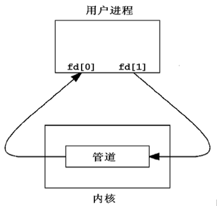
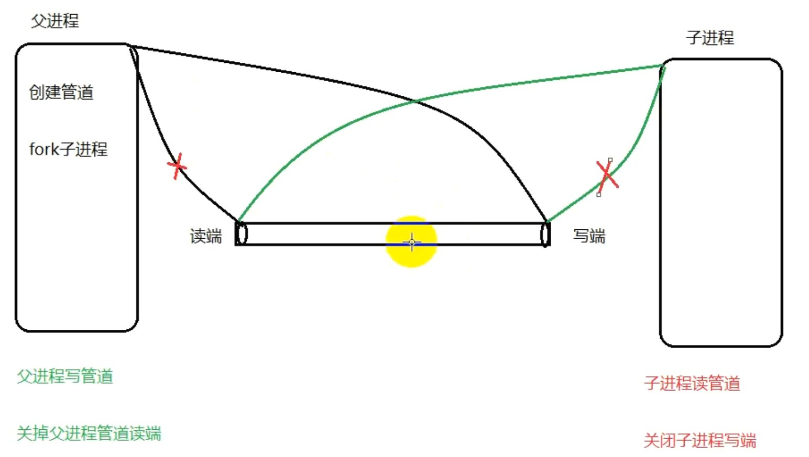
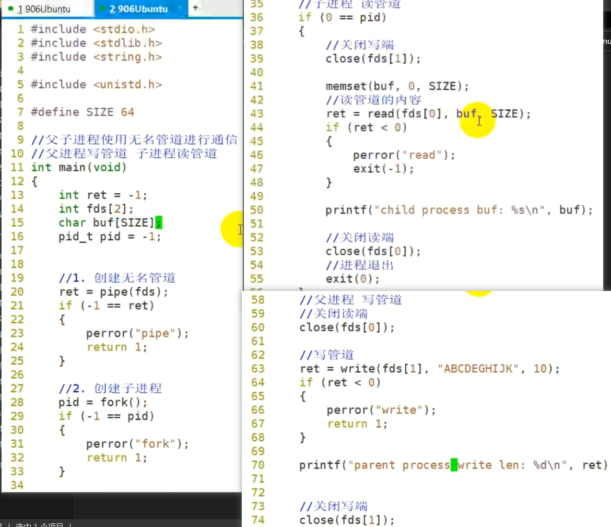
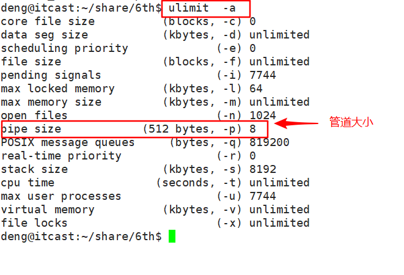
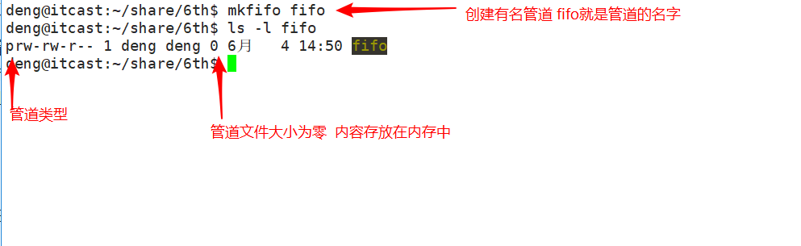
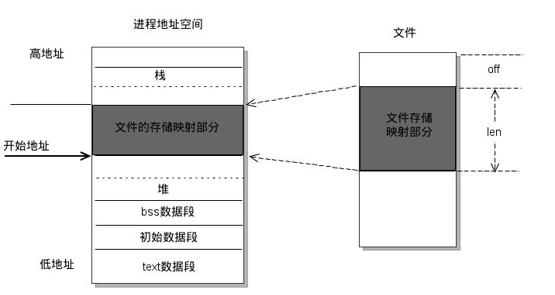

## 00. 目录

[00. 目录](#header-n0)[01. 学习目标](#header-n3)[02. 进程间通讯概念](#header-n24)[03.无名管道](#header-n39)[3.1 概述](#header-n40)[3.2 pipe函数](#header-n54)[3.3 管道的读写特点](#header-n59)[3.4 设置为非阻塞的方法](#header-n77)[3.5 查看管道缓冲区命令](#header-n82)[3.6 查看管道缓冲区函数](#header-n86)[04. 有名管道](#header-n92)[4.1 概述](#header-n93)[4.2 通过命令创建有名管道](#header-n101)[4.3 通过函数创建有名管道](#header-n103)[4.4 有名管道读写操作](#header-n106)[4.5 有名管道注意事项](#header-n111)[05. 共享存储映射](#header-n126)[5.1 概述](#header-n127)[5.2 存储映射函数](#header-n132)[5.3 注意事项](#header-n145)[5.4 共享映射的方式操作文件](#header-n154)[5.5 共享映射实现父子进程通信](#header-n158)[5.6 匿名映射实现父子进程通信](#header-n162)[06. 作业](#header-n176)[07. 总结](#header-n197)

## 01. 学习目标

- 熟练掌握execl/execlp函数的使用
- 说出什么是孤儿进程和僵尸进程
- 说出并理解管道的读写行为
- 熟练使用pipe进行父子进程间通信
- 熟练使用pipe进行兄弟进程间通信
- 熟练使用fifo进行无血缘关系的进程间通信
- 熟练掌握mmap函数的使用
- 使用mmap进行有血缘关系的进程间通信
- 使用mmap进行无血缘关系的进程间通信

 

## 02. 进程间通讯概念

进程是一个独立的资源分配单元，不同进程（这里所说的进程通常指的是用户进程）之间的资源是独立的，没有关联，不能在一个进程中直接访问另一个进程的资源。

但是，进程不是孤立的，不同的进程需要进行信息的交互和状态的传递等，因此需要进程间通信( IPC：Inter Processes Communication )。

进程间通信的目的：

- 数据传输：一个进程需要将它的数据发送给另一个进程。
- 通知事件：一个进程需要向另一个或一组进程发送消息，通知它（它们）发生了某种事件（如进程终止时要通知父进程）。
- 资源共享：多个进程之间共享同样的资源。为了做到这一点，需要内核提供互斥和同步机制。
- 进程控制：有些进程希望完全控制另一个进程的执行（如 Debug 进程），此时控制进程希望能够拦截另一个进程的所有陷入和异常，并能够及时知道它的状态改变。

**Linux 操作系统支持的主要进程间通信的通信机制：**


## 03.无名管道

### 3.1 概述

**管道也叫无名管道**，它是是 UNIX 系统 IPC（进程间通信） 的最古老形式，所有的 UNIX 系统都支持这种通信机制。

**管道有如下特点：**

1) 半双工，数据在同一时刻只能在一个方向上流动。

2) 数据只能从管道的一端写入，从另一端读出。

3) 写入管道中的数据遵循先入先出的规则。

4) 管道所传送的数据是无格式的，这要求管道的读出方与写入方必须事先约定好数据的格式，如多少字节算一个消息等。

5) 管道不是普通的文件，不属于某个文件系统，其只存在于**内存**中。

6) 管道在内存中对应一个缓冲区。不同的系统其大小不一定相同。

7) 从管道读数据是`一次性`操作，数据一旦被读走，它就从管道中被抛弃，释放空间以便写更多的数据。

8) 管道没有名字，只能在具有公共祖先的进程（父进程与子进程，或者两个兄弟进程，具有亲缘关系）之间使用。

对于管道特点的理解，我们可以类比现实生活中管子，管子的一端塞东西，管子的另一端取东西。

管道是一种特殊类型的文件，在应用层体现为两个打开的文件描述符。



### 3.2 pipe函数

```
#include <unistd.h>
​
int pipe(int pipefd[2]);
功能：创建无名管道。
​
参数：
    pipefd : 为 int 型数组的首地址，其存放了管道的文件描述符 pipefd[0]、pipefd[1]。
    
    当一个管道建立时，它会创建两个文件描述符 fd[0] 和 fd[1]。其中 fd[0] 固定用于读管道，而 fd[1] 固定用于写管道。一般文件 I/O的函数都可以用来操作管道(lseek() 除外)。
​
返回值：
    成功：0
    失败：-1
```

下面我们写这个一个例子，子进程通过无名管道给父进程传递一个字符串数据：

```
int main()
{
    int fd_pipe[2] = { 0 };
    pid_t pid;
​
    if (pipe(fd_pipe) < 0)
    {// 创建管道
        perror("pipe");
    }
​
    pid = fork(); // 创建进程
    if (pid == 0)
    { // 子进程
        char buf[] = "I am mike";
        // 往管道写端写数据
        write(fd_pipe[1], buf, strlen(buf));
​
        _exit(0);
    }
    else if (pid > 0)
    {// 父进程
        wait(NULL); // 等待子进程结束，回收其资源
        char str[50] = { 0 };
​
        // 从管道里读数据
        read(fd_pipe[0], str, sizeof(str));
​
        printf("str=[%s]\n", str); // 打印数据
    }
​
    return 0;
}
```

子进程是父进程的拷贝， 父进程fork之后有一个子进程

父进程写管道，子进程读



创建无名管道一定要在子进程之前

这里父进程先执行，所以子进程能读到东西

如果子进程先执行，先阻塞，因为管道阻塞的属性




### 3.3 管道的读写特点

使用管道需要注意以下4种特殊情况（假设都是阻塞I/O操作，没有设置O_NONBLOCK标志）：

1) 如果所有指向管道写端的文件描述符都关闭了（管道写端引用计数为0），而仍然有进程从管道的读端读数据，那么管道中剩余的数据都被读取后，再次read会返回0，就像读到文件末尾一样。

2) 如果有指向管道写端的文件描述符没关闭（管道写端引用计数大于0），而持有管道写端的进程也没有向管道中写数据，这时有进程从管道读端读数据，那么管道中剩余的数据都被读取后，再次read会阻塞，直到管道中有数据可读了才读取数据并返回。

3) 如果所有指向管道读端的文件描述符都关闭了（管道读端引用计数为0），这时有进程向管道的写端write，那么该进程会收到信号SIGPIPE，通常会导致进程异常终止。当然也可以对SIGPIPE信号实施捕捉，不终止进程。具体方法信号章节详细介绍。

4) 如果有指向管道读端的文件描述符没关闭（管道读端引用计数大于0），而持有管道读端的进程也没有从管道中读数据，这时有进程向管道写端写数据，那么在管道被写满时再次write会阻塞，直到管道中有空位置了才写入数据并返回。

**总结：**

**读管道：**

Ø 管道中有数据，read返回实际读到的字节数。

Ø 管道中无数据：

u 管道写端被全部关闭，read返回0 (相当于读到文件结尾)

u 写端没有全部被关闭，read阻塞等待(不久的将来可能有数据递达，此时会让出cpu)

**写管道：**

Ø 管道读端全部被关闭， 进程异常终止(也可使用捕捉SIGPIPE信号，使进程终止)

Ø 管道读端没有全部关闭：

u 管道已满，write阻塞。

u 管道未满，write将数据写入，并返回实际写入的字节数。

 

### 3.4 设置为非阻塞的方法

设置方法：

```
//获取原来的flags
int flags = fcntl(fd[0], F_GETFL);
// 设置新的flags
flag |= O_NONBLOCK;
// flags = flags | O_NONBLOCK;
fcntl(fd[0], F_SETFL, flags);
```

结论： 如果写端没有关闭，读端设置为非阻塞， 如果没有数据，直接返回-1。


### 3.5 查看管道缓冲区命令

可以使用ulimit -a 命令来查看当前系统中创建管道文件所对应的内核缓冲区大小。



### 3.6 查看管道缓冲区函数

```
#include <unistd.h>
​
long fpathconf(int fd, int name);
功能：该函数可以通过name参数查看不同的属性值
参数：
    fd：文件描述符
    name：
        _PC_PIPE_BUF，查看管道缓冲区大小
        _PC_NAME_MAX，文件名字字节数的上限
返回值：
    成功：根据name返回的值的意义也不同。
    失败： -1
```

 

示例：

```
int main()
{
    int fd[2];
    int ret = pipe(fd);
    if (ret == -1)
    {
        perror("pipe error");
        exit(1);
    }
​
    long num = fpathconf(fd[0], _PC_PIPE_BUF);
    printf("num = %ld\n", num);
​
    return 0;
}
```


## 04. 有名管道

### 4.1 概述

管道，由于没有名字，只能用于亲缘关系的进程间通信。为了克服这个缺点，提出了命名管道（FIFO），也叫有名管道、FIFO文件。

命名管道（FIFO）不同于无名管道之处在于它提供了一个路径名与之关联，以 FIFO 的文件形式存在于文件系统中，这样，即使与 FIFO 的创建进程不存在亲缘关系的进程，只要可以访问该路径，就能够彼此通过 FIFO 相互通信，因此，通过 FIFO 不相关的进程也能交换数据。

 

命名管道（FIFO)和无名管道（pipe）有一些特点是相同的，不一样的地方在于：

1) FIFO 在文件系统中作为一个特殊的文件而存在，但 FIFO 中的内容却存放在**内存**中。

2) 当使用 FIFO 的进程退出后，FIFO 文件将继续保存在文件系统中以便以后使用。

3) FIFO 有名字，不相关的进程可以通过打开命名管道进行通信。

### 4.2 通过命令创建有名管道



### 4.3 通过函数创建有名管道

```
#include <sys/types.h>
#include <sys/stat.h>
​
int mkfifo(const char *pathname, mode_t mode);
功能：
    命名管道的创建。
参数：
    pathname : 普通的路径名，也就是创建后 FIFO 的名字。
    mode : 文件的权限，与打开普通文件的 open() 函数中的 mode 参数相同。(0666)
返回值：
    成功：0   状态码
    失败：如果文件已经存在，则会出错且返回 -1。
 
```


### 4.4 有名管道读写操作

一旦使用mkfifo创建了一个FIFO，就可以使用open打开它，常见的文件I/O函数都可用于fifo。如：close、read、write、unlink等。

FIFO严格遵循先进先出（first in first out），对管道及FIFO的读总是从开始处返回数据，对它们的写则把数据添加到末尾。**它们不支持诸如lseek()等文件定位操作。**

```
//进行1，写操作
int fd = open("my_fifo", O_WRONLY);  
​
char send[100] = "Hello Mike";
write(fd, send, strlen(send));
​
//进程2，读操作
int fd = open("my_fifo", O_RDONLY);//等着只写  
​
char recv[100] = { 0 };
//读数据，命名管道没数据时会阻塞，有数据时就取出来  
read(fd, recv, sizeof(recv));
printf("read from my_fifo buf=[%s]\n", recv);
```


### 4.5 有名管道注意事项

1) 一个为只读而打开一个管道的进程会阻塞直到另外一个进程为只写打开该管道

2）一个为只写而打开一个管道的进程会阻塞直到另外一个进程为只读打开该管道

 

**读管道：**

Ø 管道中有数据，read返回实际读到的字节数。

Ø 管道中无数据：

u 管道写端被全部关闭，read返回0 (相当于读到文件结尾)

u 写端没有全部被关闭，read阻塞等待

**写管道：**

Ø 管道读端全部被关闭， 进程异常终止(也可使用捕捉SIGPIPE信号，使进程终止)

Ø 管道读端没有全部关闭：

u 管道已满，write阻塞。

u 管道未满，write将数据写入，并返回实际写入的字节数。

 

## 05. 共享存储映射

### 5.1 概述

存储映射I/O (Memory-mapped I/O) 使一个磁盘文件与存储空间中的一个缓冲区相映射。



于是当从缓冲区中取数据，就相当于读文件中的相应字节。于此类似，将数据存入缓冲区，则相应的字节就自动写入文件。这样，就可在不适用read和write函数的情况下，使用地址（指针）完成I/O操作。

共享内存可以说是最有用的进程间通信方式，也是最快的IPC形式, 因为进程可以直接读写内存，而不需要任何数据的拷贝。

### 5.2 存储映射函数

(1) mmap函数

```

#include <sys/mman.h>
​
void *mmap(void *addr, size_t length, int prot, int flags, int fd, off_t offset);
功能:
    一个文件或者其它对象映射进内存
参数：
    addr :  指定映射的起始地址, 通常设为NULL, 由系统指定
    length：映射到内存的文件长度
    prot：  映射区的保护方式, 最常用的 :
        a) 读：PROT_READ
        b) 写：PROT_WRITE
        c) 读写：PROT_READ | PROT_WRITE
    flags：  映射区的特性, 可以是
        a) MAP_SHARED : 写入映射区的数据会复制回文件, 且允许其他映射该文件的进程共享。
        b) MAP_PRIVATE : 对映射区的写入操作会产生一个映射区的复制(copy - on - write), 对此区域所做的修改不会写回原文件。
    fd：由open返回的文件描述符, 代表要映射的文件。
    offset：以文件开始处的偏移量, 必须是4k的整数倍, 通常为0, 表示从文件头开始映射
返回值：
    成功：返回创建的映射区首地址
    失败：MAP_FAILED宏
```

**关于mmap函数的使用总结：**

1) 第一个参数写成NULL

2) 第二个参数要映射的文件大小 > 0

3) 第三个参数：PROT_READ 、PROT_WRITE

4) 第四个参数：MAP_SHARED 或者 MAP_PRIVATE

5) 第五个参数：打开的文件对应的文件描述符

6) 第六个参数：4k的整数倍，通常为0

 

(2) munmap函数

```

#include <sys/mman.h>
​
int munmap(void *addr, size_t length);
功能：
    释放内存映射区
参数：
    addr：使用mmap函数创建的映射区的首地址
    length：映射区的大小
返回值：
    成功：0
    失败：-1
```


### 5.3 注意事项

1) 创建映射区的过程中，隐含着一次对映射文件的读操作。

2) 当MAP_SHARED时，要求：映射区的权限应 <=文件打开的权限(出于对映射区的保护)。而MAP_PRIVATE则无所谓，因为mmap中的权限是对内存的限制。

3) 映射区的释放与文件关闭无关。只要映射建立成功，文件可以立即关闭。

4) 特别注意，当映射文件大小为0时，不能创建映射区。所以，用于映射的文件必须要有实际大小。mmap使用时常常会出现总线错误，通常是由于共享文件存储空间大小引起的。

5) munmap传入的地址一定是mmap的返回地址。坚决杜绝指针++操作。

6) 如果文件偏移量必须为4K的整数倍。

7) mmap创建映射区出错概率非常高，一定要检查返回值，确保映射区建立成功再进行后续操作。

 

### 5.4 共享映射的方式操作文件

参考示例：

```
int fd = open("xxx.txt", O_RDWR); //读写文件
    int len = lseek(fd, 0, SEEK_END);   //获取文件大小
​
    //一个文件映射到内存，ptr指向此内存
    void * ptr = mmap(NULL, len, PROT_READ | PROT_WRITE, MAP_SHARED, fd, 0);
    if (ptr == MAP_FAILED)
    {
        perror("mmap error");
        exit(1);
    }
​
    close(fd); //关闭文件
​
    char buf[4096];
    printf("buf = %s\n", (char*)ptr); // 从内存中读数据，等价于从文件中读取内容
​
    strcpy((char*)ptr, "this is a test");//写内容
​
    int ret = munmap(ptr, len);
    if (ret == -1)
    {
        perror("munmap error");
        exit(1);
    }
```


### 5.5 共享映射实现父子进程通信

参考示例：

```
int fd = open("xxx.txt", O_RDWR);// 打开一个文件
    int len = lseek(fd, 0, SEEK_END);//获取文件大小
​
    // 创建内存映射区
    void *ptr = mmap(NULL, len, PROT_READ | PROT_WRITE, MAP_SHARED, fd, 0);
    if (ptr == MAP_FAILED)
    {
        perror("mmap error");
        exit(1);
    }
    close(fd); //关闭文件
​
    // 创建子进程
    pid_t pid = fork();
    if (pid == 0) //子进程
    {
        sleep(1); //演示，保证父进程先执行
​
        // 读数据
        printf("%s\n", (char*)ptr);
    }
    else if (pid > 0) //父进程
    {
        // 写数据
        strcpy((char*)ptr, "i am u father!!");
​
        // 回收子进程资源
        wait(NULL);
    }
​
    // 释放内存映射区
    int ret = munmap(ptr, len);
    if (ret == -1)
    {
        perror("munmap error");
        exit(1);
    }
```

 

### 5.6 匿名映射实现父子进程通信

通过使用我们发现，使用映射区来完成文件读写操作十分方便，父子进程间通信也较容易。但缺陷是，每次创建映射区一定要依赖一个文件才能实现。

通常为了建立映射区要open一个temp文件，创建好了再unlink、close掉，比较麻烦。 可以直接使用匿名映射来代替。

其实Linux系统给我们提供了创建匿名映射区的方法，无需依赖一个文件即可创建映射区。同样需要借助标志位参数flags来指定。

使用**MAP_ANONYMOUS (或MAP_ANON)**。

```
int *p = mmap(NULL, 4, PROT_READ|PROT_WRITE, MAP_SHARED|MAP_ANONYMOUS, -1, 0);
```

- 4"随意举例，该位置表示映射区大小，可依实际需要填写。
- MAP_ANONYMOUS和MAP_ANON这两个宏是Linux操作系统特有的宏。在类Unix系统中如无该宏定义，可使用如下两步来完成匿名映射区的建立。

程序示例：

```
// 创建匿名内存映射区
    int len = 4096;
    void *ptr = mmap(NULL, len, PROT_READ | PROT_WRITE, MAP_SHARED | MAP_ANON, -1, 0);
    if (ptr == MAP_FAILED)
    {
        perror("mmap error");
        exit(1);
    }
​
    // 创建子进程
    pid_t pid = fork();
    if (pid > 0) //父进程
    {
        // 写数据
        strcpy((char*)ptr, "hello mike!!");
        // 回收
        wait(NULL);
    }
    else if (pid == 0)//子进程
    {
        sleep(1);
        // 读数据
        printf("%s\n", (char*)ptr);
    }
​
    // 释放内存映射区
    int ret = munmap(ptr, len);
    if (ret == -1)
    {
        perror("munmap error");
        exit(1);
    }
```

 

## 06. 作业

**6.1 使用多进程的方式改写聊天程序(有名管道)**

16mkfifo_room

**6.2 思考使用存储映射实现不同进程之间通信**

mmap munmap

 

**2）多进程编程**

父进程fork三个子进程：

- 一个调用ps命令
- 一个调用自定义应用程序
- 一个调用会出现段错误的程序

父进程回收三个子进程(waitpid)，并且打印三个子进程的退出状态

 

 

练习:

创建一个子进程, 子进程执行ls -l /home命令, 父进程等待子进程结束.(15min)

 

## 07. 总结

 