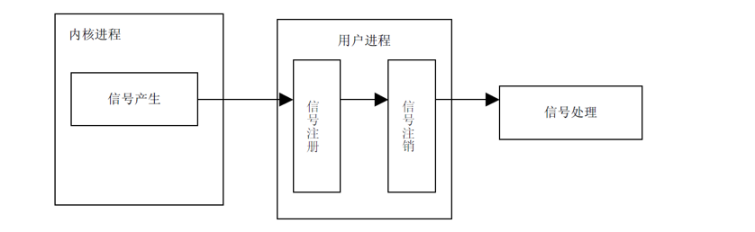

## 00. 目录

[00. 目录](#header-n0)[01. 学习目标](#header-n3)[02. 信号的概述](#header-n20)[03. 信号的编号(了解)](#header-n39)[04. 信号四要素](#header-n213)[05. 信号的状态](#header-n238)[06. 阻塞信号集和未决信号集](#header-n257)[07. 信号产生函数](#header-n266)[7.1 kill函数](#header-n267)[7.2 raise函数](#header-n275)[7.3 abort函数](#header-n278)[7.4 alarm函数(闹钟)](#header-n281)[7.5 setitimer函数（定时器）](#header-n287)[08. 信号集](#header-n292)[8.1 信号集概述](#header-n293)[8.2 自定义信号集函数](#header-n298)[8.3 sigprocmask函数](#header-n309)[8.4 sigpending函数](#header-n315)[09. 信号捕捉](#header-n320)[9.1 信号处理方式](#header-n321)[9.2 signal函数](#header-n334)[9.3 sigaction函数](#header-n341)[9.4 **sigqueue** 函数(了解)](#header-n364)[10. 不可重入、可重入函数](#header-n377)[11. SIGCHLD信号](#header-n402)[11.1 SIGCHLD信号产生的条件](#header-n403)[11.2 如何避免僵尸进程](#header-n408)[12. 作业](#header-n418)[13. 总结](#header-n422)

## 01. 学习目标

- 了解信号中的基本概念
- 熟练使用信号相关的函数
- 了解内核中的阻塞信号集和未决信号集作用
- 参考文档使用信号集操作相关函数
- 熟练使用信号捕捉函数signal
- 熟练使用信号捕捉函数sigaction
- 熟练掌握使用信号完成子进程的回收

 

## 02. 信号的概述

**信号的概念**

信号是 Linux 进程间通信的最古老的方式。信号是软件中断，它是在软件层次上对中断机制的一种模拟，是一种异步通信的方式 。信号可以导致一个正在运行的进程被另一个正在 运行的异步进程中断，转而处理某一个突发事件。

“中断”在我们生活中经常遇到，譬如，我正在房间里打游戏，突然送快递的来了，把正在玩游戏的我给“中断”了，我去签收快递( 处理中断 )，处理完成后，再继续玩我的游戏。

这里我们学习的“信号”就是属于这么一种“中断”。我们在终端上敲“Ctrl+c”，就产生一个“中断”，相当于产生一个信号，接着就会处理这么一个“中断任务”（默认的处理方式为中断当前进程）。

 

**信号的特点**

- 简单
- 不能携带大量信息
- 满足某个特设条件才发送

 

信号可以直接**进行用户空间进程**和**内核空间进程**的交互，内核进程可以利用它来通知用户空间进程发生了哪些系统事件。

一个完整的信号周期包括三个部分：信号的产生，信号在进程中的注册，信号在进程中的注销，执行信号处理函数。如下图所示：



注意：这里信号的产生，注册，注销时信号的内部机制，而不是信号的函数实现。

## 03. 信号的编号(了解)

1）信号编号：

Unix早期版本就提供了信号机制，但不可靠，信号可能丢失。Berkeley 和 AT&T都对信号模型做了更改，增加了可靠信号机制。但彼此不兼容。POSIX.1对可靠信号例程进行了标准化。

Linux 可使用命令：kill -l（"l" 为字母），查看相应的信号。


不存在编号为0的信号。其中1-31号信号称之为常规信号（也叫普通信号或标准信号），34-64称之为实时信号，驱动编程与硬件相关。名字上区别不大。而前32个名字各不相同。

 

2） Linux常规信号一览表 :

| **编号** | **信号**             | **对应事件**                                                 | **默认动作**               |
| :------- | :------------------- | :----------------------------------------------------------- | :------------------------- |
| 1        | SIGHUP               | 用户退出shell时，由该shell启动的所有进程将收到这个信号       | 终止进程                   |
| 2        | **SIGINT**           | 当用户按下了**<Ctrl+C>**组合键时，用户终端向正在运行中的由该终端启动的程序发出此信号 | 终止进程                   |
| 3        | **SIGQUIT**          | 用户按下**<ctrl+\>**组合键时产生该信号，用户终端向正在运行中的由该终端启动的程序发出些信号 | 终止进程                   |
| 4        | SIGILL               | CPU检测到某进程执行了非法指令                                | 终止进程并产生core文件     |
| 5        | SIGTRAP              | 该信号由断点指令或其他 trap指令产生                          | 终止进程并产生core文件     |
| 6        | SIGABRT              | 调用abort函数时产生该信号                                    | 终止进程并产生core文件     |
| 7        | SIGBUS               | 非法访问内存地址，包括内存对齐出错                           | 终止进程并产生core文件     |
| 8        | SIGFPE               | 在发生致命的运算错误时发出。不仅包括浮点运算错误，还包括溢出及除数为0等所有的算法错误 | 终止进程并产生core文件     |
| 9        | SIGKILL              | 无条件终止进程。本信号不能被忽略，处理和阻塞                 | 终止进程，可以杀死任何进程 |
| 10       | SIGUSE1              | 用户定义的信号。即程序员可以在程序中定义并使用该信号         | 终止进程                   |
| 11       | **SIGSEGV**          | 指示进程进行了无效内存访问(段错误)                           | 终止进程并产生core文件     |
| 12       | SIGUSR2              | 另外一个用户自定义信号，程序员可以在程序中定义并使用该信号   | 终止进程                   |
| 13       | **SIGPIPE**          | Broken pipe向一个没有读端的管道写数据                        | 终止进程                   |
| 14       | SIGALRM              | 定时器超时，超时的时间 由系统调用alarm设置                   | 终止进程                   |
| 15       | SIGTERM              | 程序结束信号，与SIGKILL不同的是，该信号可以被阻塞和终止。通常用来要示程序正常退出。执行shell命令Kill时，缺省产生这个信号 | 终止进程                   |
| 16       | SIGSTKFLT            | Linux早期版本出现的信号，现仍保留向后兼容                    | 终止进程                   |
| 17       | **SIGCHLD**          | 子进程结束时，父进程会收到这个信号                           | 忽略这个信号               |
| 18       | SIGCONT              | 如果进程已停止，则使其继续运行                               | 继续/忽略                  |
| 19       | SIGSTOP              | 停止进程的执行。信号不能被忽略，处理和阻塞                   | 为终止进程                 |
| 20       | SIGTSTP              | 停止终端交互进程的运行。按下<ctrl+z>组合键时发出这个信号     | 暂停进程                   |
| 21       | SIGTTIN              | 后台进程读终端控制台                                         | 暂停进程                   |
| 22       | SIGTTOU              | 该信号类似于SIGTTIN，在后台进程要向终端输出数据时发生        | 暂停进程                   |
| 23       | SIGURG               | 套接字上有紧急数据时，向当前正在运行的进程发出些信号，报告有紧急数据到达。如网络带外数据到达 | 忽略该信号                 |
| 24       | SIGXCPU              | 进程执行时间超过了分配给该进程的CPU时间 ，系统产生该信号并发送给该进程 | 终止进程                   |
| 25       | SIGXFSZ              | 超过文件的最大长度设置                                       | 终止进程                   |
| 26       | SIGVTALRM            | 虚拟时钟超时时产生该信号。类似于SIGALRM，但是该信号只计算该进程占用CPU的使用时间 | 终止进程                   |
| 27       | SGIPROF              | 类似于SIGVTALRM，它不公包括该进程占用CPU时间还包括执行系统调用时间 | 终止进程                   |
| 28       | SIGWINCH             | 窗口变化大小时发出                                           | 忽略该信号                 |
| 29       | SIGIO                | 此信号向进程指示发出了一个异步IO事件                         | 忽略该信号                 |
| 30       | SIGPWR               | 关机                                                         | 终止进程                   |
| 31       | SIGSYS               | 无效的系统调用                                               | 终止进程并产生core文件     |
| 34~64    | SIGRTMIN ～ SIGRTMAX | LINUX的实时信号，它们没有固定的含义（可以由用户自定义）      | 终止进程                   |

## 04. 信号四要素 看到这里

每个信号必备4要素，分别是：

1）编号 2）名称 3）事件 4）默认处理动作

可通过**man 7 signal**查看帮助文档获取：


在标准信号中，有一些信号是有三个“Value”，第一个值通常对alpha和sparc架构有效，中间值针对x86、arm和其他架构，最后一个应用于mips架构。一个‘-’表示在对应架构上尚未定义该信号。

不同的操作系统定义了不同的系统信号。因此有些信号出现在Unix系统内，也出现在Linux中，而有的信号出现在FreeBSD或Mac OS中却没有出现在Linux下。这里我们只研究Linux系统中的信号。

 

 

Action为默认动作：

- Term：终止进程
- Ign： 忽略信号 (默认即时对该种信号忽略操作)
- Core：终止进程，生成Core文件。(查验死亡原因，用于gdb调试)
- Stop：停止（暂停）进程
- Cont：继续运行进程

注意通过man 7 signal命令查看帮助文档，其中可看到 : The signals **SIGKILL** and **SIGSTOP** cannot be caught, blocked, or ignored.

这里特别强调了**9) SIGKILL** **和19) SIGSTOP信号，不允许忽略和捕捉，只能执行默认动作。甚至不能将其设置为阻塞。**

另外需清楚，只有每个信号所对应的事件发生了，该信号才会被递送(但不一定递达)，不应乱发信号！！

 

## 05. 信号的状态

 

**1) 产生**

a) 当用户按某些终端键时，将产生信号。

终端上按“Ctrl+c”组合键通常产生中断信号 SIGINT

终端上按“Ctrl+\”键通常产生中断信号 SIGQUIT

终端上按“Ctrl+z”键通常产生中断信号 SIGSTOP 等。

b) 硬件异常将产生信号。

除数为 0，无效的内存访问等。这些情况通常由硬件检测到，并通知内核，然后内核产生适当的信号发送给相应的进程。

c) 软件异常将产生信号。

当检测到某种软件条件已发生(如：定时器alarm)，并将其通知有关进程时，产生信号。

d) 调用系统函数(如：kill、raise、abort)将发送信号。

注意：接收信号进程和发送信号进程的所有者必须相同，或发送信号进程的所有者必须是超级用户。

e) 运行 kill /killall命令将发送信号。

此程序实际上是使用 kill 函数来发送信号。也常用此命令终止一个失控的后台进程。

 

**2) 未决状态：没有被处理**

**3) 递达状态：信号被处理了**

 

## 06. 阻塞信号集和未决信号集

信号的实现手段导致信号有很强的延时性，但对于用户来说，时间非常短，不易察觉。

Linux内核的进程控制块PCB是一个结构体，task_struct, 除了包含进程id，状态，工作目录，用户id，组id，文件描述符表，还包含了信号相关的信息，主要指**阻塞信号集和未决信号集**。

**6.1 阻塞信号集(信号屏蔽字)**

将某些信号加入集合，对他们设置屏蔽，当屏蔽x信号后，再收到该信号，该信号的处理将推后(处理发生在解除屏蔽后)。

**6.2 未决信号集**

信号产生，未决信号集中描述该信号的位立刻翻转为1，表示信号处于未决状态。当信号被处理对应位翻转回为0。这一时刻往往非常短暂。

信号产生后由于某些原因(主要是阻塞)不能抵达。这类信号的集合称之为未决信号集。在屏蔽解除前，信号一直处于未决状态。

 

## 07. 信号产生函数

### 7.1 kill函数

```

#include <sys/types.h>
#include <signal.h>
​
int kill(pid_t pid, int sig);
功能：给指定进程发送指定信号(不一定杀死)
​
参数：
    pid : 取值有 4 种情况 :
        pid > 0:  将信号传送给进程 ID 为pid的进程。
        pid = 0 :  将信号传送给当前进程所在进程组中的所有进程。
        pid = -1 : 将信号传送给系统内所有的进程。
        pid < -1 : 将信号传给指定进程组的所有进程。这个进程组号等于 pid 的绝对值。
    sig : 信号的编号，这里可以填数字编号，也可以填信号的宏定义，可以通过命令 kill - l("l" 为字母)进行相应查看。不推荐直接使用数字，应使用宏名，因为不同操作系统信号编号可能不同，但名称一致。
​
返回值：
    成功：0
    失败：-1
```

super用户(root)可以发送信号给任意用户，普通用户是不能向系统用户发送信号的。

kill -9 (root用户的pid) 是不可以的。同样，普通用户也不能向其他普通用户发送信号，终止其进程。 只能向自己创建的进程发送信号。

普通用户基本规则是：发送者实际或有效用户ID == 接收者实际或有效用户ID

程序示例:


 

### 7.2 raise函数

```
#include <signal.h>
​
int raise(int sig);
功能：给当前进程发送指定信号(自己给自己发)，等价于 kill(getpid(), sig)
参数：
    sig：信号编号
返回值：
    成功：0
    失败：非0值
```


### 7.3 abort函数

```
#include <stdlib.h>
​
void abort(void);
功能：给自己发送异常终止信号 6) SIGABRT，并产生core文件，等价于kill(getpid(), SIGABRT);
​
参数：无
​
返回值：无
​
```

 

### 7.4 alarm函数(闹钟)


```
#include <unistd.h>
​
unsigned int alarm(unsigned int seconds);
功能：
    设置定时器(闹钟)。在指定seconds后，内核会给当前进程发送14）SIGALRM信号。进程收到该信号，默认动作终止。每个进程都有且只有唯一的一个定时器。
    取消定时器alarm(0)，返回旧闹钟余下秒数。
参数：
    seconds：指定的时间，以秒为单位
返回值：
    返回0或剩余的秒数
​
```

 定时，与进程状态无关(自然定时法)！就绪、运行、挂起(阻塞、暂停)、终止、僵尸……无论进程处于何种状态，alarm都计时。

测试程序:

```

int main()
{
    int seconds = 0;
​
    seconds = alarm(5);
    printf("seconds = %d\n", seconds);
​
    sleep(2);
    seconds = alarm(5);
    printf("seconds = %d\n", seconds);
​
    while (1);
    return 0;
}
```


### 7.5 setitimer函数（定时器）

```
#include <sys/time.h>
​
int setitimer(int which,  const struct itimerval *new_value, struct itimerval *old_value);
功能：
    设置定时器(闹钟)。 可代替alarm函数。精度微秒us，可以实现周期定时。
参数：
    which：指定定时方式
        a) 自然定时：ITIMER_REAL → 14）SIGALRM计算自然时间
        b) 虚拟空间计时(用户空间)：ITIMER_VIRTUAL → 26）SIGVTALRM  只计算进程占用cpu的时间
        c) 运行时计时(用户 + 内核)：ITIMER_PROF → 27）SIGPROF计算占用cpu及执行系统调用的时间
    new_value：struct itimerval, 负责设定timeout时间
        struct itimerval {
            struct timerval it_interval; // 闹钟触发周期
            struct timerval it_value;    // 闹钟触发时间
        };
        struct timeval {
            long tv_sec;            // 秒
            long tv_usec;           // 微秒
        }
        itimerval.it_value： 设定第一次执行function所延迟的秒数 
        itimerval.it_interval：  设定以后每几秒执行function
​
    old_value： 存放旧的timeout值，一般指定为NULL
返回值：
    成功：0
    失败：-1
```


示例程序：

```
void myfunc(int sig)
{
    printf("hello\n");
}
​
int main()
{
    struct itimerval new_value;
​
    //定时周期
    new_value.it_interval.tv_sec = 1;
    new_value.it_interval.tv_usec = 0;
​
    //第一次触发的时间
    new_value.it_value.tv_sec = 2;
    new_value.it_value.tv_usec = 0;
​
    signal(SIGALRM, myfunc); //信号处理
    setitimer(ITIMER_REAL, &new_value, NULL); //定时器设置
​
    while (1);
​
    return 0;
}
​
```


## 08. 信号集

### 8.1 信号集概述

在PCB中有两个非常重要的信号集。一个称之为“阻塞信号集”，另一个称之为“未决信号集”。

这两个信号集都是内核使用**位图机制**来实现的。但操作系统不允许我们直接对其进行位操作。而需自定义另外一个集合，借助信号集操作函数来对PCB中的这两个信号集进行修改。


 

### 8.2 自定义信号集函数

为了方便对多个信号进行处理，一个用户进程常常需要对多个信号做出处理，在 Linux 系统中引入了信号集（信号的集合）。

这个信号集有点类似于我们的 QQ 群，一个个的信号相当于 QQ 群里的一个个好友。

信号集是一个能表示多个信号的数据类型，sigset_t set，set即一个信号集。既然是一个集合，就需要对集合进行添加/删除等操作。

相关函数说明如下：

```
#include <signal.h>  
​
int sigemptyset(sigset_t *set);       //将set集合置空
int sigfillset(sigset_t *set)；          //将所有信号加入set集合
int sigaddset(sigset_t *set, int signo);  //将signo信号加入到set集合
int sigdelset(sigset_t *set, int signo);   //从set集合中移除signo信号
int sigismember(const sigset_t *set, int signo); //判断信号是否存在
```

除sigismember外，其余操作函数中的set均为传出参数。sigset_t类型的本质是位图。但不应该直接使用位操作，而应该使用上述函数，保证跨系统操作有效。

 

示例程序:

```

int main()
{
    sigset_t set;   // 定义一个信号集变量
    int ret = 0;
​
    sigemptyset(&set); // 清空信号集的内容
​
    // 判断 SIGINT 是否在信号集 set 里
    // 在返回 1， 不在返回 0
    ret = sigismember(&set, SIGINT);
    if (ret == 0)
    {
        printf("SIGINT is not a member of set \nret = %d\n", ret);
    }
​
    sigaddset(&set, SIGINT); // 把 SIGINT 添加到信号集 set
    sigaddset(&set, SIGQUIT);// 把 SIGQUIT 添加到信号集 set
​
    // 判断 SIGINT 是否在信号集 set 里
    // 在返回 1， 不在返回 0
    ret = sigismember(&set, SIGINT);
    if (ret == 1)
    {
        printf("SIGINT is a member of set \nret = %d\n", ret);
    }
​
    sigdelset(&set, SIGQUIT); // 把 SIGQUIT 从信号集 set 移除
​
    // 判断 SIGQUIT 是否在信号集 set 里
    // 在返回 1， 不在返回 0
    ret = sigismember(&set, SIGQUIT);
    if (ret == 0)
    {
        printf("SIGQUIT is not a member of set \nret = %d\n", ret);
    }
​
    return 0;
}
```

 

### 8.3 sigprocmask函数

信号阻塞集也称信号屏蔽集、信号掩码。每个进程都有一个阻塞集，创建子进程时子进程将继承父进程的阻塞集。信号阻塞集用来描述哪些信号递送到该进程的时候被阻塞（在信号发生时记住它，直到进程准备好时再将信号通知进程）。

所谓阻塞并不是禁止传送信号, 而是暂缓信号的传送。若将被阻塞的信号从信号阻塞集中删除，且对应的信号在被阻塞时发生了，进程将会收到相应的信号。

我们可以通过 sigprocmask() 修改当前的信号掩码来改变信号的阻塞情况。

```
#include <signal.h>
​
int sigprocmask(int how, const sigset_t *set, sigset_t *oldset);
功能：
    检查或修改信号阻塞集，根据 how 指定的方法对进程的阻塞集合进行修改，新的信号阻塞集由 set 指定，而原先的信号阻塞集合由 oldset 保存。
​
参数：
    how : 信号阻塞集合的修改方法，有 3 种情况：
        SIG_BLOCK：向信号阻塞集合中添加 set 信号集，新的信号掩码是set和旧信号掩码的并集。相当于 mask = mask|set。
        SIG_UNBLOCK：从信号阻塞集合中删除 set 信号集，从当前信号掩码中去除 set 中的信号。相当于 mask = mask & ~ set。
        SIG_SETMASK：将信号阻塞集合设为 set 信号集，相当于原来信号阻塞集的内容清空，然后按照 set 中的信号重新设置信号阻塞集。相当于mask = set。
    set : 要操作的信号集地址。
        若 set 为 NULL，则不改变信号阻塞集合，函数只把当前信号阻塞集合保存到 oldset 中。
    oldset : 保存原先信号阻塞集地址
​
返回值：
    成功：0，
    失败：-1，失败时错误代码只可能是 EINVAL，表示参数 how 不合法。
```


### 8.4 sigpending函数

```
#include <signal.h>
​
int sigpending(sigset_t *set);
功能：读取当前进程的未决信号集
参数：
    set：未决信号集
返回值：
    成功：0
    失败：-1
```


示例程序:

```
int main()
{
    // 自定义信号集
    sigset_t myset, old;
    sigemptyset(&myset);// 清空　－》　０
​
    // 添加要阻塞的信号
    sigaddset(&myset, SIGINT);
    sigaddset(&myset, SIGQUIT);
    sigaddset(&myset, SIGKILL);
​
    // 自定义信号集设置到内核中的阻塞信号集
    sigprocmask(SIG_BLOCK, &myset, &old);
​
    sigset_t pend;
    int i = 0;
    while (1)
    {
        // 读内核中的未决信号集的状态
        sigpending(&pend);
        for (int i = 1; i<32; ++i)
        {
            if (sigismember(&pend, i))
            {
                printf("1");
            }
            else if (sigismember(&pend, i) == 0)
            {
                printf("0");
            }
        }
        printf("\n");
        sleep(1);
        i++;
​
        // 10s之后解除阻塞
        if (i > 10)
        {
            // sigprocmask(SIG_UNBLOCK, &myset, NULL);
            sigprocmask(SIG_SETMASK, &old, NULL);
        }
    }
​
    return 0;
}
```


## 09. 信号捕捉

### 9.1 信号处理方式

一个进程收到一个信号的时候，可以用如下方法进行处理：

1）执行系统默认动作

对大多数信号来说，系统默认动作是用来终止该进程。

2）忽略此信号(丢弃)

接收到此信号后没有任何动作。

3）执行自定义信号处理函数(捕获)

用用户定义的信号处理函数处理该信号。

【注意】：SIGKILL 和 SIGSTOP 不能更改信号的处理方式，因为它们向用户提供了一种使进程终止的可靠方法。

 

内核实现信号捕捉过程：


 

### 9.2 signal函数

```

#include <signal.h>
​
typedef void(*sighandler_t)(int);
sighandler_t signal(int signum, sighandler_t handler);
功能：
    注册信号处理函数（不可用于 SIGKILL、SIGSTOP 信号），即确定收到信号后处理函数的入口地址。此函数不会阻塞。
​
参数：
    signum：信号的编号，这里可以填数字编号，也可以填信号的宏定义，可以通过命令 kill - l("l" 为字母)进行相应查看。
    handler : 取值有 3 种情况：
          SIG_IGN：忽略该信号
          SIG_DFL：执行系统默认动作
          信号处理函数名：自定义信号处理函数，如：func
          回调函数的定义如下：
            void func(int signo)
            {
                // signo 为触发的信号，为 signal() 第一个参数的值
            }
​
返回值：
    成功：第一次返回 NULL，下一次返回此信号上一次注册的信号处理函数的地址。如果需要使用此返回值，必须在前面先声明此函数指针的类型。
    失败：返回 SIG_ERR
```

该函数由ANSI定义，由于历史原因在不同版本的Unix和不同版本的Linux中可能有不同的行为。因此应该尽量避免使用它，取而代之使用sigaction函数。

示例程序:

```
// 信号处理函数
void signal_handler(int signo)
{
    if (signo == SIGINT)
    {
        printf("recv SIGINT\n");
    }
    else if (signo == SIGQUIT)
    {
        printf("recv SIGQUIT\n");
    }
}
​
int main()
{
    printf("wait for SIGINT OR SIGQUIT\n");
​
    /* SIGINT: Ctrl+c ; SIGQUIT: Ctrl+\ */
    // 信号注册函数
    signal(SIGINT, signal_handler);
    signal(SIGQUIT, signal_handler);
​
    while (1); //不让程序结束
​
    return 0;
}
​
```


### 9.3 sigaction函数

```

#include <signal.h>
​
int sigaction(int signum, const struct sigaction *act, struct sigaction *oldact);
功能：
    检查或修改指定信号的设置（或同时执行这两种操作）。
​
参数：
    signum：要操作的信号。
    act：   要设置的对信号的新处理方式（传入参数）。
    oldact：原来对信号的处理方式（传出参数）。
​
    如果 act 指针非空，则要改变指定信号的处理方式（设置），如果 oldact 指针非空，则系统将此前指定信号的处理方式存入 oldact。
​
返回值：
    成功：0
    失败：-1
```

**struct sigaction结构体：**

```
struct sigaction {
    void(*sa_handler)(int); //旧的信号处理函数指针
    void(*sa_sigaction)(int, siginfo_t *, void *); //新的信号处理函数指针
    sigset_t   sa_mask;      //信号阻塞集
    int        sa_flags;     //信号处理的方式
    void(*sa_restorer)(void); //已弃用
};
```

1) sa_handler、sa_sigaction：信号处理函数指针，和 signal() 里的函数指针用法一样，应根据情况给sa_sigaction、sa_handler 两者之一赋值，其取值如下：

a) SIG_IGN：忽略该信号

b) SIG_DFL：执行系统默认动作

c) 处理函数名：自定义信号处理函数

2) sa_mask：信号阻塞集，在信号处理函数执行过程中，临时屏蔽指定的信号。

3) sa_flags：用于指定信号处理的行为，通常设置为0，表使用默认属性。它可以是一下值的“按位或”组合：

Ø SA_RESTART：使被信号打断的系统调用自动重新发起（已经废弃）

Ø SA_NOCLDSTOP：使父进程在它的子进程暂停或继续运行时不会收到 SIGCHLD 信号。

Ø SA_NOCLDWAIT：使父进程在它的子进程退出时不会收到 SIGCHLD 信号，这时子进程如果退出也不会成为僵尸进程。

Ø SA_NODEFER：使对信号的屏蔽无效，即在信号处理函数执行期间仍能发出这个信号。

Ø SA_RESETHAND：信号处理之后重新设置为默认的处理方式。

Ø SA_SIGINFO：使用 sa_sigaction 成员而不是 sa_handler 作为信号处理函数。

 

**信号处理函数:**

```
void(*sa_sigaction)(int signum, siginfo_t *info, void *context);
参数说明：
    signum：信号的编号。
    info：记录信号发送进程信息的结构体。
    context：可以赋给指向 ucontext_t 类型的一个对象的指针，以引用在传递信号时被中断的接收进程或线程的上下文。
```


示例程序:

 

```

void myfunc(int sig)
{
    printf("hello signal: %d\n", sig);
    sleep(5);
    printf("wake up .....\n");
}
​
int main()
{
    // 注册信号捕捉函数
    struct sigaction act;
    act.sa_flags = 0;
    act.sa_handler = myfunc;
    // 设置临时屏蔽的信号
    sigemptyset(&act.sa_mask);  // 清空
    // ctrl + 反斜杠
    sigaddset(&act.sa_mask, SIGQUIT);
​
    sigaction(SIGINT, &act, NULL); //注册信号
​
    while (1);
​
    return 0;
}
```


### 9.4 **sigqueue** 函数(了解)

```
#include <signal.h>
​
int sigqueue(pid_t pid, int sig, const union sigval value);
功能：
    给指定进程发送信号。
参数：
    pid : 进程号。
    sig : 信号的编号。
    value : 通过信号传递的参数。
        union sigval 类型如下：
            union sigval
            {
                int   sival_int;
                void *sival_ptr;
            };
返回值：
    成功：0
    失败：-1
```


向指定进程发送指定信号的同时，携带数据。但如传地址，需注意，不同进程之间虚拟地址空间各自独立，将当前进程地址传递给另一进程没有实际意义。

下面我们做这么一个例子，一个进程在发送信号，一个进程在接收信号的发送。

发送信号示例代码如下：

```
/*******************************************************
*功能：     发 SIGINT 信号及信号携带的值给指定的进程
*参数：        argv[1]：进程号 argv[2]：待发送的值（默认为100）
*返回值：   0
********************************************************/
int main()
{
    if (argc >= 2)
    {
        pid_t pid, pid_self;
        union sigval tmp;
​
        pid = atoi(argv[1]); // 进程号
        if (argc >= 3)
        {
            tmp.sival_int = atoi(argv[2]);
        }
        else
        {
            tmp.sival_int = 100;
        }
​
        // 给进程 pid，发送 SIGINT 信号，并把 tmp 传递过去
        sigqueue(pid, SIGINT, tmp);
​
        pid_self = getpid(); // 进程号
        printf("pid = %d, pid_self = %d\n", pid, pid_self);
    }
​
    return 0;
}
```


接收信号示例代码如下：

```
// 信号处理回调函数
void signal_handler(int signum, siginfo_t *info, void *ptr)
{
    printf("signum = %d\n", signum); // 信号编号
    printf("info->si_pid = %d\n", info->si_pid); // 对方的进程号
    printf("info->si_sigval = %d\n", info->si_value.sival_int); // 对方传递过来的信息
}
​
int main()
{
    struct sigaction act, oact;
​
    act.sa_sigaction = signal_handler; //指定信号处理回调函数
    sigemptyset(&act.sa_mask); // 阻塞集为空
    act.sa_flags = SA_SIGINFO; // 指定调用 signal_handler
​
    // 注册信号 SIGINT
    sigaction(SIGINT, &act, &oact);
​
    while (1)
    {
        printf("pid is %d\n", getpid()); // 进程号
​
        pause(); // 捕获信号，此函数会阻塞
    }
​
    return 0;
}
​
```


两个终端分别编译代码，一个进程接收，一个进程发送，运行结果如下：


 

 

## 10. 不可重入、可重入函数

如果有一个函数不幸被设计成为这样：那么不同任务调用这个函数时可能修改其他任务调用这个函数的数据，从而导致不可预料的后果。这样的函数是不安全的函数，也叫不可重入函数。

 

满足下列条件的函数多数是不可重入（不安全）的：

- 函数体内使用了静态的数据结构；
- 函数体内调用了malloc() 或者 free() 函数(谨慎使用堆)；
- 函数体内调用了标准 I/O 函数。

 

相反，肯定有一个安全的函数，这个安全的函数又叫可重入函数。那么什么是可重入函数呢？所谓可重入是指一个可以被多个任务调用的过程，任务在调用时不必担心数据是否会出错。

 

保证函数的可重入性的方法：

- 在写函数时候尽量使用局部变量（例如寄存器、栈中的变量）；
- 对于要使用的全局变量要加以保护（如采取关中断、信号量等互斥方法），这样构成的函数就一定是一个可重入的函数。

 

Linux常见的可重入函数：


**注意：信号处理函数应该为可重入函数。**

 

## 11. SIGCHLD信号

### 11.1 SIGCHLD信号产生的条件

1) 子进程终止时

2) 子进程接收到SIGSTOP信号停止时

3) 子进程处在停止态，接受到SIGCONT后唤醒时

 

### 11.2 如何避免僵尸进程

1) 最简单的方法，父进程通过 wait() 和 waitpid() 等函数等待子进程结束，但是，这会导致父进程挂起。

2) 如果父进程要处理的事情很多，不能够挂起，通过 signal() 函数人为处理信号 SIGCHLD ， 只要有子进程退出自动调用指定好的回调函数，因为子进程结束后， 父进程会收到该信号 SIGCHLD ，可以在其回调函数里调用 wait() 或 waitpid() 回收。

示例程序:

```
void sig_child(int signo)
{
    pid_t  pid;
​
    //处理僵尸进程, -1 代表等待任意一个子进程, WNOHANG代表不阻塞
    while ((pid = waitpid(-1, NULL, WNOHANG)) > 0)
    {
        printf("child %d terminated.\n", pid);
    }
}
​
int main()
{
    pid_t pid;
​
    // 创建捕捉子进程退出信号
    // 只要子进程退出，触发SIGCHLD，自动调用sig_child()
    signal(SIGCHLD, sig_child);
​
    pid = fork();   // 创建进程
    if (pid < 0)
    { // 出错
        perror("fork error:");
        exit(1);
    }
    else if (pid == 0)
    { // 子进程
        printf("I am child process,pid id %d.I am exiting.\n", getpid());
        exit(0);
    }
    else if (pid > 0)
    { // 父进程
        sleep(2);   // 保证子进程先运行
        printf("I am father, i am exited\n\n");
        system("ps -ef | grep defunct"); // 查看有没有僵尸进程
    }
​
    return 0;
}
```


3）如果父进程不关心子进程什么时候结束，那么可以用signal（SIGCHLD, SIG_IGN）通知内核，自己对子进程的结束不感兴趣，父进程忽略此信号，那么子进程结束后，内核会回收， 并不再给父进程发送信号。

示例程序:

```

int main()
{
    pid_t pid;
​
    // 忽略子进程退出信号的信号
    // 那么子进程结束后，内核会回收， 并不再给父进程发送信号
    signal(SIGCHLD, SIG_IGN);
​
    pid = fork();   // 创建进程
​
    if (pid < 0)
    { // 出错
        perror("fork error:");
        exit(1);
    }
    else if (pid == 0)
    { // 子进程
        printf("I am child process,pid id %d.I am exiting.\n", getpid());
        exit(0);
​
    }
    else if (pid > 0)
    { // 父进程
        sleep(2);   // 保证子进程先运行
        printf("I am father, i am exited\n\n");
        system("ps -ef | grep defunct"); // 查看有没有僵尸进程
    }
​
    return 0;
}
```


## 12. 作业

**1. 实现类似ps aux | grep "bash"功能**

提示: 使用多进程 和execl函数 dup2函数

 

## 13. 总结

 

 