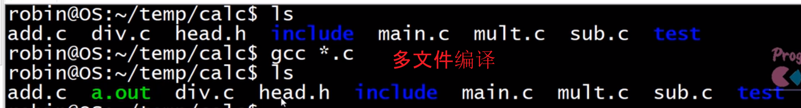
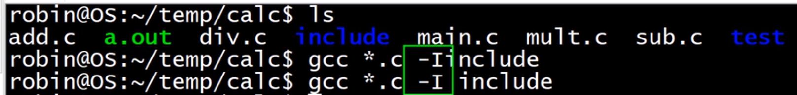
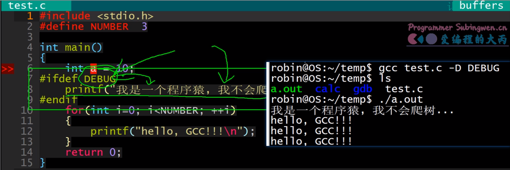

Linux 下使用 GCC 编译器编译单个文件十分简单，直接使用 gcc 命令后面加上**要编译的 C 语言的源文件**，GCC 会自动生成文件名为 a.out 的可执行文件（也可以通过参数 -o 指定生成的文件名）

下面的表格中列出了常用的一些 gcc 参数，这些参数在 gcc命令中没有位置要求，只需要编译程序的时候将需要的参数指定出来即可。

来即可。

- -E	预处理指定的源文件，不进行编译

- -S	编译指定的源文件，但是不进行汇编

- -c	编译、汇编指定的源文件，但是不进行链接

- -o [file1] [file2] / [file2] -o [file1]	将文件 file2 编译成文件 file1

- -I directory (大写的 i)	指定 include 包含文件的搜索目录

- -g	在编译的时候，生成调试信息，该程序可以被调试器调试

- -D	在程序编译的时候，指定一个宏

- -w	不生成任何警告信息，不建议使用，有些时候警告就是错误

- -Wall	生成所有警告信息

- -On	n 的取值范围：0~3。编译器的优化选项的 4 个级别，-O0 表示没有优化，-O1 为缺省值，-O3 优化级别最高

- -l	在程序编译的时候，指定使用的库

- -L	指定编译的时候，搜索的库的路径。

- -fPIC/fpic	生成与位置无关的代码

- -shared	生成共享目标文件。通常用在建立共享库时

- -std	指定 C 方言，如:-std=c99，gcc 默认的方言是 GNU C

  GCC 可以自动编译链接多个文件，不管是目标文件还是源文件，都可以使用同一个命令编译到**一个可执行文件中**。

  ```bash
  # 直接生成可执行程序 test
  $ gcc -o test string.c main.c
  
  # 运行可执行程序
  $ ./test
  ```

  

如果head.h在include目录会发现报错找不到head.h 所以需要用到参数-I指定头文件路径



-D的使用，可以确保没有定义该宏的时候也能够输出这个宏

应用于是否需要输出日志，



# gcc和g++ 

1. 在代码编译阶段（第二个阶段）:

- 后缀为 .c 的，gcc 把它当作是 C 程序，而 g++ 当作是 C++ 程序
- 后缀为.cpp 的，两者都会认为是 C++ 程序，C++ 的语法规则更加严谨一些
- g++ 会调用 gcc，对于 C++ 代码，两者是等价的，也就是说 gcc 和 g++ 都可以编译 C/C++ 代码

2. 在链接阶段（最后一个阶段）:

- gcc 和 g++ 都可以自动链接到标准 C 库
- g++ 可以自动链接到标准 C++ 库，gcc 如果要链接到标准 C++ 库需要加参数 -lstdc++

3. 关于 __cplusplus 宏的定义

- g++ 会自动定义__cplusplus 宏，但是这个不影响它去编译 C 程序

- gcc 需要根据文件后缀判断是否需要定义 __cplusplus 宏 （规则参考第一条）


> 综上所述：
>
> 不管是 gcc 还是 g++ 都可以编译 C 程序，编译程序的规则和参数都相同
> g++ 可以直接编译 C++ 程序， gcc 编译 C++ 程序需要添加额外参数 -lstdc++
> 不管是 gcc 还是 g++ 都可以定义 __cplusplus 宏

```bash
# 编译 c 程序
$ gcc test.c -o test	# 使用gcc
$ g++ test.c -o test	# 使用g++

# 编译 c++ 程序
$ g++ test.cpp -o test              # 使用g++
$ gcc test.cpp -lstdc++ -o test     # 使用gcc
```

# GDB调试

### 1 调试准备

项目程序如果是为了进行调试而编译时， 必须要打开调试选项 (-g)。另外还有一些可选项，比如：在尽量不影响程序行为的情况下关掉编译器的优化选项 (-O0)，-Wall 选项打开所有 warning，也可以发现许多问题，避免一些不必要的 bug。

-g 选项的作用是在可执行文件中加入源代码的信息，比如可执行文件中第几条机器指令对应源代码的第几行，但并不是把整个源文件嵌入到可执行文件中，所以在调试时必须保证 gdb 能找到源文件。

习惯上如果是 c程序就使用 gcc 编译，如果是 c++ 程序就使用 g++ 编译，编译命令中添加上边提到的参数即可。

>假设有一个文件 args.c, 要对其进行gdb调试，编译的时候必须要添加参数 -g，加入了源代码信息的可执行文件比不加之前要大一些。


```shell
# -g 将调试信息写入到可执行程序中
$ gcc -g args.c -o app

# 编译不添加 -g 参数
$ gcc args.c -o app1  

# 查看生成的两个可执行程序的大小
$ ll

-rwxrwxr-x  1 robin robin 9816 Apr 19 09:25 app*	# 可以用于gdb调试
-rwxrwxr-x  1 robin robin 8608 Apr 19 09:25 app1*	# 不能用于gdb调试

```

## 2 启动和退出 gdb

### 2.1 启动 gdb

>gdb 是一个用于应用程序调试的进程，需要先将其打开，一定要注意 gdb进程启动之后, 需要的被调试的应用程序是没有执行的。打开 Linux 终端，切换到要调试的可执行程序所在路径，执行如下命令就可以启动 gdb 了。

```shell
# 在终端中执行如下命令
# gdb程序启动了, 但是可执行程序并没有执行
$ gdb 可执行程序的名字

# 使用举例：
$ gdb app
(gdb) 		# gdb等待输入调试的相关命令
```

### 2.2 命令行传参

>有些程序在启动的时候需要传递命令行参数，如果要调试这类程序，这些命令行参数**必须要在应用程序启动之前通过调试程序的 gdb 进程传递进去**。下面是一段带命令行参数的程序：

```c
// args.c
#include <stdio.h>
#include <stdlib.h>
#include <unistd.h>
#include <string.h>

#define NUM 10

// argc, argv 是命令行参数
// 启动应用程序的时候
int main(int argc, char* argv[])
{
    printf("参数个数: %d\n", argc);
    for(int i=0; i<argc; ++i)
    {
        printf("%d\n", NUM);
        printf("参数 %d: %s\n", i, argv[i]);
    }
    return 0;
}
```

第一步：编译出带条信息的可执行程序

```
$ gcc args.c -o app -g
```

第二步：启动 gdb 进程，指定需要 gdb 调试的应用程序名称

```
$ gdb app
(gdb) 
```

第三步：在启动应用程序 app 之前设置命令行参数。gdb 中设置参数的命令叫做 set args ...，查看设置的命令行参数命令是 show args。 语法格式如下：

```
# 设置的时机: 启动gdb之后, 在应用程序启动之前
(gdb) set args 参数1 参数2 .... ...
# 查看设置的命令行参数
(gdb) show args
```

例子

```c
# 非gdb调试命令行传参
# argc 参数总个数，argv[0] == ./app， argv[1] == "11"  argv[2] == "22"  ...  argv[5] == "55"
$ ./app 11 22 33 44 55		# 这是数据传递给main函数
 
# 使用 gdb 调试
$ gdb app
GNU gdb (Ubuntu 7.11.1-0ubuntu1~16.5) 7.11.1
Copyright (C) 2016 Free Software Foundation, Inc.
# 通过gdb给应用程序设置命令行参数
(gdb) set args 11 22 33 44 55
# 查看设置的命令行参数
(gdb) show args
Argument list to give program being debugged when it is started is "11 22 33 44 55".
```

### 2.3 gdb 中启动程序

>在 gdb 中启动要调试的应用程序有两种方式，一种是使用 run 命令，另一种是使用 start 命令启动。在整个 gdb 调试过程中，启动应用程序的命令只能使用一次。

```
run: 可以缩写为 r, 如果程序中设置了断点会停在第一个断点的位置，如果没有设置断点，程序就执行完了
start: 启动程序，最终会阻塞在 main 函数的第一行，等待输入后续其它 gdb 指令
```

```shell
# 两种方式
# 方式1: run == r 
(gdb) run  

# 方式2: start
(gdb) start
```

如果想让程序 start 之后继续运行，或者在断点处继续运行，可以使用 continue 命令，可以简写为 c

```shell
# continue == c
(gdb) continue
```

### 2.4 退出 gdb

>退出 gdb 调试，就是终止 gdb 进程，需要使用 quit 命令，可以缩写为 q

```shell
# quit == q
(gdb) quit
```

## 3. 查看代码

因为 gdb 调试没有 IDE 那样的完善的可视化窗口界面，给调试的程序打断点又是调试之前必须做的一项工作。因此 gdb 提供了查看代码的命令，这样就可以轻松定位要调试的代码行的位置了。

查看代码的命令叫做 list 可以缩写为 l, 通过这个命令我们可以查看项目中任意一个文件中的内容，并且还可以通过文件行号，函数名等方式查看。

### 3.1 当前文件

>一个项目中一般是有很多源文件的，默认情况下通过 list 查看到代码信息位于程序入口函数 main 对应的的那个文件中。因此如果不进行文件切换 main 函数所在的文件就是当前文件，如果进行了文件切换，切换到哪个文件哪个文件就是当前文件。查看文件内容的方式如下：

```shell
# 使用 list 和使用 l 都可以
# 从第一行开始显示
(gdb) list 

# 列值这行号对应的上下文代码, 默认情况下只显示10行内容
(gdb) list 行号

# 显示这个函数的上下文内容, 默认显示10行
(gdb) list 函数名
```

通过 list 去查看文件代码，默认只显示 10 行，如果还想继续查看后边的内容，可以继续执行 list 命令，也可以直接回车（再次执行上一次执行的那个 gdb 命令）。

### 3.2 切换文件

在查看文件内容的时候，很多情况下需要进行文件切换，我们只需要在 list 命令后边将要查看的文件名指定出来就可以了，切换命令执行完毕之后，这个文件就变成了当前文件。文件切换方式如下：

```shell
# 切换到指定的文件，并列出这行号对应的上下文代码, 默认情况下只显示10行内容
(gdb) l 文件名:行号

# 切换到指定的文件，并显示这个函数的上下文内容, 默认显示10行
(gdb) l 文件名:函数名
```

### 3.3 设置显示的行数

默认通过 list 只能一次查看 10 行代码，如果想显示更多，可以通过 set listsize 设置，同样如果想查看当前显示的行数可以通过 show listsize 查看，这里的 listsize 可以简写为 list。具体语法格式如下:

```
# 以下两个命令中的 listsize 都可以写成 list
(gdb) set listsize 行数

# 查看当前list一次显示的行数
(gdb) show listsize
```

## 4. 断点操作

想要通过 gdb 调试某一行或者得到某个变量在运行状态下的实际值，就需要在在这一行设置断点，程序指定到断点的位置就会阻塞，我们就可以通过 gdb 的调试命令得到我们想要的信息了。

设置断点的命令叫做 break 可以缩写为 b。


### 4.1 设置断点

>断点的设置有两种方式一种是常规断点，程序只要运行到这个位置就会被阻塞，还有一种叫条件断点，只有指定的条件被满足了程序才会在断点处阻塞。
>
>调试程序的断点可以设置到某个具体的行，也可以设置到某个函数上，具体的设置方式如下：

设置普通断点到当前文件

```shell
# 在当前文件的某一行上设置断点
# break == b
(gdb) b 行号
(gdb) b 函数名		# 停止在函数的第一行
```

设置普通断点到某个非当前文件上

```
# 在当前文件的某一行上设置断点
# break == b
(gdb) b 行号
(gdb) b 函数名		# 停止在函数的第一行
```

设置普通断点到某个非当前文件上

```
# 在非当前文件的某一行上设置断点
(gdb) b 文件名:行号
(gdb) b 文件名:函数名		# 停止在函数的第一行
```

设置条件断点

```shell
# 必须要满足某个条件, 程序才会停在这个断点的位置上
# 通常情况下, 在循环中条件断点用的比较多
(gdb) b 行数 if 变量名==某个值
```

### 4.2 查看断点

> 断点设置完毕之后，可以通过 info break 命令查看设置的断点信息，其中 info 可以缩写为 i

```
# info == i
# 查看设置的断点信息
(gdb) i b   #info break

# 举例
(gdb) i b
Num     Type           Disp Enb Address            What
1       breakpoint     keep y   0x0000000000400cb5 in main() at test.cpp:12
2       breakpoint     keep y   0x0000000000400cbd in main() at test.cpp:13
3       breakpoint     keep y   0x0000000000400cec in main() at test.cpp:18
4       breakpoint     keep y   0x00000000004009a5 in insertionSort(int*, int) 
                                                   at insert.cpp:8
5       breakpoint     keep y   0x0000000000400cdd in main() at test.cpp:16
6       breakpoint     keep y   0x00000000004009e5 in insertionSort(int*, int) 
                                                   at insert.cpp:16
```

在显示的断点信息中有一些属性需要在其他操作中被使用，下面介绍一下:

Num: 断点的编号，删除断点或者设置断点状态的时候都需要使用
Enb: 当前断点的状态，y 表示断点可用，n 表示断点不可用
What: 描述断点被设置在了哪个文件的哪一行或者哪个函数上

### 4.3 删除断点

如果确定设置的某个断点不再被使用了，可用将其删除，删除命令是 delete 断点编号 , 这个 delete 可以简写为 del 也可以再简写为 d。

删除断点的方式有两种: 删除(一个或者多个)指定断点或者删除一个连续的断点区间，具体操作如下：

```
# delete == del == d
# 需要 info b 查看断点的信息, 第一列就是编号
(gdb) d 断点的编号1 [断点编号2 ...]
# 举例: 
(gdb) d 1          # 删除第1个断点
(gdb) d 2 4 6      # 删除第2,4,6个断点

# 删除一个范围, 断点编号 num1 - numN 是一个连续区间
(gdb) d num1-numN
# 举例, 删除第1到第5个断点
(gdb) d 1-5
```

### 4.4 设置断点状态

> 如果某个断点只是临时不需要了，我们可以将其设置为不可用状态，设置命令为 disable 断点编号，当需要的时候再将其设置回可用状态，设置命令为 enable 断点编号。

设置断点无效

```
# 让断点失效之后, gdb调试过程中程序是不会停在这个位置的
# disable == dis
# 设置某一个或者某几个断点无效
(gdb) dis 断点1的编号 [断点2的编号 ...]

# 设置某个区间断点无效
(gdb) dis 断点1编号-断点n编号
```

演示设置断点为无效状态:

```shell
# 查看断点信息
(gdb) i b
Num     Type           Disp Enb Address            What
2       breakpoint     keep y   0x0000000000400cce in main() at test.cpp:14
4       breakpoint     keep y   0x0000000000400cdd in main() at test.cpp:16
5       breakpoint     keep y   0x0000000000400d46 in main() at test.cpp:23
6       breakpoint     keep y   0x0000000000400d4e in main() at test.cpp:25
7       breakpoint     keep y   0x0000000000400d6e in main() at test.cpp:28
8       breakpoint     keep y   0x0000000000400d7d in main() at test.cpp:30

# 设置第2, 第4 个断点无效
(gdb) dis 2 4

# 查看断点信息
(gdb) i b
Num     Type           Disp Enb Address            What
2       breakpoint     keep n   0x0000000000400cce in main() at test.cpp:14
4       breakpoint     keep n   0x0000000000400cdd in main() at test.cpp:16
5       breakpoint     keep y   0x0000000000400d46 in main() at test.cpp:23
6       breakpoint     keep y   0x0000000000400d4e in main() at test.cpp:25
7       breakpoint     keep y   0x0000000000400d6e in main() at test.cpp:28
8       breakpoint     keep y   0x0000000000400d7d in main() at test.cpp:30

# 设置 第5,6,7,8个 断点无效
(gdb) dis 5-8

# 查看断点信息
(gdb) i b
Num     Type           Disp Enb Address            What
2       breakpoint     keep n   0x0000000000400cce in main() at test.cpp:14
4       breakpoint     keep n   0x0000000000400cdd in main() at test.cpp:16
5       breakpoint     keep n   0x0000000000400d46 in main() at test.cpp:23
6       breakpoint     keep n   0x0000000000400d4e in main() at test.cpp:25
7       breakpoint     keep n   0x0000000000400d6e in main() at test.cpp:28
8       breakpoint     keep n   0x0000000000400d7d in main() at test.cpp:30
```

让无效的断点生效

```
# enable == ena
# 设置某一个或者某几个断点有效
(gdb) ena 断点1的编号 [断点2的编号 ...]

# 设置某个区间断点有效
(gdb) ena 断点1编号-断点n编号
```

演示设置断点为有效状态:

```
# 查看断点信息
(gdb) i b
Num     Type           Disp Enb Address            What
2       breakpoint     keep n   0x0000000000400cce in main() at test.cpp:14
4       breakpoint     keep n   0x0000000000400cdd in main() at test.cpp:16
5       breakpoint     keep n   0x0000000000400d46 in main() at test.cpp:23
6       breakpoint     keep n   0x0000000000400d4e in main() at test.cpp:25
7       breakpoint     keep n   0x0000000000400d6e in main() at test.cpp:28
8       breakpoint     keep n   0x0000000000400d7d in main() at test.cpp:30

# 设置第2, 第4个断点有效
(gdb) ena 2 4

# 查看断点信息
(gdb) i b
Num     Type           Disp Enb Address            What
2       breakpoint     keep y   0x0000000000400cce in main() at test.cpp:14
4       breakpoint     keep y   0x0000000000400cdd in main() at test.cpp:16
5       breakpoint     keep n   0x0000000000400d46 in main() at test.cpp:23
6       breakpoint     keep n   0x0000000000400d4e in main() at test.cpp:25
7       breakpoint     keep n   0x0000000000400d6e in main() at test.cpp:28
8       breakpoint     keep n   0x0000000000400d7d in main() at test.cpp:30

# 设置第5,6,7个断点有效
(gdb) ena 5-7

# 查看断点信息
(gdb) i b
Num     Type           Disp Enb Address            What
2       breakpoint     keep y   0x0000000000400cce in main() at test.cpp:14
4       breakpoint     keep y   0x0000000000400cdd in main() at test.cpp:16
5       breakpoint     keep y   0x0000000000400d46 in main() at test.cpp:23
6       breakpoint     keep y   0x0000000000400d4e in main() at test.cpp:25
7       breakpoint     keep y   0x0000000000400d6e in main() at test.cpp:28
8       breakpoint     keep n   0x0000000000400d7d in main() at test.cpp:30
```

## 5. 调试命令

### 5.1 继续运行 gdb

> 如果调试的程序被断点阻塞了又想让程序继续执行，这时候就可以使用 continue 命令。程序会继续运行，直到遇到下一个有效的断点。continue 可以缩写为 c。

```
# continue == c
(gdb) continue
```

### 5.2 手动打印信息

> 当程序被某个断点阻塞之后，可以通过一些命令打印变量的名字或者变量的类型，并且还可以跟踪打印某个变量的值。

#### 5.2.1 打印变量值

在 gdb 调试的时候如果需要打印变量的值， 使用的命令是 print, 可缩写为 p。如果打印的变量是整数还可以指定输出的整数的格式，格式化输出的整数对应的字符表如下：

格式化字符 (/fmt)	说明
/x	以十六进制的形式打印出整数。
/d	以有符号、十进制的形式打印出整数。
/u	以无符号、十进制的形式打印出整数。
/o	以八进制的形式打印出整数。
/t	以二进制的形式打印出整数。
/f	以浮点数的形式打印变量或表达式的值。
/c	以字符形式打印变量或表达式的值。

print 命令的语法格式如下:

```
# print == p
(gdb) p 变量名

# 如果变量是一个整形, 默认对应的值是以10进制格式输出, 其他格式请参考上表
(gdb) p/fmt 变量名
```

举例:

```
# 举例
(gdb) p i       # 10进制
$5 = 3
(gdb) p/x i     # 16进制
$6 = 0x3
(gdb) p/o i     # 8进制
$7 = 03
```

#### 5.2.2 打印变量类型

如果在调试过程中需要查看某个变量的类型，可以使用命令 ptype, 语法格式如下:

```
# 语法格式
(gdb) ptype 变量名
```

举例:

```shell
# 打印变量类型
(gdb) ptype i
type = int
(gdb) ptype array[i]
type = int
(gdb) ptype array
type = int [12]
```

### 5.3 自动打印信息

#### 5.3.1 设置变量名自动显示

和 print 命令一样，display 命令也用于调试阶段查看某个变量或表达式的值，它们的区别是，使用 display 命令查看变量或表达式的值，每当程序暂停执行（例如单步执行）时，GDB 调试器都会自动帮我们打印出来，而 print 命令则不会。因此，当我们想频繁查看某个变量或表达式的值从而观察它的变化情况时，使用 display 命令可以一劳永逸。display 命令没有缩写形式，常用的语法格式如下 2 种：

```
# 在变量的有效取值范围内, 自动打印变量的值(设置一次, 以后就会自动显示)
(gdb) display 变量名

# 以指定的整形格式打印变量的值, 关于 fmt 的取值, 请参考 print 命令
(gdb) display/fmt 变量名
```

#### 5.3.2 查看自动显示列表

对于使用 display 命令查看的目标变量或表达式，都会被记录在一张列表（称为自动显示列表）中。通过执行 info dispaly 命令，可以打印出这张表：

```
# info == i
(gdb) info display
Auto-display expressions now in effect:
Num Enb Expression
1:   y  i
2:   y  array[i]
3:   y  /x array[i]
```

在展示出的信息中，每个列的含义如下:

Num : 变量或表达式的编号，GDB 调试器为每个变量或表达式都分配有唯一的编号
Enb : 表示当前变量（表达式）是处于激活状态还是禁用状态，如果处于激活状态（用 y 表示），则每次程序停止执行，该变量的值都会被打印出来；反之，如果处于禁用状态（用 n 表示），则该变量（表达式）的值不会被打印。
Expression ：被自动打印值的变量或表达式的名字。

#### 5.3.3 取消自动显示

对于不需要再打印值的变量或表达式，可以将其删除或者禁用。

- 删除自动显示列表中的变量或表达式

```shell
# 命令中的 num 是通过 info display 得到的编号, 编号可以是一个或者多个
(gdb) undisplay num [num1 ...]
# num1 - numN 表示一个范围
(gdb) undisplay num1-numN

(gdb) delete display num [num1 ...]
(gdb) delete display num1-numN
```

举例说明:

```shell
# 查看显示列表
(gdb) info display
Auto-display expressions now in effect:
Num Enb Expression
1:   y  i
2:   y  array[i]
3:   y  /x array[i]

# 删除变量显示, 需要使用 info display 得到的变量/表达式编号
(gdb) undisplay 1 2

# 查看显示列表, 只剩下一个了
(gdb) i display
Auto-display expressions now in effect:
Num Enb Expression
3:   y  /x array[i]
```

如果不想删除自动显示的变量，也可以禁用自动显示列表中处于激活状态下的变量或表达式

```shell
# 命令中的 num 是通过 info display 得到的编号, 编号可以是一个或者多个
(gdb) disable display num [num1 ...]
# num1 - numN 表示一个范围
(gdb) disable display num1-numN
```

当需要启用自动显示列表中被禁用的变量或表达式时，可以使用下边的命令

```shell
# 命令中的 num 是通过 info display 得到的编号, 编号可以是一个或者多个
(gdb) enable  display num [num1 ...]
# num1 - numN 表示一个范围
(gdb) disable display num1-numN
```

## 5.4 单步调试

> 当程序阻塞到某个断点上之后，可以通过以下命令对程序进行单步调试:

### 5.4.1 step

step 命令可以缩写为 s, 命令被执行一次代码被向下执行一行，如果这一行是一个函数调用，那么程序会进入到函数体内部。

```shell
# 从当前代码行位置, 一次调试当前行下的每一行代码
# step == s
# 如果这一行是函数调用, 执行这个命令, 就可以进入到函数体的内部
(gdb) step
```

### 5.4.2 finish

如果通过 s 单步调试进入到函数内部，想要跳出这个函数体， 可以执行 finish 命令。如果想要跳出函数体必须要保证函数体内不能有有效断点，否则无法跳出。

```
# 如果通过 s 单步调试进入到函数内部, 想要跳出这个函数体
(gdb) finish
```

### 5.4.3 next

next 命令和 step 命令功能是相似的，只是在使用 next 调试程序的时候不会进入到函数体内部，next 可以缩写为 n

```
# next == n
# 如果这一行是函数调用, 执行这个命令, 不会进入到函数体的内部
(gdb) next
```


### 5.4.4 until

 通过 until 命令可以直接跳出某个循环体，这样就能提高调试效率了。如果想直接从循环体中跳出，必须要满足以下的条件，否则命令不会生效：

1. 要跳出的循环体内部不能有有效的断点

2. 必须要在循环体的开始 / 结束行执行该命令

```shell
(gdb) until
```


### 5.5 设置变量值

在调试程序的时候，我们需要在某个变量等于某个特殊值的时候查看程序的运行状态，但是通过程序运行让变量等于这个值又非常困难，这种情况下就可以在 gdb 中直接对这个变量进行值的设置，或者是在单步调试的时候通过设置循环因子的值直接跳出某个循环，值设置的命令格式为: set var 变量名=值

```shell
# 可以在循环中使用, 直接设置循环因子的值
# 假设某个变量的值在程序中==90的概率是5%, 这时候可以直接通过命令将这个变量值设置为90
(gdb) set var 变量名=值
```


