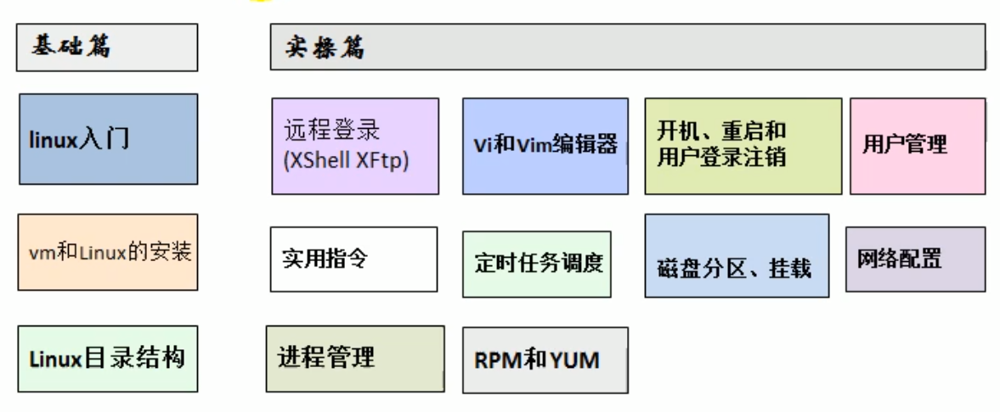
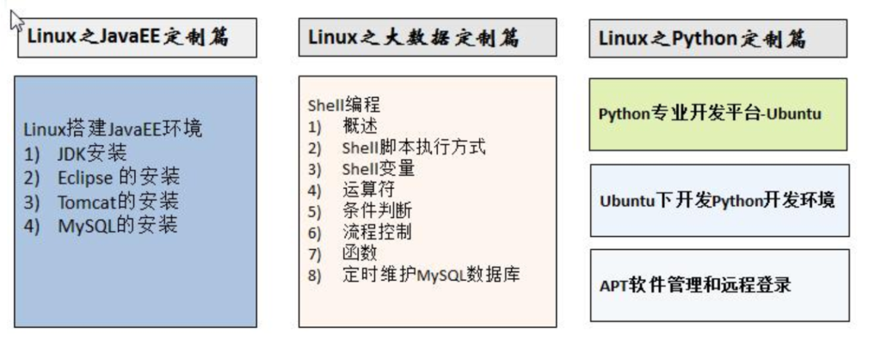
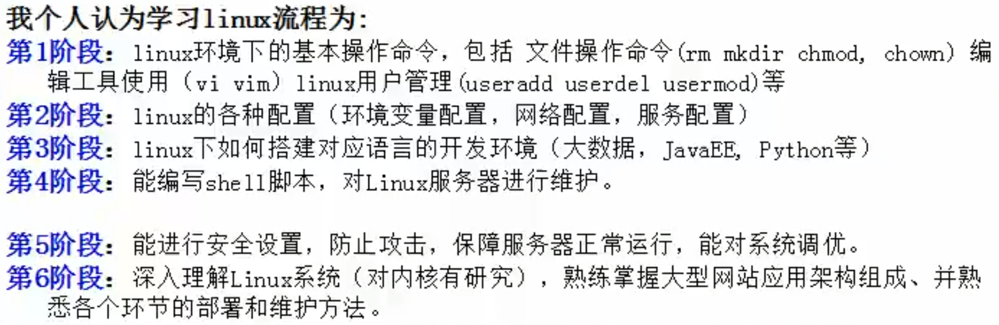
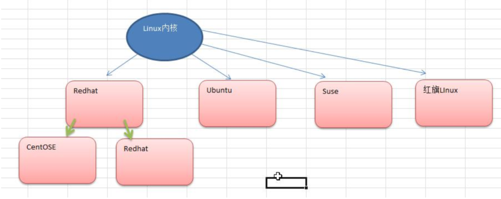
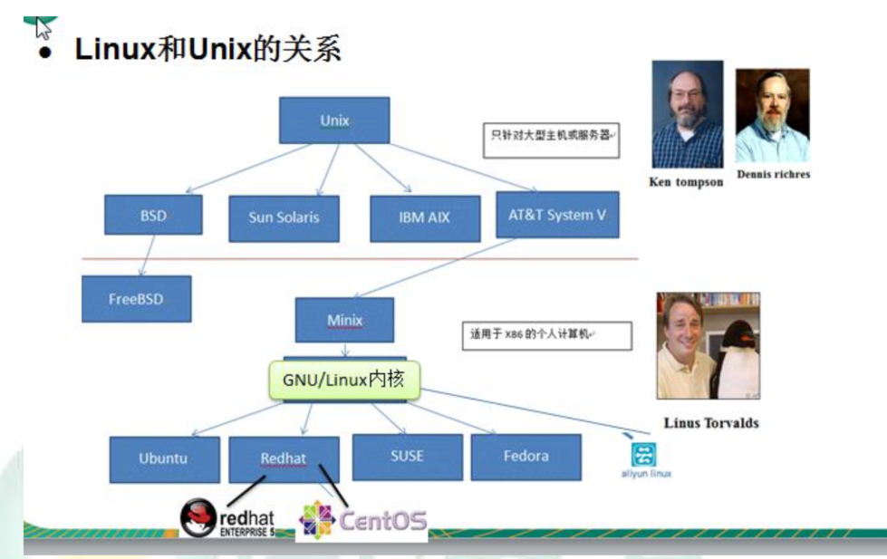

https://www.bilibili.com/video/BV17J411s7jm?p=8&vd_source=c14521c1b3b04371eccf5d5124a665a2 视频地址2018

VMware(v15.5.0)版本及以下的密钥生成器, 各位一起加油！
链接：https://pan.baidu.com/s/17a1lv7G3U2mcz5bOlCAiNA 
提取码：u5r9

centos 8.1.1911
https://pan.baidu.com/s/17W7gf6e6PvWG6xQEcsLKGQ
提取码:5mx2

ZF71R-DMX85-08DQY-8YMNC-PPHV8
激活密匙

root 

668818

## 内容介绍

发行版本：二次开发，做了应用程序

# 安装vm和Linux(CentOs)

G:\BaiduNetdiskDownload\Linux\资料\软件

wq：表示保存退出

wq!：表示强制保存退出

x：表示保存退出

!是强制执行

看到了17 

# Gcc/G++ 

https://www.bilibili.com/video/BV13U4y1p7kB?p=59&spm_id_from=333.880.my_history.page.click&vd_source=c14521c1b3b04371eccf5d5124a665a2 视频来源

https://subingwen.cn/linux/ 资料来源

