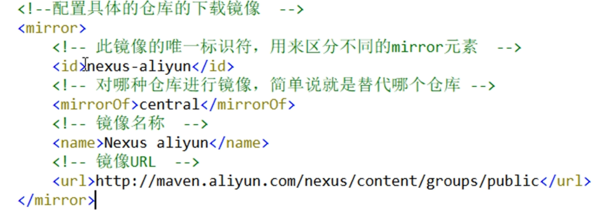
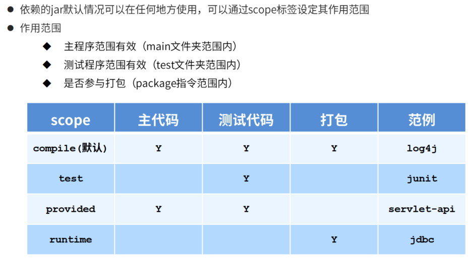

G:\BaiduNetdiskDownload\1、Maven从基础到高级应用\视频-Maven

## Maven简介


- 1 下载地址

http://maven.apache.org/  

http://maven.apache.org/download.cgi  

- 2 环境变量配置路径安装


### 本地仓库配置

- repository位置

D:\maven\repository

D:\soft\apache-maven-3.6.3-bin\apache-maven-3.6.3\conf


### 远程仓库配置



### 手工制作Maven项目


```xml
<?xml version="1.0" encoding="UTF-8"?>
<project
xmlns="http://maven.apache.org/POM/4.0.0"
xmlns:xsi="http://www.w3.org/2001/XMLSchema-instance"
xsi:schemaLocation="http://maven.apache.org/POM/4.0.0 http://maven.apache.org/maven-v4_0_0.xsd">
<modelVersion>4.0.0</modelVersion>
<groupId>com.itheima</groupId>
<artifactId>project-java</artifactId>
<version>1.0</version>
<packaging>jar</packaging>
<dependencies>
<dependency>
<groupId>junit</groupId>
<artifactId>junit</artifactId>
<version>4.12</version>
</dependency>
</dependencies>
</project>
```

maven命令


```xml
mvn compile #
mvn clean #
mvn test #
mvn package #
mvn install #
```

或者使用插件： 


### Idea创建

D:\soft\apache-maven-3.6.1\conf记得修 改setting文件

1. 创建空project，一定要是3.6.1一下版本无冲突

2. 
3. 
4. 
5. 
6. 
7. 在pom.xml中添加

```xml
<dependencies>
        <dependency>
            <groupId>junit</groupId>
            <artifactId>junit</artifactId>
            <version>4.12</version>
        </dependency>
    </dependencies>
```

8. 然后写Demo.java和DemoTest.java

```java
package com.itheima;

public class Demo {
    public String say(String name) {
        System.out.println("hello " + name);
        return "hello " + name;

    }
}
```


### 使用原型创建

1. 新建module


### 创建web工程


在web.xml中只保留

```xml
<?xml version="1.0" encoding="UTF-8"?>
<web-app version="2.4"
         xmlns="http://java.sun.com/xml/ns/j2ee"
         xmlns:xsi="http://www.w3.org/2001/XMLSchema-instance"
         xsi:schemaLocation="http://java.sun.com/xml/ns/j2ee http://java.sun.com/xml/ns/j2ee/web-app_2_4.xsd">
</web-app>
```

然后pom.xml删除干净

```xml
<?xml version="1.0" encoding="UTF-8"?>
<project xmlns="http://maven.apache.org/POM/4.0.0" xmlns:xsi="http://www.w3.org/2001/XMLSchema-instance" xsi:schemaLocation="http://maven.apache.org/POM/4.0.0 http://maven.apache.org/maven-v4_0_0.xsd">

  <modelVersion>4.0.0</modelVersion>
  <packaging>war</packaging>

  <name>web01</name>
  <groupId>com.itheima</groupId>
  <artifactId>web01</artifactId>
  <version>1.0-SNAPSHOT</version>
  
  <dependencies>
  </dependencies>

</project>
```

然后添加插件

```xml
 <build>
        <plugins>
            <plugin>

                <groupId>org.apache.tomcat.maven</groupId>
                <artifactId>tomcat7-maven-plugin</artifactId>
                <version>2.1</version>
                <configuration>
                    <port>80</port>
                    <path>/</path>
                </configuration>

            </plugin>
        </plugins>
    </build>
```


完整版pom.xml

```xml
<?xml version="1.0" encoding="UTF-8"?>
<project xmlns="http://maven.apache.org/POM/4.0.0" xmlns:xsi="http://www.w3.org/2001/XMLSchema-instance"
         xsi:schemaLocation="http://maven.apache.org/POM/4.0.0 http://maven.apache.org/maven-v4_0_0.xsd">
    <modelVersion>4.0.0</modelVersion>
    <packaging>war</packaging>

    <groupId>com.itheima</groupId>
    <artifactId>web01</artifactId>
    <version>1.0-SNAPSHOT</version>

    <dependencies>
        <dependency>
            <groupId>junit</groupId>
            <artifactId>junit</artifactId>
            <version>4.12</version>
            <scope>test</scope>
        </dependency>
    </dependencies>
    <build>
        <plugins>
            <plugin>
                <groupId>org.apache.tomcat.maven</groupId>
                <artifactId>tomcat7-maven-plugin</artifactId>
                <version>2.1</version>
                <configuration>
                    <port>80</port>
                    <path>/</path>
                </configuration>

            </plugin>
        </plugins>
    </build>
</project>
```

### 依赖管理


导入方式：

03用了的jar包，02可以用！


可选依赖


排除依赖


### 依赖范围




### 生命周期与插件

 


运行到generate-test-resource这个阶段的时候就需要执行插件

执行什么由goal决定，jar对源码打包


