# 入门开始

1. 数据库建表

```sql
CREATE TABLE tbl_employee(
	id INT(11) PRIMARY KEY AUTO_INCREMENT,
	last_name VARCHAR(255),
	gender CHAR(1),
	email VARCHAR(255)
)
```

2. 创建Employee.java   bean

   ```java
   public class Employee {//加上toString, getter setter
   	private Integer id;
   	private String lastName;
   	private String email;
   	private String gender;
   ```

3. mybatis_config.xml里个性化设置 自己的数据库链接

```xml
<?xml version="1.0" encoding="UTF-8" ?>
<!DOCTYPE configuration
PUBLIC "-//mybatis.org//DTD Config 3.0//EN"
"http://mybatis.org/dtd/mybatis-3-config.dtd">
<configuration>
	<environments default="development">
		<environment id="development">
			<transactionManager type="JDBC" />
			<dataSource type="POOLED">
				<property name="driver" value="com.mysql.jdbc.Driver" />
				<property name="url" value="jdbc:mysql://localhost:3306/mybatis" />
				<property name="username" value="root" />
				<property name="password" value="root" />
			</dataSource>
		</environment>
	</environments>
	
	<mappers>
		<mapper resource="EmployeeMapper.xml" />
	</mappers>
</configuration>
```

4. MyBatisTest.java中写代码

```java
class MyBatisTest {

	public SqlSessionFactory getSqlSessionFactory() throws IOException {
		// 2.1.2 Building SqlSessionFactory from XML
		String resource = "mybatis-config.xml";
		InputStream inputStream = Resources.getResourceAsStream(resource);
		return new SqlSessionFactoryBuilder().build(inputStream);

	}

	/*
	 * 1. xml配置创建一个SqlSessionFactory对象
	 */
	@Test
	public void test() throws IOException {

		// 2.1.2 Building SqlSessionFactory from XML
		SqlSessionFactory sqlSessionFactory = getSqlSessionFactory();

		// 2.1.4 Acquiring a SqlSession from SqlSessionFactory
		SqlSession openSession = sqlSessionFactory.openSession();
		try {
			// com.atguigu.mybatis.EmployeeMapper.selectEmp标识
			// 1 指行sql要用的参数
			Employee employee = openSession.selectOne("com.atguigu.mybatis.EmployeeMapper.getEmpById", 1);
			System.out.println(employee);
		} finally {
			openSession.close();
		}
	}

	@Test
	public void test01() throws IOException {
		SqlSessionFactory sqlSessionFactory = getSqlSessionFactory();
		SqlSession openSession = sqlSessionFactory.openSession();

		try {
			// 获取接口实现类
			EmployeeMapper mapper = openSession.getMapper(EmployeeMapper.class);
			// do work
			Employee employee = mapper.getEmpById(1);
			System.out.println(mapper.getClass());
			System.out.println(employee);

		} finally {
			openSession.close();
		}
	}

}

```

4. EmployeeMapper.xml中写sql

==id = #{id}==， 从传递过来的参数中取出id值

```xml
<?xml version="1.0" encoding="UTF-8" ?>
<!DOCTYPE mapper
PUBLIC "-//mybatis.org//DTD Mapper 3.0//EN"
"http://mybatis.org/dtd/mybatis-3-mapper.dtd">
<mapper namespace="com.atguigu.mybatis.dao.EmployeeMapper">
	<select id="getEmpById" resultType="com.atguigu.mybatis.bean.Employee">
		select id, last_name lastName, gender, email from tbl_employee where id = #{id}
	</select>
</mapper> 
```

## 4 接口编程

1. 写一个接口

```java
public interface EmployeeMapper {
	public Employee getEmpById(Integer id);
}
```

2. 修改EmployeeMapper.xml文件

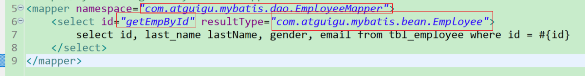

3. 然后就是 在MyBatisTest.java中

注意

```
 * 1、接口式编程
 * 	原生：		Dao		====>  DaoImpl
 * 	mybatis：	Mapper	====>  xxMapper.xml
 * 
 * 2、SqlSession代表和数据库的一次会话；用完必须关闭；
 * 3、SqlSession和connection一样她都是非线程安全。每次使用都应该去获取新的对象。
 * 4、mapper接口没有实现类，但是mybatis会为这个接口生成一个代理对象。
 * 		（将接口和xml进行绑定）
 * 		EmployeeMapper empMapper =	sqlSession.getMapper(EmployeeMapper.class);
 * 5、两个重要的配置文件：
 * 		mybatis的全局配置文件：包含数据库连接池信息，事务管理器信息等...系统运行环境信息
 * 		sql映射文件：保存了每一个sql语句的映射信息：
 * 					将sql抽取出来。	
```

```java
public SqlSessionFactory getSqlSessionFactory() throws IOException {
		// 2.1.2 Building SqlSessionFactory from XML
		String resource = "mybatis-config.xml";
		InputStream inputStream = Resources.getResourceAsStream(resource);
		return new SqlSessionFactoryBuilder().build(inputStream);

	}
	@Test
	public void test01() throws IOException {
		//1 获取sqlSessionFactory对象
		SqlSessionFactory sqlSessionFactory = getSqlSessionFactory();
		// 2 获取SqlSession
		SqlSession openSession = sqlSessionFactory.openSession();
		
		try {
			// 3 获取接口实现类
			EmployeeMapper mapper = openSession.getMapper(EmployeeMapper.class);
			// do work 
			Employee employee = mapper.getEmpById(1);
			Syste***m.out.println(mapper.getClass()); //代理对象
			System.out.println(employee);

		} finally {
			openSession.close();
		}
	}
```

## 6 _ _全局配置文件_引入dtd约束

方便后面查看提示

http://mybatis.org/dtd/mybatis-3-mapper.dtd

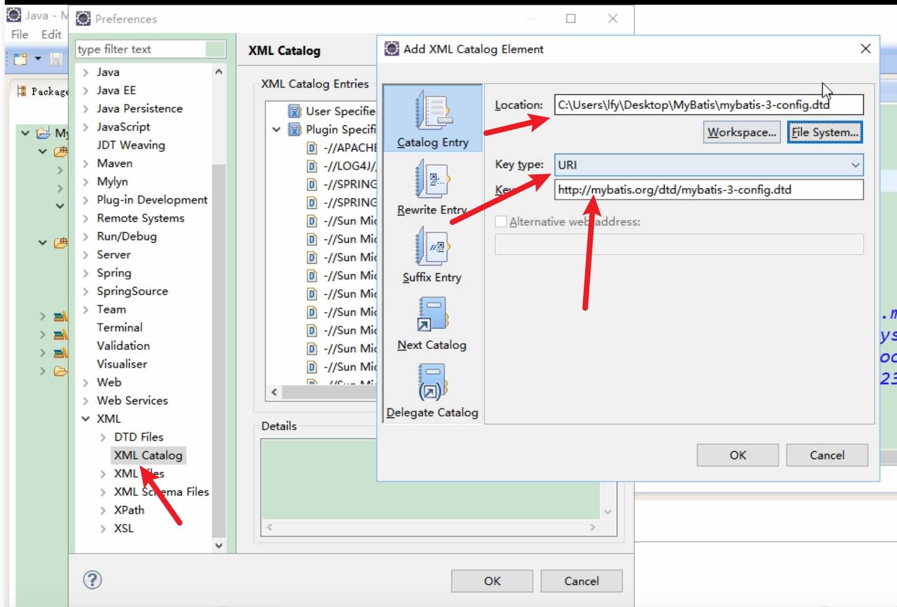


## 7 全局配置文件_properties_引入外部配置文件


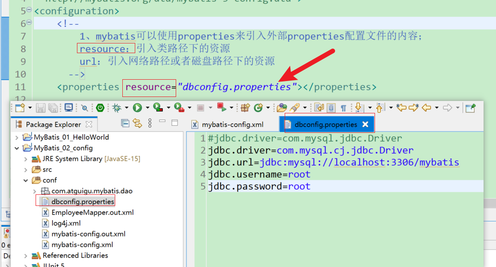

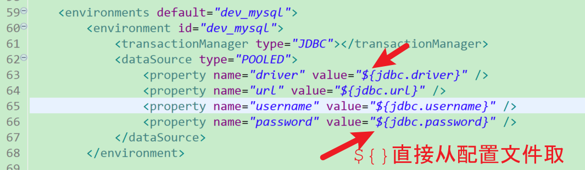

后面使用spring之后 这里的配置都会交给spring 这个标签也不咋用了

## 8_全局配置文件_settings_运行时行为设置

在mybatis-config.xml里面

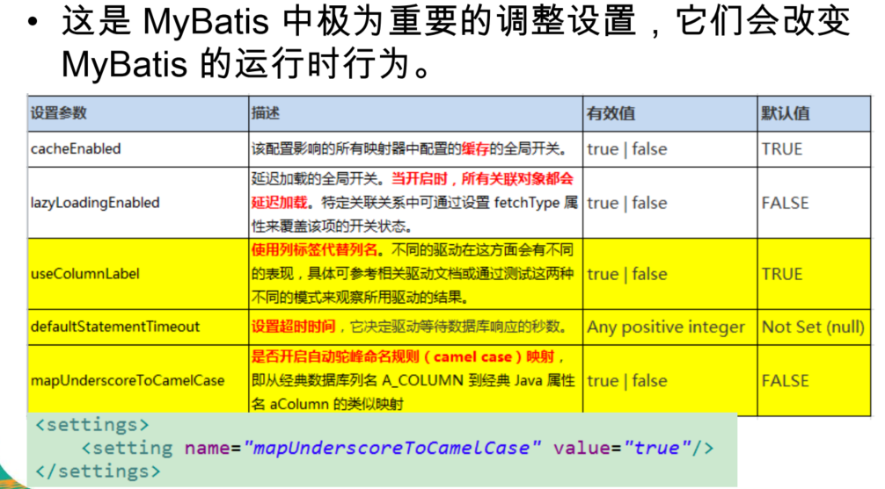

## 9_全局配置文件_typeAliases_别名

- 1 typeAlias:为某个java类型起别名

```
<!-- 1、typeAlias:为某个java类型起别名
				type:指定要起别名的类型全类名;默认别名就是类名小写；employee
				alias:指定新的别名
		 -->
		<!-- <typeAlias type="com.atguigu.mybatis.bean.Employee" alias="emp"/> -->
```

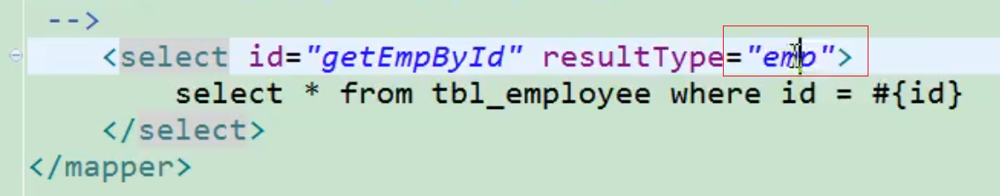

- 2 package:为某个包下的所有类批量起别名 

注意： 别名不区分大小写 所以大写也对

```
<!-- 2、package:为某个包下的所有类批量起别名 
				name：指定包名（为当前包以及下面所有的后代包的每一个类都起一个默认别名（类名小写），）
		-->
		<package name="com.atguigu.mybatis.bean"/>
```

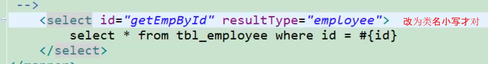

- 3 出现重复的类使用@Alias注解

```
<typeAliases>
		<!-- 3、批量起别名的情况下，使用@Alias注解为某个类型指定新的别名 -->
	</typeAliases>
```


## 10_全局配置文件_typeHandlers_类型处理器简介

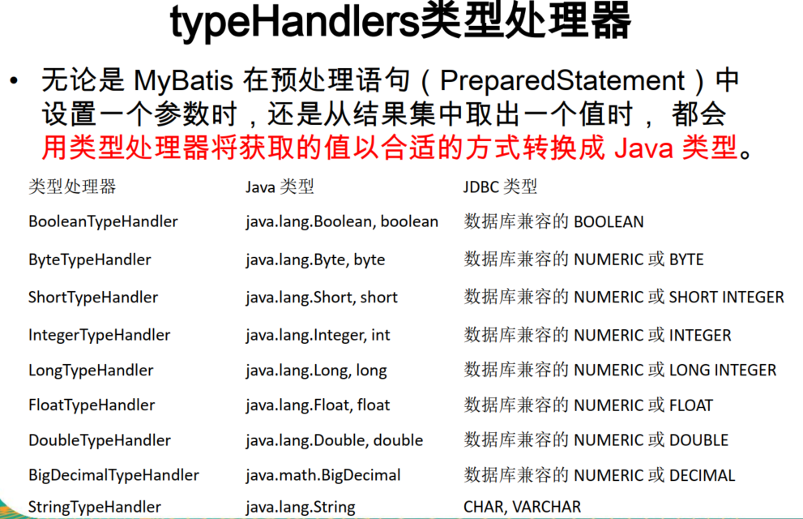

## 11_全局配置文件_plugins_插件简介

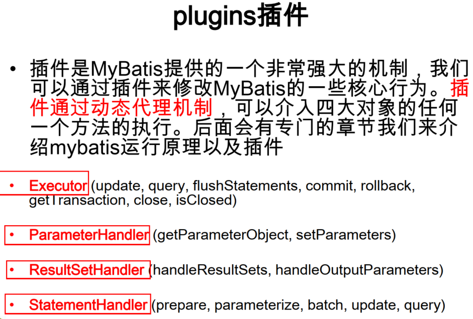

## 12_全局配置文件_enviroments_运行环境

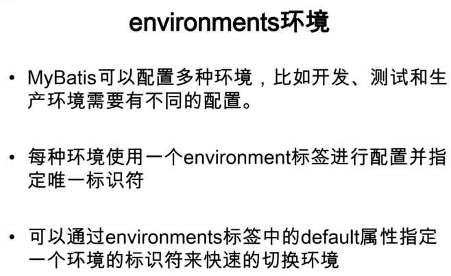


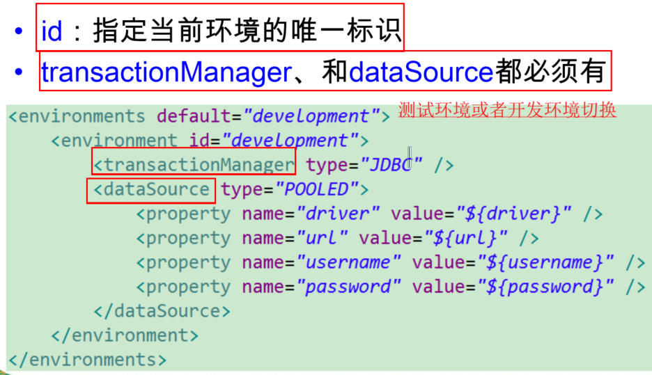

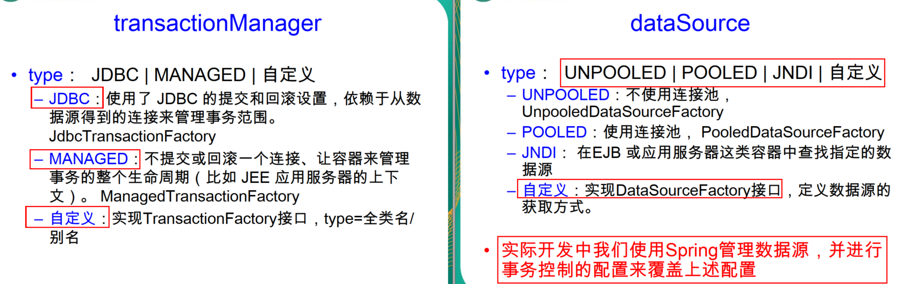

## 13_全局配置文件_databaseIdProvider_多数据库支持

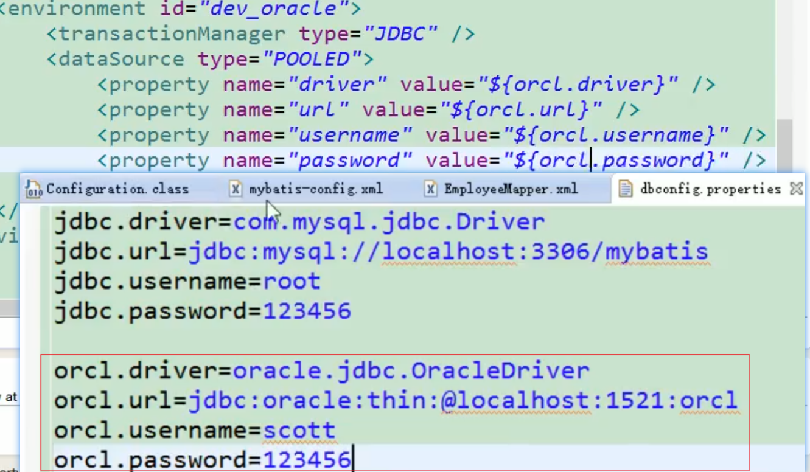

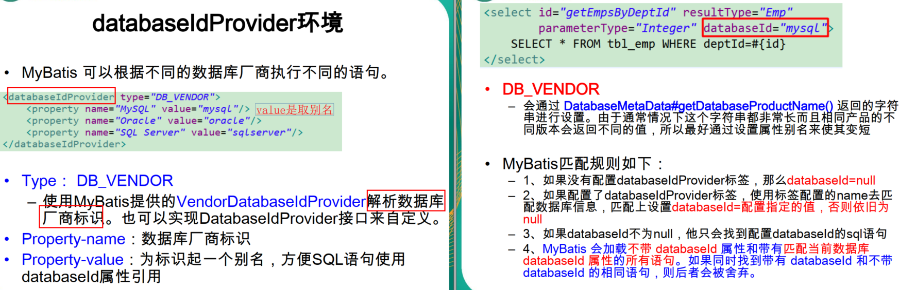


## 14_全局配置文件_mappers_sql映射注册

```xml
<!-- 将我们写好的sql映射文件（EmployeeMapper.xml）一定要注册到全局配置文件（mybatis-config.xml）中 -->
	<!-- 6、mappers：将sql映射注册到全局配置中 -->
	<mappers>
		<!-- 
			mapper:注册一个sql映射 
				注册配置文件
				resource：引用类路径下的sql映射文件
					mybatis/mapper/EmployeeMapper.xml
				url：引用网络路径或者磁盘路径下的sql映射文件
					file:///var/mappers/AuthorMapper.xml
					
				注册接口
				class：引用（注册）接口，
					1、有sql映射文件，映射文件名必须和接口同名，并且放在与接口同一目录下；
					2、没有sql映射文件，所有的sql都是利用注解写在接口上;
					推荐：
						比较重要的，复杂的Dao接口我们来写sql映射文件
						不重要，简单的Dao接口为了开发快速可以使用注解；
		-->
		<!-- <mapper resource="mybatis/mapper/EmployeeMapper.xml"/> -->
		<!-- <mapper class="com.atguigu.mybatis.dao.EmployeeMapperAnnotation"/> -->
		
		<!-- 批量注册： -->
		<package name="com.atguigu.mybatis.dao"/>
	</mappers>
```

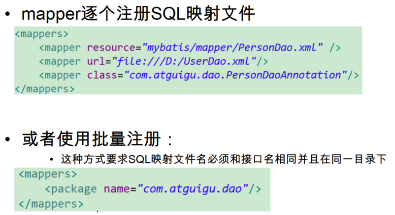

直接利用注解

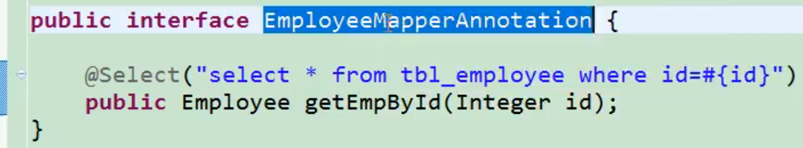

```
<mapper class="com.atguigu.mybatis.dao.EmployeeMapperAnnotation"/>
```

## 15_小结

标签在编写的时候需要有顺序！！！

## 16_映射文件_增删改查

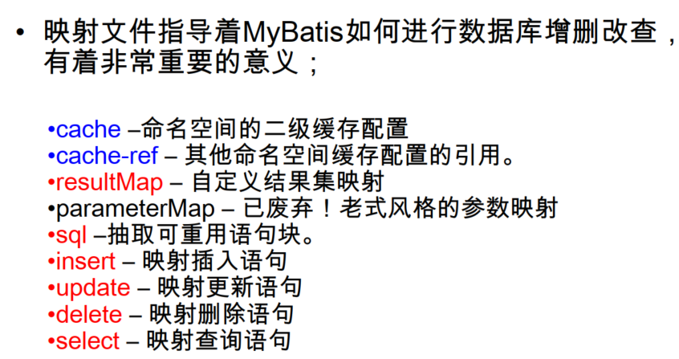

- 1.EmployeeMapper.java

```java
public interface EmployeeMapper {

	// 多条记录封装一个map：Map<Integer,Employee>:键是这条记录的主键，值是记录封装后的javaBean
	// @MapKey:告诉mybatis封装这个map的时候使用哪个属性作为map的key
	@MapKey("lastName")
	public Map<String, Employee> getEmpByLastNameLikeReturnMap(String lastName);

	// 返回一条记录的map；key就是列名，值就是对应的值
	public Map<String, Object> getEmpByIdReturnMap(Integer id);

	public List<Employee> getEmpsByLastNameLike(String lastName);

	public Employee getEmpByMap(Map<String, Object> map);

	public Employee getEmpByIdAndLastName(@Param("id") Integer id, @Param("lastName") String lastName);

	public Employee getEmpById(Integer id);

	public Long addEmp(Employee employee);

	public boolean updateEmp(Employee employee);

	public void deleteEmpById(Integer id);

}
```

- 2 EmployeeMapper.xml

```xml
<?xml version="1.0" encoding="UTF-8" ?>
<!DOCTYPE mapper
 PUBLIC "-//mybatis.org//DTD Mapper 3.0//EN"
 "http://mybatis.org/dtd/mybatis-3-mapper.dtd">
<mapper namespace="com.atguigu.mybatis.dao.EmployeeMapper">
<!-- 
namespace:名称空间;指定为接口的全类名
id：唯一标识
resultType：返回值类型
#{id}：从传递过来的参数中取出id值
public Employee getEmpById(Integer id);
 -->
 
 	<!--public Map<Integer, Employee> getEmpByLastNameLikeReturnMap(String lastName);  -->
 	<select id="getEmpByLastNameLikeReturnMap" resultType="com.atguigu.mybatis.bean.Employee">
 		select * from tbl_employee where last_name like #{lastName}
 	</select>
 
 	<!--public Map<String, Object> getEmpByIdReturnMap(Integer id);  -->
 	<select id="getEmpByIdReturnMap" resultType="map">
 		select * from tbl_employee where id=#{id}
 	</select>
 
	<!-- public List<Employee> getEmpsByLastNameLike(String lastName); -->
	<!--resultType：如果返回的是一个集合，要写集合中元素的类型  -->
	<select id="getEmpsByLastNameLike" resultType="com.atguigu.mybatis.bean.Employee">
		select * from tbl_employee where last_name like #{lastName}
	</select>

 	<!-- public Employee getEmpByMap(Map<String, Object> map); -->
 	<select id="getEmpByMap" resultType="com.atguigu.mybatis.bean.Employee">
 		select * from ${tableName} where id=${id} and last_name=#{lastName}
 	</select>
 
 	<!--  public Employee getEmpByIdAndLastName(Integer id,String lastName);-->
 	<select id="getEmpByIdAndLastName" resultType="com.atguigu.mybatis.bean.Employee">
 		select * from tbl_employee where id = #{id} and last_name=#{lastName}
 	</select>
 	
 	<select id="getEmpById" resultType="com.atguigu.mybatis.bean.Employee">
		select * from tbl_employee where id = #{id}
	</select>
	<select id="getEmpById" resultType="com.atguigu.mybatis.bean.Employee"
		databaseId="mysql">
		select * from tbl_employee where id = #{id}
	</select>
	<select id="getEmpById" resultType="com.atguigu.mybatis.bean.Employee"
		databaseId="oracle">
		select EMPLOYEE_ID id,LAST_NAME	lastName,EMAIL email 
		from employees where EMPLOYEE_ID=#{id}
	</select>
	
	<!-- public void addEmp(Employee employee); -->
	<!-- parameterType：参数类型，可以省略， 
	获取自增主键的值：
		mysql支持自增主键，自增主键值的获取，mybatis也是利用statement.getGenreatedKeys()；
		useGeneratedKeys="true"；使用自增主键获取主键值策略
		keyProperty；指定对应的主键属性，也就是mybatis获取到主键值以后，将这个值封装给javaBean的哪个属性
	-->
	<insert id="addEmp" parameterType="com.atguigu.mybatis.bean.Employee"
		useGeneratedKeys="true" keyProperty="id" databaseId="mysql">
		insert into tbl_employee(last_name,email,gender) 
		values(#{lastName},#{email},#{gender})
	</insert>
	
	<!-- 
	获取非自增主键的值：
		Oracle不支持自增；Oracle使用序列来模拟自增；
		每次插入的数据的主键是从序列中拿到的值；如何获取到这个值；
	 -->
	<insert id="addEmp" databaseId="oracle">
		<!-- 
		keyProperty:查出的主键值封装给javaBean的哪个属性
		order="BEFORE":当前sql在插入sql之前运行
			   AFTER：当前sql在插入sql之后运行
		resultType:查出的数据的返回值类型
		
		BEFORE运行顺序：
			先运行selectKey查询id的sql；查出id值封装给javaBean的id属性
			在运行插入的sql；就可以取出id属性对应的值
		AFTER运行顺序：
			先运行插入的sql（从序列中取出新值作为id）；
			再运行selectKey查询id的sql；
		 -->
		<selectKey keyProperty="id" order="BEFORE" resultType="Integer">
			<!-- 编写查询主键的sql语句 -->
			<!-- BEFORE-->
			select EMPLOYEES_SEQ.nextval from dual 
			<!-- AFTER：
			 select EMPLOYEES_SEQ.currval from dual -->
		</selectKey>
		
		<!-- 插入时的主键是从序列中拿到的 -->
		<!-- BEFORE:-->
		insert into employees(EMPLOYEE_ID,LAST_NAME,EMAIL) 
		values(#{id},#{lastName},#{email<!-- ,jdbcType=NULL -->}) 
		<!-- AFTER：
		insert into employees(EMPLOYEE_ID,LAST_NAME,EMAIL) 
		values(employees_seq.nextval,#{lastName},#{email}) -->
	</insert>
	
	<!-- public void updateEmp(Employee employee);  -->
	<update id="updateEmp">
		update tbl_employee 
		set last_name=#{lastName},email=#{email},gender=#{gender}
		where id=#{id}
	</update>
	
	<!-- public void deleteEmpById(Integer id); -->
	<delete id="deleteEmpById">
		delete from tbl_employee where id=#{id}
	</delete>
	
	
</mapper
```

- 3 测试

```java
@Test
	public void test03() throws IOException {

		SqlSessionFactory sqlSessionFactory = getSqlSessionFactory();
		// 1、获取到的SqlSession不会自动提交数据
		SqlSession openSession = sqlSessionFactory.openSession();

		try {
			EmployeeMapper mapper = openSession.getMapper(EmployeeMapper.class);
			// 测试添加
			Employee employee = new Employee(null, "jerry4", null, "1");
			mapper.addEmp(employee);
			System.out.println(employee.getId());

			// 测试修改
			// Employee employee = new Employee(1, "Tom", "jerry@atguigu.com", "0");
			// boolean updateEmp = mapper.updateEmp(employee);
			// System.out.println(updateEmp);
			// 测试删除
			// mapper.deleteEmpById(2);
			// 2、手动提交数据
			openSession.commit();
		} finally {
			openSession.close();
		}

	}
```


## 17_映射文件_insert_获取自增主键的值

获取自增主键的值：
		mysql支持自增主键，自增主键值的获取，mybatis也是利用statement.getGenreatedKeys()；
		==useGeneratedKeys="true"==；使用自增主键获取主键值策略
		keyProperty；指定对应的==主键属性==，也就是mybatis获取到主键值以后，将这个值封装给javaBean的哪个属性

```XML
<insert id="addEmp" parameterType="com.atguigu.mybatis.bean.Employee"
		useGeneratedKeys="true" keyProperty="id" databaseId="mysql">
		insert into tbl_employee(last_name,email,gender) 
		values(#{lastName},#{email},#{gender})
	</insert>
```

## 18_映射文件_insert_Oracle使用序列生成主键演示

Oracle不支持自增；Oracle使用序列来模拟自增；
		每次插入的数据的主键是从序列中拿到的值；如何获取到这个值；

select EMPLOYEES_SEQ.nextval from dual 可以的到下一个序列值然后再插入

## 19_映射文件_insert_获取非自增主键的值_selectKey

```xml
<insert id="addEmp" databaseId="oracle">
		<!-- 
		keyProperty:查出的主键值封装给javaBean的哪个属性
		order="BEFORE":当前sql在插入sql之前运行
			   AFTER：当前sql在插入sql之后运行
		resultType:查出的数据的返回值类型
		
		BEFORE运行顺序：
			先运行selectKey查询id的sql；查出id值封装给javaBean的id属性
			在运行插入的sql；就可以取出id属性对应的值
		AFTER运行顺序：
			先运行插入的sql（从序列中取出新值作为id）；
			再运行selectKey查询id的sql；
		 -->
		 
		 
		<selectKey keyProperty="id" order="BEFORE" resultType="Integer">
			<!-- 编写查询主键的sql语句 -->
			<!-- BEFORE-->
			select EMPLOYEES_SEQ.nextval from dual 
			<!-- AFTER：
			 select EMPLOYEES_SEQ.currval from dual -->
		</selectKey>
		
		<!-- 插入时的主键是从序列中拿到的 -->
		<!-- BEFORE:-->
		insert into employees(EMPLOYEE_ID,LAST_NAME,EMAIL) 
		values(#{id},#{lastName},#{email<!-- ,jdbcType=NULL -->}) 
		<!-- AFTER：
		insert into employees(EMPLOYEE_ID,LAST_NAME,EMAIL) 
		values(employees_seq.nextval,#{lastName},#{email}) -->
	</insert>
```

## 20_映射文件_参数处理_单个参数&多个参数&命名参数

- 单个参数：mybatis不会做特殊处理，
  	`#{参数名/任意名}`：取出参数值。

- 多个参数：mybatis会做特殊处理。
  	多个参数会被封装成 一个`map`，
  		`key：param1...paramN,`或者参数的==索引==也可以,但是这样太多了就麻烦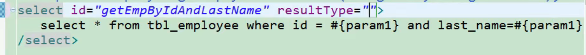

  ​		`value：`传入的参数值
  ​	`#{}` 就是从map中获取指定的key的值；

	异常：
	org.apache.ibatis.binding.BindingException: 
	Parameter 'id' not found. 
	Available parameters are [1, 0, param1, param2]
	操作：
		方法：public Employee getEmpByIdAndLastName(Integer id,String lastName);
		取值：#{id},#{lastName}

**【命名参数】**：明确指定封装参数时map的key；@Param("id")
	多个参数会被封装成 一个map，
		key：使用@Param注解指定的值
		value：参数值
	#{指定的key}取出对应的参数值

1. 先到EmployeeMapper.java中

```java
public Employee getEmpByIdAndLastName(@Param("id") Integer id, @Param("lastName") String lastName);
```

2. 然后查询

```java
<!--  public Employee getEmpByIdAndLastName(Integer id,String lastName);-->
<select id="getEmpByIdAndLastName" resultType="com.atguigu.mybatis.bean.Employee">
	select * from tbl_employee where id = #{id} and last_name=#{lastName}
</select>
```

## 21_映射文件_参数处理_POJO&Map&TO


- 1POJO：
  如果多个参数**正好是我们业务逻辑的数据模型**，我们就可以直接传入pojo；
  	`#{属性名}：`取出传入的pojo的属性值	


- 2 Map：
  如果多个参数不**是业务模型中的数据**，没有对应的pojo，不经常使用，为了方便，我们也可以传入map
  	`#{key}：`取出map中对应的值

```java
public Employee getEmpByMap(Map<String, Object> map);
```

然后EmployeeMapper.java

```java
@Test
public void test04() throws IOException {

    SqlSessionFactory sqlSessionFactory = getSqlSessionFactory();
    // 1、获取到的SqlSession不会自动提交数据
    SqlSession openSession = sqlSessionFactory.openSession();

    try {
        EmployeeMapper mapper = openSession.getMapper(EmployeeMapper.class);
        // Employee employee = mapper.getEmpByIdAndLastName(1, "tom");
        Map<String, Object> map = new HashMap<>();
        map.put("id", 2);
        map.put("lastName", "Tom");
        map.put("tableName", "tbl_employee");
        Employee employee = mapper.getEmpByMap(map);

        System.out.println(employee);

        /*
			 * List<Employee> like = mapper.getEmpsByLastNameLike("%e%"); for (Employee
			 * employee : like) { System.out.println(employee); }
			 */

        /*
			 * Map<String, Object> map = mapper.getEmpByIdReturnMap(1);
			 * System.out.println(map);
			 */
        /*
			 * Map<String, Employee> map = mapper.getEmpByLastNameLikeReturnMap("%r%");
			 * System.out.println(map);
			 */

    } finally {
        openSession.close();
    }
}
```

```xml
 	<select id="getEmpByMap" resultType="com.atguigu.mybatis.bean.Employee">
 		select * from tbl_employee where id=${id} and last_name=#{lastName}
 	</select>
```

- 3 TO：
  如果多个参数不是业务模型中的数据，但是经常要使用，推荐来编写一个TO（Transfer Object）数据传输对象,例如查分页

  ```java
  Page{
  	int index;
  	int size;
  }
  ```

## 22_映射文件_参数处理_参数封装扩展思考

========================思考================================	
`public Employee getEmp(@Param("id")Integer id,String lastName);`
	取值：`id==>#{id/param1}   lastName==>#{param2}`

`public Employee getEmp(Integer id,@Param("e")Employee emp);`
	取值：`id==>#{param1}    lastName===>#{param2.lastName/或者 e.lastName}`

**特别注意：**如果是Collection（List、Set）类型或者是数组，
		 也会特殊处理。也是<u>把传入的list或者数组封装在map中</u>。
			key：Collection（collection）,如果是List还可以使用这个key(list)
				数组(array)
`public Employee getEmpById(List<Integer> ids);`
	取值：取出第一个id的值：  **` #{list[0]}`**

## 23_源码分析_参数处理_参数封装map的过程

========================结合源码，mybatis怎么处理参数==========================
总结：参数多时会封装map，为了不混乱，我们可以使用@Param来指定封装时使用的key；
#{key}就可以取出map中的值；

(@Param("id")Integer id,@Param("lastName")String lastName);
ParamNameResolver解析参数封装map的；
//1、names：{0=id, 1=lastName}；构造器的时候就确定好了 

	确定流程：
	1.获取每个标了param注解的参数的@Param的值：id，lastName；  赋值给name;
	2.每次解析一个参数给map中保存信息：（key：参数索引，value：name的值）
		name的值：
			标注了param注解：注解的值
			没有标注：
				1.全局配置：useActualParamName（jdk1.8）：name=参数名
				2.name=map.size()；相当于当前元素的索引
	{0=id, 1=lastName,2=2}


args【1，"Tom",'hello'】:

```java
public Object getNamedParams(Object[] args) {
    final int paramCount = names.size();
    //1、参数为null直接返回
    if (args == null || paramCount == 0) {
      return null;
     
//2、如果只有一个元素，并且没有Param注解；args[0]：单个参数直接返回
} else if (!hasParamAnnotation && paramCount == 1) {
  return args[names.firstKey()];
  
//3、多个元素或者有Param标注
} else {
  final Map<String, Object> param = new ParamMap<Object>();
  int i = 0;
  
  //4、遍历names集合；{0=id, 1=lastName,2=2}
  for (Map.Entry<Integer, String> entry : names.entrySet()) {
  
  	//names集合的value作为key;  names集合的key又作为取值的参考args[0]:args【1，"Tom"】:
  	//eg:{id=args[0]:1,lastName=args[1]:Tom,2=args[2]}
    param.put(entry.getValue(), args[entry.getKey()]);
     // add generic param names (param1, param2, ...)param
    //额外的将每一个参数也保存到map中，使用新的key：param1...paramN
    //效果：有Param注解可以#{指定的key}，或者#{param1}
    final String genericParamName = GENERIC_NAME_PREFIX + String.valueOf(i + 1);
    // ensure not to overwrite parameter named with @Param
    if (!names.containsValue(genericParamName)) {
      param.put(genericParamName, args[entry.getKey()]);
    }
    i++;
  }
  return param;
}
```

## 24_映射文件_参数处理_#与$取值区别

- 参数值的获取
  `#{}：`可以获取map中的值或者pojo对象属性的值；
  `${}：`可以获取map中的值或者pojo对象属性的值；

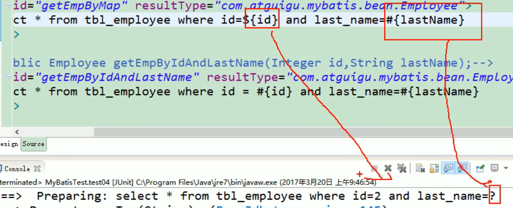

`select * from tbl_employee where id=${id} and last_name=#{lastName}
Preparing: select * from tbl_employee where id=2 and last_name=?`
	区别：
		`#{}:`是以**预编译**的形式，将参数设置到sql语句中；PreparedStatement；**防止sql注入**
		`${}:`取出的值**直接拼装在sql语句**中；**会有安全问题**；
		大多情况下，我们去参数的值都应该去==使用#{}==

​	原生jdbc**不支持占位符**的地方我们就可以**使用${}进行取值**
​	比如分表、排序。。。；按照年份分表拆分

```sql
select * from ${year}_salary where xxx;
select * from tbl_employee order by ${f_name} ${order}
```

先到mapper.java中存入 `map.put("tableName", "tbl_employee");`然后使用取值${}

```xml
<!-- public Employee getEmpByMap(Map<String, Object> map); -->
 	<select id="getEmpByMap" resultType="com.atguigu.mybatis.bean.Employee">
 		select * from ${tableName} where id=${id} and last_name=#{lastName}
 	</select>
```

## 25_映射文件_参数处理_#取值时指定参数相关规则

- `#{}:`更丰富的用法：
  	**规定参数的一些规则：**
  	javaType、 jdbcType、 mode（存储过程）、 numericScale、
  	resultMap、 typeHandler、 jdbcTypeName、 expression（未来准备支持的功能）；

  ​    jdbcType通常需要在某种特定的条件下被设置：
   		在我们数据为null的时候，有些数据库可能不能识别mybatis对null的默认处理。比如Oracle（报错）；

  ​		JdbcType OTHER：无效的类型；因为mybatis对所有的null都映射的是原生Jdbc的OTHER类型，oracle不能正确处理;

  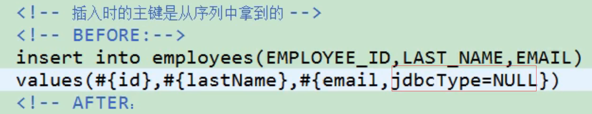

  ​		由于全局配置中：jdbcTypeForNull=OTHER；oracle不支持；两种办法	

```xml
1、#{email,jdbcType=OTHER};
2、jdbcTypeForNull=NULL
<setting name="jdbcTypeForNull" value="NULL"/>
```


## 26_映射文件_select_返回List

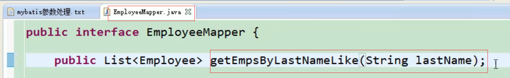

resultType：如果返回的是一个集合，要写**集合中元素的类型**

```xml
<!-- public List<Employee> getEmpsByLastNameLike(String lastName); -->
	<!--resultType：如果返回的是一个集合，要写集合中元素的类型  -->
	<select id="getEmpsByLastNameLike" resultType="com.atguigu.mybatis.bean.Employee">
		select * from tbl_employee where last_name like #{lastName}
	</select>
```

然后测试

```
@Test
	public void test04() throws IOException {

		SqlSessionFactory sqlSessionFactory = getSqlSessionFactory();
		// 1、获取到的SqlSession不会自动提交数据
		SqlSession openSession = sqlSessionFactory.openSession();

		try {
			EmployeeMapper mapper = openSession.getMapper(EmployeeMapper.class);
			// Employee employee = mapper.getEmpByIdAndLastName(1, "tom");
			
			System.out.println(employee);

		     List<Employee> like = mapper.getEmpsByLastNameLike("%e%");
             for (Employee employee : like) { System.out.println(employee); }
			 
```

## 27_映射文件_select_记录封装map

- 一条记录

1. EmployeeMapper.java

```java
// 返回一条记录的map；key就是列名，值就是对应的值
	public Map<String, Object> getEmpByIdReturnMap(Integer id);
```

2. xml

```xml
<!--public Map<String, Object> getEmpByIdReturnMap(Integer id);  -->
<select id="getEmpByIdReturnMap" resultType="map">
	select * from tbl_employee where id=#{id}
</select>
```

- 多条记录

1. EmployeeMapper.java

```java
// 多条记录封装一个map：Map<Integer,Employee>:键是这条记录的主键，值是记录封装后的javaBean
	// @MapKey:告诉mybatis封装这个map的时候使用哪个属性作为map的key
	@MapKey("lastName")
	public Map<String, Employee> getEmpByLastNameLikeReturnMap(String lastName);
```

2. xml

```xml
<!--public Map<Integer, Employee> getEmpByLastNameLikeReturnMap(String lastName);  -->
    <select id="getEmpByLastNameLikeReturnMap" resultType="com.atguigu.mybatis.bean.Employee">
    select * from tbl_employee where last_name like #{lastName}
</select>
```

3. 测试

```java
Map<String, Employee> map = mapper.getEmpByLastNameLikeReturnMap("%r%");
System.out.println(map);
```

## 28_映射文件_select_resultMap_自定义结果映射规则

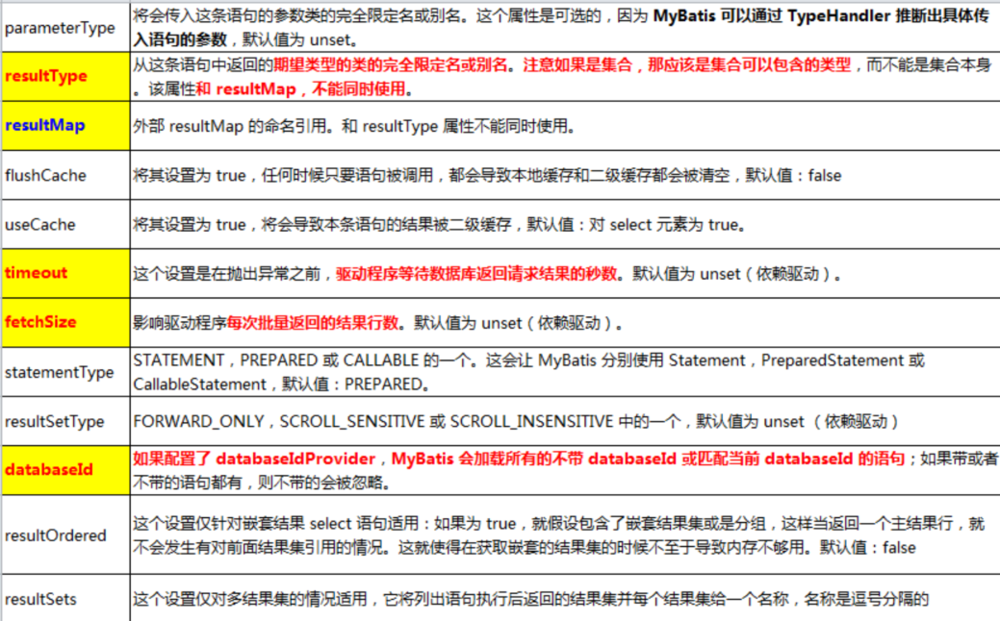

哪个属性对应哪列我说了算

```xml
<mapper namespace="com.atguigu.mybatis.dao.EmployeeMapperPlus">

	<!--自定义某个javaBean的封装规则
	type：自定义规则的Java类型
	id:唯一id方便引用代替之前的resultType类似
	  -->
	<resultMap type="com.atguigu.mybatis.bean.Employee" id="MySimpleEmp">
		<!--指定主键列的封装规则
		id定义主键会底层有优化；
		column：指定哪一列
		property：指定对应的javaBean属性
		  -->
		<id column="id" property="id"/>
		<!-- 定义普通列封装规则 -->
		<result column="last_name" property="lastName"/>
		<!-- 其他不指定的列会自动封装：我们只要写resultMap就把全部的映射规则都写上。 -->
		<result column="email" property="email"/>
		<result column="gender" property="gender"/>
	</resultMap>
```

## 29_映射文件_select_resultMap_关联查询_环境搭建


30_映射文件_select_resultMap_关联查询_级联属性封装结果


31_映射文件_select_resultMap_关联查询_association定义关联对象封装规则


32_映射文件_select_resultMap_关联查询_association分步查询


33_映射文件_select_resultMap_关联查询_分步查询&延迟加载


34_映射文件_select_resultMap_关联查询_collection定义关联集合封装规则


35_映射文件_select_resultMap_关联查询_collection分步查询&延迟加载


36_映射文件_select_resultMap_分步查询传递多列值&fetchType


37_映射文件_select_resultMap_discriminator鉴别器


38_动态sql_简介&环境搭建


39_动态sql_if_判断&OGNL


40_动态sql_where_查询条件


41_动态sql_trim_自定义字符串截取


42_动态sql_choose_分支选择


43_动态sql_set_与if结合的动态更新


44_动态sql_foreach_遍历集合


45_动态sql_foreach_mysql下foreach批量插入的两种方式


46_动态sql_foreach_oracle下批量插入的两种方式


47_动态sql_foreach_oracle下foreach批量保存两种方式


48_动态sql_内置参数_parameter&_databaseId


49_动态sql_bind_绑定


50_动态sql_sql_抽取可重用的sql片段


51_缓存_缓存介绍


52_缓存_一级缓存体验


53_缓存_一级缓存失效的四种情况


54_缓存_二级缓存介绍


55_缓存_二级缓存使用&细节


56_缓存_缓存有关的设置以及属性


57_缓存_缓存原理图示


58_缓存_第三方缓存整合原理&ehcache适配包下载


59_缓存_MyBatis整合ehcache&总结


60_整合Spring_整合适配包下载


61_整合Spring_所有需要的jar包导入


62_整合Spring_引入MyBatis之前的配置


63_整合Spring_SpringMVC配置文件编写


64_整合Spring_Spring配置文件编写


65_整合Spring_Spring整合MyBatis关键配置


66_整合Spring_整合测试


67_MyBatis_逆向工程_mbg简介


68_MyBatis_逆向工程_mgb配置文件编写


69_MyBatis_逆向工程_使用mbg逆向生成所有代码及配置


70_MyBatis_逆向工程_测试简单查询&测试带条件复杂查询


71_MyBatis_运行原理_框架分层架构


72_MyBatis_运行原理_调试前注意


73_MyBatis_运行原理_SQLSessionFactory的初始化


74_MyBatis_运行原理_openSession获取SqlSession对象


75_MyBatis_运行原理_getMapper获取到接口的代理对象


76_MyBatis_运行原理_查询实现


77_MyBatis_运行原理_查询流程总结


78_MyBatis_运行原理_MyBatis原理总结


79_MyBatis_插件_插件原理


80_MyBatis_插件_插件编写&单个插件原理


81_MyBatis_插件_多个插件运行流程


82_MyBatis_插件_开发插件


83_MyBatis_扩展_分页_PageHelpler分页插件使用


84_MyBatis_扩展_批量_BatchExecutor&Spring中配置批量sqlSession


85_MyBatis_扩展_存储过程_oracle中创建一个带游标的存储过程


86_MyBatis_扩展_存储过程_MyBatis调用存储过程


87_MyBatis_扩展_自定义类型处理器_MyBatis中枚举类型的默认处理


88_MyBatis_扩展_自定义类型处理器_使用自定义的类型处理器处理枚举类型

8_全局配置文件_settings_运行时行为设置

9_全局配置文件_typeAliases_别名

10_全局配置文件_typeHandlers_类型处理器简介

11_全局配置文件_plugins_插件简介

12_全局配置文件_enviroments_运行环境

13_全局配置文件_databaseIdProvider_多数据库支持

14_全局配置文件_mappers_sql映射注册

15_小结

16_映射文件_增删改查

17_映射文件_insert_获取自增主键的值

18_映射文件_insert_Oracle使用序列生成主键演示


19_映射文件_insert_获取非自增主键的值_selectKey


20_映射文件_参数处理_单个参数&多个参数&命名参数


21_映射文件_参数处理_POJO&Map&TO


22_映射文件_参数处理_参数封装扩展思考


23_源码分析_参数处理_参数封装map的过程


24_映射文件_参数处理_#与$取值区别


25_映射文件_参数处理_#取值时指定参数相关规则


26_映射文件_select_返回List


27_映射文件_select_记录封装map


28_映射文件_select_resultMap_自定义结果映射规则


29_映射文件_select_resultMap_关联查询_环境搭建


30_映射文件_select_resultMap_关联查询_级联属性封装结果


31_映射文件_select_resultMap_关联查询_association定义关联对象封装规则


32_映射文件_select_resultMap_关联查询_association分步查询


33_映射文件_select_resultMap_关联查询_分步查询&延迟加载


34_映射文件_select_resultMap_关联查询_collection定义关联集合封装规则

35_映射文件_select_resultMap_关联查询_collection分步查询&延迟加载


36_映射文件_select_resultMap_分步查询传递多列值&fetchType


37_映射文件_select_resultMap_discriminator鉴别器


38_动态sql_简介&环境搭建


39_动态sql_if_判断&OGNL


40_动态sql_where_查询条件


41_动态sql_trim_自定义字符串截取


42_动态sql_choose_分支选择


43_动态sql_set_与if结合的动态更新


44_动态sql_foreach_遍历集合


45_动态sql_foreach_mysql下foreach批量插入的两种方式


46_动态sql_foreach_oracle下批量插入的两种方式


47_动态sql_foreach_oracle下foreach批量保存两种方式


48_动态sql_内置参数_parameter&_databaseId


49_动态sql_bind_绑定


50_动态sql_sql_抽取可重用的sql片段


51_缓存_缓存介绍


52_缓存_一级缓存体验


53_缓存_一级缓存失效的四种情况


54_缓存_二级缓存介绍


55_缓存_二级缓存使用&细节


56_缓存_缓存有关的设置以及属性


57_缓存_缓存原理图示


58_缓存_第三方缓存整合原理&ehcache适配包下载


59_缓存_MyBatis整合ehcache&总结


60_整合Spring_整合适配包下载


61_整合Spring_所有需要的jar包导入


62_整合Spring_引入MyBatis之前的配置


63_整合Spring_SpringMVC配置文件编写


64_整合Spring_Spring配置文件编写


65_整合Spring_Spring整合MyBatis关键配置


66_整合Spring_整合测试


67_MyBatis_逆向工程_mbg简介


68_MyBatis_逆向工程_mgb配置文件编写


69_MyBatis_逆向工程_使用mbg逆向生成所有代码及配置


70_MyBatis_逆向工程_测试简单查询&测试带条件复杂查询


71_MyBatis_运行原理_框架分层架构


72_MyBatis_运行原理_调试前注意


73_MyBatis_运行原理_SQLSessionFactory的初始化


74_MyBatis_运行原理_openSession获取SqlSession对象


75_MyBatis_运行原理_getMapper获取到接口的代理对象


76_MyBatis_运行原理_查询实现


77_MyBatis_运行原理_查询流程总结


78_MyBatis_运行原理_MyBatis原理总结


79_MyBatis_插件_插件原理


80_MyBatis_插件_插件编写&单个插件原理


81_MyBatis_插件_多个插件运行流程


82_MyBatis_插件_开发插件


83_MyBatis_扩展_分页_PageHelpler分页插件使用


84_MyBatis_扩展_批量_BatchExecutor&Spring中配置批量sqlSession


85_MyBatis_扩展_存储过程_oracle中创建一个带游标的存储过程


86_MyBatis_扩展_存储过程_MyBatis调用存储过程


87_MyBatis_扩展_自定义类型处理器_MyBatis中枚举类型的默认处理


88_MyBatis_扩展_自定义类型处理器_使用自定义的类型处理器处理枚举类型


