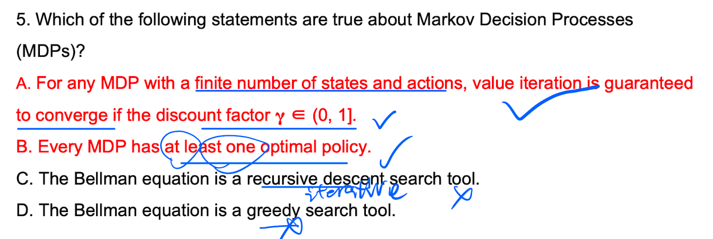
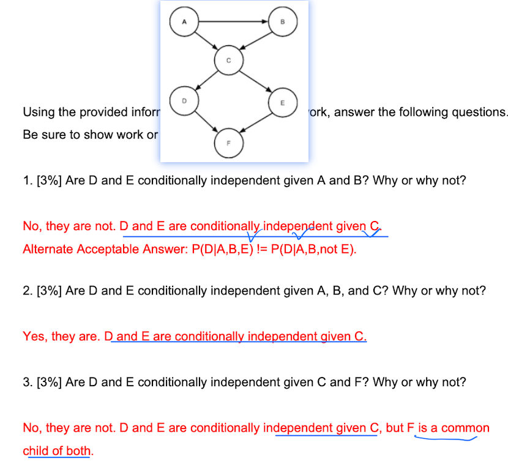

# 1 TF 

Markov blanket of node: D's parents, D's children, D's children's other parents;

Genetic Algorithms can be used to determine the number of hiddent units that combines network's performance and complexity and applyingh mutations to network. 

machine learing: unknown environments, adaptability, lazy, autonomous

Ockham's razor: Bias for simplest hypothesis, finds smallest tree first/fewer hidden units 

Smaller trees allow for more generalization of the concept 

larger trees allow for overfitting to the training data 

# 2 Decision Tree Learning 

## 20 spring 

**Entropy of the decision** = I(electricity consumption) = I(1/2, 1/2) = -1/2log(1/2) - 1/2log(1/2) = 1

**Entropy remaining(remainder)**  分裂之后

  High use

​      / 	\ 

(2l, 2h) (2l, 2h)

R(high use) = 1/2I(1/2, 1/2) +  1/2I(1/2, 1/2) = 1

同理求得R(locaion) = 0.8, R(type) = 0.8

**Information Gain:** 

IG(high) = 1 - 1 = 0; IG(location) = 1 - 0.8 = 0.2 ; IG(type) = 1 - 0.2 = 0.2 

High use of applications can't be chosen to split the dataset because informaion gain is loweset compare to the other 2 attributes

# 3 Neural Network 

## 20 spring 

1.1 A = 1, B = 0, C = 0

1.2 error = |expected - observed| = |1 - 0| = 1  

 	AC_new = weight_old + alpha * output * error = -0.1 + alpha * 1 * 1 = 1 - 0.1 = 0.9; BC_new = 0 

# 4 Bayesian Network 父子关系

## 20 spring 

4a. Find P(B = good, F = not empty, G = empty, S = no) = P(B = good)P(F=not empty)P(G = empty|B = good, F=not empty) P(S=no|B = good, F=not empty)

4b. Use **enumeration** P(S|B = bad) = [P(S = yes|B = bad), P(S = no| B = bad)] 引入fule

P(S = yes|B = bad) = P(S = yes, B = bad) / P(B = bad) = [P(B = bad)P(Fule = empty)P(S = yes| B = bad, F = empty) + P(B = bad)P(Fule = ~empty)P(S = yes| B = bad, F = ~empty)] / P (B = bad) 

# 5 Probability Theory 

# 6 Naive Bayes 

## 20 Spring 

# 7 MDP 

## 2 work 

## 3 Treasure Hunting 

## 4 trainsition reward 

## 5 Q TD

---

p 152 
