# Linux 

#### 复制文件

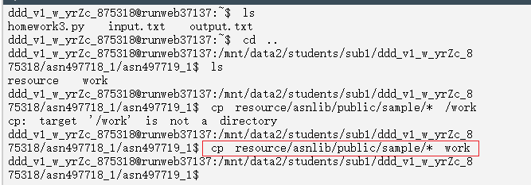

#### 跑python

`python3 homework3.py`

`diff -u output.txt output5.txt` 

# General AI

1. heuristic for the given graph **admissible?**  如果预测的比真实cost还要大那就不admissible

   NO.  Actual cost for node E is 1, but heuristic cost is 3 which is overestimated

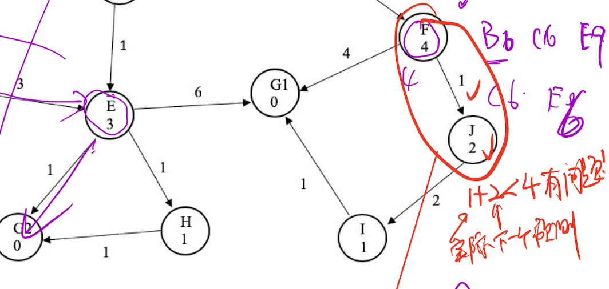

2. heuristic for the given graph **consistent**?如果当前结点J加上自己预测的cost比自己父节点预测还要小,说明不行

NO. Heuristic cost for node F is 4, heuristic cost for node J is 2, actual cost from F to J is 1. Triangle inequality is not satisfied.

9. A* graph search is optimal when the heuristic is consistent. An addimissible heuristic is need to guarantee an opt solution. 如果不admissible那么就不能保证opt!!! 但是也是有可能的. Inadmissible不会改变completeness但是会改变optimality

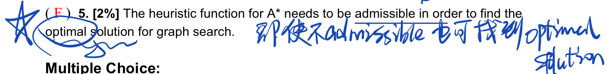

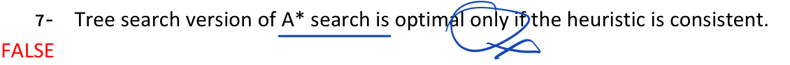

9. A genetic algorithm with a population of 1 is equivalent to a random walk. 
10. BFS is optimal if the path cost is a **nondecreasing function** of the depth of the node

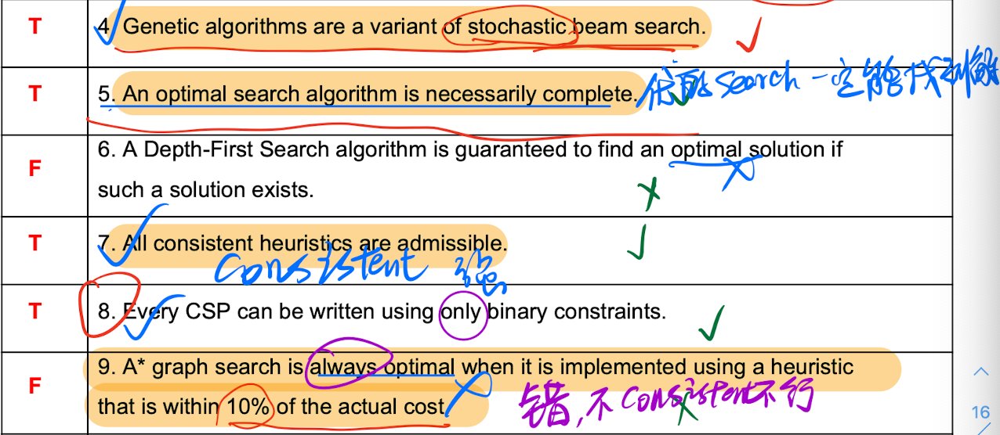

# Problem formulation 

## millennial to apt 

A millennial (M), apartment (A) to a selfie-themed party (P).  has three things, a cat (C), a hamster (H), and a bag of organic kale (K)

- Give the initial and goal **states**

The initial state {M, C, H, K}. goal state: {} 

-  all the legal states

{M,C,H,K} , {M,C,H} {C,K} {M,H,K} {M,C,K} {H} {C} {M,H} {K}{}

- action 

Move one thing (or nothing) to the other side. 

- The problem can be represented as a graph which contains the **states as nodes**, and the state **transitions as edges**

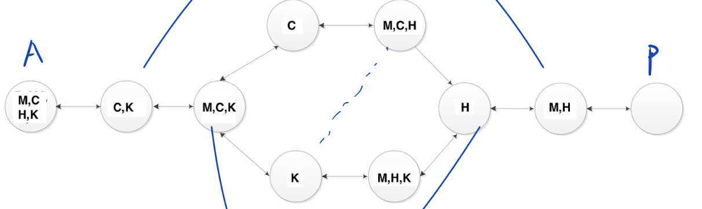

- Provide one sequence of actions that solves this problem with the fewest trips by M. 

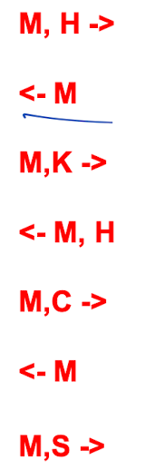

In a **deterministic enviroment** any action has a single guranteed effect, and no failure or uncertainty. **In a non-deterministic environment**, the same task performed twice may produce different results or may even fail completely. Thus, robot picking parts is a stochastic environment. 

In a **episodic environment**, each agent's performance is the result of a series of independent tasks performed. There is no link between the agent's performance and other different scenarios. In other words, the agent decides which action is best to take, it will only <u>consider the task at hand and doesn't have to consider the effect it may have on future tasks.</u> 

# spacecraft  

1. 飞机只能带一个
2. AB 有导航
3. 如果对角线ac要同步必须有b或者d的帮助

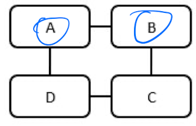

1. Write down the initial and goal states.  
   Initial state: {A=E, B=E, C=E, D=E} 

   Goal state: {A=M, B=M, C=M, D=M}

或者 Initial state: E = {ABCD}, S = { }, M = { }, Goal state: E = { }, S = { }, M = {ABCD}

2. For each restriction (1, 2, and 3 in the list above), write down two **illegal states** that violate it (6 illegal states in total).
   - 三个人在飞机上(S, S, S, E) , (S, S, M, S)
   - ab不在飞机  (E, E, S, S),  (E, E, E, S) 
   - a b d 不在同一个地方 (S, E, S, M), (E, S, E, M)
3.  action(s) you can use to solve this problem. 

Move one or two robots from one place to another place. 

4. Provide a possible sequence of actions that solve this problem. Provide the corresponding sequence of state transitions resulting from your answer to the previous question (Q3.5).

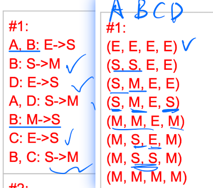

# CSP

先选取minimum remaining value

## 1 pacman 

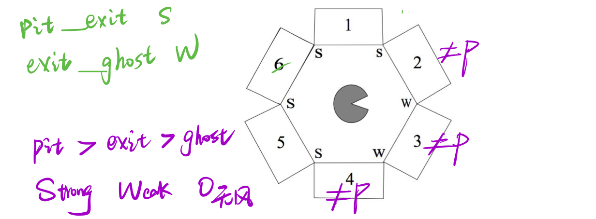

根据风来判断出口,要求出口不相邻

1.  State the **binary** and **unary constraints** for this CSP

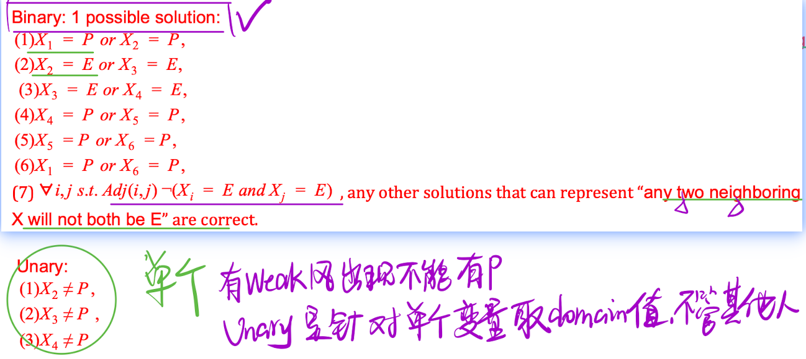

2. Cross out the values from the domains of the variables that will be deleted in enforcing both node and arc consistency.

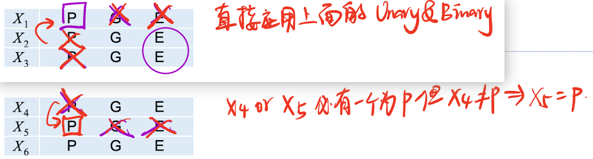

3. [xx%] According to MRV (Minimum Remaining Values), which variable(s) could the **solver assign first?**
X1 or X5

## 2 price lunar year party

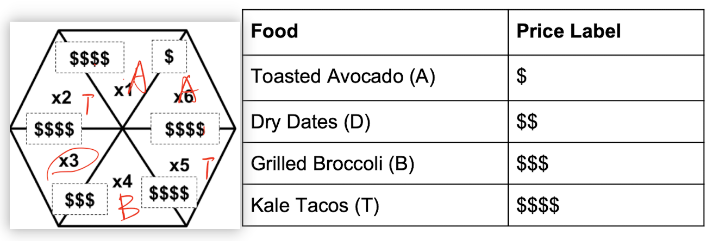

with the price on the tag coming from the more expensive of the two food compartments it is placed between. 

1. [2%] Write down the variables and their domains in this CSP.

   Variables: x1, x2, x3, x4, x5, x6

   Domains {A, B, C, D}

2. constraints

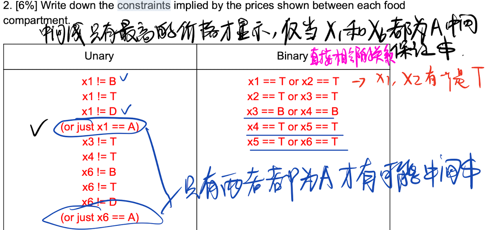

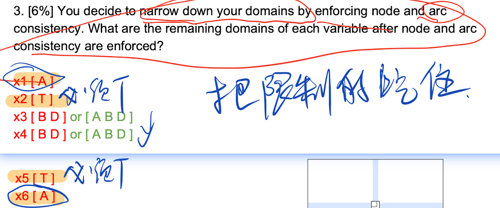

# problem solving 

## three black and three white

1. size of the state space

7! /(3! 3!) = 140.

2. number of successors

Max: six; Min: three; Branching factor: (3+4+5+6+5+4+3)/7 or ~ 4.3 or 30/7

3. heuristic: = the number of tiles that would have to be moved (by any number of spaces) for a state “s” to become a goal state.

   h(BBXBWWW) = 5, because every piece but the rightmost black one must move to make a goal state. 

   h(BBBXWWW) = 6, the other two equal to 5.

4. Is this heuristic admissible?

Yes, because the heuristic is less than or equal to the cost.

