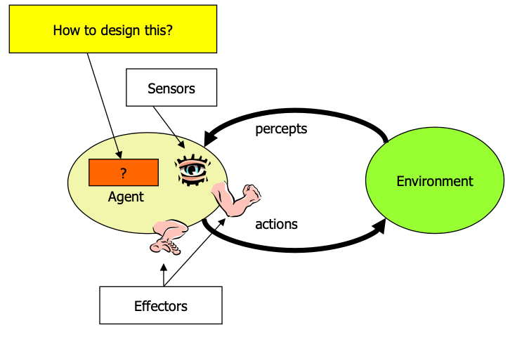
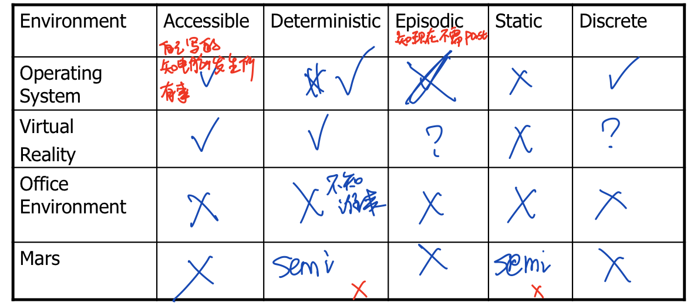
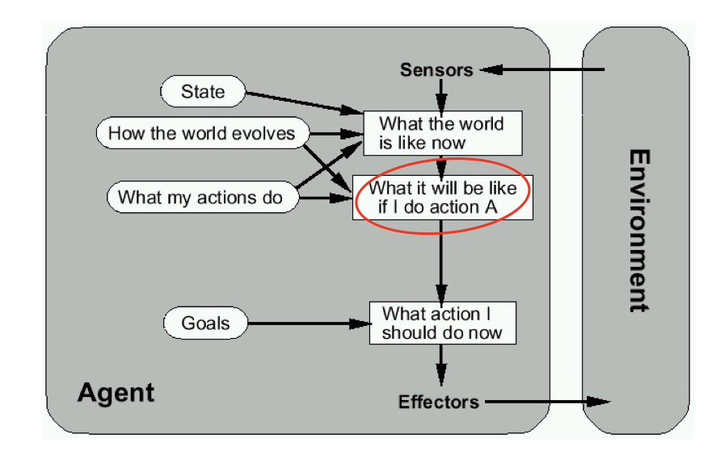
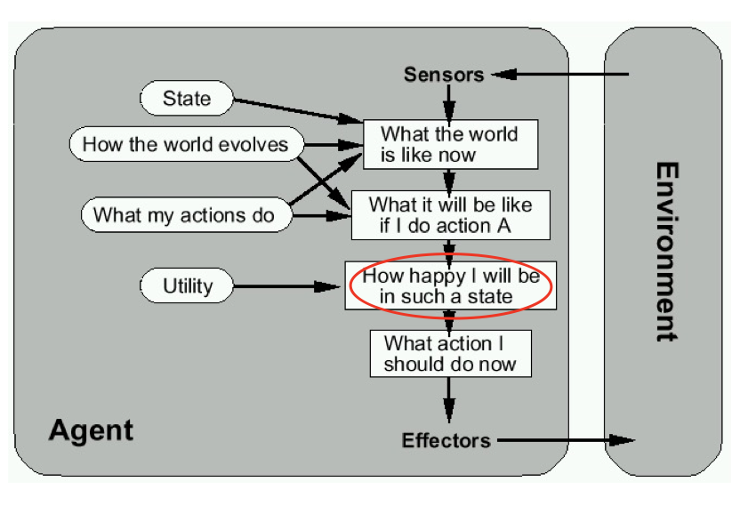
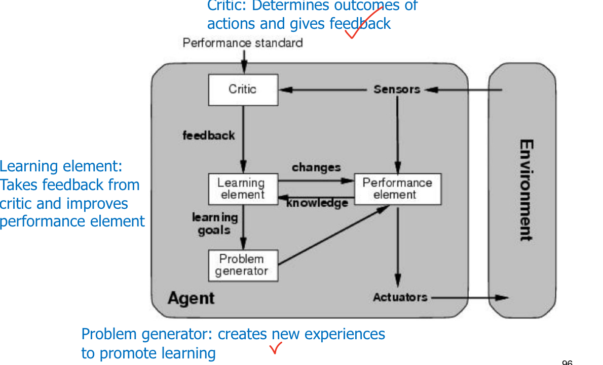
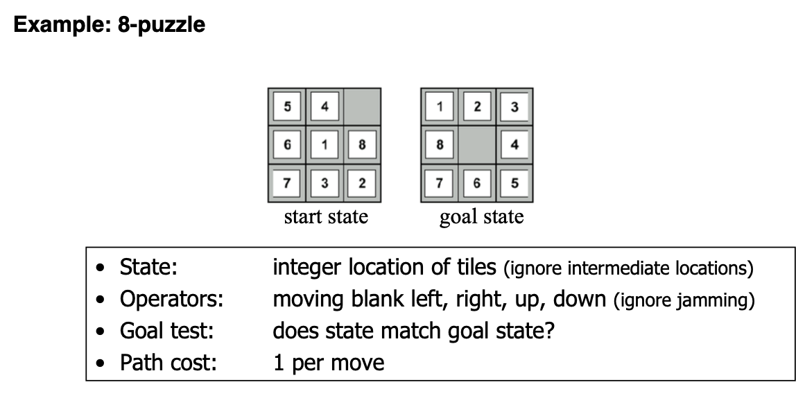

**What is AI?**

Systems that think **rationally** && Systems that act **rationally**

Systems that think **like humans**&&Systems that act **like humans**

## **The Turing Test**

**Acting Humanly:**

Computer needs to possess: Natural language processing, Knowledge representation, Automated reasoning, and Machine learning

**Problem:** 1) Turing test is not reproducible, constructive, and amenable to mathematic analysis. 2) What about physical interaction with interrogator and environment?

**Total/ Full Turing Test:**Requires physical interaction and needs perception and actuation.

**Pass the Basic Turing test**

NLP, Knowledge representation, Automated reasoning, Machine learning. 

**Pass the Full/Total Turing test**

Vision, Motor control, Other senses (total test): such as audition, smell, touch

**CAPTCHAs or “Reverse Turing Tests”**

Vision is a particularly difficult one for machines

## (Intelligent) Agent感知环境,完成目标等

Anything that can be viewed as **perceiving** its **environment** through **sensors** and **acting** upon that environment through its **effectors** to maximize progress towards its **goals**.

**PAGE** (Percepts, Actions, Goals, Environment)

Task-specific & specialized: well-defined goals and environment, a tool for analyzing systems. 

**A Windshield Wiper Agent**

- Goals: visibility Keep windshields clean & maintain

- Percepts:Raining, Dirty 判断环境
- Sensors:Camera (moist sensor) 
- Effectors:Wipers (left, right, back) 产生效果
- Actions: Off, Slow, Medium, Fast
- Environment: Inner city, freeways, highways, weather ...

**Rational Action:** The action that <u>maximizes the expected value</u> of the performance measure <u>given the percept sequence to date</u>

- Rational = Best Yes, to the best of its knowledge
- Rational = Optimal Yes, to the best of its abilities (incl. its constraints)

**How is an Agent different from other software?**

Agent: see, think, do 需要interact

- Agents are **autonomous**, that is, they act on behalf of the user

- Agents contain some level of **intelligence**, from fixed rules to learning engines that allow them to

  adapt to changes in the environment

- Agents don't only act **reactively**, but sometimes also **proactively**

- Agents have **social ability**, that is, they communicate with the user, the system, and other agents as required

- Agents may also **cooperate** with other agents to carry out more complex tasks than they themselves can handle

- Agents may **migrate** from one system to another to access remote resources or even to meet other agents

#### Environment Types

- Accessible vs. Inaccessible

Accessible: sensors give access to **complete** state of the environment. 色盲不是accessible

- Deterministic vs. Nondeterministic 

Deterministic: the **next state can be determined** based on the current state and the action.

- Episodic vs. Non-episodic

 In episodic environments, the quality of action does not depend on the previous episode and does not affect the next episode. 

Example: Episodic: mail sorting system; non-episodic: chess

- Hostile vs. Friendly

- Static vs. Dynamic

only you cna change, 环境自己不改变, 如果自己改变就是dynamic

- Discrete vs. Continuous

Chess vs. driving 

#### **Agent types**

- Reflex agents
   • Reactive: No memory

-  Reflex agents with internal states

   • W/o previous state, may not be able to make decision 

​    • E.g. brake lights at night.

- Goal-based agents
   • Goal information needed to make decision

- Utility-based agents
   • How well can the goal be achieved (degree of happiness)

​       • What to do if there are conflicting goals? • Speed and safety

​       • Which goal should be selected if several can be achieved?

-  Learning agents
   • How can I adapt to the environment? • How can I learn from my mistakes?

## **Define a “Problem”?**

1. States: amount of water in the buckets

2. Operators/Actions: Fill bucket from source, empty bucket
3. Initial State:three empty buckets
4. Goal State:Have 7 liters of water in 9-liter bucket

• **Find solution:**

<u>a sequence of operators/actions</u> that bring your agent from the initial/current state to the goal state

##### **Types of “Problems”**

- **Single-state problem:** deterministic, accessible (totally observable)

E.g., playing chess.

- **Multiple-state problem:** deterministic, inaccessible (partially observable)

 E.g., walking in a dark room, or playing the poker game

- **Contingency problem:** nondeterministic, inaccessible

• E.g., a new skater in an arena

- **Exploration problem:** unknown state space

Discover and learn about environment while taking actions.E.g., Maze, or Mars

### **SEARCH FOR SOLUTIONS**

A search strategy is defined by picking the order of node expansion.

A Search algorithms are commonly evaluated according to the following four criteria:

• **Completeness:** does it always find a solution if one exists?
 • **Time complexity:** how long does it take as function of num. of nodes?

 • **Spacecomplexity:**how much memory does it require?
 • **Optimality:**least-cost solution?

