# Search Algorithms

**What is a “problem space”?**

action lead you from one state to another, the whole graph. 

**What is a “search tree”?** with intial state 

**How to find a solution?**

Where is your **frontier** in your search? A lot of state that you have visted right now behind these stares you have visited before. One step further is a new state. 

How to manage your “soldiers” during the search?  Queuing-Fn 

## **1 Uninformed Search** 


**evaluated four criteria:** 

1. **Completeness:** does it always find a solution if one exists?是否能找到答案

2. **Time complexity:** 

3. **Space complexity:** 

4. **Optimality:**  least-cost solution?

**时空复杂度:** (必考)

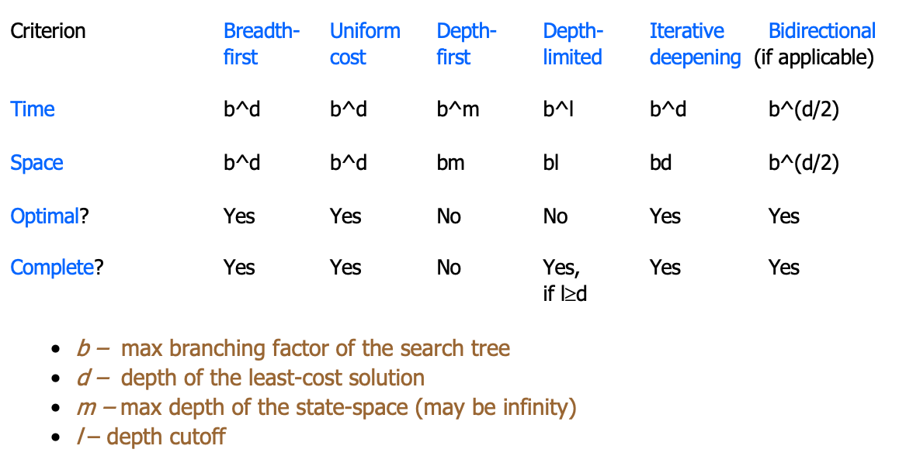

### breadth-first

Enqueue expanded (children) nodes to the **back** of the queue 

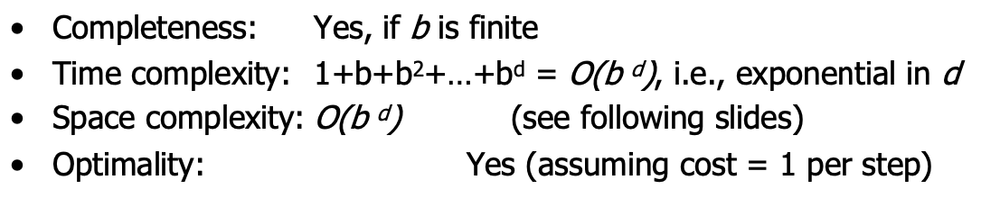

时间复杂度: d层,每个children有b个children 所以是o(b^d), d是深度 

```java
static private void BFS(Node[][][] array, int[] entrance, int[] exit) {
    Node entranceNode = array[entrance[0]][entrance[1]][entrance[2]];
    entranceNode.cost = 0;
    entranceNode.visited = true;

    // ensure there is a node in exit coordinate
    if (array[exit[0]][exit[1]][exit[2]] == null) {
        array[exit[0]][exit[1]][exit[2]] = new Node();
    }

    Deque<int[]> queue = new LinkedList<>();
    queue.addFirst(entrance);
    while (!queue.isEmpty() && !success) {
        int[] curCoordinate = queue.removeFirst();
        Node curNode = array[curCoordinate[0]][curCoordinate[1]][curCoordinate[2]];
        for (int i = 0; i < curNode.action.length; i++) {
            int[] nextCoordinate = takeAction(curNode.action[i], (int[]) Arrays.copyOf(curCoordinate, 3));
            if (array[nextCoordinate[0]][nextCoordinate[1]][nextCoordinate[2]] != null && array[nextCoordinate[0]][nextCoordinate[1]][nextCoordinate[2]].visited == false) {
                if (arrayIsEqual(nextCoordinate, exit)) {
                    success = true;
                }
                Node nextNode = array[nextCoordinate[0]][nextCoordinate[1]][nextCoordinate[2]];
                nextNode.stepCost = 1;
                nextNode.cost = curNode.cost + nextNode.stepCost;
                nextNode.pre = curCoordinate;
                nextNode.visited = true;
                queue.addLast(nextCoordinate);
            }
        }
    }
    createOutput(array, entrance, exit);

}
```


### uniform-cost(bfs refinement)

Uinform: 原因 future are uniform, past are historical, only consider the past 

使用minHeap 

Enqueue expanded (children) nodes so that queue is **ordered by the path (past) cost of the nodes** (priority queue order).

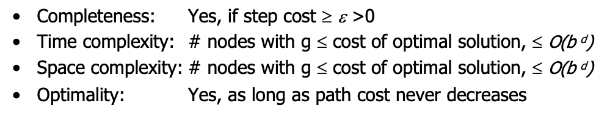

g(n) is the path cost to node n

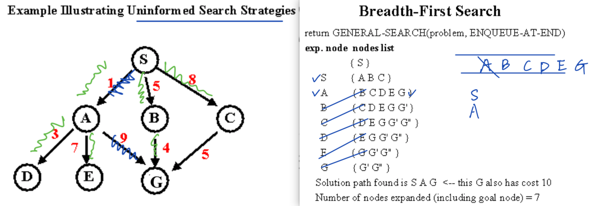


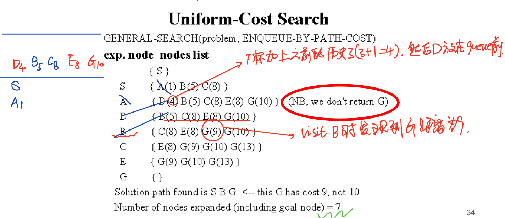

```java
static private void UCS(Node[][][] array, int[] entrance, int[] exit) {
    Node entranceNode = array[entrance[0]][entrance[1]][entrance[2]];
    entranceNode.cost = 0;
    entranceNode.visited = true;

    // ensure there is a node in exit coordinate
    if (array[exit[0]][exit[1]][exit[2]] == null) {
        array[exit[0]][exit[1]][exit[2]] = new Node();
    }

    Comparator<int[]> cmp = new Comparator<int[]>() {
        public int compare(int[] a, int[] b) {
            return array[a[0]][a[1]][a[2]].cost - array[b[0]][b[1]][b[2]].cost;
        }
    };

    Queue<int[]> queue = new PriorityQueue<>(cmp);

    queue.add(entrance);
    while (!queue.isEmpty() && !success) {
        int[] curCoordinate = queue.remove();
        Node curNode = array[curCoordinate[0]][curCoordinate[1]][curCoordinate[2]];
        for (int i = 0; i < curNode.action.length; i++) {
            int[] nextCoordinate = takeAction(curNode.action[i], (int[]) Arrays.copyOf(curCoordinate, 3));
            if (array[nextCoordinate[0]][nextCoordinate[1]][nextCoordinate[2]] != null && array[nextCoordinate[0]][nextCoordinate[1]][nextCoordinate[2]].visited == false) {
                if (arrayIsEqual(nextCoordinate, exit)) {
                    success = true;
                }
                Node nextNode = array[nextCoordinate[0]][nextCoordinate[1]][nextCoordinate[2]];
                if (curNode.action[i] <= 6) {
                    nextNode.stepCost = 10;
                } else {
                    nextNode.stepCost = 14;
                }
                nextNode.cost = curNode.cost + nextNode.stepCost;
                nextNode.pre = curCoordinate;
                nextNode.visited = true;
                queue.add(nextCoordinate);
            }
        }
    }
    createOutput(array, entrance, exit);
}
```


### depth-first

Enqueue expanded (children) nodes to the **front** of the queue (LIFO order)

所以search strategy根据picking the order of node expansion来定义

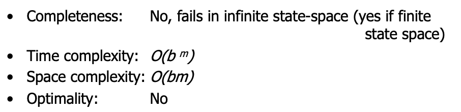

dfs有可能找不到solution, m是树的最大深度

### Depth-limited

Is a depth-first search with depth limit 

### Iterative deepening

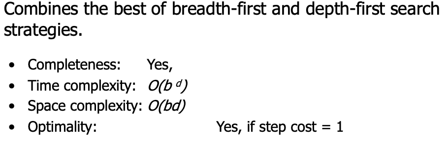

### bi-directional

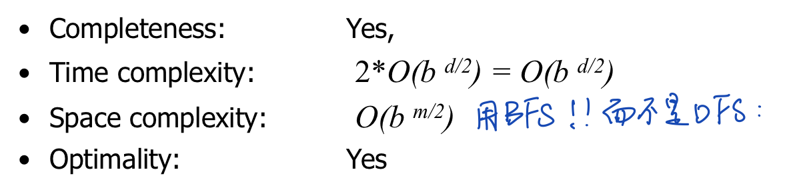

### 


## 2 ==Informed== Search 

uniformed search: you don't have any more information, 只有state and the action, and every action is the same cost. 所以可以说是不知道cost这些信息.

### best-first

use an evaluation function for each node; estimate of **“desirability”** expand most desirable unexpanded node.

**QueueingFn** = insert successors in decreasing order of desirability

**Special cases:** 这些都是desirable的选择条件: 

1. **uniformed-search** (past cost only)  使用heap

### 2 greedy search (future cost only)

 只看未来cost最少的路径

- **Estimation function:**
   h(n) = estimate the “future” cost from now n to the goal (heuristic)

- h~SLD~(n) = straight-line distance from n to Bucharest 

- Greedy search expands first the node that appears to be closest to the goal, (or the least future cost), according to h(n).

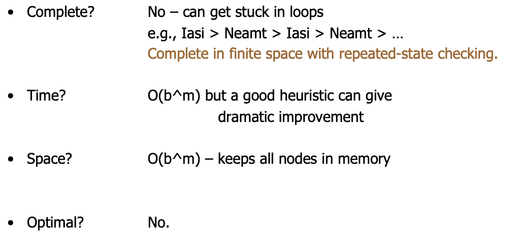

### 3 A* search (sum of past and future cost)

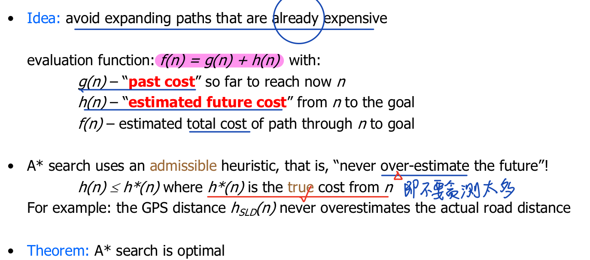

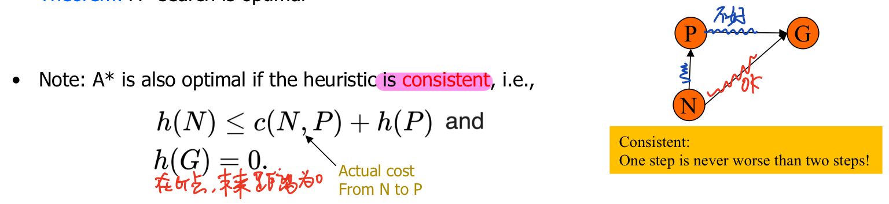

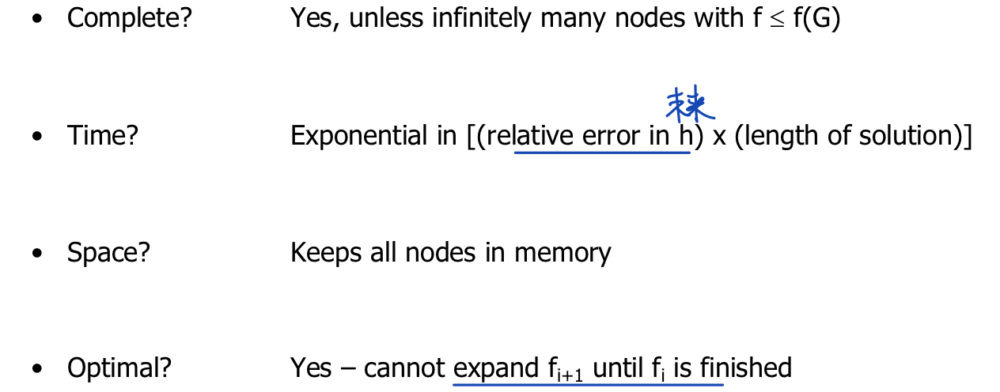

### Heuristic functions

Use heuristics to guide the search

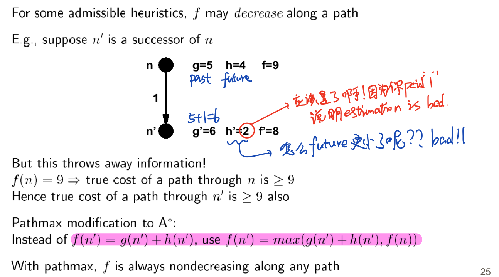


## 3 Function Optimization (Informed Search)

### Iterative improvement

keep a single“current” state, and try to improve it.

vacuum world

n-queens: Here, goal state is initially unknown but is specified by constraints that it must satisfy.

### Hill-climbing (or gradient ascent/descent)

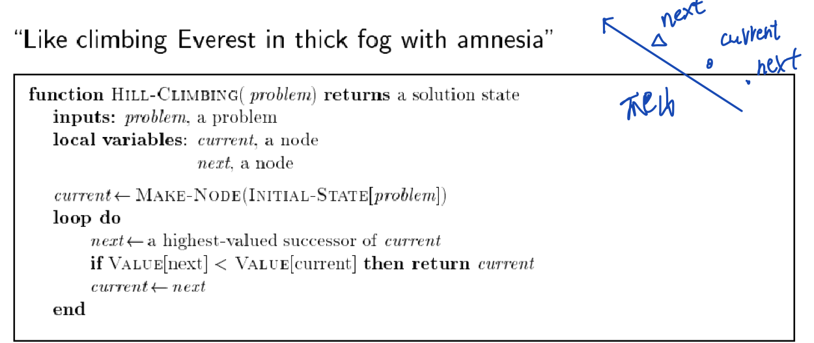

lowest space complexity, just O(1)

找最小值的时候如何避免local minimum??

看下面的: 

 ###  SimulatedAnnealing 

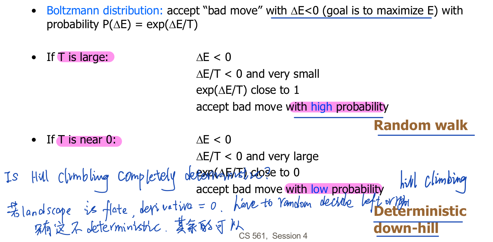

### GeneticAlgorithms

parallelize the search problem

例子: horse race

Adv: parallelize, don't undersand underlaying process, space has bumps and loval minima

Disadvantage: creating generations of samples and breading can be resource intensive. maybe a better solution. 
