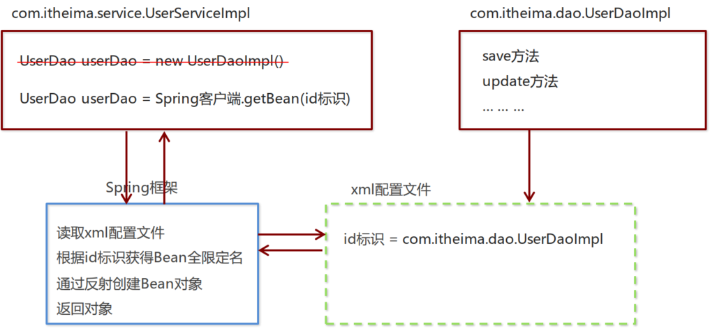
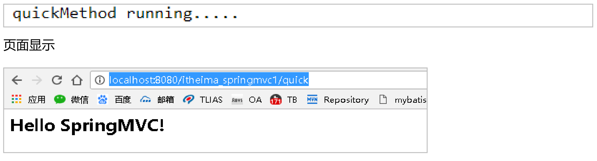

视频位置： 

https://www.bilibili.com/video/BV1WZ4y1P7Bp?spm_id_from=333.337.search-card.all.click

G:\BaiduNetdiskDownload\3、SSM框架Spring+SpringMVC+MyBatis全覆盖_S S M整合

资料位置：

G:\BaiduNetdiskDownload\3、SSM框架Spring+SpringMVC+MyBatis全覆盖_S S M整合\资料-SS M框架Spring+SpringMVC+MyBatis全覆盖

## day01 Spring 入门

### 2 Spring开发步骤



0. 先创建maven项目 idea创建即可

   

① 导入 Spring 开发的基本包坐标

```xml
 <dependencies>
        <dependency>
            <groupId>org.springframework</groupId>
            <artifactId>spring-context</artifactId>
            <version>5.0.15.RELEASE</version>
        </dependency>
</dependencies>
```

② 编写 Dao 接口和实现类


```java
package com.itheima.dao;

public interface UserDao {
    public void save();
}
```

```java
package com.itheima.dao.impl;

import com.itheima.dao.UserDao;

public class UserDaoImpl implements UserDao {
    @Override
    public void save() {
        System.out.println("save running");
    }
}

```

③ 创建 Spring 核心配置文件，最好叫applicationContext.xml

④ 在 Spring 配置文件中配置 UserDaoImpl

在resource包下创建applicationContext.xml文件,添加bean

```xml
<?xml version="1.0" encoding="UTF-8"?>
<beans xmlns="http://www.springframework.org/schema/beans"
       xmlns:xsi="http://www.w3.org/2001/XMLSchema-instance"
       xsi:schemaLocation="http://www.springframework.org/schema/beans http://www.springframework.org/schema/beans/spring-beans.xsd">
    <bean id="userDao" class="com.itheima.dao.impl.UserDaoImpl"></bean>
</beans>
```

⑤ 使用 Spring 的 API 获得 Bean 实例  

 ApplicationContext app = new ClassPathXmlApplicationContext("applicationContext.xml");
 UserDao userDao = (UserDao) app.getBean("userDao"); //接口

测试代码：

```java
package com.itheima.demo;

import com.itheima.dao.UserDao;
import org.springframework.context.ApplicationContext;
import org.springframework.context.support.ClassPathXmlApplicationContext;

public class UserDaoDemo {
    public static void main(String[] args) {
        ApplicationContext app = new ClassPathXmlApplicationContext("applicationContext.xml");
        UserDao userDao = (UserDao) app.getBean("userDao");//填入bean的id
        userDao.save(); //看看是否能从配置文件中拿到对象
    }
}
```

### 3 spring 配置文件

#### **3.1 Bean标签基本配置**  

用于配置对象交由**Spring** 来创建。
默认情况下它调用的是类中的==**无参构造函数**==，如果没有无参构造函数则不能创建成功。
基本属性：
id： Bean实例在Spring容器中的**唯一标识**
class： Bean的全限定名称  

#### 3.2 Bean标签范围配置

scope：指对象的作用范围，取值如下：  

| 取值范围       | 说明                                                         |
| -------------- | ------------------------------------------------------------ |
| **singleton**  | 默认值，单例的                                               |
| **prototype**  | 多例的                                                       |
| request        | WEB 项目中， Spring 创建一个 Bean 的对象，将对象存入到 request 域中 |
| session        | WEB 项目中， Spring 创建一个 Bean 的对象，将对象存入到 session 域中 |
| global session | WEB 项目中，应用在 Portlet 环境，如果没有 Portlet 环境那么globalSession 相当 于 session |

```xml
<bean id="userDao" class="com.itheima.dao.impl.UserDaoImpl" scope="singleton"></bean>
```

测试scope="singleton"发现地址相同，如果是prototype那就不相同

```java
package com.itheima.test;

import com.itheima.dao.UserDao;
import org.junit.Test;
import org.springframework.context.ApplicationContext;
import org.springframework.context.support.ClassPathXmlApplicationContext;

public class SpringTest {
    @Test
    //测试scope属性
    public void test1() {
        ApplicationContext app = new ClassPathXmlApplicationContext("applicationContext.xml");
        UserDao userDao1 = (UserDao) app.getBean("userDao");
        UserDao userDao2 = (UserDao) app.getBean("userDao");
        System.out.println(userDao1);
        System.out.println(userDao2);
        //com.itheima.dao.impl.UserDaoImpl@1f57539
        //com.itheima.dao.impl.UserDaoImpl@1f57539 相同
    }
}
```

1）当scope的取值为==**singleton**==时
Bean的实例化个数： 1个
Bean的实例化时机：当Spring核心文件被加载时，实例化配置的Bean实例
Bean的生命周期：

* 对象创建：**当应用加载，创建容器时，对象就被创建了**
* 对象运行：只要容器在，对象一直活着
* 对象销毁：当应用卸载，销毁容器时，对象就被销毁了

singleton加载配置文件，创建spring容器时，UserDaoImpl就已经被创建，


2）当scope的取值为==**prototype**==时
Bean的实例化个数：多个
Bean的实例化时机：**当调用getBean()方法时实例化Bean**

* 对象创建：当**使用对象**时，创建新的对象实例
*  对象运行：只要对象在使用中，就一直活着
*  对象销毁：当对象长时间不用时，被 Java 的垃圾回收器回收了  


#### 3.3 Bean生命周期配置 

- init-method：指定类中的初始化方法名称
- destroy-method：指定类中销毁方法名称  


然后配置一下

```xml
<bean id="userDao" class="com.itheima.dao.impl.UserDaoImpl" init-method="init" destroy-method="destory"></bean>
```

#### 3.4 Bean实例化三种方式  

- 无参**构造**方法实例化

最重要！

- 工厂**静态**方法实例化

1. StaticFactory.java

```java
package com.itheima.factory;

import com.itheima.dao.UserDao;
import com.itheima.dao.impl.UserDaoImpl;

public class StaticFactory {
    //返回对象
    public static UserDao getUserDao() {
        return new UserDaoImpl(); //返回的是创建对象 
    }
}
```

2. 配置说明不是使用无参构造

class修改，然后将factory-method="getUserDao"方法写上

```xml
<bean id="userDao" class="com.itheima.factory.StaticFactory" factory-method="getUserDao"></bean>
```

- 工厂**实例**方法实例化  

```java
package com.itheima.factory;

import com.itheima.dao.UserDao;
import com.itheima.dao.impl.UserDaoImpl;

public class DynamicFactory {
    //返回对象
    public UserDao getUserDao() {
        return new UserDaoImpl(); //返回的是创建对象
    }
}
```

这样的话必须创建对象才行

需要找factory工厂的getUserDao方法

第一个代表spring帮我创建工厂对象，第二个表示从容器当中找到factory工厂的某个方法

```xml
<bean id="factory" class="com.itheima.factory.DynamicFactory"></bean>
<bean id="userDao" factory-bean="factory" factory-method="getUserDao"></bean>
```

#### 3.5 Bean的依赖注入入门  

① 创建 UserService， UserService 内部在调用 UserDao的save() 方法  

```java
package com.itheima.service;

public interface UserService {
    public void save();
}
```

```java
package com.itheima.service.impl;

import com.itheima.dao.UserDao;
import com.itheima.service.UserService;
import org.springframework.context.support.ClassPathXmlApplicationContext;

public class UserServiceImpl implements UserService {
    @Override
    public void save() {
        ClassPathXmlApplicationContext app = new ClassPathXmlApplicationContext("applicationContext.xml");
        UserDao userDao = (UserDao) app.getBean("userDao");
        userDao.save();
    }
}
```

然后充当web测试，先测试没有配置到容器当中

```java
public class UserServiceImpl implements UserService {
    @Override
    public void save() {
        ClassPathXmlApplicationContext app = new ClassPathXmlApplicationContext("applicationContext.xml");
        UserDao userDao = (UserDao) app.getBean("userDao");
        userDao.save();
    }
}
```

② 将 UserServiceImpl 的创建权交给 Spring  

```xml
<bean id="userDao" class="com.itheima.dao.impl.UserDaoImpl"></bean>
<bean id = "userService" class = "com.itheima.service.impl.UserServiceImpl"></bean>
```
③ 从 Spring 容器中获得 UserService 进行操作
```java
package com.itheima.demo;

import com.itheima.service.UserService;
import com.itheima.service.impl.UserServiceImpl;
import org.springframework.context.support.ClassPathXmlApplicationContext;

public class UserController {
    public static void main(String[] args) {
        ClassPathXmlApplicationContext app = new ClassPathXmlApplicationContext("applicationContext.xml");
        UserService userService = (UserService)app.getBean("userService");
        userService.save();
    }
}
```

#### 3.6 Bean的依赖注入分析  


#### 3.7 Bean的依赖注入概念  

依赖注入（**Dependency Injection**）：它是 Spring 框架核心 IOC 的具体实现。
在编写程序时，通过控制反转，把对象的创建交给了 Spring，但是代码中不可能出现没有依赖的情况。
IOC 解耦只是降低他们的依赖关系，但不会消除。例如：业务层仍会调用持久层的方法。
那这种业务层和持久层的依赖关系，在使用 Spring 之后，就让 Spring 来维护了。
简单的说，就是坐等框架把持久层对象传入业务层，而不用我们自己去获取  

怎么将UserDao怎样注入到UserService内部呢？

1）set方法  

1. 在UserServiceImpl.java中添加setUserDao方法  

```java
public class UserServiceImpl implements UserService {

    private UserDao userDao;
    public void setUserDao(UserDao userDao) {
        this.userDao = userDao;
    }

    @Override
    public void save() {
        userDao.save();
    }
}
```

2. 配置Spring容器调用set方法进行注入  

**name**是属性的名字，是set方法的后面小写！！**ref**引用的就是

```xml
<bean id="userDao" class="com.itheima.dao.impl.UserDaoImpl"></bean>
<bean id = "userService" class = "com.itheima.service.impl.UserServiceImpl">
       <property name="userDao" ref="userDao"></property>
</bean>
```

P命名空间注入本质也是set方法注入，但比起上述的set方法注入更加方便，主要体现在配置文件中，如下：
首先，需要引入P命名空间：  

然后修改注入方式

```xml
<?xml version="1.0" encoding="UTF-8"?>
<beans xmlns="http://www.springframework.org/schema/beans"
       xmlns:xsi="http://www.w3.org/2001/XMLSchema-instance"
       xmlns:p="http://www.springframework.org/schema/p"
       xsi:schemaLocation="http://www.springframework.org/schema/beans http://www.springframework.org/schema/beans/spring-beans.xsd">
       <bean id="userDao" class="com.itheima.dao.impl.UserDaoImpl"></bean>
       <bean id="userService" class="com.itheima.service.impl.UserServiceImpl" p:userDao-ref="userDao"/>
</beans>
```

2）构造方法

1. 修改代码

```java
public class UserServiceImpl implements UserService {

    private UserDao userDao;
    public UserServiceImpl(UserDao userDao) {
        this.userDao = userDao;
    }
    public UserServiceImpl() {
    }
    @Override
    public void save() {
        userDao.save();
    }
}
```

2. 配置Spring容器调用有参构造时进行注入  

ref表示引用的是容器中bean的id

```xml
<bean id = "userService" class = "com.itheima.service.impl.UserServiceImpl">
       <constructor-arg name="userDao" ref="userDao"></constructor-arg>
</bean>
```


#### 3.8 Bean的依赖注入的数据类型  

上面的操作，都是注入的引用Bean，处了对象的引用可以注入，普通数据类型，集合等都可以在容器中进行注入。
注入数据的三种数据类型

- **普通数据类型**
- **引用数据类型**

- **集合数据类型**

其中引用数据类型，此处就不再赘述了，之前的操作都是对UserDao对象的引用进行注入的，下面将以set方法注入为例，演示普通数据类型和集合数据类型的注入。  

1） 普通数据类型的注入  

```java
public class UserDaoImpl implements UserDao {
    private String username;
    private int age;

    public void setUsername(String username) {
        this.username = username;
    }

    public void setAge(int age) {
        this.age = age;
    }
    @Override
    public void save() {
        System.out.println(username + "====" + age);
        System.out.println("save running");
    }
}

```

然后告诉配置文件

普通数据类型用value不是用ref

```xml
<bean id = "userService" class = "com.itheima.service.impl.UserServiceImpl">
       <constructor-arg name="userDao" ref="userDao"></constructor-arg>
</bean>
<bean id="userDao" class="com.itheima.dao.impl.UserDaoImpl">
       <property name="username" value="zhangsan"></property>
       <property name="age" value="18"></property>
</bean>
```

2）集合数据类型（List<String>）的注入  

```java
public class UserDaoImpl implements UserDao {

    private List<String> strList;
    private Map<String, User> userMap;
    private Properties properties;

    public void setStrList(List<String> strList) {
        this.strList = strList;
    }

    public void setUserMap(Map<String, User> userMap) {
        this.userMap = userMap;
    }

    public void setProperties(Properties properties) {
        this.properties = properties;
    }
```

然后配置文件

```
value-ref 用于object
property代表变量，里面的name就是变量名
```

  List<String> ; Map<String, User> ;Properties ;处理方式

```xml
 <bean id = "userService" class = "com.itheima.service.impl.UserServiceImpl">
              <constructor-arg name="userDao" ref="userDao"></constructor-arg>
       </bean>
       <bean id="userDao" class="com.itheima.dao.impl.UserDaoImpl">
              <property name="strList">
                     <list>
                            <value>aaa</value>
                            <value>bbb</value>
                            <value>ccc</value>
                     </list>
              </property>
              <property name="userMap">
                     <map>
                            <entry key="u1" value-ref="user1"></entry>
                            <entry key="u2" value-ref="user2"></entry>
                     </map>
              </property>

              <property name="properties">
                     <props>
                            <prop key="p1">ppp1</prop>
                            <prop key="p2">ppp2</prop>
                            <prop key="p3">ppp3</prop>
                     </props>
              </property>

       </bean>

       <bean id="user1" class="com.itheima.domain.User">
              <property name="name" value="tom"></property>
              <property name="address" value="beijing"></property>
       </bean>
       <bean id="user2" class="com.itheima.domain.User">
              <property name="name" value="lucy"></property>
              <property name="address" value="tianjin"></property>
       </bean>

</beans>
```

#### 3.9 引入其他配置文件（分模块开发）  

实际开发中， Spring的配置内容非常多，这就导致Spring配置很繁杂且体积很大，所以，可以将部分配置拆解到其他配置文件中，而在Spring主配置文件通过import标签进行加载  

```xml
<import resource="applicationContext-xxx.xml"/>
```

重点配置

```xml
<bean>标签
id属性:在容器中Bean实例的唯一标识，不允许重复
class属性:要实例化的Bean的全限定名
scope属性:Bean的作用范围，常用是Singleton(默认)和prototype
<property>标签：属性注入
name属性：属性名称
value属性：注入的普通属性值
ref属性：注入的对象引用值
<list>标签
<map>标签
<properties>标签
<constructor-arg>标签
<import>标签:导入其他的Spring的分文件
```

### 4 Spring相关API  

#### 4.1 ApplicationContext的继承体系  

**applicationContext：** 接口类型，代表应用上下文，可以通过其实例获得 Spring 容器中的 Bean 对象  


#### 4.2 ApplicationContext的实现类  

1） `ClassPathXmlApplicationContext`
它是从**类的根路径下**加载配置文件 推荐使用这种

```java
ClassPathXmlApplicationContext app = new ClassPathXmlApplicationContext("applicationContext.xml");
```

2）` FileSystemXmlApplicationContext`
它是从磁盘路径上加载配置文件，配置文件可以在磁盘的任意位置。

```java
ApplicationContext app = new FileSystemXmlApplicationContext("D:\\workspace\\spring-ioc\\src\\main\\resources\\applicationContext.xml");
```

3） `AnnotationConfigApplicationContext`
当使用注解配置容器对象时，需要使用此类来创建 spring 容器。它用来读取注解。  

#### 4.3 getBean()方法使用  

查看源码

```java
public Object getBean(String name) throws BeansException {
    assertBeanFactoryActive();
    return getBeanFactory().getBean(name);
}
public <T> T getBean(Class<T> requiredType) throws BeansException {
    assertBeanFactoryActive();
    return getBeanFactory().getBean(requiredType);
}
```

其中，当参数的数据类型是字符串时，表示根据Bean的id从容器中获得Bean实例，返回是Object，需要强转。当参数的数据类型是Class类型时，表示根据类型从容器中匹配Bean实例，当容器中相同类型的Bean有多个时，则此方法会报错。

即，如果使用1的话可以有多个UserService类型，但是如果使用2只能有一个，因为无法区分到底是哪一个而报错

```java
ApplicationContext applicationContext = new ClassPathXmlApplicationContext("applicationContext.xml"); //1 
UserService userService1 = (UserService)applicationContext.getBean("userService");
UserService userService2 = applicationContext.getBean(UserService.class);
```

```java
//UserService userService = (UserService)app.getBean("userService"); //1 
UserService userService = app.getBean(UserService.class); //2 
userService.save();
```

#### 4.4 知识要点 

Spring的重点API  

```java
ApplicationContext app = new ClasspathXmlApplicationContext("xml文件")
app.getBean("id")
app.getBean(Class)  
```

## day02 IoC和DI注解开发  

### 1 Spring配置数据源
#### 1.1 数据源（连接池）的作用
• 数据源(连接池)是**提高程序性能**而出现的 
• 事先实例化数据源，初始化部分连接资源
• 使用连接资源时从数据源中获取
• 使用完毕后将连接资源归还给数据源
常见的数据源(连接池)： **DBCP、 C3P0、 BoneCP、 Druid**等

#### 1.1 数据源的开发步骤  

```xml
<?xml version="1.0" encoding="UTF-8"?>
<project xmlns="http://maven.apache.org/POM/4.0.0"
         xmlns:xsi="http://www.w3.org/2001/XMLSchema-instance"
         xsi:schemaLocation="http://maven.apache.org/POM/4.0.0 http://maven.apache.org/xsd/maven-4.0.0.xsd">
    <modelVersion>4.0.0</modelVersion>

    <groupId>com.itheima</groupId>
    <artifactId>day02_spring_ioc_anno</artifactId>
    <version>1.0-SNAPSHOT</version>
    <packaging>war</packaging>

</project>
```

① 导入数据源的坐标和数据库驱动坐标
② 创建数据源对象
③ 设置数据源的基本连接数据
④ 使用数据源获取连接资源和归还连接资源  

#### 1.2 数据源的手动创建  

① 导入c3p0和druid的坐标  ① 导入mysql数据库驱动坐标  

```xml
<dependencies>
        <dependency>
            <groupId>mysql</groupId>
            <artifactId>mysql-connector-java</artifactId>
            <version>5.1.32</version>
        </dependency>
        <!-- C3P0连接池 -->
        <dependency>
            <groupId>c3p0</groupId>
            <artifactId>c3p0</artifactId>
            <version>0.9.1.2</version>
        </dependency>
        <!-- Druid连接池 -->
        <dependency>
            <groupId>com.alibaba</groupId>
            <artifactId>druid</artifactId>
            <version>1.1.10</version>
        </dependency>
        <dependency>
            <groupId>junit</groupId>
            <artifactId>junit</artifactId>
        </dependency>
    </dependencies>
```

② 创建C3P0连接池  

https://blog.csdn.net/qq_41888230/article/details/103484752 连接c3p0可能报错 解决方法

```java
    @Test
    public void testC3P0() throws Exception { //创建数据源
        ComboPooledDataSource dataSource = new ComboPooledDataSource();
        //设置数据库连接参数
        dataSource.setDriverClass("com.mysql.jdbc.Driver");
        dataSource.setJdbcUrl("jdbc:mysql://localhost:3306/test?serverTimezone=GMT%2B8");
        dataSource.setUser("root");
        dataSource.setPassword("root");
        //获得连接对象
        Connection connection = dataSource.getConnection();
        System.out.println(connection);
        connection.close();
    }
```

② 创建Druid连接池  

```java
    @Test
    public void testDruid() throws Exception {
        //创建数据源
        DruidDataSource dataSource = new DruidDataSource();
        //设置数据库连接参数
        dataSource.setDriverClassName("com.mysql.jdbc.Driver");
        dataSource.setUrl("jdbc:mysql://localhost:3306/test?serverTimezone=GMT%2B8");
        dataSource.setUsername("root");
        dataSource.setPassword("root");
        //获得连接对象
        Connection connection = dataSource.getConnection();
        System.out.println(connection);
        connection.close();
    }
```

③ 提取jdbc.properties配置文件  

如果后期更换数据库需要找到源码才能更改，可以**抽取到配置文件中**来达到解耦

```properties
jdbc.driver=com.mysql.jdbc.Driver
jdbc.url=jdbc:mysql://localhost:3306/test?serverTimezone=GMT%2B8
jdbc.username=root
jdbc.password=root
```

④ 读取jdbc.properties配置文件创建连接池  

```java
    @Test
    public void testC3P0ByProperties() throws Exception {
        //加载类路径下的jdbc.properties
        ResourceBundle rb = ResourceBundle.getBundle("jdbc");
        ComboPooledDataSource dataSource = new ComboPooledDataSource();
        dataSource.setDriverClass(rb.getString("jdbc.driver"));
        dataSource.setJdbcUrl(rb.getString("jdbc.url"));
        dataSource.setUser(rb.getString("jdbc.username"));
        dataSource.setPassword(rb.getString("jdbc.password"));
        Connection connection = dataSource.getConnection();
        System.out.println(connection);
        connection.close();
    }
```

#### 1.3 Spring配置数据源  

可以将DataSource的创建权交由Spring容器去完成

- DataSource有无参构造方法，而Spring默认就是通过无参构造方法实例化对象的
- DataSource要想使用需要通过set方法设置数据库连接信息，而Spring可以通过set方法进行字符串注入  

```xml
<?xml version="1.0" encoding="UTF-8"?>
<beans xmlns="http://www.springframework.org/schema/beans"
       xmlns:xsi="http://www.w3.org/2001/XMLSchema-instance"
       xsi:schemaLocation="http://www.springframework.org/schema/beans http://www.springframework.org/schema/beans/spring-beans.xsd">
        <bean id="dataSource" class="com.mchange.v2.c3p0.ComboPooledDataSource">
            <property name="driverClass" value="com.mysql.jdbc.Driver"/>
            <property name="jdbcUrl" value="jdbc:mysql://localhost:3306/test?serverTimezone=GMT%2B8"/>
            <property name="user" value="root"/>
            <property name="password" value="root"/>
        </bean>
</beans>
```

测试从容器当中获取数据源  

```java
    @Test
    //容器产生数据源对象
    public void test4() throws Exception {
        ApplicationContext app = new ClassPathXmlApplicationContext("applicationContext.xml");
//        DataSource dataSource = (DataSource)app.getBean("dataSource");
        DataSource dataSource = app.getBean(DataSource.class);
        Connection connection = dataSource.getConnection();
        System.out.println(connection);
    }
```

#### 1.4 抽取jdbc配置文件  

实际开发中，mysql的配置要和spring的配置分开，

`applicationContext.xml`加载`jdbc.properties`配置文件获得连接信息。
首先，需要引入context命名空间和约束路径：

- 命名空间： xmlns:context="http://www.springframework.org/schema/context"
- 约束路径： http://www.springframework.org/schema/context
  http://www.springframework.org/schema/context/spring-context.xsd  

```xml
<?xml version="1.0" encoding="UTF-8"?>
<beans xmlns="http://www.springframework.org/schema/beans"
       xmlns:xsi="http://www.w3.org/2001/XMLSchema-instance"
       xmlns:context="http://www.springframework.org/schema/context"
       xsi:schemaLocation=
               "http://www.springframework.org/schema/beans http://www.springframework.org/schema/beans/spring-beans.xsd
                http://www.springframework.org/schema/context http://www.springframework.org/schema/context/spring-context.xsd">

    <context:property-placeholder location="classpath:jdbc.properties"/>

    <bean id="dataSource" class="com.mchange.v2.c3p0.ComboPooledDataSource">
        <property name="driverClass" value="${jdbc.driver}"/>
        <property name="jdbcUrl" value="${jdbc.url}"/>
        <property name="user" value="${jdbc.username}"/>
        <property name="password" value="${jdbc.password}"/>
    </bean>
</beans>
```

#### 1.5 知识要点  

**Spring容器加载properties文件**  

```xml
<context:property-placeholder location="xx.properties"/>
<property name="" value="${key}"/>
```

### 2 Spring注解开发

#### 2.1 Spring原始注解  

Spring是轻代码而重配置的框架，配置比较繁重，影响开发效率，所以注解开发是一种趋势，注解代替xml配置文件可以简化配置，提高开发效率。  


按照之前的方法

1. UserDao

```java
package com.itheima.dao;

public interface UserDao {
    public void save();

}
```

2. 实现类UserDaoImpl

```java
package com.itheima.dao.impl;

import com.itheima.dao.UserDao;

public class UserDaoImpl implements UserDao {

    public void save() {
        System.out.println("save running....");
    }
}
```

3. 业务层UserService

```java
package com.itheima.service;

public interface UserService {
    public void save(); //调用dao的save方法

}
```

4. 实现业务UserServiceImpl

```java
package com.itheima.service.impl;

import com.itheima.dao.UserDao;
import com.itheima.service.UserService;

public class UserServiceImpl implements UserService {
    private UserDao userDao;

    public void setUserDao(UserDao userDao) {
        this.userDao = userDao;
    }

    public void save() {
        userDao.save();
    }
}
```

5. 实现类bean写上，然后service里面需要注入dao

```xml
<?xml version="1.0" encoding="UTF-8"?>
<beans xmlns="http://www.springframework.org/schema/beans"
       xmlns:xsi="http://www.w3.org/2001/XMLSchema-instance"
       xmlns:context="http://www.springframework.org/schema/context"
       xsi:schemaLocation=
               "http://www.springframework.org/schema/beans http://www.springframework.org/schema/beans/spring-beans.xsd
                http://www.springframework.org/schema/context http://www.springframework.org/schema/context/spring-context.xsd">

    <context:property-placeholder location="classpath:jdbc.properties"/>

    <bean id="dataSource" class="com.mchange.v2.c3p0.ComboPooledDataSource">
        <property name="driverClass" value="${jdbc.driver}"/>
        <property name="jdbcUrl" value="${jdbc.url}"/>
        <property name="user" value="${jdbc.username}"/>
        <property name="password" value="${jdbc.password}"/>
    </bean>

    <bean id="userDao" class="com.itheima.dao.impl.UserDaoImpl"></bean>
    <bean id="userService" class="com.itheima.service.impl.UserServiceImpl">
        <property name="userDao" ref="userDao"></property>
    </bean>
</beans>
```

6. 然后Controller

```java
package com.itheima.web;

import com.itheima.service.UserService;
import org.springframework.context.ApplicationContext;
import org.springframework.context.support.ClassPathXmlApplicationContext;

public class UserController {
    public static void main(String[] args) {
        ApplicationContext app = new ClassPathXmlApplicationContext("applicationContext.xml");
        UserService userService = app.getBean(UserService.class);
        userService.save();
    }
}
```

**如何用注解替换配置文件？？？？**

Spring原始注解主要是替代`<Bean>`的配置  

| 注解           | 说明                                           |
| -------------- | ---------------------------------------------- |
| @Component     | 使用在类上用于==实例化Bean==                   |
| @Controller    | 使用在web层类上用于实例化Bean                  |
| @Service       | 使用在service层类上用于实例化Bean              |
| @Repository    | 使用在dao层类上用于实例化Bean                  |
| @Autowired     | 使用在字段上用于根据类型依赖注入               |
| @Qualifier     | 结合@Autowired一起使用用于根据名称进行依赖注入 |
| @Resource      | 相当于@Autowired+@Qualifier，按照名称进行注入  |
| @Value         | 注入普通属性                                   |
| @Scope         | 标注Bean的作用范围                             |
| @PostConstruct | 使用在方法上标注该方法是Bean的初始化方法       |
| @PreDestroy    | 使用在方法上标注该方法是Bean的销毁方法         |


**注意：**
使用注解进行开发时，需要在applicationContext.xml中==配置组件扫描==，作用是指定哪个包及其子包下的Bean
需要进行扫描以便识别使用注解配置的类、字段和方法  

```xml
<!--注解的组件扫描-->
    <context:component-scan base-package="com.itheima"/>
```

- 使用`@Compont`或`@Repository`标识`UserDaoImpl`需要Spring进行实例化。  

```java
//<bean id="userDao" class="com.itheima.dao.impl.UserDaoImpl"></bean>
//@Component("userDao")
@Repository("userDao")
public class UserDaoImpl implements UserDao {

    public void save() {
        System.out.println("save running....");
    }
}
```

- 使用`@Compont`或`@Service`标识`UserServiceImpl`需要**Spring进行实例化**
-  使用`@Autowired`或者`@Autowired+@Qulifier`或者`@Resource`进行`userDao`的注入  

```java
//@Component("userService")
@Service("userService")
public class UserServiceImpl implements UserService {
//   1 @Autowired //按照数据类型从spring容器中匹配的
//   1.1 @Qualifier("userDao") //可以按照id的名称从容器中进行匹配但是此处@Qualifier需要结合@Autowired一起使用
    // 相当于 1 + 1.1
    @Resource(name = "userDao")
    private UserDao userDao;

//    public void setUserDao(UserDao userDao) { //使用xml配置才需要set
//        this.userDao = userDao;
//    }

    public void save() {
        userDao.save();
    }
}
```

**普通数据类型的注入**

- 使用@Value进行字符串的注入  

```java
@Service("userService")
public class UserServiceImpl implements UserService {

    @Value("${jdbc.driver}")
    private String driver;

//   1 @Autowired //按照数据类型从spring容器中匹配的
//   1.1 @Qualifier("userDao") //可以按照id的名称从容器中进行匹配但是此处@Qualifier需要结合@Autowired一起使用
    // 相当于 1 + 1.1
    @Resource(name = "userDao")
    private UserDao userDao;
    
    public void save() {
        System.out.println(driver);
        userDao.save();
    }
}

```

- 使用@Scope标注Bean的范围  

```java
@Scope("singleton")
//@Scope("prototype")
public class UserServiceImpl implements UserService {
```

- 使用@PostConstruct标注初始化方法，使用@PreDestroy标注销毁方法  

使用ClassPathXmlApplicationContext app 然后手动关闭app.close();

```java
@PostConstruct
public void init(){
	System.out.println("初始化方法....");
}
@PreDestroy
public void destroy(){
	System.out.println("销毁方法.....");
}
```

#### 2.2 Spring新注解  

原始注解对一些非自定义的bean不好操作

使用上面的注解还==不能==全部**替代xml**配置文件，还需要使用注解替代的配置如下：

- **非自定义的Bean的配置**： `<bean>`
- 加载**properties**文件的配置： <context:property-placeholder>
- 组件扫描的配置： <context:component-scan>
- 引入其他文件： `<import>  `

| 注解            | 说明                                                         |
| --------------- | ------------------------------------------------------------ |
| @Configuration  | 用于指定当前类是一个 Spring 配置类，当创建容器时会从该类上加载注解 |
| @ComponentScan  | 用于指定 Spring 在初始化容器时要扫描的包。 作用和在 Spring 的 xml 配置文件中的 <context:component-scan base-package="com.itheima"/>一样 |
| @Bean           | **使用在方法上**，标注将该方法的返回值存储到 Spring 容器中   |
| @PropertySource | 用于加载`.properties `文件中的配置                           |
| @Import         | 用于导入其他配置类                                           |

- @Configuration
- @ComponentScan
- @Import  

主配置文件！SpringConfiguration

```java
//标志该类是spring的核心配置类
@Configuration
//<!--注解的组件扫描-->
//<context:component-scan base-package="com.itheima"/>
@ComponentScan("com.itheima")

//<import resource=""></import> 需要把分的加载到核心当中
@Import({DataSourceConfiguration.class})
public class SpringConfiguration {
    //份文件import
}
```

- @PropertySource

- @value  

- @Bean  

```java
//针对非自己写的类
//对于配置文件的加载
//<context:property-placeholder location="classpath:jdbc.properties"/>
@PropertySource("classpath:jdbc.properties")
public class DataSourceConfiguration {
    @Value("${jdbc.driver}") //spring从容器当中找key
    private String driver;

    @Value("${jdbc.url}") //spring从容器当中找key
    private String url;

    @Value("${jdbc.username}") //spring从容器当中找key
    private String username;

    @Value("${jdbc.password}") //spring从容器当中找key
    private String password;

    @Bean("dataSource") //Spring会将当前方法的返回值以指定名称存储到spring容器中
    public DataSource getDataSource() throws PropertyVetoException {
        ComboPooledDataSource dataSource = new ComboPooledDataSource();
        //设置数据库连接参数
        dataSource.setDriverClass(driver);
        dataSource.setJdbcUrl(url);
        dataSource.setUser(username);
        dataSource.setPassword(password);
        return dataSource;
    }
}
```

测试加载核心配置类

`ApplicationContext app = new AnnotationConfigApplicationContext(SpringConfiguration.class);`

```java
public class UserController {
    public static void main(String[] args) {
//        ApplicationContext app = new ClassPathXmlApplicationContext("applicationContext.xml");
        ApplicationContext app = new AnnotationConfigApplicationContext(SpringConfiguration.class);
        UserService userService = app.getBean(UserService.class);
        userService.save();
    }
}
```


### 3 Spring整合Junit  

#### 3.1 原始Junit测试Spring的问题  

在测试类中，每个测试方法都有以下两行代码：  

```java
ApplicationContext ac = new ClassPathXmlApplicationContext("bean.xml");
AccountService as = ac.getBean("accountService",IAccountService.class);  
```

这两行代码的作用是获取容器，如果不写的话，直接会提示空指针异常。所以又不能轻易删掉。  

#### 3.2 上述问题解决思路  

• 让SpringJunit负责创建Spring容器，但是需要将配置文件的名称告诉它
• 将需要进行测试Bean直接在测试类中进行注入  

#### 3.3 Spring集成Junit步骤  

① 导入spring集成Junit的坐标
② 使用@Runwith注解替换原来的运行期
③ 使用@ContextConfiguration指定配置文件或配置类
④ 使用@Autowired注入需要测试的对象
⑤ 创建测试方法进行测试  

#### 3.4 Spring集成Junit代码实现  

① 导入spring集成Junit的坐标  

```xml
       <dependency>
            <groupId>junit</groupId>
            <artifactId>junit</artifactId>
            <version>4.12</version>
            <scope>test</scope>
        </dependency>
        <!--此处需要注意的是， spring5 及以上版本要求 junit 的版本必须是 4.12 及以上-->
        <dependency>
            <groupId>org.springframework</groupId>
            <artifactId>spring-test</artifactId>
            <version>5.0.2.RELEASE</version>
        </dependency>
```

② 使用@Runwith注解替换原来的运行期  

```java
@RunWith(SpringJUnit4ClassRunner.class)
public class SpringJunitTest {
}
```

③ 使用@ContextConfiguration指定配置文件或配置类  

加载的是配置文件，假如是全注解形式，就需要使用配置类 {SpringConfiguration.class}

```java
@RunWith(SpringJUnit4ClassRunner.class)
//加载spring核心配置文件
//@ContextConfiguration(value = {"classpath:applicationContext.xml"})
//加载spring核心配置类
@ContextConfiguration(classes = {SpringConfiguration.class})
public class SpringJunitTest {
}
```

④ 使用@Autowired注入需要测试的对象  

```java
@RunWith(SpringJUnit4ClassRunner.class)
@ContextConfiguration(classes = {SpringConfiguration.class})
public class SpringJunitTest {
    @Autowired
    private UserService userService;
}
```

⑤ 创建测试方法进行测试  

```java
@RunWith(SpringJUnit4ClassRunner.class)
@ContextConfiguration(classes = {SpringConfiguration.class})
public class SpringJunitTest {
    @Autowired
    private UserService userService;
	@Test
	public void testUserService(){
        userService.save();
    }
}
```

#### 3.5 知识要点  

**Spring集成Junit步骤**
① 导入spring集成Junit的坐标
② 使用@Runwith注解替换原来的运行期
③ 使用@ContextConfiguration指定配置文件或配置类
④ 使用@Autowired注入需要测试的对象
⑤ 创建测试方法进行测试  


## day03 SpringMVC入门  

### 00 基本环境搭建

- UerDaoImpl

```java
package com.itheima.dao.impl;

import com.itheima.dao.UserDao;

public class UserDaoImpl implements UserDao {

    @Override
    public void save() {
        System.out.println("saving running....");
    }
}

```

- UserServiceImpl

```java
package com.itheima.service.impl;

import com.itheima.dao.UserDao;
import com.itheima.service.UserService;

public class UserServiceImpl implements UserService {
    private UserDao userDao;
    public void setUserDao(UserDao userDao) {
        this.userDao = userDao;
    }
    @Override
    public void save() {
        userDao.save();
    }
}
```

- UserServlet

```java
package com.itheima.web;

import com.itheima.service.UserService;
import org.springframework.context.ApplicationContext;
import org.springframework.context.support.ClassPathXmlApplicationContext;

import javax.servlet.ServletException;
import javax.servlet.http.HttpServlet;
import javax.servlet.http.HttpServletRequest;
import javax.servlet.http.HttpServletResponse;
import java.io.IOException;

public class UserServlet extends HttpServlet {
    @Override
    protected void doGet(HttpServletRequest req, HttpServletResponse resp) throws ServletException, IOException {
        //内部找spring容器要service对象调用save()
        ApplicationContext app = new ClassPathXmlApplicationContext("applicationContext.xml");
        UserService userService = app.getBean(UserService.class);
        userService.save();
    }
}
```

applicationContext.xml

```java
<?xml version="1.0" encoding="UTF-8"?>
<beans xmlns="http://www.springframework.org/schema/beans"
       xmlns:xsi="http://www.w3.org/2001/XMLSchema-instance"
       xmlns:context="http://www.springframework.org/schema/context"
       xsi:schemaLocation="http://www.springframework.org/schema/beans http://www.springframework.org/schema/beans/spring-beans.xsd
                           http://www.springframework.org/schema/context http://www.springframework.org/schema/context/spring-context.xsd">

    <!--加载外部的properties文件-->
    <context:property-placeholder location="classpath:jdbc.properties"/>

    <!--配置数据源-->
    <bean id="dataSource" class="com.mchange.v2.c3p0.ComboPooledDataSource">
        <property name="driverClass" value="${jdbc.driver}"></property>
        <property name="jdbcUrl" value="${jdbc.url}"></property>
        <property name="user" value="${jdbc.username}"></property>
        <property name="password" value="${jdbc.password}"></property>
    </bean>

    <!--配置Dao-->
    <bean id="userDao" class="com.itheima.dao.impl.UserDaoImpl"></bean>

    <!--配置service-->
    <bean id="userService" class="com.itheima.service.impl.UserServiceImpl">
        <property name="userDao" ref="userDao"/>
    </bean>
</beans>
```

- jdbc.properties

```xml
jdbc.driver=com.mysql.jdbc.Driver
jdbc.url=jdbc:mysql://localhost:3306/test
jdbc.username=root
jdbc.password=root
```

- web.xml

```xml
<?xml version="1.0" encoding="UTF-8"?>
<web-app version="3.0" xmlns="http://java.sun.com/xml/ns/javaee"
         xmlns:xsi="http://www.w3.org/2001/XMLSchema-instance"
         xsi:schemaLocation="http://java.sun.com/xml/ns/javaee http://java.sun.com/xml/ns/javaee/web-app_3_0.xsd">


  <servlet>
    <servlet-name>UserServlet</servlet-name>
    <servlet-class>com.itheima.web.UserServlet</servlet-class>
  </servlet>
  <servlet-mapping>
    <servlet-name>UserServlet</servlet-name>
    <url-pattern>/userServlet</url-pattern>
  </servlet-mapping>
  <display-name>Archetype Created Web Application</display-name>
</web-app>
```


### 1 Spring与Web环境集成

#### 1.1 ApplicationContext应用上下文获取方式

应用上下文对象是通过`new ClasspathXmlApplicationContext`(spring配置文件) 方式获取的，但是每次从容器中获得Bean时都要编写`new ClasspathXmlApplicationContext`(spring配置文件) ，这样的弊端是配置文件加载多次，应用上下文对象创建多次。

在**Web**项目中，可以使用`ServletContextListener`监听Web应用的启动，我们可以在Web应用启动时，就加
载Spring的配置文件，创建应用上下文对象ApplicationContext，在将其存储到最大的域servletContext域
中，这样就可以在任意位置从域中获得应用上下文ApplicationContext对象了。  

- UserServlet

```java
public class UserServlet extends HttpServlet {
    @Override
    protected void doGet(HttpServletRequest req, HttpServletResponse resp) throws ServletException, IOException {
        //内部找spring容器要service对象调用save()
        //ApplicationContext app = new ClassPathXmlApplicationContext("applicationContext.xml");
        ServletContext servletContext = this.getServletContext();
        ApplicationContext app = (ApplicationContext)servletContext.getAttribute("app");
        UserService userService = app.getBean(UserService.class);
        userService.save();
    }
}
```

- ContextLoadLister

```java
public class ContextLoaderListener implements ServletContextListener {
    public void contextInitialized(ServletContextEvent servletContextEvent) {
        //内部找spring容器要service对象调用save()
        ApplicationContext app = new ClassPathXmlApplicationContext("applicationContext.xml");
        //将spring应用上下文对象存到ServletContext域中
        ServletContext servletContext = servletContextEvent.getServletContext();
        servletContext.setAttribute("app", app);
        System.out.println("spring 容器创建完毕");
    }

    public void contextDestroyed(ServletContextEvent servletContextEvent) {

    }
}
```


#### 1.2 Spring提供获取应用上下文的工具  

上面的分析不用手动实现， Spring提供了一个监听器==ContextLoaderListener==就是对上述功能的封装，该监
听器内部加载Spring配置文件，创建应用上下文对象，并存储到`ServletContext`域中，提供了一个客户端工
具WebApplicationContextUtils供使用者获得应用上下文对象。
所以我们需要做的只有两件事：
① 在**web.xml**中配置**ContextLoaderListener**监听器（导入spring-web坐标）
② 使用**WebApplicationContextUtils**获得应用上下文对象**ApplicationContext**  

#### 1.3 导入Spring集成web的坐标  

```xml
<dependency>
    <groupId>org.springframework</groupId>
    <artifactId>spring-web</artifactId>
    <version>5.0.5.RELEASE</version>
</dependency>
```

#### 1.4 配置ContextLoaderListener监听器  

```xml
<!--  全局初始化参数-->
  <context-param>
    <param-name>contextConfigLocation</param-name>
    <param-value>classpath:applicationContext.xml</param-value>
  </context-param>
  
<!--  配置监听器-->
  <listener>
    <listener-class>org.springframework.web.context.ContextLoaderListener</listener-class>
  </listener>
```

#### 1.5 通过工具获得应用上下文对象  

```java
ApplicationContext applicationContext =
WebApplicationContextUtils.getWebApplicationContext(servletContext);
Object obj = applicationContext.getBean("id");
```

Spring集成web环境步骤
① 配置ContextLoaderListener监听器
② 使用WebApplicationContextUtils获得应用上下文  

### 2 SpringMVC的简介

#### 2.1 SpringMVC概述  

SpringMVC 是一种基于 Java 的实现 MVC 设计模型的请求驱动类型的轻量级 Web 框架，属于SpringFrameWork 的后续产品，已经融合在 Spring Web Flow 中。
SpringMVC 已经成为目前最主流的MVC框架之一，并且随着Spring3.0 的发布，全面超越 Struts2，成为最优秀的 MVC 框架。它通过一套注解，让一个简单的 Java 类成为处理请求的控制器，而无须实现任何接口。同时它还支持 **RESTful** 编程风格的请求。  

#### 2.2 SpringMVC快速入门  

① 导入Spring和SpringMVC的坐标  

```xml
<!--Spring坐标-->
        <dependency>
            <groupId>org.springframework</groupId>
            <artifactId>spring-context</artifactId>
            <version>5.0.5.RELEASE</version>
        </dependency>
<!--SpringMVC坐标-->
        <dependency>
            <groupId>org.springframework</groupId>
            <artifactId>spring-webmvc</artifactId>
            <version>5.0.5.RELEASE</version>
        </dependency>
```

① 导入Servlet和Jsp的坐标  

```jsp
<%@ page contentType="text/html;charset=UTF-8" language="java" %>
<html>
<head>
    <title>Success</title>
</head>
<body>
<h1>success</h1>
</body>
</html>
```

```xml
<!--Servlet坐标-->
<dependency>
<groupId>javax.servlet</groupId>
<artifactId>servlet-api</artifactId>
<version>2.5</version>
</dependency>
<!--Jsp坐标-->
<dependency>
<groupId>javax.servlet.jsp</groupId>
<artifactId>jsp-api</artifactId>
<version>2.0</version>
</dependency>
```

② 在web.xml配置SpringMVC的核心控制器  

```xml
<!--  配置SpringMVC的前端控制器-->
  <servlet>
    <servlet-name>DispatcherServlet</servlet-name>
    <servlet-class>org.springframework.web.servlet.DispatcherServlet</servlet-class>
    <init-param>
      <param-name>contextConfigLocation</param-name>
      <param-value>classpath:spring-mvc.xml</param-value>
    </init-param>
    <load-on-startup>1</load-on-startup>
  </servlet>
  <servlet-mapping>
    <servlet-name>DispatcherServlet</servlet-name>
    <url-pattern>/</url-pattern>
  </servlet-mapping>
```

③ 创建Controller和业务方法  

```
public class QuickController {
public String quickMethod(){
System.out.println("quickMethod running.....");
return "index";
}
}
```

③ 创建视图页面index.jsp  

```
<html>
<body>
<h2>Hello SpringMVC!</h2>
</body>
</html>
```

④ 配置注解  

```java
@Controller
public class UserController {
    @RequestMapping("/quick")
    public String save() {
        System.out.println("controller running");
        return "success.jsp";
    }
}
```

⑤ 创建spring-mvc.xml  

```xml
<?xml version="1.0" encoding="UTF-8"?>
<beans xmlns="http://www.springframework.org/schema/beans"
       xmlns:xsi="http://www.w3.org/2001/XMLSchema-instance"
       xmlns:context="http://www.springframework.org/schema/context"
       xsi:schemaLocation="http://www.springframework.org/schema/beans http://www.springframework.org/schema/beans/spring-beans.xsd
        http://www.springframework.org/schema/context http://www.springframework.org/schema/context/spring-context.xsd">

    <context:component-scan base-package="com.itheima.controller"></context:component-scan>
</beans>
```

⑥ 访问测试地址  

http://localhost:8080/itheima_springmvc1/quick    

控制台打印  



#### 2.3 SpringMVC快速入门  

需求：客户端发起请求，服务器端接收请求，执行逻辑并进行视图跳转。
开发步骤：
① 导入SpringMVC相关坐标
② 配置SpringMVC核心控制器DispathcerServlet
③ 创建Controller类和视图页面
④ 使用注解配置Controller类中业务方法的映射地址
⑤ 配置SpringMVC核心文件 spring-mvc.xml
⑥ 客户端发起请求测试  

#### 2.3 SpringMVC流程图示  


#### 2.4 知识要点 

 **SpringMVC的开发步骤**
① 导入SpringMVC相关坐标
② 配置SpringMVC核心控制器DispathcerServlet
③ 创建Controller类和视图页面
④ 使用注解配置Controller类中业务方法的映射地址
⑤ 配置SpringMVC核心文件 spring-mvc.xml
⑥ 客户端发起请求测试  

 

### 3 SpringMVC的组件解析  

#### 3.1 SpringMVC的执行流程  


① 用户发送请求至前端控制器DispatcherServlet。
② DispatcherServlet收到请求调用HandlerMapping处理器映射器。
③ 处理器映射器找到具体的处理器(可以根据xml配置、注解进行查找)，生成处理器对象及处理器拦截器(如果
有则生成)一并返回给DispatcherServlet。
④ DispatcherServlet调用HandlerAdapter处理器适配器。
⑤ HandlerAdapter经过适配调用具体的处理器(Controller，也叫后端控制器)。
⑥ Controller执行完成返回ModelAndView。
⑦ HandlerAdapter将controller执行结果ModelAndView返回给DispatcherServlet。
⑧ DispatcherServlet将ModelAndView传给ViewReslover视图解析器。
⑨ ViewReslover解析后返回具体View。
⑩ DispatcherServlet根据View进行渲染视图（即将模型数据填充至视图中）。 DispatcherServlet响应用户。

#### 3.2 SpringMVC组件解  
1. 前端控制器： DispatcherServlet
用户请求到达前端控制器，它就相当于 MVC 模式中的 C， DispatcherServlet 是整个流程控制的中心，由
它调用其它组件处理用户的请求， DispatcherServlet 的存在降低了组件之间的耦合性。
2. 处理器映射器： HandlerMapping
HandlerMapping 负责根据用户请求找到 Handler 即处理器， SpringMVC 提供了不同的映射器实现不同的
映射方式，例如：配置文件方式，实现接口方式，注解方式等。
3. 处理器适配器： HandlerAdapter
通过 HandlerAdapter 对处理器进行执行，这是适配器模式的应用，通过扩展适配器可以对更多类型的处理
器进行执行。  

4. 处理器： Handler
它就是我们开发中要编写的具体业务控制器。由 DispatcherServlet 把用户请求转发到 Handler。由
Handler 对具体的用户请求进行处理。
5. 视图解析器： View Resolver
View Resolver 负责将处理结果生成 View 视图， View Resolver 首先根据逻辑视图名解析成物理视图名，即
具体的页面地址，再生成 View 视图对象，最后对 View 进行渲染将处理结果通过页面展示给用户。
6. 视图： View
SpringMVC 框架提供了很多的 View 视图类型的支持，包括： jstlView、 freemarkerView、 pdfView等。最
常用的视图就是 jsp。一般情况下需要通过页面标签或页面模版技术将模型数据通过页面展示给用户，需要由程
序员根据业务需求开发具体的页面  

#### 3.3 SpringMVC注解解析  

**@RequestMapping**
作用：用于建立请求 URL 和处理请求方法之间的对应关系
位置：

- 类上，请求URL 的**第一级**访问目录。此处不写的话，就相当于应用的根目录
- 方法上，请求 URL 的第二级访问目录，与类上的使用@ReqquestMapping标注的一级目录一起组成访问虚拟路径
  属性：
  - **value**：用于指定请求的URL。它和path属性的作用是一样的 value = "/quick"
  - **method**：用于指定请求的方式 method = RequestMethod.GET
  - **params**：用于指定限制请求参数的条件。它支持简单的表达式。要求请求参数的key和value必须和配置的一模一样
    例如：
    - params = {"accountName"}， 表示请求参数必须有accountName
    - params = {"moeny!100"}， 表示请求参数中money  

1. **mvc命名空间引入**

命名空间： xmlns:context="http://www.springframework.org/schema/context"
xmlns:mvc="http://www.springframework.org/schema/mvc"
约束地址： http://www.springframework.org/schema/context
http://www.springframework.org/schema/context/spring-context.xsd
http://www.springframework.org/schema/mvc
http://www.springframework.org/schema/mvc/spring  

2.  **组件扫描**
   SpringMVC基于Spring容器，所以在进行SpringMVC操作时，需要将Controller存储到Spring容器中，如果使
   用@Controller注解标注的话，就需要使用<context:component-scan basepackage=“com.itheima.controller"/>进行组件扫描。  


#### 3.4 SpringMVC的XML配置解析  

\1. 视图解析器
SpringMVC有默认组件配置，默认组件都是DispatcherServlet.properties配置文件中配置的，该配置文件地址
org/springframework/web/servlet/DispatcherServlet.properties，该文件中配置了默认的视图解析器，如下：  

```properties
org.springframework.web.servlet.ViewResolver=org.springframework.web.servlet.view.I
nternalResourceViewResolver
```

翻看该解析器源码，可以看到该解析器的默认设置，如下：  

```java
REDIRECT_URL_PREFIX = "redirect:" --重定向前缀
FORWARD_URL_PREFIX = "forward:" --转发前缀（默认值）
prefix = ""; --视图名称前缀
suffix = ""; --视图名称后缀
```

我们可以通过属性注入的方式修改视图的的前后缀  

```xml
<!--配置内部资源视图解析器-->
<bean class="org.springframework.web.servlet.view.InternalResourceViewResolver">
<property name="prefix" value="/WEB-INF/views/"></property>
<property name="suffix" value=".jsp"></property>
</bean>
```

#### 3.5 知识要点  

SpringMVC的相关组件
• 前端控制器： DispatcherServlet
• 处理器映射器： HandlerMapping
• 处理器适配器： HandlerAdapter
• 处理器： Handler
• 视图解析器： View Resolver
• 视图： View  


SpringMVC的注解和配置
• 请求映射注解： @RequestMapping
• 视图解析器配置：
REDIRECT_URL_PREFIX = "redirect:"
FORWARD_URL_PREFIX = "forward:"
prefix = "";
suffix = "";  
