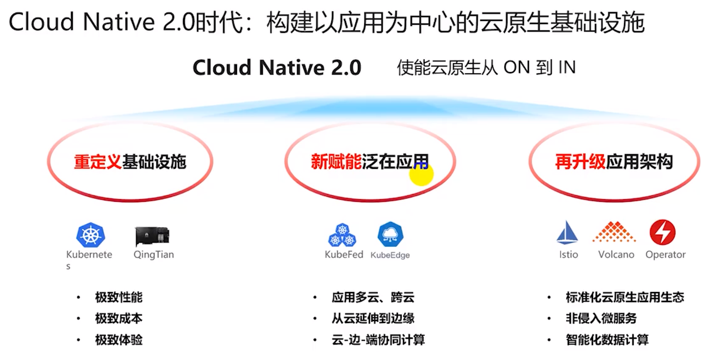
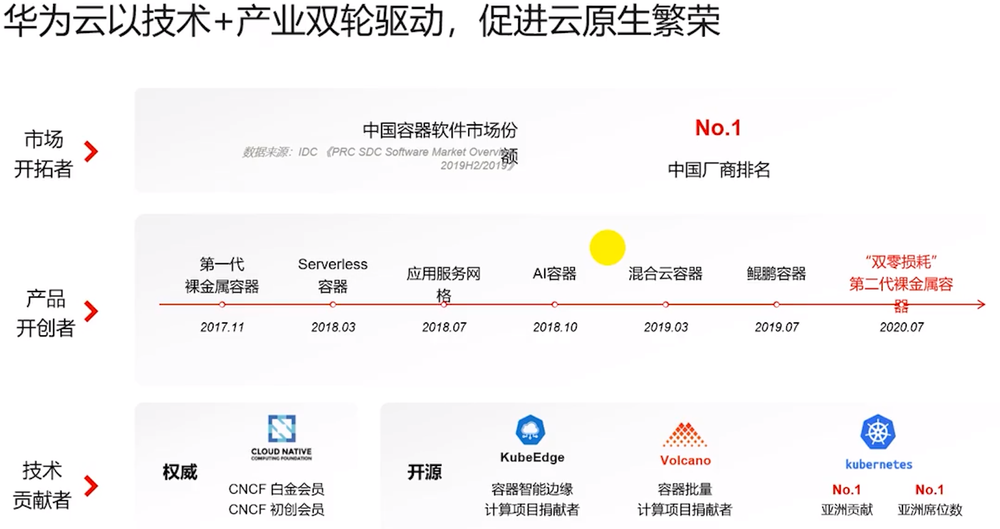
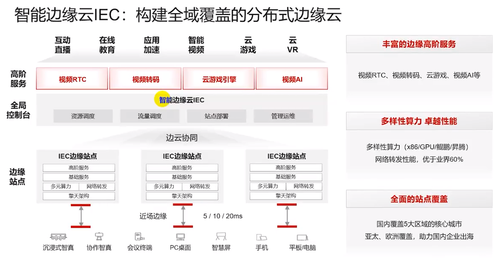

第一章 华为云基础服务业务进展简介

1.1 华为云基础服务业务进展简介

1.1华为云基础服务业务进展简介.mp4

# 第二章 公有云基础设施的趋势

## 2.1 公有云基础设施的趋势

云原生

# 第三章 华为云基础服务介绍

## 3.1云原生

## 3.2华为云边缘

3.3多元算力

3.3 多元算力.mp4

3.4极速云存储

3.4 极速云存储.mp4

第四章 创新产品和解决方案

4.1 创新产品和解决方案

4.1 创新产品和解决方案.mp4

第五章 华为云基础服务技术主打----引领创新、面向未来

5.1 华为云基础服务技术主打----引领创新、面向未来

5.1 华为云基础服务技术主打----引领创新、面向未来.pdf

自测题