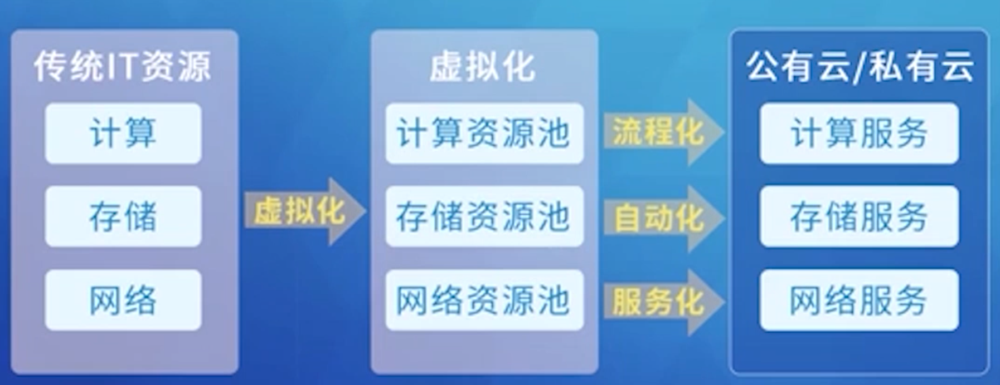
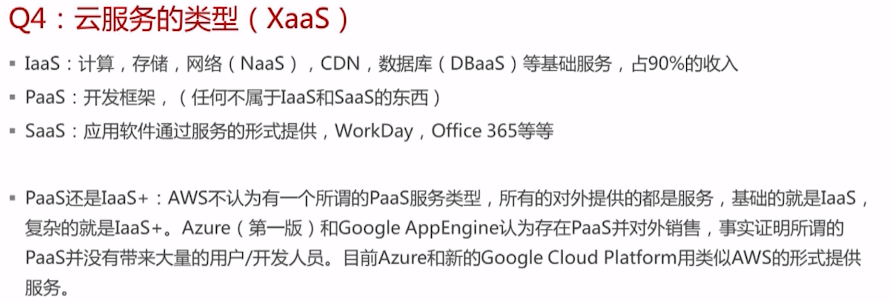
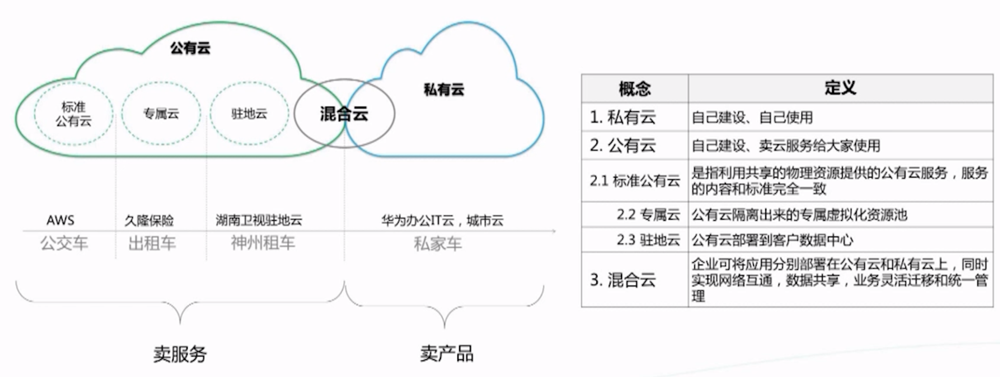
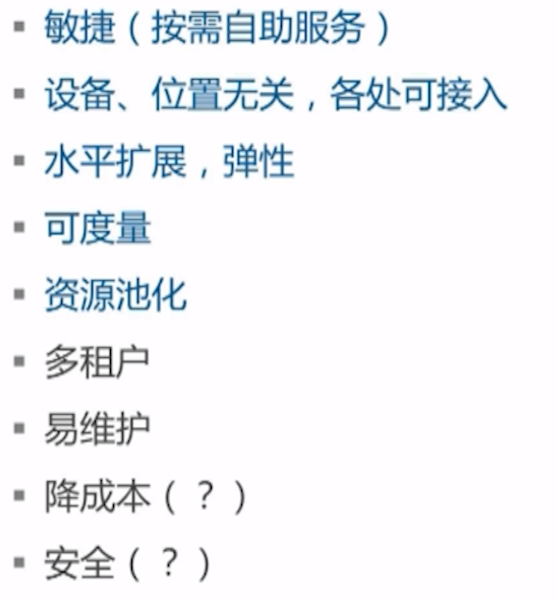
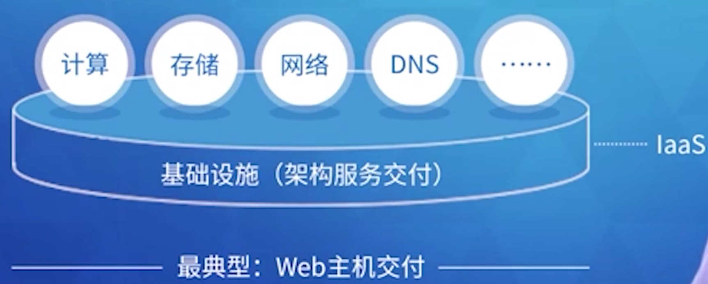
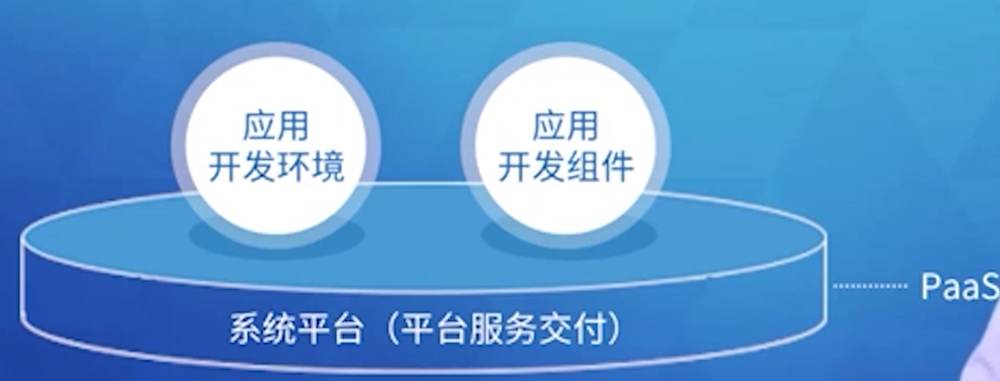
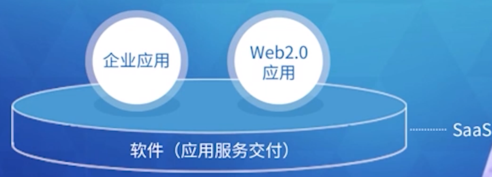
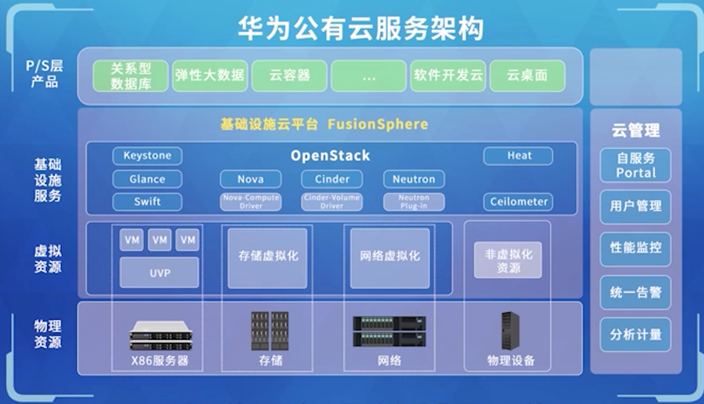

## 1.1 初识云计算

### 1.1.3 云计算的基本技术特性.mp4

计算资源逻辑化，单位CPU虚拟化能力，

存储资源逻辑化，软件定义的存储，通过网络互联，计算存储，有网络有本地可以算法优化对象存储

网络资源逻辑化，提升IO能力

安全资源逻辑化

VM资源是逻辑资源，内存分配映射关系，热添加运行时添加。部署多台主机加到一个集群，VM在主机之间迁移，可以人工做或者自动化完成DRS,  可用性保护：宕机受保护的在其他启动。

DPM: 分布式电源管理

规模变大降人工，企业内部是私有云，

### 1.1.2 云计算的发展过程

虚拟化：计算，存储，网络资源虚拟化

Hypervisor层管理底层的硬件

弹性调度

HA,DRS

混合云：私有公有

### 1.1.1 云计算的兴起

传统的存在缺点，扩容问题，硬件问题

## 1.2 云计算的来龙去脉

### 1.2.4 云服务的类型

### 1.2.3 云计算的部署模式

### 1.2.2 云计算有哪些特点

### 1.2.1 什么是云计算、云服务

云计算是技术， XaaS云服务，

1.3 测试题

1.3 测试题

第二章 走近华为云

## 2.1 云的价值及华为云

## 2.2 华为公有云服务架构

2.3 测试题

走近华为云-测试题

第三章 华为云快速入门

3.1 注册并认证华为云账号

3.2 华为云官网首页介绍

3.2 华为云官网首页介绍.mp4

3.3 购买和管理华为云产品

3.3 购买和管理华为云产品.mp4

3.4 费用管理

3.4 费用管理.mp4

3.5 服务与支持

3.5 服务与支持.mp4

3.6 测试题

3.6 测试题

第四章 华为云专业名词解释

4.1 华为云专业名词解释

4.1 华为云专业名词解释.docx