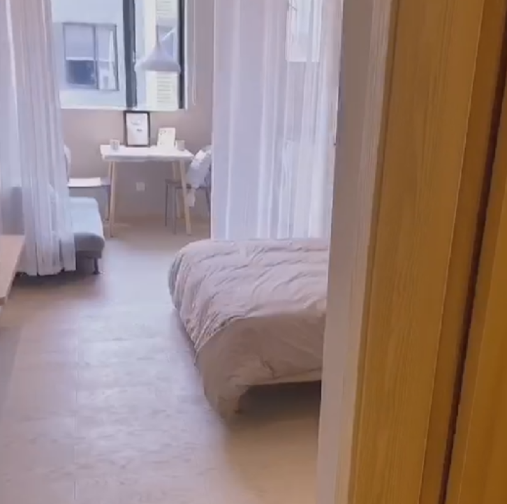

华为坂田基地E区

### 可 精美独栋公寓，非城中村 2380-2680 3.2km 26min地铁不错

**地址：雪象地铁站-C口**

地铁口零距离

酒店式公寓
管理费200/间、水7.5/吨，电1.6/℃ 
可以养猫，狗不可以养
有公区网络，自己房间接网络的话每月几十块，电信联通线已接好，开通就可以

一楼有免费公用厨房、卫生间、书吧、健身器材、休闲社区

### 2080-2180的价格 马蹄山村(坂雪岗大道4003-9号) 1.5km

### 一室一厅，2980 马蹄山村综合大楼-东门 1.1km