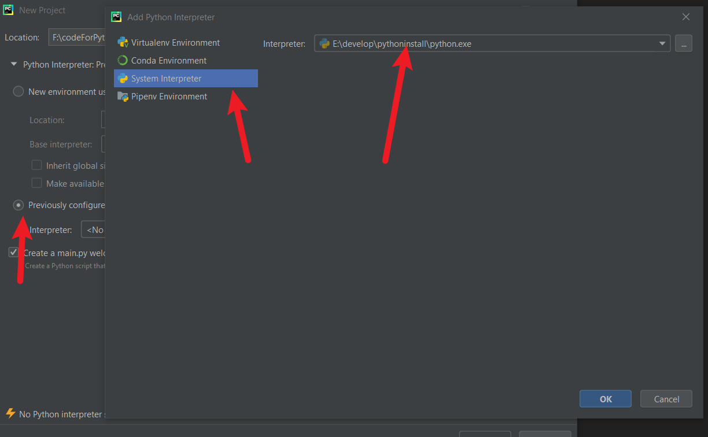
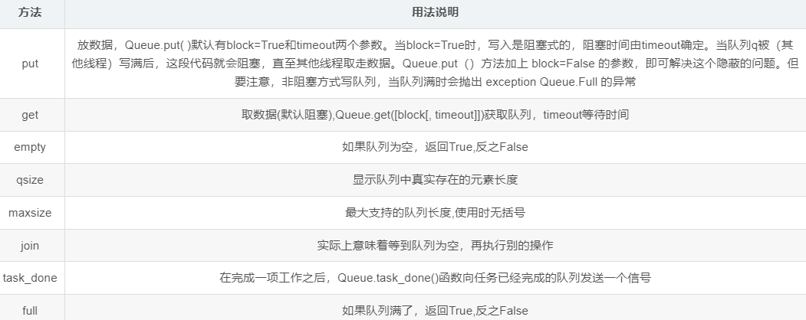
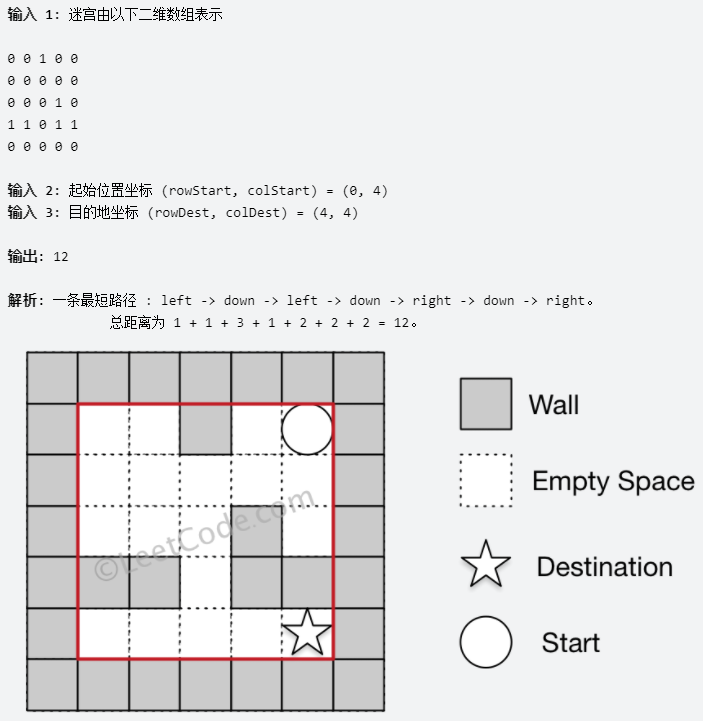

# 创建文件




# 输出

```python
# 注释内容  单行注释

"""
第⼀一⾏行行注释
第⼆二⾏行行注释
第三⾏行行注释
"""

'''
注释1
注释2
注释3
'''
数据类型
整型： int
浮点型： float
字符串串： str
布尔型： bool
元组： tuple
集合： set
字典： dict  
```

| 格式符号 | 转换                      |
| -------- | ------------------------- |
| %s       | 字符串， 可以输出各种数据 |
| %d       | 有符号的十进制整数        |
| %f       | 浮点数                    |
| %c       | 字符                      |
| %u       | 无符号十进制整数          |
| %o       | 八进制整数                |


%(括号里可以操作)， f-格式化字符串串是Python3.6中新增的格式化⽅方法，该⽅方法更更简单易易读。  


```python
print('我的体重是%.2f公⽄斤' % weight)
# 我的名字是TOM，今年年18岁了了
print('我的名字是%s，今年年%d岁了了' % (name, age))
# 我的名字是TOM，明年年19岁了了
print('我的名字是%s，明年年%d岁了了' % (name, age + 1))
# 我的名字是TOM，明年年19岁了了
print(f'我的名字是{name}, 明年年{age + 1}岁了了')
```

\n ：换行。
\t ：制表符，⼀一个tab键（4个空格）的距离。  

```python
print('hello\npython')
print('\thellopython')
print('输出的内容', end="") # 取消换行
```

# 输入

当程序执⾏行行到 input ，等待⽤用户输入，输入完成之后才继续向下执行。
在Python中， input 接收⽤用户输⼊入后，⼀般存储到变量，⽅便使⽤用。
在Python中， input 会把接收到的任意⽤用户输入的数据都当做==字符串==处理。  

```python
password = input('请输⼊入您的密码： ')
print(f'您输⼊入的密码是{password}')
# <class 'str'>
print(type(password))
```

# P32 转换数据类型  

| 函数                   | 说明                                                      |
| ---------------------- | --------------------------------------------------------- |
| int(x [,base ])        | 将x转换为⼀一个整数                                       |
| float(x )              | 将x转换为一个浮点数                                       |
| complex(real [,imag ]) | 创建一个复数， real为实部， imag为虚部                    |
| str(x )                | 将对象 x 转换为字符串串                                   |
| repr(x )               | 将对象 x 转换为表达式字符串串                             |
| eval(str )             | ⽤用来计算在字符串串中的有效Python表达式,并返回⼀一个对象 |
| tuple(s )              | 将序列列 s 转换为一个元组                                 |
| list(s )               | 将序列列 s 转换为一个列表                                 |

```python
password = input('please input your password:')
print(f'you password is {password}')

print(type(password))
print(type(int(password)))

# 1. float() -- 转换成浮点型
num1 = 1
print(float(num1))
print(type(float(num1)))
# 2. str() -- 转换成字符串串类型
num2 = 10
print(type(str(num2)))
# 3. tuple() -- 将⼀个序列列转换成元组
list1 = [10, 20, 30]
print(tuple(list1))
print(type(tuple(list1)))
# 4. list() -- 将一个序列转换成列表
t1 = (100, 200, 300)
print(list(t1))
print(type(list(t1)))
# 5. eval() -- 将字符串中的数据转换成Python表达式原本类型
str1 = '10'
str2 = '[1, 2, 3]'
str3 = '(1000, 2000, 3000)'
print(type(eval(str1)))
print(type(eval(str2)))
print(type(eval(str3))) #eval可以帮忙转换字符串里的数据转换成原本的数据类型
```

不加print也可以在python console里面打印， close project可以关闭清空

# p36 运算符

| //   | 整除 | 9 // 4 输出结果为2                     |
| ---- | ---- | -------------------------------------- |
| %    | 取余 | 9 % 4 输出结果为 1                     |
| **   | 指数 | 2 ** 4 输出结果为 16，即 2 * 2 * 2 * 2 |

多个变量量赋值  

```python 
num1, float1, str1 = 10, 0.5, 'hello world'  
```

**逻辑运算符**  

```python
a = b = 10  # 多变量量赋相同值  
a = 1
b = 2
c = 3
print((a < b) and (b < c)) # True
print((a > b) and (b < c)) # False
print((a > b) or (b < c)) # True
print(not (a > b)) # True
```

# if else 

```python
age = int(input('please input your age:'))
if age >= 18:
    print(f'your age is {age}, good to go')
else: # 和if顶格！！
    print(f'your age is {age}, go back home')
print('check out')
```

**elif多重判断**

```python
age = int(input('please input your age: '))
if age < 18:
    print(f'your age is {age}, too young')
elif age >= 18 and age <= 60:
    print(f'your age is {age}, you can work')
elif age > 60:
    print(f'your age is {age}, you can retire')
    
# 拓展： age >= 18 and age <= 60 可以化简为 18 <= age <= 60 。
```

- 三目运算符  

```
条件成立执行的表达式 if 条件 else 条件不成立执行的表达式  
a = 1
b = 2
c = a if a > b else b
print(c)
```

# While循环

```python
# while loop 
i = 1
result = 0
while i <= 100:
    if i % 2 == 0:
        result += i
    i += 1
print(result)
```

**break:** 终止此循环  

```python
i = 1
while i <= 5:
    if i == 4:
        print(f'I can\'t eat anything')
        break
    print(f'I eat {i} apple')
    i += 1
```

**continue:** 退出当前一次循环继而执行下一次循环代码  

```python
i = 1
while i <= 5:
    if i == 3:
        print(f'big bug, I can\'t eat {i}')
        # 在continue之前⼀一定要修改计数器，否则会陷入死循环
        i += 1
        continue
    print(f'I eat {i} apple')
    i += 
```

```python
# while嵌套打印乘法表
j = 1
while j <= 9:
    i = 1
    while i <= j:
        print(f'{i} * {j} = {j * i}', end='\t')
        i += 1
    print()
    j += 1
```

# P84 For loop 

```python
'''
for 临时变量量 in 序列:
重复执行的代码1
重复执行的代码2
'''
str = 'itheima'
for i in str:
    if i == 'e':
        print('遇到e不打印')
        continue
    print(i)
    
另外一种执行循环的遍历方式是通过索引，如下实例：   
#!/usr/bin/python
# -*- coding: UTF-8 -*-
 
fruits = ['banana', 'apple',  'mango']
for index in range(len(fruits)):
   print ('当前水果 : %s' % fruits[index])
 
print ("Good bye!")
```

# while...else  

```python
i = 1
while i <= 5:
    if i == 3:
        print('这遍说的不真诚')
        i += 1
        continue
    print('媳妇⼉儿，我错了了')
    i += 1
else:
    print('媳妇原谅我了了，真开⼼心，哈哈哈哈')
```

>所谓else指的是循环正常结束之后要执⾏行行的代码，即如果是break终止循环的情况， else下方缩进的代码将不执行。  
>
>因为continue是退出当前一次循环，继续下一次循环，所以该循环在continue控制下是可以正常结束的，当循环结束后，则执行了else缩进的代码  

```python
str1 = 'itheima'
for i in str1:
    if i == 'e':
        print('遇到e不打印')
        break
    print(i)
else:
    print('循环正常结束之后执⾏行行的代码')
```

# 字符串

> 注意：三引号形式的字符串串⽀支持换行  

```python
a = ''' i am Tom,
		nice to meet you! '''
d = 'I\'m Tom'
```

取到不同**下标**对应的数据  

```python
name = "abcdef"
print(name[1])
print(name[0])
print(name[2])
```

## 切片  

字符串、列表、元组都支持切片操作。  

```
序列[开始位置下标:结束位置下标:步长]
```

> 不包含结束位置下标对应的数据， 正负整数均可；步长是选取间隔，正负整数均可，默认步长为1。  

```python 
name = "abcdefg"
print(name[2:5:1]) # cde
print(name[::2]) # aceg
print(name[:-1]) # abcdef, 负1表示倒数第⼀一个数据
print(name[-4:-1]) # def
print(name[::-1]) # gfedcba
```

- 查找

  find()

```python
字符串序列.find(⼦串, 开始位置下标, 结束位置下标)
mystr = "hello world and itcast and itheima and Python"
print(mystr.find('and')) # 12
print(mystr.find('and', 15, 30)) # 23
print(mystr.find('ands')) # -1
```

 index()：

```python
检测某个子串是否包含在这个字符串中，如果在返回这个子串串开始的位置下标，否则则报异常  
print(mystr.index('and')) # 12
print(mystr.index('and', 15, 30)) # 23
print(mystr.index('ands')) # 报错
```

`rfind()`： 和find()功能相同，但查找方向为右侧开始。
`rindex()`：和index()功能相同，但查找方向为右侧开始。
`count()`：返回某个子串在字符串中出现的次数  

- 修改  

replace()

split()

split()

```python
字符串序列.replace(旧子串, 新子串, 替换次数)
# 结果： hello world he itcast he itheima he Python
print(mystr.replace('and', 'he'))

=============
split()：按照指定字符分割字符串。
字符串序列.split(分割字符, num) # num表示的是分割字符出现的次数，即将来返回数据个数为num+1个
# 结果： ['hello', 'world', 'and', 'itcast', 'and', 'itheima', 'and', 'Python']
print(mystr.split(' '))
```

join()：⽤用一个字符或子串合并字符串，即是将多个字符串合并为⼀一个新的字符串串。  

```python 
list1 = ['chuan', 'zhi', 'bo', 'ke']
t1 = ('aa', 'b', 'cc', 'ddd')
# 结果： chuan_zhi_bo_ke
print('_'.join(list1))
# 结果： aa...b...cc...ddd
print('...'.join(t1))
```

capitalize()：将字符串第一个字符转换成大写。  

title()：将字符串每个单词首字母转换成大写  

lower()：将字符串串中大写转小写。  

upper()：将字符串中小写转大写。  

lstrip()：删除字符串左侧空白字符。  

rstrip()：删除字符串右侧空白字符。  

strip()：删除字符串两侧空白字符。  

```python
# 结果： Hello World And Itcast And Itheima And Python
print(mystr.title())
```

ljust()：返回一个原字符串左对齐,并使用指定字符(默认空格)填充⾄至对应长度 的新字符串。  

rjust()：返回一个原字符串右对齐,并使用指定字符(默认空格)填充至对应长度 的新字符串串，语法和ljust()相同。
center()：返回一个原字符串居中对齐,并使用指定字符(默认空格)填充至对应长度的新字符串，语法和ljust()相同。  

- 判断

startswith()：检查字符串是否是以指定子串开头，是则返回 True，否则返回 False。如果设置开始和结束位置下标，则在指定范围内检查。  

endswith()：检查字符串是否是以指定子串结尾，是则返回 True，否则返回 False。如果设置开始和结束位置下标，则在指定范围内检查。  

```
字符串序列.startswith(子串, 开始位置下标, 结束位置下标)
```

isalpha()：如果字符串至少有一个字符并且所有字符都是字母则返回 True, 否则返回 False。  

```python
mystr1 = 'hello'
mystr2 = 'hello12345'
# 结果： True
print(mystr1.isalpha())
# 结果： False
print(mystr2.isalpha())
```

isdigit()：如果字符串只包含数字则返回 True 否则返回 False。  

isalnum()：如果字符串串⾄至少有一个字符并且所有字符都是字母或数字则返 回 True,否则返回False。  

isspace()：如果字符串中只包含空白，则返回 True，否则返回 False。  

# 列表

## 查找

index()：返回指定数据所在位置的下标 。  

len()：访问列表长度，即列表中数据的个数。  

```python
name_list = ['Tom', 'Lily', 'Rose']
print(name_list[0]) # Tom
print(name_list[1]) # Lily
print(name_list.index('Lily', 0, 2)) # 1
print(name_list.count('Lily')) # 1
print(len(name_list)) # 3
```

## in判断存在

in：判断指定数据在某个列表序列，如果在返回True，否则返回False  

not in：判断指定数据不在某个列表序列，如果不在返回True，否则返回False  

```python
print('Lily' in name_list)# 结果： True
name = input('请输⼊入您要搜索的名字： ')
if name in name_list:
	print(f'您输⼊入的名字是{name}, 名字已经存在')
else:
	print(f'您输⼊入的名字是{name}, 名字不不存在')
```

## append添加

```python
name_list.append('xiaoming')
```

如果append()追加的数据是⼀个序列，则追加整个序列表  

```python
name_list.append(['xiaoming', 'xiaohong'])
# 结果： ['Tom', 'Lily', 'Rose', ['xiaoming', 'xiaohong']]
print(name_list)
```

- extend()：列表结尾追加数据，如果数据是一个序列，则将这个序列的数据逐一添加到列表。  

```python
列表序列.extend(数据)
name_list.extend('xiaoming')
# 结果： ['Tom', 'Lily', 'Rose', 'x', 'i', 'a', 'o', 'm', 'i', 'n', 'g']
print(name_list)

========注意====== 
name_list.extend(['xiaoming', 'xiaohong'])
# 结果： ['Tom', 'Lily', 'Rose', 'xiaoming', 'xiaohong']
print(name_list)
```

- insert()：指定位置新增数据。  

```python
name_list.insert(1, 'xiaoming')
# 结果： ['Tom', 'xiaoming', 'Lily', 'Rose']
print(name_list)
```

## del删除

```python
2.1 删除列列表
name_list = ['Tom', 'Lily', 'Rose']
# 结果：报错提示： name 'name_list' is not defined
del name_list
print(name_list)

2.2 删除指定数据
del name_list[0]
# 结果： ['Lily', 'Rose']
print(name_list)


```

- pop()：删除指定下标的数据(默认为最后一个)，并返回该数据

```python
name_list = ['Tom', 'Lily', 'Rose']
del_name = name_list.pop(1)
# 结果： Lily
print(del_name)
# 结果： ['Tom', 'Rose']
print(name_list)  
```

- remove()：移除列表中某个数据的第一个匹配项。  

```python
name_list = ['Tom', 'Lily', 'Rose']
name_list.remove('Rose')
# 结果： ['Tom', 'Lily']
print(name_list)
```

- clear()：清空列列表  

```python
name_list = ['Tom', 'Lily', 'Rose']
name_list.clear()
print(name_list) # 结果： []
```

## 修改

```python
name_list = ['Tom', 'Lily', 'Rose']
name_list[0] = 'aaa'
# 结果： ['aaa', 'Lily', 'Rose']
print(name_list)
```

- 逆置： reverse()  

```python
num_list = [1, 5, 2, 3, 6, 8]
num_list.reverse()
# 结果： [8, 6, 3, 2, 5, 1]
print(num_list)
```

- sort()

>注意： reverse表示排序规则， reverse = True 降序， reverse = False 升序（默认）  

```python
num_list = [1, 5, 2, 3, 6, 8]
num_list.sort()
# 结果： [1, 2, 3, 5, 6, 8]
print(num_list)
```

## 复制

函数： copy()  

```python
name_list = ['Tom', 'Lily', 'Rose']
name_li2 = name_list.copy()
# 结果： ['Tom', 'Lily', 'Rose']
print(name_li2)
```

## 遍历

```python
name_list = ['Tom', 'Lily', 'Rose']

i = 0
while i < len(name_list):
    print(name_list[i])
    i += 1

print('use for loop: ')
for i in name_list:
    print(i)
```

**列表嵌套**  

```python
name_list = [['⼩小明', '⼩小红', '⼩小绿'], ['Tom', 'Lily', 'Rose'], ['张三', '李李四','王五']]
```

# 元组

一个元组可以存储多个数据，元组内的数据是不能修改的。  

元组特点：定义元组使用小括号，且逗号隔开各个数据，数据可以是不同的数据类型。  

> 注意：如果定义的元组只有一个数据，那么这个数据后面也好添加逗号，否则数据类型为唯一的这个数据的数据类型  

```python
t2 = (10,)
print(type(t2)) # tuple
t3 = (20)
print(type(t3)) # int
t4 = ('hello')
print(type(t4)) # str
```

- 按下标查找数据  

```python
tuple1 = ('aa', 'bb', 'cc', 'bb')
print(tuple1[0]) # aa 

tuple1 = ('aa', 'bb', 'cc', 'bb')
print(tuple1.index('aa')) # 0

print(tuple1.count('bb')) # 2

print(len(tuple1)) # 4
```

```python
tuple2 = (10, 20, ['aa', 'bb', 'cc'], 50, 30)
print(tuple2[2]) # 访问到列表
# 结果： (10, 20, ['aaaaa', 'bb', 'cc'], 50, 30)
tuple2[2][0] = 'Tom'
print(tuple2)# 结果： (10, 20, ['Tom', 'bb', 'cc'], 50, 30)
```

元组里面套了列表，可以修改列表

# 字典KV

字典⾥面的数据是以键值对形式出现  

符号为大括号
数据为键值对形式出现
各个键值对之间用逗号隔开  

- 增改

>注意：如果key存在则修改这个key对应的值；如果key不不存在则新增此键值对。  

```python
dict1 = {'name': 'Tom', 'age': 20, 'gender': '男'}
dict1['name'] = 'Rose' # 直接修改了
# 结果： {'name': 'Rose', 'age': 20, 'gender': '男'}
print(dict1)
dict1['id'] = 110
# {'name': 'Rose', 'age': 20, 'gender': '男', 'id': 110}
print(dict1)
```

- 删

del 删除字典或删除字典中指定键值对  

clear()：清空字典  

```python
dict1 = {'name': 'Tom', 'age': 20, 'gender': '男'}
del dict1['gender']
# 结果： {'name': 'Tom', 'age': 20}
print(dict1)

dict1.clear()
print(dict1) # {}
```

- 查

**key值查找**  

```python
dict1 = {'name': 'Tom', 'age': 20, 'gender': '男'}
print(dict1['name']) # Tom
print(dict1['id']) # 报错
```

```python
字典序列.get(key, 默认值)  
如果当前查找的key不存在则返回第⼆个参数(默认值)，如果省略略第⼆个参数，则返回None
dict1 = {'name': 'Tom', 'age': 20, 'gender': '男'}
print(dict1.get('name')) # Tom
print(dict1.get('id', 110)) # 110
print(dict1.get('id')) # None
```

**keys()**  

```python
dict1 = {'name': 'Tom', 'age': 20, 'gender': '男'}
print(dict1.keys()) # dict_keys(['name', 'age', 'gender'])
```

遍历字典的key  

```python
dict1 = {'name': 'Tome', 'age': 20, 'gender':'男'}

for key in dict1.keys():
    print(key)
```

**values()**  

```python
dict1 = {'name': 'Tom', 'age': 20, 'gender': '男'}
print(dict1.values()) # dict_values(['Tom', 20, '男'])
for value in dict1.values():
    print(value)
```

**items()**  元素

```python
dict1 = {'name': 'Tom', 'age': 20, 'gender': '男'}
print(dict1.items()) # dict_items([('name', 'Tom'), ('age', 20), ('gender','男')])
for item in dict1.items():
    print(item)
```

遍历字典的键值对  

```python
for key, value in dict1.items():
    print(f'{key} = {value}')
```

# 集合set

创建集合使用 {} 或 set() ， 但是如果要创建空集合只能使用 set() ，因为 {} 用来创建空字典。  

```python
s1 = {10, 20, 30, 40, 50}
print(s1)
s2 = {10, 30, 20, 10, 30, 40, 30, 50}
print(s2) # {40, 10, 50, 20, 30}
s3 = set('abcdefg')
print(s3)
s4 = set()
print(type(s4)) # set
s5 = {}
print(type(s5)) # dict
```

- 增  

add()

```python
s1 = {10, 20}
s1.add(100)
s1.add(10)
print(s1) # {100, 10, 20}
```

update(), 追加的数据是序列。  

```python
s1 = {10, 20}
# s1.update(100) # 报错
s1.update([100, 200])
s1.update('abc')
print(s1)
```

- 删  

remove()删除集合中的指定数据，如果数据不不存在则报错。  

```python
s1 = {10, 20}
s1.remove(10)
print(s1)
s1.remove(10) # 报错
print(s1)
```

discard()，删除集合中的指定数据，如果数据不存在也不会报错。  

```python
s1.discard(10)
```

pop()，随机删除集合中的某个数据，并返回这个数据。  

```python
s1 = {10, 20, 30, 40, 50}
del_num = s1.pop()
print(del_num)
print(s1)
```

- 查  

in：判断数据在集合序列列
not in：判断数据不不在集合序列列  

```python
s1 = {10, 20, 30, 40, 50}
print(10 in s1)
print(10 not in s1)
```

# 运算操作

| 运算符 | 描述           | ⽀支持的容器器类型       |
| ------ | -------------- | ------------------------ |
| +      | 合并           | 字符串、列表、元组       |
| *      | 复制           | 字符串、列表、元组       |
| in     | 元素是否存在   | 字符串、列表、元组、字典 |
| not in | 元素是否不存在 | 字符串、列表、元组、字典 |


```python
t1 = (1, 2)
t2 = (10, 20)
t3 = t1 + t2
print(t3) # (1, 2, 10, 20)

# 1. 字符串
print('-' * 10) # ----------
# 2. 列表
list1 = ['hello']
print(list1 * 4) # ['hello', 'hello', 'hello', 'hello']
# 3. 元组
t1 = ('world',)
print(t1 * 4) # ('world', 'world', 'world', 'world')
```


| 函数                    | 描述                                                         |
| ----------------------- | ------------------------------------------------------------ |
| len()                   | 计算容器中元素个数                                           |
| del 或 del()            | 删除                                                         |
| max()                   | 返回容器中元素最大值                                         |
| min()                   | 返回容器中元素最小值                                         |
| range(start, end, step) | 生成从start到end的数字，步长为 step，供for循环使⽤用         |
| enumerate()             | 函数用于将一个可遍历的数据对象(如列列表、元组或字符串)组合为一个索引序列，同时列出数据和数据下标，一般用在 for 循环当中。 |

```python
"""(0, 'a')
(1, 'b')
(2, 'c')
(3, 'd')
(4, 'e')"""
for i in enumerate(list1):
    print(i)
"""下标是1, 对应字符a
下标是2, 对应字符b
下标是3, 对应字符c
下标是4, 对应字符d
下标是5, 对应字符e """
for index, char in enumerate(list1, start=1):
	print(f'下标是{index}, 对应字符{char}')
```

**容器类型转换**  

- tuple()  将某个序列列转换成元组  

```python
list1 = [10, 20, 30, 40, 50, 20]
s1 = {100, 200, 300, 400, 500}
print(tuple(list1))
print(tuple(s1))
```

- list()  将某个序列转换成列表  

```python
t1 = ('a', 'b', 'c', 'd', 'e')
s1 = {100, 200, 300, 400, 500}
print(list(t1)) # ['a', 'b', 'c', 'd', 'e']
print(list(s1)) # [400, 100, 500, 200, 300]
```

- set()  将某个序列转换成集合  

```python
list1 = [10, 20, 30, 40, 50, 20]
t1 = ('a', 'b', 'c', 'd', 'e')
print(set(list1))
print(set(t1))
```

# 推导式

```python
list1 = []
i = 0
while i < 10:
    list1.append(i)
    i += 1
print(list1)

list2 = []
for i in range(10):
    list2.append(i)
print(list2)

list3 = [i for i in range(10)]
print(list3)
```

**带if的列表推导式**  

```python
list1 = [i for i in range(10) if i % 2 == 0]
print(list1)
```

**字典：** 

1. 创建⼀个字典：字典key是1-5数字， value是这个数字的2次方。  

```python
dict1 = {i: i**2 for i in range(1, 5)}
print(dict1) # {1: 1, 2: 4, 3: 9, 4: 16}
```

2. 将两个列表合并为一个字典  

```python
list1 = ['name', 'age', 'gender']
list2 = ['Tom', 20, 'man']
dict1 = {list1[i]: list2[i] for i in range(len(list1))}
print(dict1)
```

3. 提取字典中目标数据  

```python
counts = {'MBP': 268, 'HP': 125, 'DELL': 201, 'Lenovo': 199, 'acer': 99}
# 需求：提取上述电脑数量大于等于200的字典数据
count1 = {key: value for key, value in counts.items() if value >= 200} # for key, value in counts.items() 
print(count1) # {'MBP': 268, 'DELL': 201}
```

**集合推导式**  

```python
list1 = [1, 1, 2]
set1 = {i ** 2 for i in list1}
print(set1) # {1, 4}

# 列列表推导式
[xx for xx in range()]
# 字典推导式
{xx1: xx2 for ... in ...}
# 集合推导式
{xx for xx in ...}
```

# 函数

```python
def 函数名(参数):
代码1
代码2
......
```

在Python中，函数必须先定义后使用。  

```python
def add_num1(a, b):
    result = a + b
    print(result)
add_num1(10, 20)
```

函数返回值

```python
def sum_num(a, b):
    return a + b
result = sum_num(1, 2)# ⽤用result变量保存函数返回值
print(result)
```

定义函数的说明文档  

```python
def 函数名(参数):
	""" 说明⽂文档的位置 """
	代码
	......
```

查看函数说明文档

```python
help(函数名)

=====
def sum_num(a, b):
	""" 求和函数 """
	return a + b
help(sum_num)
```

多个返回值

```python
def return_num():
    return 1, 2
result = return_num()
print(result)# return a, b 写法，返回多个数据的时候，默认是元组类型
```

**关键字参数**  

通过“键=值”形式加以指定 , 不用管传参顺序

```python
def user_info(name, age, gender):
	print(f'您的名字是{name}, 年龄是{age}, 性别是{gender}')
user_info('Rose', age=20, gender='女')
user_info('小明', gender='男', age=16)
```

**缺省参数也叫默认参数**  

```python
def user_info(name, age, gender='男'):
	print(f'您的名字是{name}, 年年龄是{age}, 性别是{gender}')
user_info('TOM', 20)
user_info('Rose', 18, '⼥女女')
```

- 不定长参数  

1. 包裹位置传递  

用于不确定调用的时候会传递多少个参数  

```python
def user_info(*args):
	print(args)
# ('TOM',)
user_info('TOM')
# ('TOM', 18)
user_info('TOM', 18)
```

>注意：传进的所有参数都会被args变量收集，它会根据传进参数的位置合并为一个元组(tuple)，args是元组类型，这就是包裹位置传递  

2. 包裹==关键字==传递  返回的是字典

使用两个*

```python
def user_info(**kwargs):
	print(kwargs)
# {'name': 'TOM', 'age': 18, 'id': 110}
user_info(name='TOM', age=18, id=110)
```

- 拆包和交换变量量值  

1. 拆包  

拆包：元组  

```python
def return_num():
	return 100, 200
num1, num2 = return_num()
print(num1) # 100
print(num2) # 200
```

拆包：字典  

```python
dict1 = {'name': 'TOM', 'age': 18}
	a, b = dict1
# 对字典进行拆包，取出来的是字典的key
print(a) # name
print(b) # age
print(dict1[a]) # TOM
print(dict1[b]) # 18
```

- 引⽤

在python中，值是靠引用来传递来的。  

我们可以用 id()来判断两个变量量是否为同⼀一个值的引用。 我们可以将id值理解为那块内存的地址标识。  

```python
a = 1
b = a
print(b) # 1
print(id(a)) # 140708464157520
print(id(b)) # 140708464157520
```

**可变类型**
列
字典
集合
**不可变类型**
整型
浮点型
字符串串
元组  

- **递归**

```python
def sum_numbers(num):
    if num == 1:
        return 1
    return num + sum_numbers(num - 1)

print(sum_numbers(3))
```

# lambda 表达式  

如果一个函数有一个返回值，并且只有一句代码，可以使用 lambda简化。  

```python
lambda 参数列表 ： 表达式
```

- lambda表达式的参数可有可无，函数的参数在lambda表达式中完全适用。
- lambda函数能接收任何数量的参数但==只能返回一个表达式的值==  

```python
def fn1():
    return 200

print(fn1) # 输出的是内存地址
print(fn1())

#lambda表达式
fn2 = lambda: 100
print(fn2)
print(fn2())

def add(a, b):
    return a + b
result = add(1, 2)
print(result)
# lambda表达式
print((lambda a, b : a + b)(1, 2))
```

**lambda参数形式：**

1. 无参

```python
print((lambda: 100)())
```

2. 一个参数  

```python
print((lambda a : a)('hello'))
```

3. 默认参数  

```python
print((lambda a, b, c = 100: a + b + c)(10, 20))
```

4. 可变参数： **args  

```python
print((lambda *args：args)(10, 20, 30))
```

5. 可变参数： **kwargs  

```python
print((lambda **kwargs: kwargs)(name='python', age=20))
```
带判断的lambda

```
print((lambda a, b: a if a > b else b)(1000, 500))
```

列表数据按字典key的值排序  

```python
students = [
    {'name': 'TOM', 'age': 20},
    {'name': 'ROSE', 'age': 19},
    {'name': 'Jack', 'age': 22}
]
# 按name值升序排列列
students.sort(key=lambda x: x['name'])
print(students) # 列表可变 直接打印即可
# 按name值降序排列列
students.sort(key=lambda x: x['name'], reverse=True)
print(students)
# 按age值升序排列列
students.sort(key=lambda x: x['age'])
print(students)
```

# 高阶函数

https://blog.csdn.net/CLHugh/article/details/75000104 关于函数里的this

==把函数作为参数传入==，这样的函数称为高阶函数，高阶函数是函数式编程的体现。函数式编程就是指这种高度抽象的编程范式  

```python
def add_num(a, b):
    return abs(a) + abs(b)

result = add_num(-1, 2)
print(result)

def sum_num(a, b, f):
    return f(a) + f(b)
res = sum_num(-1, 2, abs) # abs是函数名
print(res)
```

**内置高阶函数**  

1. map()

map(func, lst)，将传入的函数变量func==作用到lst变量的每个元素中==，并将结果组成新的列表(Python2)/迭代器器(Python3)返回  

需求：计算 list1 序列中各个数字的2次方。  

```python
list1 = [1, 2, 3, 4, 5]
def func(x):
    return x ** 2
result = map(func, list1)
print(result) #<map object at 0x000002376AADEFA0>
print(list(result)) #[1, 4, 9, 16, 25]
```

2. reduce()

reduce(func(x,y)， lst)，其中func必须有两个参数。每次func计算的结果继续和序列的下一个元素做累积计算。  

>注意： reduce()传入的参数func必须接受2个参数。  

需求：计算 list1 序列中各个数字的累加和  

```python
import functools
list1 = [1, 2, 3, 4, 5]
def func(a, b):
    return a + b
result = functools.reduce(func, list1)
print(result) # 15
```

3. filter()  

filter(func, lst)函数用于过滤序列列, 过滤掉不符合条件的元素, 返回一个 filter 对象,。如果要转换为列表,可以使用 list() 来转换  

```python
list1 = [1,2,3,4,5,6,7, 8, 9, 10]
def func(x):
    return x % 2 == 0
result = filter(func, list1)
print(result) # <filter object at 0x000001E99B52EFA0>
print(list(result))# [2, 4, 6, 8, 10]
```

# 文件操作

1. 打开文件

使⽤用open函数，可以打开一个已经存在的⽂文件，或者创建一个新⽂文件，语法如下：  

```python
open(name, mode)
```

name：是要打开的目标文件名的字符串串(可以包含文件所在的具体路路径)。
mode：设置打开⽂文件的模式(访问模式)：只读、写入、追加等。  

>1. w 和 a 模式：如果⽂文件不存在则创建该⽂文件；如果文件存在， w 模式先清空再写入， a 模式
>     直接末尾追加。
>
>2. r 模式：如果文件不存在则报错。  

```python
f = open('test.txt', 'w')
f.write('hello world')
f.close()
```

2. 读

- read()

> num表示要从文件中读取的数据的⻓长度（单位是字节），如果没有传入num，那么就表示读取文件中所有的数据  

```python
f = open('test.txt', 'r')
print(f.read())
f.close()
```

- readlines

可以按照行的方式把整个文件中的内容进行一次性读取，并且返回的是一个列表，其中每⼀行的数据为一个元素。  

```python
f = open('test.txt')
content = f.readlines()
# ['hello world\n', 'abcdefg\n', 'aaa\n', 'bbb\n', 'ccc']
print(content)
# 关闭⽂文件
f.close()
```

- readline()

一次读取⼀行内容。  

```python
f = open('test.txt')
content = f.readline()
print(f'第一行： {content}')
content = f.readline()
print(f'第⼆行： {content}')
# 关闭⽂文件
f.close()
```

- seek()

```python
"""
语法： 文件对象.seek(偏移量, 起始位置)  0开头1当前2结尾
目标：
    1. r 改变文件指针位置：改变读取数据开始位置或把文件指针放结尾(无法读取数据)
    2. a 改变文件指针位置，做到可以读取出来数据
"""
# f = open('test.txt', 'r+')
f = open('test.txt', 'a+')

# 1. 改变读取数据开始位置
# f.seek(2, 0)
# 1. 把文件指针放结尾(无法读取数据)
# f.seek(0, 2)

# 2. a 改变文件指针位置，做到可以读取出来数据
# f.seek(0, 0) 也可以只写一个0
f.seek(0)

con = f.read()
print(con)

f.close()
```

**文件备份**

```python
# 1. 用户输入目标文件  sound.txt.mp3
old_name = input('请输入您要备份的文件名：')
# print(old_name)
# print(type(old_name))

# 2. 规划备份文件的名字
# 2.1 提取后缀 -- 找到名字中的点 -- 名字和后缀分离--最右侧的点才是后缀的点 -- 字符串查找某个子串rfind
index = old_name.rfind('.') #找到了.对应的下标
# print(index)

# 4. 思考：有效文件才备份 .txt
if index > 0:
    # 提取后缀
    postfix = old_name[index:]

# 2.2 组织新名字 = 原名字 + [备份] + 后缀
# 原名字就是字符串中的一部分子串 -- 切片[开始:结束:步长]
# print(old_name[:index])
# print(old_name[index:])
# new_name = old_name[:index] + '[备份]' + old_name[index:]
new_name = old_name[:index] + '[备份]' + postfix
print(new_name)

# 3. 备份文件写入数据(数据和原文件一样)
# 3.1 打开 原文件 和 备份文件
old_f = open(old_name, 'rb')
new_f = open(new_name, 'wb')

# 3.2 原文件读取，备份文件写入
# 如果不确定目标文件大小，循环读取写入，当读取出来的数据没有了终止循环
while True:
    con = old_f.read(1024)
    if len(con) == 0:
        # 表示读取完成了
        break

    new_f.write(con)

# 3.3 关闭文件
old_f.close()
new_f.close()
```

**文件夹**

```python
"""
1. 导入模块os
2. 使用模块内功能
"""
import os

# 1. rename(): 重命名
# os.rename('1.txt', '10.txt')

# 2. remove(): 删除文件
# os.remove('10.txt')

# 3. mkdir()：创建文件夹
# os.mkdir('aa')

# 4.rmdir(): 删除文件夹
# os.rmdir('aa')

# 5. getcwd(): 返回当前文件所在目录路径
# print(os.getcwd())

# 6. chdir():改变目录路径
# os.mkdir('aa')
# 需求：在aa里面创建bb文件夹: 1. 切换目录到aa，2创建bb
# os.mkdir('bb')

# os.chdir('aa')
# os.mkdir('bb') aa下面放入bb

# 7. listdir(): 获取某个文件夹下所有文件，返回一个列表
# print(os.listdir())
# print(os.listdir('aa'))

# 8. rename() -- 重命名文件夹  bb重命名为bbbb
os.rename('bb', 'bbbb')
```


```python
# 需求1：把code文件夹所有文件重命名 Python_xxxx
# 需求2： 删除Python_ 重命名：1， 构造条件的数据 2. 书写if
import os

# 构造条件的数据
flag = 2

# 1. 找到所有文件： 获取code文件夹的目录列表 -- listdir()
file_list = os.listdir()
print(file_list)

# 2. 构造名字
for i in file_list:
    if flag == 1:
        # new_name = 'Python_' + 原文件i
        new_name = 'Python_' + i
    elif flag == 2:
        # 删除前缀
        num = len('Python_')
        new_name = i[num:]
# 3. 重命名
    os.rename(i, new_name)

```


# python数据结构
## 队列

| 队列方式            | 特点         |
| ------------------- | ------------ |
| queue.Queue         | 先进先出队列 |
| queue.LifoQueue     | 后进先出队列 |
| queue.PriorityQueue | 优先级队列   |
| queue.deque         | 双线队列     |



### queue

```cpp
from queue import Queue,LifoQueue,PriorityQueue
```

```python
import queue
# 打印时候是阻塞的，因为创建了5个元素长度的队列，但我put进去了6个，所以就阻塞了。如果少写一个能显示出正确的123。    
q=queue.Queue(5)    #如果不设置长度,默认为无限长
print(q.maxsize = 0)    #注意没有括号 #maxsize设置队列中，数据上限，小于或等于0则不限制，容器中大于这个数则阻塞，直到队列中的数据被消掉
q.put(123)
q.put(456)
q.put(789)
q.put(100)
q.put(111)
print(q.get())#删除队列数据，并返回该数据
print(q.get())
-----------------------------------
5
123
456

print(q.get())
789
print(q.get())
100
print(q.get())
111
```

### 后进先出队列

```python
q = queue.LifoQueue()
q.put(12)
q.put(34)
print(q.get())#删除队尾数据，并返回该数据

-------------
34
```

### deque 

使用`list`存储数据时，按索引访问元素很快，但是插入和删除元素就很慢了，因为`list`是线性存储，数据量大的时候，插入和删除效率很低。

deque是为了高效实现插入和删除操作的双向列表，适合用于队列和栈：

```python
from collections import deque
# q = queue.deque() #或者这样也可
queue = deque(["Eric", "John", "Michael"])
queue.append("Terry")           # Terry 入队
queue.append("Graham")          # Graham 入队
queue.popleft()                 # 队首元素出队
#输出: 'Eric'
queue.popleft()                 # 队首元素出队
#输出: 'John'
print(queue)                           # 队列中剩下的元素
#输出: deque(['Michael', 'Terry', 'Graham'])

dq.appendleft('d')#增加数据到队左

```

python的queue里面可以直接放元组， neighbors = collections.deque([(r, c)]) 这里r，c就是我要的坐标而不用像java里面自己定义类和位置。

### 优先级队列

需要注意的是，优先级队列put的是一个元组，(优先级,数据)，**优先级数越小，级别越高**

```python
q = queue.PriorityQueue()
q.put((3,'aaaaa'))
q.put((3,'bbbbb'))
q.put((1,'ccccc'))
q.put((3,'ddddd'))
print(q.get())
print(q.get())
 --------------------------
(1, 'ccccc')
(3, 'aaaaa')
```

### defaultdict

使用`dict`时，如果引用的Key不存在，就会抛出`KeyError`。如果希望key不存在时，返回一个默认值，就可以用`defaultdict`：

```
>>> from collections import defaultdict
>>> dd = defaultdict(lambda: 'N/A')
>>> dd['key1'] = 'abc'
>>> dd['key1'] # key1存在
'abc'
>>> dd['key2'] # key2不存在，返回默认值
'N/A'
```

注意默认值是调用函数返回的，而函数在创建`defaultdict`对象时传入。

除了在Key不存在时返回默认值，`defaultdict`的其他行为跟`dict`是完全一样的。

### OrderedDict

使用`dict`时，Key是无序的。在对`dict`做迭代时，我们无法确定Key的顺序。

如果要保持Key的顺序，可以用`OrderedDict`：

```
>>> from collections import OrderedDict
>>> d = dict([('a', 1), ('b', 2), ('c', 3)])
>>> d # dict的Key是无序的
{'a': 1, 'c': 3, 'b': 2}
>>> od = OrderedDict([('a', 1), ('b', 2), ('c', 3)])
>>> od # OrderedDict的Key是有序的
OrderedDict([('a', 1), ('b', 2), ('c', 3)])
```

注意，`OrderedDict`的Key会按照插入的顺序排列，不是Key本身排序：

```
>>> od = OrderedDict()
>>> od['z'] = 1
>>> od['y'] = 2
>>> od['x'] = 3
>>> od.keys() # 按照插入的Key的顺序返回
['z', 'y', 'x']
```

`OrderedDict`可以实现一个FIFO（先进先出）的dict，当容量超出限制时，先删除最早添加的Key：

```python
from collections import OrderedDict

class LastUpdatedOrderedDict(OrderedDict):

    def __init__(self, capacity):
        super(LastUpdatedOrderedDict, self).__init__()
        self._capacity = capacity

    def __setitem__(self, key, value):
        containsKey = 1 if key in self else 0
        if len(self) - containsKey >= self._capacity:
            last = self.popitem(last=False)
            print 'remove:', last
        if containsKey:
            del self[key]
            print 'set:', (key, value)
        else:
            print 'add:', (key, value)
        OrderedDict.__setitem__(self, key, value)
```


## 2.创建二维数组的办法

#### 2.1 直接创建法

```python
test = [0, 0, 0], [0, 0, 0], [0, 0, 0]]
```

简单粗暴，不过太麻烦，一般不用。

#### 2.2 列表生成式法

```python
test = [[0 for i in range(m)] for j in range(n)]
```

学会使用列表生成式，终生受益。不会的可以去[列表生成式 - 廖雪峰的官方网站](https://www.liaoxuefeng.com/wiki/0014316089557264a6b348958f449949df42a6d3a2e542c000/001431779637539089fd627094a43a8a7c77e6102e3a811000)学习。

#### 2.3 使用模块numpy创建

```python
import numpy as np
test = np.zeros((m, n), dtype=np.int)
```


## Python写BFS

#### [102. 二叉树的层序遍历](https://leetcode-cn.com/problems/binary-tree-level-order-traversal/)

```python
class Solution:
    def levelOrder(self, root: TreeNode) -> List[List[int]]:
        res = [] #列表可以代替list
        if not root:
            return res
        queue = [root] # queue用列表表示，poll(0),append()
        while queue:  #queue不为空的判断
            cur_list = []
            size = len(queue)
            for _ in range(size): #循环写法
                cur_node = queue.pop(0)
                cur_list.append(cur_node.val)
                if cur_node.left: 
                    queue.append(cur_node.left)
                if cur_node.right: 
                    queue.append(cur_node.right)
            res.append(cur_list)
        return res
```

```JAVA
public List<List<Integer>> layerByLayer(TreeNode root) {
    List<List<Integer>> list = new ArrayList<List<Integer>>();
    if (root == null) {
        return list;
    }
    Queue<TreeNode> queue = new LinkedList<TreeNode>();
    queue.offer(root);
    while (!queue.isEmpty()) {
        //the list storing all the nodes on the current level
        List<Integer> curLayer = new ArrayList<Integer>();
        //the size of current level
        int size = queue.size();
        //traverse all teh nodes on the current level and
        //prepare for the next level
        for (int i = 0; i < size; i++) {
            TreeNode cur = queue.poll();
            curLayer.add(cur.key);
            if (cur.left != null) {
                queue.offer(cur.left);
            }
            if (cur.right != null) {
                queue.offer(cur.right);
            }
        }
        list.add(curLayer);
    }
    return list;
}
```

#### [490. 迷宫](https://leetcode-cn.com/problems/the-maze/)

>由空地（用 0 表示）和墙（用 1 表示）组成的迷宫 maze 中有一个球。球可以途经空地向 上、下、左、右 四个方向滚动，且在==遇到墙壁前==**不会停止滚动**。当球停下时，可以选择向下一个方向滚动。
>给你一个大小为 m x n 的迷宫 maze ，以及球的初始位置 start 和目的地 destination ，其中 start = [startrow, startcol] 且 destination = [destinationrow, destinationcol] 。请你判断球能否在目的地停下：如果可以，返回 true ；否则，返回 false 。
>
>你可以 假定迷宫的边缘都是墙壁（参考示例）。
>
>```
>Input 1: a maze represented by a 2D array
>
>0 0 1 0 0
>0 0 0 0 0
>0 0 0 1 0
>1 1 0 1 1
>0 0 0 0 0
>
>Input 2: start coordinate (rowStart, colStart) = (0, 4)
>Input 3: destination coordinate (rowDest, colDest) = (4, 4)
>
>Output: true
>```

```python
class Maze:
    def hasPath(self, maze: List[List[int]], start: List[int], destination: List[int]) -> bool:
        return self.bfs(maze, start, destination)

    def bfs(self, maze: List[List[int]], start: List[int], destination: List[int]) -> bool:
        row, col = len(maze), len(maze[0])
        visited = [[False for _ in range(col)] for _ in range(row)] #记忆化BFS
        q = [(start[0], start[1])] #start[0]就是start的第一个元素，start[1]是第二个元素
        visited[start[0]][start[1]] = True
        while q:
            r, c = q.pop(0)
            if [r, c] == destination:
                return True
            for dr, dc in ((0, 1), (1, 0), (0, -1), (-1, 0)):
                nr = r + dr
                nc = c + dr
                while 0 <= nr < row and 0 <= nc < col and maze[nr][nc] == 0: #沿着这个方向一直进行
                    nr += dr
                    nc += dc
                nr -= dr #碰壁了，往后退
                nc -= dc
                if visited[nr][nc] == False:
                    visited[nr][nc] = True
                    q.append((nr, nc)) #如果这个点没有遍历过，那么就入队，且标记为遍历过
        return False
```

#### [505. 迷宫 II](https://leetcode-cn.com/problems/the-maze-ii/)

>由空地和墙组成的迷宫中有一个球。球可以向上下左右四个方向滚动，但在遇到墙壁前不会停止滚动。当球停下时，可以选择下一个方向。
>
>给定球的起始位置，目的地和迷宫，找出让球停在目的地的最短距离。距离的定义是球从起始位置（不包括）到目的地（包括）经过的空地个数。如果球无法停在目的地，返回 -1。
>
>迷宫由一个0和1的二维数组表示。 1表示墙壁，0表示空地。你可以假定迷宫的边缘都是墙壁。起始位置和目的地的坐标通过行号和列号给出。
>
>

`
