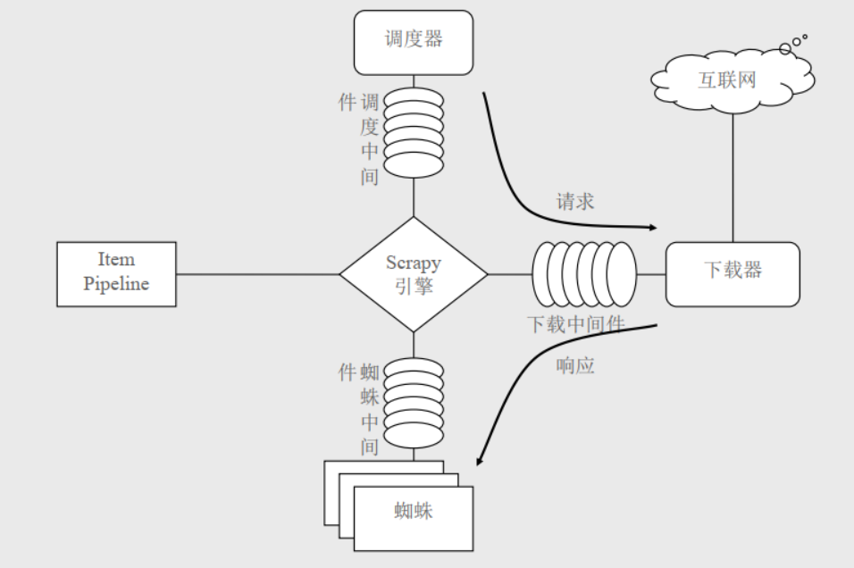
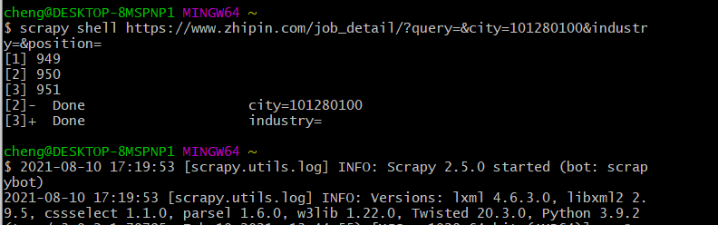
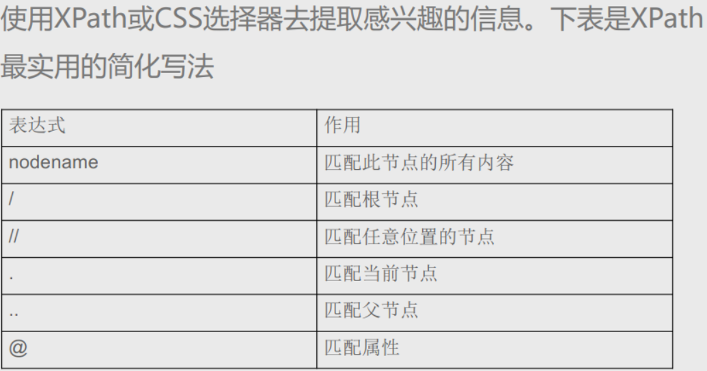

1. https://www.lfd.uci.edu/~gohlke/pythonlibs/#twisted

找到网站下载

2. 进入路径下载

 pip install Twisted-20.3.0-cp39-cp39-win_amd64.whl

pip install scrapy

scrapy startproject ZhipinSpider

# 使用shell调试

git使用：然后加上网址

scrapy shell https://www.zhipin.com/job_detail/?query=&city=101280100&industry=&position=

 response   <403 https://www.zhipin.com/job_detail/?query=> 反爬虫处理了，处理方法

浏览器伪装，模拟登录

scrapy shell -s USER_AGENT='Mozilla/5.0' https://www.zhipin.com/job_detail/?query=&city=101280100&industry=&position=

然后response是200

