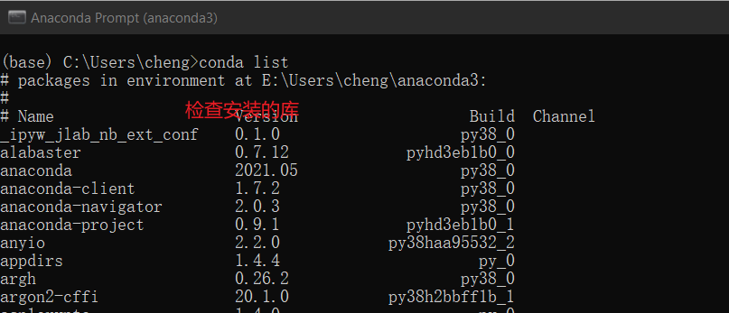
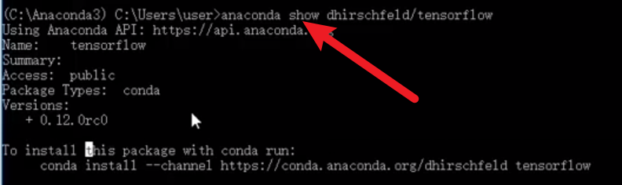
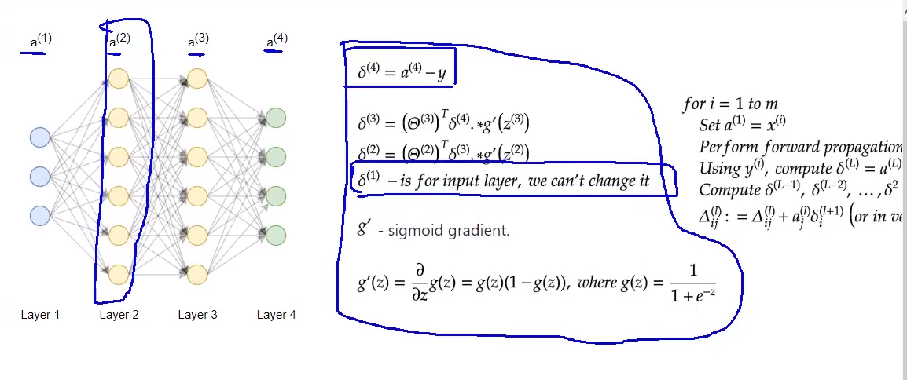
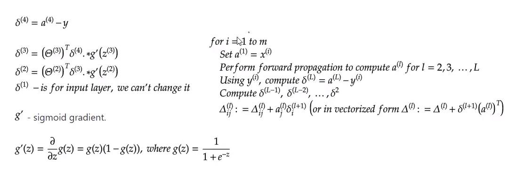

#### 装Anaconda



shift + enter **一行一行运行**，可以分模块运行。但是大的代码没有debug

安装库： anaconda search -t conda tensorflow 



**Numpy矩阵操作**

F:\JupyterNodebook\1-科学计算库numpy

**pandas**数据处理库

F:\JupyterNodebook\2-数据分析处理库pandas

F:\秋招\python学习

<<<<<<< HEAD





```python
def train(self, max_iterations=1000, alpha=0.1): 得到cost和权重thetas 
def predict(self, data): 使用feedforward_propagation得到预测概率值
def thetas_init(layers):  # 初始化权重值
def gradient_descent(data, labels, unrolled_theta, layers, max_iterations, alpha):得到cost和权重thetas 
    调用 def cost_function(data, labels, thetas, layers):


```


1. **train**(self, max_iterations=1000, alpha=0.1): 得到cost_history和优化权重thetas 

2. train调用**gradient_descent**(data, labels, unrolled_theta, layers, max_iterations, alpha): 

在这个里面定义了迭代次数后调用cost_function： 得到cost_history,调用gradient_step 得到optimized_theta

3.  def cost_function(data, labels, thetas, layers):

​         #从前往后走一次，先得到前向传播的结果 然后和真实值比较

```
predictions = MultilayerPerceptron.feedforward_propagation(data, thetas, layers) # 用到了sigmoid
```

```
cost = (-1 / num_examples) * (bit_set_cost + bit_not_set_cost)
```

4. def gradient_step(data, labels, optimized_theta, layers): #这里得到梯度值更新 调用back_propagation
5.  def **back_propagation**(data, labels, thetas, layers): 会遍历每一个样本

```
layers_activations[0] = layers_activation #第0层
```


# 研究

```python
nn_architecture = [
    {"in_size": 784, "out_size": 200, "activation": "relu"},
    {"in_size": 200, "out_size": 50, "activation": "relu"},
    {"in_size": 50, "out_size": 10, "activation": "softmax"}
]

train(train_image, train_label_one_hot, params, nn_architecture, epoch)
output, memory = full_forward_propagation(pic_input, parameters, architecture)


single_layer_forward_propagation(a_cur, W_cur, b_cur, activation)
def single_layer_forward_propagation(a, W, b, activation):

backward_propagation(output, pic_label, parameters, memory, pic_input, architecture)


train_data = data["train_image"] # size: 60000*784
train_label_one_hot = data["train_label_one_hot"]  # size: 60000*10
train_label = data["train_label"] # size: 60000*1
test_data = data["test_image"] # size: 10000*784
test_label = data["test_label"] # size: 10000*1
```

使用relu 

Accuracy:9577/10000 (95.77%)

total cost time:18.081511974334717
=======
## 手写识别

Numpy矩阵操作


>>>>>>> 0603e4d25ffbd4cb31b0afe3ff587c6a2da5a167

