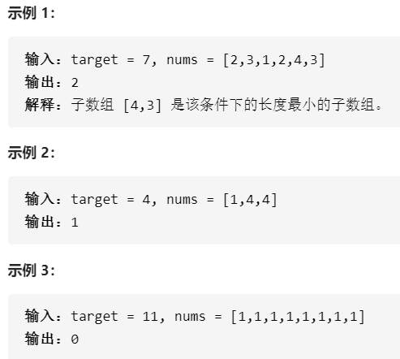
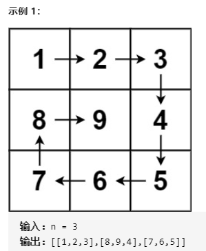
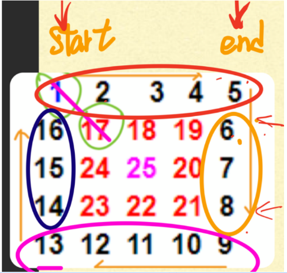

# Binary Search
## Classical Binary Search
Given a target integer T and an integer array A sorted in ascending order, find the index i such that A[i] == T or return -1 if there is no such index.

Assumptions

There can be duplicate elements in the array, and you can return any of the indices i such that A[i] == T.
Examples

A = {1, 2, 3, 4, 5}, T = 3, return 2
A = {1, 2, 3, 4, 5}, T = 6, return -1
A = {1, 2, 2, 2, 3, 4}, T = 2, return 1 or 2 or 3
Corner Cases

What if A is null or A is of zero length? We should return -1 in this case.
思路：
1. 判断为空或者为长度为0
2. 左右边界while遍历
3. while (left <= right) , mid在里面
			

```java
public class Solution {
	public int binarySearch(int[] array, int target) {
		if (array == null || array.length == 0) {
			return -1;
		}
		int left = 0;
		int right = array.length - 1;
		
		while (left <= right) {
		
			int mid = left + (right - left) / 2;
			
			if (array[mid] == target) {
				return mid;
			} else if (array[mid] < target) {
				left = mid + 1;
			} else {
				right = mid - 1;
			}
		}
		return -1;
	}
}
```
## 267. Search In Sorted Matrix I
Given a 2D matrix that contains integers only, which each row is sorted in an ascending order. The first element of next row is larger than (or equal to) the last element of previous row.

Given a target number, returning the position that the target locates within the matrix. If the target number does not exist in the matrix, return {-1, -1}.

Assumptions:

The given matrix is not null, and has size of N * M, where N >= 0 and M >= 0.
Examples:

matrix = { {1, 2, 3}, {4, 5, 7}, {8, 9, 10} }

target = 7, return {1, 2}

target = 6, return {-1, -1} to represent the target number does not exist in the matrix.
简单! 
思路: 二维矩阵变成一维,二分查找
注意
		int row = mid / cols;
		int col = mid % cols;
		没找到时: return new int[] {-1, -1};

```java
public class Solution {
  public int[] search(int[][] matrix, int target) {
	if (matrix.length == 0 || matrix[0].length == 0) {
		return new int[] {-1, -1};
	}
	int rows = matrix.length;
	int cols = matrix[0].length;
	int left = 0;
	int right = rows * cols - 1;
	while (left <= right) {
		int mid = left + (right - left) / 2;
		int row = mid / cols;
		int col = mid % cols;
		if (matrix[row][col] == target) {
			return new int[] {row, col};
		} else if (matrix[row][col] < target) {
			left = mid + 1;
		} else {
			right = mid - 1;
		}
	}
	return new int[] {-1, -1};
}
}
```

##  Closest In Sorted Array
Given a target integer T and an integer array A sorted in ascending order, find the index i in A such that A[i] is closest to T.

Assumptions

There can be duplicate elements in the array, and we can return any of the indices with same value.
Examples

A = {1, 2, 3}, T = 2, return 1
A = {1, 4, 6}, T = 3, return 1
A = {1, 4, 6}, T = 5, return 1 or 2
A = {1, 3, 3, 4}, T = 2, return 0 or 1 or 2
Corner Case

What if A is null or A is of zero length? We should return -1 in this case.
- 找最近的,需要满足留有两个元素
  while(left < right - 1)
- 取绝对值

```java
public class Closest {
	public int closest(int[] array, int target) {
		if (array.length == 0 || array == null) {
			return -1;
		}
		int left = 0;
		int right = array.length - 1;
		while (left < right - 1) {
			int mid = left + (right - left) / 2;
			if (array[mid] == target) {
				return mid;
			} else if (array[mid] < target) {
				left = mid;
			} else {
				right = mid;
			}
		}
		if (Math.abs(array[left] - target) < Math.abs(array[right] - target)) {
			return left;
		} else {
			return right;
		}
	}
}
```
## 15. First Occurrence
Given a target integer T and an integer array A sorted in ascending order, find the index of the first occurrence of T in A or return -1 if there is no such index.

Assumptions

There can be duplicate elements in the array.
Examples

A = {1, 2, 3}, T = 2, return 1
A = {1, 2, 3}, T = 4, return -1
A = {1, 2, 2, 2, 3}, T = 2, return 1
Corner Cases

What if A is null or A of zero length? We should return -1 in this case.

- 需要保留两个数
   while (left < right - 1) 
- 最后先检查左边再检查右边

```java
public class Solution {
	public int firstOccur(int[] array, int target) {
		if (array.length == 0 || array == null) {
			return -1;
		}
		int left = 0;
		int right = array.length - 1;
		while (left < right - 1) {
			int mid = left + (right - left) / 2;
			if (array[mid] >= target) {
				right = mid; //先把右边逼近
			} else {
				left = mid;
			}
		}
		if (array[left] == target) {
			return left;
		} else if (array[right] == target) {
			return right;
		}
		return -1;
	} 
}
```

## 16. Last Occurrence
Given a target integer T and an integer array A sorted in ascending order, find the index of the last occurrence of T in A or return -1 if there is no such index.

Assumptions

There can be duplicate elements in the array.

Examples

A = {1, 2, 3}, T = 2, return 1
A = {1, 2, 3}, T = 4, return -1
A = {1, 2, 2, 2, 3}, T = 2, return 3
Corner Cases

What if A is null or A is array of zero length? We should return -1 in this case.
同样的道理 

- 先压缩左边if (array[mid] <= target) {
				mid = left;
			} 
- 然后先检查右边
	if (array[right] == target) {
			return right;
		} 
```java
public class Solution {
	public int lastOccur(int[] array, int target) {
		if (array.length == 0 || array == null) {
			return -1;
		}
		int left = 0;
		int right = array.length -1;
		while (left < right - 1) {
			int mid = left + (right - left) / 2;
			if (array[mid] <= target) {
				mid = left;
			} else {
				right = left;
			}
		}
		if (array[right] == target) {
			return right;
		} else if (array[left] == target]) {
			return left;
		}
		return -1;
	}
}
 
```
## 19. K Closest In Sorted Array
Given a target integer T, a non-negative integer K and an integer array A sorted in ascending order, find the K closest numbers to T in A. If there is a tie, the smaller elements are always preferred.

Assumptions

A is not null
K is guranteed to be >= 0 and K is guranteed to be <= A.length
Return

A size K integer array containing the K closest numbers(not indices) in A, sorted in ascending order by the difference between the number and T. 
Examples

A = {1, 2, 3}, T = 2, K = 3, return {2, 1, 3} or {2, 3, 1}
A = {1, 4, 6, 8}, T = 3, K = 3, return {4, 1, 6}
 - 题目要求查找k个最近的,可以先找离target最近的,找一个`<=`target的, 然后for loop中心开花
 - 需要返回的数组 int[] result = new int[k];  为空没找到的情况 return new int[0];
if(right >= array.length || left > 0 && target - **array[left]** <= array[right] - target) {
	//右边越界 || 左边不越界接近， left > 0确保left--不越界
}

```java
public class Solution {
	public int[] kClosest(int[] array, int target, int k) {
		if (array == null || array.length == 0) {
			return new int[0];
		}
		int left = largestSmallerEqual(array, target); //左边界<=
		int right = left + 1; //右边界
		int[] result = new int[k];
		for(int i = 0; i < k; i++) {
			if (right >= array.length || left >= 0 && target - array[left] <= array[right] - target) {
				result[i] = array[left--];
			} else {
				result[i] = array[right++];
			}
		}
		return result;
	}
	private int largestSmallerEqual(int[] array, int target) {
		int left = 0;
		int right = array.length - 1;
		while (left < right - 1) {
			int mid = left + (right - left) / 2;
			if (array[mid] <= target) {
				left = mid;
			} else {
				right = mid;
			}
		}
		if (array[right] <= target) {
			return right;
		}
		if (array[left] <= target) {
			return left;
		}
		return -1;
 	}
}
```
## 636. Smallest Element Larger than Target
Given a target integer T and an integer array A sorted in ascending order, find the index of the smallest element in A that is larger than T or return -1 if there is no such index.

Assumptions

There can be duplicate elements in the array.

Examples

A = {1, 2, 3}, T = 1, return 1

A = {1, 2, 3}, T = 3, return -1

A = {1, 2, 2, 2, 3}, T = 1, return 1

Corner Cases

What if A is null or A of zero length? We should return -1 in this case.

```java
public class Solution {
	public int smallestElementLargerThanTarget(int[] array, int target) {
		if (array.length == 0 || array == null) {
			return -1;
		}
		int left = 0;
		int right = array.length - 1;
		while (left < right - 1) {
			int mid = left + (right - left) / 2;
			if (array[mid] <= target) {
				left = mid + 1;
			} else {
				right = mid;
			}
		}
		if (array[left] > target) {
			return left;
		} else if (array[right] > target) {
			return right;
		}
		return -1;
	} 
}
```
## 20. Search In Unknown Sized Sorted Array
Given a integer dictionary A of unknown size, where the numbers in the dictionary are sorted in ascending order, determine if a given target integer T is in the dictionary. Return the index of T in A, return -1 if T is not in A.

Assumptions

dictionary A is not null
dictionary.get(i) will return null(Java)/INT_MIN(C++)/None(Python) if index i is out of bounds
Examples

A = {1, 2, 5, 9, ......}, T = 5, return 2
A = {1, 2, 5, 9, 12, ......}, T = 7, return -1

关键就是需要判断字典不要越界

```java
public class Solution {
  public int search(Dictionary dic, int target){
  	if (dic == null) {
  		return -1;
  	}
  	int left = 0;
  	int right = 1;
  	while (dic.get(right) != null && dic.get(right) < target) {
  		left = right;
  		right = 2 * right;
  	}
  	return binarySearch(dic, target, left, right);
  }
  private int binarySearch(Dictionary dict, int target, int left, int right) {
  	while(left <= right) {
  		int mid = left + (right - left) / 2;
  		if (dict.get(mid) == null || dict.get(mid) > target) {
  			right = mid - 1;
  		} else if (dict.get(mid) < target) {
  			left = mid + 1;
  		} else {
  			return mid;
  		}
  	}
  	return -1;
  }
}
```

# 数组

#### [27. 移除元素](https://leetcode-cn.com/problems/remove-element/)

>给你一个数组 nums 和一个值 val，你需要 原地 移除所有数值等于 val 的元素，并返回移除后数组的新长度。
>
>不要使用额外的数组空间，你必须仅使用 O(1) 额外空间并 原地 修改输入数组。
>
>元素的顺序可以改变。你不需要考虑数组中超出新长度后面的元素。

```java
//1. 暴力双循环
class Solution {
    public int removeElement(int[] nums, int val) {
        int size = nums.length;
        for (int i = 0; i < size; i++) {
            if (nums[i] == val) {
                for (int j = i + 1; j < size; j++) {
                    nums[j - 1] = nums[j];
                }
                size--;
                i--;
            }
        }
        return size;
    }
}
```

双指针法（快慢指针法）： **通过一个快指针和慢指针在一个for循环下完成两个for循环的工作。**

```java
class Solution {
    public int removeElement(int[] nums, int val) {
        int slow = 0;
        for (int i = 0; i < nums.length; i++) {
            if (nums[i] != val) {
                nums[slow++] = nums[i];
            }
        }
        return slow;
    }
}
```

#### [977. 有序数组的平方](https://leetcode-cn.com/problems/squares-of-a-sorted-array/)

> 给你一个按 **非递减顺序** 排序的整数数组 `nums`，返回 **每个数字的平方** 组成的新数组，要求也按 **非递减顺序** 排序。
>
> ```
> 输入：nums = [-4,-1,0,3,10]
> 输出：[0,1,9,16,100]
> 解释：平方后，数组变为 [16,1,0,9,100]
> 排序后，数组变为 [0,1,9,16,100]
> ```

数组其实是有序的， 只不过负数平方之后可能成为最大数了。

那么数组平方的最大值就在数组的两端，不是最左边就是最右边，不可能是中间。

此时可以考虑双指针法了，i指向起始位置，j指向终止位置。

```java
class Solution {
    public int[] sortedSquares(int[] nums) {
        int left = 0;
        int right = nums.length - 1;
        int[] result = new int[nums.length];
        int index = result.length - 1;
        while (left <= right) {
            if (nums[left] * nums[left] > nums[right] * nums[right]) {
                result[index--] = nums[left] * nums[left];
                left++;
            } else {
                result[index--] = nums[right] * nums[right];
                right--;
            }
        }
        return result;
    }
}
```

#### [209. 长度最小的子数组](https://leetcode-cn.com/problems/minimum-size-subarray-sum/)

>给定一个含有 n 个正整数的数组和一个正整数 target 。
>
>找出该数组中满足==其和== ≥ target 的长度最小的 连续子数组 [numsl, numsl+1, ..., numsr-1, numsr] ，并返回其长度。如果不存在符合条件的子数组，返回 0 
>
>

滑动窗口也可以理解为双指针法的一种！只不过这种解法更像是一个窗口的移动，所以叫做滑动窗口更适合一些。

窗口的起始位置如何移动：如果当前窗口的值大于s了，窗口就要向前移动了（也就是该缩小了）。

窗口的结束位置如何移动：窗口的结束位置就是遍历数组的指针，窗口的起始位置设置为数组的起始位置就可以了。	

```java
class Solution {
    public int minSubArrayLen(int target, int[] nums) {
        int res = Integer.MAX_VALUE;
        int left = 0;
        int sum = 0;
        for (int right = 0; right < nums.length; right++) {
            sum += nums[right];
            while (sum >= target) {
                res = Math.min(res, right - left + 1);
                sum -= nums[left++];
            }
        }
        return res == Integer.MAX_VALUE ? 0 : res;
    }
}
```

#### [59. 螺旋矩阵 II](https://leetcode-cn.com/problems/spiral-matrix-ii/)

>给你一个正整数 `n` ，生成一个包含 `1` 到 `n2` 所有元素，且元素按顺时针顺序螺旋排列的 `n x n` 正方形矩阵 `matrix` 。
>
>



```java
class Solution {
    public int[][] generateMatrix(int n) {
        int[][] res = new int[n][n];
        int start = 0;
        int end = res.length - 1;
        int count = 1;
        while (start < end) {
            for (int i = start; i <= end; i++) {
                res[start][i] = count++;
            }
            for (int i = start + 1; i <= end - 1; i++) {
                res[i][end] = count++;
            }
            for (int i = end; i >= start; i--) {
                res[end][i] = count++;
            }
            for (int i = end - 1; i >= start + 1; i--) {
                res[i][start] = count++;
            }
            start++;
            end--;
        }
        if (start == end) {
            res[start][end] = n * n;
        }
        return res;
    }
}
```


# 4. 二维数组中的查找

> 给定一个二维数组，其每一行从左到右递增排序，从上到下也是递增排序。给定一个数，判断这个数是否在该二维数组中。
>
> Consider the following matrix:
> [
>   [1,   4,  7, 11, 15],
>   [2,   5,  8, 12, 19],
>   [3,   6,  9, 16, 22],
>   [10, 13, 14, 17, 24],
>   [18, 21, 23, 26, 30]
> ]
>
> Given target = 5, return true.
> Given target = 20, return false.

要求时间复杂度 O(M + N)，空间复杂度 O(1)。其中 M 为行数，N 为 列数。

从右上角开始查找，小于它的数一定在其左边，大于它的数一定在其下边。

```java
public class Solution {
    public boolean Find(int target, int [][] array) {
        int rows = array.length; 
        int cols = array[0].length;
        int row = 0;
        int col = array[0].length - 1;
        while (row <= rows - 1 && col >= 0) {
            if (array[row][col] == target) {
                return true;
            } else if (array[row][col] < target) {
                row++;
            } else {
                col--;
            }
        }
        return false;
    }
}
```

# 50. 第一个只出现一次的字符位置

> 在一个字符串中找到第一个只出现一次的字符，并返回它的位置。字符串只包含 ASCII 码字符。
>
> ```
> Input: abacc
> Output: b
> ```

最直观的解法是使用 HashMap 对出现次数进行统计：字符做为 key，出现次数作为 value，遍历字符串每次都将 key 对应的 value 加 1。最后再遍历这个 HashMap 就可以找出出现次数为 1 的字符。

考虑到要统计的字符范围有限，也可以使用整型数组代替 HashMap。ASCII 码只有 128 个字符，因此可以使用长度为 128 的整型数组来存储每个字符出现的次数。

```java
public class Solution {
    public int FirstNotRepeatingChar(String str) {
        int[] array = new int[128];
        for (int i = 0; i < str.length(); i++) {
            array[str.charAt(i)]++;
        }
        for (int i = 0; i < str.length(); i++) {
            if (array[str.charAt(i)] == 1) {
                return i;
            }
        }
        return -1;
    }
}
```

## 精选200

#### [163. 缺失的区间](https://leetcode-cn.com/problems/missing-ranges/)

>给定一个排序的整数数组 nums ，其中元素的范围在 闭区间 [lower, upper] 当中，返回不包含在数组中的缺失区间。
>
>示例：
>
>输入: nums = [0, 1, 3, 50, 75], lower = 0 和 upper = 99,
>输出: ["2", "4->49", "51->74", "76->99"]

数组中前后两个数进行比较的话，一共有两种情况：

前一个数和后一个数中间仅仅少了一个数，这样的话直接添加少的那个数就好了。
前一个数和后一个数中间少了一组数，那么就组成一个 start->end 的字符串。
需要额外注意的是，需要对开始位置 lower 到 nums[0] 和 nums[n -1] 到 upper 进行检查，看看首尾是不是接上去的。

```java
class Solution {
    public List<String> findMissingRanges(int[] nums, int lower, int upper) {
        List<String> ans = new ArrayList<>();
        int n = nums.length;
        if (n == 0) {
            ans.add(helper(lower - 1, upper + 1));
            return ans;
        }
        if (lower < nums[0]) ans.add(helper(lower - 1, nums[0]));
        for (int idx = 0; idx < n - 1; ++idx) {
            if (nums[idx] + 1 != nums[idx + 1]) ans.add(helper(nums[idx], nums[idx + 1]));
        }
        if (upper > nums[n - 1]) ans.add(helper(nums[n - 1], upper + 1));
        return ans;
    }

    private String helper(int left, int right) {
        StringBuilder builder = new StringBuilder();
        if (left + 2 == right) builder.append(left + 1);
        else builder.append(left + 1).append("->").append(right - 1);
        return builder.toString();
    }
}
```

#### 

