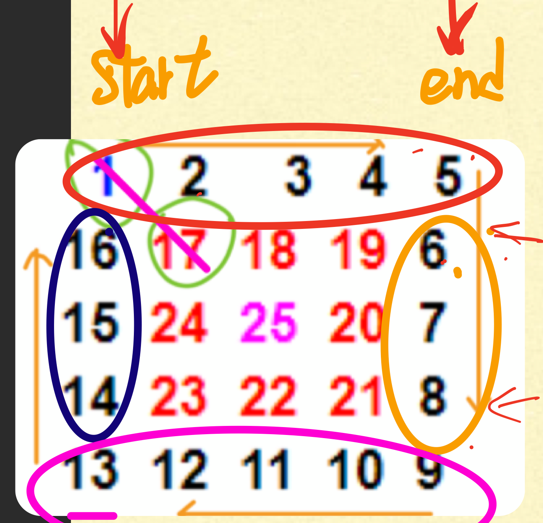
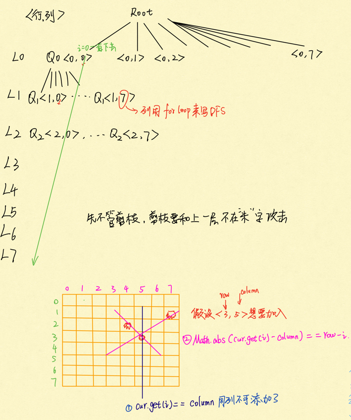

# Recursion II

## [Spiral Order Traverse I](https://app.laicode.io/app/problem/121?plan=3)

>Traverse an N * N 2D array in spiral order clock-wise starting from the top left corner. Return the list of traversal sequence.
>
>**Assumptions**
>
>- The 2D array is not null and has size of N * N where N >= 0
>
>**Examples**
>
>{ {1,  2,  3},
>
> {4,  5,  6},
>
> {7,  8,  9} }
>
>the traversal sequence is [1, 2, 3, 6, 9, 8, 7, 4, 5]




```java
public class Solution {
	public List<Integer> spiralII(int[][] matrix) {
        // Write your solution here
        int start = 0;
        int end = matrix.length - 1;
        List<Integer> result = new ArrayList<>();
        while (start < end) {
            for (int i = start; i <= end; i++) {
                result.add(matrix[start][i]);
            }
            for (int i = start + 1; i <= end - 1; i++) {
                result.add(matrix[i][end]);
            }
            for (int i = end; i >= start; i--) {
                result.add(matrix[end][i]);
            }
            for (int i = end - 1; i >= start + 1; i--) {
                result.add(matrix[i][start]);
            }
            start++;
            end--;
        }
        if (start == end) {
            result.add(matrix[start][end]);
        }
        return result;
    }
}
```


## [Spiral Order Traverse II](https://app.laicode.io/app/problem/122?plan=3)

>Traverse an M * N 2D array in spiral order clock-wise starting from the top left corner. Return the list of traversal sequence.


```java
public class SpiralOrderTraverseII {
    public List<Integer> spiral(int[][] matrix) {
        //assumption: matrix is not null, has size of mn,and m,n>0
        List<Integer> list = new ArrayList<Integer>();
        int m = matrix.length; //矩阵行数
        //if m == 0, matrix[0].length will throw ArrayIndexOutOfBound
        if (m == 0) {
            return list;
        }
        int n = matrix[0].length; //矩阵列数
        int left = 0;
        int right = n - 1;
        int up = 0;
        int down = m - 1;
        //base case
        // 1. there is nothing left
        //2. there is one row left
        //3. there is one column left
        while (left < right && up < down) {
            for (int i = left; i <= right; i++) {
                list.add(matrix[up][i]);//上边
            }
            for (int i = up + 1; i <= down - 1; i++) {
                list.add(matrix[i][right]);//右边
            }
            for (int i = right; i >= left; i--) {//下边
                list.add(matrix[down][i]);
            }
            for (int i = down - 1; i >= up + 1; i--) {
                list.add(matrix[i][left]);
            }
            left++;
            right--;
            up++;
            down--;
        }
        //1. if there is nothing left
        if (left > right || up > down) {
            return list;
        }
        //2. if there is one column left
        if (left == right) {
            for (int i = up; i <= down; i++) {
                list.add(matrix[i][left]);
            }
        } else {
            //3. if there is one row left
            for (int i = left; i <= right; i++) {
                list.add(matrix[up][i]);
            }
        }
        return list;
    }
}

```


## [N Queens](https://app.laicode.io/app/problem/233?plan=3)

>Get all valid ways of putting N Queens on an N * N chessboard so that no two Queens threaten each other.
>
>**Assumptions**
>
>- N > 0
>
>**Return**
>
>- A list of ways of putting the N Queens
>- Each way is represented by a list of the Queen's y index for x indices of 0 to (N - 1)
>
>**Example**
>
>N = 4, there are two ways of putting 4 queens:
>
>[1, 3, 0, 2] --> the Queen on the first row is at y index 1, the Queen on the second row is at y index 3, the Queen on the third row is at y index 0 and the Queen on the fourth row is at y index 2.
>
>[2, 0, 3, 1] --> the Queen on the first row is at y index 2, the Queen on the second row is at y index 0, the Queen on the third row is at y index 3 and the Queen on the fourth row is at y index 1.
>
>N皇后问题，输出的List<Integer> **index表示皇后放的行数，值表示列数**。


用Recursion DFS来做，分出八层，每层叉出8个叉。每一层决定Qi应该放到哪一行，叉出来的叉表示放到那一列。

所以要用for循环叉出来的叉数调用DFS

**Base case:** The last row is done

**RR:** iff position(i, j) valid, go to the next row 

**Time** = O(8^8 * 8) 优化为O(n!) 第一层n个node, 第二层n - 1个node, 一直到最后所以是n! 



```java
public class NQueens {
    public List<List<Integer>> nqeens(int n) {
        List<List<Integer>> result = new ArrayList<>(); //所有结果汇总
        List<Integer> cur = new ArrayList<>(); //每一次的结果
        helper(n, cur, result);
        return result;
    }
    private void helper(int n, List<Integer> cur, List<List<Integer>> result) {
        if (cur.size() == n) { //base case 
            result.add(new ArrayList<>(cur));
            return;
        }
        for (int i = 0; i < n; i++) { //i 按照recursion tree里是列的位置，先是i = 0, 第0列一直递归下去
            if (valid(cur, i)) { //只有valid的时候才进入recursion tree分支
                cur.add(i);
                helper(n, cur, result); //cur 会自己增加
                cur.remove(cur.size() - 1);
            }
        }
    }
    private boolean valid(List<Integer> cur, int column) {
        int row = cur.size(); //得到当前行
        for (int i = 0; i <  row; i++) { //需要遍历走过的所有行数
            if (cur.get(i) == column || Math.abs(cur.get(i) - column) == row - i) { //cur.get(i) == column 某一行上的值和column同一列不行， 
                return false;
            }
        }
        return true;
    }
}
```


## [Reverse Linked List In Pairs](https://app.laicode.io/app/problem/35?plan=3)


## [String Abbreviation Matching](https://app.laicode.io/app/problem/292?plan=3)


## [Store Number Of Nodes In Left Subtree](https://app.laicode.io/app/problem/646?plan=3)


## [Lowest Common Ancestor I](https://app.laicode.io/app/problem/126?plan=3)


## 


## [Reverse Binary Tree Upside Down](https://app.laicode.io/app/problem/178?plan=3)