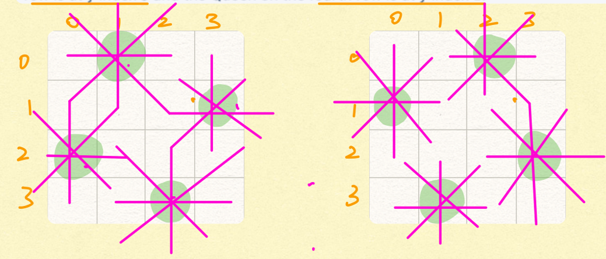

# Recursion II

## [Spiral Order Traverse I](https://app.laicode.io/app/problem/121?plan=3)

>Get all valid ways of putting N Queens on an N * N chessboard so that no two Queens threaten each other.
>
>**Assumptions**
>
>- N > 0
>
>**Return**
>
>- A list of ways of putting the N Queens
>- Each way is represented by a list of the Queen's y index for x indices of 0 to (N - 1)
>
>**Example**
>
>N = 4, there are two ways of putting 4 queens:
>
>[1, 3, 0, 2] --> the Queen on the first row is at y index 1, the Queen on the second row is at y index 3, the Queen on the third row is at y index 0 and the Queen on the fourth row is at y index 2.
>
>[2, 0, 3, 1] --> the Queen on the first row is at y index 2, the Queen on the second row is at y index 0, the Queen on the third row is at y index 3 and the Queen on the fourth row is at y index 1.
>
>N皇后问题，输出的List<Integer> **index表示皇后放的行数，值表示列数**。

用Recursion DFS来做，分出八层，每层叉出8个叉。每一层决定Qi应该放到哪一行，叉出来的叉表示放到那一列。

所以要用for循环叉出来的叉数调用DFS

**Base case:** The last row is done

**RR:** iff position(i, j) valid, go to the next row 

**Time** = O(8^8 * 8) 优化为O(n!) 第一层n个node, 第二层n - 1个node, 一直到最后所以是n! 

## [N Queens](https://app.laicode.io/app/problem/233?plan=3)

## [Reverse Linked List In Pairs](https://app.laicode.io/app/problem/35?plan=3)

## [String Abbreviation Matching](https://app.laicode.io/app/problem/292?plan=3)

## [Store Number Of Nodes In Left Subtree](https://app.laicode.io/app/problem/646?plan=3)

## [Lowest Common Ancestor I](https://app.laicode.io/app/problem/126?plan=3)

## [Spiral Order Traverse II](https://app.laicode.io/app/problem/122?plan=3)

## [Reverse Binary Tree Upside Down](https://app.laicode.io/app/problem/178?plan=3)