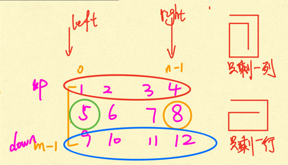

# Recursion II

## [Spiral Order Traverse I](https://app.laicode.io/app/problem/121?plan=3)

>Traverse an N * N 2D array in spiral order clock-wise starting from the top left corner. Return the list of traversal sequence.
>
>**Assumptions**
>
>- The 2D array is not null and has size of N * N where N >= 0
>
>**Examples**
>
>{ {1,  2,  3},
>
> {4,  5,  6},
>
> {7,  8,  9} }
>
>the traversal sequence is [1, 2, 3, 6, 9, 8, 7, 4, 5]


```java
public class Solution {
	public List<Integer> spiralII(int[][] matrix) {
        // Write your solution here
        int start = 0;
        int end = matrix.length - 1;
        List<Integer> result = new ArrayList<>();
        while (start < end) {
            for (int i = start; i <= end; i++) {
                result.add(matrix[start][i]);
            }
            for (int i = start + 1; i <= end - 1; i++) {
                result.add(matrix[i][end]);
            }
            for (int i = end; i >= start; i--) {
                result.add(matrix[end][i]);
            }
            for (int i = end - 1; i >= start + 1; i--) {
                result.add(matrix[i][start]);
            }
            start++;
            end--;
        }
        if (start == end) {
            result.add(matrix[start][end]);
        }
        return result;
    }
}
```


## [Spiral Order Traverse II](https://app.laicode.io/app/problem/122?plan=3)

>Traverse an M * N 2D array in spiral order clock-wise starting from the top left corner. Return the list of traversal sequence.



对于非方阵，需要用到left, right, up, down四个指针。

```java
public class SpiralOrderTraverseII {
    public List<Integer> spiral(int[][] matrix) {
        //assumption: matrix is not null, has size of mn,and m,n>0
        List<Integer> list = new ArrayList<Integer>();
        int m = matrix.length; //矩阵行数
        //if m == 0, matrix[0].length will throw ArrayIndexOutOfBound
        if (m == 0) {
            return list;
        }
        int n = matrix[0].length; //矩阵列数
        int left = 0;
        int right = n - 1;
        int up = 0;
        int down = m - 1;
        //base case
        // 1. there is nothing left
        //2. there is one row left
        //3. there is one column left
        while (left < right && up < down) {
            for (int i = left; i <= right; i++) {
                list.add(matrix[up][i]);//上边
            }
            for (int i = up + 1; i <= down - 1; i++) {
                list.add(matrix[i][right]);//右边
            }
            for (int i = right; i >= left; i--) {//下边
                list.add(matrix[down][i]);
            }
            for (int i = down - 1; i >= up + 1; i--) {
                list.add(matrix[i][left]);
            }
            left++;
            right--;
            up++;
            down--;
        }
        //1. if there is nothing left
        if (left > right || up > down) {
            return list;
        }
        //2. if there is one column left
        if (left == right) {
            for (int i = up; i <= down; i++) {
                list.add(matrix[i][left]);
            }
        } else {
            //3. if there is one row left
            for (int i = left; i <= right; i++) {
                list.add(matrix[up][i]);
            }
        }
        return list;
    }
}

```


## [N Queens](https://app.laicode.io/app/problem/233?plan=3)

>Get all valid ways of putting N Queens on an N * N chessboard so that no two Queens threaten each other.
>
>**Assumptions**
>
>- N > 0
>
>**Return**
>
>- A list of ways of putting the N Queens
>- Each way is represented by a list of the Queen's y index for x indices of 0 to (N - 1)
>
>**Example**
>
>N = 4, there are two ways of putting 4 queens:
>
>[1, 3, 0, 2] --> the Queen on the first row is at y index 1, the Queen on the second row is at y index 3, the Queen on the third row is at y index 0 and the Queen on the fourth row is at y index 2.
>
>[2, 0, 3, 1] --> the Queen on the first row is at y index 2, the Queen on the second row is at y index 0, the Queen on the third row is at y index 3 and the Queen on the fourth row is at y index 1.
>
>N皇后问题，输出的List<Integer> **index表示皇后放的行数，值表示列数**。


用Recursion DFS来做，分出八层，每层叉出8个叉。每一层决定Qi应该放到哪一行，叉出来的叉表示放到那一列。

所以要用for循环叉出来的叉数调用DFS

**Base case:** The last row is done

**RR:** iff position(i, j) valid, go to the next row 

**Time** = O(8^8 * 8) 优化为O(n!) 第一层n个node, 第二层n - 1个node, 一直到最后所以是n! 


```java
public class NQueens {
    public List<List<Integer>> nqeens(int n) {
        List<List<Integer>> result = new ArrayList<>(); //所有结果汇总
        List<Integer> cur = new ArrayList<>(); //每一次的结果
        helper(n, cur, result);
        return result;
    }
    private void helper(int n, List<Integer> cur, List<List<Integer>> result) {
        if (cur.size() == n) { //base case 
            result.add(new ArrayList<>(cur));
            return;
        }
        for (int i = 0; i < n; i++) { //i 按照recursion tree里是列的位置，先是i = 0, 第0列一直递归下去
            if (valid(cur, i)) { //只有valid的时候才进入recursion tree分支
                cur.add(i);
                helper(n, cur, result); //cur 会自己增加
                cur.remove(cur.size() - 1);
            }
        }
    }
    private boolean valid(List<Integer> cur, int column) {
        int row = cur.size(); //得到当前行
        for (int i = 0; i <  row; i++) { //需要遍历走过的所有行数
            if (cur.get(i) == column || Math.abs(cur.get(i) - column) == row - i) { //cur.get(i) == column 某一行上的值和column同一列不行， 
                return false;
            }
        }
        return true;
    }
}
```


## [Reverse Linked List In Pairs](https://app.laicode.io/app/problem/35?plan=3)

>Reverse pairs of elements in a singly-linked list.
>
>**Examples**
>
>- L = null, after reverse is null
>- L = 1 -> null, after reverse is 1 -> null
>- L = 1 -> 2 -> null, after reverse is 2 -> 1 -> null
>- L = 1 -> 2 -> 3 -> null, after reverse is 2 -> 1 -> 3 -> null

子问题： 后面998个node

```java
public class Solution {
	public ListNode reverseInPairs(ListNode head) {
        if (head == null || head.next == null) {
            return head;
        }
        ListNode newHead = head.next;
        head.next = reverseInPairs(head.next.next);
        newHead.next = head;
        return newHead;
    }
}
```


## [Reverse Binary Tree Upside Down](https://app.laicode.io/app/problem/178?plan=3)

>Given a binary tree where all the right nodes are leaf nodes, flip it upside down and turn it into a tree with left leaf nodes as the root.


递归问题， **假设subproblem已经完成**，然后**再写代码完成最后一步**。

subproblem就是下图中虚线框假设已经完成的部分,先写，然后再写代码完成`当前层`要干的事。当前层就是不管递归这一句代码咋样，我先完成最简单的这一部分代码。然后我知道递归已经帮我完成了subproblem. 

base case: 递归到底后执行的语句， if (root == null || root.left == null) {return root};跑完base case之后，然后往上反弹，调用的是RR**下面**的代码，所以下面的代码是当前层我们要完成的小问题。

RR: reverse(root.left)


```java
public class Solution {
	public TreeNode reverse(TreeNode root) {
        if (root == null || root.left == null) {
            return root;
        }
        TreeNode newRoot = reverse(root.left);
        root.left.left = root;
        root.left.right = root.right;
        root.left = null;
        root.right = null;
        return newRoot;
    }
}
```


## [String Abbreviation Matching](https://app.laicode.io/app/problem/292?plan=3)

>Word “book” can be abbreviated to 4, b3, b2k, etc. Given a string and an abbreviation, return if the string matches the abbreviation.
>
>**Assumptions:**
>
>- The original string only contains alphabetic characters.
>- Both input and pattern are not null.
>- Pattern would not contain invalid information like "a0a","0".
>
>**Examples:**
>
>- pattern **“s11d”** matches input “s**ophisticate**d” since “11” matches eleven chars “ophisticate”.

**base case:**

1. 匹配的情况 if (si == s.length() && ti == t.length()) {return true;}

2.  不匹配的情况，存在剩余时候 if (si >= s.length() || ti >= t.length()) {  return false;}

**RR:** 

1. pattern[ti]是字母，两个指针分别取遍历。 if(s.charAt(si) == t.charAt(ti)) {return match(s, t, si + 1, ti + 1)}

2. pattern[ti]是数字，si加上t中数字的长度。return match(s, t, si + count, ti);

**将string转换为数字方法**

eg. 123

count = 0 + 1;

count = 1* 10 + 2 = 12 

count = 12*10 + 3 = 123 


```java
public class StringAbbreviationMatching {
    public boolean match(String input, String pattern) {
        //assume: input, pattern are not null
        return match(input, pattern, 0, 0);
    }

    private boolean match(String s, String t, int si, int ti) {
        //only when we run out of s and t at the same time, there is a match
        if (si == s.length() && ti == t.length()) { // base case 1 匹配的情况
            return true;
        }
        //is we run out of one of s and t but there is still some
        //characters left for the other one, we cannot find the match
        if (si >= s.length() || ti >= t.length()) { // base case 2 不匹配的情况
            return false;
        }
        //case1. if the current character in t is not a digit
        if (t.charAt(ti) < '0' || t.charAt(ti) > '9') {
            if (s.charAt(si) == t.charAt(ti)) {
                return match(s, t, si + 1, ti + 1);
            } else {
                return false;
            }
        }
        //case2. if the current character in t is a digit
        //we need to find in total what is the number
        int count = 0;
        while (ti < t.length() && t.charAt(ti) >= '0' && t.charAt(ti) <= '9') {
            count = count * 10 + (t.charAt(ti) - '0');
            ti++;
        }
        return match(s, t, si + count, ti);
    }
}
```


## [Store Number Of Nodes In Left Subtree](https://app.laicode.io/app/problem/646?plan=3)

>Given a binary tree, count the number of nodes in each node’s left subtree, and store it in the numNodesLeft field.
>
>**Examples**
>
>​         1(6)
>
>​        /     \
>
>​      2(3)    3(0)
>
>​     /   \
>
>   ​	4(1)   5(0)
>
>  ​	/    \    	\
>
>6(0)   7(0) 	 8(0)
>
>The numNodesLeft is shown in parentheses.


```java
public class NumNodesLeft {
    static class TreeNodeLeft {
        int key;
        TreeNodeLeft left;
        TreeNodeRight right;
        int numNodesLeft; //相当于给TreeNode记录一个属性
        
        public TreeNodeLeft(int key) {
            this.key = key;
        }
    }
    
    public void numNodesLeft(TreeNodeLeft root) {
        numNodes(root);
    }
    
    private int numNodes(TreeNodeLeft root) {
        if (root == null) {
            return 0; //base case 
        }
        int leftNum = numNodes(root.left); // 先完成subproblem 1
        int rightNum = numNodes(root.right); // subproblem 2 左右孩子
        root.numNodesLeft = leftNum; //当前层要干的事，记录属性
        return leftNum + rightNum + 1; // 返回给parent
    }
}
```


## [Lowest Common Ancestor I](https://app.laicode.io/app/problem/126?plan=3)

>Given two nodes in a binary tree, find their lowest common ancestor.
>
>**Assumptions**
>
>- There is ==no parent pointer==  for the nodes in the binary tree
>- The given two nodes are guaranteed to be in the binary tree
>
>**Examples**
>
>​    5
>
>​    /  \
>
>   **9**   12
>
>  /  \    \
>
> **2**   3    14
>
>The lowest common ancestor of 2 and 14 is 5
>
>The lowest common ancestor of 2 and 9 is 9

Time = O(n) space = O(height)

- **case1:** 直上直下隶属

**Base case:** if current == a || current == b --> return current

​					if current == null, return current

**RR:** case1.1 if left returns null && right returns null, return null to my parent

​      case1.2 if either left or right  return non-null, return the non-null side to my parent 


- **case2:** a and b不隶属

**Base case:** if current == a || current == b --> return current

​					If current == null, return current

**RR:** case 2.1 左右都为空，返回空给parent

​	  case 2.2: 返回左右中非空的给parent

​      case 2.3: 左右都非空， 返回自己

```java
public class Solution {
	public TreeNode lowestCommonAncestor(TreeNode root, TreeNode one, TreeNode two) {
        if (root == null) {
            return null; //到底了也没找到
        }
        if (root == one || root == two) {
            return root; //直接隶属， 只要root等于其中的一个
        }
        TreeNode ll = lowestCommonAncestor(root.left, one, two);
        TreeNode lr = lowestCommonAncestor(root.right, one, two); //左右孩子获取
        if (ll ! = null && lr != null) {
            return root; //当前层
        }
        return ll == null ? lr : ll; //返回给parent
    }
}
```

## [Maximum Path Sum Binary Tree II](https://app.laicode.io/app/problem/139?plan=3)

>Given a binary tree in which each node contains an integer number. Find the maximum possible sum **from `any node` to `any node` (the start node and the end node can be the same).** 
>
>**Assumptions**
>
>- The root of the given binary tree is not null
>
>**Examples**
>
> ​		 -1
>
> ​		/   \
>
>​	2    11
>
>   /   \
>
>  6   -14
>
>one example of paths could be -14 -> 11 -> -1 -> 2
>
>another example could be the node 11 itself
>
>The maximum path sum in the above binary tree is 6 + 11 + (-1) + 2 = 18

找人字形


```java
public class MaximumPathSumBinaryTreeII {
    public int maxPathSum(TreeNode root) {
        //Assumption: root is not null
        //max stores the global maximum path sum and will be
        //updated during the recursion
        int[] max = new int[]{Integer.MIN_VALUE}; //这样就可以使用interger表示里面的int最小了
        helper(root, max);
        return max[0];
    }

    //return the maximum path sum of the "single" path
    private int helper(TreeNode root, int[] max) {
        if (root == null) {
            return 0;
        }
        //step 1 左右孩子
        int left = helper(root.left, max);
        int right = helper(root.right, max);
        //step 2 当前层 同时更新max
        left = left < 0 ? 0 : left;
        right = right < 0 ? 0 : right;
        max[0] = Math.max(root.key + left + right, max[0]);
        //step 3 返回给parent
        return root.key + Math.max(left, right); 
    }
}

```

---------------

# 

