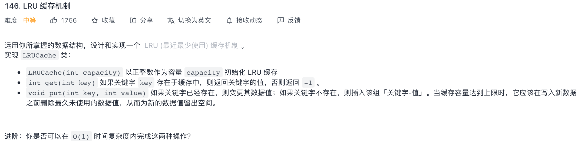
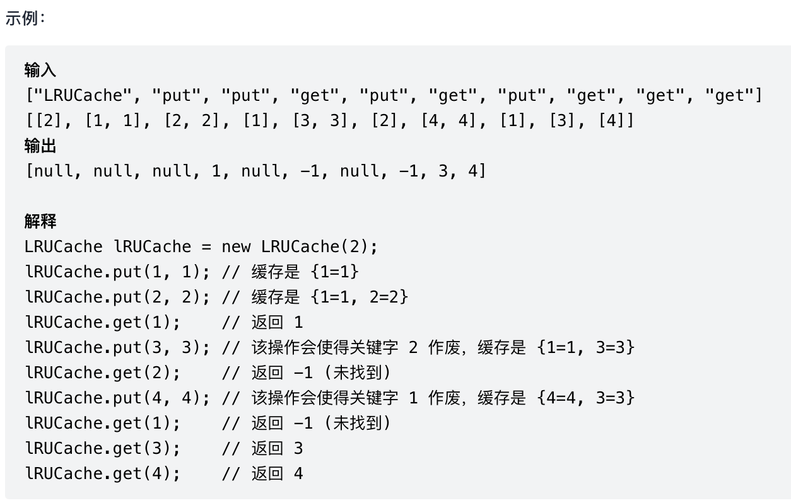

#### [146. LRU 缓存机制](https://leetcode-cn.com/problems/lru-cache/)





Queue = key {2, 1} queue从前到后,2insert放到前面

如果get(1), 相当于用了1, Queue = key {1, 2} 

Put(3, 3) 会把2挤掉, Queue = key {3, 1}

Put(4, 4)  Queue = key {4, 3}

Get(3) Queue = key {3, 4} //将3更新到队列左边入口

如果要实现0(1)时间复杂度必须有hashmap + double LinkedList 头尾都有控制,从前往后加数据,**从尾巴drop数据**, 从头add. 


```java
class LRUCache {
        DoubleLinkedNode head;
        DoubleLinkedNode tail;
        Map<Integer, DoubleLinkedNode> map;
        int size;
        public LRUCache(int capacity) {
            head = new DoubleLinkedNode(0, 0);
            tail = new DoubleLinkedNode(0, 0);
            head.next = tail;
            tail.prev = head;
            map = new HashMap<>();
            size = capacity;
        }

        public int get(int key) {
            if (map.containsKey(key)) {
                DoubleLinkedNode cur = map.get(key);
                delete(cur);
                add(cur);
                return cur.val;
            } else {
                return -1;
            }
        }
        private void delete(DoubleLinkedNode node) {
            DoubleLinkedNode prev = node.prev;
            DoubleLinkedNode next = node.next;
            prev.next = next;
            next.prev = prev;
            map.remove(node.key);
        }

        private void add(DoubleLinkedNode node) {
            DoubleLinkedNode oldFirst = head.next;
            head.next = node;
            node.next = oldFirst;
            oldFirst.prev = node;
            node.prev = head;
            map.put(node.key, node);
            if (map.size() > size) {
                DoubleLinkedNode toBeDelete = tail.prev;
                delete(toBeDelete);
            }
        }

        public void put(int key, int value) {
            if (map.containsKey(key)) {
                DoubleLinkedNode curr = map.get(key);
                delete(curr);
                curr.val = value;
                add(curr);
            } else {
                DoubleLinkedNode newNode = new DoubleLinkedNode(key, value);
                add(newNode);
            }
        }

        private class DoubleLinkedNode {
            DoubleLinkedNode prev;
            DoubleLinkedNode next;
            int key;
            int val;
            public DoubleLinkedNode(int key, int val) {
                this.key = key;
                this.val = val;
            }
        }
    }
```

#### [204. 计数质数](https://leetcode-cn.com/problems/count-primes/)


```java
class Solution {
        public int countPrimes(int n) {
            int count = 0;
            for (int i = 2; i < n; i++) {
                if (isPrim(i)) {
                    count++;
                }
            }
            return count;
        }
        private boolean isPrim(int n) {
            for (int i = 2; i < n; i++) {
                if (n % i == 0) {
                    return false;
                }
            }
            return true;
        }
    }
```

超时o(n2), 

优化: 


```java
class Solution {
    public int countPrimes(int n) {
        boolean[] notPrime = new boolean[n + 1];
        int count = 0;
        for (int i = 2; i < n; i++) {
            if (notPrime[i]) {
                continue;
            }
            count++;
            //找到一个素数时，将能被素数整除的元素去掉
            for (long j = (long) i * i; j < n; j += i) {
                notPrime[(int) j] = true;
            }
        }
        return count;
    }
}
```

#### [72. 编辑距离](https://leetcode-cn.com/problems/edit-distance/)

ipad笔记


```java
class Solution {
    public int minDistance(String word1, String word2) {
        int[][] distance = new int[word1.length() + 1][word2.length() + 1];
        for (int i = 0; i <= word1.length(); i++) {
            for (int j = 0; j <= word2.length(); j++) {
                if (i == 0) {
                    distance[i][j] = j;
                } else if (j == 0) {
                    distance[i][j] = i;
                } else if (word1.charAt(i - 1) == word2.charAt(j - 1)) {
                    distance[i][j] = distance[i - 1][j - 1];
                } else {
                    distance[i][j] = Math.min(distance[i - 1][j] + 1, distance[i][j - 1] + 1);
                    distance[i][j] = Math.min(distance[i - 1][j - 1] + 1, distance[i][j]);
                }
            }
        }
        return distance[word1.length()][word2.length()];
    }
}
```