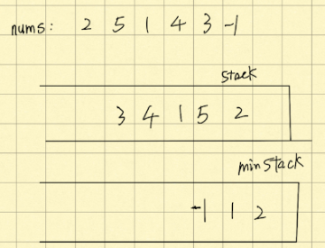
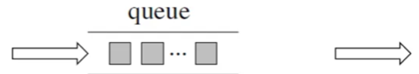
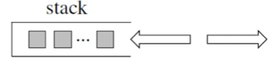
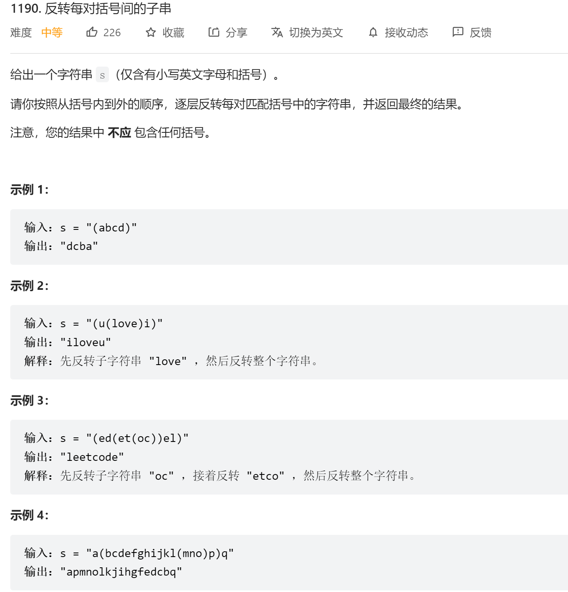
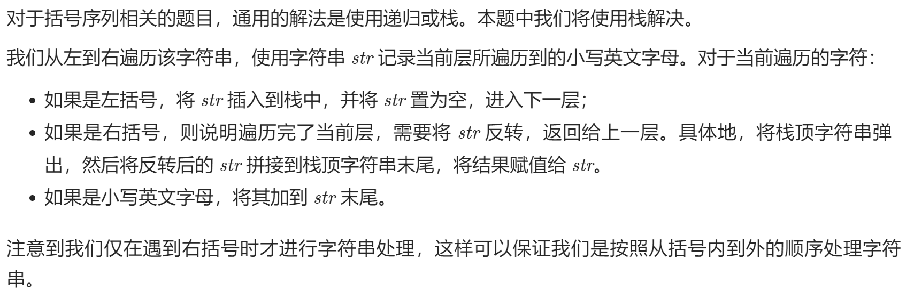
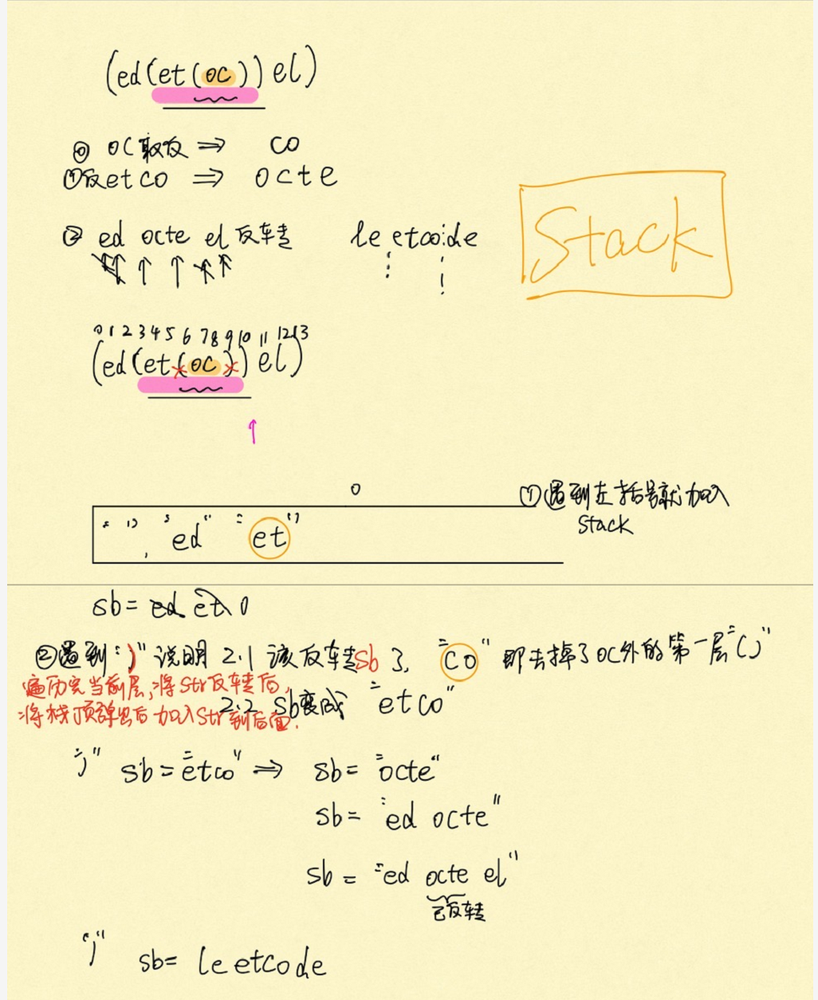

# 4 Queue & Stack
## Sort With 2 Stacks
Given an array that is initially stored in one stack, sort it with one additional stacks (total 2 stacks).

After sorting the original stack should contain the sorted integers and from top to bottom the integers are sorted in ascending order.                                                                                                                                                                                                                                                                                                                                                                                                                                                                                                                                                                                                                                                                                                                                                                                                                                                                                                                                                                                                                                                                                                                                                                                                                                                                                                                                                                                       

Assumptions:

The given stack is not null.
There can be duplicated numbers in the give stack.
Requirements:

No additional memory, time complexity = O(n ^ 2).

- 初始input stack 用来存没有sort好的元素
- buffer用来左半边用来装sort好的,右半边倒回去给input继续找
- 关键: 1.1 先将input里的元素倒到buffer里 然后找到里面的curmin,并且记录一个count

		   1.2 将大于curmin的元素放回到input, 小于的就保存到buffer里
		   2 将buffer 将buffer里的值统统放回input 确保升序

注意我这里实现用得是Deque然后一直用得offerFirst所以是个左开右闭的stack

```java
public class Solution {
	public void sort(LinkedList<Integer> s1) {
		LinkedList<Integer> s2 = new LinkedList<Integer>();
		sort(s1, s2);
	}
	private void sort(Deque<Integer> input, Deque<Integer> buffer) {
		while (!input.isEmpty()) {	//确保所有的input都查看过
			int curMin = Integer.MAX_VALUE;
			int count = 0;
			//step 1.1 把input里的值都遍历一遍放到buffer然后找到curmin
			while (!input.isEmpty()) {
				int cur = input.pollFirst();
				if (cur < curMin) {
					curMin = cur;
					count = 1;
				} else if (cur == curMin) {
					count++;
				}
				buffer.offerFirst(cur);
			}
			//1.2 buffer里不是curMin的放回input
			while (!buffer.isEmpty() && buffer.peekFirst() >= curMin) {
				int tmp = buffer.pollFirst();
				if (tmp != curMin) {
					input.offerFirst(tmp);
				}
			}
			// 1.3 将curmin放到buffer里
			while (count-- > 0) {
				buffer.offerFirst(curMin);
			}
		}
		// step 2 将buffer里的值统统放回input 确保升序
		while (!bufer.isEmpty()) {
			input.offerFirst(buffer.pollFirst());
		}
	}
}
```
## Queue By Two Stacks
Java: Implement a queue by using two stacks. The queue should provide size(), isEmpty(), offer(), poll() and peek() operations. When the queue is empty, poll() and peek() should return null.

Assumptions

The elements in the queue are all Integers.
size() should return the number of elements buffered in the queue.
isEmpty() should return true if there is no element buffered in the queue, false otherwise.

​                  ]  [   

- 一个stack用来push存 一个stack用来poll(当它不为空时) 
- 关键写出move(),只要out为空就一股脑移动到in里面去
- time = 0(1) amotized, space = O(n)
```java
public class Solution {
	private Deque<Integer> in;
	private Deque<Integer> out;
  public Solution() {
    in = new ArrayDeque<>();
    out = new ArrayDeque<>();
  }
  //in 
  //out 
  public Integer poll() {
    move();
    return out.isEmpty() ? null : out.pollFirst();
  }
  
  public void offer(int element) {
    in.offerFirst(element);
  }
  
  public Integer peek() {
    move();
    return out.isEmpty() ? null : out.peekFirst();
  }
  
  public int size() {
    return in.size() + out.size();
  }
  
  public boolean isEmpty() {
    return in.isEmpty() && out.isEmpty();//&& 都为空的时候才是空了
  }

  private void move() {
  	if (out.isEmpty()) {
  		while(!in.isEmpty()) {
  			out.offerFirst(in.pollFirst());
  		}
  	}
  }
}
```

## Stack With min()
Enhance the stack implementation to support min() operation. min() should return the current minimum value in the stack. If the stack is empty, min() should return -1.

push(int element) - push the element to top
pop() - return the top element and remove it, if the stack is empty, return -1
top() - return the top element without remove it, if the stack is empty, return -1
min() - return the current min value in the stack.

- 要实现找stack里面的最小值
- stack1 存放input元素
- stack2(minStack) 存放stack1里最小值so far , min取它peekFirst
- 

```java
public class Solution {
	private Deque<Integer> stack;
	private Deque<Integer> minStack;

	public Solution() {
		stack = new LinkedList<Integer>();
		minStack = new LinkedList<Integer>();
	}
	
	public int min() {
		if (minStack.isEmpty()) {
			return -1;
		}
		return minStack.peekFirst();
	}
	
	public void push(int value) { //对于比较小的元素,minStack里面也要存
		stack.offerFirst(value);
		if (minStack.isEmpty() || value <= minStack.peekFirst()) { //如果值比较小，minStack也要更新
			minStack.offerFirst(value);
		}
	}

	public int pop() {
		if (stack.isEmpty()) {
			return -1;
		}
		Integer result = stack.pollFirst();
		if (minStack.peekFirst().equals(result)) { //如果result和minStack里的元素相同minStack也要更新
			minStack.pollFirst();
		}
		return result;
	}

	public int top() {
		if (stack.isEmpty()) {
			return -1;
		}
		return stack.peekFirst();
	}
}
```

## Stack by 2 Queue(s)
Implement a stack containing integers using queue(s). The stack should provide push(x), pop(), top() and isEmpty() operations.

In java: if the stack is empty, then top() and pop() will return null.

使用两个Queue，q1用来一直遍历原始数据，因为要实现stack, 那么pop出来的元素就是最后加入的元素，所以q2临时帮忙存一下非最后元素的所有元素，然后再把q1, q2对调回来。


```java
class Solution {
    private Queue<Integer> q1;
    private Queue<Integer> q2;
    /** Initialize your data structure here. */
    public Solution() {
       q1 = new ArrayDeque<>();
       q2 = new ArrayDeque<>();
    }

    /** Push element x onto stack. */
    public void push(int x) {
        q1.offer(x);
    }

    /** Removes the element on top of the stack and returns that element. */
    public Integer pop() {
        Integer prev = q1.poll();
        Integer cur = q1.poll();
        while (cur != null) { //通过cur来判断是否已经将q1清空,记录下q1最后一个元素就是要pop出来的
          q2.offer(prev);
          prev = cur; 
          cur = q1.poll();
        }
        Queue<Integer> tmp = q1; //这个时候的q1其实已经为空，我们要倒一下，让q2变成空，q1变成q2 
        q1 = q2;
        q2 = tmp;
        return prev;
    }

    /** Get the top element. */
    public Integer top() {
        Integer ret = pop();
        if (ret != null) {
          q1.offer(ret);
        }
        return ret;
    }

    /** Returns whether the stack is empty. */
    public boolean isEmpty() {
       return top() == null;//       return q1.isEmpty();
    }
}
```

## Deque By Three Stacks
Java: Implement a deque by using three stacks. The queue should provide size(), isEmpty(), offerFirst(), offerLast(), pollFirst(), pollLast(), peekFirst() and peekLast() operations. When the queue is empty, pollFirst(), pollLast(), peekFirst() and peek() should return null.

input                ][1 2 3 4 5 6 7 

output   1 2 3 ][ 4 5 6 7 

buffer[ 7 6 5 4 

使用三个stack, 刚开始所有的元素都在right stack里， 

step1: 将right stack里的一半元素放入到buffer，

step2: 将right stack剩下的元素放入left stack

step3: 将buffer里的元素放回right stack这个时候相对顺序还是没有变

我们可以发现，right stack里的元素被平均分配到左右stack里面了，这样从左右取元素就会非常方便。

```java
public class Solution { 
	private Deque<Integer> left;
	private Deque<Integer> right;
	private Deque<Integer> buffer;
	
	public Solution() {
		left = new ArrayDeque<>();
		right = new ArrayDeque<>();
		buffer = new ArrayDeque<>();
	}

    //offferFirst加入到左边
	public void offerFirst(int element) {
		left.offerFirst(element);
	}
    //offerLast直接加入右边
	public void offerLast(int element) {
		right.offerFirst(element);
	}
    //取出元素从左边，先运行move
	public Integer pollFirst() {
		move(right, left); //right元素移动到left,然后从leftl
		return left.isEmpty() ? null : left.pollFirst();
	}
    
	public Integer pollLast() {
		move(left, right); //注意这里（left, right） !!! 把left的元素移动到right来
		return right.isEmpty() ? null : right.pollFirst();
	}

	public Integer peekFirst() {
		move(right, left);
		return left.isEmpty() ? null : left.peekFirst();
	}

    public Integer peekLast() {
		move(left, right);
		return right.isEmpty() ? null : right.peekFirst();
	}

	public int size() {
		return left.size() + right.size();
	}
	
	public boolean isEmpty() {
		return left.isEmpty() && right.isEmpty();
	}
  	
	private void move(Deque<Integer> src, Deque<Integer> dest) {
		if (!dest.isEmpty()) { //不为空的时候就不要再move了
			return;
		}
		int halfSize = src.size() / 2; 
        //step 1 放一半到buffer
		for (int i = 0; i < halfSize; i++) {
			buffer.offerFirst(src.pollFirst());
		}
        //step 2: 将src剩下的放入到right stack 
		while (!src.isEmpty()) {
			dest.offerFirst(src.pollFirst());
		}
        //step3: 将buffer所有的元素放入到right stack 
		while (!buffer.isEmpty()) {
			src.offerFirst(buffer.pollFirst());
		}
	}
}
```

# 理论

队列是先进先出



栈是先进后出



### **Queue** 

`offer()`

`poll()`

`peek()`

`isEmpty()`

`size()`

### **Deque**

`offerFirst(),offerLast()`

`pollFirst(),pollLast()`

`peekFirst(),peekLast()`

`isEmpty()`

`size()`

==implementation==: LinkedList, ArrayDeque

Queue<Integer> queue = new LinkedList<>();

### **stack**

`pop()`

`peek()`

`push()`

`empty()`


### PriorityQueue

`offer()`

`poll()`

`peek()`

`isEmpty()`

`size()`

PriorityQueue<Integer> minHeap = new PriorityQueue<Integer>();

```java
PriorityQueue<Map.Entry<String, Integer>> minHeap = new PriorityQueue<>(k, new Comparator<Map.Entry<String, Integer>>() {
           @Override
           public int compare(Map.Entry<String, Integer> e1, Map.Entry<String, Integer> e2) {
               return e1.getValue().compareTo(e2.getValue());
           }
        });
```

#### [20. 有效的括号](https://leetcode-cn.com/problems/valid-parentheses/)

>给定一个只包括 '('，')'，'{'，'}'，'['，']' 的字符串 s ，判断字符串是否有效。
>
>有效字符串需满足：
>
>左括号必须用相同类型的右括号闭合。
>左括号必须以正确的顺序闭合。
>
>```
>示例 1：
>输入：s = "()"
>输出：true
>示例 2：
>输入：s = "()[]{}"
>输出：true
>示例 3：
>输入：s = "(]"
>输出：false
>```

使用stack, stack里面通过判断string中为左括号的时候offerFirst右括号到stack里面。如果是string中字符为右括号,匹配的话就

这里有三种不匹配的情况:

1. 第一种情况，字符串里左方向的括号多余了 ，所以不匹配。 [](https://camo.githubusercontent.com/110e1ae83f0f024569d70151895a7447abbc73b50fcdcffef8b55b08cd8035b4/68747470733a2f2f696d672d626c6f672e6373646e696d672e636e2f323032303038303931353530353338372e706e67)

2. 第二种情况，括号没有多余，但是 括号的类型没有匹配上。：遍历字符串匹配的过程中，发现栈里没有要匹配的字符。所以return false [](https://camo.githubusercontent.com/6a581a245fafe245a2057650b26e8015eabe3b6a73a662e74a21bc16f96f4938/68747470733a2f2f696d672d626c6f672e6373646e696d672e636e2f32303230303830393135353130373339372e706e67)

3. 第三种情况，字符串里右方向的括号多余了，所以不匹配。栈不为空 [](https://camo.githubusercontent.com/d7561bb518bf1c6668e5ff6685b9671ce726a2c618862272b4d8e6a6523a43c6/68747470733a2f2f696d672d626c6f672e6373646e696d672e636e2f32303230303830393135353131353737392e706e67)

那么什么时候说明左括号和右括号全都匹配了呢，就是字符串遍历完之后，栈是空的，就说明全都匹配了。


```java
class Solution {
    public boolean isValid(String s) {
        Deque<Character> stack = new ArrayDeque<>();
        for (int i = 0; i < s.length(); i++) {
            //碰到左括号，就把相应的右括号入栈
            if (s.charAt(i) == '(') {
                stack.offerFirst(')')
            } else if (s.charAt(i) == '[') {
                stack.offerFirst(']');
            } else if (s.charAt(i) == '{') {
                stack.offerFirst('}');
            } else if (stack.isEmpty() || s.charAt(i) != stack.peekFirst()) {
                return false;
            } else {//如果是右括号判断是否和栈顶元素匹配
                stack.pollFirst();
            }
        }
        //最后判断栈中元素是否匹配
        return stack.isEmpty();
    }
}
```

#### [1047. 删除字符串中的所有相邻重复项](https://leetcode-cn.com/problems/remove-all-adjacent-duplicates-in-string/)

>给出由小写字母组成的字符串 S，重复项删除操作会选择两个相邻且相同的字母，并删除它们。
>
>在 S 上反复执行重复项删除操作，直到无法继续删除。
>
>在完成所有重复项删除操作后返回最终的字符串。答案保证唯一。
>
>```
>示例：
>输入："abbaca"
>输出："ca"
>解释：
>例如，在 "abbaca" 中，我们可以删除 "bb" 由于两字母相邻且相同，这是此时唯一可以执行删除操作的重复项。之后我们得到字符串 "aaca"，其中又只有 "aa" 可以执行重复项删除操作，所以最后的字符串为 "ca"。
>```

```java
class Solution {
    public String removeDuplicates(String s) {
        Deque<Character> stack = new ArrayDeque<>();
        for (int i = 0; i < s.length(); i++) {
            if (stack.isEmpty() || stack.peekFirst() != s.charAt(i)) {
                stack.offerFirst(s.charAt(i));
            } else {
                stack.pollFirst();
            }
        }
        String str = "";
        while (!stack.isEmpty()) {
            str = stack.pollFirst() + str;
        }
        return str;
    }
}
```

方法二 stringbuilder作为stack

```java
class Solution {
    public String removeDuplicates(String s) {
        StringBuilder res = new StringBuilder();
        int top = -1;
        for (int i = 0; i < s.length(); i++) {
            if (top < 0 || res.charAt(top) != s.charAt(i)) {
                res.append(s.charAt(i));
                top++;
            } else {
                res.deleteCharAt(top);
                top--;
            }
        }
        return res.toString();
    }
}
```

双指针

```java
class Solution {
    public String removeDuplicates(String s) {
        char[] ch = s.toCharArray();
        int fast = 0;
        int slow = 0;
        while(fast < s.length()){
            // 直接用fast指针覆盖slow指针的值
            ch[cccslow] = ch[fast];
            // 遇到前后相同值的，就跳过，即slow指针后退一步，下次循环就可以直接被覆盖掉了
            if(slow > 0 && ch[slow] == ch[slow - 1]){
                slow--;
            }else{
                slow++;
            }
            fast++;
        }
        return new String(ch,0,slow);
    }
}
```

#### [150. 逆波兰表达式求值](https://leetcode-cn.com/problems/evaluate-reverse-polish-notation/)

>根据[ 逆波兰表示法](https://baike.baidu.com/item/逆波兰式/128437)，求表达式的值。
>
>有效的算符包括 `+`、`-`、`*`、`/` 。每个运算对象可以是整数，也可以是另一个逆波兰表达式。
>
>```
>示例 1：
>
>输入：tokens = ["2","1","+","3","*"]
>输出：9
>解释：该算式转化为常见的中缀算术表达式为：((2 + 1) * 3) = 9
>示例 2：
>
>输入：tokens = ["4","13","5","/","+"]
>输出：6
>解释：该算式转化为常见的中缀算术表达式为：(4 + (13 / 5)) = 6
>示例 3：
>
>输入：tokens = ["10","6","9","3","+","-11","*","/","*","17","+","5","+"]
>输出：22
>解释：
>该算式转化为常见的中缀算术表达式为：
>  ((10 * (6 / ((9 + 3) * -11))) + 17) + 5
>= ((10 * (6 / (12 * -11))) + 17) + 5
>= ((10 * (6 / -132)) + 17) + 5
>= ((10 * 0) + 17) + 5
>= (0 + 17) + 5
>= 17 + 5
>= 22
>```

平常使用的算式则是一种中缀表达式，如 ( 1 + 2 ) * ( 3 + 4 ) 。

该算式的逆波兰表达式写法为 ( ( 1 2 + ) ( 3 4 + ) * ) 。

波兰表达式主要有以下两个优点：

- 去掉括号后表达式无歧义，上式即便写成 1 2 + 3 4 + * 也可以依据次序计算出正确结果。

- 适合用栈操作运算：==遇到数字则入栈==；==遇到算符则取出栈顶两个数字进行计算==，并将结果压入栈中。

  Integer.valueOf(tokens[i])可以==将string转换为integer===， **string之间**的比较一定要==用.equals()!!!!!!==

```java
class Solution {
        public int evalRPN(String[] tokens) {
            Deque<Integer> stack = new ArrayDeque<>();
            for (int i = 0; i < tokens.length; i++) {
                if (tokens[i].equals("+") || tokens[i].equals("-") || tokens[i].equals("*") || tokens[i].equals("/")) {
                    int nums1 = stack.poll();
                    int nums2 = stack.poll();
                    if (tokens[i].equals("+")) stack.offerFirst(nums1 + nums2);
                    if (tokens[i].equals("-")) stack.offerFirst(nums2 - nums1);
                    if (tokens[i].equals("*")) stack.offerFirst(nums1 * nums2);
                    if (tokens[i].equals("/")) stack.offerFirst(nums2 / nums1);
                } else {
                    stack.offerFirst(Integer.valueOf(tokens[i]));
                }
            }
            return stack.pollFirst();
        }
    }
```

#### [239. 滑动窗口最大值](https://leetcode-cn.com/problems/sliding-window-maximum/),维护单调queue

>给你一个整数数组 nums，有一个大小为 k 的滑动窗口从数组的最左侧移动到数组的最右侧。你只可以看到在滑动窗口内的 k 个数字。滑动窗口每次只向右移动一位。
>
>返回滑动窗口中的最大值。
>
>```
>输入：nums = [1,3,-1,-3,5,3,6,7], k = 3
>输出：[3,3,5,5,6,7]
>解释：
>滑动窗口的位置                最大值
>---------------               -----
>[1  3  -1] -3  5  3  6  7       3
> 1 [3  -1  -3] 5  3  6  7       3
> 1  3 [-1  -3  5] 3  6  7       5
> 1  3  -1 [-3  5  3] 6  7       5
> 1  3  -1  -3 [5  3  6] 7       6
> 1  3  -1  -3  5 [3  6  7]      7
>```

**队列没有必要维护窗口里的所有元素，只需要维护有可能成为窗口里最大值的元素就可以了，同时保证队里里的元素数值是由大到小的。**

那么这个维护元素单调递减的队列就叫做**单调队列，即单调递减或单调递增的队列**

```java
//解法一
//自定义数组 myQueue保留着k范围内的最大值，它是一个降序的queue,
// 里面可以是k个元素的降序（当加入的val比较小的时候需要放到里面保持降序），也可以是k个元素里的最大值（新加入的val比之前的元素都大时候）
class MyQueue {
    private Deque<Integer> deque = new ArrayDeque<>();
    //弹出元素时，比较当前要弹出的数值是否等于队列出口的数值，如果相等则弹出
    //同时判断队列当前是否为空
    public void poll(int val) {
        if (!deque.isEmpty() && val == deque.peekFirst()) { //val == deque.peekFirst()这个时候说明移动了窗口需要去除掉myQueue里的最大值
            deque.pollFirst();
        }
    }
    //添加元素时，如果要添加的元素大于入口处的元素，就将入口元素弹出
    //保证队列元素单调递减
    public void add(int val) {
        while (!deque.isEmpty() && val > deque.peekLast()) {
            deque.pollLast();
        }
        deque.offerLast(val);
    }
    //队列队顶元素始终为最大值
    public int peek() {
        return deque.peekFirst();
    }
}


class Solution {
    public int[] maxSlidingWindow(int[] nums, int k) {
        if (nums.length == 1) {
            return nums;
        }
        int len = nums.length - k + 1;
        //存放结果元素的数组
        int[] res = new int[len];
        int num = 0;
        //自定义队列
        MyQueue myQueue = new MyQueue();
        //先将前k的元素放入队列
        for (int i = 0; i < k; i++) {
            myQueue.add(nums[i]);
        }
        res[num++] = myQueue.peek();
        for (int i = k; i < nums.length; i++) {
            //滑动窗口移除最前面的元素，移除是判断该元素是否放入队列，poll方法如果判断在myQueue里面会将它删掉不参与后面滑动窗口的运算
            myQueue.poll(nums[i - k]);
            //滑动窗口加入最后面的元素，当nums[i]比myQueue里的值要大的时候说明这个窗口的最大值就是num[i], 可以去除掉deque里的小值，然后放入val
            myQueue.add(nums[i]);
            //记录对应的最大值
            res[num++] = myQueue.peek();
        }
        return res;
    }
}
```


#### [716. 最大栈](https://leetcode-cn.com/problems/max-stack/)

>设计一个最大栈数据结构，既支持栈操作，又支持查找栈中最大元素。
>
>实现 MaxStack 类：
>
>MaxStack() 初始化栈对象
>void push(int x) 将元素 x 压入栈中。
>int pop() 移除栈顶元素并返回这个元素。
>int top() 返回栈顶元素，无需移除。
>int peekMax() 检索并返回栈中最大元素，无需移除。
>int popMax() 检索并返回栈中最大元素，并将其移除。如果有多个最大元素，只要移除 最靠近栈顶 的那个。

```java
class MaxStack {
    Stack<Integer> stack;
    Stack<Integer> maxStack;

    public MaxStack() {
        stack = new Stack();
        maxStack = new Stack();
    }
    
    public void push(int x) {
        int max = maxStack.isEmpty() ? x : maxStack.peek();
        maxStack.push(max > x ? max : x);
        stack.push(x);
    }
    
    public int pop() {
        maxStack.pop();
        return stack.pop();
    }
    
    public int top() {
        return stack.peek();
    }
    
    public int peekMax() {
        return maxStack.peek();
    }
    
    //1 2 5 3 
    public int popMax() {
        // stack      = [1 2 3 
        // maxStack  =  [1 2 5 5  
        //max = 5 
        // buffer = 
        int max = peekMax(); //现在找到的是max 
        Stack<Integer> buffer = new Stack(); //临时存非Max元素
        while (top() != max) {
            buffer.push(pop()); 
        }
        pop(); //将Max弹出
        while (!buffer.isEmpty()) { //将buffer中的元素放回
            push(buffer.pop());
        }
        return max; //弹出Max
    }
}
```


#### [42. 接雨水](https://leetcode-cn.com/problems/trapping-rain-water/)

>给定 `n` 个非负整数表示每个宽度为 `1` 的柱子的高度图，计算按此排列的柱子，下雨之后能接多少雨水。
>
>

求每一列的水，我们**只需要关注当前列**，以及**左边最高的墙**，**右边最高的墙**就够了。

装水的多少，当然根据木桶效应，我们只需要看**左边最高的墙和右边最高**的墙中**较矮**的一个就够了。

所以，根据**较矮的那个墙**和**当前列的墙的高度**可以分为三种情况。

1. 

在想象一下，往两边最高的墙之间注水。正在求的列会有多少水？

很明显，较矮的一边，也就是左边的墙的高度，减去当前列的高度就可以了，也就是 2 - 1 = 1，可以存一个单位的水。

2. 

正在求的列会有多少水？

正在求的列不会有水，因为它大于了两边较矮的墙。

3. 较矮的墙的高度等于当前列的墙的高度。

   和上一种情况是一样的，不会有水。


遍历每一列，然后分别求出这一列两边最高的墙。找出较矮的一端，和当前列的高度比较，结果就是上边的三种情况。

```java
public int trap(int[] height) {
    int sum = 0;
    //最两端的列不用考虑，因为一定不会有水。所以下标从 1 到 length - 2
    for (int i = 1; i < height.length - 1; i++) { //i 表示当前列
        int max_left = 0;
        //找出左边最高
        for (int j = i - 1; j >= 0; j--) {
            if (height[j] > max_left) {
                max_left = height[j];
            }
        }
        int max_right = 0;
        //找出右边最高
        for (int j = i + 1; j < height.length; j++) {
            if (height[j] > max_right) {
                max_right = height[j];
            }
        }
        //找出两端较小的
        int min = Math.min(max_left, max_right);
        //只有较小的一段大于当前列的高度才会有水，其他情况不会有水
        if (min > height[i]) {
            sum = sum + (min - height[i]);
        }
    }
    return sum;
}

```

- 解法二 动态规划

  首先用两个数组，`max_left [i]` 代表第 i 列左边最高的墙的高度，``max_right[i] `代表第 i 列右边最高的墙的高度。（一定要注意下，第 i 列左（右）边最高的墙，是不包括自身的，和 leetcode 上边的讲的有些不同）

  **对于 `max_left`我们其实可以这样求。**

  `max_left [i] = Max(max_left [i-1],height[i-1])`。它前边的墙的左边的最高高度和它前边的墙的高度选一个较大的，就是当前列左边最高的墙了。

  **对于 `max_right`我们可以这样求。**

  `max_right[i] = Max(max_right[i+1],height[i+1]) `。它后边的墙的右边的最高高度和它后边的墙的高度选一个较大的，就是当前列右边最高的墙了。

  时间复杂度：O(n)。

  空间复杂度：O(n)，用来保存每一列左边最高的墙和右边最高的墙。

```java
public int trap(int[] height) {
    int sum = 0;
    int[] max_left = new int[height.length];
    int[] max_right = new int[height.length];
    
    for (int i = 1; i < height.length - 1; i++) {
        max_left[i] = Math.max(max_left[i - 1], height[i - 1]);
    }
    for (int i = height.length - 2; i >= 0; i--) {
        max_right[i] = Math.max(max_right[i + 1], height[i + 1]);
    }
    for (int i = 1; i < height.length - 1; i++) {
        int min = Math.min(max_left[i], max_right[i]);
        if (min > height[i]) {
            sum = sum + (min - height[i]);
        }
    }
    return sum;
}
```

- 解法三: 使用栈

我们用栈保存每堵墙。

当遍历墙的高度的时候，如果当前高度小于栈顶的墙高度，说明这里会有积水，我们将墙的高度的下标入栈。

如果当前高度大于栈顶的墙的高度，说明之前的积水到这里停下，我们可以计算下有多少积水了。计算完，就把当前的墙继续入栈，作为新的积水的墙。

-- 当前高度**小于等于栈顶高度**，**入栈**，指针后移。

-- 当前高度**大于栈顶高度，出栈，**计算出当前墙和栈顶的墙之间水的多少，然后计算当前的高度和新栈的高度的关系，重复第 2 步。直到当前墙的高度不大于栈顶高度或者栈空，然后把当前墙入栈，指针后移。

```java
public int trap6(int[] height) {
    int sum = 0;
    Stack<Integer> stack = new Stack<>();
    int current = 0;
    while (current < height.length) {
        //如果栈不空并且当前指向的高度大于栈顶高度就一直循环
        while (!stack.empty() && height[current] > height[stack.peek()]) {
            int h = height[stack.peek()]; //取出要出栈的元素
            stack.pop(); //出栈
            if (stack.empty()) { // 栈空就出去
                break; 
            }
            int distance = current - stack.peek() - 1; //两堵墙之前的距离。
            int min = Math.min(height[stack.peek()], height[current]);
            sum = sum + distance * (min - h);
        }
        stack.push(current); //当前指向的墙入栈
        current++; //指针后移
    }
    return sum;
}
不推荐
```

#### [114. 二叉树展开为链表](https://leetcode-cn.com/problems/flatten-binary-tree-to-linked-list/)

>给你二叉树的根结点 root ，请你将它展开为一个单链表：
>
>展开后的单链表应该同样使用 TreeNode ，其中 right 子指针指向链表中下一个结点，而左子指针始终为 null 。
>展开后的单链表应该与二叉树 先序遍历 顺序相同。
>
>

#### [32. 最长有效括号](https://leetcode-cn.com/problems/longest-valid-parentheses/)


```java
class Solution {
  //dp[i]表示以下标 i字符结尾的最长有效括号的长度。
    public int longestValidParentheses(String s) {
        int[] dp = new int[s.length()];
        Arrays.fill(dp, 0);
        int max = 0;
        for (int i = 1; i < s.length(); i++) {
            char c = s.charAt(i);
            if (c == ')') {
                if (i - dp[i - 1] - 1 >= 0 && s.charAt(i - dp[i - 1] - 1) == '(') {
                    dp[i] = 2 + dp[i - 1] + (i - dp[i - 1] - 2 >= 0 ? dp[i - dp[i - 1] - 2] : 0);
                }
            }
            max = Math.max(max, dp[i]);
        }
        return max;
    }
}
```


#### [394. 字符串解码](https://leetcode-cn.com/problems/decode-string/)


https://leetcode-cn.com/problems/decode-string/solution/decode-string-fu-zhu-zhan-fa-di-gui-fa-by-jyd/


```java
class Solution {
        public String decodeString(String s) {
            StringBuilder res = new StringBuilder();
            int multi = 0;
            LinkedList<Integer> stack_multi = new LinkedList<>();
            LinkedList<String> stack_res = new LinkedList<>();
            for (Character c : s.toCharArray()) {
                if (c == '[') {
                    stack_multi.addLast(multi);
                    stack_res.addLast(res.toString());
                    multi = 0;
                    res = new StringBuilder();
                }
                else if (c == ']') {
                    StringBuilder tmp = new StringBuilder();
                    int cur_multi = stack_multi.removeLast();
                    for (int i = 0; i < cur_multi; i++) {
                        tmp.append(res);
                    }
                    res = new StringBuilder(stack_res.removeLast() + tmp);
                } else if (c >= '0' && c <= '9') {
                    multi = multi * 10 + Integer.parseInt(c + "");
                } else {
                    res.append(c);
                }
            }
            return res.toString();
        }
}
```

#### [739. 每日温度](https://leetcode-cn.com/problems/daily-temperatures/)


```java
class Solution {
    public int[] dailyTemperatures(int[] temperatures) {
        /*
        stack存储温度数值中的下标
        遍历温度数组，当前遍历下标对应温度大于栈顶元素对应下标温度时，说明栈顶元素作为下标对应温度的下一个比他大的温度
        就是当前元素，满足条件就让栈顶元素弹出，其就是对应要存储位置的下标，然后对应下标的结果
        dis[preIndex] = cuIndex - preIndex, 利用下标差来当作下一次升温的天数
         */
        int n = temperatures.length;
        int[] dist = new int[n];
        Stack<Integer> indexs = new Stack<>();
        for (int curIndex = 0; curIndex < n; curIndex++) {
            while (!indexs.isEmpty() && temperatures[curIndex] > temperatures[indexs.peek()]) { //如果当前比栈顶元素大的时候 弹出栈顶对应位置index，记录距离
                int preIndex = indexs.pop();
                dist[preIndex] = curIndex - preIndex;
            }
            indexs.add(curIndex); // 为空时候加入stack，每一个元素都要进入stack 因为要用来和后面的比较 stack用来记录之前的温度
        }
        return dist;
    }
}
```

#### [1190. 反转每对括号间的子串](https://leetcode-cn.com/problems/reverse-substrings-between-each-pair-of-parentheses/)







```
class Solution {
public:
    string reverseParentheses(string s) {
        stack<string> stk;
        string str;
        for (auto &ch : s) {
            if (ch == '(') {
                stk.push(str);
                str = "";
            } else if (ch == ')') {
                reverse(str.begin(), str.end());
                str = stk.top() + str;
                stk.pop();
            } else {
                str.push_back(ch);
            }
        }
        return str;
    }
};

作者：LeetCode-Solution
链接：https://leetcode-cn.com/problems/reverse-substrings-between-each-pair-of-parentheses/solution/fan-zhuan-mei-dui-gua-hao-jian-de-zi-chu-gwpv/
来源：力扣（LeetCode）
著作权归作者所有。商业转载请联系作者获得授权，非商业转载请注明出处。
```

