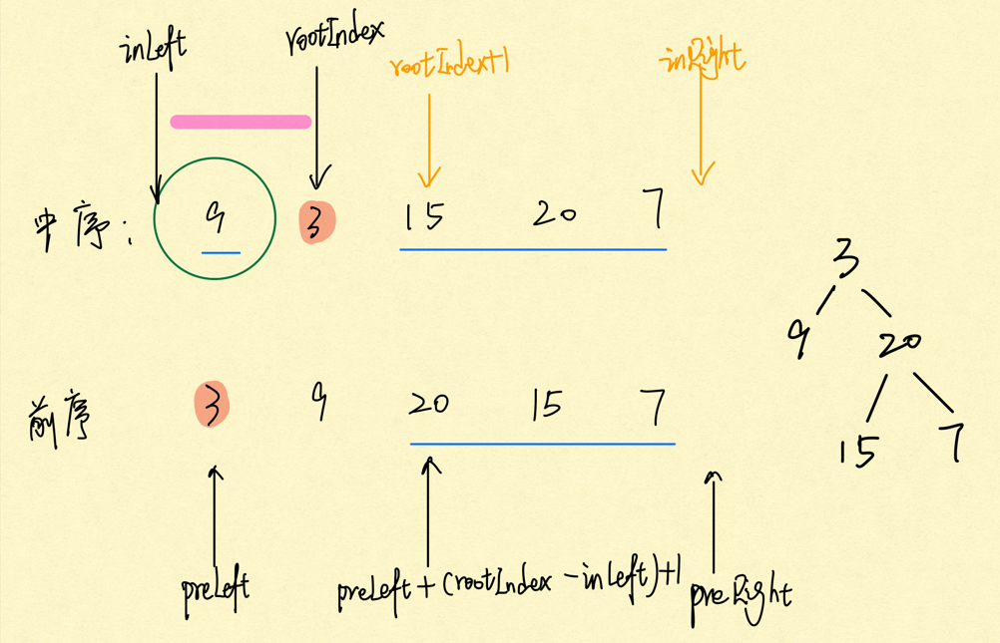
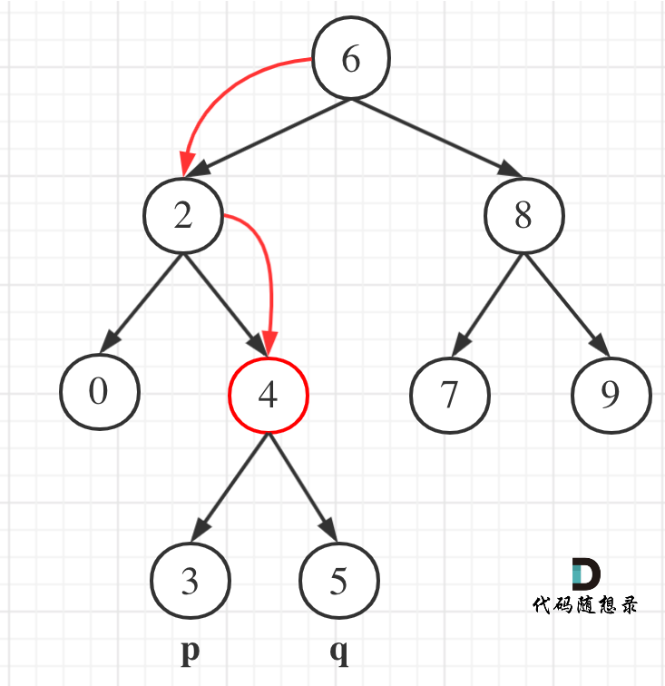

# Binary Tree & Binary Search Tree

## Pre-order Traversal Of Binary Tree (recursive)
Implement a recursive, pre-order traversal of a given binary tree, return the list of keys of each node in the tree as it is pre-order traversed.

Examples

​        5

​     /    \

   3        8

  /   \        \

1      4        11

Pre-order traversal is [5, 3, 1, 4, 8, 11]

Corner Cases

What if the given binary tree is null? Return an empty list in this case.
How is the binary tree represented?

We use the level order traversal sequence with a special symbol "#" denoting the null node.

For Example:

The sequence [1, 2, 3, #, #, 4] represents the following binary tree:

​	1

  /   \

 2     3

  /

4

```java
public class Solution {
	public 	List<Integer> preOrder(TreeNode root) {
		List<Integer> res = new ArrayList<>();
		helper(root, res);
		return res;
	}
//1. 确定递归函数的参数和返回值：因为要打印出前序遍历节点的数值，所以参数里需要传入List<Integer>再放节点的数值，除了这一点就不需要在处理什么数据了也不需要有返回值，所以递归函数返回类型就是void
	private void helper(TreeNode root, List<Integer> res) {
//2. 确定终止条件：在递归的过程中，如何算是递归结束了呢，当然是当前遍历的节点是空了，那么本层递归就要要结束了，所以如果当前遍历的这个节点是空，就直接return，代码如下：
		if (root == null) {
			return;
		}
//3. 确定单层递归的逻辑：前序遍历是中左右的循序，所以在单层递归的逻辑，是要先取中节点的数值
		res.add(root.key);
		helper(root.left, res);
		helper(root.right, res);
	}
}
```

## In-order Traversal Of Binary Tree (recursive)

```java
public class Solution {
	public List<Integer> inOrder(TreeNode root) {
		List<Integer> res = new ArrayList<>();
		helper(root, res);
		return res;
	}
	private void helper(TreeNode root, List<Integer> res) {
		if (root == null) {
			return;
		}
		helper(root.left, res);
		res.add(root.key);
		helper(root.right, res);
	}
}
```

## Post-order Traversal Of Binary Tree (recursive)

```java
public class Solution {
	public List<Integer> postOrder(TreeNode root) {
		List<Integer> res = new ArrayList<>();
		helper(root, res);
		return res;
	}
	private void helper(TreeNode root, List<Integer> res) {
		if (root == null) {
			return;
		}
		helper(root.left, res);
		helper(root.right, res);
		res.add(root.key);
	}
}
```

## Height of Binary Tree
Find the height of binary tree.

Examples:

​	5

  /    \

3        8

  /   \        \

1      4        11

The height of above binary tree is 3.

How is the binary tree represented?

We use the level order traversal sequence with a special symbol "#" denoting the null node.

For Example:

The sequence [1, 2, 3, #, #, 4] represents the following binary tree:

​	1

  /   \

 2     3

  /

4                

```java
public class Solution {
	public int findHeight(TreeNode root) {
		if (root == null) {
			return 0;
		}
		return Math.max(findHeight(root.left), findHeight(root.right)) + 1;
	}
}
```

## Check If Binary Tree Is Balanced
Check if a given binary tree is balanced. A balanced binary tree is one in which the depths of every node’s left and right subtree differ by at most 1.

Examples

​	5

  /    \

3        8

  /   \        \

1      4        11

is balanced binary tree,

​		5

​	  /

​	3

  /   \

1      4

is not balanced binary tree.

Corner Cases

What if the binary tree is null? Return true in this case.
How is the binary tree represented?

We use the level order traversal sequence with a special symbol "#" denoting the null node.

For Example:

The sequence [1, 2, 3, #, #, 4] represents the following binary tree:

​	1

  /   \

 2     3

  /

4

    - 递归思想 
    - 判断高度差大于一直接返回false, 然后就是左右都必须是balanced去递归

```java
public class Solution {
	public boolean isBalanced(TreeNode root) {
		if (root == null) {
			return true;
		}
		int leftHeight = getHeight(root.left);
		int rightHeight = getHeight(root.right);
		if (Math.abs(leftHeight - rightHeight) > 1) {
			return false;
		}
		return isBalanced(root.left) && isBalanced(root.right);
	}
	private int getHeight(TreeNode root) {
		if (root == null) {
			return 0;
		}
		return Math.max(getHeight(root.left), getHeight(root.right)) + 1;
	}
}
```

## Symmetric Binary Tree
Check if a given binary tree is symmetric.

Examples

      		  5
    
    	  /    \
    
    	3        3
      /   \    /   \
    
    1      4  4      1

is symmetric.

       		 5
    
     	 /    \
    	
    	3        3
      /   \    /   \
    
    1      4  1      4

is not symmetric.

Corner Cases

What if the binary tree is null? Return true in this case.
How is the binary tree represented?


- isSymmetric(left.left, right.right) && isSymmetric(left.right, right.left)

```java
public class Solution {
	public boolean isSymmetric(TreeNode root) {
		if (root == null) {
			return true;
		}
		return isSymmetric(root.left, root.right);
	}
	private boolean isSymmetric(TreeNode left, TreeNode right) {
		if (left == null && right == null) {
			return true;
		} else if (left == null || right == null) {
			return false;
		} else if (left.key != right.key) {
			return false;
		}
        //isSymmetric(left.left, right.right)  左子树左边
        //isSymmetric(left.right, right.left)  左子数右边
		return isSymmetric(left.left, right.right) && isSymmetric(left.right, right.left);
	}
}
```

## Tweaked Identical Binary Trees
Determine whether two given binary trees are identical assuming any number of ‘tweak’s are allowed. A tweak is defined as a swap of the children of one node in the tree.

Examples

     	    5
      	/    \
    	  3     8
      /   \
     1     4

and

        5
      /    \
     8      3
          /   \
         1     4

the two binary trees are tweaked identical.


```java
public class Solution {
	public boolean isTweakedIdentical(TreeNode one, TreeNode two) {
		if (one == null && two == null) {
			return true;
		} else if (one == null || two == null) {
			return false;
		} else if (one.key != two.key) {
			return false;
		}
		return isTweakedIdentical(one.left, two.left) && isTweakedIdentical(one.right, two.right) ||
		isTweakedIdentical(one.left, two.right) && isTweakedIdentical(one.right, two.left);
	}
}
```

## Is Binary Search Tree Or Not
Determine if a given binary tree is binary search tree.There should no be duplicate keys in binary search tree.

Assumptions

You can assume the keys stored in the binary search tree can not be Integer.MIN_VALUE or Integer.MAX_VALUE.
Corner Cases

What if the binary tree is null? Return true in this case.

- 一个任何 两个所有
- 定义min, max

```java
public class Solution {
  public boolean isBST(TreeNode root) {
    // Write your solution here
    return isBST(root, Integer.MIN_VALUE, Integer.MAX_VALUE);//return validate(root, Long.MIN_VALUE, Long.MAX_VALUE);
  }

  private boolean isBST(TreeNode root, int min, int max) {//private boolean validate(TreeNode root, long min, long max)i
    if (root == null) {
      return true;
    }
    if (root.key <= min || root.key >= max) {
      return false;
    }
    return isBST(root.left, min, root.key) && isBST(root.right, root.key, max);
  }
}
```

## Get Keys In Binary Search Tree In Given Range
Get the list of keys in a given binary search tree in a given range[min, max] in ascending order, both min and max are inclusive.

Examples

      	  5
     	 	/    \
    		3     8
      /   \    \
      1   4   11


​    

get the keys in [2, 5] in ascending order, result is  [3, 4, 5]

Corner Cases

What if there are no keys in the given range? Return an empty list in this case.

```java
public class Solution {
  public List<Integer> getRange(TreeNode root, int min, int max) {
    // Write your solution here
    List<Integer> list = new ArrayList<Integer>();
    getRange(root, min, max, list);
    return list;
  }
  private void getRange(TreeNode root, int min, int max, List<Integer> list) {
    if (root == null) {
      return;
    }
    //注意这三个if还有顺序要求，BST
    if (root.key > min) {
      getRange(root.left, min, max, list);
    }
    if (root.key >= min && root.key <= max) {
      list.add(root.key);
    }
    if (root.key < max) {
      getRange(root.right, min, max, list);
    }
  }
}
```

## Search In Binary Search Tree
Find the target key K in the given binary search tree, return the node that contains the key if K is found, otherwise return null.

Assumptions

There are no duplicate keys in the binary search tree

```java
public class Solution {
	public TreeNode search(TreeNode root, int key) {
		TreeNode cur = root;
		while (cur != null && cur.key != key) {
			cur = key < cur.key ? cur.left : cur.right;
		}
		return cur;
	}
}

//////////递归//////////
class Solution {
    public TreeNode searchBST(TreeNode root, int val) {
        if (root == null) {
            return null;
        }
        if (root.val == val) {
            return root;
        }
        if (root.val < val) {
            return searchBST(root.right, val);
        }
        if (root.val > val) {
            return searchBST(root.left, val);
        }
        return null;
    }
}
```


## Insert In Binary Search Tree
Insert a key in a binary search tree if the binary search tree does not already contain the key. Return the root of the binary search tree. 有就不插入，没有才插入

Assumptions 

There are no duplicate keys in the binary search tree

If the key is already existed in the binary search tree, you do not need to do anything

Examples

       		5
    
     	 /    \
    
    	3        8
      /   \
    
     1     4

insert 11, the tree becomes

       		5
    
     	 /    \
    
    	3        8
      /   \        \
    
     1     4       11

insert 6, the tree becomes

      		5
    
     	 /    \
    
    	3        8
      /   \     /  \
    
     1     4   6    11

```java
public class Solution {
	public TreeNode insert(TreeNode root, int key) {
		if (root == null) {
			return new TreeNode(key);
		}
		TreeNode cur = root;
		while (cur.key != key) {
			if (key < cur.key) {
				if (cur.left == null) {
					cur.left = new TreeNode(key);
				} 
				cur = cur.left;
			} else {
				if (cur.right == null) {
					cur.right = new TreeNode(key);
				}
				cur = cur.right;
			}
		}
		return root;
	}
}
```

#### [701. 二叉搜索树中的插入操作](https://leetcode-cn.com/problems/insert-into-a-binary-search-tree/)

递归**有返回值的话，可以利用返回值完成新加入的节点与其父节点的赋值操作**。

1. base case: 

终止条件就是找到遍历的节点为null的时候，就是要插入节点的位置了，并把插入的节点返回。

```java
if (root == NULL) {
    TreeNode node = new TreeNode(val);
    return node;
}
```

这里把添加的节点返回给上一层，就完成了父子节点的赋值操作了，详细再往下看。

```java
class Solution {
    public TreeNode insertIntoBST(TreeNode root, int val) {
        return buildTree(root, val);
    }

    public TreeNode buildTree(TreeNode root, int val){
        if (root == null) // 如果当前节点为空，也就意味着val找到了合适的位置，此时创建节点直接返回。
            return new TreeNode(val);
        if (root.val < val){
            root.right = buildTree(root.right, val); // 递归创建右子树
        }else if (root.val > val){
            root.left = buildTree(root.left, val); // 递归创建左子树
        }
        return root;
    }
}
```

## Delete In Binary Search Tree

Delete the target key K in the given binary search tree if the binary search tree contains K. Return the root of the binary search tree.

Find your own way to delete the node from the binary search tree, after deletion the binary search tree's property should be maintained.

Assumptions

There are no duplicate keys in the binary search tree

The smallest larger node is first candidate after deletion

- 比较绕, 递归

  

```
   		5

 	 /    \

	3        8
  /   \        \

 1     4       11
 
```

```java
class Solution {
        public TreeNode deleteNode(TreeNode root, int key) {
            if (root == null) {
                return null;
            }
            if (key == root.val) {
                if (root.left == null) {
                    return root.right; //1 左边为空
                } else if (root.right == null) {
                    return root.left; // 2 右边为空
                } else if (root.right.left == null) {// 3 右边的左孩子为空
                    root.right.left = root.left;
                    return root.right;
                } else { //右边的左孩子不为空,找root右边树的最小值作为new root，冒泡到上面来作为新的root放到中间位置接上被删的root连接的东西才能满足BST
                    TreeNode newRoot = rightSmallest(root.right);
                    newRoot.left = root.left;
                    newRoot.right = root.right;
                    return newRoot;
                }
            }
            if (key < root.val) {
                root.left = deleteNode(root.left, key); //注意这里有等号赋值，表示的是root.left即root的左边直接用递归函数返回值接管了
            } else if (key > root.val) {
                root.right = deleteNode(root.right, key);
            }
            return root;
        }

        private TreeNode rightSmallest(TreeNode root) {
            while (root.left.left != null) {
                root = root.left;
            }
            TreeNode smallest = root.left;
            root.left = root.left.right;
            return smallest;
        }
}
```

## BFS层序遍历

```java
public class Solution {
	public List<List<Integer>> layerByLayer(TreeNode root) {
		List<List<Integer>> list = new ArrayList<>();
		if (root == null) {
			return list;
		}
		Queue<TreeNode> queue = new ArrayDeque<>();
		queue.offer(root);
		while (!queue.isEmpty()) {
			List<Integer> curLayer = new ArrayList<>();
			int size = queue.size();
			for (int i = 0; i < size; i++) {
				TreeNode cur = queue.poll();
				curLayer.add(cur.key);
				if (cur.left != null) {
					queue.offer(cur.left);
				}
				if (cur.right != null) {
					queue.offer(cur.right);
				}
			}
			list.add(curLayer);
		}
		return list;
	}
}
```

## Pre-order Traversal Of Binary Tree (iterative)

Implement an iterative, pre-order traversal of a given binary tree, return the list of keys of each node in the tree as it is pre-order traversed.

Examples

      		5
     	 /    \
    	3        8
      /   \        \
    1      4        11

Pre-order traversal is [5, 3, 1, 4, 8, 11]

Corner Cases

What if the given binary tree is null? Return an empty list in this case.


```java
public class Solution {
	public List<Integer> preOrder(TreeNode root) {
		List<Integer> preOrder = new ArrayList<Integer>();
		if (root == null) {
			return preOrder;
		}
		Deque<TreeNode> stack = new LinkedList<TreeNode>();
		stack.offerFirst(root);
		while (!stack.isEmpty()) { //用stack来做,循环条件stack不为空
			TreeNode cur = stack.pollFirst();
			//由于stack是后进先出,所以需要先加入右边然后再加左边到stack里
			if (cur.right != null) {
				stack.offerFirst(cur.right);
			}
			if (cur.left != null) {
				stack.offerFirst(cur.left);
			}
			preOrder.add(cur.key);
		}
		return preOrder;
	}
}
```


## In-order Traversal Of Binary Tree (iterative)

```java
  		5
     / \
    3   8 
public class Solution {
	public List<Integer> inOrder(TreeNode root) {
		List<Integer> inorder = new ArrayList<Integer>();
		Deque<TreeNode> stack = new LinkedList<TreeNode>();
		TreeNode cur = root;
		while (cur != null || !stack.isEmpty()) {
			if (cur != null) { //只要cur不为空,统统把左边的加到stack
				stack.offerFirst(cur);[5 3
				cur = cur.left;
			} else {
				cur = stack.pollFirst(); //cur 为空后就从stack里面取出来放到inorder里
				inorder.add(cur.key);
				cur = cur.right; //然后就把cur的右边遍历
			}
		}
		return inorder;
	}
}
```

## Post-order Traversal Of Binary Tree (iterative)
		  5 
		/ 	 \
	   3	  8

postorder result [3, 8, 5]
如果我能得到[5, 8, 3] 然后reverse一下就好了
[5, 8, 3] 由之前的preorder可以试一下, 只是这一次先加左边的

```java
public class Solution {
	public List<Integer> postOrder(TreeNode root) {
		List<Integer> result = new ArrayList<Integer>();
		Deque<TreeNode> preorder = new LinkedList<TreeNode>();
		if (root == null) {
			return result;
		}
		preorder.offerFirst(root);
		while (!preorder.isEmpty()) {
			TreeNode cur = preorder.pollFirst(); //5 
			result.add(cur.key); //res = [5, 
			if (cur.left != null) {
				preorder.offerFirst(cur.left); //preorder = [3, 
			}
			if (cur.right != null) {
				preorder.offerFirst(cur.right);//preorder = [3, 8
			}
		}
	  Collections.reverse(result);
	  return result;
	}
}
```

-------------------------


**如果父节点的数组下表是i，那么它的左孩子就是i \* 2 + 1，右孩子就是 i \* 2 + 2。**

# **递归三要素**

1. **确定递归函数的参数和返回值：** 确定哪些参数是递归的过程中需要处理的，那么就在递归函数里加上这个参数， 并且还要明确每次递归的返回值是什么进而确定递归函数的返回类型。
2. **确定终止条件base case：** 写完了递归算法, 运行的时候，经常会遇到栈溢出的错误，就是没写终止条件或者终止条件写的不对，操作系统也是用一个栈的结构来保存每一层递归的信息，如果递归没有终止，操作系统的内存栈必然就会溢出。
3. **确定单层递归的逻辑recursion rule：** 确定每一层递归需要处理的信息。在这里也就会重复调用自己来实现递归的过程。


#### [226. 翻转二叉树](https://leetcode-cn.com/problems/invert-binary-tree/)

    输入：
         4
       /   \
      2     7
     / \   / \
    1   3 6   9
    
     输出：
         4
       /   \
      7     2
     / \   / \
    9   6 3   1
1. 递归前序遍历：

```java
public TreeNode invertTree(TreeNode root) {
     if (root == null) {
         return null; //base case
     }
     //使用先序or后序遍历的模板
     swapChildren(root);
     invertTree(root.left);
     invertTree(root.right);
     return root;
}
private void swapChildren(TreeNode root) {
    TreeNode temp = root.left;
    root.left = root.right;
    root.right = temp;
}
```

2. 迭代前序遍历 参考前序遍历后写出来

```java
class Solution {
    public TreeNode invertTree(TreeNode root) {
        Deque<TreeNode> stack = new LinkedList<>();
        if (root == null) {
            return null;
        }
        stack.offerFirst(root);
        while(!stack.isEmpty()) {
            TreeNode cur = stack.pollFirst();
            if (cur != null) {//前序遍历
                if (cur.right != null) {
                    stack.offerFirst(cur.right);//右
                }
                if (cur.left != null) {
                    stack.offerFirst(cur.left);//左
                }
                stack.offerFirst(cur); //中
                stack.offerFirst(null);
            } else {//开始反转
                //stack.pollFirst(); //Java中offer了null值但是取的时候不能取到null而是第一个数，和C++不同
                cur = stack.pollFirst();
                swapChild(cur);
            }
        }
        return root;
    }
    private void swapChild(TreeNode root) {
        TreeNode temp = root.left;
        root.left = root.right;
        root.right = temp;
    }
}
```

3. BFS解决

   也就是层序遍历，层数遍历也是可以翻转这棵树的，因为层序遍历也可以把每个节点的左右孩子都翻转一遍，代码如下：

```java
class Solution {
    public TreeNode invertTree(TreeNode root) {
        if (root == null) {
            return null;
        }
        Queue<TreeNode> queue = new ArrayDeque<>(); // 1. 初始化queue
        queue.offer(root); // 2. 先放入第一个root 
        while(!queue.isEmpty()) { //3. 循环条件queue不为空的时候
            TreeNode cur = queue.poll(); //4. 取出来cur 
            swapChild(cur); //5. 进行操作
            if (cur.left != null) { 
                queue.offer(cur.left);
            }
            if (cur.right != null) {
                queue.offer(cur.right);
            } // 6. 添加左右孩子进来
        }
        return root;
    }
    private void swapChild(TreeNode root) {
        TreeNode temp = root.right;
        root.right = root.left;
        root.left = temp;
    }
}
```


#### [559. N 叉树的最大深度](https://leetcode-cn.com/problems/maximum-depth-of-n-ary-tree/)

>给定一个 N 叉树，找到其最大深度。
>
>最大深度是指从根节点到最远叶子节点的最长路径上的节点总数。
>
>N 叉树输入按层序遍历序列化表示，每组子节点由空值分隔（请参见示例）。
>


1. 递归

```java
class Solution {
    public int maxDepth(Node root) {
        if (root == null) {
            return 0;
        }
        int depth = 0;
        for (int i = 0; i < root.children.size(); i++) {
            depth = Math.max(depth, maxDepth(root.children.get(i)));
        }
        return depth + 1;
    }
}
```

2. BFS

```JAVA
 public int maxDepth(Node root) {
        if (root == null) {
            return 0;
        }
        int depth = 0;
        Queue<Node> queue = new ArrayDeque<>();
        queue.offer(root);
        while(!queue.isEmpty()) {
            depth++;
            int size = queue.size();
            for (int i = 0; i < size; i++) { //横向遍历各个节点
                Node cur = queue.poll();
                if (cur.children != null) {
                     .addAll(cur.children);
                }
            }
        }
        return depth;
    }
```

#### [111. 二叉树的最小深度](https://leetcode-cn.com/problems/minimum-depth-of-binary-tree/)

>给定一个二叉树，找出其最小深度。
>
>最小深度是从根节点到最近叶子节点的最短路径上的节点数量。


这就重新审题了，题目中说的是：**最小深度是从根节点到最近叶子节点的最短路径上的节点数量。**，注意是**叶子节点**。

什么是==叶子节点==，左右孩子都为空的节点才是叶子节点！


- 如果左子树为空，右子树不为空，说明最小深度是 1 + 右子树的深度。

- 反之右子树为空，左子树不为空，最小深度是 1 + 左子树的深度。

- 如果左右子树都不为空，返回左右子树深度最小值 + 1

可以看出：**求二叉树的最小深度和求二叉树的最大深度的差别主要在于处理左右孩子不为空的逻辑。**

1. Recursion

```java
class Solution {
    public int minDepth(TreeNode root) {
        if (root == null) {
            return 0;
        }
        int leftDepth = minDepth(root.left);
        int rightDepth = minDepth(root.right);
        if (root.left == null && root.right != null) {
            return rightDepth + 1;
        }
        if (root.right == null && root.left != null) {
            return leftDepth + 1;
        }
        return Math.min(leftDepth, rightDepth) + 1;
    }
}
```

2. BFS

```JAVA
class Solution {
    public int minDepth(TreeNode root) {
        if (root == null) {
            return 0;
        }
        int depth = 0;
        Queue<TreeNode> queue = new ArrayDeque<>();
        queue.offer(root);
        while(!queue.isEmpty()) {
            int size = queue.size();
            depth++;
            for (int i = 0; i < size; i++) {
                TreeNode cur = queue.poll();
                if (cur.left == null && cur.right == null) {
                    // 是叶子结点，直接返回depth，因为从上往下遍历，所以该值就是最小值
                    return depth;
                }
                if (cur.left != null) {
                    queue.offer(cur.left);
                }
                if (cur.right != null) {
                    queue.offer(cur.right);
                }
            }

        }
        return depth;
    }
}
```

#### [222. 完全二叉树的节点个数](https://leetcode-cn.com/problems/count-complete-tree-nodes/)

给你一棵**完全二叉树** 的根节点 `root` ，求出该树的节点个数。


1. Recursion

```java
class Solution {
    public int countNodes(TreeNode root) {
        if (root == null) {
            return 0; // base case 
        }
        int leftNum = countNodes(root.left);//left 
        int rightNum = countNodes(root.right);//right 
        int sum = leftNum + rightNum + 1; //middle
        return sum;
    }
}
```

2. BFS 

```Java
class Solution {
   public int countNodes(TreeNode root) {
        if (root == null) {
            return 0;
        }
        Queue<TreeNode> queue = new ArrayDeque<>();
        queue.offer(root);
        int nodeNum = 0;
        while (!queue.isEmpty()) {
            //List<Integer> curLayer = new ArrayList<>();
            int size = queue.size();
            for (int i = 0; i < size; i++) {
                TreeNode cur = queue.poll();
               // curLayer.add(cur.val);
                if (cur.left != null) {
                    queue.offer(cur.left);
                }
                if (cur.right != null) {
                    queue.offer(cur.right);
                }
            }
            nodeNum += size;
        }
        return nodeNum;
    }
}
```

#### [257. 二叉树的所有路径](https://leetcode-cn.com/problems/binary-tree-paths/)

>给定一个二叉树，返回所有从根节点到叶子节点的路径。
>
>**说明:** 叶子节点是指没有子节点的节点。

```
输入:
   1
 /   \
2     3
 \
  5
输出: ["1->2->5", "1->3"]
解释: 所有根节点到叶子节点的路径为: 1->2->5, 1->3
```

需要**前序遍历**，这样才方便让父节点指向孩子节点，找到对应的路径。

1. base case:

**什么时候算是找到了叶子节点？** 是当 cur不为空，其左右孩子都为空的时候，就找到叶子节点。

```
if(cur.left == null && cur.right == null) {
	终止处理逻辑
}
```

2. 确定单层递归逻辑

因为是前序遍历，需要先处理中间节点，中间节点就是我们要记录路径上的节点，先放进path中。

```
 paths.add(root.val);
```

然后是递归和回溯的过程，上面说过没有判断cur是否为空，那么在这里递归的时候，如果为空就不进行下一层递归了。

所以递归前要加上判断语句，下面要递归的节点是否为空，如下

```
if (root.left != null) {
	helper(root.left, paths, res);
	paths.remove(paths.size() - 1); //返回上一层回溯
}
if (root.right != null) {
	helper(root.right, paths, res);
	paths.remove(paths.size() - 1);
}
```

**回溯要和递归永远在一起，世界上最遥远的距离是你在花括号里，而我在花括号外！**

```java
class Solution {
    public List<String> binaryTreePaths(TreeNode root) {
        List<String> res = new ArrayList<>();
        if (root == null) {
            return res;
        }
        List<Integer> paths = new ArrayList<>(); //里面放的是integer
        helper(root, paths, res);
        return res;
    }
    private void helper(TreeNode root, List<Integer> paths, List<String> res) {
        paths.add(root.val);
        // 叶子结点
        if (root.left == null && root.right == null) {
            // 输出
            StringBuilder sb = new StringBuilder();
            for (int i = 0; i < paths.size() - 1; i++) { //paths.size() - 1 是因为最后一个元素不要添加"->"
                sb.append(paths.get(i)).append("->"); //取出path里面的数据加上箭头
            }
            sb.append(paths.get(paths.size() - 1)); //加上最后一个元素
            res.add(sb.toString());
            return;
        }
        if (root.left != null) {
            helper(root.left, paths, res);
            paths.remove(paths.size() - 1); //返回上一层回溯
        }
        if (root.right != null) {
            helper(root.right, paths, res);
            paths.remove(paths.size() - 1);
        }
    }
}
```

**方法二：** 常规前序遍历，不用回溯

```JAVA
class Solution {
    public List<String> binaryTreePaths(TreeNode root) {
        List<String> res = new ArrayList<>();
        helper(root, new StringBuilder(), res);
        return res;
    }
    private void helper(TreeNode root, StringBuilder sb, List<String> res) {
        if (root == null) { //防止NPE
          return;
        }
        if (root.left == null && root.right == null) { //控制空节点不入循环
            sb.append(root.val);
            res.add(sb.toString());
            return;
        }
        helper(root.left, new StringBuilder(sb).append(root.val + "->"), res);
        helper(root.right, new StringBuilder(sb).append(root.val + "->"), res);
    }
}
```

#### [404. 左叶子之和](https://leetcode-cn.com/problems/sum-of-left-leaves/)

计算给定二叉树的所有左叶子之和。

1. recursion 

```java
class Solution {
    public int sumOfLeftLeaves(TreeNode root) {
        if (root == null) {
            return 0;
        }
        int leftValue = sumOfLeftLeaves(root.left);
        int rightValue = sumOfLeftLeaves(root.right);
        int midValue = 0;
        if (root.left != null && root.left.left == null && root.left.right == null) {
            midValue = root.left.val;
        }
        int sum = midValue + leftValue + rightValue;
        return sum;
    }
} 
```

2. 递归

```java
 class Solution {
        public int sumOfLeftLeaves(TreeNode root) {
            if (root == null) {
                return 0;
            }
            Deque<TreeNode> stack = new ArrayDeque<>();
            stack.offerFirst(root);
            int result = 0;
            while(!stack.isEmpty()) {
                TreeNode cur = stack.pollFirst();
                if (cur.right != null) {
                    stack.offerFirst(cur.right);
                }
                if (cur.left != null) {
                    stack.offerFirst(cur.left);
                }
                if (cur.left != null && cur.left.left == null && cur.left.right == null) {
                    result += cur.left.val;
                }
            }
            return result;
        }
    }
```

#### [513. 找树左下角的值](https://leetcode-cn.com/problems/find-bottom-left-tree-value/)

>给定一个二叉树的 **根节点** `root`，请找出该二叉树的 **最底层 最左边** 节点的值。假设二叉树中至少有一个节点。
>
>```
>输入: root = [2,1,3]
>输出: 1
>```

如何判断是最后一行呢，其实就是深度最大的叶子节点一定是最后一行。

1. BFS

```JAVA
class Solution {
   public int findBottomLeftValue(TreeNode root) {
        Queue<TreeNode> queue = new ArrayDeque<>();
        queue.offer(root);
        int res = 0;
        while (!queue.isEmpty()) {
            int size = queue.size();
            for (int i = 0; i < size; i++) {
                TreeNode cur = queue.poll();
                if (i == 0) {
                    res = cur.val;
                }
                if (cur.left != null) {
                    queue.offer(cur.left);
                }
                if (cur.right != null) {
                    queue.offer(cur.right);
                }
            }
        }
        return res;
    }

```

#### [112. 路径总和](https://leetcode-cn.com/problems/path-sum/)

>给你二叉树的根节点 root 和一个表示目标和的整数 targetSum ，判断该树中是否存在**根节点到叶子节点的路径**，这条路径上所有节点值相加等于目标和 targetSum 。
>
>叶子节点 是指没有子节点的节点。

 

**如果需要==搜索整颗二叉树==，那么递归函数就==不要返回值==，**

**如果要搜索其中==一条符合条件==的路径，递归函数就==需要返回值==，因为遇到符合条件的路径了就要及时返回。**

图中可以看出，遍历的路线，并不要遍历整棵树，所以递归函数需要返回值，可以用bool类型表示。


1. 计数器如何统计这一条路径的和呢？

不要去累加然后判断是否等于目标和，那么代码比较麻烦，可以用递减，让计数器count初始为目标和，然后每次减去遍历路径节点上的数值。如果最后==count == 0==，==同时到了叶子节点的话==，说明找到了目标和。

```java
class Solution {
    public boolean hasPathSum(TreeNode root, int targetSum) {
        if (root == null) {
            return false;
        }
        return traversal(root, targetSum - root.val);
    }
    private boolean traversal(TreeNode cur, int count) {
        if (cur.left == null && cur.right == null && count == 0) {
            return true; // base case: 遇到叶子节点，并且计数为0
        }
        if (cur.left != null) {
            count -= cur.left.val;// 递归，处理节点;
            if (traversal(cur.left, count)) {// 回溯，撤销处理结果
                return true;
            }
            count += cur.left.val;
        }
        if (cur.right != null) {
            count -= cur.right.val;
            if (traversal(cur.right, count)) {
                return true;
            }
            count += cur.right.val;
        }
        return false;
    }
}
```

方法二：前序遍历，两个stack, 一个遍历，一个记录sum

```java
class Solution {
    public boolean hasPathSum(TreeNode root, int targetSum) {
      if (root == null) {
          return false;
      }
      Deque<TreeNode> stack = new ArrayDeque<>();
      Deque<Integer> stackNum = new ArrayDeque<>();
      stack.offerFirst(root);
      stackNum.offerFirst(root.val);
      while(!stack.isEmpty()) {
          TreeNode cur = stack.pollFirst();
          int sum = stackNum.pollFirst();
          if (cur.left == null && cur.right == null && sum == targetSum) {
              return true;
          }
          if (cur.right != null) {
              stack.offerFirst(cur.right);
              stackNum.offerFirst(sum + cur.right.val);
          }
           // 左节点，压进去一个节点的时候，将该节点的路径数值也记录下来
          if (cur.left != null) {
              stack.offerFirst(cur.left);
              stackNum.offerFirst(sum + cur.left.val);
          }
      }
      return false;
    }
}
```


#### [113. 路径总和 II](https://leetcode-cn.com/problems/path-sum-ii/)

找到所有路径，**所以递归函数不要返回值！**

> 给你二叉树的根节点 `root` 和一个整数目标和 `targetSum` ，找出==所有== **从根节点到叶子节点** 路径总和等于给定目标和的路径。


```java
/**
 * Definition for a binary tree node.
 * public class TreeNode {
 *     int val;
 *     TreeNode left;
 *     TreeNode right;
 *     TreeNode() {}
 *     TreeNode(int val) { this.val = val; }
 *     TreeNode(int val, TreeNode left, TreeNode right) {
 *         this.val = val;
 *         this.left = left;
 *         this.right = right;
 *     }
 * }
 */
class Solution {
    public List<List<Integer>> pathSum(TreeNode root, int targetSum) {
        List<List<Integer>> res = new ArrayList<>();
        if (root == null) {
            return res;
        }
        List<Integer> path = new ArrayList<>();
        path.add(root.val);
        helper(root, targetSum - root.val, path, res);
        return res;
    }
    private void helper(TreeNode root, int count, List<Integer> path, List<List<Integer>> res) {
        if (root.left == null && root.right == null) {
            if (count == 0) {
                res.add(new ArrayList<>(path));
            }
            return;
        }
        if (root.left != null) {
            path.add(root.left.val);
            count -= root.left.val;
            helper(root.left, count, path, res);
            count += root.left.val;
            path.remove(path.size() - 1);
        }
        if (root.right != null) {
            path.add(root.right.val);
            count -= root.right.val;
            helper(root.right, count, path, res);
            count += root.right.val;
            path.remove(path.size() - 1);
        }

    }
}
```

#### [437. 路径总和 III](https://leetcode-cn.com/problems/path-sum-iii/)


```java
class Solution {
    public int pathSum(TreeNode root, int targetSum) {
        if (root == null) {
            return 0;
        }
        // 中左右 根节点 非根节点往下找
        int res = pathSumStartWithRoot(root, targetSum) + pathSum(root.left, targetSum) + pathSum(root.right, targetSum);
        return res;
    }
    private int pathSumStartWithRoot(TreeNode root, int targetSum) {
        if (root == null) {
            return 0;
        }
        int res = 0;
        if (root.val == targetSum) res++;
        res += pathSumStartWithRoot(root.left, targetSum - root.val) + pathSumStartWithRoot(root.right, targetSum - root.val);
        return res;
    }
}
```

#### [106. 从中序与后序遍历序列构造二叉树](https://leetcode-cn.com/problems/construct-binary-tree-from-inorder-and-postorder-traversal/)

> 根据一棵树的中序遍历与后序遍历构造二叉树。
>
> ```
> 中序遍历 inorder = [9,3,15,20,7]
> 后序遍历 postorder = [9,15,7,20,3]
> 返回如下的二叉树：
>     3
>    / \
>   9  20
>     /  \
>    15   7
> ```

以==后序数组==的最后一个元素为切割点，==先切中序数组==，根据中序数组，反过来在切后序数组。一层一层切下去，每次后序数组最后一个元素就是节点元素。


说到一层一层切割，就应该想到了递归。

来看一下一共分几步：

- 第一步：如果数组大小为零的话，说明是空节点了。
- 第二步：如果不为空，那么==取后序数组最后一个元素==作为节点元素。
- 第三步：找到==后序数组==最后一个元素在==中序数组的位置==，作为切割点
- 第四步：切割中序数组，切成中序左数组和中序右数组 （顺序别搞反了，一定是先切中序数组）
- 第五步：切割后序数组，切成后序左数组和后序右数组
- 第六步：递归处理左区间和右区间

为什么先切割中序数组呢？

切割点在后序数组的最后一个元素，就是用这个元素来切割中序数组的，所以必要==先切割中序数组==。

可以按照下图，将树分为三块来递归，递归函数传入root.left需要满足在中序和后序数组中保持一致。


```python
class Solution {
    public TreeNode buildTree(int[] inorder, int[] postorder) {
        return buildTree(inorder, 0, inorder.length, postorder, 0, postorder.length);
    }
    public TreeNode buildTree(int[] inorder, int inLeft, int inRight, int[] postorder, int postLeft, int postRight) {
        //base case:
        //没有元素了
        if (inRight - inLeft < 1) {
            return null;
        }
        // 只有一个元素了
        if (inRight - inLeft == 1) {
            return new TreeNode(inorder[inLeft]);
        }
        // 后序数组postorder里最后一个即为根结点
        int rootVal = postorder[postRight - 1];
        TreeNode root = new TreeNode(rootVal);
        int rootIndex = 0;
        // 根据根结点的值找到该值在中序数组inorder里的位置
        for (int i = inLeft; i < inRight; i++) {
            if (inorder[i] == rootVal) {
                rootIndex = i;
            }
        }
        // 根据rootIndex划分左右子树
        root.left = buildTree(inorder, inLeft, rootIndex,
                postorder, postLeft, postLeft + (rootIndex - inLeft)); //后序树的root左边（其实就是中序的前半部分）
        root.right = buildTree(inorder, rootIndex + 1, inRight,
                postorder, postLeft + (rootIndex - inLeft), postRight - 1);//后序右边 15 7 20
        return root;
    }
}
```


#### [105. 从前序与中序遍历序列构造二叉树](https://leetcode-cn.com/problems/construct-binary-tree-from-preorder-and-inorder-traversal/)



```java
class Solution {
    public TreeNode buildTree(int[] preorder, int[] inorder) {
        return buildTree(preorder, 0, preorder.length, inorder, 0, inorder.length);
    }
    private TreeNode buildTree(int[] preorder, int preLeft, int preRight, int[] inorder, int inLeft, int inRight) {
        if (inRight - inLeft < 1|| preLeft - preRight > 1) {
            return null;
        }
        if (inRight - inLeft == 1) {
            return new TreeNode(inorder[inLeft]);
        }
        int rootVal = preorder[preLeft];
        TreeNode root = new TreeNode(rootVal);
        int rootIndex = 0;
        for (int i = inLeft; i < inRight; i++) {
            if (inorder[i] == rootVal) {
                rootIndex = i;
            }
        }
        //preLeft + 1 表示到前序的9的位置，preLeft + (rootIndex - inLeft) + 1是因为左闭右开，确保9被加入。 rootIndex确实在9的后面
        root.left = buildTree(preorder, preLeft + 1, preLeft + (rootIndex - inLeft) + 1, inorder, inLeft, rootIndex);
        root.right = buildTree(preorder, preLeft + (rootIndex - inLeft) + 1,preRight, inorder, rootIndex + 1, inRight);
        return root;
    }
}
```

​	

#### [654. 最大二叉树](https://leetcode-cn.com/problems/maximum-binary-tree/)

**base case:** 那么当递归遍历的时候，如果传入的数组大小为1，说明遍历到了==叶子节点了==。

那么应该定义一个新的节点，并把这个数组的数值赋给新的节点，然后返回这个节点。 这表示一个数组大小是1的时候，构造了一个新的节点，并返回。

```java
class Solution {
    public TreeNode constructMaximumBinaryTree(int[] nums) {
        return helper(nums, 0, nums.length);
    }
    private TreeNode helper(int[] nums, int leftIndex, int rightIndex) {
      ////////base case/////////////// 
        if (rightIndex - leftIndex < 1) {// 没有元素了
            return null;//终止条件，是遇到空节点，也就是数组区间为0，就终止了。
        }
        if (rightIndex - leftIndex == 1) {// 只有一个元素
            return new TreeNode(nums[leftIndex]);
        }
        /////////////// 单层递归逻辑///////////////
        int maxIndex = leftIndex;// 最大值所在位置
        int maxVal = nums[maxIndex];// 最大值
        for (int i = leftIndex + 1; i < rightIndex; i++) {
            if (nums[i] > maxVal) {
                maxVal = nums[i];
                maxIndex = i;
            }
        }
        TreeNode root = new TreeNode(maxVal);
        // 根据maxIndex划分左右子树
        root.left = helper(nums, leftIndex, maxIndex);
        root.right = helper(nums, maxIndex + 1, rightIndex);
        return root;
    }
}
```

#### [617. 合并二叉树](https://leetcode-cn.com/problems/merge-two-binary-trees/)

>给定两个二叉树，想象当你将它们中的一个覆盖到另一个上时，两个二叉树的一些节点便会重叠。
>
>你需要将他们合并为一个新的二叉树。合并的规则是如果两个节点重叠，那么将他们的值相加作为节点合并后的新值，否则不为 NULL 的节点将直接作为新二叉树的节点。
>
>```
>输入: 
>	Tree 1                     Tree 2                  
>          1                         2                             
>         / \                       / \                            
>        3   2                     1   3                        
>       /                           \   \                      
>      5                             4   7                  
>输出: 
>合并后的树:
>	     3
>	    / \
>	   4   5
>	  / \   \ 
>	 5   4   7
>```

```java
class Solution {
        public TreeNode mergeTrees(TreeNode root1, TreeNode root2) {
            //base case//////////////////
            if (root1 == null & root2 == null) {
                return null; 
            }
            if (root1 == null & root2 != null ) {
                return root2;
            }
            if (root2 == null & root1 != null ) {
                return root1;
            }
            //单层递归///////////////////
            TreeNode newRoot = new TreeNode(root1.val + root2.val);//中
            newRoot.left = mergeTrees(root1.left, root2.left); //左边
            newRoot.right = mergeTrees(root1.right, root2.right);//右边
            return newRoot;
        }
}
```

#### [530. ==二叉搜索树==的最小绝对差](https://leetcode-cn.com/problems/minimum-absolute-difference-in-bst/)

> 给你一棵所有节点为非负值的二叉搜索树，请你计算树中任意两节点的差的绝对值的最小值。
>
> ```
> 输入：
> 
>    1
>     \
>      3
>     /
>    2
> 
> 输出：
> 1
> 
> 解释：
> 最小绝对差为 1，其中 2 和 1 的差的绝对值为 1（或者 2 和 3）。
> ```

用一个pre节点记录一下cur节点的前一个节点。


```JAVA
class Solution {
        TreeNode pre;// 记录上一个遍历的结点
        int result = Integer.MAX_VALUE;
        public int getMinimumDifference(TreeNode root) {
            if(root==null)return 0;
            traversal(root);
            return result;
        }
        //中序遍历模板 在中的时候进行操作
        public void traversal(TreeNode root){
            if(root==null)return;
            //左
            traversal(root.left);
            //中
            if(pre!=null){//root.val-pre.val 如果root刚好在根，那么pre就是左孩子
                //如果root刚好在右孩子，那么pre就是根
                result = Math.min(result,root.val-pre.val);
            }
            pre = root;// 记录前一个
            //右
            traversal(root.right);
        }
    }
```

中序遍历迭代法

```java
class Solution {
        public int getMinimumDifference(TreeNode root) {
            int result = Integer.MAX_VALUE;
            TreeNode pre = null;
            TreeNode cur = root;
            Deque<TreeNode> stack = new ArrayDeque<>();
            while (cur != null || !stack.isEmpty()) {
                if (cur != null) {
                    stack.offerFirst(cur);
                    cur = cur.left;
                } else {
                    cur = stack.pollFirst();
                    if (pre != null) {
                        result = Math.min(result, cur.val - pre.val);
                    }
                    pre = cur;
                    cur = cur.right;
                }
            }
            return result;
        }
    }
```

#### [501. 二叉搜索树中的众数](https://leetcode-cn.com/problems/find-mode-in-binary-search-tree/)

>给定一个有相同值的二叉搜索树（BST），找出 BST 中的所有众数（出现频率最高的元素）。
>
>假定 BST 有如下定义：
>
>- 结点左子树中所含结点的值**小于等于**当前结点的值
>- 结点右子树中所含结点的值**大于等于**当前结点的值
>- 左子树和右子树都是二叉搜索树
>
>例如：
>给定 BST `[1,null,2,2]`,
>
>```
>   1
>    \
>     2
>    /
>   2
>```

如果不是二叉搜索树，最直观的方法一定是把这个树都遍历了，用map统计频率，把频率排个序，最后取前面高频的元素的集合。

1. 这个树都遍历了，用map统计频率 

2. 把统计的出来的出现频率（即map中的value）排个序
3. 取前面高频的元素

**既然是搜索树，它中序遍历就是有序的**。

弄一个指针指向前一个节点，这样每次cur（当前节点）才能和pre（前一个节点）作比较。

而且初始化的时候pre = NULL，这样当pre为NULL时候，我们就知道这是比较的第一个元素

```java
class Solution {
    ArrayList<Integer> resList;
    int maxCount;// 最大频率
    int count;// 统计频率
    TreeNode pre;
    public int[] findMode(TreeNode root) {
        resList = new ArrayList<>();
        maxCount = 0;
        count = 0;
        pre = null;
        helper(root);
        int[] res = new int[resList.size()];
        for (int i = 0; i < resList.size(); i++) {
            res[i] = resList.get(i);
        }
        return res;
    }
    private void helper(TreeNode root) {
        if (root == null) {
            return;
        }
        helper(root.left);

        int rootValue = root.val;
        //计数
        if (pre == null || rootValue != pre.val) {// 第一个节点// 与前一个节点数值不同
            count = 1;
        } else { // 与前一个节点数值相同
            count++;
        }
        // 更新结果以及maxCount
        if (count > maxCount) {// 如果计数大于最大值
            resList.clear(); // 很关键的一步，不要忘记清空result，之前result里的元素都失效了
            resList.add(rootValue);
            maxCount = count; // 更新最大频率
        } else if (count == maxCount) { // 如果和最大值相同，放进result中
            resList.add(rootValue);
        }
        pre = root;

        helper(root.right);
    }
}
```

#### [236. 二叉树的最近公共祖先](https://leetcode-cn.com/problems/lowest-common-ancestor-of-a-binary-tree/)

>给定一个二叉树, 找到该树中两个指定节点的最近公共祖先。
>
>

要是能自底向上查找就好了，这样就可以找到公共祖先了。

回溯啊，二叉树回溯的过程就是==从低到上==。后序遍历就是天然的回溯过程，最先处理的一定是叶子节点。

**如果找到一个节点，发现左子树出现结点p，右子树出现节点q，或者 左子树出现结点q，右子树出现节点p，那么该节点就是节点p和q的最近公共祖先。**

使用后序遍历，回溯的过程，就是从低向上遍历节点，一旦发现如何这个条件的节点，就是最近公共节点了。

1. base case: 如果找到了 节点p或者q，或者遇到空节点，就返回。

```java
if (root == q || root == p || root == NULL) return root;
```

**在递归函数有返回值的情况下：如果要搜索一条边，递归函数返回值不为空的时候，立刻返回，如果搜索整个树，直接用一个变量left、right接住返回值，这个left、right后序还有逻辑处理的需要，也就是后序遍历中处理中间节点的逻辑（也是回溯）**。


```java
   class Solution {
        public TreeNode lowestCommonAncestor(TreeNode root, TreeNode p, TreeNode q) {
            return helper(root, q, p);
        }
        private TreeNode helper(TreeNode root, TreeNode p, TreeNode q) {
            if (root == null || root == p || root == q) {
                return root;
            }
            TreeNode left = helper(root.left, p, q); //左
            TreeNode right = helper(root.right, p, q); //右
            //如果想利用left和right做逻辑处理， 不能立刻返回，而是要等left与right逻辑处理完之后才能返回。
            //中
            if (left != null && right != null) {// 如果left 和 right都不为空，说明此时root就是最近公共节点。这个比较好理解
                return root;
            }
            if (left == null && right != null) {//如果left为空，right不为空，就返回right，说明目标节点是通过right返回的
                return right;
            } else if (left != null && right == null) {
                return left;
            }
            return null; //那么如果left和right都为空，则返回left或者right都是可以的，也就是返回空。
        }
    }
```

#### [235. 二叉搜索树的最近公共祖先](https://leetcode-cn.com/problems/lowest-common-ancestor-of-a-binary-search-tree/)

>给定一个二叉搜索树, 找到该树中两个指定节点的最近公共祖先。
>
>

只要从上到下遍历的时候，cur节点是数值在[p, q]区间中则说明该节点cur就是最近公共祖先了。

普通二叉树求最近公共祖先需要使用回溯，从底向上来查找，二叉搜索树就不用了，因为搜索树有序（相当于自带方向），那么只要从上向下遍历就可以了。

==采用前序遍历==（其实这里**没有中节点的处理逻辑**，遍历顺序无所谓了）。



可以找到节点4，为最近公共祖先，而且不需要遍历整棵树，找到结果直接返回！

1. base case:

```java
if (cur == NULL) return cur;
```

其实都不需要这个终止条件，因为题目中说了p、q 为不同节点且均存在于给定的二叉搜索树中。也就是说一定会找到公共祖先的，所以并不存在遇到空的情况。

```java
class Solution {
    public TreeNode lowestCommonAncestor(TreeNode root, TreeNode p, TreeNode q) {
        return helper(root, p, q);
    }
    private TreeNode helper(TreeNode cur, TreeNode p, TreeNode q) {
        if (cur == null) {
            return cur;
        }
        //左边找到了
        if (cur.val > p.val && cur.val > q.val) {
            TreeNode left = helper(cur.left, p, q);
            if (left != null) { //必须不为空
                return left;
            }
        }
        //右边找到了
        if (cur.val < p.val && cur.val < q.val) {
            TreeNode right = helper(cur.right, p, q);
            if (right != null) {
                return right;
            }
        }
        return cur;
    }
}
```

#### [669. 修剪二叉搜索树](https://leetcode-cn.com/problems/trim-a-binary-search-tree/)

>给你二叉搜索树的根节点 root ，同时给定最小边界low 和最大边界 high。通过修剪二叉搜索树，使得所有节点的值在[low, high]中。修剪树不应该改变保留在树中的元素的相对结构（即，如果没有被移除，原有的父代子代关系都应当保留）。 可以证明，存在唯一的答案。
>
>所以结果应当返回修剪好的二叉搜索树的新的根节点。注意，根节点可能会根据给定的边界发生改变。
>
>
>
>


```java
class Solution {
    public TreeNode trimBST(TreeNode root, int low, int high) {
        if (root == null) {
            return null;
        }
        //右边 
        if (root.val < low) {//相当于把节点0的右孩子（节点2）返回给上一层，
            TreeNode right = trimBST(root.right, low, high);//区间[low, high]
            return right;
        }
        //左边
        if (root.val > high) {
            TreeNode left = trimBST(root.left, low, high);
            return left;
        }
        //中 上面例子直接先进入如下代码，然后判断后进入第七行代码，第七行代码返回节点0的右孩子（节点2）
        root.left = trimBST(root.left, low, high);//然后如下代码相当于用节点3的左孩子 把下一层返回的 节点0的右孩子（节点2） 接住
        root.right = trimBST(root.right, low, high);
        return root;
    }
}
```

#### [108. 将有序数组转换为二叉搜索树](https://leetcode-cn.com/problems/convert-sorted-array-to-binary-search-tree/)

>给你一个整数数组 nums ，其中元素已经按 升序 排列，请你将其转换为一棵 高度平衡 二叉搜索树。
>
>高度平衡 二叉树是一棵满足「每个节点的左右两个子树的高度差的绝对值不超过 1 」的二叉树。
>
>

**本质就是寻找分割点，分割点作为当前节点，然后递归左区间和右区间**。

如果数组长度为偶数，中间节点有两个，取哪一个？

例如：输入：[-10,-3,0,5,9]  实际上就是按照0中点切割，然后0的左边是完整递归，右边也是完整递归。

如下两棵树，都是这个数组的平衡二叉搜索树：


如果要分割的数组长度为偶数的时候，中间元素为两个，是取左边元素 就是树1，取右边元素就是树2。

**这里定义的是左闭右闭区间，在不断分割的过程中，也会坚持左闭右闭的区间**

1. base case: 

```java
if (left > right) return null; //left > right的时候，就是空节点了。
```

```java
class Solution {
    public TreeNode sortedArrayToBST(int[] nums) {
        return helper(nums, 0, nums.length - 1);
    }
    private TreeNode helper(int[] nums, int left, int right) {
        if (left > right) {
            return null;
        }
        int mid = left + (right - left) / 2;
        TreeNode root = new TreeNode(nums[mid]);
        root.left = helper(nums, left, mid - 1);
        root.right = helper(nums, mid + 1, right);
        return root;
    }
}
```

#### [538. 把二叉搜索树转换为累加树](https://leetcode-cn.com/problems/convert-bst-to-greater-tree/)

>给出==二叉 搜索 树==的根节点，该树的节点值各不相同，请你将其转换为累加树（Greater Sum Tree），使每个节点 node 的新值等于原树中大于或等于 node.val 的值之和。
>
>
>
>

**换一个角度来看，这就是一个有序数组[2, 5, 13]，求从后到前的累加数组，也就是[20, 18, 13]，是不是感觉这就简单了。**

**从树中可以看出累加的顺序是右中左，所以我们需要反中序遍历这个二叉树，然后顺序累加就可以了**。

这里很明确了，不需要递归函数的返回值做什么操作了，要遍历整棵树。

同时需要定义一个全局变量pre，用来保存cur节点的前一个节点的数值，定义为int型就可以了。

```java
class Solution {
    int pre;
    public TreeNode convertBST(TreeNode root) {
       pre = 0;
       helper(root);
       return root;
    }
    private void helper(TreeNode cur) {
        if (cur == null) {
            return;
        }
        helper(cur.right);
        cur.val += pre;
        pre = cur.val;
        helper(cur.left);
    }
}
```

也可以直接用一个全局sum计算

```java
class Solution {
        int sum;
    public TreeNode convertBST(TreeNode root) {
        sum = 0;
        helper(root);
        return root;
    }
    private void helper(TreeNode root) {
        if (root == null) {
            return;
        }
        helper(root.right); //右边
        sum += root.val;
        root.val = sum; //中
        helper(root.left); //左边
    }
}
```


#### [114. 二叉树展开为链表](https://leetcode-cn.com/problems/flatten-binary-tree-to-linked-list/)


先先序遍历 然后重新建立新链表


当右子树不为空,  将右子树直接赋给左子树最右边节点, 然后root.left给

```java
class Solution {
    public void flatten(TreeNode root) {
        List<TreeNode> list = new ArrayList<>();
        dfs(root, list);
        for (int i = 1; i < list.size(); i++) {
            TreeNode prev = list.get(i - 1);
            TreeNode cur = list.get(i);
            prev.left = null;
            prev.right = cur;
        }
    }
    //通过递归实现的先序遍历
    private void dfs(TreeNode root, List<TreeNode> list) {
        if (root != null) {
            list.add(root);
            dfs(root.left, list);
            dfs(root.right, list);
        }
    }
}
```

方法二: 将root右边移动到左子树最右边,然后把 这整体左边移动回右边


```java
class Solution {
    public void flatten(TreeNode root) {
       while (root != null) {
           if (root.left == null) {
               root = root.right;
           } else {
               //1 找左子树最右边节点
               TreeNode pre = root.left;
               while(pre.right != null) {
                   pre = pre.right;
               }
               //2 右子树连接到pre右边
               pre.right = root.right;
               //3 将root左边大坨移动到右边
               root.right = root.left;
               root.left = null;
               //4 下一个节点
               root = root.right;
           }
       }
    }
}
```

#### [208. 实现 Trie (前缀树)](https://leetcode-cn.com/problems/implement-trie-prefix-tree/)


每个节点下面接26个节点

```java
class Trie {

    private Trie[] children;
    private boolean isEnd;

    public Trie() {
        //开辟26个字母的存储空间
        children = new Trie[26];
      //初始化单词结尾false
        isEnd = false;
    }
    
    public void insert(String word) {
        //node指针指向当前对象的头节点
        Trie node = this;
        for (int i = 0; i < word.length(); i++) {
            char ch = word.charAt(i);
            int index = ch - 'a';
            if (node.children[index] == null) {
                node.children[index] = new Trie();
            }
            node = node.children[index];
        }
        node.isEnd = true;//插入了一个完整的单词
    }
     
    public boolean search(String word) {
        //前缀树遍历方法返回的不是空说明前缀存在
        Trie node = searchPrefix(word);
        return node != null && node.isEnd; //说明是个单词

    }
    
    public boolean startsWith(String prefix) {
        return searchPrefix(prefix) != null;
    }

    public Trie searchPrefix(String prefix) {
        Trie node = this;
        for (int i = 0; i < prefix.length(); i++) {
            char ch = prefix.charAt(i);
            int index = ch - 'a';
            if (node.children[index] == null) {
                return null;
            }
            node = node.children[index];
        }
        return node;
    }
}
```


#### [543. 二叉树的直径](https://leetcode-cn.com/problems/diameter-of-binary-tree/)


```java
class Solution {
    int ans;
    public int diameterOfBinaryTree(TreeNode root) {
        ans = 1; //全局更新这个变量
        depth(root);
        return ans - 1;
    }
    public int depth(TreeNode node) {
        if (node == null) {
            return 0; 
        }
        int L = depth(node.left);
        int R = depth(node.right);
        ans = Math.max(ans, L + R + 1);
        return Math.max(L, R) + 1;
    }
}
```

#### [230. 二叉搜索树中第K小的元素](https://leetcode-cn.com/problems/kth-smallest-element-in-a-bst/)


```java
class Solution {
    int k, ans;
    public int kthSmallest(TreeNode root, int _k) {
        k = _k;
        dfs(root);
        return ans;
    }
    void dfs(TreeNode root) {
        if (root == null || k <= 0) return ;
        dfs(root.left);
        if (--k == 0) ans = root.val;
        dfs(root.right);
    }
}
```

#### [116. 填充每个节点的下一个右侧节点指针](https://leetcode-cn.com/problems/populating-next-right-pointers-in-each-node/)


``` java
class Solution {
	public Node connect(Node root) {
		if(root==null) {
			return root;
		}
		Node pre = root;
		//循环条件是当前节点的left不为空，当只有根节点
		//或所有叶子节点都出串联完后循环就退出了
		while(pre.left!=null) {
			Node tmp = pre;
			while(tmp!=null) {
				//将tmp的左右节点都串联起来
				//注:外层循环已经判断了当前节点的left不为空
				tmp.left.next = tmp.right;
				//下一个不为空说明上一层已经帮我们完成串联了
				if(tmp.next!=null) {
					tmp.right.next = tmp.next.left;
				}
				//继续右边遍历
				tmp = tmp.next;
			}
			//从下一层的最左边开始遍历
			pre = pre.left;
		}
		return root;
	}
}

作者：wang_ni_ma
链接：https://leetcode-cn.com/problems/populating-next-right-pointers-in-each-node/solution/dong-hua-yan-shi-san-chong-shi-xian-116-tian-chong/
来源：力扣（LeetCode）
著作权归作者所有。商业转载请联系作者获得授权，非商业转载请注明出处。
```


#### [117. 填充每个节点的下一个右侧节点指针 II](https://leetcode-cn.com/problems/populating-next-right-pointers-in-each-node-ii/)


https://github.com/afatcoder/LeetcodeTop/blob/master/shopee/backend.md


#### [662. 二叉树最大宽度](https://leetcode-cn.com/problems/maximum-width-of-binary-tree/)


 对树中的所有元素进行编号


每一层的最小值都会变成0, 这里左边一定是parent * 2, right = parent * 2 + 1, 当前层offset最左边值, 是自己的值减去自己为0, 最右边值减去最左边  


```java
class Solution {
    //Time = O(n) Space = O(h)
    private List<Integer> ids; //动态数组记录每一层最小值
    public int widthOfBinaryTree(TreeNode root) {
        this.ids = new ArrayList<Integer>();
        return dfs(root, 0, 0);
    }
    // d 表示深度 id当前节点id
    private int dfs(TreeNode root, int d, int id) {
        if (root == null) {
            return 0;
        }
        if (ids.size() == d) ids.add(id); //递归到d层时,ids中添加了刚好这个深度大小
        int rootId = id - ids.get(d);
        return Math.max(rootId + 1, Math.max(dfs(root.left, d + 1, rootId * 2), dfs(root.right, d + 1, rootId * 2 + 1)));//rootId + 1只有在这一层的最右边的时候才有效果
    }
}
```

