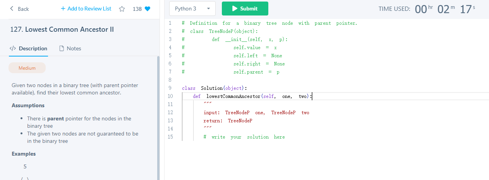

# Heap and Graph Search I : BFS 9/1
## K Smallest In Unsorted Array
Find the K smallest numbers in an unsorted integer array A. The returned numbers should be in ascending order.

Assumptions

A is not null
K is >= 0 and smaller than or equal to size of A
Return

an array with size K containing the K smallest numbers in ascending order
Examples

A = {3, 4, 1, 2, 5}, K = 3, the 3 smallest numbers are {1, 2, 3}

- 使用Maxheap maxheap里面放k个元素,遍历array然后和里面k个元素里的最大值比较,比最大值小的就放到maxheap里

```java
public class Solution {
	public int[] kSmallest(int[] array, int k) {
		if (array.length == 0 || k == 0) {
			return new int[0];
		}
		PriorityQueue<Integer> maxHeap = new PriorityQueue<Integer>(k, new Comparator<Integer>(){
			@Override
			public int compare(Integer a, Integer b) {
				if (a.equals(b)) {
					return 0;
				}
				return a > b ? -1 : 1;
			}
		});
		for (int i = 0; i < array.length; i++) {
			if (i < k) { //先加入k个元素
				maxHeap.offer(array[i]);
			} else if (array[i] < maxHeap.peek()) {
				maxHeap.poll();
				maxHeap.offer(array[i]);
			}
		}
		int[] result = new int[k];
		for (int i = k - 1; i >= 0; i--) {
			result[i] = maxHeap.poll();
		}
		return result;
	}
}
```

## Get Keys In Binary Tree Layer By Layer
Get the list of list of keys in a given binary tree layer by layer. Each layer is represented by a list of keys and the keys are traversed from left to right.

Examples

      		 5
    
     	 /    \
    
    	3        8
      /   \        \
    
     1     4        11

the result is [ [5], [3, 8], [1, 4, 11] ]

Corner Cases

What if the binary tree is null? Return an empty list of list in this case.


```java
public class Solution {
	public List<List<Integer>> layerByLayer(TreeNode root) {
		List<List<Integer>> list = new ArrayList<>();
		if (root == null) {
			return list;
		}
		Queue<TreeNode> queue = new ArrayDeque<>();
		queue.offer(root);
		while (!queue.isEmpty()) {
			List<Integer> curLayer = new ArrayList<>();
			int size = queue.size(); //相当于一个墙 只打印上一层的所有节点
			for (int i = 0; i < size; i++) {
				TreeNode cur = queue.poll();
				curLayer.add(cur.key);
				if (cur.left != null) {
					queue.offer(cur.left);
				}
				if (cur.right != null) {
					queue.offer(cur.right);
				}
			}
			list.add(curLayer);
		}
		return list;
	}
}
```

## Bipartite
Determine if an undirected graph is bipartite. A bipartite graph is one in which the nodes can be divided into two groups such that no nodes have direct edges to other nodes in the same group.

Examples

1  --   2

    /   

3  --   4

is bipartite (1, 3 in group 1 and 2, 4 in group 2).

1  --   2

    /   |

3  --   4

is not bipartite.

Assumptions

The graph is represented by a list of nodes, and the list of nodes is not null.

```java
public class GraphNode {
	public int key;
	public List<GraphNode> neighbors;
	public GraphNode(int key) {
		this.key = key;
		this.neighbors = new ArrayList<GraphNode>();
	}
}

public class Solution {
  public boolean isBipartite(List<GraphNode> graph) {
    // write your solution here
    HashMap<GraphNode, Integer> visited = new HashMap<GraphNode, Integer>();
    // 对于每一个node作为起始点开始遍历
    for (GraphNode node : graph) {
      if (!BFS(node, visited)) { //不是bipatite
        return false;
      }
    }
    return true;
  }
  //BFS来遍历所有的节点,然后0 1来标记颜色
  private boolean BFS(GraphNode node, HashMap<GraphNode, Integer> visited) {
    if (visited.containsKey(node)) {
      return true;
    }
    Queue<GraphNode> queue = new ArrayDeque<GraphNode>();
    queue.offer(node); // 1 先放入第一个node到queue
    visited.put(node, 0); //2 标记为0
    while (!queue.isEmpty()) { //3 bfs遍历条件
      GraphNode cur = queue.poll();
      int curGroup = visited.get(cur);
      int neiGroup = curGroup == 0 ? 1 : 0; //4 标记curGroup和neiGroup
      for (GraphNode nei : cur.neighbors) {
        if (!visited.containsKey(nei)) {
          visited.put(nei, neiGroup);
          queue.offer(nei); 
        } else if (visited.get(nei) != neiGroup) {
          return false;
        }
      }
    }
    return true;
  }
}
```

## Check If Binary Tree Is Completed
 使用bfs遍历,定义一个flag一旦出现没有孩子的时候flag就为true
```java
public class CheckIfBinaryTreeIsCompleted {
    public boolean isCompleted(TreeNode root) {
        if (root == null) {
            return true;
        }
        Queue<TreeNode> queue = new ArrayDeque<TreeNode>();
        //if the flag is set true, there should not be any child nodes afterwards
        boolean flag = false;
        queue.offer(root);
        while(!queue.isEmpty()) {
            TreeNode cur = queue.poll();
            //if any of the child is not present, set the flag to true
            if (cur.left == null) {
                flag = true;
            } else if (flag) {
                //if flag is set but we still see cur has left child
                //the binary tree is not a completed one
                return false;
            } else {
                //if flag is not set and left child is present
                queue.offer(cur.left);
            }
            //same logic applied to the right child
            if (cur.right == null) {
                flag = true;
            } else if (flag) {
                return false;
            } else {
                queue.offer(cur.right);
            }
        }
        return true;
    }
}
```

## Kth Smallest Number In Sorted Matrix
Given a matrix of size N x M. For each row the elements are sorted in ascending order, and for each column the elements are also sorted in ascending order. Find the Kth smallest number in it.

Assumptions

the matrix is not null, N > 0 and M > 0
K > 0 and K <= N * M
Examples

{ {1,  3,   5,  7},

  {2,  4,   8,   9},

  {3,  5, 11, 15},

  {6,  8, 13, 18} }

the 5th smallest number is 4
the 8th smallest number is 6

-  题目中的矩阵行和列都是递增的, 利用这个特点定义一个visited矩阵,然后遍历某元素右边和下面的元素 然后加入到大小为k的minpq里. 最后取出pq顶部的元素就是最小值. 因为要加入minHeap的元素是矩阵元素,所以要定义cell.

```java
public class KthSmallestNumberInSortedMatrix {
    public int kthSmallest(int[][] matrix, int k) {
        int rows = matrix.length;
        int columns = matrix[0].length;
        //best first search, need a minheap on the value of each cells
        PriorityQueue<Cell> minHeap = new PriorityQueue<Cell>(k, new Comparator<Cell>() {
            @Override
            public int compare(Cell c1, Cell c2) {
                if (c1.value == c2.value) {
                    return 0;
                }
                return c1.value < c2.value ? -1 : 1;
            }
        });
        //all the generated cells will be marked true
        //to avoid being generated more than once
        boolean[][] visited = new boolean[rows][columns];
        minHeap.offer(new Cell(0, 0, matrix[0][0]));
        visited[0][0] = true;
        //iterate k - 1 rounds, and Best First Search the smallest k-1 cells
        for (int i = 0; i < k - 1; i++) {
            Cell cur = minHeap.poll();
            //the neighbor cell will be inserted back to the minHeap only if
            // 1 it is not out of boundary
            // 2 it has not been generated before
            // because for each cell it could be generated twice
            if (cur.row + 1 < rows && !visited[cur.row + 1][cur.column]) {
                minHeap.offer(new Cell(cur.row + 1, cur.column, matrix[cur.row + 1][cur.column]));
                visited[cur.row + 1][cur.column] = true;
            }
            if (cur.column + 1 < columns && !visited[cur.row][cur.column + 1]) {
                minHeap.offer(new Cell(cur.row, cur.column + 1, matrix[cur.row][cur.column + 1]));
                visited[cur.row][cur.column + 1] = true;
            }
        }
        return minHeap.peek().value;
    }
    static class Cell {
        int row;
        int column;
        int value;
        Cell(int row, int column, int value) {
            this.row = row;
            this.column = column;
            this.value = value;
        }
    }
}
```

#### [200. 岛屿数量](https://leetcode-cn.com/problems/number-of-islands/)

>给你一个由 '1'（陆地）和 '0'（水）组成的的二维网格，请你计算网格中岛屿的数量。
>
>岛屿总是被水包围，并且每座岛屿只能由水平方向和/或竖直方向上相邻的陆地连接形成。
>
>此外，你可以假设该网格的四条边均被水包围。
>
>```
>示例 1：
>输入：grid = [
>  ["1","1","1","1","0"],
>  ["1","1","0","1","0"],
>  ["1","1","0","0","0"],
>  ["0","0","0","0","0"]
>]
>输出：1
>示例 2：
>输入：grid = [
>  ["1","1","0","0","0"],
>  ["1","1","0","0","0"],
>  ["0","0","1","0","0"],
>  ["0","0","0","1","1"]
>]
>输出：3
>```


比如这个图中红色，蓝，绿色 三个岛屿，题目的意思就是只要是上下左右连着的1都看成是一个岛屿，然后这个岛屿需要被（0）包围

1. 外层循环遍历所有节点, 如果该坐标为1即岛屿, 那就使用bfs打通所有该坐标的4连通区域
2. Bfs写法: 

借用一个队列 queue，判断队列首部节点 (i, j) 是否为 1：
若是则**置零**（删除岛屿节点），并将此节点上下左右节点 (i+1,j),(i-1,j),(i,j+1),(i,j-1) 加入队列；
若不是则跳过此节点；
循环 pop 队列首节点，直到整个队列为空，此时已经遍历完此岛屿。

```java
class Solution {
    public int numIslands(char[][] grid) {
        int count = 0;
        for(int i = 0; i < grid.length; i++) {
            for(int j = 0; j < grid[0].length; j++) {
                if(grid[i][j] == '1'){
                    bfs(grid, i, j);
                    count++;
                }
            }
        }
        return count;
    }
    private void bfs(char[][] grid, int i, int j){
        Queue<int[]> list = new LinkedList<>();
        list.add(new int[] { i, j });
        while(!list.isEmpty()){
            int[] cur = list.remove();
            i = cur[0]; j = cur[1];
            if(0 <= i && i < grid.length && 0 <= j && j < grid[0].length && grid[i][j] == '1') {
                grid[i][j] = '0';
                list.add(new int[] { i + 1, j });
                list.add(new int[] { i - 1, j });
                list.add(new int[] { i, j + 1 });
                list.add(new int[] { i, j - 1 });
            }
        }
    }
}
```

#### [286. 墙与门](https://leetcode-cn.com/problems/walls-and-gates/)

>你被给定一个 m × n 的二维网格 rooms ，网格中有以下三种可能的初始化值：
>
>1. -1 表示墙或是障碍物
>
>2. 0 表示一扇门
>
>3. INF 无限表示一个空的房间。然后，我们用 231 - 1 = 2147483647 代表 INF。你可以认为通往门的距离总是小于 2147483647 的。
>
>   你要给每个空房间位上填上该房间到 最近门的距离 ，如果无法到达门，则填 INF 即可。
>
>

```java
public class WallsandGates {
    private static final int Empty = Integer.MAX_VALUE;
    private static final int GATE = 0;
    private static final int WALL = -1;
    private static final List<int[]> DIRECTIONS = Arrays.asList(
            new int[] {1, 0},
            new int[] {-1, 0},
            new int[] {0,  1},
            new int[] {0, -1}
    );

    public void wallsAndGates(int[][] rooms) {
        if (rooms.length == 0) {
            return;
        }
        for (int row = 0; row < rooms.length; row++) {
            for (int col = 0; col < rooms[0].length; col++) {
                if (rooms[row][col] == Empty) {
                    rooms[row][col] = distanceToNearestGate(rooms, row, col);
                }
            }
        }
    }
    private int distanceToNearestGate(int[][] rooms, int startRow, int startCol) {
        int m = rooms.length;
        int n = rooms[0].length;
        int[][] distance = new int[m][n]; //用来记录距离大小
        Queue<int[]> q = new ArrayDeque<>();
        q.offer(new int[] {startRow, startCol}); //queue里面放的是坐标
        while (!q.isEmpty()) {
            int[] point = q.poll();
            int row = point[0];
            int col = point[1]; //记录一下刚开始的行列坐标
            for (int[] directions: DIRECTIONS) {
                int r = row + directions[0];
                int c = col + directions[1]; //r c 用来遍历
                if (r < 0 || c < 0 || r >= m || c >= n || rooms[r][c] == WALL || distance[r][c] != 0) {
                    continue;
                }
                distance[r][c] = distance[row][col] + 1; 
                if (rooms[r][c] == GATE) {
                    return distance[r][c];
                }
                q.add(new int[] {r, c});
            }
        }
        return Integer.MAX_VALUE;
    }
}

```

```python
import collections
from typing import List
class Solution:
    def wallsAndGates(self, rooms: List[List[int]]) -> None:
        m = len(rooms)
        n = len(rooms[0])
        if m == 0 or n == 0:
            return

        q = collections.deque()
        directions = [(1, 0), (-1, 0), (0, 1), (0, -1)]
        for i in range(m):
            for j in range(n):
                if rooms[i][j] == 0:
                    q.append((i, j))
        while q:
            x, y = q.popleft()

            for dx, dy in directions:
                new_x = x + dx
                new_y = y + dy

                if new_x < 0 or new_x >= m or new_y < 0 or new_y >= n or rooms[new_x][new_y] < rooms[x][y] + 1:
                    continue
                rooms[new_x][new_y] = rooms[x][y] + 1
                q.append((new_x, new_y))
```

#### [1197. 进击的骑士](https://leetcode-cn.com/problems/minimum-knight-moves/)

>一个坐标可以从 -infinity 延伸到 +infinity 的 无限大的 棋盘上，你的 骑士 驻扎在坐标为 [0, 0] 的方格里。
>
>骑士的走法和中国象棋中的马相似，走 “日” 字：即先向左（或右）走 1 格，再向上（或下）走 2 格；或先向左（或右）走 2 格，再向上（或下）走 1 格。
>
>每次移动，他都可以按图示八个方向之一前进。
>
>
>
>现在，骑士需要前去征服坐标为 `[x, y]` 的部落，请你为他规划路线。
>
>最后返回所需的最小移动次数即可。本题确保答案是一定存在的。
>
>```
>示例 1：
>输入：x = 2, y = 1
>输出：1
>解释：[0, 0] → [2, 1]
>示例 2：
>输入：x = 5, y = 5
>输出：4
>解释：[0, 0] → [2, 1] → [4, 2] → [3, 4] → [5, 5]
>```
>
>1.bfs 在图中，求最短路径，最简洁高效的算法
>
>2.记忆化，防止“回头”
>
>3.4个象限关于（0，0）对称。都转化成第一象限，方便处理和计算
>
>4.剪枝。顶多顶多在（0,0）和终点框成的正方形，之外再向外延伸2层，以作斡旋之用

```python
import collections
class Solution:
    def minKnightMoves(self, x: int, y: int) -> int:
        if x == 0 and y == 0:
            return 0
        x = abs(x)
        y = abs(y)
        q = collections.deque([(0, 0)])
        visited = set()
        visited.add((0, 0))
        step = 0
        while q:
            cur_len  = len(q)
            step += 1
            for _ in range(cur_len): #这里这个循环是不断pop队列中的元素
                row, col = q.popleft()
                for dx, dy in ((-2, 1), (-2, -1), (-1, 2), (-1, -2), (1, 2), (1, -2), (2, 1), (2, -1)):
                    new_row = row + dx
                    new_col = col + dy
                    if (new_row, new_col) not in visited:
                        if -2 <= new_row <= x + 2 and -2 <= new_col <= y + 2:
                            if new_row == x and new_col == y:
                                return step
                            else:
                                q.append((new_row, new_col))
                                visited.add((new_row, new_col))


```




#### [1162. 地图分析](https://leetcode-cn.com/problems/as-far-from-land-as-possible/)


只要先把所有的陆地都入队，然后从各个陆地同时开始一层一层的向海洋扩散，那 么最后扩散到的海洋就是最远的海洋! 并且这个海洋肯定是被离他最近的陆地给扩散到的!


```java
class Solution {
        public int maxDistance(int[][] grid) {
            int[] dx = {0, 0, 1, -1};
            int[] dy = {1, -1, 0, 0};
            Queue<int[]> queue = new LinkedList<>();
            int m = grid.length, n = grid[0].length;
            // 先把所有的陆地都入队。
            for (int i = 0; i < m; i++) {
                for (int j = 0; j < n; j++) {
                    if (grid[i][j] == 1) {
                        queue.offer(new int[] {i, j});
                    }
                }
            }
            // 从各个陆地开始，一圈一圈的遍历海洋，最后遍历到的海洋就是离陆地最远的海洋。
            // 取出队列的元素，将其四周的海洋入队。
            boolean hasOcean = false;
            int[] point = null;
            while (!queue.isEmpty()) {
                point = queue.poll();
                int x = point[0], y = point[1];
                for (int i = 0; i < 4; i++) {
                    int newX = x + dx[i];
                    int newY = y + dy[i];
                    if (newX < 0 || newX >= m || newY < 0 || newY >= n || grid[newX][newY] != 0) {
                        continue;
                    }
                    grid[newX][newY] = grid[x][y] + 1;// 这里我直接修改了原数组，因此就不需要额外的数组来标志是否访问
                    hasOcean = true;
                    queue.offer(new int[] {newX, newY});
                }
            }
            //没有陆地或者没有海洋，返回-1。
            if (point == null || !hasOcean) {
                return -1;
            }
            return grid[point[0]][point[1]] - 1;//因为从陆地开始遍历海洋,陆地 的初始值是 1,
            // 而每次将不为 0 的块的上下左右的海洋赋值为该块值+1,所以该最后找到的 块的值减去陆地的值 1 就是距离,可以看上面绿色那个图理解一下.
        }
    }
```

#### [133. 克隆图](https://leetcode-cn.com/problems/clone-graph/)


```java
//HashMap<Node, Node> visited = new HashMap(); //key是原图中的节点,value是克隆图对应节点 然后bfs
class Solution {
    public Node cloneGraph(Node node) {
        if (node == null) {
            return node;
        }
        HashMap<Node, Node> visited = new HashMap(); //key是原图中的节点,value是克隆图对应节点
        // 将题目给定的节点添加到队列
        Queue<Node> queue = new LinkedList<>();
        queue.add(node);
        // 克隆第一个节点并存储到哈希表中
        visited.put(node, new Node(node.val, new ArrayList<>()));
        //bfs
        while (!queue.isEmpty()) {
            Node n = queue.poll();
            for(Node neighbor: n.neighbors) {
                if (!visited.containsKey(neighbor)) {
                    // 如果没有被访问过，就克隆并存储在哈希表中
                    visited.put(neighbor, new Node(neighbor.val, new ArrayList<>()));
                    //将邻居节点加入队列中
                    queue.offer(neighbor);
                }
                // 更新当前节点的邻居列表, 这里副本的neighbor上添加刚刚visited中还没有具体添加子邻居的点
                visited.get(n).neighbors.add(visited.get(neighbor)); 
            }
        }
        return visited.get(node);
    }
}
```

#### [695. 岛屿的最大面积](https://leetcode-cn.com/problems/max-area-of-island/)


```java
class Solution {
    public int maxAreaOfIsland(int[][] grid) {
        int ans = 0;
        for (int i = 0; i < grid.length; i++) {
            for (int j = 0; j < grid[0].length; j++) {
                if (grid[i][j] == 1) {
                    ans = Math.max(ans, BFS(grid, i, j));
                }
            }
        }
        return ans;
    }
    public int BFS(int[][] grid, int i, int j) {
        Queue<int[]> queue = new ArrayDeque<>();
        queue.offer(new int[] {i, j});
        int area = 0;
        while (!queue.isEmpty()) {
            int[] cur = queue.poll();
            i = cur[0];
            j = cur[1];
            if (0 <= i && i < grid.length && 0 <= j && j < grid[0].length && grid[i][j] == 1) {
                grid[i][j] = 0;
                area++;
                queue.add(new int[] { i + 1, j });
                queue.add(new int[] { i - 1, j });
                queue.add(new int[] { i, j + 1 });
                queue.add(new int[] { i, j - 1 });
            }
        }
        return area;
    }
}
```

#### [面试题 16.19. 水域大小](https://leetcode-cn.com/problems/pond-sizes-lcci/)


```java
class Solution {
    int[][] dirs = new int[][] {{1, 0}, {-1, 0}, {0, 1}, {0, -1}, {1, 1}, {1, -1}, {-1, 1}, {-1, -1}};
    int area = 0;
    public int[] pondSizes(int[][] land) {
        List<Integer> res = new ArrayList<>();
        int m = land.length;
        int n = land[0].length;
        for (int i = 0; i < m; i++) {
            for (int j = 0; j < n; j++) {
                area = 0;
                dfs(land, i, j);
                if (area > 0) {
                    res.add(area);
                }
            }
        }
        int[] ans = new int[res.size()];
        for (int i = 0; i < ans.length; i++) {
            ans[i] = res.get(i);
        }
        Arrays.sort(ans);
        return ans;
    }
    private void dfs(int[][] land, int i, int j) {
        if (land[i][j] != 0) {
            return;
        }
        land[i][j] = -1; //标记已经访问过的水域为陆地
        area++;
        for(int[] dir : dirs) {
            int nx = i + dir[0];
            int ny = j + dir[1];
            if (inArea(land, nx, ny) && land[nx][ny] == 0) {
                dfs(land, nx, ny);
            }
        }
    }
    boolean inArea(int[][] land, int x, int y) {
        return 0 <= x && x < land.length && 0 <= y && y < land[0].length;
    }
}
```

#### [130. 被围绕的区域](https://leetcode-cn.com/problems/surrounded-regions/)


题目中解释说被包围的区间不会存在于边界上，所以我们会想到边界上的 O 要特殊处理，只要把边界上的 O 特殊处理了，那么剩下的 O 替换成 X 就可以了。问题转化为，如何寻找和**边界联通的 O**，我们需要考虑如下情况。

X X X X
X O O X
X X O X
X O O X
这时候的 **O 是不做替换**的。因为和边界是连通的。为了记录这种状态，我们把这种情况下的 **O 换成 # 作为占位符**，待搜索结束之后，遇到 O 替换为 X（和边界不连通的 O）；遇到 **#，替换回 O**(和边界连通的 O)。

- dfs 递归 dfs替换边界的o为# 然后for loop遍历将o替换为x, # 替换为o 

```java
class Solution {
    public void solve(char[][] board) {
        if (board == null || board.length == 0) return;
        int m = board.length;
        int n = board[0].length;
        for (int i = 0; i < m; i++) {
            for (int j = 0; j < n; j++) {
                // 从边缘o开始搜索
                boolean isEdge = i == 0 || j == 0 || i == m - 1 || j == n - 1;
                if (isEdge && board[i][j] == 'O') {
                    dfs(board, i, j);
                }
            }
        }

        for (int i = 0; i < m; i++) {
            for (int j = 0; j < n; j++) {
                if (board[i][j] == 'O') {
                    board[i][j] = 'X';
                }
                if (board[i][j] == '#') {
                    board[i][j] = 'O';
                }
            }
        }
    }

    public void dfs(char[][] board, int i, int j) {
        if (i < 0 || j < 0 || i >= board.length  || j >= board[0].length || board[i][j] == 'X' || board[i][j] == '#') {
            // board[i][j] == '#' 说明已经搜索过了. 
            return;
        }
        board[i][j] = '#';
        dfs(board, i - 1, j); // 上
        dfs(board, i + 1, j); // 下
        dfs(board, i, j - 1); // 左
        dfs(board, i, j + 1); // 右
    }
}
```

#### [994. 腐烂的橘子](https://leetcode-cn.com/problems/rotting-oranges/)


实际上就是求**腐烂橘子到所有新鲜橘子的最短路径**。

一开始，我们找出所有腐烂的橘子，将它们放入队列，作为第 0 层的结点。
然后进行 BFS 遍历，每个结点的相邻结点可能是上、下、左、右四个方向的结点，注意判断结点位于网格边界的特殊情况。
由于可能存在无法被污染的橘子，我们需要记录新鲜橘子的数量。在 BFS 中，每遍历到一个橘子（污染了一个橘子），就将新鲜橘子的数量减一。如果 BFS 结束后这个数量仍未减为零，说明存在无法被污染的橘子。

这里用queue里面放入烂橘子,然后每一遍历记录queue的size, 一次遍历就是分钟数, queue条件就是count > 0 并且queue不为空才遍历

```java
class Solution {
    public int orangesRotting(int[][] grid) {
        int m = grid.length;
        int n = grid[0].length;
        Queue<int[]> queue = new LinkedList<>();
        int count = 0; //新鲜橘子数量
        for (int i = 0; i < m; i++) {
            for (int j = 0; j < n; j++) {
                if (grid[i][j] == 1) {
                    count++;
                }
                if (grid[i][j] == 2) {
                    queue.add(new int[] {i, j}); //放烂橘子
                }
            }
        }
        int round = 0;
        while (count > 0 && !queue.isEmpty()) {
            round++;
            int s = queue.size();
            for (int i = 0; i < s; i++) {
                int[] orange = queue.poll();
                int r = orange[0];
                int c = orange[1];
                if (r - 1 >= 0 && grid[r - 1][c] == 1) {
                    grid[r - 1][c] = 2;
                    count--;
                    queue.add(new int[] {r - 1, c});
                }
                if (r + 1 < m && grid[r + 1][c] == 1) {
                    grid[r + 1][c] = 2;
                    count--;
                    queue.add(new int[] {r + 1, c});
                }
                if (c - 1 >= 0 && grid[r][c - 1] == 1) {
                    grid[r][c - 1] = 2;
                    count--;
                    queue.add(new int[] {r, c - 1});
                }
                if (c + 1 < n && grid[r][c + 1] == 1) {
                    grid[r][c + 1] = 2;
                    count--;
                    queue.add(new int[] {r, c + 1});
                }
            }
        }
        if (count > 0) {
            return -1;
        } else {
            return round;
        }
    }
}
```
