# 7 Graph Search II : DFS

https://juejin.cn/post/6844904088618942478

`DFS`深度优先，解题必须画出recursion tree

递归回去一定回去到==断点==的下一行,beaking point先回到头，一直回头，然后到了base case才return到调用者此时breaking point的下一行。

**解决基本问题：**

1. 一共多少层？   决定basecase
2. 每层叉出几个node?  决定调用几次DFS 
## All Subsets I
> Given a set of characters represented by a String, return a list
> containing all subsets of the characters.
>
> Assumptions
>
> There are no duplicate characters in the original set. Examples
>
> Set = "abc", all the subsets are [“”, “a”, “ab”, “abc”, “ac”, “b”,
> “bc”, “c”] Set = "", all the subsets are [""] Set = null, all the
> subsets are []
>
>  1. 一共2层   决定basecase
2. 每层叉出2node 加a不加a
**Basecase:** 就是走到最后一层了，记得要return。
**Recursion rule:**分成两部分 case1加 case2 不加
时间复杂度：红色是O(1), System.out.println(solutionPrefix)绿色是O(n)。时间总和：
1 + 2 + 4…+ 2^n（倒数第二层）+ 2^n *n(最后一层) = (2^n)*n
每一层都是组合节点(2^n个node)   最后(2^n个node)节点,每个node花费O(n)
每一个node是O（1），直上直下空间是O(n). 


```java
public class Solution {
  public List<String> subSets(String set) {
    List<String> result = new ArrayList<>();
    if (set == null) {
      return result;
    }
    StringBuilder sb = new StringBuilder();
    char[] arraySet = set.toCharArray();
    helper(sb, arraySet, 0, result);
    return result;
  }
  private void helper(StringBuilder sb, char[] set, int index, List<String> result) {
    if (index == set.length) {
      result.add(sb.toString()); //base case 
      return;
    }
    sb.append(set[index]); //一直吃到底 粉色路径123
    helper(sb, set, index + 1, result); // 递归触底 加入abc beaking point
    sb.deleteCharAt(sb.length() - 1); // 粉色路径4 吐出
    helper(sb, set, index + 1, result); //粉色路径5 
   
  }
}
```

## All Valid Permutations Of Parentheses I

> Given N pairs of parentheses “()”, return a list with all the valid
> permutations.
>
> Assumptions
>
> N > 0 Examples
>
> N = 1, all valid permutations are ["()"] N = 3, all valid permutations
> are ["((()))", "(()())", "(())()", "()(())", "()()()"]


1.  N = 3  6个位置 树有6层，每一层代表一个位置 
2. 每个node加左或者右边括号 
**限制条件：**每次加右括号的时候，确保左括号的数量一定要大于右括号

每个node岔出来两个岔，2^(2n), 2n层. 1 + 2 + 4 + 8 + --- + $2^{2n}$
Time = O(2 ^ (2n) *n) Space = O(n)
先是一吃到底然后吐完右边括号接着吐左边括号

走到第6步之后，11行代码返回到37行，37 breaking point 行就是之前的调用者，会执行38行delete, 然后37行，然后38行。

```java
public class Solution {
    public static void main(String[] args) {
        int n = 3;
        Solution sol = new Solution();
        System.out.println(sol.validParentheses(n));
    }
    //debug latter
    public List<String> validParentheses(int n) {
        List<String> result = new ArrayList<>();
        StringBuilder sb = new StringBuilder();
        helper(n, 0, 0, sb, result);
        return result;
    }

    /**
     *
     * @param n ()对的个数
     * @param l 添加的左括号so far
     * @param r 添加的右括号so far
     * @param sb 方框里的括号so far
     * @param result
     */
    private void helper(int n, int l, int r, StringBuilder sb, List<String> result) {
        if (l == n && r == n) {
            result.add(sb.toString());
            return;
        }
        //case 1: add "(" on this level 左边添加完
        if (l < n) {
            sb.append('(');
            helper(n, l + 1, r, sb, result);
            sb.deleteCharAt(sb.length() - 1);
        }
        //case 2: add ")" on this level 左边比右边多的时候才加右括号
        if (l > r) {
            sb.append(')');
            helper(n, l, r + 1, sb, result);
            sb.deleteCharAt(sb.length() - 1);
        }
    }
}
```

## Combinations Of Coins 99 cents

> Given a number of different denominations of coins (e.g., 1 cent, 5
> cents, 10 cents, 25 cents), get all the possible ways to pay a target
> number of cents. coins - an array of positive integers representing
> the different denominations of coins, there are no duplicate numbers
> and the numbers are **sorted by descending order,** eg. {25, 10, 5, 2, 1}
> target - a non-negative integer representing the target number of
> cents, eg. 99
> **Assumptions** coins is not null and is not empty, all the numbers in coins are positive target >= 0 You have infinite number of coins for
> each of the denominations, you can pick any number of the coins.
> **Return** a list of ways of combinations of coins to sum up to be target. each way of combinations is represented by list of integer,
> the number at each index means the number of coins used for the
> denomination at corresponding index.
> **Examples**
>
> coins = {2, 1}, target = 4, the return should be [   [0, 4],   (4
> cents can be conducted by 0 * 2 cents + 4 * 1 cents)
>
> [1, 2],   (4 cents can be conducted by 1 * 2 cents + 2 * 1 cents)
>
> [2, 0]    (4 cents can be conducted by 2 * 2 cents + 0 * 1 cents) ]
1. 4 层 每一层一种币种
2. 每个node顶多叉出99个叉 
3. 叉数是dynamic变化的情况，写一个for循环遍历


```java
public class CombinationsOfCoins {
    public static void main(String[] args) {
        int target = 29;
        int[] coins = {10, 5, 1};
        CombinationsOfCoins sol = new CombinationsOfCoins();
        System.out.println(sol.combinations(target, coins));
    }
    public List<List<Integer>> combinations(int target, int[] coins) {
        //each combination is represented as a List<Integer> cur,
        //and cur.get(i) = the number of coins of coins[i]
        //all the combinations are stored in the result as list of List<Integer>
        List<List<Integer>> result = new ArrayList<List<Integer>>();
        List<Integer> cur = new ArrayList<Integer>();
        helper(target, coins, 0, cur, result);
        return result;
    }
    //target: remaining cents we need to complete 剩下需要凑的
    //coins: all the possible different coins
    //index: we want to see how many coins we need for coins[index]
    private void helper(int target, int[] coins, int index, List<Integer> cur, List<List<Integer>> result) {
        //terminate condition:
        //notice: this can also be done at index = = coins.length where all the coins have been picked
        //but a probaly better one is at a previous level to reduce the number of unnecessary branches in the DFS
        //coins.length - 1 represents the last coin we can use and actually what we can do at this level is to
        //get target/coins[coins.length - 1] coins if possible.
        if (index == coins.length - 1) { //所有的硬币都遍历到了 直接用最后的1分钱来凑
            if (target % coins[coins.length - 1] == 0) {
                cur.add(target / coins[coins.length - 1]); //最后的1分钱个数
                result.add(new ArrayList<Integer>(cur));
                cur.remove(cur.size() - 1);//到底后反弹上一层需要移除 29 * 1
            }
            return;
        }
        //for coins[index], we can pick 0,1,2,.., target / coins[index] coins.
        int max = target / coins[index];//算出来的分叉数量
        for (int i = 0; i <= max; i++) { // i表示取几个10 cents， 比如i = 1, 表示取一个10 cents
            cur.add(i);
            //remember to modify the remaining cents for the next level
            helper(target - i*coins[index], coins, index + 1, cur, result);
            cur.remove(cur.size() - 1); //需要再往上跳一步，因为base case提前了，图中的第5步
        }
    }
}
```


## All Permutations I

>
>
>Given a string with <u>no duplicate</u> characters, return a list with all permutations of the characters.
>
>Assume that input string is not null.
>
>**Examples**
>
>Set = “abc”, all permutations are [“abc”, “acb”, “bac”, “bca”, “cab”, “cba”]
>
>Set = "", all permutations are [""]


1. 3 层，每层代表一个位置
2. 和硬币一样，最多叉出三个叉，每个位置表示放a/b/c（还有哪些字母没有用可以放入）

Inplace 来做


蓝色是上一层已经搞好的，红色就是这一层换过来的

i一定要从index开始循环，[0, index)为已经交换好的，[index, array.length - 1]处的元素正在发生交换

3！时间复杂度= O（n!*n）

```java
public class AllPermutationsI {
    public static void main(String[] args) {
        String input = "abc";
        AllPermutationsI sol = new AllPermutationsI();
        System.out.println(sol.permutations(input));

    }

    public List<String> permutations(String input) {
        List<String> result = new ArrayList<String>();
        if (input == null) {
            return result;
        }
        char[] array = input.toCharArray();
        helper(array, 0, result);
        return result;
    }

    private void helper(char[] array, int index, List<String> result) {
        if (index == array.length) {//所有位置都已经选过了base case
            result.add(new String(array));
            return;
        }
        for (int i = index; i < array.length; i++) { //包括index在内的之后是需要交换的
            swap(array, index, i); //吃
            helper(array, index + 1, result);//breaking point. 
            swap(array, index, i); //吐
        }
    }

    private void swap(char[] array, int left, int right) {
        char tmp = array[left];
        array[left] = array[right];
        array[right] = tmp;
    }
}
```

25行代码一直往下吃，然后吃到abc之后，22行代码==返回==到breaking point即26行代码，然后继续执行27行，27行执行完一次swap，然后接着再一次进入循环，25行执行swap。


-----------------

# 回溯算法总结

**for循环可以理解是横向遍历，backtracking（递归）就是纵向遍历**，这样就把这棵树全遍历完了，一般来说，搜索叶子节点就是找的其中一个结果了。

```java
void backtracking(参数) {
    if (终止条件) {
        存放结果;
        return;
    }

    for (选择：本层集合中元素（树中节点孩子的数量就是集合的大小）) {
        处理节点;
        backtracking(路径，选择列表); // 递归
        回溯，撤销处理结果
    }
}
```

#### [77. 组合](https://leetcode-cn.com/problems/combinations/)

>  给定两个整数 *n* 和 *k*，返回 1 ... *n* 中所有可能的 *k* 个数的组合。

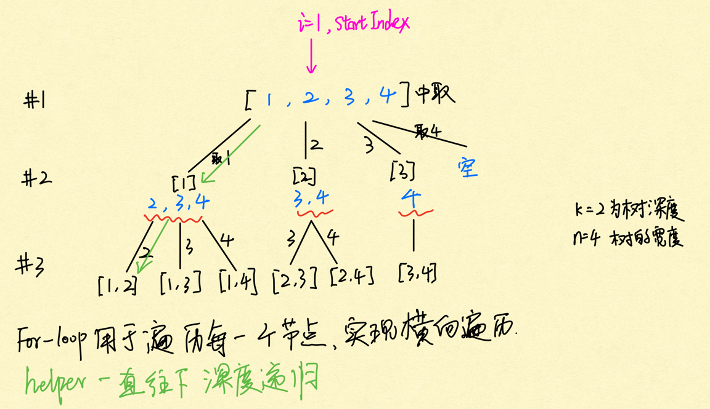

树中每一个节点都是for loop, for loop里面的起始位置从startIndex开始，for-loop用于给每一个节点的叉数遍历。

int型变量startIndex，这个参数用来记录本层递归的中，集合从哪里开始遍历（集合就是[1,...,n] ）

DFS是这样调用的： 先int i = startIndex = 1， 然后在这个forloop里面暂且不看for-loop的展开，我们先是i = 1的情况下不断调用递归不断深入。递归触底返回到第二层后，for-loop的i = startIndex变为2。 然后一直这样下去。

```java
class Solution {
     public List<List<Integer>> combine(int n, int k) {
        List<List<Integer>> result = new ArrayList<>();
        List<Integer> cur = new ArrayList<>();
        helper(n, k, 1, cur, result);//注意这里1开始是因为整数范围是1开始的
        return result;
    }
    private void helper(int n, int k, int startIndex,  List<Integer> cur, List<List<Integer>> result) {
        if (cur.size() == k) {
            result.add(new ArrayList<Integer>(cur));
            return;
        }
        for (int i = startIndex; i <= n; i++) { 
            cur.add(i);//从断点出来,remove后继续循环到这里,这个时候i的递增了.eg取3 
            helper(n, k, i + 1, cur, result); //传入startIndex = i + 1是告诉下一层的起始位置
            cur.remove(cur.size() - 1);
        }
    }
}
```

**剪枝优化：** 

n = 4，k = 4的话，那么第一层for循环的时候，从元素2开始的遍历都没有意义了。 在第二层for循环，从元素3开始的遍历都没有意义了。

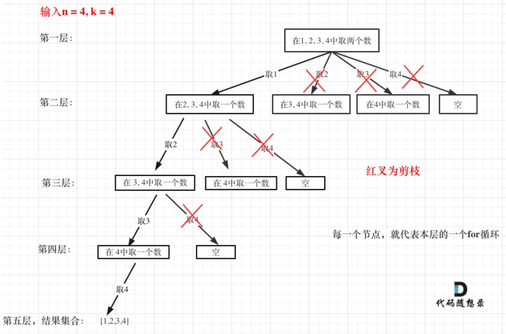

图中每一个**节点**（图中为矩形），**就代表本层的一个for循环**，那么每一层的for循环从第二个数开始遍历的话，都没有意义，都是无效遍历。**所以，可以剪枝的地方就在递归中每一层的for循环所选择的起始位置**。**如果for循环选择的起始位置之后的元素个数 已经不足 我们需要的元素个数了，那么就没有必要搜索了**。

接下来看一下优化过程如下：

1. 已经选择的元素个数：path.size();
2. 还需要的元素个数为: k - path.size();
3. 在集合n中至多要从该起始位置 : n - (k - path.size()) + 1，开始遍历

为什么有个+1呢，因为包括起始位置，我们要是一个左闭的集合。

优化之后的for循环是：

```
for (int i = startIndex; i <= n - (k - path.size()) + 1; i++) // i为本次搜索的起始位置
```

#### [216. 组合总和 III](https://leetcode-cn.com/problems/combination-sum-iii/)

> 找出所有相加之和为 ***n*** 的 k个数的组合。组合中只允许含有 1 - 9 的正整数，并且每种组合中不存在重复的数字。

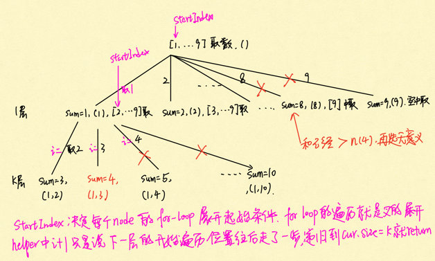

```java
class Solution {
    public List<List<Integer>> combinationSum3(int k, int n) {
        List<List<Integer>> result = new ArrayList<>();
        List<Integer> cur = new ArrayList<>();
        int sum = 0;
        helper(k, n, 1, sum, cur, result);
        return result;
    }
    private void helper(int k, int n,  int startIndex, int sum, List<Integer> cur, List<List<Integer>> result) {
         //剪枝
        if (sum > n) {
            return;
        }
        
        if (cur.size() == k) {
            if (sum == n) {
                result.add(new ArrayList<>(cur));
            }
            return; //sum不是n的情况 也要返回出去
        }
        for (int i = startIndex; i <= 9; i++) {
            sum += i;
            cur.add(i);
            helper(k, n, i + 1, sum, cur, result); // i + 1是下一层startIndex开始遍历的位置
            sum = sum - i;
            cur.remove(cur.size() - 1);
        }
    }
}
```

#### [17. 电话号码的字母组合](https://leetcode-cn.com/problems/letter-combinations-of-a-phone-number/)

>给定一个仅包含数字 2-9 的字符串，返回所有它能表示的字母组合。答案可以按 任意顺序 返回。
>
>给出数字到字母的映射如下（与电话按键相同）。注意 1 不对应任何字母。
>
>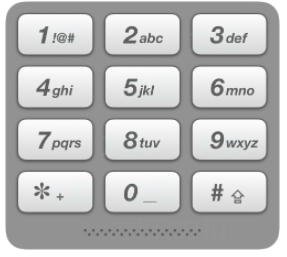
>
>```
>输入：digits = "23"
>输出：["ad","ae","af","bd","be","bf","cd","ce","cf"]
>```

下图中输入23，index用来指向[23]的位置, 记录遍历第几个数字了, 以及dfs的深度

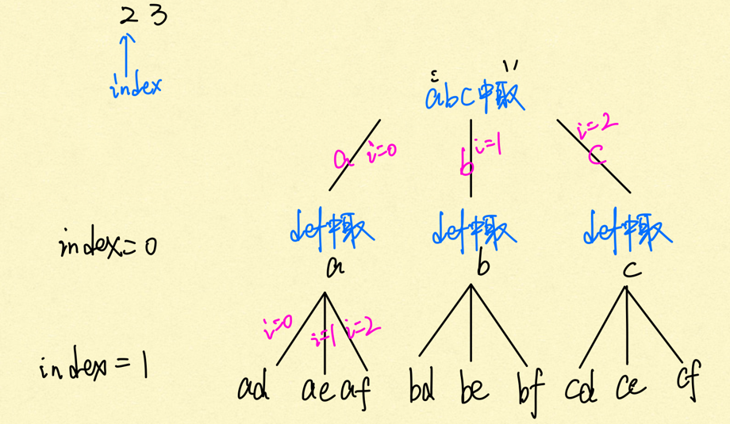

```java
class Solution {
        public List<String> letterCombinations(String digits) {
            List<String> result = new ArrayList<>();
            if (digits == null || digits.length() == 0) {
                return result;
            }
            String[] numString = {"", "", "abc", "def", "ghi", "jkl", "mno", "pqrs", "tuv", "wxyz"};
            StringBuilder sb = new StringBuilder();
            helper(sb, result, 0, numString, digits);
            return result;
        }
        private void helper(StringBuilder sb, List<String> result, int index,  String[] numString, String digits) {
            if (index == digits.length()) {
                result.add(sb.toString());
                return;
            }
            int digitNum = digits.charAt(index) - '0'; //先转换为数字的index
            String str = numString[digitNum];  //str 表示当前num对应的字符串
            for (int i = 0; i < str.length(); i++) {
                sb.append(str.charAt(i));
                helper(sb, result, index + 1, numString, digits);
                sb.deleteCharAt(sb.length() - 1);
            }
        }
    }
```


#### [39. 组合总和](https://leetcode-cn.com/problems/combination-sum/)

>给定一个**无重复元素**的数组 candidates 和一个目标数 target ，找出 candidates 中所有可以使数字和为 target 的组合。
>
>candidates 中的数字可以无限制重复被选取。
>
>```
>Input: candidates = [2,3,6,7], target = 7
>Output: [[2,2,3],[7]]
>Explanation:
>2 and 3 are candidates, and 2 + 2 + 3 = 7. Note that 2 can be used multiple times.
>7 is a candidate, and 7 = 7.
>These are the only two combinations.
>```

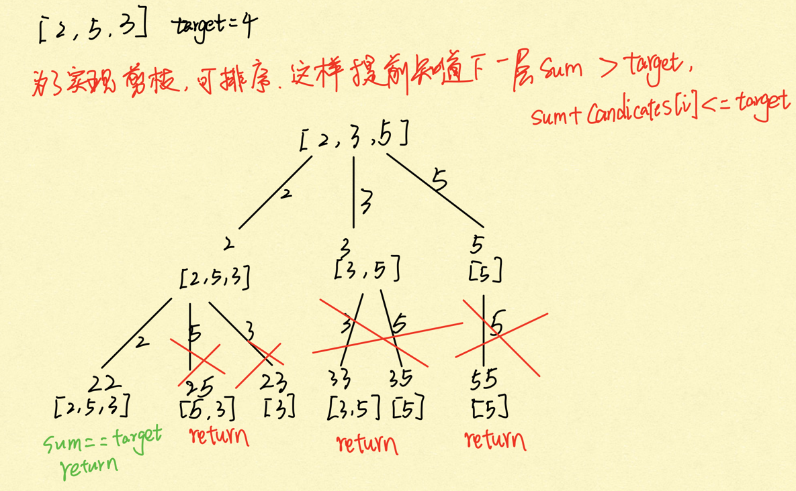

剪枝： 

**对总集合排序之后，如果下一层的sum（就是本层的 sum + candidates[i]）已经大于target，就可以结束本轮for循环的遍历**。

```java
class Solution {
    public List<List<Integer>> combinationSum(int[] candidates, int target) {
        List<List<Integer>> result = new ArrayList<>();
        List<Integer> cur = new ArrayList<>();
        int sum = 0;
        Arrays.sort(candidates); //排序可以剪枝
        helper(cur, result, candidates, 0, sum, target);
        return result;
    }
    private void helper(List<Integer> cur, List<List<Integer>> result, int[] candidates, int startIndex, int sum, int target) {

        if (sum == target) {
            result.add(new ArrayList<>(cur));
            return;
        }

        for (int i = startIndex; i < candidates.length && sum + candidates[i] <= target; i++) { //如果 sum + candidates[i] > target 就终止遍历
            cur.add(candidates[i]);
            sum += candidates[i];
            helper(cur, result, candidates, i, sum, target); //i就是下一层开始遍历的位置
            sum -= candidates[i];
            cur.remove(cur.size() - 1);
        }
    }
}
```

#### [40. 组合总和 II](https://leetcode-cn.com/problems/combination-sum-ii/)数组去重

>给定一个数组 candidates 和一个目标数 target ，找出 candidates 中所有可以使数字和为 target 的组合。
>
>candidates 中的**每个数字在每个组合中**只能使用一次。
>
>```
>输入: candidates = [10,1,2,7,6,1,5], target = 8,
>输出:
>[
>[1,1,6],
>[1,2,5],
>[1,7],
>[2,6]
>]
>```

相当于用DFS的时候考虑一下输出数组每个位置不能出现重复元素。

**要去重的是同一==树层==上的“使用过”，同一树枝上的都是一个组合里的元素，不用去重**

**树层去重的话，需要对数组排序！**

前面我们提到：要去重的是“同一树层上的使用过”，如果判断同一树层上元素（相同的元素）是否使用过了呢。

**如果`candidates[i] == candidates[i - 1]` 并且 `used[i - 1] == false`，就说明：前一个树枝，使用了candidates[i - 1]，也就是说同一树层使用过candidates[i - 1]**。

此时for循环里就应该做continue的操作。

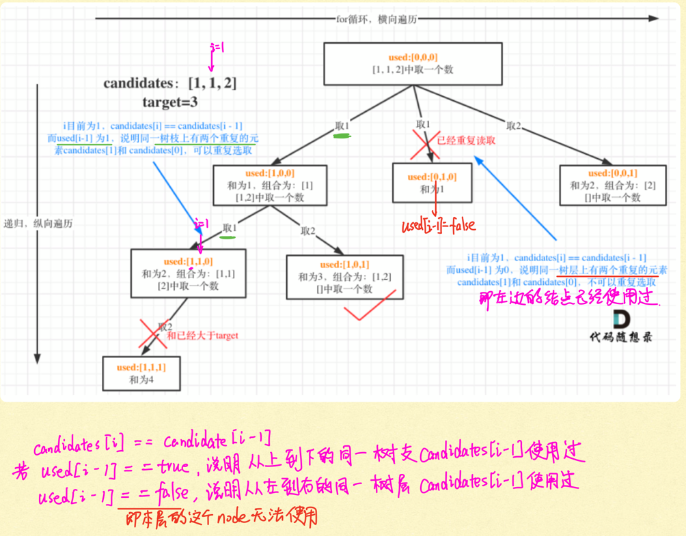

```java
used[i - 1] == false是因为used这个boolean数组维护的是直上直下路径使用过的值, 而每一层的每一个结点相当于是不同的boolean数组,所以说used[i- 1]==false的意思是,当前结点祖先没有用它但是我的隔壁结点用了它,我就不能用了.
class Solution {
    public List<List<Integer>> combinationSum2(int[] candidates, int target) {
        List<List<Integer>> result = new ArrayList<>();
        List<Integer> cur = new ArrayList<>();
        boolean[] flag = new boolean[candidates.length];
        // 首先把给candidates排序，让其相同的元素都挨在一起。
        Arrays.sort(candidates);
        helper(candidates, target, 0, cur, result, 0, flag);
        return result;
    }
    private void helper(int[] candidates, int target, int sum, List<Integer> cur, List<List<Integer>> result, int index, boolean[] flag) {
        if (sum == target) {
            result.add(new ArrayList<>(cur));
            return;
        }
        for (int i = index; i < candidates.length && candidates[i] + sum <= target; i++) {
            // used[i - 1] == true，说明同一树支candidates[i - 1]使用过
            // used[i - 1] == false，说明同一树层candidates[i - 1]使用过
            if (i > 0 && candidates[i] == candidates[i - 1] && flag[i - 1] == false) {
                continue;// 要对同一树层使用过的元素进行跳过
            }
            flag[i] = true;
            sum += candidates[i];
            cur.add(candidates[i]);
            helper(candidates, target, sum, cur, result, i + 1, flag);//这里是i+1，每个数字在每个组合中只能使用一次
            sum -= candidates[i];
            flag[i] = false;
            cur.remove(cur.size() - 1);
        }
    }
}
```

#### [131. 分割回文串](https://leetcode-cn.com/problems/palindrome-partitioning/)

>给你一个字符串 `s`，请你将 `s` 分割成一些子串，使每个子串都是 **回文串** 。返回 `s` 所有可能的分割方案。
>
>```
>输入：s = "aab"
>输出：[["a","a","b"],["aa","b"]]
>```

- 组合问题：选取一个a之后，在bcdef中再去选取第二个，选取b之后在cdef中在选组第三个.....。
- 切割问题：切割一个a之后，在bcdef中再去切割第二段，切割b之后在cdef中在切割第三段.....。

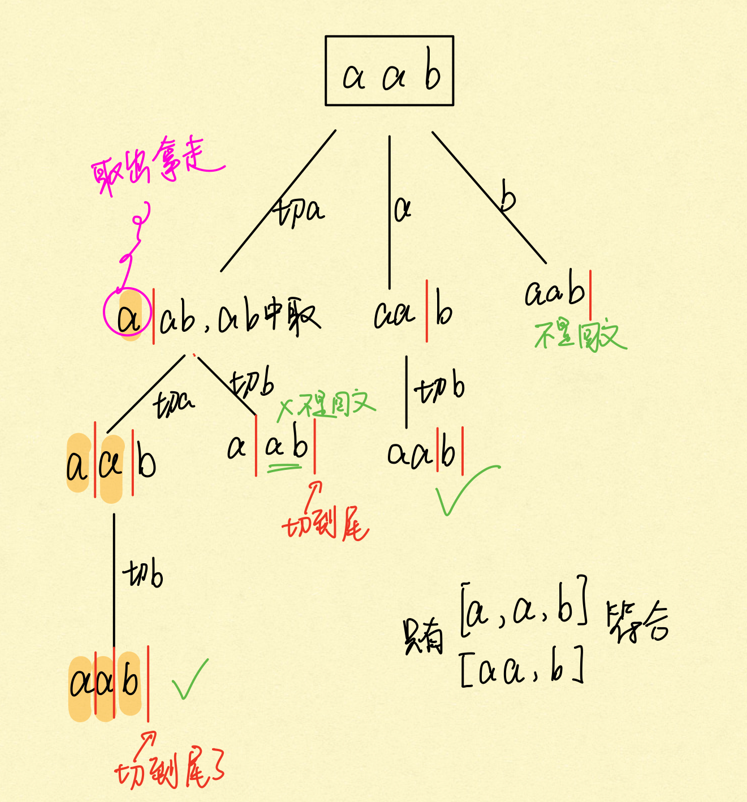

```java
class Solution {
    public List<List<String>> partition(String s) {
        List<List<String>> result = new ArrayList<>();
        List<String> cur = new ArrayList<>();
        helper(result, cur, s,0);
        return result;
    }
    private void helper(List<List<String>> result, List<String> cur, String s, int startIndex) {
        if (startIndex >= s.length()) {
            result.add(new ArrayList<>(cur));
            return;
        }
        for(int i = startIndex; i < s.length(); i++) {
            //如果是回文子串，则记录
            if (isPalindrome(s, startIndex, i)) {
                String str = s.substring(startIndex, i + 1); //[0, i + 1)
                cur.add(str);
            } else {
                continue;
            }
            helper(result, cur, s, i + 1);
            cur.remove(cur.size() - 1);
        }
    }
    private boolean isPalindrome(String s, int start, int end) {
        for(int i = start, j = end; i < j; i++, j--) {
            if (s.charAt(i) != s.charAt(j)) {
                return false;
            }
        }
        return true;
    }
}
```

#### [93. 复原 IP 地址](https://leetcode-cn.com/problems/restore-ip-addresses/)

>给定一个只包含数字的字符串，用以表示一个 IP 地址，返回所有可能从 s 获得的 有效 IP 地址 。你可以按任何顺序返回答案。
>
>有效 IP 地址 正好由四个整数（每个整数位于 0 到 255 之间组成，且不能含有前导 0），整数之间用 '.' 分隔。
>
>例如："0.1.2.201" 和 "192.168.1.1" 是 有效 IP 地址，但是 "0.011.255.245"、"192.168.1.312" 和 "192.168@1.1" 是 无效 IP 地址。
>
>```
>输入：s = "25525511135"
>输出：["255.255.11.135","255.255.111.35"]
>----
>输入：s = "0000"
>输出：["0.0.0.0"]
>-----
>输入：s = "101023"
>输出：["1.0.10.23","1.0.102.3","10.1.0.23","10.10.2.3","101.0.2.3"]
>```

pointNum表示逗点数量，pointNum为3说明字符串分成了4段了。

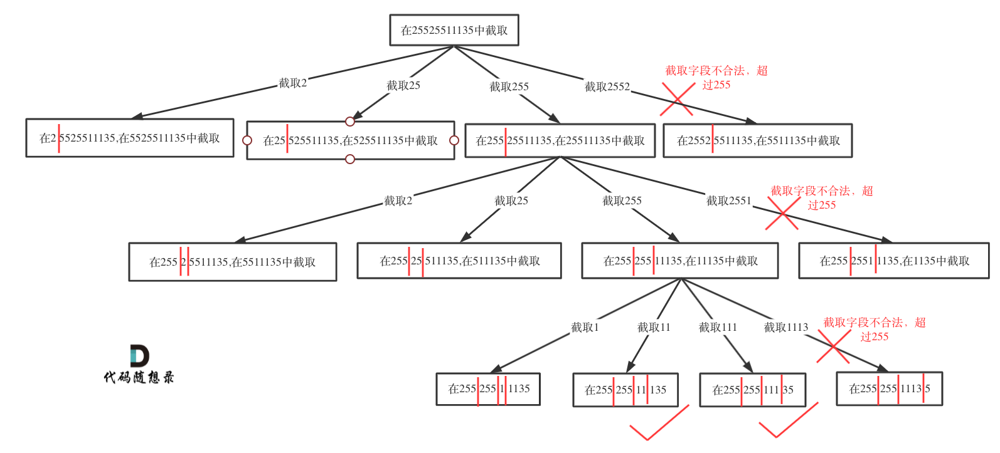

```java
public class RestoreIpAddresses{
    public static void main(String[] args) {
        Solution solution = new RestoreIpAddresses().new Solution();
    }
        //leetcode submit region begin(Prohibit modification and deletion)
class Solution {
    public List<String> restoreIpAddresses(String s) {
        List<String> result = new ArrayList<>();
        helper(s, result, 0, 0);
        return result;
    }
    private void helper(String s, List<String> result, int pointNum, int startIndex) {
        if (pointNum == 3) {
            if (isValid(s, startIndex, s.length() - 1)) { //判断逗点后最后一组数字是否符合要求
                result.add(s);
            }
            return;
        }
        for (int i = startIndex; i < s.length(); i++) {
            if(isValid(s, startIndex, i)) {
                s = s.substring(0, i + 1) + "." + s.substring(i + 1); // 在s的中插⼊⼀个逗点
                pointNum++;
                helper(s, result, pointNum, i + 2);
                pointNum--;
                s = s.substring(0, i + 1) + s.substring(i + 2);
            } else {
                break;
            }
        }
    }
    // 判断字符串s在左闭右闭区间[start, end]所组成的数字是否合法
    private boolean isValid(String s, int start, int end) {
        if (start > end) {
            return false;
        }
        // 0开头的数字不合法 start == end表示只有一个数字那就是0
        if (s.charAt(start) == '0' && start != end) {
            return false;
        }
        int num = 0;
        for(int i = start; i <= end; i++) {
           if (s.charAt(i) > '9' || s.charAt(i) < '0') {
               return false;
           }
           num = num * 10 + (s.charAt(i) - '0');
           if (num > 255) {
               return false;
           }
        }
        return true;
    }
}
```

#### [78. 子集](https://leetcode-cn.com/problems/subsets/)

>给你一个整数数组 `nums` ，数组中的元素 **互不相同** 。返回该数组所有可能的子集（幂集）。
>
>解集 **不能** 包含重复的子集。你可以按 **任意顺序** 返回解集。
>
>```
>输入：nums = [1,2,3]
>输出：[[],[1],[2],[1,2],[3],[1,3],[2,3],[1,2,3]]
>```

```java
class Solution { //按照我以前的写法
    public List<List<Integer>> subsets(int[] nums) {
        List<List<Integer>> result = new ArrayList<>();
        List<Integer> cur = new ArrayList<>();
        helper(result, cur, 0, nums);
        return result;
    }
    private void helper(List<List<Integer>> result, List<Integer> cur, int index, int[] nums) {
        if (index == nums.length) {
            result.add(new ArrayList<>(cur));
            return;
        }
        cur.add(nums[index]); 
        helper(result, cur, index + 1, nums);
        cur.remove(cur.size() - 1);
        helper(result, cur, index + 1, nums); //一定要记得写上 不加的时候
    }
}
```

**子集是收集树形结构中树的所有节点的结果**。**而组合问题、分割问题是收集树形结构中叶子节点的结果**。

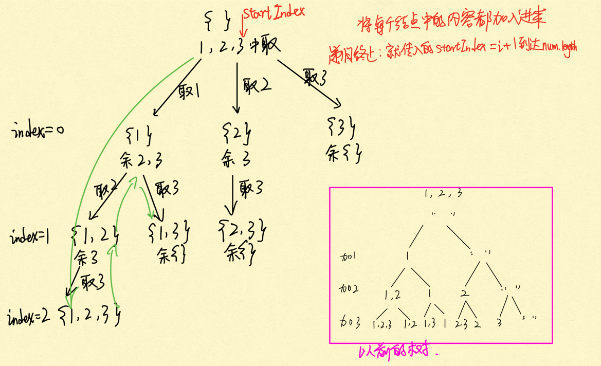

```java
        class Solution {
            public List<List<Integer>> subsets(int[] nums) {
                List<List<Integer>> result = new ArrayList<>();
                List<Integer> cur = new ArrayList<>();
                if (nums.length == 0) {
                    result.add(new ArrayList<>(cur));
                    return result;
                }
                helper(cur, result, nums, 0);
                return result;
            }
            private void helper(List<Integer> cur, List<List<Integer>> result, int[] nums, int index) {
                result.add(new ArrayList<>(cur)); //一进入函数就开始加入空集
                //「遍历这个树的时候，把所有节点都记录下来，就是要求的子集集合」。
                if (index >= nums.length) {//终止条件可不加
                    return;
                }
                for (int i = index; i < nums.length; i++) {
                    cur.add(nums[i]);
                    helper(cur, result, nums, i + 1);// i + 1 加入下一个不重复元素
                    cur.remove(cur.size() - 1);
                }
            }
        }
```

如果是一个集合来求组合的话，就需要startIndex，例如：[回溯算法：求组合问题！](https://mp.weixin.qq.com/s/OnBjbLzuipWz_u4QfmgcqQ)，[回溯算法：求组合总和！](https://mp.weixin.qq.com/s/HX7WW6ixbFZJASkRnCTC3w)。

如果是多个集合取组合，各个集合之间相互不影响，那么就不用startIndex，例如：[回溯算法：电话号码的字母组合](https://mp.weixin.qq.com/s/e2ua2cmkE_vpYjM3j6HY0A)

#### [90. 子集 II](https://leetcode-cn.com/problems/subsets-ii/)

>给你一个整数数组 nums ，其中可能包含重复元素，请你返回该数组所有可能的子集（幂集）。
>
>解集 不能 包含重复的子集。返回的解集中，子集可以按 任意顺序 排列。
>
>```
>输入：nums = [1,2,2]
>输出：[[],[1],[1,2],[1,2,2],[2],[2,2]]
>```

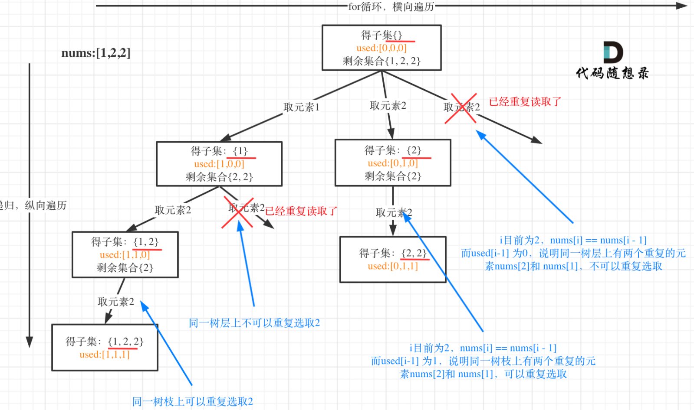


```java
class Solution {
    public List<List<Integer>> subsetsWithDup(int[] nums) {
        List<List<Integer>> result = new ArrayList<>();
        List<Integer> cur = new ArrayList<>();
        boolean[] used = new boolean[nums.length];
        Arrays.sort(nums); //一定要记得
        if (nums.length == 0) {
            return result;
        }
        helper(result, cur, used, nums, 0);
        return result;
    }
    private void helper(List<List<Integer>> result, List<Integer> cur, boolean[] used, int[] nums, int index) {
        result.add(new ArrayList<>(cur));
        if (index >= nums.length) {
            return;
        }
        for (int i = index; i < nums.length; i++) {
            if (i > 0 && nums[i] == nums[i - 1] && used[i - 1] == false) {
                continue;
            }
            used[i] = true;
            cur.add(nums[i]);
            helper(result, cur, used, nums, i + 1);
            used[i] = false;
            cur.remove(cur.size() - 1);
        }
    }
}
```

#### [491. 递增子序列](https://leetcode-cn.com/problems/increasing-subsequences/)set没有remove的原因

>给定一个整型数组, 你的任务是找到所有该数组的**递增子序列**，递增子序列的长度至少是 2 
>
>输入：[4, 6, 7, 7]
>输出：[[4, 6], [4, 7], [4, 6, 7], [4, 6, 7, 7], [6, 7], [6, 7, 7], [7,7], [4,7,7]]

注意不能排序再找！！！ 

类似求子集问题，也是要遍历树形结构找每一个节点，所以和[回溯算法：求子集问题！](https://mp.weixin.qq.com/s/NNRzX-vJ_pjK4qxohd_LtA)一样，可以不加终止条件，startIndex每次都会加1，并不会无限递归。

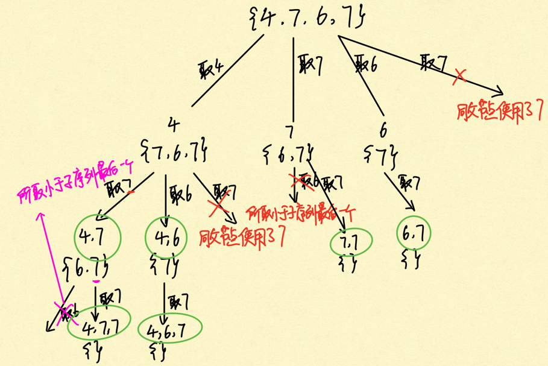

```java
class Solution {
    public List<List<Integer>> findSubsequences(int[] nums) {
        List<List<Integer>> result = new ArrayList<>();
        List<Integer> cur = new ArrayList<>();
        helper(cur, result, nums, 0);
        return result;
    }
    private void helper(List<Integer> cur, List<List<Integer>> result, int[] nums, int index) {
        if (cur.size() > 1) {
            result.add(new ArrayList<>(cur)); // 注意这里不要加return，因为要取树上的所有节点size()为2以上的节点
        }
        Set<Integer> set = new HashSet<>();
        for(int i = index; i < nums.length; i++) {
            if(!cur.isEmpty() && nums[i] < cur.get(cur.size() - 1) || set.contains(nums[i])) {
                continue;
            }
            cur.add(nums[i]);
            set.add(nums[i]);
            helper(cur, result, nums, i + 1);
            cur.remove(cur.size() - 1);
            //set没有remove的原因，set只记录本层元素是否重复使用，新的一层set都会重新定义（清空），所以要知道set只负责for loop本层！而每一层都会有一个set
        }
    }
}
```

#### [46. 全排列](https://leetcode-cn.com/problems/permutations/)

> 给定一个不含重复数字的数组 `nums` ，返回其 **所有可能的全排列** 。你可以 **按任意顺序** 返回答案。
>
> ```
> 输入：nums = [1,2,3]
> 输出：[[1,2,3],[1,3,2],[2,1,3],[2,3,1],[3,1,2],[3,2,1]]
> ```

我的方法

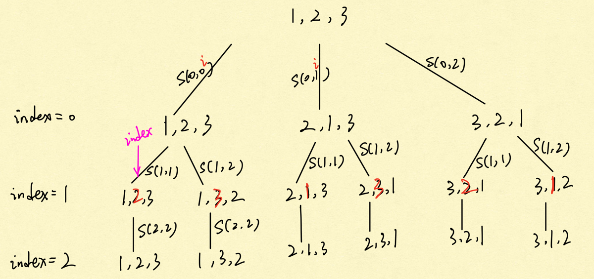

```java
class Solution {
    public List<List<Integer>> permute(int[] nums) {
        List<List<Integer>> result = new ArrayList<>();
        helper(result, nums, 0);
        return result;
    }
    private void helper(List<List<Integer>> result, int[] nums, int index) {
        if (index == nums.length) {
            List<Integer> al = new ArrayList<>();
            for (int i = 0; i < nums.length; i++) {
                al.add(nums[i]);
            }
            result.add(al);
            return;
        }
        for (int i = index; i < nums.length; i++) {
            swap(nums, index, i);
            helper(result, nums, index + 1);
            swap(nums, index, i);
        }
    }
    private void swap(int[] array, int left, int right) {
        int tmp = array[left];
        array[left] = array[right];
        array[right] = tmp;
    }
}
```

方法二： 

当收集元素的数组path的大小达到和nums数组一样大的时候，说明找到了一个全排列，也表示到达了叶子节点。

**而used数组，其实就是记录此时path里都有哪些元素使用了，一个排列里一个元素只能使用一次**。

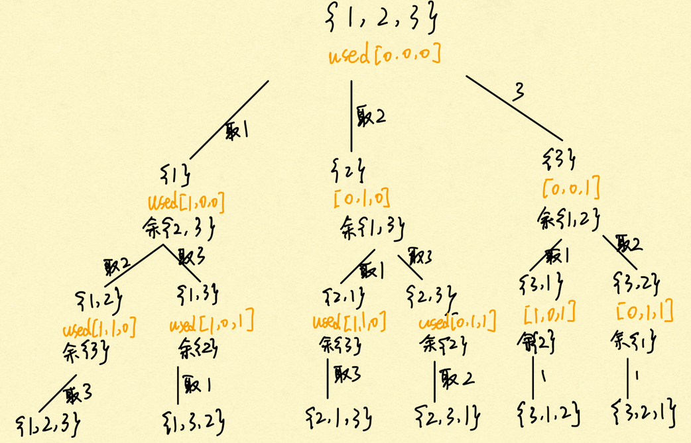

```java
class Solution {
    public List<List<Integer>> permute(int[] nums) {
        List<List<Integer>> result = new ArrayList<>();
        List<Integer> cur = new ArrayList<>();
        boolean[] used = new boolean[nums.length];
        if (nums.length == 0) {
            return result;
        }
        helper(cur, result, used, nums);
        return result;
    }
    private void helper(List<Integer> cur, List<List<Integer>> result, boolean[] used, int[] nums) {
        if (cur.size() == nums.length) {
            result.add(new ArrayList<>(cur));
            return;
        }
        for (int i = 0; i < nums.length; i++) {
            if (used[i]) {
                continue;
            }
            used[i] = true;
            cur.add(nums[i]);
            helper(cur, result, used, nums);
            cur.remove(cur.size() - 1);
            used[i] = false;
        }
    }

}
```

#### [47. 全排列 II](https://leetcode-cn.com/problems/permutations-ii/)

>给定一个可包含重复数字的序列 `nums` ，**按任意顺序** 返回所有不重复的全排列。
>
>```
>输入：nums = [1,1,2]
>输出：
>[[1,1,2],
> [1,2,1],
> [2,1,1]]
>```

**还要强调的是去重一定要对元素经行排序，这样我们才方便通过相邻的节点来判断是否重复使用了**。

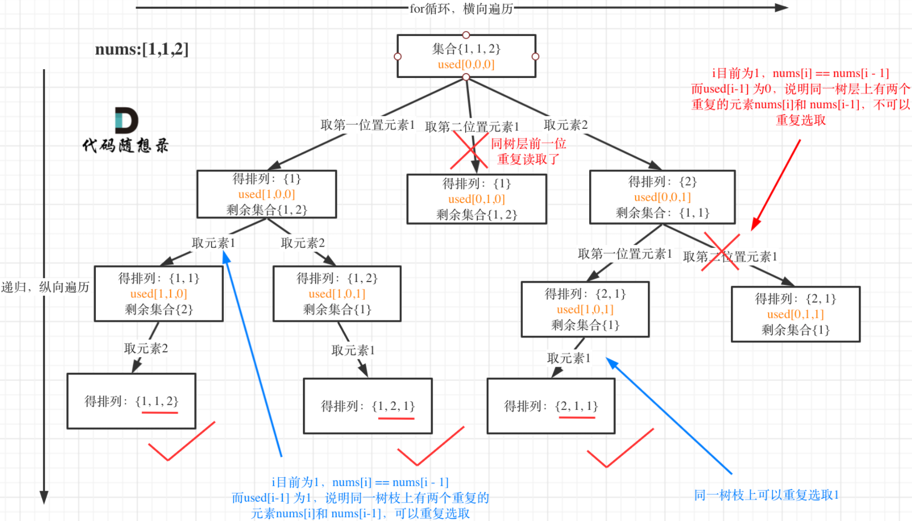

```java
class Solution {
    List<List<Integer>> result = new ArrayList<>();
    List<Integer> path = new ArrayList<>();
    public List<List<Integer>> permuteUnique(int[] nums) {
        boolean[] used = new boolean[nums.length];
        //Arrays.fill(used, false);
        Arrays.sort(nums);
        helper(nums, used);
        return result;
    }
    private void helper(int[] nums, boolean[] used) {
        if (path.size() == nums.length) {
            result.add(new ArrayList<>(path));
            return;
        }
        for (int i = 0; i < nums.length; i++) {
            if (i > 0 && nums[i] == nums[i - 1] && used[i - 1] == false) { //树层去重经典
                continue;
            }
            if (used[i] == false) {
                used[i] = true;
                path.add(nums[i]);
                helper(nums, used);
                path.remove(path.size() - 1);
                used[i] = false;
            }
        }
    }
}
```

#### [332. 重新安排行程](https://leetcode-cn.com/problems/reconstruct-itinerary/) 不是经典待解决

>给你一份航线列表 tickets ，其中 tickets[i] = [fromi, toi] 表示飞机出发和降落的机场地点。请你对该行程进行重新规划排序。
>
>所有这些机票都属于一个从 JFK（肯尼迪国际机场）出发的先生，所以该行程必须从 JFK 开始。如果存在多种有效的行程，请你按==字典==排序返回==最小==的行程组合。
>
>例如，行程 ["JFK", "LGA"] 与 ["JFK", "LGB"] 相比就更小，排序更靠前。
>假定所有机票至少存在一种合理的行程。且所有的机票 ==必须==都用一次 且 只能用一次。
>
>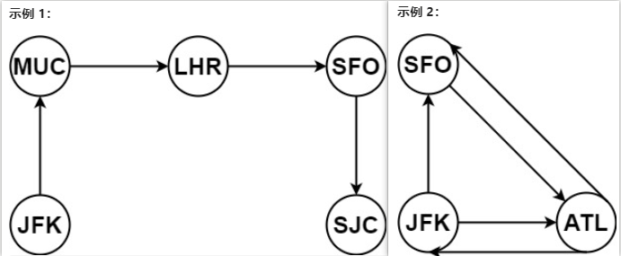
>
>```
>输入：tickets = [["MUC","LHR"],["JFK","MUC"],["SFO","SJC"],["LHR","SFO"]]
>输出：["JFK","MUC","LHR","SFO","SJC"]
>---
>输入：tickets = [["JFK","SFO"],["JFK","ATL"],["SFO","ATL"],["ATL","JFK"],["ATL","SFO"]]
>输出：["JFK","ATL","JFK","SFO","ATL","SFO"]
>解释：另一种有效的行程是 ["JFK","SFO","ATL","JFK","ATL","SFO"] ，但是它字典排序更大更靠后。
>```

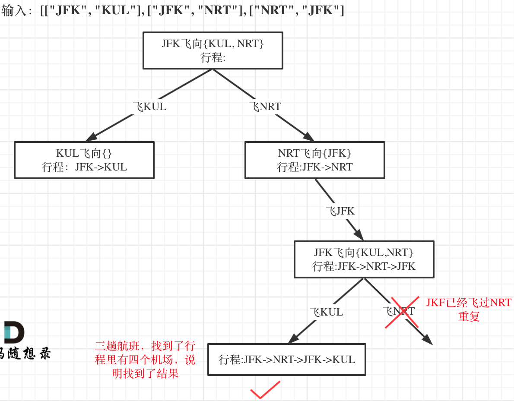

如果“航班次数”大于零，说明目的地还可以飞，如果如果“航班次数”等于零说明目的地不能飞了，而不用对集合做删除元素或者增加元素的操作。

**相当于说我不删，我就做一个标记！**

**注意函数返回值我用的是bool！**

因为我们只需要找到==一个==行程，就是在树形结构中==唯一的一条==通向叶子节点的路线，

- 递归终止条件

这是有4个航班，那么只要找出一种行程，行程里的机场个数是5就可以了。

```
if (result.size() == ticketNum + 1) {
    return true;
}
```

