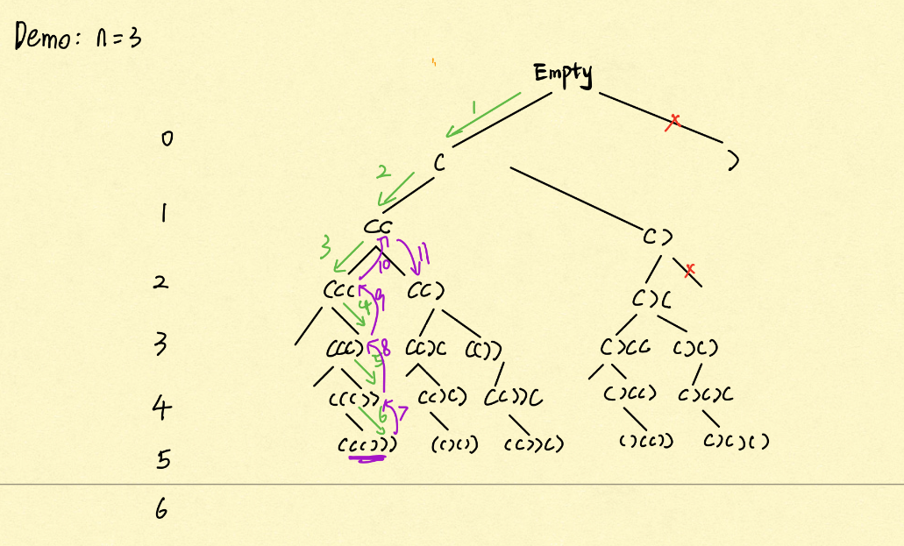

# 7 Graph Search II : DFS
https://juejin.cn/post/6844904088618942478

`DFS`深度优先，解题必须画出recursion tree

递归回去一定回去到==断点==的下一行,beaking point先回到头，一直回头，然后到了base case才return到调用者此时breaking point的下一行。

**解决基本问题：**

1. 一共多少层？   决定basecase
2. 每层叉出几个node?  决定调用几次DFS 
## All Subsets I
> Given a set of characters represented by a String, return a list
> containing all subsets of the characters.
>
> Assumptions
>
> There are no duplicate characters in the original set. Examples
>
> Set = "abc", all the subsets are [“”, “a”, “ab”, “abc”, “ac”, “b”,
> “bc”, “c”] Set = "", all the subsets are [""] Set = null, all the
> subsets are []
>
>  1. 一共2层   决定basecase
2. 每层叉出2node 加a不加a
**Basecase:** 就是走到最后一层了，记得要return。
**Recursion rule:**分成两部分 case1加 case2 不加
时间复杂度：红色是O(1), System.out.println(solutionPrefix)绿色是O(n)。时间总和：
1 + 2 + 4…+ 2^n（倒数第二层）+ 2^n *n(最后一层) = (2^n)*n
每一层都是组合节点(2^n个node)   最后(2^n个node)节点,每个node花费O(n)
每一个node是O（1），直上直下空间是O(n). 


```java
public class Solution {
  public List<String> subSets(String set) {
    List<String> result = new ArrayList<>();
    if (set == null) {
      return result;
    }
    StringBuilder sb = new StringBuilder();
    char[] arraySet = set.toCharArray();
    helper(sb, arraySet, 0, result);
    return result;
  }
  private void helper(StringBuilder sb, char[] set, int index, List<String> result) {
    if (index == set.length) {
      result.add(sb.toString()); //base case 
      return;
    }
    sb.append(set[index]); //一直吃到底 粉色路径123
    helper(sb, set, index + 1, result); // 递归触底 加入abc beaking point
    sb.deleteCharAt(sb.length() - 1); // 粉色路径4 吐出
    helper(sb, set, index + 1, result); //粉色路径5 
   
  }
}
```

## All Valid Permutations Of Parentheses I

> Given N pairs of parentheses “()”, return a list with all the valid
> permutations.
>
> Assumptions
>
> N > 0 Examples
>
> N = 1, all valid permutations are ["()"] N = 3, all valid permutations
> are ["((()))", "(()())", "(())()", "()(())", "()()()"]


1.  N = 3  6个位置 树有6层，每一层代表一个位置 
2. 每个node加左或者右边括号 
**限制条件：**每次加右括号的时候，确保左括号的数量一定要大于右括号

每个node岔出来两个岔，2^(2n), 2n层. 1 + 2 + 4 + 8 + --- + $2^{2n}$
Time = O(2 ^ (2n) *n) Space = O(n)
先是一吃到底然后吐完右边括号接着吐左边括号

走到第6步之后，11行代码返回到37行，37 breaking point 行就是之前的调用者，会执行38行delete, 然后37行，然后38行。

```java
public class Solution {
    public static void main(String[] args) {
        int n = 3;
        Solution sol = new Solution();
        System.out.println(sol.validParentheses(n));
    }
    //debug latter
    public List<String> validParentheses(int n) {
        List<String> result = new ArrayList<>();
        StringBuilder sb = new StringBuilder();
        helper(n, 0, 0, sb, result);
        return result;
    }

    /**
     *
     * @param n ()对的个数
     * @param l 添加的左括号so far
     * @param r 添加的右括号so far
     * @param sb 方框里的括号so far
     * @param result
     */
    private void helper(int n, int l, int r, StringBuilder sb, List<String> result) {
        if (l == n && r == n) {
            result.add(sb.toString());
            return;
        }
        //case 1: add "(" on this level 左边添加完
        if (l < n) {
            sb.append('(');
            helper(n, l + 1, r, sb, result);
            sb.deleteCharAt(sb.length() - 1);
        }
        //case 2: add ")" on this level 左边比右边多的时候才加右括号
        if (l > r) {
            sb.append(')');
            helper(n, l, r + 1, sb, result);
            sb.deleteCharAt(sb.length() - 1);
        }
    }
}
```

## Combinations Of Coins 99 cents

> Given a number of different denominations of coins (e.g., 1 cent, 5
> cents, 10 cents, 25 cents), get all the possible ways to pay a target
> number of cents. coins - an array of positive integers representing
> the different denominations of coins, there are no duplicate numbers
> and the numbers are sorted by descending order, eg. {25, 10, 5, 2, 1}
> target - a non-negative integer representing the target number of
> cents, eg. 99
> **Assumptions** coins is not null and is not empty, all the numbers in coins are positive target >= 0 You have infinite number of coins for
> each of the denominations, you can pick any number of the coins.
> **Return** a list of ways of combinations of coins to sum up to be target. each way of combinations is represented by list of integer,
> the number at each index means the number of coins used for the
> denomination at corresponding index.
> **Examples**
>
> coins = {2, 1}, target = 4, the return should be [   [0, 4],   (4
> cents can be conducted by 0 * 2 cents + 4 * 1 cents)
>
> [1, 2],   (4 cents can be conducted by 1 * 2 cents + 2 * 1 cents)
>
> [2, 0]    (4 cents can be conducted by 2 * 2 cents + 0 * 1 cents) ]
1. 4 层 每一层一种币种
2. 每个node顶多叉出99个叉 
3. 叉数是dynamic变化的情况，写一个for循环遍历


```java
public class CombinationsOfCoins {
    public static void main(String[] args) {
        int target = 29;
        int[] coins = {10, 5, 1};
        CombinationsOfCoins sol = new CombinationsOfCoins();
        System.out.println(sol.combinations(target, coins));
    }
    public List<List<Integer>> combinations(int target, int[] coins) {
        //each combination is represented as a List<Integer> cur,
        //and cur.get(i) = the number of coins of coins[i]
        //all the combinations are stored in the result as list of List<Integer>
        List<List<Integer>> result = new ArrayList<List<Integer>>();
        List<Integer> cur = new ArrayList<Integer>();
        helper(target, coins, 0, cur, result);
        return result;
    }
    //target: remaining cents we need to complete 剩下需要凑的
    //coins: all the possible different coins
    //index: we want to see how many coins we need for coins[index]
    private void helper(int target, int[] coins, int index, List<Integer> cur, List<List<Integer>> result) {
        //terminate condition:
        //notice: this can also be done at index = = coins.length where all the coins have been picked
        //but a probaly better one is at a previous level to reduce the number of unnecessary branches in the DFS
        //coins.length - 1 represents the last coin we can use and actually what we can do at this level is to
        //get target/coins[coins.length - 1] coins if possible.
        if (index == coins.length - 1) { //所有的硬币都遍历到了 直接用最后的1分钱来凑
            if (target % coins[coins.length - 1] == 0) {
                cur.add(target / coins[coins.length - 1]); //最后的1分钱个数
                result.add(new ArrayList<Integer>(cur));
                cur.remove(cur.size() - 1);//到底后反弹上一层需要移除 29 * 1
            }
            return;
        }
        //for coins[index], we can pick 0,1,2,.., target / coins[index] coins.
        int max = target / coins[index];//算出来的分叉数量
        for (int i = 0; i <= max; i++) { // i表示取几个10 cents， 比如i = 1, 表示取一个10 cents
            cur.add(i);
            //remember to modify the remaining cents for the next level
            helper(target - i*coins[index], coins, index + 1, cur, result);
            cur.remove(cur.size() - 1); //需要再往上跳一步，因为base case提前了，图中的第5步
        }
    }
}
```


## All Permutations I

>
>
>Given a string with <u>no duplicate</u> characters, return a list with all permutations of the characters.
>
>Assume that input string is not null.
>
>**Examples**
>
>Set = “abc”, all permutations are [“abc”, “acb”, “bac”, “bca”, “cab”, “cba”]
>
>Set = "", all permutations are [""]


1. 3 层，每层代表一个位置
2. 和硬币一样，最多叉出三个叉，每个位置表示放a/b/c（还有哪些字母没有用可以放入）

Inplace 来做


蓝色是上一层已经搞好的，红色就是这一层换过来的

i一定要从index开始循环，[0, index)为已经交换好的，[index, array.length - 1]处的元素正在发生交换

3！时间复杂度= O（n!*n）

```java
public class AllPermutationsI {
    public static void main(String[] args) {
        String input = "abc";
        AllPermutationsI sol = new AllPermutationsI();
        System.out.println(sol.permutations(input));

    }

    public List<String> permutations(String input) {
        List<String> result = new ArrayList<String>();
        if (input == null) {
            return result;
        }
        char[] array = input.toCharArray();
        helper(array, 0, result);
        return result;
    }

    private void helper(char[] array, int index, List<String> result) {
        if (index == array.length) {//所有位置都已经选过了base case
            result.add(new String(array));
            return;
        }
        for (int i = index; i < array.length; i++) { //包括index在内的之后是需要交换的
            swap(array, index, i); //吃
            helper(array, index + 1, result);//breaking point. 
            swap(array, index, i); //吐
        }
    }

    private void swap(char[] array, int left, int right) {
        char tmp = array[left];
        array[left] = array[right];
        array[right] = tmp;
    }
}
```

25行代码一直往下吃，然后吃到abc之后，22行代码==返回==到breaking point即26行代码，然后继续执行27行，27行执行完一次swap，然后接着再一次进入循环，25行执行swap。


