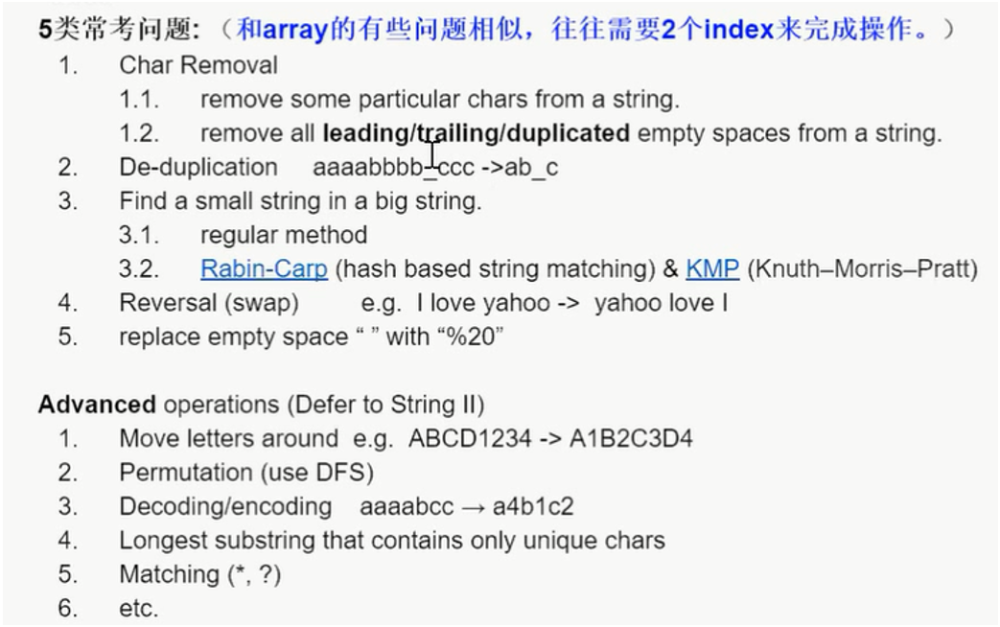
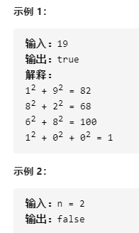
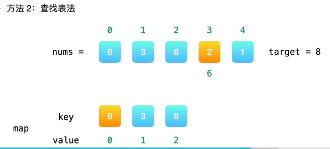

# HashTable and String I 8/23



##  [Top K Frequent Words](https://app.laicode.io/app/problem/67?plan=3)

>    Given a composition with different kinds of words, return a list of the top K most frequent words in the composition.
>
> **Assumptions**
>
> - the composition is not null and is not guaranteed to be sorted
> - K >= 1 and K could be larger than the number of distinct words in the composition, in this case, just return all the distinct words
>
> **Return**
>
> - a list of words ordered from most frequent one to least frequent one (the list could be of size K or smaller than K)
>
> **Examples**
>
> - Composition = ["a", "a", "b", "b", "b", "b", "c", "c", "c", "d"], top 2 frequent words are [“b”, “c”]
> - Composition = ["a", "a", "b", "b", "b", "b", "c", "c", "c", "d"], top 4 frequent words are [“b”, “c”, "a", "d"]
> - Composition = ["a", "a", "b", "b", "b", "b", "c", "c", "c", "d"], top 5 frequent words are [“b”, “c”, "a", "d"]
>
> 按顺序返回top k个元素

==思路==：

1. Map<String, Integer> freqMap, 存放String出现的频率，写一个求频率的代码

2. 创建minHeap, 里面存放类型Map.Entry<String, Integer>

3. 遍历然后将大的值放入到minHeap当中

4. minHeap取出元素倒序存入结果string[]

5. **时间复杂度**，假设有m个单词，每一个但是都会做一个put 和 get.

   Step1的时间O(m) in average O(m^2) in worst case. 

   ​            Space: O(m)

   Step2: Extra space: O（k）

   Time = O(k*logk) + (n-k)*logk = O(n*logk)  <要做K次的insert>

```java
public class TopKFrequentWords {
    public String[] topKFrequent(String[] combo, int k) {
        if (combo.length == 0 || k == 0) {
            return new String[0];
        }
        Map<String, Integer> freqMap = getFreMap(combo);
        PriorityQueue<Map.Entry<String, Integer>> minHeap = new PriorityQueue<>(k, new Comparator<Map.Entry<String, Integer>>() {
           @Override
           public int compare(Map.Entry<String, Integer> e1, Map.Entry<String, Integer> e2) {
               return e1.getValue().compareTo(e2.getValue());
           }
        });
        for (Map.Entry<String, Integer> entry : freqMap.entrySet()) {
            if (minHeap.size() < k) {
                minHeap.offer(entry);
            } else if (entry.getValue() > minHeap.peek().getValue()) {
                minHeap.poll();
                minHeap.offer(entry);
            }
        }
        return freqArray(minHeap);
    }
    private Map<String, Integer> getFreMap(String[] combo) {
        Map<String, Integer> freqMap = new HashMap();
        for (String s : combo) {
            Integer freq = freqMap.get(s);
            if (freq == null) {
                freqMap.put(s, 1);
            } else {
                freqMap.put(s, freq + 1);
            }
        }
        return freqMap;
    }
    private String[] freqArray(PriorityQueue<Map.Entry<String, Integer>> minHeap) {
        String[] result = new String[minHeap.size()];
        for (int i = minHeap.size() - 1; i >= 0; i--) {
            result[i] = minHeap.poll().getKey();
        }
        return result;
    }
}
```


## [Missing Number I](https://app.laicode.io/app/problem/68?plan=3)

>Given an integer array of size N - 1, containing all the numbers from 1 to N except one, find the missing number.
>
>**Assumptions**
>
>- The given array is not null, and N >= 1
>
>**Examples**
>
>- A = {2, 1, 4}, the missing number is 3
>- A = {1, 2, 3}, the missing number is 4 找不到的时候返回末尾
>- A = {}, the missing number is 1
>
>

==思路==

- 使用HashSet存放所有的值
- 从大到小遍历set
- space = O（n） 开了hashset, time = O(n) 每个元素要放入

```java
public class Solution {
  public int missing(int[] array) {
    // Write your solution here
    int n = array.length + 1;
    Set<Integer> set = new HashSet<>();
    for (int num : array) {
      set.add(num);
    }
    for (int i = 1; i < n; i++) {
      if (!set.contains(i)) {
        return i;
      }
    }
    return n;
  }
}

```

- 整体求targetSum和，long类型防止溢出
- 必须用增强for loop 实现求acutalSum和,因为不知道起始求和值

```java
public class Solution {
    public int missing(int[] array) {
        int n = array.length + 1;
        long targetSum = (n + 0L) * (n + 1) / 2;
        long actualSum = 0L;
        for (int num : array) {
            actualSum += num;
        }
        return (int)(targetSum - acutalSum);
    }
}
```


## [Common Numbers Of Two Sorted Arrays(Array version)](https://app.laicode.io/app/problem/652?plan=3)

>Find all numbers that appear in both of two sorted arrays (the two arrays are all sorted in <u>ascending</u> order).
>
>**Assumptions**
>
>- In each of the two sorted arrays, there could be ==duplicate== numbers.
>- Both two arrays are not null.
>
>**Examples**
>
>- A = {1, 1, 2, 2, 3}, B = {1, 1, 2, 5, 6}, common numbers are [1, 1, 2]

==思路==

1. 不是升序的话将A中的元素放入hashSet， 

2. 遍历if hashset.contains(b), output(b)
3. space = O(m), Time = O(m + n) 

**升序**解法2

谁小移谁，Space = O(1), Time = O(m + n)

```java
public class Solution {
    public List<Integer> common(int[] a, int[] b) {
        List<Integer> common = new ArrayList<>();
        int i = 0;
        int j = 0;
        while (i < a.length && j < b.length) {
            if (a[i] == b[j]) {
                common.add(a[i]);
          		i++;
                j++;
            } else if (a[i] < b[j]) {
                i++;
            } else {
                j++;
            }
        }
        return common;
    }
}
```


## [Remove Certain Characters](https://app.laicode.io/app/problem/395?plan=3)

>Remove given characters in input string, the relative order of other characters should be remained. Return the new string after deletion.
>
>**Assumptions**
>
>- The given input string is not null.
>- The characters to be removed is given by another string, it is guaranteed to be not null.
>
>**Examples**
>
>- input = "abcd", t = "ab", delete all instances of 'a' and 'b', the result is "cd".

**相向而行物理意义：**I的左边不包含pivot一定小于pivot， j的右边不包含j的位置大于等于pivot，I,j 这个闭区间里面是没有定义的

**同行而行的物理意义：**I,j从一个方向往后走，一起往右边加，加的顺序不一样，速度也不一向，一个移动得快一个移动地慢。

**fast的左边不包含fast的位置**，是那些已经处理过的，fast的右边不包含j的位置是还没有处理的，fast指向的那个元素就是正在被处理的。

**slow的物理意义**：（要和fast对应着说）fast到什么地方，slow到什么地方？

所有在slow左边的不包含slow的字母，都是已经被处理过的并且应该要保留下来的。 

==思路==

1. 要删除的target放入Set
2. 快慢指针

​       slow = 0; 

​		fast遍历，if(!set.contains(array[fast])) {

​							array[slow++] = array[fast];

​							}

```java
public class Solution {
    public String remove(String input, String t) {
        char[] array = input.toCharArray();
        Set<Character> set = buildSet(t);
        int slow = 0;
        for (int fast = 0; fast < array.length; fast++) {
            if (!set.contains(array[fast])) {
                array[slow++] = array[fast];
            }
        }
        return new String(array, 0, slow);
    }
    private Set<Character> buildSet(String t) {
        Set<Character> set = new HashSet<>();
        for(int i = 0; i < t.length(); i++) {
            set.add(t.charAt(i));
        }
        return set;
    }
}
```


## [Remove Spaces](https://app.laicode.io/app/problem/281?plan=3)

>Given a string, remove all leading/trailing/duplicated empty spaces.
>
>**Assumptions:**
>
>- The given string is not null.
>
>**Examples:**
>
>- “  a” --> “a”
>- “  I   love MTV ” --> “I love MTV”

**fast的左边不包含fast的位置**，是那些已经处理过的，fast的右边不包含j的位置是还没有处理的，fast指向的那个元素就是正在被处理的。

**slow的物理意义**：（要和fast对应着说）fast到什么地方，slow到什么地方？

所有在slow左边的不包含slow的字母，都是已经被处理过的并且应该要保留下来的。 

Initialize: slow = 0,fast = 0

For each step: 

case1: letter, keep

case2: 前面是字母的空格，keep

case3: ignore: a[fast] = '  ' && (fast == 0 || a[fast - 1] = ' ')

Termination: fast == a.length()

b _ _ _ d               

​      s             

​            f

b _ `d `_ d               

​          s             

​                f

Post-processing: 

if(slow > 0 && a[slow - 1] == '  ') {slow--};

```java
public class Solution {
  public String removeSpaces(String input) {
    // Write your solution here
    if (input == null) {
      return input;
    }
    char[] array = input.toCharArray();
    int slow = 0;
    for (int fast = 0; fast < array.length; fast++) {
      if (array[fast] == ' ' && (fast == 0 || array[fast - 1] == ' ')) {
        continue;
      }
      array[slow++] = array[fast];
    }
    if (slow > 0 && array[slow - 1] == ' ') {
      slow--;
    }
    return new String(array, 0, slow);
  }
}
```


## [Remove Adjacent Repeated Characters I](https://app.laicode.io/app/problem/79?plan=3)

>Remove adjacent, repeated characters in a given string, leaving only one character for each group of such characters.
>
>**Assumptions**
>
>- Try to do it in place.
>
>**Examples**
>
>- “aaaabbbc” is transferred to “abc”
>
>**Corner Cases**
>
>- If the given string is null, returning null or an empty string are both valid.

**fast的左边不包含fast的位置**，是那些已经处理过的，fast的右边不包含j的位置是还没有处理的，fast指向的那个元素就是正在被处理的。

**slow的物理意义**：（要和fast对应着说）fast到什么地方，slow到什么地方？

所有在slow左边的不包含slow的字母，都是已经被处理过的并且应该要保留下来的。 

aabbbbc

  s

  f

Initialize: slow = 1, fast = 1

For each step: 

case1: a[fast] != a[slow- 1], a[slow++] = array[fast]

case2: ignore 

```java
public class Solution {
    public String deDup(String input) {
        if (input == null) {
            return input;
        }
        char[] array = input.toCharArray();
        int slow = 0;
        for (int fast = 0; fast < array.length; i++) {
            if (fast == 0 || array[fast] != array[slow - 1]) {
                array[slow++] = array[fast];
            }
        }
        return new String(array, 0, slow);
    }
}
```


## [Remove Adjacent Repeated Characters IV](https://app.laicode.io/app/problem/82?plan=3)

>消消乐
>
>Repeatedly remove all adjacent, repeated characters in a given string from left to right.
>
>No adjacent characters should be identified in the final string.
>
>**Examples**
>
>- "abbbaaccz" → "aaaccz" → "ccz" → "z"
>- "aabccdc" → "bccdc" → "bdc"

**fast的左边不包含fast的位置**，是那些已经处理过的，fast的右边不包含j的位置是还没有处理的，fast指向的那个元素就是正在被处理的。

**slow的物理意义**：所有在slow左边的不包含slow的字母，都是已经被处理过的并且应该要保留下来的。 

a b b b b a z w

   f

s

   aa 输入aa输出为空

s

​         f

Initialize: fast = 1, slow = 0

For each step: 

case 1: a[fast] != a[slow], then a[slow] = a[fast], slow++, fast循环增加

case2:  a[fast] == a[slow]相同，slow--, while array[fast] == array[fast + 1]，keep fast++, until a[fast] != a[slow] 

```java
public class Solution {
    public String deDup(String input) {
        if (input.length() <= 1) {
            return input;
        }
        char[] array = input.toCharArray();
        int slow = 0;
        for (int fast = 1; fast < array.length; fast++) {
            if (slow == -1 || array[fast] != array[slow]) { //slow = -1表示stack为空,后面需要归位
                slow++;//不相同的时候slow大胆往后走一步，然后将a[fast]赋值给a[slow]
                array[slow] = array[fast];
            } else { //相同就需要减掉slow--
                slow--;
                while(fast < array.length - 1 && array[fast] == array[fast + 1]) {//fast < array.length - 1最多遍历到倒数第二个元素
                    fast++;
                }
            }
        }
        return new String(array, 0, slow + 1);
    }
}
```


## [Determine If One String Is Another's Substring](https://app.laicode.io/app/problem/85?plan=3)

>Determine if a small string is a substring of another large string.
>
>Return the index of the first occurrence of the small string in the large string.
>
>Return -1 if the small string is not a substring of the large string.
>
>**Assumptions**
>
>- Both large and small are not null
>- If small is empty string, return 0
>
>**Examples**
>
>- “ab” is a substring of “bcabc”, return 2
>- “bcd” is not a substring of “bcabc”, return -1
>- "" is substring of "abc", return 0

思路： 滑动窗口解决 Time = O(n^2)


```java
public class Solution {
    public int strstr(String s1, String s2) {
        if (s1 == null || s2 == null || s1.length() < s2.length()) {
            return -1;
        }
        if (s2.length() == 0) {
            return 0;
        }
        //i s1从0往后走，j作为一个offs
        for (int i = 0; i <= s1.length() - s2.length(); i++) {
            int j = 0;
            while (j < s2.length() && s1.charAt(i + j) == s2.charAt(j)) {
                j++;
            }
            if (j == s2.length()) {
                return i;
            }
        }
        return -1;
    }
}
```

# 哈希表

#### [242. 有效的字母异位词](https://leetcode-cn.com/problems/valid-anagram/)

> 给定两个字符串 `*s*` 和 `*t*` ，编写一个函数来判断 `*t*` 是否是 `*s*` 的字母异位词。

```java
class Solution {
    public boolean isAnagram(String s, String t) {
        int[] record = new int[26];
        for (char c : s.toCharArray()) {
            record[c - 'a'] += 1;
        }
        for (char c: t.toCharArray()) {
            record[c - 'a'] -= 1;
        }
        for (int i : record) {
            if (i != 0) {
                return false;
            }
        }
        return true;
    }
}
```

#### [349. 两个数组的交集](https://leetcode-cn.com/problems/intersection-of-two-arrays/)

>给定两个数组，编写一个函数来计算它们的交集。

```java
class Solution {
    public int[] intersection(int[] nums1, int[] nums2) {
        if (nums1 == null || nums1.length == 0 || nums2 == null || nums2.length == 0) {
            return new int[0];
        }
        Set<Integer> set1 = new HashSet<>();
        Set<Integer> resSet = new HashSet<>();
        //遍历数组1
        for (int i : nums1) {
            set1.add(i);
        }
        //遍历数组2的过程中判断哈希表中是否存在该元素
        for (int i : nums2) {
            if (set1.contains(i)) {
                resSet.add(i);
            }
        }
        int[] resArr = new int[resSet.size()];
        int i = 0;
//       for (int num : resSet) {
//            resArr[i++] = num;
//        }
        Iterator<Integer> iter =  resSet.iterator();
        while (iter.hasNext()) {
            Integer p = iter.next();
            resArr[i++] = p;
        }
        return resArr;
    }
}
```

#### [202. 快乐数](https://leetcode-cn.com/problems/happy-number/)

> 编写一个算法来判断一个数 `n` 是不是快乐数。
>
> 编写一个算法来判断一个数 n 是不是快乐数。
>
> 「快乐数」定义为：
>
> 对于一个正整数，每一次将该数替换为它每个位置上的数字的平方和。
> 然后重复这个过程直到这个数变为 1，也可能是 无限循环 但始终变不到 1。
> 如果 **可以变为  1，那么这个数就是快乐数。**
> 如果 n 是快乐数就返回 true ；不是，则返回 false 。
>
> 

判断链表有没有环

```java
class Solution {
    public boolean isHappy(int n) {
        Set<Integer> record = new HashSet<>();
        while (n != 1 && !record.contains(n)) {
            record.add(n);
            n = getNextNumber(n);
        }
        return n == 1;
    }
    private int getNextNumber(int n) {
        int res = 0;
        while (n > 0) {
            int temp = n % 10; //个位
            res += temp * temp;
            n = n / 10; //十位or理解为去掉个位后的数
        }
        return res;
    }
}
```

```java
class Solution {
    public boolean isHappy(int n) {
        int slow = n;
        int fast = getNextNumber(n);
        while (fast != 1 && slow != fast) {
           slow = getNextNumber(slow);
           fast = getNextNumber(getNextNumber(fast));
        }
        return fast == 1;
    }
    private int getNextNumber(int n) {
        int res = 0;
        while (n > 0) {
            int temp = n % 10;//个位
            res += temp * temp;
            n = n / 10;//十位
        }
        return res;
    }
}
```

#### [1. 两数之和](https://leetcode-cn.com/problems/two-sum/)

>给定一个整数数组 `nums` 和一个整数目标值 `target`，请你在该数组中找出 **和为目标值** *`target`* 的那 **两个** 整数，并返回它们的数组下标。
>
>```
>输入：nums = [2,7,11,15], target = 9
>输出：[0,1]
>解释：因为 nums[0] + nums[1] == 9 ，返回 [0, 1] 。
>```

两数之和这道题目，不仅要判断y是否存在而且还要记录y的下表位置，因为要返回x 和 y的下表。所以set 也不能用。



```java
class Solution {
    public int[] twoSum(int[] nums, int target) {
        if (nums == null || nums.length < 2) {
            return new int[] {-1, -1};
        }
        int[] res = new int[] {-1, -1};
        HashMap<Integer, Integer> map = new HashMap<>(); //key是数值，value是数组下标
        for (int i = 0; i < nums.length; i++) {
            if (map.containsKey(target - nums[i])) {//可以 O(1) 地寻找target - nums[i]，找到了就存入
                res[0] = map.get(target - nums[i]); //根据值取出下标
                res[1] = i;
                break;
            }
            map.put(nums[i], i);
        }
        return res;
    }
}
```

#### [454. 四数相加 II](https://leetcode-cn.com/problems/4sum-ii/)

>给定四个包含整数的数组列表 A , B , C , D ,计算有多少个元组 (i, j, k, l) ，使得 A[i] + B[j] + C[k] + D[l] = 0。
>
>```
>输入:
>A = [ 1, 2]
>B = [-2,-1]
>C = [-1, 2]
>D = [ 0, 2]
>
>输出:
>2
>
>解释:
>两个元组如下:
>1. (0, 0, 0, 1) -> A[0] + B[0] + C[0] + D[1] = 1 + (-2) + (-1) + 2 = 0
>2. (1, 1, 0, 0) -> A[1] + B[1] + C[0] + D[0] = 2 + (-1) + (-1) + 0 = 0
>```

#### [383. 赎金信](https://leetcode-cn.com/problems/ransom-note/)

>给定一个赎金信 (ransom) 字符串和一个杂志(magazine)字符串，判断第一个字符串 ransom 能不能由第二个字符串 magazines 里面的字符构成。如果可以构成，返回 true ；否则返回 false。
>
>```
>输入：ransomNote = "aa", magazine = "ab"
>输出：false
>示例 3：
>
>输入：ransomNote = "aa", magazine = "aab"
>输出：true
>```

```java
class Solution {
    public boolean canConstruct(String ransomNote, String magazine) {
        int[] arr = new int[26];
        int temp;
        //记录杂志字符串出现的次数
        for (int i = 0; i < magazine.length(); i++) {
            temp = magazine.charAt(i) - 'a';
            arr[temp]++;
        }
        for (int i = 0; i < ransomNote.length(); i++) {
            temp = ransomNote.charAt(i) - 'a';
            if (arr[temp] > 0) { //满足大于0的时候 一直减小
                arr[temp]--;
            } else {
                return false;
            }
        }
        return true;
    }
}
```

#### [15. 三数之和](https://leetcode-cn.com/problems/3sum/)

>给你一个包含 n 个整数的数组 nums，判断 nums 中是否存在三个元素 a，b，c ，使得 a + b + c = 0 ？请你找出所有和为 0 且不重复的三元组。
>
>```
>输入：nums = [-1,0,1,2,-1,-4]
>输出：[[-1,-1,2],[-1,0,1]]
>```

**这道题目使用双指针法 要比哈希法高效一些**，首先将数组排序，然后有一层for循环，i从下表0的地方开始，同时定一个下表left 定义在i+1的位置上，定义下表right 在数组结尾的位置上。这里相当于  a = nums[i] b = nums[left]  c = nums[right]。如果nums[i] + nums[left] + nums[right] > 0  就说明 此时三数之和大了，因为数组是排序后了，所以right下表就应该向左移动，这样才能让三数之和小一些。如果 nums[i] + nums[left] + nums[right] < 0 说明 此时 三数之和小了，left 就向右移动，才能让三数之和大一些，直到left与right相遇为止。

```java
 class Solution {
        public List<List<Integer>> threeSum(int[] nums) {
            List<List<Integer>> result = new ArrayList<>();
            if (nums.length == 0) {
                return result;
            }
            Arrays.sort(nums);
            for (int i = 0; i < nums.length; i++) {
                if (i > 0 && nums[i] == nums[i - 1]) continue; // 最左边i的去重
                int target = - nums[i];
                int j = i + 1; //left pointer
                int k = nums.length - 1;//right pointer
                //使用two sum
                while (j < k) {
                    if (nums[j] + nums[k] == target) {
                        List<Integer> cur = new ArrayList<>();
                        cur.add(nums[i]);
                        cur.add(nums[j]);
                        cur.add(nums[k]);
                        result.add(cur);
                        j++; k--;
                        while (j < nums.length && nums[j] == nums[j - 1]) j++; //左指针去重
                        while (k > j && nums[k] == nums[k + 1]) k--;//右指针去重
                    } else if (nums[j] + nums[k] > target) {
                        k--;
                    } else {
                        j++;
                    }
                }
            }
            return result;
        }
    }
```

#### [18. 四数之和](https://leetcode-cn.com/problems/4sum/)

>给你一个由 n 个整数组成的数组 nums ，和一个目标值 target 。请你找出并返回满足下述全部条件且不重复的四元组 [nums[a], nums[b], nums[c], nums[d]] ：
>
>```
>示例 1：
>输入：nums = [1,0,-1,0,-2,2], target = 0
>输出：[[-2,-1,1,2],[-2,0,0,2],[-1,0,0,1]]
>```

四数之和的双指针解法是两层for循环nums[k] + nums[i]为确定值，依然是循环内有left和right下表作为双指针，找出nums[k] + nums[i] + nums[left] + nums[right] == target的情况，三数之和的时间复杂度是O(n^2), 四数之和的时间复杂度是O(n^3). 

```java
class Solution {
    public List<List<Integer>> fourSum(int[] nums, int target) {
        List<List<Integer>> res = new ArrayList<>();
        if (nums.length == 0) {
            return res;
        }
        Arrays.sort(nums);
        for (int i = 0; i < nums.length; i++) {
            if (i > 0 && nums[i - 1] == nums[i]) {
                continue;
            }
            for (int j = i + 1; j < nums.length; j++) {
                if (j > i + 1 && nums[j - 1] == nums[j]) {
                    continue;
                }
                int left = j + 1;
                int right = nums.length - 1;
                while (left < right) {
                    int sum = nums[i] + nums[j] + nums[left] + nums[right];
                    if (sum > target) {
                        right--;
                    } else if (sum < target) {
                        left++;
                    } else {
                        res.add(Arrays.asList(nums[i], nums[j], nums[left], nums[right]));
                        while (right > left && nums[right] == nums[right - 1]) right--;
                        while (right > left && nums[left] == nums[left + 1]) left++;

                        left++;
                        right--;
                    }
                }
            }
        }
        return res;
    }
}
```

## 字符串

#### [344. 反转字符串](https://leetcode-cn.com/problems/reverse-string/)

>编写一个函数，其作用是将输入的字符串反转过来。输入字符串以字符数组 char[] 的形式给出。
>
>不要给另外的数组分配额外的空间，你必须原地修改输入数组、使用 O(1) 的额外空间解决这一问题。
>
>```
>输入：["h","e","l","l","o"]
>输出：["o","l","l","e","h"]
>```

```java
class Solution {
    public void reverseString(char[] s) {
        int left = 0;
        int right = s.length - 1;
        while (left <= right) {
            char temp = s[left];
            s[left] = s[right];
            s[right] = temp;
            left++;
            right--;
        }
    }
}
```

#### [541. 反转字符串 II](https://leetcode-cn.com/problems/reverse-string-ii/)

>给定一个字符串 s 和一个整数 k，从字符串开头算起，每 2k 个字符反转前 k 个字符。
>
>如果剩余字符少于 k 个，则将剩余字符全部反转。
>如果剩余字符小于 2k 但大于或等于 k 个，则反转前 k 个字符，其余字符保持原样。
>
>```
>输入：s = "abcdefg", k = 2
>输出："bacdfeg"
>```

遍历字符串的过程中，只要让 i += (2 * k)，i 每次移动 2 * k 就可以了，然后判断是否需要有反转的区间。

**当需要固定规律一段一段去处理字符串的时候，要想想在for循环的表达式上做做文章。**

```

```

Hi, 

I am Chengzhi Fu and my student ID is 8898807546. I am writing to ask for food support. I appreciate the help of basic needs and it really helped me to get enough food and find food resources especially emergency meals at the dining hall in the past semesters. I enrolled in fall courses. I am interested in food resources for the fall semester. Could you help me again? Thank you so much.

Thank you, 

Chengzhi 


Looking for food resources
