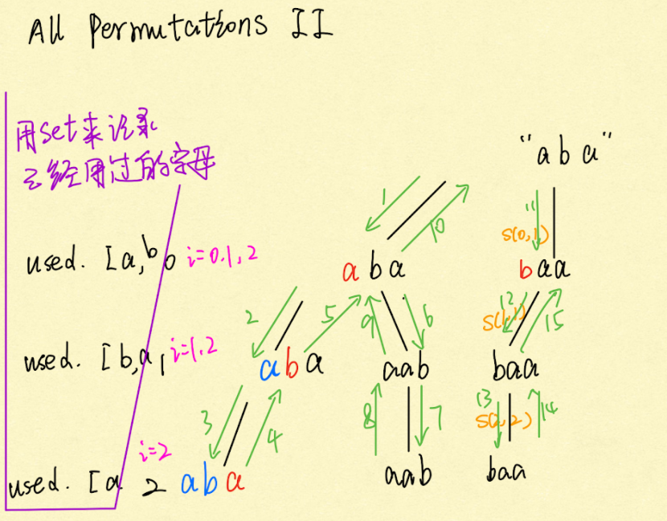

# [Reverse String](https://app.laicode.io/app/problem/396?plan=3)

>Reverse a given string.
>
>**Assumptions**
>
>- The given string is not null.

1. ==方法一==

双指针相向, time = O(n) , space = O(1)

```java
public class Solution {
	public String reverse(String input) {
        if (input == null || input.length() == 0) {
            return input;
        }
        char[] array = input.toCharArray();
        for(int left = 0, right = array.length - 1; left <= right; left++, right--) {
            swap(array, left, right);
        }
        return new String(array);
    }
    private void swap(char[] array, int left, int right) {
        char temp = array[left];
        array[left] = array[right];
        array[right] = temp;
    }
}
```


2. 方法二

使用recursion,两个指针

basecase， left >= right

rule, 左右指针相向

a p p l e 

i			j

```java
public class Solution {
	public String reverse(String input) {
        if (input == null || input.length() <= 1) {
            return input;
        }
        char[] array = input.toCharArray();
        int left = 0;
        int right = array.length - 1;
        helper(array, left, right);
        return new String(array);
    }
    private void helper(char[] array, int left, int right) {
        if (left >= right) {
            return;
        }
        swap(array, left, right); //先执行swap,然后进入断点
        helper(array, left + 1, right - 1);
    }
    private void swap(char[] array, int left, int right) {
        char temp = array[left];
        array[left] = array[right];
        array[right] = temp;
    } 
}
```


# [Reverse Words In A Sentence I](https://app.laicode.io/app/problem/84?plan=3)

>Reverse the words in a sentence.
>
>**Assumptions**
>
>- Words are separated by single space
>- There are no heading or tailing white spaces
>
>**Examples**
>
>- “I love Google” → “Google love I”
>
>**Corner Cases**
>
>- If the given string is null, we do not need to do anything.

先整体反转,然后单个单词反转

I love yahoo

oohay evol I

yahoo love I

space = O(1), time = O(n^2)

```java
public class Solution {
  public String reverseWords(String input) {
        if (input == null || input.length() <= 1) {
            return input;
        }
        char[] array = input.toCharArray();
        reverse(array, 0, array.length - 1);
        int start = 0;
        for (int i = 0; i < array.length; i++) {
            if (array[i] != ' ' && (i == 0 || array[i - 1] == ' ' )) {
                start = i;
            }
            if (array[i] != ' ' && (i == array.length - 1 || array[i + 1] == ' ')) {
                reverse(array, start, i);
            }
        }
        return new String(array);
    }
    private void reverse(char[] array, int left, int right) {
        while (left <= right) {
            char temp = array[left];
            array[left] = array[right];
            array[right] = temp;
            left++;
            right--;
        }
    }
}
```

# [Right Shift By N Characters](https://app.laicode.io/app/problem/397?plan=3)

>Right shift a given string by n characters.
>
>**Assumptions**
>
>- The given string is not null.
>- n >= 0.
>
>**Examples**
>
>- "abc", 4 -> "cab"

abc, 4 和abc, 1结果相同, 右边移动四位和把右边的一位移动到左边效果一样

abcde,3 ==>结果为cde ab, 将右边的三位移动到左边相对顺序不变.

==思路:==

右移的意思是右边取三个字母移动到左边

1. 将string分为两半,前后分别反转

2. 后整体反转. 

eg: abcde

前面反转 ba 后面反转edc

整体反转: cde ab

`注意`:分两半: n % array.length 是因为n可能很大,这样可以直接确定规律的最小次数

```java
public class RightShiftByNCharacters {
    public String rightShift(String input, int n) {
        if (input.length() <= 1) {
            return input;
        }
        char[] array = input.toCharArray();
        n = n % array.length;
        reverse(array, 0, array.length - n - 1); //前半部分
        reverse(array, array.length - n, array.length - 1); //后半部分
        reverse(array, 0, array.length - 1); //整体反转
        return new String(array);
    }
    private void reverse(char[] array, int left, int right) {
        while(left <= right) {
            char temp = array[left];
            array[left] = array[right];
            array[right] = temp;
            left++;
            right--;
         }
    }
}
```


# [String Replace (basic)](https://app.laicode.io/app/problem/649?plan=3)

>Given an original string input, and two strings S and T, from left to right replace **all** occurrences of S in input with T.
>
>**Assumptions**
>
>- input, S and T are not null, S is not empty stringzz
>
>**Examples**
>
>- input = "appledogapple", S = "apple", T = "cat", input becomes "catdogcat"
>- input = "laicode", S = "code", T = "offer", input becomes "laioffer"

方法一:

当s > t的长度的时候,否则会出现问题,覆盖掉了

快慢指针

fast: the character being processed.

slow: [0, slow) should be keeped

Initialize: fast = 0, slow = 0

**case1:** if fast is not a start of the pattern, a[slow] = a[fast], slow++, fast++. 不匹配,保留

**case2:** fast is start of the pattern, f+ = pattern.length, copy xx (replacement) into a[s]

Time = O(n * m) extra space = O(1)

所以s < t这个方法要改进,只能从后往前匹配, slow在newArray.length - 1. 

==方法二==

使用StringBuilder

```
String input = "appledogapple";
         
String source = "apple";是input中需要被替换的substring
String target = "cat";是用来替换的string
```

int matchIndex = input.indexOf(source, fromIndex); input是整个string, 然后再整个string里面找source出现的位置,从fromIndex处开始找. 


a p p l e d o g a p p l e               sb = "cat"

m

​               f = matchIndex + source.length() = 0 + 5 = 5 

a p p l e d o g a p p l e              sb = "catdogcat"

​                         m = 8 更新了

​               f

a p p l e d o g a p p l e

​                                            m = -1 

​                                         f

```java
public class Solution {
    public String replace(String input, String source, String target) {
        StringBuilder sb = new StringBuilder();
        int fromIndex = 0;
        int matchIndex = input.indexOf(source, fromIndex);
        while (matchIndex != -1) {
            sb.append(input, fromIndex, matchIndex).append(target);
            fromIndex = matchIndex + source.length();
            matchIndex = input.indexOf(source, fromIndex);
        }
        sb.append(input, fromIndex, input.length());
        return sb.toString();
    }
}
```


# [All Permutations II](https://app.laicode.io/app/problem/65?plan=3)

>Given a string with possible duplicate characters, return a list with all permutations of the characters.
>
>**Examples**
>
>- Set = “abc”, all permutations are [“abc”, “acb”, “bac”, “bca”, “cab”, “cba”]
>- Set = "aba", all permutations are ["aab", "aba", "baa"]
>- Set = "", all permutations are [""]
>- Set = null, all permutations are []

既然出现了duplicate就要用hashset来去重,剪枝

Time = O(n!), space = n  + (n - 1) + (n - 2) + (n - 3) + ... + 1 = O(n2) 因为每次都用了hashset 



```java
public class Solution {
    public List<String> permutations(String input) {
        List<String> result = new ArrayList<String>();
        if (input == null) {
            return result;
        }
        char[] array = input.toCharArray();
        helper(array, 0, result);
        return result;
    }
    private void helper(char[] array, int index, List<String> result) {
        if (index == array.length) {
            result.add(new String(array));
            return;
        }
        Set<Character> used = new HashSet<>();
        for (int i = index; i < array.length; i++) {
            if (used.add(array[i])) {
                swap(array, i, index);
                helper(array, index + 1, result);
                swap(array, i, index);
            }
        }
    }
    private void swap(char[] array, int left, int right) {
        char temp = array[left];
        array[left] = array[right];
        array[]
    }
}
```


# [ReOrder Array](https://app.laicode.io/app/problem/197?plan=3) (Shuffling)

>Given an array of elements, reorder it as follow:
>
>- { N1, N2, N3, …, N2k } → { N1, Nk+1, N2, Nk+2, N3, Nk+3, … , Nk, N2k }
>- { N1, N2, N3, …, N2k+1 } → { N1, Nk+1, N2, Nk+2, N3, Nk+3, … , Nk, N2k, N2k+1 }
>
>Try to do it **<u>in place .</u>**
>
>**Assumptions**
>
>- The given array is not null
>
>**Examples**
>
>- { 1, 2, 3, 4, 5, 6} → { 1, 4, 2, 5, 3, 6 }
>- { 1, 2, 3, 4, 5, 6, 7, 8 } → { 1, 5, 2, 6, 3, 7, 4, 8 }
>- { 1, 2, 3, 4, 5, 6, 7 } → { 1, 4, 2, 5, 3, 6, 7 }

A B C *D E F G* 1 2 3 4 5 6 7 

L         lm        m      rm    R 

1. 先交换中间的, 先独立反转后整体反转

A B C 1 2 3 D E F G 4 5 6 7 

2. 然后均匀的两半直接使用recursion像merge sort一样调用

A B C 1 2 3  

D E F G 4 5 6 7 

base case: length <= 2, 时候return 

`需要分奇偶` 奇数的时候最后一个元素不用管

`四个区间划分要注意`

```java
public class Solution {
    public int[] reorder(int[] array) {
        if (array.length % 2 == 0) {
            reorder(array, 0, array.length - 1);
        } else {
            reorder(array, 0, array.length - 2);
        }
        return array;
    }
    private void reorder(int[] array, int left, int right) {
        int length = right - left + 1; //只有两个元素的时候返回
        if (length <= 2) {
            return;
        }
        int mid = left + length / 2;
        int lmid = left + length / 4;
        int rmid = left + length * 3 / 4;
        reverse(array, lmid, mid - 1);
        reverse(array, mid, rmid - 1);
        reverse(array, lmid, rmid - 1);
        reorder(array, left, left + (lmid - left) * 2 - 1);
        reorder(array, left + (lmid - left) * 2, right);
    }
    private void reverse(int[] array, int left, int right) {
        while (left < right) {
            int temp = array[left];
            array[left] = array[right];
            array[right] = temp;
            left++;
            right--;
        }
    }
}
```


# [Compress String II](https://app.laicode.io/app/problem/611?plan=3)

>Given a string, replace adjacent, repeated characters with the character followed by the number of repeated occurrences.
>
>**Assumptions**
>
>- The string is not null
>- The characters used in the original string are guaranteed to be ‘a’ - ‘z’
>
>**Examples**
>
>- “abbcccdeee” → “a1b2c3d1e3”

==快慢指针==   题目hard暂时放弃

1. 先压缩两个或者两个以上的,先从左往右数一遍,就知道需要扩容多少
2. 从右往左走, i放在扩容之后的最后, j放在之前

```java
public class Solution {
  public String compress(String input) {
    // Write your solution here
    if (input == null || input.isEmpty()) {
            return input; //为空直接返回
        }
        char[] array = input.toCharArray();
        return encode(array);
  }
  private String encode(char[] input) {
        //step1: deal with the cases where the adjacent occurrence of the letters >= 2
        int slow = 0;
        int fast = 0;
        int newLength = 0;
        while (fast < input.length) {
            int begin = fast;
            while (fast < input.length && input[fast] == input[begin]) {
                fast++;
            }
            input[slow++] = input[begin];
            if (fast - begin == 1) {
                newLength += 2;
            } else {
                int len = copyDigits(input, slow, fast - begin);
                slow += len;
                newLength += len + 1;
            }
        }
        //step2: deal with the cases where the adjacent occurrence of the letters == 1
        //if it is required to do this in place, usually the input array is a sufficient large
        //on, you will not need to allocate a new array. This solution is only for demonstration
        char[] result = new char[newLength];
        fast = slow - 1;//老的长度减去1
        slow = newLength - 1;
        while (fast >= 0) {
            if (Character.isDigit(input[fast])) {
                while (fast >= 0 && Character.isDigit(input[fast])) {
                    result[slow--] = input[fast--];
                }
            } else {
                result[slow--] = '1';
            }
            result[slow--] = input[fast--];
        }
        return new String(result);
    }

    //copy "count" as digits into "input", starting at "index"
    private int copyDigits(char[] input, int index, int count) {
        int len = 0;
        for (int i = count; i > 0; i /= 10) {
            index++;
            len++;
        }
        for (int i = count; i > 0; i /= 10) {
            int digit = i % 10;
            input[--index] = (char) ('0' + digit);
        }
        return len;
    }
}

```


# [Decompress String II](https://app.laicode.io/app/problem/175?plan=3)

>Given a string in compressed form, decompress it to the original string. The adjacent repeated characters in the original string are compressed to have the character followed by the number of repeated occurrences.
>
>**Assumptions**
>
>- The string is not null
>- The characters used in the original string are guaranteed to be ‘a’ - ‘z’
>- There are no adjacent repeated characters with length > 9
>
>**Examples**
>
>- “a1c0b2c4” → “abbcccc”

使用StringBuilder

Time = O(n2) space = O(n)

```java
public class Solution {
    public String decompress(String input) {
        char[] array = input.toCharArray();
        StringBuilder sb = new StringBuilder();
        for (int i = 0; i < array.length; i++) {
            char ch = array[i++]; //i再往后走一步
            int count = array[i] - '0';//取得数字
            for(int c = 0; c < count; c++) {
                sb.append(ch);
            }
        }
        return sb.toString();
    }
}
```

---

sliding window 

# [Longest Substring Without Repeating Characters](https://app.laicode.io/app/problem/253?plan=3)

>Given a string, find the longest substring without any repeating characters and return the length of it. The input string is guaranteed to be not null.
>
>For example, the longest substring without repeating letters for "bcdfbd" is "bcdf", we should return 4 in this case.

==sliding window==

Time = O(n) 只是移动了s和f

Space = O(n) 开了一个hashset

Initialize: s = 0, f = 0, global_max = 0

循环条件fast < input.length() 

case1: distinct.contains(fast) 出现重复

distinct.remove(slow), slow++

case2: 没有重复, distinct.add(input.charAt(fast++), 

​							longest = Math.max(longest, fast - slow)


```java
public class Solution {
    public int longest(String input) {
        Set<Character> distinct = new HashSet<>();
        int slow = 0;
        int fast = 0;
        int longest = 0;
        while (fast < input.length()) {
            if (distinct.contains(input.charAt(fast))) {
                distinct.remove(input.charAt(slow++));//一直移除直到slow移除重复元素
            } else {
                distinct.add(input.charAt(fast++));
                longest = Math.max(longest, fast - slow);
            }
        }
        return longest;
    }
}
```


# [All Anagrams](https://app.laicode.io/app/problem/398?plan=3)

>Find all occurrence of anagrams of a given string s in a given string l. Return the list of starting indices.
>
>**Assumptions**
>
>- sh is not null or empty.
>- lo is not null.
>
>**Examples**
>
>- l = "abcbac", s = "ab", return [0, 3] since the substring with length 2 starting from index 0/3 are all anagrams of "ab" ("ab", "ba").
>
>返回出现的排列字符串位置,字母的个数一样但是中间的顺序可以换（同构异形状）     

搞一个长度一直等于4的弹簧，用hashtable, 没有具体看这道题


```java
public class Solution {
  public List<Integer> allAnagrams(String sh, String lo) {
    // Write your solution here
            List<Integer> result = new ArrayList<Integer>();
        if (lo.length() == 0) {
            return result;
        }
        //when s is longer that l, there is no way any of the substring of l
        //could be an anagram of s (s是同构异形)
        if (sh.length() > lo.length()) {
            return result;
        }
        //This map records for each of the distinct characters in s
        //how many characters are needed
        //eg. s = "abbc", map = {'a': 1, 'b':2,'c':1}
        //when we get an instance of 'a' in l, we let count of 'a' decremented by 1
        //and only when the count is from 1 to 0, we have 'a' totally matched
        Map<Character, Integer> map = countMap(sh);
        //record how many distinct characters have been matched
        //only when all the distinct characters are matched,
        //match == map.size(), we find an anagram
        int match = 0;
        // we have a sliding window of size s.length(), and since the size is fixed
        //we only need to record the end index of the sliding window
        //when move the sliding window by one step from left to right, what we need to change is
        //1. remove the leftmost character at the previous sliding window
        //2. add the rightmost character at the current sliding window
        for (int i = 0; i < lo.length(); i++) {
            //handle the new added character(rightmost) at the current sliding window
            char tmp = lo.charAt(i);
            Integer count = map.get(tmp);
            if (count != null) {
                //the number of needed count should be --
                // and only when the count is from 1 to 0, we find an additional
                //match of distinct character
                map.put(tmp, count - 1);
                if (count == 1) {
                    match++;
                }
            }
            //handle the leftmost character at the previous sliding window
            if (i >= sh.length()) {
                tmp = lo.charAt(i - sh.length());
                count = map.get(tmp);
                if (count != null) {
                    // the number of needed count should be ++
                    // and only when the count if from 0 to 1, we are short for one match of distinct character
                    map.put(tmp, count + 1);
                    if (count == 0) {
                        match--;
                    }
                }
            }
            //for the current sliding window, if all the distinct characters are matched(the count are all zero)
            if (match == map.size()) {
                result.add(i - sh.length() + 1);
            }
        }
        return result;
  }
   private Map<Character, Integer> countMap(String s) {
        Map<Character, Integer> map = new HashMap<Character, Integer>();
        for (char ch : s.toCharArray()) {
            Integer count = map.get(ch);
            if (count == null) {
                map.put(ch, 1);
            } else {
                map.put(ch, count + 1);
            }
        }
        return map;
    }
}
```


# [Longest subarray contains only 1s](https://app.laicode.io/app/problem/625?plan=3)

>Given an array of integers that contains only 0s and 1s and a positive integer **k**, you can flip at most **k** 0s to 1s, return the longest subarray that contains only integer 1 after flipping.
>
>**Assumptions:**
>
>1. Length of given array is between [1, 20000].
>
>2. The given array only contains 1s and 0s.
>
>3. 0 <= k <= length of given array.
>
>**Example 1:**
>
>Input: array = [1,1,0,0,1,1,1,0,0,0], k = 2
>
>Output: 7
>
>Explanation: flip 0s at index 2 and 3, then the array becomes [1,1,1,1,1,1,1,0,0,0], so that the length of longest subarray that contains only integer 1 is 7.
>
>**Example 2:**
>
>Input: array = [1,1,0,0,1,1,1,0,0,0], k = 0
>
>Output: 3
>
>Explanation: k is 0 so you can not flip any 0 to 1, then the length of longest subarray that contains only integer 1 is 3.
>
>

只要**sliding window**里面0的个数不超过**k**,那么就可以把所有的窗口里面的0变成1。The longest subarray that return contains at most K zeros.依然是s,f指向slidingwindow闭区间的左右端点。

**Data structure:** 

s: sling window left border, f: the right border

num_zeros: the number of zeros within a[s ... f]

longest: the length of the longest valid sliding window

**Initialize:** 

s = 0, f = 0, num_zeros = (a[0] == 0 ? 1: 0), longest = 1

For each step

case 1: a[f] == 1, then f++, update longest 毫无疑问直接f++, 更新长度

case2: a[f] == 0

​	case 2.1: num_zeros < k, then f++, num_zeros++, update longest  可以更改的0的个数情况下, 依然可以更新长度

​	case 2.2: num_zeros == k, nums[slow++] == 0, then s++, num_zeros --, 已经达到了K,slow为0情况下需要减少num_zeros 

1,1,0,0,1,1,1,0,0,0	 

s

   f

```java
public class Solution {
    public int longestConsectiveOnes(int[] nums, int k) {
        int slow = 0;
        int fast = 0;
        int count = 0; //记录0的个数
        int longest = 0;
        while (fast < nums.length) {
            if (nums[fast] == 1) { 
                longest = Math.max(longest, ++fast - slow);
            } else if (count < k) {
                count++;
                longest = Math.max(longest, ++fast - slow);
            } else if (nums[slow++] == 0) { //为0说明这个时候需要取消count
                count--;
            }
        }
        return longest;
    }
}
```

#### [43. 字符串相乘](https://leetcode-cn.com/problems/multiply-strings/)


套用之前的两个数相加的方法，通过补零的方式求和得出


```java
class Solution {
    public String multiply(String num1, String num2) {
        if (num1.equals("0") || num2.equals("0")) {
            return "0";
        }
        String ans = "0";
        int m = num1.length();
        int n = num2.length();
        for (int i = n - 1; i >= 0; i--) {
            StringBuilder curr = new StringBuilder();
            int add = 0;
            for (int k = n - 1; k > i; k--) {
                curr.append(0);
            }
            int y = num2.charAt(i) - '0';
            for (int j = m - 1; j >= 0; j--) {
                int x = num1.charAt(j) - '0';
                int product = x * y + add;
                curr.append(product % 10);
                add = product / 10;
            }
            if (add != 0) {
                curr.append(add % 10);
            }
            ans = addString(ans, curr.reverse().toString());
        }
        return ans;
    }

    public String addString(String nums1, String nums2) {
        int i = nums1.length() - 1;
        int j = nums2.length() - 1;
        int add = 0;
        StringBuilder sb = new StringBuilder();
        while (i >= 0 || j >= 0 || add != 0) {
            int x = i >= 0 ? nums1.charAt(i) - '0' : 0;
            int y = j >= 0 ? nums2.charAt(j) - '0' : 0;
            int res = x + y + add;
            sb.append(res % 10);
            add = res / 10;
            i--;
            j--;
        }
        sb.reverse();
        return sb.toString();
    }
}

```

#### [38. 外观数列](https://leetcode-cn.com/problems/count-and-say/)


```java
class Solution {
    public String countAndSay(int n) {
        if (n == 0) {
            return null;
        }
        if (n == 1) {
            return "1";
        }
        String[] dp = new String[n];
        dp[0] = "1";
        dp[1] = "11";
        for (int i = 2; i < n; i++) {
            String prev = dp[i - 1];
            char[] prevChars = prev.toCharArray();
            StringBuilder sb = new StringBuilder();
            int count = 1;
            char curr = prevChars[0];
            for (int j = 1; j < prev.length(); j++) {
                if (prevChars[j] != curr) {
                    sb.append(count);
                    sb.append(curr);
                    curr = prev.charAt(j);
                    count = 1;
                } else {
                    count++;
                }
            }
            sb.append(count);
            sb.append(curr);
            dp[i] = sb.toString();
        }
        return dp[n - 1];
    }
}
```


