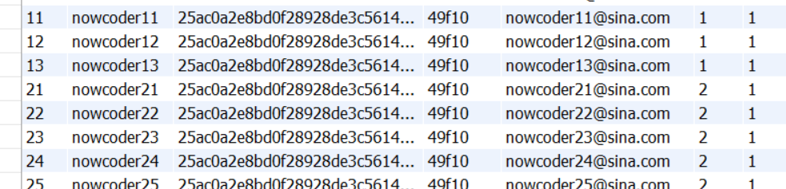

**开启ES:** 

```shell
C:\Users\cheng>d:d
D:\>cd D:\work\elasticsearch-6.4.3\bin
elasticsearch.bat
```

**开启KafKa**

1. 先配置zookeeper管理集群

```shell
C:\Users\cheng>d:                                                                                         
D:\>cd D:\work\kafka_2.13-2.8.0                                                                           
D:\work\kafka_2.13-2.8.0>bin\windows\zookeeper-server-start.bat config\zookeeper.properties   
```

2. 启动Kafka (开另一个窗口)

```shell
C:\Users\cheng>d:                                                                                         
D:\>cd D:\work\kafka_2.13-2.8.0                                                                           
D:\work\kafka_2.13-2.8.0>bin\windows\kafka-server-start.bat config\server.properties 
```

常见报错： 

```
kafka.common.InconsistentClusterIdException: The Cluster ID Lnh8cPXGQsm0svgyhLcJtQ doesn't match stored clusterId Some(sqVS5qbvRZuFAwJYTzr7kA) in meta.properties. The broker is trying to join the wrong cluster. Configured zookeeper.connect may be wrong.
	at kafka.server.KafkaServer.startup(KafkaServer.scala:220)
	at kafka.server.KafkaServerStartable.startup(KafkaServerStartable.scala:44)
	at kafka.Kafka$.main(Kafka.scala:84)
	at kafka.Kafka.main(Kafka.scala)
建议删除 kafka-logs
log.dirs=/tmp/kafka-logs
```

**登录**

账号xixi 密码123  



nowcoder11 12 13 管理员，密码123456 可以删除

nowcoder21 22 23 24 25 版主 可以置顶删除

 

## mysql 

```shell
C:\Users\cheng>mysql -uroot -p
show databases;
mysql> use community;
source D:/work/tables_mysql_innodb.sql;
```


项目介绍： 

首页是一个帖子列表， 可以按照最新或者最热门排序，点击“我要发布”可以发一个帖子，为了防止发布不健康帖子，网站服务端进行敏感词过滤，把非法的词隐藏（算法?），如果没有登陆，只能看帖子不能发布，也不能查看消息，个人主页，退出登录等功能。 点击某个帖子可以看到帖子信息和评论，也可以点赞或者对评论点赞。 另外管理员和版主可以删除置顶加精。 注册会发邮件激活。 登录功能的验证码会生成验证码，登录成功后服务端需要记住用户的登录状态， 下次访问就可以不用登录了。 可以查看个人主页，关注的人粉丝获得的点赞，我的回复，我的帖子，别人也可以点击我的头像关注我。点赞和评论都是比较高频的问题，需要考虑性能问题。 （采用什么方案？？） 上传头像注销登录状态。 也可以给别人发消息。  发布消息需要专业的消息队列服务器，在搜索框可以全站搜索，将关键字标记为红色。 需要使用搜索引擎，如何高亮，如何与数据库同步？ 还有个就是统计网站UV. 需要自己敲入路径。 


把注解加到类上，类就能被容器扫描 


@Controller是由Component实现，处理请求

 数据库访问组件用Repository 

开发的类在任何地方都能用： @Compoent（通用）

@Compoent


