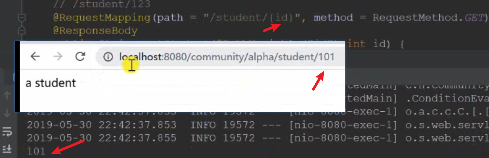
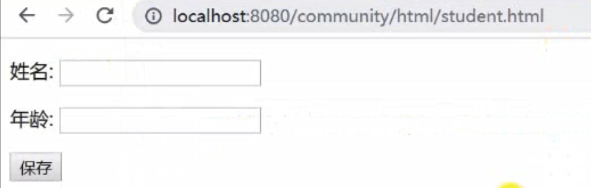
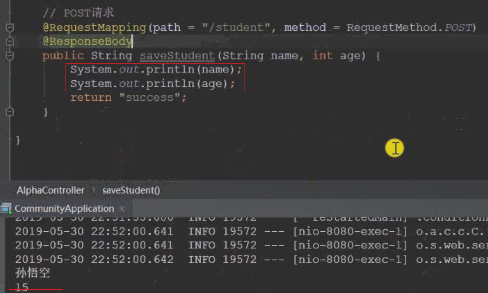
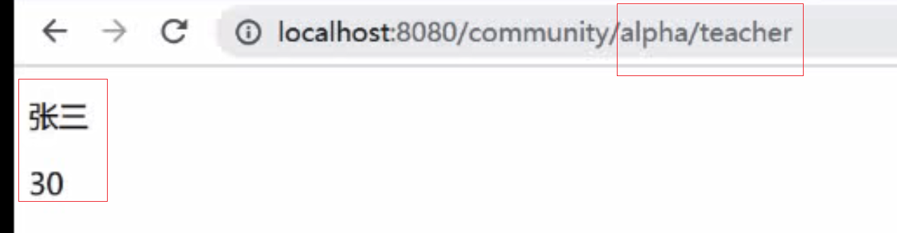
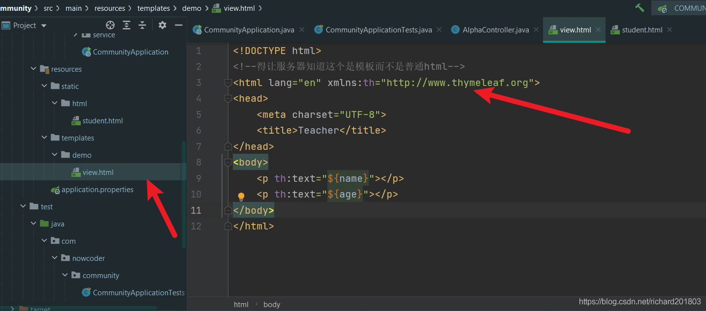
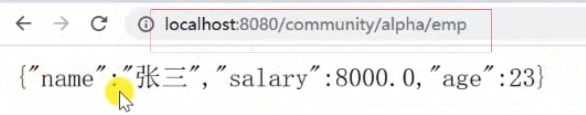

#   02 Spring MVC入门

web开发的协议
基于HTTP 


**三层架构**
服务端的三层结构
  `表现层`、`业务层`、`数据访问层`
**MVC**
*MVC解决的是`表现层`的问题!!!* 
	`-Model`：模型层
	`-View`：视图层
	`-Controller`：控制层
	浏览器访问的是controller控制器，这 个组件会调用业务层去处理，将处理好的数据封装到model，然后传给View层。 然后View层利用Model数据生成一个Html返回给浏览器。 
	这三层是谁调用的呢？？？？   
***Spring MVC `核心组件`是谁？如何去调度这三层的代码？？***
 	**前端控制器**：`DispatcherServlet`
 	[DS](https://docs.spring.io/spring-framework/docs/current/reference/html/web.html#spring-web)

**WebApplicationContext就是Spring容器**, ViewResolver视图解析， HandlerMapping管理注解。那么调用顺序： 

都是位于Tomat，浏览器访问服务器由Front Controller(`DispatcherServlet`)来处理请求，`DispatcherServlet`会根据映射的注解，即controller上的路径/方法上的路径，去找到controller去调用他，Cotroller会把数据封装到model里返回给front controller, 然后Front Controller会调用View template，并且把model给这个模板。 template中的符号可以用model中的值替换然后生成一个`动态`的网页给Front Controller然后返回给浏览器。 
开发的时候，Front Controller是自动运行的不需要我们处理，我们主要编码Controller, model, view template. 

----
想给浏览器返回动态的网页需要`Thymeleaf`的支持
•	模板引擎
 	**生成动态的HTML。**
 	如何生成的呢？？
 	需要模板文件(网页的基本结构及一些表达式which can be replaced by data in the model) 然后就是model数据


•	Thymeleaf 
	用得多的原因？ 
	倡导自然模板，即以HTML文件为模板。
•	常用语法
	标准表达式、判断与循环、模板的布局。
https://www.thymeleaf.org

----
## 配置Thymeleaf 
关闭缓存，防止看旧的内容，上线以后才开启降低服务器的压力
spring.thymeleaf.cache=false
咱们是给配置类注入数据

dao中是数据访问层，service是业务层

## 请求数据
//spring mvc中如何获得请求对象（封装请求的数据）？响应对象（响应的数据）比较麻烦的封装： 

```java
    //spring mvc中如何获得请求对象？响应对象
    //可以通过response对象向浏览器输出任何数据,所以没有返回值
    @RequestMapping("/http")
    public void http(HttpServletRequest request, HttpServletResponse response) {
        //读取请求中的数据
        System.out.println(request.getMethod());
        System.out.println(request.getServletPath());//请求路径
        //请求头
        Enumeration<String> enumeration = request.getHeaderNames();
        while (enumeration.hasMoreElements()) {
            String name = enumeration.nextElement();
            String header = request.getHeader(name);
            System.out.println(name + ": " + header);
        }
        //请求体
        System.out.println(request.getParameter("code"));
        ///////////response返回响应数据
        //首先设置返回类型，这里返回网页
        response.setContentType("text/html;charset=utf-8");
        //response输出流向浏览器输出
        try (
                PrintWriter writer = response.getWriter();
        ) {
            //writer打印网页
            writer.write("<h1>牛客网</h1>");
        } catch (IOException e) {
            e.printStackTrace();
        }
    }
```

#### 更简单的方式一使用`Get`请求，参数在？中


```java
	//Get请求，向服务器获取数据
    //查询所有学生，分页条件和限制
    // /students?current=1&limit=20
    @RequestMapping(path = "/students", method = RequestMethod.GET)
    @ResponseBody
    public String getStudent(
            @RequestParam(name = "current", required = false, defaultValue = "1") int current,
            @RequestParam(name = "limit", require d = false, defaultValue = "10")int limit) {
        System.out.println(current);
        System.out.println(limit);
        return "some students";
    }
```
#### 更简单的方式二使用`Get`请求，参数在路径中



```java
//根据学生Id查询,参数是路径一部分的时候修改获取方式
    // /students/123
    @RequestMapping(path = "/students/{id}", method = RequestMethod.GET)
    @ResponseBody
    public String getStudent(@PathVariable("id") int id) {
        System.out.println(id);
        return "a student";
    }
```
## `post`浏览器向服务器提交数据

浏览器需要创建网页，可以在template创建动态网页，但是这里需要的是静态的所以放在static里面。



```java
    //post 请求
    @RequestMapping(path = "/student", method = RequestMethod.POST)
    @ResponseBody
    //传入的参数就是表单中的数据
    public String saveStudent(String name, int age) {
        System.out.println(name);
        System.out.println(age);
        return "success saved student";
    }
```




# 向浏览器响应数据

### 如何响应动态html
先定义好需要响应的 name, age 

```java
//响应动态html,想要返回html就不要加@ResponseBody
    @RequestMapping(path = "/teacher", method = RequestMethod.GET)
    public ModelAndView getTeacher() {
        ModelAndView mav = new ModelAndView();
        mav.addObject("name", "张三");
        mav.addObject("age", "30");

        //设置模板路径和名字,template包的路径可以不用写,且后面不用写文件后缀名
        mav.setViewName("/demo/view");
        return mav;
    }
```


然后定义view.html

```html
<!DOCTYPE html>
<!--得让服务器知道这个是模板而不是普通html-->
<html lang="en" xmlns:th="http://www.thymeleaf.org">
<head>
    <meta charset="UTF-8">
    <title>Teacher</title>
</head>
<body>
    <p th:text="${name}"></p>
    <p th:text="${age}"></p>
</body>
</html>
```


## 响应方式二
http://localhost:8080/community/alpha/school
用这个方式更加简单
```java
    //查询学校
    @RequestMapping(path = "/school", method = RequestMethod.GET)
    //返回类型写的string是返回的view的路径,Model是dispatchServlet自动实例化这个对象
    //在这个方法内传数据他也能得到,model数据撞到model里面,然后view的数据返回给dispatchServlet
    public String getSchool(Model model) {
        model.addAttribute("name", "北京大学");
        model.addAttribute("age", 80);
        return "/demo/view"; //模板的路径
    }
```
## 异步请求响应JSON 
通常在异步请求当中，比如注册B站，输入昵称，密码，光标切换就会判断昵称是否被占用，但是当前网页没有刷新。 
http://localhost:8080/community/alpha/emp
{"Salary":8000,"name":"张三","age":23}
sevlet调用这个方法的时候一看加了这个 @ResponseBody 注解， 返回的是Map类型，自动转换成JSON发给浏览器



```java
    //除了响应html,还能响应JSON数据
    //通常在异步请求当中，比如注册B站，输入昵称，密码，光标切换就会判断昵称是否被占用，但是当前网页没有刷新
    //JAVA对象 --> JSON字符串 -->JS对象

    @RequestMapping(path = "/emp", method = RequestMethod.GET)
    //@ResponseBody加上返回字符串，不加返回HTML
    @ResponseBody
    public Map<String, Object> getEmp() {
        Map<String, Object> emp = new HashMap<>();  
        emp.put("name", "张三");
        emp.put("age", 23);
        emp.put("Salary", 8000);
        return emp;
    }
```
## 异步请求响应JSON 
有时候返回的不是一个员工是一组员工
http://localhost:8080/community/alpha/emps

```java
    @RequestMapping(path = "/emps", method = RequestMethod.GET)
    //@ResponseBody加上返回字符串，不加返回HTML
    @ResponseBody
    public List<Map<String, Object>> getEmps() {
        List<Map<String, Object>> list = new ArrayList<>();

        Map<String, Object> emp = new HashMap<>();
        emp.put("name", "张三");
        emp.put("age", 23);
        emp.put("Salary", 8000);
        list.add(emp);

        emp = new HashMap<>();
        emp.put("name", "李四");
        emp.put("age", 24);
        emp.put("Salary", 9000);
        list.add(emp);

        emp = new HashMap<>();
        emp.put("name", "王五");
        emp.put("age", 28);
        emp.put("Salary", 7000);
        list.add(emp);

        return list;
    }
```