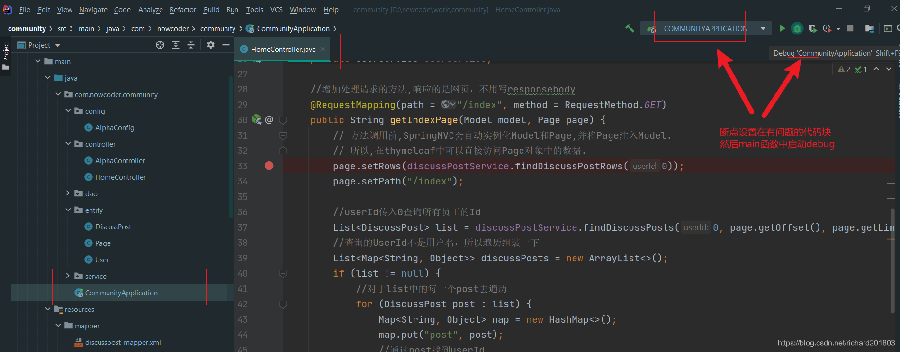

# 05 项目调试技巧

##	1 响应状态码的含义
浏览器向服务器发送请求，大概判断错误发生在服务端还是客服端
[状态码](https://developer.mozilla.org/zh-CN/docs/Web/HTTP/Status).
`302` Found
请求的资源现在临时从不同的 URI 响应请求。由于这样的`重定向`是临时的，客户端应当继续向原有地址发送以后的请求。只有在Cache-Control或Expires中进行了指定的情况下，这个响应才是可缓存的。
重定向：


**删除功能：** 删除贴子
数据被删掉后服务器给客服端返回？返回查询的数据，列表页面。
**查询：** 显示帖子
利用重定向可以解决这个问题，删除后给浏览器响应，返回一个建议，状态码是302，即建议访问另外的功能，还会带一个建议访问的location可以很好数据显示，然后查询再返回一个页面， 可以通过客服端独立再一次请求调用。比如注册一个账号，然后就进入登录了，自己独立，低耦合。 

`404` Not Found 往往路径写错了
`500` Internal Server Error, 服务器接收到请求但是发生了错误，于是就要检查`服务端`的程序

##	2 服务端断点调试技巧
在方法内部的第一行代码出检查

然后再执行的过程中才会卡住，打开浏览器访问这个功能，浏览器就一直loading（http://localhost:8080/community/index）
不想再loop里面搞太久就可以直接设置下一个断点resume过去。 
还有统一管理断点功能

##	3 客户端断点调试技巧
其实就是调试JS,断点位置在inspect
elements主要是html和css。然后js调试通过Sources下找到该文件然后直接点中需要调试的那一行代码。
需要查看变量值可以选中该变量，右键add selected text to watches.  

##	4 设置日志级别，并将日志输出到不同的终端
结合日志找问题所在而不仅是断点
Springboot 记录日志有很多工具，例如https://logback.qos.ch

```java
package org.slf4j; 
public interface Logger {

  // Printing methods: 
  public void trace(String message);
  public void debug(String message);
  public void info(String message); 
  public void warn(String message); 
  public void error(String message); 
}
```
都是用来打印日志信息，不同的方法有不同的日志级别。可以在配置文件中配置级别。如果启用info,那只有info，warn，error会打印出来。


```xml
logging.level.com.nowcoder.community=debug
logging.file.name=d:/work/data/nowcoder/community.log
```
debug级别以上的都会被打印出来
写个LoggerTests.java测试一下

```java
@RunWith(SpringRunner.class)
@SpringBootTest
//测试代码以某一个为配置类
@ContextConfiguration(classes = CommunityApplication.class)
public class LoggerTests {
    //设为静态的每个地方都能用,传入类就是logger的名字,这样不同的logger在不同的类下就有区别，就能知道是哪里的logger
    private static final Logger logger = LoggerFactory.getLogger(LoggerTests.class);

    @Test
    public void testLogger() {
        System.out.println(logger.getName());

        logger.debug("debug log");//暂时调试用以后不需要了
        logger.info("info log"); //启用线程池，定时任务
        logger.warn("warn log");//这个用得相对少
        logger.error("error log");
    }
}
```
为了能长久保存需要存到指定的文件。
- 实际开发按照不同的级别存到不同的文件里
- 5m以后再分一个文件
`logback-spring.xml`直接放到resources包下面，spring能自动发现

```xml
<?xml version="1.0" encoding="UTF-8"?>
<configuration>
    <contextName>community</contextName>
    <property name="LOG_PATH" value="D:/work/data"/>
    <property name="APPDIR" value="community"/>

    <!-- error file -->
    <appender name="FILE_ERROR" class="ch.qos.logback.core.rolling.RollingFileAppender">
        <file>${LOG_PATH}/${APPDIR}/log_error.log</file>
        <rollingPolicy class="ch.qos.logback.core.rolling.TimeBasedRollingPolicy">
            <fileNamePattern>${LOG_PATH}/${APPDIR}/error/log-error-%d{yyyy-MM-dd}.%i.log</fileNamePattern>
            <timeBasedFileNamingAndTriggeringPolicy class="ch.qos.logback.core.rolling.SizeAndTimeBasedFNATP">
                <maxFileSize>5MB</maxFileSize>
            </timeBasedFileNamingAndTriggeringPolicy>
            <maxHistory>30</maxHistory>
        </rollingPolicy>
<!--        追加的格式-->
        <append>true</append>
        <encoder class="ch.qos.logback.classic.encoder.PatternLayoutEncoder">
            <pattern>%d %level [%thread] %logger{10} [%file:%line] %msg%n</pattern>
            <charset>utf-8</charset>
        </encoder>
        <filter class="ch.qos.logback.classic.filter.LevelFilter">
            <level>error</level>
            <onMatch>ACCEPT</onMatch>
            <onMismatch>DENY</onMismatch>
        </filter>
    </appender>

    <!-- warn file -->
    <appender name="FILE_WARN" class="ch.qos.logback.core.rolling.RollingFileAppender">
        <file>${LOG_PATH}/${APPDIR}/log_warn.log</file>
        <rollingPolicy class="ch.qos.logback.core.rolling.TimeBasedRollingPolicy">
            <fileNamePattern>${LOG_PATH}/${APPDIR}/warn/log-warn-%d{yyyy-MM-dd}.%i.log</fileNamePattern>
            <timeBasedFileNamingAndTriggeringPolicy class="ch.qos.logback.core.rolling.SizeAndTimeBasedFNATP">
                <maxFileSize>5MB</maxFileSize>
            </timeBasedFileNamingAndTriggeringPolicy>
            <maxHistory>30</maxHistory>
        </rollingPolicy>
        <append>true</append>
        <encoder class="ch.qos.logback.classic.encoder.PatternLayoutEncoder">
            <pattern>%d %level [%thread] %logger{10} [%file:%line] %msg%n</pattern>
            <charset>utf-8</charset>
        </encoder>
        <filter class="ch.qos.logback.classic.filter.LevelFilter">
            <level>warn</level>
            <onMatch>ACCEPT</onMatch>
            <onMismatch>DENY</onMismatch>
        </filter>
    </appender>

    <!-- info file -->
    <appender name="FILE_INFO" class="ch.qos.logback.core.rolling.RollingFileAppender">
        <file>${LOG_PATH}/${APPDIR}/log_info.log</file>
        <rollingPolicy class="ch.qos.logback.core.rolling.TimeBasedRollingPolicy">
            <fileNamePattern>${LOG_PATH}/${APPDIR}/info/log-info-%d{yyyy-MM-dd}.%i.log</fileNamePattern>
            <timeBasedFileNamingAndTriggeringPolicy class="ch.qos.logback.core.rolling.SizeAndTimeBasedFNATP">
                <maxFileSize>5MB</maxFileSize>
            </timeBasedFileNamingAndTriggeringPolicy>
            <maxHistory>30</maxHistory>
        </rollingPolicy>
        <append>true</append>
        <encoder class="ch.qos.logback.classic.encoder.PatternLayoutEncoder">
            <pattern>%d %level [%thread] %logger{10} [%file:%line] %msg%n</pattern>
            <charset>utf-8</charset>
        </encoder>
        <filter class="ch.qos.logback.classic.filter.LevelFilter">
            <level>info</level>
            <onMatch>ACCEPT</onMatch>
            <onMismatch>DENY</onMismatch>
        </filter>
    </appender>

    <!-- console -->
    <appender name="STDOUT" class="ch.qos.logback.core.ConsoleAppender">
        <encoder>
            <pattern>%d %level [%thread] %logger{10} [%file:%line] %msg%n</pattern>
            <charset>utf-8</charset>
        </encoder>
        <filter class="ch.qos.logback.classic.filter.ThresholdFilter">
            <level>debug</level>
        </filter>
    </appender>

    <logger name="com.nowcoder.community" level="debug"/>

    <root level="info">
        <appender-ref ref="FILE_ERROR"/>
        <appender-ref ref="FILE_WARN"/>
        <appender-ref ref="FILE_INFO"/>
        <appender-ref ref="STDOUT"/>
    </root>

</configuration>
```
然后执行一下LoggerTests测试类看看文件是否有效


