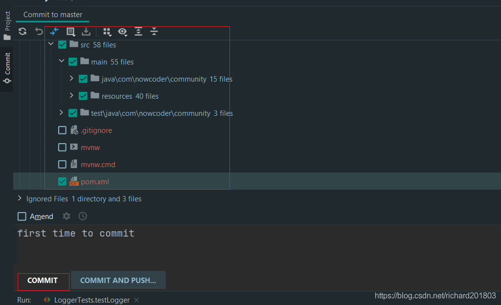
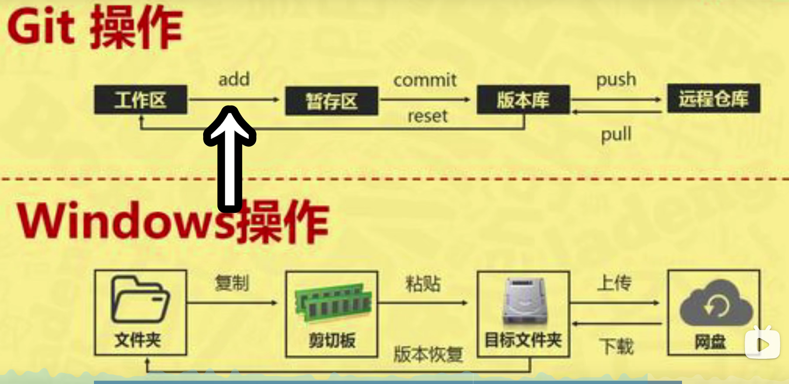
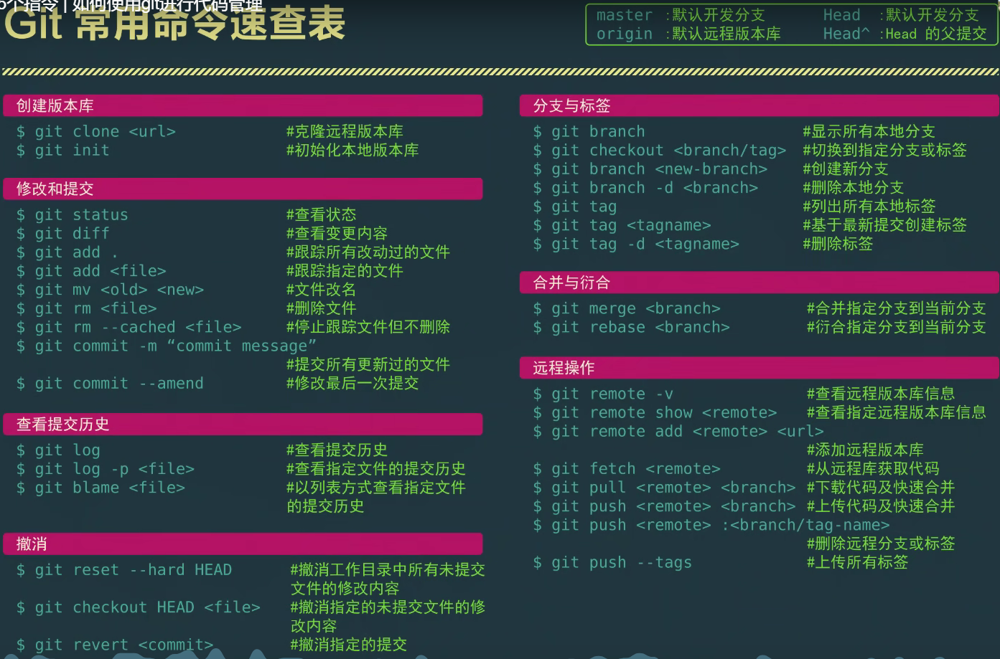

# 06 版本控制
## 1 认识Git
-	Git简介
 备份，历史变更，恢复版本
  推荐看书
  https://git-scm.com/book/en/v2


-	Git的安装与配置
## 2 Git常用命令
在Git **CMD**界面下：
```powershell
# 账号配置
git config --list #看下当前已有的配置
git config --global user.name "chengzhi"
git config --global user.email "chengzhifunice@outlook.com"
git config --list #看下当前已有的配置

对要进行管理的代码先进入路径下
C:\Users\cheng>d:

D:\>cd D:\newcode\demo\community

D:\newcode\demo\community>
然后提交本地创库，

```

-	将代码提交至本地仓库

```powershell
# 本地仓库
git init
#git status -s git add *
git status 
git add *
git status 
git commit -m 'Test1' #-m就是写备注,提交本地了！
git status #提交完检查一下状态，如果后面修改了，就会标红

git add * #再一次添加
```

-	将代码上传至远程仓库

Git为了安全考虑，传输时候采用ssh安全传输，用了密钥

```powershell
# 生成秘钥
ssh-keygen -t rsa -C "chengzhifunice@outlook.com"
```
一路默认，然后会告诉你生成的位置
Your public key has been saved in C:\Users\cheng/.ssh/id_rsa.pub. 进入这个文件，打开，整个复制一下。 
然后去远程仓库进行配置，把密钥加到远程仓库中去。

然后打卡copy路径

需要在本地关联一下远程仓库

```powershell
# 推送已有项目 默认名字origin 后面是copy的路径
git remote add origin https://git.nowcoder.com/334190970/Test.git 
#这就建好了远程仓库，然后把代码传到origin中的master分枝
git push -u origin master 
然后输入牛客网账号密码
```


## 3 传到github 
原文链接：https://blog.csdn.net/Lucky_LXG/article/details/77849212

在Git **CMD**界面下：
```powershell
# 账号配置
git config --list #看下当前已有的配置
git config --global user.name "chengzhi"
git config --global user.email "chengzhifunice@outlook.com"
git config --list #看下当前已有的配置

对要进行管理的代码先进入路径下
C:\Users\cheng>d:

D:\>cd D:\newcode\demo\community

D:\newcode\demo\community>
然后提交本地创库，

```
第1步：我们需要先创建一个本地的版本库,然后进入路径


 第2步：通过命令`git init`把这个文件夹变成Git可管理的仓库

一直使用git status来查看你当前的状态，红色就是还没添加到本地仓库，绿色就是加上去了还没提交。
 第3步：通过`git add *`一股脑把刚才复制过来的项目全部添加到仓库上

一直使用git status来查看你当前的状态


第4步：用`git commit -m `把项目提交到仓库
git commit -m 'Demotest'

第5步：创建`SSH KEY`。
```powershell
# 生成秘钥
ssh-keygen -t rsa -C "chengzhifunice@outlook.com"
```
一路默认，然后会告诉你生成的位置
Your public key has been saved in C:\Users\cheng/.ssh/id_rsa.pub. 进入这个文件，打开，整个复制一下。 


   第六步：然后去远程仓库进行配置，把密钥加到远程仓库中去。
https://github.com/settings/ssh/new

 第七步：在Github上创建一个Git仓库。
https://github.com/RichardCheng20?tab=repositories

第八步：在Github上创建好Git仓库之后我们就可以和本地仓库进行**关联**了，根据创建好的Git仓库页面的提示，可以在本地TEST仓库的命令行输入：

```powershell
git remote add origin https://github.com/RichardCheng20/myDemo01.git
```


注意origin后面加的是你Github上创建好的仓库的地址。


第九步：关联好之后我们就可以把本地库的所有内容**推送**到远程仓库（也就是Github，目前只有master分支)上了，通过：

```powershell
git push -u origin master
```
由于新建的远程仓库是空的，所以要加上-u这个参数，等远程仓库里面有了内容之后，下次再从本地库上传内容的时候只需下面这样就可以了：我一般用这个

```powershell
git push origin master
```

这时候你再重新刷新你的Github页面进入刚才新建的那个仓库里面就会发现项目已经成功上传了：


  另外，这里有个坑需要注意一下，就是在上面第七步创建远程仓库的时候，如果你勾选了Initialize this repository with a README（就是创建仓库的时候自动给你创建一个README文件)，那么到了第九步你将本地仓库内容推送到远程仓库的时候就会报一个failed to push some refs to https://github.com/guyibang/TEST2.git的错。

这是由于你新创建的那个仓库里面的README文件不在本地仓库目录中，这时我们可以通过以下命令先将内容合并以下：

```powershell
git pull --rebase origin master
```
 这时你再push就能成功了。
    总结：其实只需要进行下面几步就能把本地项目上传到Github

     1、在本地创建一个版本库（即文件夹），通过git init把它变成Git仓库；
    
     2、把项目复制到这个文件夹里面，再通过git add .把项目添加到仓库；
    
     3、再通过git commit -m "注释内容"把项目提交到仓库；
    
     4、在Github上设置好SSH密钥后，新建一个远程仓库，通过git remote add origin https://github.com/guyibang/TEST2.git将本地仓库和远程仓库进行关联；
    
     5、最后通过git push -u origin master把本地仓库的项目推送到远程仓库（也就是Github）上；（若新建远程仓库的时候自动创建了README文件会报错，解决办法看上面）。
----
## 修改了代码再一次上传
step 1 `git status`可以查看都修改了啥，然后


step 2 `git add * ` #再一次全部添加

step 3 重新提交
git commit -m 'testa2' #-m就是写备注,提交本地了！


step 4 `git status`可以查看,确实都提交上去了


step 5 再从本地库上传内容的时候只需下面这样就可以了：

```powershell
git push origin master
```


## 三、Git命令
### 查看、添加、提交、删除、找回，重置修改文件

```powershell
git help <command> # 显示command的help
 
git show # 显示某次提交的内容 git show $id
 
git co -- <file> # 抛弃工作区修改
 
git co . # 抛弃工作区修改
 
git add <file> # 将工作文件修改提交到本地暂存区
 
git add . # 将所有修改过的工作文件提交暂存区
 
git rm <file> # 从版本库中删除文件
 
git rm <file> --cached # 从版本库中删除文件，但不删除文件
 
git reset <file> # 从暂存区恢复到工作文件
 
git reset -- . # 从暂存区恢复到工作文件
 
git reset --hard # 恢复最近一次提交过的状态，即放弃上次提交后的所有本次修改
 
git ci <file> git ci . git ci -a # 将git add, git rm和git ci等操作都合并在一起做　　　　　　　　　　　　　　　　　　　　　　　　　　　　　　　　　　　　git ci -am "some comments"
 
git ci --amend # 修改最后一次提交记录
 
git revert <$id> # 恢复某次提交的状态，恢复动作本身也创建次提交对象
 
git revert HEAD # 恢复最后一次提交的状态
```
### 查看文件diff

```powershell
git help <command> # 显示command的help
 
git show # 显示某次提交的内容 git show $id
 
git co -- <file> # 抛弃工作区修改
 
git co . # 抛弃工作区修改
 
git add <file> # 将工作文件修改提交到本地暂存区
 
git add . # 将所有修改过的工作文件提交暂存区
 
git rm <file> # 从版本库中删除文件
 
git rm <file> --cached # 从版本库中删除文件，但不删除文件
 
git reset <file> # 从暂存区恢复到工作文件
 
git reset -- . # 从暂存区恢复到工作文件
 
git reset --hard # 恢复最近一次提交过的状态，即放弃上次提交后的所有本次修改
 
git ci <file> git ci . git ci -a # 将git add, git rm和git ci等操作都合并在一起做　　　　　　　　　　　　　　　　　　　　　　　　　　　　　　　　　　　　git ci -am "some comments"
 
git ci --amend # 修改最后一次提交记录
 
git revert <$id> # 恢复某次提交的状态，恢复动作本身也创建次提交对象
 
git revert HEAD # 恢复最后一次提交的状态
 
```
### 查看提交记录

```powershell
git log git log <file> # 查看该文件每次提交记录
 
git log -p <file> # 查看每次详细修改内容的diff
 
git log -p -2 # 查看最近两次详细修改内容的diff
 
git log --stat #查看提交统计信息
 
```
### tig

Mac上可以使用tig代替diff和log，brew install tig
Git 本地分支管理
### 查看、切换、创建和删除分支

```powershell
git br -r # 查看远程分支
 
git br <new_branch> # 创建新的分支
 
git br -v # 查看各个分支最后提交信息
 
git br --merged # 查看已经被合并到当前分支的分支
 
git br --no-merged # 查看尚未被合并到当前分支的分支
 
git co <branch> # 切换到某个分支
 
git co -b <new_branch> # 创建新的分支，并且切换过去
 
git co -b <new_branch> <branch> # 基于branch创建新的new_branch
 
git co $id # 把某次历史提交记录checkout出来，但无分支信息，切换到其他分支会自动删除
 
git co $id -b <new_branch> # 把某次历史提交记录checkout出来，创建成一个分支
 
git br -d <branch> # 删除某个分支
 
git br -D <branch> # 强制删除某个分支 (未被合并的分支被删除的时候需要强制)
 
```
### 分支合并和reba

```powershell
git merge <branch> # 将branch分支合并到当前分支
 
git merge origin/master --no-ff # 不要Fast-Foward合并，这样可以生成merge提交
 
git rebase master <branch> # 将master rebase到branch，相当于： git co <branch> && git rebase master && git co master && git merge <branch>
 
```
###  Git补丁管理(方便在多台机器上开发同步时用)

```powershell
git merge <branch> # 将branch分支合并到当前分支
 
git merge origin/master --no-ff # 不要Fast-Foward合并，这样可以生成merge提交
 
git rebase master <branch> # 将master rebase到branch，相当于： git co <branch> && git rebase master && git co master && git merge <branch>
 
```
###  Git暂存管

```powershell
git stash # 暂存
 
git stash list # 列所有stash
 
git stash apply # 恢复暂存的内容
 
git stash drop # 删除暂存区
 
Git远程分支管理
 
git pull # 抓取远程仓库所有分支更新并合并到本地
 
git pull --no-ff # 抓取远程仓库所有分支更新并合并到本地，不要快进合并
 
git fetch origin # 抓取远程仓库更新
 
git merge origin/master # 将远程主分支合并到本地当前分支
 
git co --track origin/branch # 跟踪某个远程分支创建相应的本地分支
 
git co -b <local_branch> origin/<remote_branch> # 基于远程分支创建本地分支，功能同上
 
```
###  git push # push所有分支

```powershell
git push origin master # 将本地主分支推到远程主分支
 
git push -u origin master # 将本地主分支推到远程(如无远程主分支则创建，用于初始化远程仓库)
 
git push origin <local_branch> # 创建远程分支， origin是远程仓库名
 
git push origin <local_branch>:<remote_branch> # 创建远程分支
 
git push origin :<remote_branch> #先删除本地分支(git br -d <branch>)，然后再push删除远程分支
 
```
###  Git远程仓库管

```powershell
git remote -v # 查看远程服务器地址和仓库名称
 
git remote show origin # 查看远程服务器仓库状态
 
git remote add origin git@ github:robbin/robbin_site.git # 添加远程仓库地址
 
git remote set-url origin git@ github.com:robbin/robbin_site.git # 设置远程仓库地址(用于修改远程仓库地址) git remote rm <repository> # 删除远程仓库
 
```
###  创建远程仓库

```powershell
git clone --bare robbin_site robbin_site.git # 用带版本的项目创建纯版本仓库
 
scp -r my_project.git git@ git.csdn.net:~ # 将纯仓库上传到服务器上
 
mkdir robbin_site.git && cd robbin_site.git && git --bare init # 在服务器创建纯仓库
 
git remote add origin git@ github.com:robbin/robbin_site.git # 设置远程仓库地址
 
git push -u origin master # 客户端首次提交
 
git push -u origin develop # 首次将本地develop分支提交到远程develop分支，并且track
 
git remote set-head origin master # 设置远程仓库的HEAD指向master分支
 
```
###  也可以命令设置跟踪远程库和本地库

```powershell
git branch --set-upstream master origin/master
 
git branch --set-upstream develop origin/develop
 
```
# 4 远程仓库下载到本地
### setp 1 复制好路径，从这个路径克隆到本地仓库

###  Step 2 找到路径

```powershell
在这里插入代码片# 克隆已有仓库
git clone https://github.com/RichardCheng20/myDemo01.git
```


# 5 IDEA集成Git
在IDEA中配置并使用Git
需要找到git按照位置

需要初始化，添加到本地仓库，然后到远程。 

### Step 1 选中目录，VCS版本控制工具， import into Version Control 
配置Github 
https://blog.csdn.net/erlian1992/article/details/77200588

然后发现文件都变红了,说明已经添加本地仓库中去了

###  提交到本地


一般.mv文件不要提交

然后发现提交后的代码会变白
然后就是提交到远程仓库，在远程建一个项目复制url

commit完之后就可以去github上查看了

**IDEA集成Git版本控制工具—分享项目到GitHub上和从GitHub克隆项目**
https://blog.csdn.net/erlian1992/article/details/77200700

# 团队协作

git init 初始化Git repo

或者 git clone 

`-a`可以先是隐藏的文件夹 

**git pull**

别人修改了我这边就可以下载下来。 


git log demo.txt                可以看修改了一些什么东西。

git log --online demo.txt 查看一下

git checkout demo.txt  

vi demo.txt 





# Mac windows 同步

1. 在mac上从git上clone复制下来需要的仓库: 2. 找到**clone**地址

https://github.com/RichardCheng20/myAINote.git


git clone 会有仓库的基本配置

3. 如果出现私有访问错误需要使用**token**


4. 一定要到你clone下来的地址里查看git status


5. Mac提交到github

   - 开机使用**前**

   ```
   cd Documents/myGit/myAINote
   git pull 拉取/同步远程仓库代码到本地 一定要记得pull
   ```

   - 做完任务**后**

   ```
    git add . 将项目添加到暂存区
    git commit -m "comment" 提交到本地仓库
    git push 提交到远程仓库
   ```

   

每次使用前一定要先pull!!! 然后使用之后记得push保存很重要


有时候mac pull的时候没有更新,这个时候就要reset

