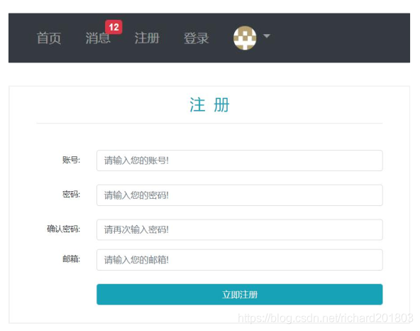

# 1 发送邮件
## 邮箱设置
启用客户端`SMTP`服务，来发送邮件
新浪chengzhifunice@sina.com
密码wifi
0b221714e207ccc0

最后选择qq邮箱

ejvpgogekrngdeff


##  Spring Email
 ### 导入 jar 包
 

```powershell
		<dependency>
			<groupId>org.springframework.boot</groupId>
			<artifactId>spring-boot-starter-mail</artifactId>
			<version>2.5.0</version>
		</dependency>
```
### 邮箱参数配置
```yaml
# MailProperties
spring.mail.host=smtp.qq.com
spring.mail.port=465
spring.mail.username=3213782212@qq.com
spring.mail.password=ejvpgogekrngdeff
spring.mail.protocol=smtps
# STARTTLS[1]  是对纯文本通信协议的扩展。它提供一种方式将纯文本连接升级为加密连接（TLS或SSL），而不是另外使用一个端口作加密通信
spring.mail.properties.mail.smtp.starttls.enable=true
spring.mail.properties.mail.smtp.starttls.required=true

```
### 使用 `JavaMailSender `发送邮件
创建一个util包专门存放工具类
MailClient.java

```java

@Component
//需要spring容器管理，@Component表示通用在哪个层次都可以用
public class MailClient {
    //当前的类来命名
    private static final Logger logger = LoggerFactory.getLogger(MailClient.class);
    //核心组件直接注入，由spring管理
    @Autowired
    private JavaMailSender mailSender;

    //通过key注入到bean里
    //spring.mail.username=chengzhifunice@sina.com
    @Value("${spring.mail.username}")
    private String from;//发件人
    /**
     *
     * @param to 收件人
     * @param subject 标题
     * @param content 内容
     */
    public void sendMail(String to, String subject, String content) {
        try {
            //构建
            MimeMessage message = mailSender.createMimeMessage();
            //帮助类构造详细内容
            MimeMessageHelper helper = new MimeMessageHelper(message);
            helper.setFrom(from);//设置发件人
            helper.setTo(to);//设置收件人
            helper.setSubject(subject);//设置主题
            helper.setText(content, true); //加true支持html
            mailSender.send(helper.getMimeMessage()); //发送出去，从helper里取到构建好的内容
        } catch (MessagingException e) {
            logger.error("发送邮件失败" + e.getMessage());
        }
    }
}

```

## 模板引擎
使用 `Thymeleaf `发送 HTML 邮件
写一个模板

```yaml
<!DOCTYPE html>
<html lang="en" xmlns:th="http://www.thymeleaf.org">
<head>
    <meta charset="UTF-8">
    <title>邮件示例</title>
</head>
<body>
    <p>欢迎你, <span style="color:#ff0000;" th:text="${username}"></span>!</p>
</body>
</html>
```
如何用模板引擎调用模板
MVC情况下，controller里面返回模板路径就好，这里发邮件测试那就主动调用 @Autowired
    private TemplateEngine templateEngine;

然后写个测试类测试
发邮件的事给qq去做。 

```java
@RunWith(SpringRunner.class)
@SpringBootTest
//测试代码以某一个为配置类
@ContextConfiguration(classes = CommunityApplication.class)
public class MailTests {
    @Autowired
    private MailClient mailClient; //1 注入组件
    @Autowired
    private TemplateEngine templateEngine;

    //简单文本测试
    @Test
    public void testTextMail() {
        mailClient.sendMail("chengzhifu2016@gmail.com", "TEST", "Welcome.");
    }

    //调用动态模板
    @Test
    public void testHtmlMail() {
        Context context = new Context();
        context.setVariable("username", "sunday");

        String content = templateEngine.process("/mail/demo", context);
        System.out.println(content);

        mailClient.sendMail("chengzhifu2016@gmail.com", "HTML", content);
    }
}
```

# 2 开发注册功能

Web功能可按照请求拆解 
先开发数据访问
然后业务
然后视图

## 1 访问注册页面
点击顶部区域内的链接，打开注册页面。
简单的页面
### 先创建LoginController

```java
@Controller
public class LoginController {

    @RequestMapping(path = "/register", method = RequestMethod.GET)
    public String getRegisterPage() {
        return "/site/register";
    }
}
```

### 修改register.html
 <header class="bg-dark sticky-top" th:replace = "index::header"> 使用在index里面的fragment的复用
 修改路径
 <script th:src="@{/js/global.js}"></script>
<script th:src="@{/js/register.js}"></script>

```html
<!doctype html>
<html lang="en" xmlns:th="http://www.thymeleaf.org">
<head>
    <meta charset="utf-8">
    <meta name="viewport" content="width=device-width, initial-scale=1, shrink-to-fit=no">
    <link rel="icon" href="https://static.nowcoder.com/images/logo_87_87.png"/>
    <link rel="stylesheet" href="https://stackpath.bootstrapcdn.com/bootstrap/4.3.1/css/bootstrap.min.css"
          crossorigin="anonymous">
    <link rel="stylesheet" th:href="@{/css/global.css}"/>
    <link rel="stylesheet" th:href="@{/css/login.css}"/>
    <title>牛客网-注册</title>
</head>
<body>
<div class="nk-container">
    <!-- 头部 -->
    <header class="bg-dark sticky-top" th:replace = "index::header">
        <div class="container">
            <!-- 导航 -->
            <nav class="navbar navbar-expand-lg navbar-dark">
                <!-- logo -->
                <a class="navbar-brand" href="#"></a>
                <button class="navbar-toggler" type="button" data-toggle="collapse"
                        data-target="#navbarSupportedContent" aria-controls="navbarSupportedContent"
                        aria-expanded="false" aria-label="Toggle navigation">
                    <span class="navbar-toggler-icon"></span>
                </button>
                <!-- 功能 -->
                <div class="collapse navbar-collapse" id="navbarSupportedContent">
                    <ul class="navbar-nav mr-auto">
                        <li class="nav-item ml-3 btn-group-vertical">
                            <a class="nav-link" href="../index.html">首页</a>
                        </li>
                        <li class="nav-item ml-3 btn-group-vertical">
                            <a class="nav-link position-relative" href="letter.html">消息<span class="badge badge-danger">12</span></a>
                        </li>
                        <li class="nav-item ml-3 btn-group-vertical">
                            <a class="nav-link" href="register.html">注册</a>
                        </li>
                        <li class="nav-item ml-3 btn-group-vertical">
                            <a class="nav-link" href="login.html">登录</a>
                        </li>
                        <li class="nav-item ml-3 btn-group-vertical dropdown">
                            <a class="nav-link dropdown-toggle" href="#" id="navbarDropdown" role="button"
                               data-toggle="dropdown" aria-haspopup="true" aria-expanded="false">
                                
                            </a>
                            <div class="dropdown-menu" aria-labelledby="navbarDropdown">
                                <a class="dropdown-item text-center" href="profile.html">个人主页</a>
                                <a class="dropdown-item text-center" href="setting.html">账号设置</a>
                                <a class="dropdown-item text-center" href="login.html">退出登录</a>
                                <div class="dropdown-divider"></div>
                                <span class="dropdown-item text-center text-secondary">nowcoder</span>
                            </div>
                        </li>
                    </ul>
                    <!-- 搜索 -->
                    <form class="form-inline my-2 my-lg-0" action="search.html">
                        <input class="form-control mr-sm-2" type="search" aria-label="Search"/>
                        <button class="btn btn-outline-light my-2 my-sm-0" type="submit">搜索</button>
                    </form>
                </div>
            </nav>
        </div>
    </header>

    <!-- 内容 -->
    <div class="main">
        <div class="container pl-5 pr-5 pt-3 pb-3 mt-3 mb-3">
            <h3 class="text-center text-info border-bottom pb-3">注&nbsp;&nbsp;册</h3>
            <form class="mt-5">
                <div class="form-group row">
                    <label for="username" class="col-sm-2 col-form-label text-right">账号:</label>
                    <div class="col-sm-10">
                        <input type="text" class="form-control" id="username" placeholder="请输入您的账号!" required>
                        <div class="invalid-feedback">
                            该账号已存在!
                        </div>
                    </div>
                </div>
                <div class="form-group row mt-4">
                    <label for="password" class="col-sm-2 col-form-label text-right">密码:</label>
                    <div class="col-sm-10">
                        <input type="password" class="form-control" id="password" placeholder="请输入您的密码!" required>
                        <div class="invalid-feedback">
                            密码长度不能小于8位!
                        </div>
                    </div>
                </div>
                <div class="form-group row mt-4">
                    <label for="confirm-password" class="col-sm-2 col-form-label text-right">确认密码:</label>
                    <div class="col-sm-10">
                        <input type="password" class="form-control" id="confirm-password" placeholder="请再次输入密码!"
                               required>
                        <div class="invalid-feedback">
                            两次输入的密码不一致!
                        </div>
                    </div>
                </div>
                <div class="form-group row">
                    <label for="email" class="col-sm-2 col-form-label text-right">邮箱:</label>
                    <div class="col-sm-10">
                        <input type="email" class="form-control" id="email" placeholder="请输入您的邮箱!" required>
                        <div class="invalid-feedback">
                            该邮箱已注册!
                        </div>
                    </div>
                </div>
                <div class="form-group row mt-4">
                    <div class="col-sm-2"></div>
                    <div class="col-sm-10 text-center">
                        <button type="submit" class="btn btn-info text-white form-control">立即注册</button>
                    </div>
                </div>
            </form>
        </div>
    </div>

    <!-- 尾部 -->
    <footer class="bg-dark">
        <div class="container">
            <div class="row">
                <!-- 二维码 -->
                <div class="col-4 qrcode">
                    
                </div>
                <!-- 公司信息 -->
                <div class="col-8 detail-info">
                    <div class="row">
                        <div class="col">
                            <ul class="nav">
                                <li class="nav-item">
                                    <a class="nav-link text-light" href="#">关于我们</a>
                                </li>
                                <li class="nav-item">
                                    <a class="nav-link text-light" href="#">加入我们</a>
                                </li>
                                <li class="nav-item">
                                    <a class="nav-link text-light" href="#">意见反馈</a>
                                </li>
                                <li class="nav-item">
                                    <a class="nav-link text-light" href="#">企业服务</a>
                                </li>
                                <li class="nav-item">
                                    <a class="nav-link text-light" href="#">联系我们</a>
                                </li>
                                <li class="nav-item">
                                    <a class="nav-link text-light" href="#">免责声明</a>
                                </li>
                                <li class="nav-item">
                                    <a class="nav-link text-light" href="#">友情链接</a>
                                </li>
                            </ul>
                        </div>
                    </div>
                    <div class="row">
                        <div class="col">
                            <ul class="nav btn-group-vertical company-info">
                                <li class="nav-item text-white-50">
                                    公司地址：北京市朝阳区大屯路东金泉时代3-2708北京牛客科技有限公司
                                </li>
                                <li class="nav-item text-white-50">
                                    联系方式：010-60728802(电话)&nbsp;&nbsp;&nbsp;&nbsp;admin@nowcoder.com
                                </li>
                                <li class="nav-item text-white-50">
                                    牛客科技©2018 All rights reserved
                                </li>
                                <li class="nav-item text-white-50">
                                    京ICP备14055008号-4 &nbsp;&nbsp;&nbsp;&nbsp;
                                    
                                    京公网安备 11010502036488号
                                </li>
                            </ul>
                        </div>
                    </div>
                </div>
            </div>
        </div>
    </footer>
</div>

<script src="https://code.jquery.com/jquery-3.3.1.min.js" crossorigin="anonymous"></script>
<script src="https://cdnjs.cloudflare.com/ajax/libs/popper.js/1.14.7/umd/popper.min.js"
        crossorigin="anonymous"></script>
<script src="https://stackpath.bootstrapcdn.com/bootstrap/4.3.1/js/bootstrap.min.js" crossorigin="anonymous"></script>
<script th:src="@{/js/global.js}"></script>
<script th:src="@{/js/register.js}"></script>
</body>
</html>

```

### 修改index.html
<header class="bg-dark sticky-top" th:fragment="header"> 实现头部的复用

```html
<!doctype html>
<html lang="en" xmlns:th="http://www.thymeleaf.org">
<head>
	<meta charset="utf-8">
	<meta name="viewport" content="width=device-width, initial-scale=1, shrink-to-fit=no">
	<link rel="icon" href="https://static.nowcoder.com/images/logo_87_87.png"/>
	<link rel="stylesheet" href="https://stackpath.bootstrapcdn.com/bootstrap/4.3.1/css/bootstrap.min.css" crossorigin="anonymous">
	<link rel="stylesheet" th:href="@{/css/global.css}" />
	<title>牛客网-首页</title>
</head>
<body>
<div class="nk-container">
	<!-- 头部 -->
	<header class="bg-dark sticky-top" th:fragment="header">
		<div class="container">
			<!-- 导航 -->
			<nav class="navbar navbar-expand-lg navbar-dark">
				<!-- logo -->
				<a class="navbar-brand" href="#"></a>
				<button class="navbar-toggler" type="button" data-toggle="collapse" data-target="#navbarSupportedContent" aria-controls="navbarSupportedContent" aria-expanded="false" aria-label="Toggle navigation">
					<span class="navbar-toggler-icon"></span>
				</button>
				<!-- 功能 -->
				<div class="collapse navbar-collapse" id="navbarSupportedContent">
					<ul class="navbar-nav mr-auto">
						<li class="nav-item ml-3 btn-group-vertical">
							<a class="nav-link" th:href="@{/index}">首页</a>
						</li>
						<li class="nav-item ml-3 btn-group-vertical">
							<a class="nav-link position-relative" href="site/letter.html">消息<span class="badge badge-danger">12</span></a>
						</li>
						<li class="nav-item ml-3 btn-group-vertical">
							<a class="nav-link" th:href="@{/register}">注册</a>
						</li>
						<li class="nav-item ml-3 btn-group-vertical">
							<a class="nav-link" href="site/login.html">登录</a>
						</li>
						<li class="nav-item ml-3 btn-group-vertical dropdown">
							<a class="nav-link dropdown-toggle" href="#" id="navbarDropdown" role="button" data-toggle="dropdown" aria-haspopup="true" aria-expanded="false">
								
							</a>
							<div class="dropdown-menu" aria-labelledby="navbarDropdown">
								<a class="dropdown-item text-center" href="site/profile.html">个人主页</a>
								<a class="dropdown-item text-center" href="site/setting.html">账号设置</a>
								<a class="dropdown-item text-center" href="site/login.html">退出登录</a>
								<div class="dropdown-divider"></div>
								<span class="dropdown-item text-center text-secondary">nowcoder</span>
							</div>
						</li>
					</ul>
					<!-- 搜索 -->
					<form class="form-inline my-2 my-lg-0" action="site/search.html">
						<input class="form-control mr-sm-2" type="search" aria-label="Search" />
						<button class="btn btn-outline-light my-2 my-sm-0" type="submit">搜索</button>
					</form>
				</div>
			</nav>
		</div>
	</header>

	<!-- 内容 -->
	<div class="main">
		<div class="container">
			<div class="position-relative">
				<!-- 筛选条件 -->
				<ul class="nav nav-tabs mb-3">
					<li class="nav-item">
						<a class="nav-link active" href="#">最新</a>
					</li>
					<li class="nav-item">
						<a class="nav-link" href="#">最热</a>
					</li>
				</ul>
				<button type="button" class="btn btn-primary btn-sm position-absolute rt-0" data-toggle="modal" data-target="#publishModal">我要发布</button>
			</div>
			<!-- 弹出框 -->
			<div class="modal fade" id="publishModal" tabindex="-1" role="dialog" aria-labelledby="publishModalLabel" aria-hidden="true">
				<div class="modal-dialog modal-lg" role="document">
					<div class="modal-content">
						<div class="modal-header">
							<h5 class="modal-title" id="publishModalLabel">新帖发布</h5>
							<button type="button" class="close" data-dismiss="modal" aria-label="Close">
								<span aria-hidden="true">&times;</span>
							</button>
						</div>
						<div class="modal-body">
							<form>
								<div class="form-group">
									<label for="recipient-name" class="col-form-label">标题：</label>
									<input type="text" class="form-control" id="recipient-name">
								</div>
								<div class="form-group">
									<label for="message-text" class="col-form-label">正文：</label>
									<textarea class="form-control" id="message-text" rows="15"></textarea>
								</div>
							</form>
						</div>
						<div class="modal-footer">
							<button type="button" class="btn btn-secondary" data-dismiss="modal">取消</button>
							<button type="button" class="btn btn-primary" id="publishBtn">发布</button>
						</div>
					</div>
				</div>
			</div>
			<!-- 提示框 -->
			<div class="modal fade" id="hintModal" tabindex="-1" role="dialog" aria-labelledby="hintModalLabel" aria-hidden="true">
				<div class="modal-dialog modal-lg" role="document">
					<div class="modal-content">
						<div class="modal-header">
							<h5 class="modal-title" id="hintModalLabel">提示</h5>
						</div>
						<div class="modal-body" id="hintBody">
							发布完毕!
						</div>
					</div>
				</div>
			</div>

			<!-- 帖子列表 -->
			<ul class="list-unstyled">
				<li class="media pb-3 pt-3 mb-3 border-bottom" th:each="map:${discussPosts}">
					<a href="site/profile.html">
						
					</a>
					<div class="media-body">
						<h6 class="mt-0 mb-3">
							<a href="#" th:utext="${map.post.title}">备战春招，面试刷题跟他复习，一个月全搞定！</a>
							<span class="badge badge-secondary bg-primary" th:if="${map.post.type==1}">置顶</span>
							<span class="badge badge-secondary bg-danger" th:if="${map.post.status==1}">精华</span>
						</h6>
						<div class="text-muted font-size-12">
							<u class="mr-3" th:utext="${map.user.username}">寒江雪</u> 发布于 <b th:text="${#dates.format(map.post.createTime,'yyyy-MM-dd HH:mm:ss')}">2019-04-15 15:32:18</b>
							<ul class="d-inline float-right">
								<li class="d-inline ml-2">赞 11</li>
								<li class="d-inline ml-2">|</li>
								<li class="d-inline ml-2">回帖 7</li>
							</ul>
						</div>
					</div>
				</li>
			</ul>
			<!-- 分页 -->
			<nav class="mt-5" th:if="${page.rows>0}">
				<ul class="pagination justify-content-center">
					<li class="page-item">
						<a class="page-link" th:href="@{${page.path}(current=1)}">首页</a>
					</li>
					<li th:class="|page-item ${page.current==1?'disabled':''}|">
						<a class="page-link" th:href="@{${page.path}(current=${page.current-1})}">上一页</a></li>
					<li th:class="|page-item ${i==page.current?'active':''}|" th:each="i:${#numbers.sequence(page.from,page.to)}">
						<a class="page-link" href="#" th:text="${i}">1</a>
					</li>
					<li th:class="|page-item ${page.current==page.total?'disabled':''}|">
						<a class="page-link" th:href="@{${page.path}(current=${page.current+1})}">下一页</a>
					</li>
					<li class="page-item">
						<a class="page-link" th:href="@{${page.path}(current=${page.total})}">末页</a>
					</li>
				</ul>
			</nav>
		</div>
	</div>

	<!-- 尾部 -->
	<footer class="bg-dark">
		<div class="container">
			<div class="row">
				<!-- 二维码 -->
				<div class="col-4 qrcode">
					
				</div>
				<!-- 公司信息 -->
				<div class="col-8 detail-info">
					<div class="row">
						<div class="col">
							<ul class="nav">
								<li class="nav-item">
									<a class="nav-link text-light" href="#">关于我们</a>
								</li>
								<li class="nav-item">
									<a class="nav-link text-light" href="#">加入我们</a>
								</li>
								<li class="nav-item">
									<a class="nav-link text-light" href="#">意见反馈</a>
								</li>
								<li class="nav-item">
									<a class="nav-link text-light" href="#">企业服务</a>
								</li>
								<li class="nav-item">
									<a class="nav-link text-light" href="#">联系我们</a>
								</li>
								<li class="nav-item">
									<a class="nav-link text-light" href="#">免责声明</a>
								</li>
								<li class="nav-item">
									<a class="nav-link text-light" href="#">友情链接</a>
								</li>
							</ul>
						</div>
					</div>
					<div class="row">
						<div class="col">
							<ul class="nav btn-group-vertical company-info">
								<li class="nav-item text-white-50">
									公司地址：北京市朝阳区大屯路东金泉时代3-2708北京牛客科技有限公司
								</li>
								<li class="nav-item text-white-50">
									联系方式：010-60728802(电话)&nbsp;&nbsp;&nbsp;&nbsp;admin@nowcoder.com
								</li>
								<li class="nav-item text-white-50">
									牛客科技©2018 All rights reserved
								</li>
								<li class="nav-item text-white-50">
									京ICP备14055008号-4 &nbsp;&nbsp;&nbsp;&nbsp;
									
									京公网安备 11010502036488号
								</li>
							</ul>
						</div>
					</div>
				</div>
			</div>
		</div>
	</footer>
</div>

<script src="https://code.jquery.com/jquery-3.3.1.min.js" crossorigin="anonymous"></script>
<script src="https://cdnjs.cloudflare.com/ajax/libs/popper.js/1.14.7/umd/popper.min.js" crossorigin="anonymous"></script>
<script src="https://stackpath.bootstrapcdn.com/bootstrap/4.3.1/js/bootstrap.min.js" crossorigin="anonymous"></script>
<script th:src="@{/js/global.js}"></script>
<script th:src="@{js/index.js}"></script>
</body>
</html>

```

## 2 提交注册数据
第一步： 开发之前导入一包： 判断字符串，集合，空值情况
https://mvnrepository.com/artifact/org.apache.commons/commons-lang3

```xml
<dependency>
    <groupId>org.apache.commons</groupId>
    <artifactId>commons-lang3</artifactId>
    <version>3.12.0</version>
</dependency>

```
第二步： applicationproperties里把网站的域名配置好，因为注册的时候发邮件邮件里面有激活连接，连接得到我的网站，需要把连接做成可变的。

```xml
# community
community.path.domain=http://localhost:8080
community.path.upload=d:/work/data/upload
```
第三步：工具类，提供两个方法注册好用
UUID 生成随机字符串，激活码需要，上传头像，上传文件，需要给文件生成名字。
 MD5加密（只能加密不能解密，并且加上salt），对密码加密。 

```java
public class CommunityUtil {
    // 生成随机字符串
    public static String generateUUID() {
        return UUID.randomUUID().toString().replaceAll("-", "");
    }

    // MD5加密
    // hello -> abc123def456
    // hello + 3e4a8 -> abc123def456abc
    public static String md5(String key) {
        //先对参数为空判断
        if (StringUtils.isBlank(key)) {
            return null;
        }
        //调用spring自带的工具，加密成16进制返回，然后将string转换为Bytes
        return DigestUtils.md5DigestAsHex(key.getBytes());
    }
}
```

```
更改发送激活邮件的html

​```html
<!doctype html>
<html lang="en" xmlns:th="http://www.thymeleaf.org">
<head>
	<meta charset="utf-8">
	<link rel="icon" href="https://static.nowcoder.com/images/logo_87_87.png"/>
	<title>牛客网-激活账号</title>
</head>
<body>
<div>
	<p>
		<b th:text="${email}">xxx@xxx.com</b>, 您好!
	</p>
	<p>
		您正在注册牛客网, 这是一封激活邮件, 请点击
		<a th:href="${url}">此链接</a>,
		激活您的牛客账号!
	</p>
</div>
</body>
</html>
```

通过表单提交数据。
服务端验证账号是否已存在、邮箱是否已注册。
服务端发送激活邮件。
UserServiece

```java
package com.nowcoder.community.service;

import com.nowcoder.community.dao.UserMapper;
import com.nowcoder.community.entity.User;
import com.nowcoder.community.util.CommunityUtil;
import com.nowcoder.community.util.MailClient;
import org.apache.commons.lang3.StringUtils;
import org.springframework.beans.factory.annotation.Autowired;
import org.springframework.beans.factory.annotation.Value;
import org.springframework.stereotype.Service;
import org.thymeleaf.TemplateEngine;
import org.thymeleaf.context.Context;

import java.util.Date;
import java.util.HashMap;
import java.util.Map;
import java.util.Random;

@Service
public class UserService {

    @Autowired
    private UserMapper userMapper;

    @Autowired
    private MailClient mailClient;

    @Autowired
    private TemplateEngine templateEngine;

    //邮件包含激活码和域名项目名 把配置文件中的东西注入
    @Value("${community.path.domain}")
    private String domain;

    @Value("${server.servlet.context-path}")
    private String contextPath;

    public User findUserById(int id) {
        return userMapper.selectById(id);
    }
    //编写注册业务, 返回内容，不能有重复账号，写个map封装多个内容
    public Map<String, Object> register(User user) {
        Map<String, Object> map = new HashMap<>();

        // 空值处理
        if (user == null) {
            throw new IllegalArgumentException("参数不能为空!");
        }
            //user里面的属性
        if (StringUtils.isBlank(user.getUsername())) {
            map.put("usernameMsg", "账号不能为空!");
            return map;
        }
        if (StringUtils.isBlank(user.getPassword())) {
            map.put("passwordMsg", "密码不能为空!");
            return map;
        }
        if (StringUtils.isBlank(user.getEmail())) {
            map.put("emailMsg", "邮箱不能为空!");
            return map;
        }

        // 验证账号是否重复
        User u = userMapper.selectByName(user.getUsername());
        if (u != null) {
            map.put("usernameMsg", "该账号已存在!");
            return map;
        }

        // 验证邮箱
        u = userMapper.selectByEmail(user.getEmail());
        if (u != null) {
            map.put("emailMsg", "该邮箱已被注册!");
            return map;
        }

        // 注册用户，即存入库中，保存之前需要对密码加密，先加上随机salt字符串然后再加密
        user.setSalt(CommunityUtil.generateUUID().substring(0, 5));
        //加密
        user.setPassword(CommunityUtil.md5(user.getPassword() + user.getSalt()));
        //因为只传入了邮箱密码，其他的字段也需要从新设置
        user.setType(0); //普通用户
        user.setStatus(0); //没有激活
        user.setActivationCode(CommunityUtil.generateUUID()); //激活码是随机字符串
        //给一个系统自带的图像
        user.setHeaderUrl(String.format("http://images.nowcoder.com/head/%dt.png", new Random().nextInt(1000)));
        //设置一个创建的时间
        user.setCreateTime(new Date());
        //添加到数据库
        userMapper.insertUser(user);

        // 激活邮件 发的是html
        Context context = new Context();
        context.setVariable("email", user.getEmail());
        // 希望服务器用什么路径处理请求可以自己定101表示用户id，然后code是激活码 http://localhost:8080/community/activation/101/code
        //注意注册的时候用户传过来的没有Id,
        String url = domain + contextPath + "/activation/" + user.getId() + "/" + user.getActivationCode();
        context.setVariable("url", url);
        //模板引擎生成邮件内容
        String content = templateEngine.process("/mail/activation", context);
        //调用mailClient去发邮件
        mailClient.sendMail(user.getEmail(), "激活账号", content);

        //如果map为空 则说明没有问题
        return map;
    }


}

```
然后再来开发控制器Controller,来处理前后端交互的逻辑

- 处理一下模板operate-result，thymeleaf

```html
<!doctype html>
<html lang="en" xmlns:th="http://www.thymeleaf.org">
<head>
	<meta charset="utf-8">
	<meta name="viewport" content="width=device-width, initial-scale=1, shrink-to-fit=no">
	<link rel="icon" href="https://static.nowcoder.com/images/logo_87_87.png"/>
	<link rel="stylesheet" href="https://stackpath.bootstrapcdn.com/bootstrap/4.3.1/css/bootstrap.min.css" crossorigin="anonymous">
	<link rel="stylesheet" th:href="@{/css/global.css}" />
	<title>牛客网-操作结果</title>
</head>
<body class="bg-white">
	<div class="nk-container">
		<!-- 头部 -->
		<header class="bg-dark sticky-top" th:replace = "index::header">
			<div class="container">
				<!-- 导航 -->
				<nav class="navbar navbar-expand-lg navbar-dark">
					<!-- logo -->
					<a class="navbar-brand" href="#"></a>
					<button class="navbar-toggler" type="button" data-toggle="collapse" data-target="#navbarSupportedContent" aria-controls="navbarSupportedContent" aria-expanded="false" aria-label="Toggle navigation">
						<span class="navbar-toggler-icon"></span>
					</button>
					<!-- 功能 -->
					<div class="collapse navbar-collapse" id="navbarSupportedContent">
						<ul class="navbar-nav mr-auto">
							<li class="nav-item ml-3 btn-group-vertical">
								<a class="nav-link" href="../index.html">首页</a>
							</li>
							<li class="nav-item ml-3 btn-group-vertical">
								<a class="nav-link position-relative" href="letter.html">消息<span class="badge badge-danger">12</span></a>
							</li>
							<li class="nav-item ml-3 btn-group-vertical">
								<a class="nav-link" href="register.html">注册</a>
							</li>
							<li class="nav-item ml-3 btn-group-vertical">
								<a class="nav-link" href="login.html">登录</a>
							</li>
							<li class="nav-item ml-3 btn-group-vertical dropdown">
								<a class="nav-link dropdown-toggle" href="#" id="navbarDropdown" role="button" data-toggle="dropdown" aria-haspopup="true" aria-expanded="false">
									
								</a>
								<div class="dropdown-menu" aria-labelledby="navbarDropdown">
									<a class="dropdown-item text-center" href="profile.html">个人主页</a>
									<a class="dropdown-item text-center" href="setting.html">账号设置</a>
									<a class="dropdown-item text-center" href="login.html">退出登录</a>
									<div class="dropdown-divider"></div>
									<span class="dropdown-item text-center text-secondary">nowcoder</span>
								</div>
							</li>
						</ul>
						<!-- 搜索 -->
						<form class="form-inline my-2 my-lg-0" action="search.html">
							<input class="form-control mr-sm-2" type="search" aria-label="Search" />
							<button class="btn btn-outline-light my-2 my-sm-0" type="submit">搜索</button>
						</form>
					</div>
				</nav>
			</div>
		</header>

		<!-- 内容 -->
		<div class="main">
			<div class="container mt-5">
				<div class="jumbotron">
					<p class="lead" th:text="${msg}">您的账号已经激活成功,可以正常使用了!</p>
					<hr class="my-4">
					<p>
						系统会在 <span id="seconds" class="text-danger">8</span> 秒后自动跳转,
						您也可以点此 <a id="target" th:href="@{${target}}" class="text-primary">链接</a>, 手动跳转!
					</p>
				</div>
			</div>
		</div>

		<!-- 尾部 -->
		<footer class="bg-dark">
			<div class="container">
				<div class="row">
					<!-- 二维码 -->
					<div class="col-4 qrcode">
						
					</div>
					<!-- 公司信息 -->
					<div class="col-8 detail-info">
						<div class="row">
							<div class="col">
								<ul class="nav">
									<li class="nav-item">
										<a class="nav-link text-light" href="#">关于我们</a>
									</li>
									<li class="nav-item">
										<a class="nav-link text-light" href="#">加入我们</a>
									</li>
									<li class="nav-item">
										<a class="nav-link text-light" href="#">意见反馈</a>
									</li>
									<li class="nav-item">
										<a class="nav-link text-light" href="#">企业服务</a>
									</li>
									<li class="nav-item">
										<a class="nav-link text-light" href="#">联系我们</a>
									</li>
									<li class="nav-item">
										<a class="nav-link text-light" href="#">免责声明</a>
									</li>
									<li class="nav-item">
										<a class="nav-link text-light" href="#">友情链接</a>
									</li>
								</ul>
							</div>
						</div>
						<div class="row">
							<div class="col">
								<ul class="nav btn-group-vertical company-info">
									<li class="nav-item text-white-50">
										公司地址：北京市朝阳区大屯路东金泉时代3-2708北京牛客科技有限公司
									</li>
									<li class="nav-item text-white-50">
										联系方式：010-60728802(电话)&nbsp;&nbsp;&nbsp;&nbsp;admin@nowcoder.com
									</li>
									<li class="nav-item text-white-50">
										牛客科技©2018 All rights reserved
									</li>
									<li class="nav-item text-white-50">
										京ICP备14055008号-4 &nbsp;&nbsp;&nbsp;&nbsp;
										
										京公网安备 11010502036488号
									</li>
								</ul>
							</div>
						</div>
					</div>
				</div>
			</div>
		</footer>
	</div>

	<script src="https://code.jquery.com/jquery-3.3.1.min.js" crossorigin="anonymous"></script>
	<script src="https://cdnjs.cloudflare.com/ajax/libs/popper.js/1.14.7/umd/popper.min.js" crossorigin="anonymous"></script>
	<script src="https://stackpath.bootstrapcdn.com/bootstrap/4.3.1/js/bootstrap.min.js" crossorigin="anonymous"></script>
	<script>
		$(function(){
			setInterval(function(){
				var seconds = $("#seconds").text();
				$("#seconds").text(--seconds);
				if(seconds == 0) {
					location.href = $("#target").attr("href");
				}
			}, 1000);
		});
	</script>
</body>
</html>
```
- 注册页面

```html
<!doctype html>
<html lang="en" xmlns:th="http://www.thymeleaf.org">
<head>
    <meta charset="utf-8">
    <meta name="viewport" content="width=device-width, initial-scale=1, shrink-to-fit=no">
    <link rel="icon" href="https://static.nowcoder.com/images/logo_87_87.png"/>
    <link rel="stylesheet" href="https://stackpath.bootstrapcdn.com/bootstrap/4.3.1/css/bootstrap.min.css"
          crossorigin="anonymous">
    <link rel="stylesheet" th:href="@{/css/global.css}"/>
    <link rel="stylesheet" th:href="@{/css/login.css}"/>
    <title>牛客网-注册</title>
</head>
<body>
<div class="nk-container">
    <!-- 头部 -->
    <header class="bg-dark sticky-top" th:replace = "index::header">
        <div class="container">
            <!-- 导航 -->
            <nav class="navbar navbar-expand-lg navbar-dark">
                <!-- logo -->
                <a class="navbar-brand" href="#"></a>
                <button class="navbar-toggler" type="button" data-toggle="collapse"
                        data-target="#navbarSupportedContent" aria-controls="navbarSupportedContent"
                        aria-expanded="false" aria-label="Toggle navigation">
                    <span class="navbar-toggler-icon"></span>
                </button>
                <!-- 功能 -->
                <div class="collapse navbar-collapse" id="navbarSupportedContent">
                    <ul class="navbar-nav mr-auto">
                        <li class="nav-item ml-3 btn-group-vertical">
                            <a class="nav-link" href="../index.html">首页</a>
                        </li>
                        <li class="nav-item ml-3 btn-group-vertical">
                            <a class="nav-link position-relative" href="letter.html">消息<span class="badge badge-danger">12</span></a>
                        </li>
                        <li class="nav-item ml-3 btn-group-vertical">
                            <a class="nav-link" href="register.html">注册</a>
                        </li>
                        <li class="nav-item ml-3 btn-group-vertical">
                            <a class="nav-link" href="login.html">登录</a>
                        </li>
                        <li class="nav-item ml-3 btn-group-vertical dropdown">
                            <a class="nav-link dropdown-toggle" href="#" id="navbarDropdown" role="button"
                               data-toggle="dropdown" aria-haspopup="true" aria-expanded="false">
                                
                            </a>
                            <div class="dropdown-menu" aria-labelledby="navbarDropdown">
                                <a class="dropdown-item text-center" href="profile.html">个人主页</a>
                                <a class="dropdown-item text-center" href="setting.html">账号设置</a>
                                <a class="dropdown-item text-center" href="login.html">退出登录</a>
                                <div class="dropdown-divider"></div>
                                <span class="dropdown-item text-center text-secondary">nowcoder</span>
                            </div>
                        </li>
                    </ul>
                    <!-- 搜索 -->
                    <form class="form-inline my-2 my-lg-0" action="search.html">
                        <input class="form-control mr-sm-2" type="search" aria-label="Search"/>
                        <button class="btn btn-outline-light my-2 my-sm-0" type="submit">搜索</button>
                    </form>
                </div>
            </nav>
        </div>
    </header>

    <!-- 内容 -->
    <div class="main">
        <div class="container pl-5 pr-5 pt-3 pb-3 mt-3 mb-3">
            <h3 class="text-center text-info border-bottom pb-3">注&nbsp;&nbsp;册</h3>
            <form class="mt-5" method="post" th:action="@{/register}">
                <div class="form-group row">
                    <label for="username" class="col-sm-2 col-form-label text-right">账号:</label>
                    <div class="col-sm-10">
                        <input type="text"
                               th:class="|form-control ${usernameMsg!=null?'is-invalid':''}|"
                               th:value="${user!=null?user.username:''}"
                               id="username" name="username" placeholder="请输入您的账号!" required>
                        <div class="invalid-feedback" th:text="${usernameMsg}">
                            该账号已存在!
                        </div>
                    </div>
                </div>
                <div class="form-group row mt-4">
                    <label for="password" class="col-sm-2 col-form-label text-right">密码:</label>
                    <div class="col-sm-10">
                        <input type="password"
                               th:class="|form-control ${passwordMsg!=null?'is-invalid':''}|"
                               th:value="${user!=null?user.password:''}"
                               id="password" name="password" placeholder="请输入您的密码!" required>
                        <div class="invalid-feedback" th:text="${passwordMsg}">
                            密码长度不能小于8位!
                        </div>
                    </div>
                </div>
                <div class="form-group row mt-4">
                    <label for="confirm-password" class="col-sm-2 col-form-label text-right">确认密码:</label>
                    <div class="col-sm-10">
                        <input type="password" class="form-control"
                               th:value="${user!=null?user.password:''}"
                               id="confirm-password" placeholder="请再次输入密码!"
                               required>
                        <div class="invalid-feedback">
                            两次输入的密码不一致!
                        </div>
                    </div>
                </div>
                <div class="form-group row">
                    <label for="email" class="col-sm-2 col-form-label text-right">邮箱:</label>
                    <div class="col-sm-10">
                        <input type="email"
                               th:class="|form-control ${emailMsg!=null?'is-invalid':''}|"
                               th:value="${user!=null?user.email:''}"
                               id="email" name="email" placeholder="请输入您的邮箱!" required>
                        <div class="invalid-feedback" th:text="${emailMsg}">
                            该邮箱已注册!
                        </div>
                    </div>
                </div>
                <div class="form-group row mt-4">
                    <div class="col-sm-2"></div>
                    <div class="col-sm-10 text-center">
                        <button type="submit" class="btn btn-info text-white form-control">立即注册</button>
                    </div>
                </div>
            </form>
        </div>
    </div>

    <!-- 尾部 -->
    <footer class="bg-dark">
        <div class="container">
            <div class="row">
                <!-- 二维码 -->
                <div class="col-4 qrcode">
                    
                </div>
                <!-- 公司信息 -->
                <div class="col-8 detail-info">
                    <div class="row">
                        <div class="col">
                            <ul class="nav">
                                <li class="nav-item">
                                    <a class="nav-link text-light" href="#">关于我们</a>
                                </li>
                                <li class="nav-item">
                                    <a class="nav-link text-light" href="#">加入我们</a>
                                </li>
                                <li class="nav-item">
                                    <a class="nav-link text-light" href="#">意见反馈</a>
                                </li>
                                <li class="nav-item">
                                    <a class="nav-link text-light" href="#">企业服务</a>
                                </li>
                                <li class="nav-item">
                                    <a class="nav-link text-light" href="#">联系我们</a>
                                </li>
                                <li class="nav-item">
                                    <a class="nav-link text-light" href="#">免责声明</a>
                                </li>
                                <li class="nav-item">
                                    <a class="nav-link text-light" href="#">友情链接</a>
                                </li>
                            </ul>
                        </div>
                    </div>
                    <div class="row">
                        <div class="col">
                            <ul class="nav btn-group-vertical company-info">
                                <li class="nav-item text-white-50">
                                    公司地址：北京市朝阳区大屯路东金泉时代3-2708北京牛客科技有限公司
                                </li>
                                <li class="nav-item text-white-50">
                                    联系方式：010-60728802(电话)&nbsp;&nbsp;&nbsp;&nbsp;admin@nowcoder.com
                                </li>
                                <li class="nav-item text-white-50">
                                    牛客科技©2018 All rights reserved
                                </li>
                                <li class="nav-item text-white-50">
                                    京ICP备14055008号-4 &nbsp;&nbsp;&nbsp;&nbsp;
                                    
                                    京公网安备 11010502036488号
                                </li>
                            </ul>
                        </div>
                    </div>
                </div>
            </div>
        </div>
    </footer>
</div>

<script src="https://code.jquery.com/jquery-3.3.1.min.js" crossorigin="anonymous"></script>
<script src="https://cdnjs.cloudflare.com/ajax/libs/popper.js/1.14.7/umd/popper.min.js"
        crossorigin="anonymous"></script>
<script src="https://stackpath.bootstrapcdn.com/bootstrap/4.3.1/js/bootstrap.min.js" crossorigin="anonymous"></script>
<script th:src="@{/js/global.js}"></script>
<script th:src="@{/js/register.js}"></script>
</body>
</html>

```
### 测试


## 3 激活注册账号
数据访问层不用
最终需要用户的状态，数据访问usermapper已经写了，直接在service层加一个业务即可

激活成功没有问题 点了邮箱链接重复激活，以后的重复的没有意义，给出提示 激活码伪造 将这三种情况放到常量里可以复用
定义一个，CommunityConstant

```java
public interface CommunityConstant {

    /**
     * 激活成功
     */
    int ACTIVATION_SUCCESS = 0;

    /**
     * 重复激活
     */
    int ACTIVATION_REPEAT = 1;

    /**
     * 激活失败
     */
    int ACTIVATION_FAILURE = 2;

    /**
     * 默认状态的登录凭证的超时时间
     */
    int DEFAULT_EXPIRED_SECONDS = 3600 * 12;

    /**
     * 记住状态的登录凭证超时时间
     */
    int REMEMBER_EXPIRED_SECONDS = 3600 * 24 * 100;

}

```
UserService处理这些常量，所以要实现这个接口

```java
  //激活需要用户Id 激活码
    public int activation(int userId, String code) {
        User user = userMapper.selectById(userId);
        if (user.getStatus() == 1) { //表示已经激活 重复了
            return ACTIVATION_REPEAT;
        } else if (user.getActivationCode().equals(code)) {
            userMapper.updateStatus(userId, 1);
            return ACTIVATION_SUCCESS;
        } else {
            return ACTIVATION_FAILURE;
        }
    }

```
然后在LoginController里面处理这个请求，请求的页面就是邮件，邮件就是HTML。

```java
 //处理注册请求，是提交数据，post
    @RequestMapping(path = "/register", method = RequestMethod.POST)
    public String register(Model model, User user) {
        Map<String, Object> map = userService.register(user);
        if (map == null || map.isEmpty()) { //注册成功,跳转到首页，激活以后才能到登录
            model.addAttribute("msg", "注册成功,我们已经向您的邮箱发送了一封激活邮件,请尽快激活!");
            model.addAttribute("target", "/index");
            return "/site/operate-result";
        } else { //失败了
            model.addAttribute("usernameMsg", map.get("usernameMsg"));
            model.addAttribute("passwordMsg", map.get("passwordMsg"));
            model.addAttribute("emailMsg", map.get("emailMsg"));
            //失败了传回去原来的页面
            return "/site/register";
        }
    }

    // http://localhost:8080/community/activation/101/code
    @RequestMapping(path = "/activation/{userId}/{code}", method = RequestMethod.GET)
    public String activation(Model model, @PathVariable("userId") int userId, @PathVariable("code") String code) {
        //从路径中获得参数 然后返回这个结果
        int result = userService.activation(userId, code);
        if (result == ACTIVATION_SUCCESS) {
            model.addAttribute("msg", "激活成功,您的账号已经可以正常使用了!");
            model.addAttribute("target", "/login");
        } else if (result == ACTIVATION_REPEAT) {
            model.addAttribute("msg", "无效操作,该账号已经激活过了!");
            model.addAttribute("target", "/index");
        } else {
            model.addAttribute("msg", "激活失败,您提供的激活码不正确!");
            model.addAttribute("target", "/index");
        }
        return "/site/operate-result";
    }
```
点击邮件中的链接，访问服务端的激活服务。
复用
<header class="bg-dark sticky-top" th:fragment="header">

# 3 会话管理
登录功能需要会话管理方面的内容
## HTTP的基本性质
HTTP是简单的
HTTP是可扩展的
HTTP是无状态的，有会话的


## Cookie
想要服务器记住浏览器，浏览器在访问服务器的时候，服务器可以创建Cookie对象
是服务器发送到浏览器，并保存在浏览器端的一小块数据。
浏览器下次访问该服务器时，会自动携带块该数据，将其发送给服务器。
## Session
是JavaEE的标准，用于在服务端记录客户端信息。
数据存放在服务端更加安全，但是也会增加服务端的内存压力。