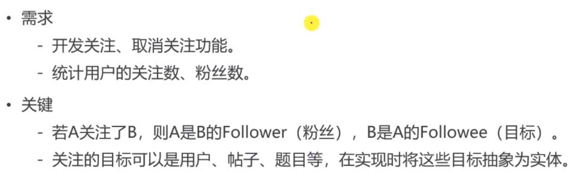
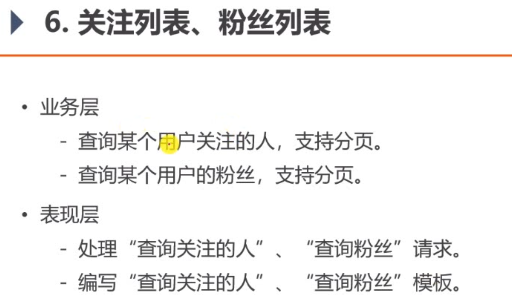
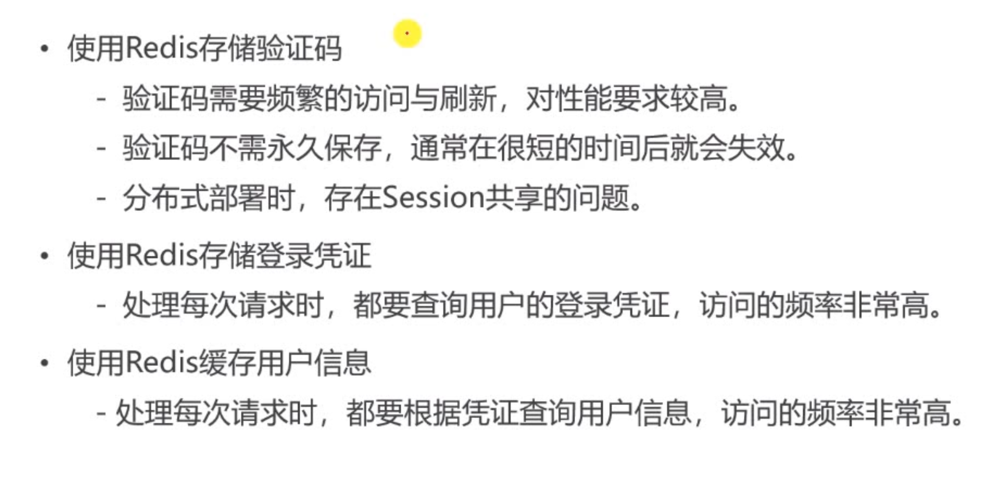

# 4.10 点赞
##  点赞
redis存到内存里

- 支持对帖子、评论点赞。
数据访问层是kv 直接写业务层，直接调用redistemplate
key是编程关键，为了让key复用，容易记住，redis写一个工具专门用来生成key.

-  第1次点赞，第2次取消点赞。
1.  RedisKeyUtil.java

```java
public class RedisKeyUtil {

    private static final String SPLIT = ":"; //分割
    private static final String PREFIX_ENTITY_LIKE = "like:entity";
    private static final String PREFIX_USER_LIKE = "like:user";
    private static final String PREFIX_FOLLOWEE = "followee";
    private static final String PREFIX_FOLLOWER = "follower";
    private static final String PREFIX_KAPTCHA = "kaptcha";
    private static final String PREFIX_TICKET = "ticket";
    private static final String PREFIX_USER = "user";

    // 某个实体的赞 准备key
    // like:entity:entityType:entityId -> set(userId)
    public static String getEntityLikeKey(int entityType, int entityId) {
        return PREFIX_ENTITY_LIKE + SPLIT + entityType + SPLIT + entityId; //实体的key
    }

    // 某个用户的赞
    // like:user:userId -> int
    public static String getUserLikeKey(int userId) {
        return PREFIX_USER_LIKE + SPLIT + userId;
    }

    // 某个用户关注的实体
    // followee:userId:entityType -> zset(entityId,now)
    public static String getFolloweeKey(int userId, int entityType) {
        return PREFIX_FOLLOWEE + SPLIT + userId + SPLIT + entityType;
    }

    // 某个实体拥有的粉丝
    // follower:entityType:entityId -> zset(userId,now)
    public static String getFollowerKey(int entityType, int entityId) {
        return PREFIX_FOLLOWER + SPLIT + entityType + SPLIT + entityId;
    }

    // 登录验证码
    public static String getKaptchaKey(String owner) {
        return PREFIX_KAPTCHA + SPLIT + owner;
    }

    // 登录的凭证
    public static String getTicketKey(String ticket) {
        return PREFIX_TICKET + SPLIT + ticket;
    }

    // 用户
    public static String getUserKey(int userId) {
        return PREFIX_USER + SPLIT + userId;
    }

}

```

2. LikeService 

```java
@Service
public class LikeService {

    @Autowired
    private RedisTemplate redisTemplate;

    // 点赞  点赞的实体
    public void like(int userId, int entityType, int entityId, int entityUserId) {
        redisTemplate.execute(new SessionCallback() {
            @Override
            public Object execute(RedisOperations operations) throws DataAccessException {
                String entityLikeKey = RedisKeyUtil.getEntityLikeKey(entityType, entityId); //拼出key
                String userLikeKey = RedisKeyUtil.getUserLikeKey(entityUserId);

                boolean isMember = operations.opsForSet().isMember(entityLikeKey, userId); //判断有没有在里面，点过赞了

                operations.multi();

                if (isMember) { //点赞了
                    operations.opsForSet().remove(entityLikeKey, userId);
                    operations.opsForValue().decrement(userLikeKey);
                } else { //没点赞
                    operations.opsForSet().add(entityLikeKey, userId);
                    operations.opsForValue().increment(userLikeKey);
                }

                return operations.exec();
            }
        });
    }

    // 查询某实体点赞的数量
    public long findEntityLikeCount(int entityType, int entityId) {
        String entityLikeKey = RedisKeyUtil.getEntityLikeKey(entityType, entityId);
        return redisTemplate.opsForSet().size(entityLikeKey);
    }

    // 查询某人对某实体的点赞状态 业务扩展可能还有踩
    public int findEntityLikeStatus(int userId, int entityType, int entityId) {
        String entityLikeKey = RedisKeyUtil.getEntityLikeKey(entityType, entityId);
        return redisTemplate.opsForSet().isMember(entityLikeKey, userId) ? 1 : 0; //1 就是赞
    }

    // 查询某个用户获得的赞
    public int findUserLikeCount(int userId) {
        String userLikeKey = RedisKeyUtil.getUserLikeKey(userId);
        Integer count = (Integer) redisTemplate.opsForValue().get(userLikeKey);
        return count == null ? 0 : count.intValue();
    }

}
```

4. LikeController

```java
@Controller
public class LikeController {

    @Autowired
    private LikeService likeService; //调用点赞业务

    @Autowired
    private HostHolder hostHolder; //当前用户点赞

    @RequestMapping(path = "/like", method = RequestMethod.POST)
    @ResponseBody
    public String like(int entityType, int entityId, int entityUserId) { //处理异步请求
        User user = hostHolder.getUser(); //获取当前用户

        // 点赞
        likeService.like(user.getId(), entityType, entityId, entityUserId);

        // 数量
        long likeCount = likeService.findEntityLikeCount(entityType, entityId);
        // 状态
        int likeStatus = likeService.findEntityLikeStatus(user.getId(), entityType, entityId);
        // 返回的结果
        Map<String, Object> map = new HashMap<>();
        map.put("likeCount", likeCount);
        map.put("likeStatus", likeStatus);

        return CommunityUtil.getJSONString(0, null, map);
    }

}

```

6. discuss-detail.html
里面修改赞
eg

```java
<a href="javascript:;" th:onclick="|like(this,2,${rvo.reply.id},${rvo.reply.userId});|" class="text-primary">
													<b th:text="${rvo.likeStatus==1?'已赞':'赞'}">赞</b>(<i th:text="${rvo.likeCount}">1</i>)
												</a>
```

5.写discuss.js

```java
function like(btn, entityType, entityId, entityUserId) {
    $.post(
        CONTEXT_PATH + "/like",
        {"entityType":entityType,"entityId":entityId,"entityUserId":entityUserId},
        function(data) {
            data = $.parseJSON(data);
            if(data.code == 0) {
                // 表示成功
                $(btn).children("i").text(data.likeCount);
                $(btn).children("b").text(data.likeStatus==1?'已赞':"赞");
            } else {
                alert(data.msg);
            }
        }
    );
}
```
index.html

```java
<li class="d-inline ml-2">赞 <span th:text="${map.likeCount}">11</span></li>
								<li class="d-inline ml-2">|</li>
								<li class="d-inline ml-2">回帖 <span th:text="${map.post.commentCount}">7</span></li>
```

## 首页点赞数量
- 统计帖子的点赞数量。
##  详情页点赞数量
- 统计点赞数量。
- 显示点赞状态。
##  重构点赞功能

以用户为key，记录点赞数量

1. RedisKeyUtil
```java
// 某个用户的赞
    // like:user:userId -> int
    public static String getUserLikeKey(int userId) {
        return PREFIX_USER_LIKE + SPLIT + userId;
    }
```
2. LikeService 
```java
// 查询某个用户获得的赞
    public int findUserLikeCount(int userId) {
        String userLikeKey = RedisKeyUtil.getUserLikeKey(userId);
        Integer count = (Integer) redisTemplate.opsForValue().get(userLikeKey);
        return count == null ? 0 : count.intValue();
    }
```
3. LikeController

```java
 public String like(int entityType, int entityId, int entityUserId) { //处理异步请求
```
4. discuss-detail.html

```java

```


increment(key)，decrement(key)
## 开发个人主页
以用户为key，查询点赞数量

1. UserController.java
```java
 // 个人主页
    @RequestMapping(path = "/profile/{userId}", method = RequestMethod.GET)
    public String getProfilePage(@PathVariable("userId") int userId, Model model) {
        User user = userService.findUserById(userId);
        if (user == null) {
            throw new RuntimeException("该用户不存在!");
        }

        // 用户
        model.addAttribute("user", user);
        // 点赞数量
        int likeCount = likeService.findUserLikeCount(userId);
        model.addAttribute("likeCount", likeCount);
            return "/site/profile";
```

index.html

```java
<a th:href="@{|/user/profile/${map.user.id}|}">
```
然后修改
profile.html

# 关注取消关注






