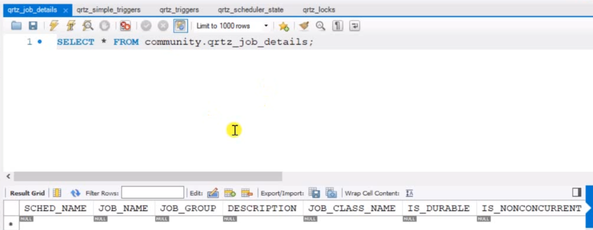

# 7.13 任务执行和调度

有些功能是服务器定时启动和运行的，每隔有段时间需要计算分数，清理文件等等。

这个时候需要任务调度的组件，是基于多线程的。程序中都是通过线程池来使用的。因为创建线程需要资源，所以线程池节约资源。面试一定会问！

使用QUARTZ工具。

==JDK==自带线程池，常用的有，

`ExecutorService`普通线程池解决一些问题

`ScheduledExcutorService` 创建的线程能隔一段事件执行任务

==Spring==框架也有内部的线程池

`ThreadPoolTaskExecutor`

`ThreadPoolTaskScheduler`创建的线程能隔一段事件执行任务

==分布式==定时任务

使用`Spring Quartz`使用spring整合它。

分布式环境下使用**前两者的问题**： 

分布式表示服务器多个形成一个集群，服务器1里面有两类程序一个是普通程序，controller能够解决普通请求。里面还有一类scheduler解决定时任务。集群环境下浏览器不是直接访问，浏览器访问负载均衡Nginx, 浏览器发出请求是发给Nginx, Nginx会根据策略会分给某服务器，对于一个请求只有一个服务器处理。 但是对于定时任务来说，两个服务器都有定时任务，不用访问自己在跑。比如每隔一段事件清理，可能发生冲突，所以**JDK或者spring的就不合适，没有解决分布式部署的问题！！** 所以Spring Quartz能解决。


Spring和JDK定时任务组件是**基于内存**的，配置它定时会在内存里，服务器之间不数据共享。但是**Quartz的程序运行参数存在数据库**里，程序都会访 问同一个DB, 同时访问也可以加锁去抢。


[http://www.quartz-scheduler.org/](http://www.quartz-scheduler.org/)

## 写一些test

spring线程池需要配置

```xml
# TaskExecutionProperties 普通线程池
spring.task.execution.pool.core-size=5 默认得到5个
spring.task.execution.pool.max-size=15 不够用默认扩容到15 
spring.task.execution.pool.queue-capacity=100 队列容量 线程不够用可以先把任务放到队列里 提供缓存作用

# TaskSchedulingProperties 定时任务
spring.task.scheduling.pool.size=5
```

config需要做线程池配置类

```java
@Configuration
@EnableScheduling
@EnableAsync
public class ThreadPoolConfig {
}
```

AlphaService.java里试一下简单的

```java
// 让该方法在多线程环境下,被异步的调用.
@Async
public void execute1() {
    logger.debug("execute1");
}

@Scheduled(initialDelay = 10000, fixedRate = 1000)
public void execute2() {
    logger.debug("execute2");
}

```

ThreadPoolTests.java

```java
@RunWith(SpringRunner.class)
@SpringBootTest
@ContextConfiguration(classes = CommunityApplication.class)
public class ThreadPoolTests {

    private static final Logger logger = LoggerFactory.getLogger(ThreadPoolTests.class); //可以带上线程id和时间

    // JDK普通线程池
    private ExecutorService executorService = Executors.newFixedThreadPool(5);

    // JDK可执行定时任务的线程池
    private ScheduledExecutorService scheduledExecutorService = Executors.newScheduledThreadPool(5);

    // Spring普通线程池
    @Autowired
    private ThreadPoolTaskExecutor taskExecutor;

    // Spring可执行定时任务的线程池
    @Autowired
    private ThreadPoolTaskScheduler taskScheduler;

    @Autowired
    private AlphaService alphaService;

    private void sleep(long m) {
        try {
            Thread.sleep(m);
        } catch (InterruptedException e) {
            e.printStackTrace();
        }
    }

    // 1.JDK普通线程池
    @Test
    public void testExecutorService() {
        Runnable task = new Runnable() {
            @Override
            public void run() {
                logger.debug("Hello ExecutorService");
            }
        };

        for (int i = 0; i < 10; i++) {
            executorService.submit(task);
        } 

        sleep(10000);
    }

    // 2.JDK定时任务线程池
    @Test
    public void testScheduledExecutorService() {
        Runnable task = new Runnable() {
            @Override
            public void run() {
                logger.debug("Hello ScheduledExecutorService");
            }
        };

        //固定的时间来执行
        scheduledExecutorService.scheduleAtFixedRate(task, 10000, 1000, TimeUnit.MILLISECONDS);

        sleep(30000);
    }

    // 3.Spring普通线程池
    @Test
    public void testThreadPoolTaskExecutor() {
        Runnable task = new Runnable() {
            @Override
            public void run() {
                logger.debug("Hello ThreadPoolTaskExecutor");
            }
        };

        for (int i = 0; i < 10; i++) {
            taskExecutor.submit(task);
        }

        sleep(10000);
    }

    // 4.Spring定时任务线程池
    @Test
    public void testThreadPoolTaskScheduler() {
        Runnable task = new Runnable() {
            @Override
            public void run() {
                logger.debug("Hello ThreadPoolTaskScheduler");
            }
        };

        Date startTime = new Date(System.currentTimeMillis() + 10000);
        taskScheduler.scheduleAtFixedRate(task, startTime, 1000);

        sleep(30000);
    }

    // 5.Spring普通线程池(简化)
    @Test
    public void testThreadPoolTaskExecutorSimple() {
        for (int i = 0; i < 10; i++) {
            alphaService.execute1();
        }

        sleep(10000);
    }

    // 6.Spring定时任务线程池(简化) 自动被调的方法execute2
    @Test
    public void testThreadPoolTaskSchedulerSimple() {
        sleep(30000);
    }
}
```

## Quartz

Quartz是依赖数据库，所以有一个表需要自己创建

核心组件关系：

Scheduler调度器是它的核心，

- 1 定义任务通过Job接口里面的execute()方法要告知需要写上什么任务
- 需要进行配置需要**JobDetail**配置job，名字组，描述。**Tigger**是触发，job什么时候运行，以什么样的频率运行。

配置只在第一次启动服务的时候用，后面不用了



### 定义任务

1. 新建quartz包，创建AlphaJob.java

```java
public class AlphaJob implements Job {
    @Override
    public void execute(JobExecutionContext context) throws JobExecutionException {
        System.out.println(Thread.currentThread().getName() + ": execute a quartz job.");
    }
}
```

2. 对quartz配置，这样才能读取信息，生成表里的数据。QuartzConfig

```java
// 配置 -> 数据库 -> 调用   以后直接访问数据库调用而不是访问这个配置文件
@Configuration
public class QuartzConfig {

    // FactoryBean可简化Bean的实例化过程:
    // 1.通过FactoryBean封装Bean的实例化过程.
    // 2.将FactoryBean装配到Spring容器里.
    // 3.将FactoryBean注入给其他的Bean.
    // 4.该Bean得到的是FactoryBean所管理的对象实例.
 
    // 配置JobDetail
     @Bean
    public JobDetailFactoryBean alphaJobDetail() {
        JobDetailFactoryBean factoryBean = new JobDetailFactoryBean();
        factoryBean.setJobClass(AlphaJob.class);//声明管理的bean
        factoryBean.setName("alphaJob");
        factoryBean.setGroup("alphaJobGroup");
        factoryBean.setDurability(true);
        factoryBean.setRequestsRecovery(true);
        return factoryBean;
    }

    // 配置Trigger(SimpleTriggerFactoryBean, CronTriggerFactoryBean)
    //SimpleTriggerFactoryBean 简单隔一段时间解决问题
    //CronTriggerFactoryBean 每个月半夜两点，每周五晚上触发
    //alphaJobDetail 将bean注入
     @Bean
    public SimpleTriggerFactoryBean alphaTrigger(JobDetail alphaJobDetail) {
        SimpleTriggerFactoryBean factoryBean = new SimpleTriggerFactoryBean();
        factoryBean.setJobDetail(alphaJobDetail);
        factoryBean.setName("alphaTrigger");
        factoryBean.setGroup("alphaTriggerGroup");
        factoryBean.setRepeatInterval(3000);
        factoryBean.setJobDataMap(new JobDataMap());//trigger底层需要存储Job状态，指定对象
        return factoryBean;
    }
}

```


3. 配置文件 线程池

```xml
# QuartzProperties
spring.quartz.job-store-type=jdbc
spring.quartz.scheduler-name=communityScheduler
spring.quartz.properties.org.quartz.scheduler.instanceId=AUTO
spring.quartz.properties.org.quartz.jobStore.class=org.quartz.impl.jdbcjobstore.JobStoreTX
spring.quartz.properties.org.quartz.jobStore.driverDelegateClass=org.quartz.impl.jdbcjobstore.StdJDBCDelegate
spring.quartz.properties.org.quartz.jobStore.isClustered=true
spring.quartz.properties.org.quartz.threadPool.class=org.quartz.simpl.SimpleThreadPool
spring.quartz.properties.org.quartz.threadPool.threadCount=5
```


4. 数据已经进表了，一旦启动读数据就会运行，可以写程序把表里的数据删掉

```java
@RunWith(SpringRunner.class)
@SpringBootTest
@ContextConfiguration(classes = CommunityApplication.class)
public class QuartzTests {

    @Autowired
    private Scheduler scheduler;

    @Test
    public void testDeleteJob() {
        try {
            boolean result = scheduler.deleteJob(new JobKey("alphaJob", "alphaJobGroup"));
            System.out.println(result);
        } catch (SchedulerException e) {
            e.printStackTrace();
        }
    }

}
```

