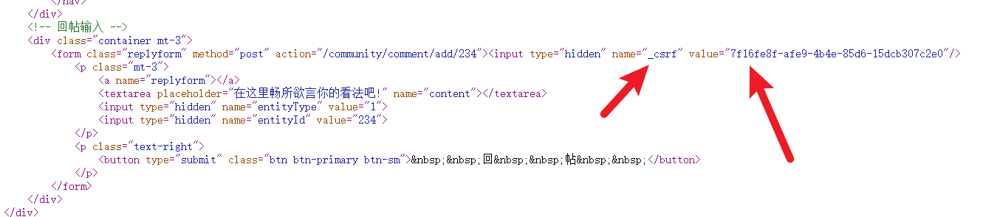

# 7.3 权限控制


之前写过的拦截器需要废弃，Security代替它更安全，功能更强大。把需要控制请求，授权。CSRF: 工具手段。

## 导包，废弃拦截器

```xml
<dependency>
   <groupId>org.springframework.boot</groupId>
   <artifactId>spring-boot-starter-security</artifactId>
</dependency>
```

WebMvcConfig.java

```java
//    @Autowired
//    private LoginRequiredInterceptor loginRequiredInterceptor;
```

## 授权配置

1. 先添加常量

```java
  /**
     * 权限: 普通用户
     */
    String AUTHORITY_USER = "user";

    /**
     * 权限: 管理员
     */
    String AUTHORITY_ADMIN = "admin";

    /**
     * 权限: 版主
     */
    String AUTHORITY_MODERATOR = "moderator";
```

2. Security授权配置，在config包下

SecurityConfig.java

```java
@Configuration
public class SecurityConfig extends WebSecurityConfigurerAdapter implements CommunityConstant {
    //重写里面的三个方法
    @Override
    public void configure(WebSecurity web) throws Exception {
        web.ignoring().antMatchers("/resources/**");//ignore静态资源的拦截
    }

    @Override
    protected void configure(HttpSecurity http) throws Exception {
        // 授权
        http.authorizeRequests()
                .antMatchers(
                        "/user/setting",
                        "/user/upload",
                        "/discuss/add",
                        "/comment/add/**",
                        "/letter/**",
                        "/notice/**",
                        "/like",
                        "/follow",
                        "/unfollow"
                )
                .hasAnyAuthority(
                        AUTHORITY_USER,
                        AUTHORITY_ADMIN,
                        AUTHORITY_MODERATOR
                )
                .anyRequest().permitAll();

        // 权限不够时的处理
        http.exceptionHandling()
                .authenticationEntryPoint(new AuthenticationEntryPoint() {
                    // 没有登录时候的处理
                    @Override
                    public void commence(HttpServletRequest request, HttpServletResponse response, AuthenticationException e) throws IOException, ServletException {
                        String xRequestedWith = request.getHeader("x-requested-with");
                        if ("XMLHttpRequest".equals(xRequestedWith)) { //异步请求 不能返回网页 要返回Jason
                            response.setContentType("application/plain;charset=utf-8");
                            PrintWriter writer = response.getWriter();
                            writer.write(CommunityUtil.getJSONString(403, "你还没有登录哦!"));
                        } else { //同步请求
                            response.sendRedirect(request.getContextPath() + "/login");//重定向 跳转返回网页
                        }
                    }
                })
                .accessDeniedHandler(new AccessDeniedHandler() {
                    // 登录了但是权限不足
                    @Override
                    public void handle(HttpServletRequest request, HttpServletResponse response, AccessDeniedException e) throws IOException, ServletException {
                        String xRequestedWith = request.getHeader("x-requested-with");
                        if ("XMLHttpRequest".equals(xRequestedWith)) {
                            response.setContentType("application/plain;charset=utf-8");
                            PrintWriter writer = response.getWriter();
                            writer.write(CommunityUtil.getJSONString(403, "你没有访问此功能的权限!"));
                        } else {
                            response.sendRedirect(request.getContextPath() + "/denied");
                        }
                    }
                });

        // Security底层默认会拦截/logout请求,进行退出处理.
        // 覆盖它默认的逻辑,才能执行我们自己的退出代码. securitylogout不处理 善意欺骗
        http.logout().logoutUrl("/securitylogout");
    }

}
```

3. 由于已经绕过了认证的逻辑，在UserService里加代码，因为最终需要把用户的权限存到SecurityContext里面，用户查到后有啥权限需要做一个适配，根据用户获得用户的权限。 

```java
 //查询用户的权限
    public Collection<? extends GrantedAuthority> getAuthorities(int userId) {
        User user = this.findUserById(userId);

        List<GrantedAuthority> list = new ArrayList<>(); //判断结果放到集合
        list.add(new GrantedAuthority() {

            @Override
            public String getAuthority() {
                switch (user.getType()) {
                    case 1:
                        return AUTHORITY_ADMIN;
                    case 2:
                        return AUTHORITY_MODERATOR;
                    default:
                        return AUTHORITY_USER;
                }
            }
        });
        return list;
    }
```

4. 什么时候获得用户的权限，并且把权限结论存到context里，登录有效才能查权限，所以需要在拦截器里，LoginTicketInterceptor

   登录了就可以得到权限

```java
hostHolder.setUser(user);
// 构建用户认证的结果,并存入SecurityContext,以便于Security进行授权.
Authentication authentication = new UsernamePasswordAuthenticationToken(
        user, user.getPassword(), userService.getAuthorities(user.getId()));
SecurityContextHolder.setContext(new SecurityContextImpl(authentication));//放到context里
complete之后
SecurityContextHolder.clearContext();
```

5. 退出之后认证结果也要清理

```java
@RequestMapping(path = "/logout", method = RequestMethod.GET)
    public String logout(@CookieValue("ticket") String ticket) {
        userService.logout(ticket);
        SecurityContextHolder.clearContext();
        return "redirect:/login";
    }
```

6. CSRF配置

**CSRF攻击原理**： 浏览器已经访问过服务器，服务器给他发了ticket存到了cookie里，此时浏览器已经保存了ticket在cookie。 然后浏览器又向服务器发送请求，是一个get请求，打开的是一个带有表单的页面，服务器给返回这个页面，按理说用户填表然后提交，但是这个时候他停了这个网页去访问另一个网站，但是x网站有病毒，窃取了用户的cookie，所以cookie是不安全能够被窃取到的。所以这个网站可以伪造身份去提交表单，向服务器帮你提交表单post。 

**这种攻击发生在提交表单的时候，咋解决？**

`security`在返回带有表单的页面的时候， security会生成一个隐藏的数据，token. 所以表单里面会带有一个随机生成的token，x网站猜不到token。 


**开启项目调试：**

帖子详情页面打开源代码： 



还有一些情况无法处理，因为异步的时候可能连表单都没有，那咋生成CSRF凭证？需要自己处理

演示发帖index.html

强制要求生成表单即可，通过请求的消息头传， token是value，key是_csrf_header

```java
<!--访问该页面时,在此处生成CSRF令牌.-->
	<meta name="_csrf" th:content="${_csrf.token}">
	<meta name="_csrf_header" th:content="${_csrf.headerName}">
```

发布贴子是在当前页面所在的JS里，

```javascript
	// 发送AJAX请求之前,将CSRF令牌设置到请求的消息头中.
   var token = $("meta[name='_csrf']").attr("content");
   var header = $("meta[name='_csrf_header']").attr("content");
   $(document).ajaxSend(function(e, xhr, options){
       xhr.setRequestHeader(header, token);
   });
```

每一个异步请求都必须这样处理。 但是太多了，只需要在security认证那里禁用掉CSRF, 在securityConfig里

```java
.and().csrf().disable();
```

