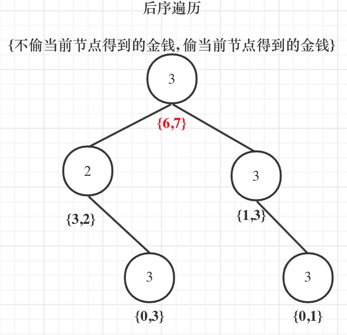

# 动态规划的解题步骤

1. 确定==dp数组==（dp table）以及下标的含义
2. 确定递推公式
3. dp数组如何初始化
4. 确定遍历顺序
5. 举例推导dp数组

#### [509. 斐波那契数](https://leetcode-cn.com/problems/fibonacci-number/)

>该数列由 `0` 和 `1` 开始，后面的每一项数字都是前面两项数字的和。也就是：
>
>```
>F(0) = 0，F(1) = 1
>F(n) = F(n - 1) + F(n - 2)，其中 n > 1
>```
>
>给你 `n` ，请计算 `F(n)` 。
>
>```
>输入：2
>输出：1
>解释：F(2) = F(1) + F(0) = 1 + 0 = 1
>```

1. dp[i]的定义为：第i个数的斐波那契数值是dp[i]

2. **状态转移方程 dp[i] = dp[i - 1] + dp[i - 2];**
3. dp数组如何初始化

```
dp[0] = 0;
dp[1] = 1;
```

4. 从递归公式dp[i] = dp[i - 1] + dp[i - 2];中可以看出，dp[i]是依赖 dp[i - 1] 和 dp[i - 2]，那么遍历的顺序一定是从前到后遍历的

5. 按照这个递推公式dp[i] = dp[i - 1] + dp[i - 2]，我们来推导一下，当N为10的时候，dp数组应该是如下的数列：

   ​	0 1 1 2 3 5 8 13 21 34 55

- 时间复杂度：O(n)
- 空间复杂度：O(1)

| 0    | 1    | 2    | 3    |
| ---- | ---- | ---- | ---- |
| 0    | 1    | 1    | 2    |

n = 3, dp长度=n+ 1 = 3 + 1 = 4

```java
class Solution {
    public int fib(int n) {
        if (n < 2) {
            return n;
        }
        int[] dp = new int[n + 1];//dp的长度确保最后一个元素n也可以被计算到 n + 1是0占了位置
        dp[0]  = 0;
        dp[1] = 1;
        for (int i = 2; i <= n; i++) {
            dp[i] = dp[i - 1] + dp[i - 2];// array[i]!!!
        }
        return dp[n];
    }
}
```

#### [70. 爬楼梯](https://leetcode-cn.com/problems/climbing-stairs/)

>假设你正在爬楼梯。需要 *n* 阶你才能到达楼顶。
>
>每次你可以爬 1 或 2 个台阶。你有多少种不同的==方法==可以爬到楼顶呢？
>
>**注意：**给定 *n* 是一个正整数。
>
>```
>输入： 3
>输出： 3
>解释： 有三种方法可以爬到楼顶。
>1.  1 阶 + 1 阶 + 1 阶
>2.  1 阶 + 2 阶
>3.  2 阶 + 1 阶
>----
>输入： 2
>输出： 2
>解释： 有两种方法可以爬到楼顶。
>1.  1 阶 + 1 阶
>2.  2 阶
>```
>
>第三层楼梯的状态可以由第二层楼梯 和 到第一层楼梯状态推导出来

1. dp[i]： 爬到第i层楼梯，有dp[i]种方法

2. 递推公式: p[i] = dp[i - 1] + dp[i - 2] 

dp[i - 1]，上i-1层楼梯，有dp[i - 1]种方法，那么再一步**跳一个**台阶不就是dp[i]了

dp[i - 2]，上i-2层楼梯，有dp[i - 2]种方法，那么再一步**跳两个**台阶不就是dp[i]了

从递推公式dp[i] = dp[i - 1] + dp[i - 2];中可以看出，遍历顺序一定是从前向后遍历的

3. dp数组如何初始化dp[1] = 1，dp[2] = 2


```java
// 用变量记录代替数组
public int climbStairs(int n) {
    int a = 0, b = 1, c = 0; // 默认需要1次
    for (int i = 1; i <= n; i++) {
        c = a + b;          // f(i - 1) + f(n - 2)
        a = b;              // 记录上一轮的值
        b = c;              // 向后步进1个数
    }
    return c;
}
```

```java
class Solution {
    public int climbStairs(int n) {
        if (n < 3) {
            return n;
        }
        int[] dp = new int[n + 1];
        dp[1] = 1;
        dp[2] = 2;
        for (int i = 3; i <= n; i++) {
            dp[i] = dp[i - 1] + dp[i - 2];
        }
        return dp[n];
    }
}
```

#### [746. 使用最小花费爬楼梯](https://leetcode-cn.com/problems/min-cost-climbing-stairs/)

>数组的每个下标作为一个阶梯，第 `i` 个阶梯对应着一个非负数的体力花费值 `cost[i]`（下标从 `0` 开始）。
>
>每当你爬上一个阶梯你都要花费对应的体力值，一旦支付了相应的体力值，你就可以选择向上爬**一个**阶梯或者爬**两个**阶梯。
>
>请你找出达到楼层顶部的最低花费。在开始时，你可以选择从下标为 0 或 1 的元素作为初始阶梯。
>
>>```
>>输入：cost = [10, 15, 20]
>>输出：15
>>解释：最低花费是从 cost[1] 开始，然后走两步即可到阶梯顶，一共花费 15 。
>>最后一步可以理解为:不用花费。
>>----
>>输入：cost = [1, 100, 1, 1, 1, 100, 1, 1, 100, 1]
>>输出：6
>>解释：最低花费方式是从 cost[0] 开始，逐个经过那些 1 ，跳过 cost[3] ，一共花费 6 。
>>```

1. **dp[i]的定义：到达第i个台阶所花费的==最少体力==为dp[i]**。（注意这里认为是第一步一定是要花费）

2. `dp[i] = min(dp[i - 1], dp[i - 2]) + cost[i];`

3. dp[i]由dp[i-1]，dp[i-2]推出，既然初始化所有的dp[i]是不可能的，那么只初始化dp[0]和dp[1]就够了，其他的最终都是dp[0]dp[1]推出。

4. 确定遍历顺序: 是模拟台阶，而且dp[i]又dp[i-1]dp[i-2]推出，所以是从前到后遍历cost数组就可以了。
5. 举例推导dp数组


```java
class Solution {
    public int minCostClimbingStairs(int[] cost) {
        int[] dp = new int[cost.length];
        if (cost.length == 1) {
            return cost[0];
        }
        dp[0] = cost[0];
        dp[1] = cost[1];
        for (int i = 2; i < cost.length; i++) {
            dp[i] = Math.min(dp[i - 1], dp[i - 2]) + cost[i];
        }
        return Math.min(dp[cost.length - 1], dp[cost.length - 2]); //可能直接跳到倒数第一个或者倒数第二个
    }
}
```

#### [62. 不同路径](https://leetcode-cn.com/problems/unique-paths/)

>
>一个机器人位于一个 `m x n` 网格的左上角 （起始点在下图中标记为 “Start” ）。
>
>机器人每次只能向下或者向右移动一步。机器人试图达到网格的右下角（在下图中标记为 “Finish” ）。
>
>问总共有多少条不同的路径？
>
>
>
>(m - 1, n - 1)为终点

```java
class Solution {
    public int uniquePaths(int m, int n) {
        int[][] dp = new int[m][n];
        for (int i = 0; i < m; i++) {
            dp[i][0] = 1;
        }
        for (int i = 0; i < n; i++) {
            dp[0][i] = 1;
        }
        for (int i = 1; i < m; i++) {
            for (int j = 1; j < n; j++) {
                dp[i][j] = dp[i - 1][j] + dp[i][j - 1];//计算到m - 1, n - 1即最后一个元素即可 左边，上面
            }
        }
        return dp[m - 1][n - 1];//要的就是最后一个元素
    }
}
```

#### [63. 不同路径 II](https://leetcode-cn.com/problems/unique-paths-ii/)

>一个机器人位于一个 m x n 网格的左上角 （起始点在下图中标记为“Start” ）。
>
>机器人每次只能**向下或者向右**移动一步。机器人试图达到网格的右下角（在下图中标记为“Finish”）。
>
>现在考虑网格中有障碍物。那么从左上角到右下角将会有多少条不同的路径？
>
>

1. `dp[i][j] `表示从（0 ，0）出发，到(i,j)有`dp[i][j]`条不同的路径。 
2. `dp[i][j] = dp[i - 1][j] + dp[i][j - 1]`

3. 但这里需要注意一点，因为有了障碍，(i, j)如果就是==障碍==的话应该就==保持初始状态==（初始状态为0）。

```
if (obstacleGrid[i][j] == 0) { // 当(i, j)没有障碍的时候，再推导dp[i][j]
    dp[i][j] = dp[i - 1][j] + dp[i][j - 1];
}
```

4. 初始化：为从(0, 0)的位置到(i, 0)的路径只有一条，所以`dp[i][0]`一定为1，`dp[0][j]`也同理, 但如果(i, 0) 这条边有了障碍之后，障碍之后（包括障碍）都是走不到的位置了，所以障碍之后的`dp[i][0]`应该还是初始值0。

```
for (int i = 0; i < m && obstacleGrid[i][0] == 0; i++) dp[i][0] = 1;
for (int j = 0; j < n && obstacleGrid[0][j] == 0; j++) dp[0][j] = 1;
```

```java
class Solution {
    public int uniquePathsWithObstacles(int[][] obstacleGrid) {
        int m = obstacleGrid.length; 
        int n = obstacleGrid[0].length;
        int[][] dp = new int[m][n];
        dp[0][0] = 1 - obstacleGrid[0][0];//obstacleGrid[0][0]为0说明 dp[0][0] = 1
        for (int i = 1; i < m; i++) {
            if (dp[i - 1][0] == 1 && obstacleGrid[i][0] == 0) { //要确保能到达，前一个dp值必须为1且无障碍
                dp[i][0] = 1;
            }
        }
        for(int j = 1; j < n; j++) {
            if(dp[0][j - 1] == 1 && obstacleGrid[0][j] == 0) {
                dp[0][j] = 1;
            }
        }
        for(int i = 1; i < m; i++) {
            for(int j = 1; j < n; j++) {
                if(obstacleGrid[i][j] == 1) {
                    continue;
                }
                dp[i][j] = dp[i - 1][j] + dp[i][j - 1];
            }
        }
        return dp[m - 1][n - 1];
    }
}
```

#### [64. 最小路径和](https://leetcode-cn.com/problems/minimum-path-sum/)


```java
class Solution {
    public int minPathSum(int[][] grid) {
        for (int i = 0; i < grid.length; i++) {
            for (int j = 0; j < grid[0].length; j++) {
                if (i == 0 && j == 0) {
                    continue;
                } else if (i == 0) {
                    grid[i][j] = grid[i][j] + grid[i][j - 1];
                } else if (j == 0) {
                    grid[i][j] = grid[i][j] + grid[i - 1][j];
                } else {
                    grid[i][j] = Math.min(grid[i - 1][j], grid[i][j - 1]) + grid[i][j];
                }
            }
        }
        return grid[grid.length - 1][grid[0].length - 1];
    }
}
```


#### [343. 整数拆分](https://leetcode-cn.com/problems/integer-break/)

> 给定一个正整数 *n*，将其拆分为**至少**两个正整数的和，并使这些整数的乘积最大化。 返回你可以获得的最大乘积。
>
> ```
> 输入: 10
> 输出: 36
> 解释: 10 = 3 + 3 + 4, 3 × 3 × 4 = 36。
> ----
> 输入: 2
> 输出: 1
> 解释: 2 = 1 + 1, 1 × 1 = 1。
> ```

1. `dp[i]`：分拆数字i，可以得到的最大乘积为`dp[i]`。

2. `dp[i] = max({dp[i], (i - j) * j, dp[i - j] * j})`j * (i - j) 直接相乘, j * dp[i - j]，相当于是拆分(i - j)

3. 我只初始化dp[2] = 1，从dp[i]的定义来说，拆分数字2，得到的最大乘积是1

4. dp[i] 是依靠 dp[i - j]的状态，所以遍历i一定是从前向后遍历，先有dp[i - j]再有dp[i]。

枚举`j`的时候，是从`1`开始的。`i`是从`3`开始，这样dp[i - j]就是dp[2]正好可以通过我们初始化的数值求出来。

j就是切开的位置


```java
class Solution {
    public int integerBreak(int n) {
        //dp[i]为正整数i拆分结果的最大乘积
        int[] dp = new int[n+1];
        dp[2] = 1;
        for (int i = 3; i <= n; i++) {
            for (int j = 1; j < i; j++) {
                //j*(i-j)代表把i拆分为j和i-j两个数相乘
                //j*dp[i-j]代表把i拆分成j和继续把(i-j)这个数拆分，取(i-j)拆分结果中的最大乘积与j相乘
                dp[i] = Math.max(dp[i], Math.max(j * (i - j), j * dp[i - j]));
            }
        }
        return dp[n];
    }
}
```

#### [96. 不同的二叉搜索树](https://leetcode-cn.com/problems/unique-binary-search-trees/)

>给你一个整数 `n` ，求恰由 `n` 个节点组成且节点值从 `1` 到 `n` 互不相同的 **二叉搜索树** 有多少种？返回满足题意的二叉搜索树的种数。结构上差异
>
>

dp[3]，就是 元素1为头结点搜索树的数量 + 元素2为头结点搜索树的数量 + 元素3为头结点搜索树的数量

元素1为头结点搜索树的数量 = 右子树有2个元素的搜索树数量 * 左子树有0个元素的搜索树数量

元素2为头结点搜索树的数量 = 右子树有1个元素的搜索树数量 * 左子树有1个元素的搜索树数量

元素3为头结点搜索树的数量 = 右子树有0个元素的搜索树数量 * 左子树有2个元素的搜索树数量

有2个元素的搜索树数量就是dp[2]。

有1个元素的搜索树数量就是dp[1]。

有0个元素的搜索树数量就是dp[0]。

所以dp[3] = dp[2] * dp[0] + dp[1] * dp[1] + dp[0] * dp[2]


1. **dp[i] ： 1到i为节点组成的二叉搜索树的个数为dp[i]**。

2. dp[i] += dp[以j为头结点左子树节点数量] * dp[以j为头结点右子树节点数量]

   `j`相当于是`头结点`的元素，从`1`遍历到`i`为止

递推公式：`dp[i] += dp[j - 1] * dp[i - j]`; ，`j-1` 为`j`为头结点左子树节点数量，`i-j` 为以`j`为头结点右子树节点数量

3. 只需要初始化dp[0]就可以了，dp[0] = 1。dp[1] = dp[0] * dp[0]空节点也是一颗二叉树，也是一颗二叉搜索树. 

4. 从递归公式：dp[i] += dp[j - 1] * dp[i - j]可以看出，节点数为i的状态是依靠 i之前节点数的状态。

那么遍历`i`里面`每一个数`作为头结点的状态，用`j`来遍历。

```
for (int i = 1; i <= n; i++) {// 外层的循环为了填充这个dp数组
    for (int j = 1; j <= i; j++) { // 内层循环用来遍历各个元素用作根的情况
        //对于第i个节点，需要考虑1作为根节点直到i作为根节点的情况，所以需要累加
        //一共i个节点，对于根节点j时,左子树的节点个数为j-1，右子树的节点个数为i-j
        dp[i] += dp[j - 1] * dp[i - j];
    }
} 
```

```java
class Solution {
    public int numTrees(int n) {
        int[] dp = new int[n + 1];
        dp[0] = 1;
        for (int i = 0; i <= n; i++) {
            for (int j = 1; j <= i; j++) {
                dp[i] += dp[j - 1] * dp[i - j];
            }
        }
        return dp[n];
    }
}
```

# 背包问题系列：


01背包和完全背包就够用了, 而完全背包又是也是01背包稍作变化而来，即：完全背包的物品数量是无限的。

## 01 背包

有N件物品和一个最多能被重量为W 的背包。第i件物品的重量是weight[i]，得到的价值是value[i] 。**每件物品只能用一次**，求解将哪些物品装入背包里物品价值总和最大。

## 二维dp数组01背包

对于背包问题，有一种写法， 是使用二维数组，即`dp[i][j]` 表示从下标为[0-i]的物品里任意取，放进**容量为j**的背包，价值总和最大是多少。


1. `dp[i][j] `表示从下标为[0-i]的物品里任意取，放进容量为j的背包，价值总和最大是多少。

2. 递归公式：` dp[i][j] = max(dp[i - 1][j], dp[i - 1][j - weight[i]] + value[i]);`

- 由`dp[i - 1`][j]推出，即背包容量为j，里面不放物品i的最大价值，此时`dp[i][j]`就是`dp[i - 1][j]。`(其实就是当物品i的重量大于背包j的重量时，物品i无法放进背包中，所以被背包内的价值依然和前面相同。)
- 由`dp[i - 1][j - weight[i]]`推出，`dp[i - 1][j - weight[i]] `为背包容量为`j - weight[i]`的时候不放物品i的最大价值，那么`dp[i - 1][j - weight[i]] + value[i]` （物品i的价值），就是背包放物品i得到的最大价值

3. **初始化，一定要和dp数组的定义吻合，否则到递推公式的时候就会越来越乱**

- `dp[i][j]`的定义出发，如果背包容量j为0的话，即`dp[i][0]`，无论是选取哪些物品，背包价值总和一定为0。

- `i `是由` i-1` 推导出来，那么i为0的时候就一定要初始化。

  `dp[0][j]`，即：i为0，存放编号0的物品的时候，各个容量的背包所能存放的最大价值。

  当 j < weight[0]的时候，`dp[0][j] `应该是 0，<u>因为背包容量比编号0的物品重量还小</u>。

  当j >= weight[0]是，`dp[0][j] `应该是value[0]，<u>因为背包容量放足够放编号0物品</u>。

```java
for (int j = 0 ; j < weight[0]; j++) {  // 当然这一步，如果把dp数组预先初始化为0了，这一步就可以省略，但很多同学应该没有想清楚这一点。
    dp[0][j] = 0;
}
// 正序遍历
for (int j = weight[0]; j <= bagWeight; j++) {
    dp[0][j] = value[0];
}
```

4. 确定遍历顺序, 有两个遍历的维度：物品与背包重量, **先遍历物品更好理解**。

```java
// weight数组的大小 就是物品个数
for(int i = 1; i < weight.size(); i++) { // 遍历物品
    for(int j = 0; j <= bagWeight; j++) { // 遍历背包容量
        if (j < weight[i]) dp[i][j] = dp[i - 1][j]; 
        else dp[i][j] = max(dp[i - 1][j], dp[i - 1][j - weight[i]] + value[i]);
    }
}
```

**例如：** 背包最大重量为4。

物品为：

|       | 重量 | 价值 |
| ----- | ---- | ---- |
| 物品0 | 1    | 15   |
| 物品1 | 3    | 20   |
| 物品2 | 4    | 30   |

问背包能背的物品最大价值是多少？ 最终结果是`dp[2][4]= 35` 。


```java
public class Bag {
    public static void main(String[] args) {
        int[] weight = {1, 3, 4};
        int[] value = {15, 20, 30};
        int bagSize = 4;
        testWeightBagProblem(weight, value, bagSize);
    }

    public static void testWeightBagProblem(int[] weight, int[] value, int bagSize){
        int wLen = weight.length, value0 = 0;
        //定义dp数组：dp[i][j]表示背包容量为j时，前i个物品能获得的最大价值
        int[][] dp = new int[wLen + 1][bagSize + 1];//物品0，背包容量为0情况需要添加dp长度。
        //初始化：背包容量为0时，能获得的价值都为0 可以省略
//        for (int i = 0; i <= wLen; i++){
//            dp[i][0] = value0;
//        }
        for (int j = weight[0]; j <= bagSize; j++) {
            dp[0][j] = value[0];
        }
        //遍历顺序：先遍历物品，再遍历背包容量
        for (int i = 1; i < wLen; i++){
            for (int j = 0; j <= bagSize; j++){
                if (j < weight[i]){
                    dp[i][j] = dp[i - 1][j];
                }else{
                    dp[i][j] = Math.max(dp[i - 1][j], dp[i - 1][j - weight[i]] + value[i]);
                }
            }
        }
        //打印dp数组
        for (int i = 0; i < wLen; i++){
            for (int j = 0; j <= bagSize; j++){
                System.out.print(dp[i][j] + " ");
            }
            System.out.print("\n");
        }
    }
}
```

# 关于01背包问题（滚动数组）先物品后背包，从大到小倒着遍历

就是把二维dp降为一维dp

对于背包问题其实状态都是可以压缩的。其实可以发现如果把**dp[i - 1]那一层拷贝到dp[i]**上，表达式完全可以是：`dp[i][j] = max(dp[i][j], dp[i][j - weight[i]] + value[i]);`

**与其把dp[i - 1]这一层拷贝到dp[i]上，不如只用一个一维数组了**，只用dp[j]（一维数组，也可以理解是一个滚动数组）。

这就是滚动数组的由来，需要满足的条件是上一层可以重复利用，直接拷贝到当前层。

`dp[i][j]` 表示从下标为[0-i]的物品里任意取，放进容量为j的背包，价值总和最大是多少。

==现在：==

1. dp[j]表示：容量为j的背包，所背的物品==价值==可以最大为==dp[j]==。
2. dp[j]可以通过dp[j - weight[i]]推导出来，dp[j - weight[i]]表示容量为j - weight[i]的背包所背的最大价值。

dp[j - weight[i]] + value[i] 表示 容量为 j - 物品i重量 的背包 加上 物品i的价值。（也就是容量为j的背包，放入物品i了之后的价值即：dp[j]）

此时dp[j]有两个选择，一个是取自己dp[j]，一个是取dp[j - weight[i]] + value[i]，指定是取最大的，毕竟是求最大价值，

`dp[j] = max(dp[j], dp[j - weight[i]] + value[i]);`

3. dp[j]表示：容量为j的背包，所背的物品价值可以最大为dp[j]，那么**dp[0]就应该是0**，因为背包容量为0所背的物品的最大价值就是0。

4. 一维dp数组遍历顺序

```java
for(int i = 0; i < weight.size(); i++) { // 遍历物品
    for(int j = bagWeight; j >= weight[i]; j--) { // 遍历背包容量
        dp[j] = max(dp[j], dp[j - weight[i]] + value[i]);
    }
}
```

遍历背包的顺序和二维dp的写法是不一样的！

**倒叙遍历是为了保证物品i只被放入一次！**。但如果一旦正序遍历了，那么物品0就会被重复加入多次！

**再来看看两个嵌套for循环的顺序，代码中是==先遍历物品==嵌套遍历背包容量，`不可以`先遍历背包容量嵌套遍历物品**

因为一维dp的写法，背包容量一定是要倒序遍历（原因上面已经讲了），如果遍历背包容量放在上一层，那么每个dp[j]就只会放入一个物品，即：背包里只放入了一个物品。


很符合逻辑： 我们一般都是先要一个一个地遍历物体，然后该物体放到空的背包（背包倒着遍历缩小）里面的时候就有了这个value。背包容量减小的时候可能只能放入初始的物品包含的价值了。 

```java
public class BagID {
    public static void main(String[] args) {
        int[] weight = {1, 3, 4};
        int[] value = {15, 20, 30};
        int bagWeight = 4;
        testWeightBagProblem(weight, value, bagWeight);
    }

    public static void testWeightBagProblem(int[] weight, int[] value, int bagWeight) {
        int wLen = weight.length;
        //dp[j] 表示背包容量为j时，能获得的最大价值
        int[] dp = new int[bagWeight + 1];
        //遍历顺序：先遍历物品，再遍历背包容量
        for (int i = 0; i < wLen; i++) {
            for (int j = bagWeight; j >= weight[i]; j--) {
                dp[j] = Math.max(dp[j], dp[j - weight[i]] + value[i]);
            }
        }
        //打印
        for (int j = 0; j <= bagWeight; j++) {
            System.out.print(dp[j] + " ");
        }
    }
}
```

#### [416. 分割等和子集](https://leetcode-cn.com/problems/partition-equal-subset-sum/)

>给你一个 **只包含正整数** 的 **非空** 数组 `nums` 。请你判断是否可以将这个数组分割成两个子集，使得两个子集的元素和相等。
>
>```
>输入：nums = [1,5,11,5]
>输出：true
>解释：数组可以分割成 [1, 5, 5] 和 [11]。
>-------------------------
>输入：nums = [1,2,3,5]
>输出：false
>解释：数组不能分割成两个元素和相等的子集。
>```

只要找到集合里能够出现 sum / 2 的子集总和，就算是可以分割成两个相同元素和子集了。

- 背包的体积为sum / 2
- 背包要放入的商品（集合里的元素）==重量==为元素的数值，==价值==也为元素的数值
- 背包如何正好装满，说明找到了==总和为 sum / 2== 的子集。
- 背包中每一个元素是==不可重复==放入。

1. 容量为j的背包，所背的物品价值可以最大为dp[j]

   ==> **dp[i]表示 背包总容量是i，最大可以凑成i的子集总和为dp[i]**

2. 01背包的递推公式为：dp[j] = max(dp[j], dp[j - weight[i]] + value[i]);

本题，相当于背包里放入数值，那么物品i的重量是nums[i]，其价值也是nums[i]

`dp[j] = max(dp[j], dp[j - nums[i]] + nums[i])`;

3. 从dp[j]的定义来看，首先dp[0]一定是0。

4. 确定遍历顺序: 

如果使用一维dp数组，**物品遍历的for循环放在外层**，遍历背包的for循环放在内层，且**内层for循环倒叙遍历**！

```
for(int i = 0; i < nums.size(); i++) {
	for(int j = target; j >= nums[i]; j--) {// 每一个元素一定是不可重复放入，所以从大到小遍历
		dp[j] = max(dp[j], dp[j - nums[i]] + nums[i]);
	}
}
```

5. dp[i]的数值一定是小于等于i的。

**如果dp[i] == i 说明，集合中的子集总和正好可以凑成总和i，理解这一点很重要。**

```java
class Solution {
    public boolean canPartition(int[] nums) {
        int sum = 0;
        for (int i : nums) {
            sum += i; //先计算出总sum
        }
        if (sum % 2 == 1) {
            return false; //奇数情况不用考虑
        }
        int target = sum / 2;
        int[] dp = new int[target + 1];// dp[i]表示 背包总容量是i，最大可以凑成i的子集总和为dp[i]
        for (int i = 0; i < nums.length; i++) {// 开始 01背包 先遍历物品，即元素大小
            for (int j = target; j >= nums[i]; j--) { // 每一个元素一定是不可重复放入，所以从大到小遍历
                dp[j] = Math.max(dp[j], dp[j - nums[i]] + nums[i]);
            }
        }
        if (dp[target] == target) {// 开始 01背包
            return true;
        }
        return false;
    }
}
```

#### [1049. 最后一块石头的重量 II](https://leetcode-cn.com/problems/last-stone-weight-ii/)

>有一堆石头，用整数数组 stones 表示。其中 stones[i] 表示第 i 块石头的重量。
>
>每一回合，从中选出任意两块石头，然后将它们一起粉碎。假设石头的重量分别为 x 和 y，且 x <= y。那么粉碎的可能结果如下：
>
>如果 x == y，那么两块石头都会被完全粉碎；
>如果 x != y，那么重量为 x 的石头将会完全粉碎，而重量为 y 的石头新重量为 y-x。
>最后，最多只会剩下一块石头。返回此石头**最小**的可能重量 。如果没有石头剩下，就返回 0。
>
>```
>输入：stones = [2,7,4,1,8,1]
>输出：1
>解释：
>组合 2 和 4，得到 2，所以数组转化为 [2,7,1,8,1]，
>组合 7 和 8，得到 1，所以数组转化为 [2,1,1,1]，
>组合 2 和 1，得到 1，所以数组转化为 [1,1,1]，
>组合 1 和 1，得到 0，所以数组转化为 [1]，这就是最优值。
>```

尽量让石头分成重量相同的两堆，相撞之后剩下的石头最小，**这样就化解成01背包问题了**。

1. **dp[j]表示容量（这里说容量更形象，其实就是重量）为j的背包，最多可以背dp[j]这么重的石头**。

2. `dp[j]= max(dp[j], dp[j - stones[i]] + stone[i])`
3. dp[j]都初始化为0就可以了

4. 确定遍历顺序

```
for(int i = 0; i < stones.size(); i++) {// 遍历物品
	for(int j = target; j >= stone[i]; j--) {// 遍历背包
		dp[j] = Math.max(dp[j], dp[j - stone[i]] + stone[i]);
	}
}
```

**在计算target的时候，target = sum / 2 因为是向下取整，所以sum - dp[target] 一定是大于等于dp[target]的**。

那么相撞之后剩下的最小石头重量就是 (sum - dp[target]) - dp[target]。

```java
class Solution {
    public int lastStoneWeightII(int[] stones) {
        int sum = 0;
        for (int i : stones) {
            sum += i;
        }
        int target = sum / 2;
        int[] dp = new int[target + 1];
        for(int i = 0; i < stones.length; i++) {
            for (int j = target; j >= stones[i]; j--) {
                dp[j] = Math.max(dp[j], dp[j - stones[i]] + stones[i]);
            }
        }
        return sum - dp[target] - dp[target];
    }
}
```

- 时间复杂度：O(m * n) , m是石头总重量（准确的说是总重量的一半），n为石头块数
- 空间复杂度：O(m)


#### [494. 目标和](https://leetcode-cn.com/problems/target-sum/)

>给你一个整数数组 nums 和一个整数 target 。
>
>向数组中的每个整数前添加 '+' 或 '-' ，然后串联起所有整数，可以构造一个表达式 ：
>
>例如，nums = [2, 1] ，可以在 2 之前添加 '+' ，在 1 之前添加 '-' ，然后串联起来得到表达式 "+2-1" 。
>返回可以通过上述方法构造的、运算结果等于 target 的不同 表达式 的数目。
>
>```
>输入：nums = [1,1,1,1,1], target = 3
>输出：5
>解释：一共有 5 种方法让最终目标和为 3 。
>-1 + 1 + 1 + 1 + 1 = 3
>+1 - 1 + 1 + 1 + 1 = 3
>+1 + 1 - 1 + 1 + 1 = 3
>+1 + 1 + 1 - 1 + 1 = 3
>+1 + 1 + 1 + 1 - 1 = 3
>-----------------------------
>输入：nums = [1], target = 1
>输出：1
>```
>
>

如何转化为01背包问题呢。

假设加法的总和为x，那么减法对应的总和就是sum - x, 我们要求的是 x - (sum - x) = target 

加法的总和x = (target + sum) / 2

**此时问题就转化为，装满容量为x背包，有几种方法**。

(target + sum) / 2 应该担心计算的过程中向下取整有没有影响。

```
if ((target+ sum) % 2 == 1) return 0; // 此时没有方案
```

为什么是01背包呢？因为每个物品（题目中的1）只用一次！

本题则是装满有几种方法。其实这就是一个组合问题了。

1. dp[j] 表示：填满j（包括j）这么大容积的包，有==dp[i]种方法==

使用二维dp数组来求解本题，`dp[i][j]`：使用 下标为[0, i]的nums[i]能够凑满j（包括j）这么大容量的包，有`dp[i][j]`种方法。

2. 确定递推公式

不考虑nums[i]的情况下，填满容量为j - nums[i]的背包，有dp[j - nums[i]]种方法。

对于元素之和等于j - num[i] 的每一种排列，在最后添加 num[i] 之后即可得到一个元素之和等于 j 的排列，因此在计算 dp[j] 时，应该计算所有的 dp[j − num[i]] 之和。

```java
dp[j] += dp[j - nums[i]]
```

i的遍历就是物品的遍历，dp[j] = dp[j] + dp[j - nums[i]], 等号右边dp[j]原来是`dp[i - 1][j],`**不选nums[i]时候**， 是原来放入nums[i - 1]物品的时候有的方法数量。这里遍历到nums[i]的时候就要加上之前的数量，所以我们要加上dp[j]。 

然后**选nums[i]时候**， dp[j - nums[i]]是之前容量为j - nums[i]的时候的方法数，也就是现在可以加入num[i]


**这个公式在后面在讲解背包解决排列组合问题的时候还会用到！**

3. dp数组如何初始化；dp[0] = 1，理论上也很好解释，装满容量为0的背包，有1种方法，就是装0件物品。

4. 输入：nums: [1, 1, 1, 1, 1], target: 3

bagSize = (target + sum) / 2 = (3 + 5) / 2 = 4


```JAVA
class Solution {
    public int findTargetSumWays(int[] nums, int target) {
        int sum = 0;
        for (int num : nums) {
            sum += num;
        }
        if ((target + sum) % 2 != 0) {
            return 0;
        }
        int size = (target + sum) / 2;
        int[] dp = new int[size + 1];
        dp[0] = 1;
        for(int i = 0; i < nums.length; i++) {
            for(int j = size; j >= nums[i]; j--) {
                dp[j] += dp[j - nums[i]];
            }
        }
        return dp[size];
    }
}
```

#### [474. 一和零](https://leetcode-cn.com/problems/ones-and-zeroes/)

>给你一个二进制字符串数组 strs 和两个整数 m 和 n 。
>
>请你找出并返回 strs 的最大==子集==的`大小`，该==子集中== 最多 有 **m 个 0** 和 **n 个 1** 。
>
>如果 x 的所有元素也是 y 的元素，集合 x 是集合 y 的 子集 。
>
>```
>输入：strs = ["10", "0001", "111001", "1", "0"], m = 5, n = 3
>输出：4
>解释：最多有 5 个 0 和 3 个 1 的最大子集是 {"10","0001","1","0"} ，因此答案是 4 。
>其他满足题意但较小的子集包括 {"0001","1"} 和 {"10","1","0"} 。{"111001"} 不满足题意，因为它含 4 个 1 ，大于 n 的值 3 。
>```

这道题有两种容量，因此需要使用三维动态规划求解，三个维度分别是字符串、0 的容量和 1 的容量。

1. `dp[i][j][k]`表示**前i个字符串**中，使用j个0和k个1的1情况下最多得到的字符串数量。设字符str长度l, 答案为`dp[l][m][n]`
2. 当没有任何字符串可以使用时，可以得到的字符串数量只能是 0，因此动态规划的边界条件是：当 i=0 时，对任意 0≤j≤m 和 0≤k≤n，都有`dp[i][j][k]=0`。


```java
class Solution {
    public int findMaxForm(String[] strs, int m, int n) {
        int length = strs.length;
        int[][][] dp = new int[length + 1][m + 1][n + 1];
        for (int i = 1; i <= length; i++) {
            int[] zeroOnes = getZeroOnes(strs[i - 1]);
            int zeros = zeroOnes[0];
            int ones = zeroOnes[1];
            for (int j = 0; j <= m; j++) {
                for (int k = 0; k <= n; k++) {
                    if (j < zeros || k < ones) { //zeros和ones数目超过了有限的j, k容量
                        dp[i][j][k] = dp[i - 1][j][k]; //不选 i - 1是之前的字符串保持，然后j k的值也不变
                    } else if (j >= zeros && k >= ones) {
                        //如果选， 那么在之前字符串dp[i - 1]的基础上，去掉这个字符串包含的zeros，ones,得到 dp[i - 1][j - zeros][k - ones] + 1
                        dp[i][j][k] = Math.max(dp[i - 1][j][k], dp[i - 1][j - zeros][k - ones] + 1);
                    }
                }
            }
        }
        return dp[length][m][n];
    }
    private int[] getZeroOnes(String str) {
        int[] zeroOnes = new int[2];
        for(int i = 0; i < str.length(); i++) {
            zeroOnes[str.charAt(i) - '0']++;
        }
        return zeroOnes;
    }
}
```

由于`dp[i][][]`的每个元素值的计算只和`dp[i - 1][][]`的元素值有关，，因此可以使用滚动数组的方式， 去掉dp* 的第一个维度，将空间复杂度优化到 O(mn)

实现时，内层循环需采用倒序遍历的方式，这种方式保证转移来的是`dp[i - 1][][]`中的元素值。

`dp[j][k]`**表示最多有j个0和k个1的strs的最大子集的大小为`dp[j][k]`**。

```java
class Solution {
    public int findMaxForm(String[] strs, int m, int n) {
        int length = strs.length;
        int[][] dp = new int[m + 1][n + 1];
        for (int i = 0; i < length; i++) { //注意我修改了这里
            int[] zeroOnes = getZeroOnes(strs[i]);//这里
            int zeros = zeroOnes[0];
            int ones = zeroOnes[1];
            for (int j = m; j >= zeros; j--) {  //倒着的时候可以不用考虑j,k容量不够情况。
                for (int k = n; k >= ones; k--) {
                    dp[j][k] = Math.max(dp[j][k], dp[j - zeros][k - ones] + 1);//dp[j][k]就是不选的时候的结果
                }
            }
        }
        return dp[m][n];
    }

    private int[] getZeroOnes(String str) {
        int[] zeroOnes = new int[2];
        for (int i = 0; i < str.length(); i++) {
            zeroOnes[str.charAt(i) - '0']++;
        }
        return zeroOnes;
    }
}
```

## 完全背包，**一维dp数组来说，物品背包遍历顺序没关系，要从**小到大去遍历

有N件物品和一个最多能背重量为W的背包。第i件物品的重量是weight[i]，得到的价值是value[i] 。**每件物品都有无限个（也就是可以放入背包多次）**，求解将哪些物品装入背包里物品价值总和最大。

**完全背包和01背包问题唯一不同的地方就是，每种物品有无限件**。

背包最大重量为4。

物品为：

|       | 重量 | 价值 |
| ----- | ---- | ---- |
| 物品0 | 1    | 15   |
| 物品1 | 3    | 20   |
| 物品2 | 4    | 30   |

**每件商品都有无限个！**

问背包能背的物品最大价值是多少？

01背包和完全背包唯一不同就是体现在遍历顺序上

01背包的核心代码

```java
for(int i = 0; i < weight.size(); i++) { // 遍历物品
    for(int j = bagWeight; j >= weight[i]; j--) { // 遍历背包容量 内嵌的循环是从大到小遍历，为了保证每个物品仅被添加一次
        dp[j] = max(dp[j], dp[j - weight[i]] + value[i]);
    }
}
```

`完全背包`的物品是可以`添加多次`的，所以要从**小到大**去遍历，即：一维dp数组的两个for循环先后循序一定是先遍历物品，再遍历背包容量。

```java
// 先遍历物品，再遍历背包
for(int i = 0; i < weight.size(); i++) { // 遍历物品
    for(int j = weight[i]; j <= bagWeight ; j++) { // 遍历背包容量
        dp[j] = max(dp[j], dp[j - weight[i]] + value[i]);
    }
}
```

```java
	//先遍历物品，再遍历背包
private static void testCompletePack(){
    int[] weight = {1, 3, 4};
    int[] value = {15, 20, 30};
    int bagWeight = 4;
    int[] dp = new int[bagWeight + 1];
    for (int i = 0; i < weight.length; i++){
        for (int j = 1; j <= bagWeight; j++){
            if (j - weight[i] >= 0){
                dp[j] = Math.max(dp[j], dp[j - weight[i]] + value[i]);
            }
        }
    }
    for (int maxValue : dp){
        System.out.println(maxValue + "   ");
    }
}

//先遍历背包，再遍历物品
private static void testCompletePackAnotherWay(){
    int[] weight = {1, 3, 4};
    int[] value = {15, 20, 30};
    int bagWeight = 4;
    int[] dp = new int[bagWeight + 1];
    for (int i = 1; i <= bagWeight; i++){
        for (int j = 0; j < weight.length; j++){
            if (i - weight[j] >= 0){
                dp[i] = Math.max(dp[i], dp[i - weight[j]] + value[j]);
            }
        }
    }
    for (int maxValue : dp){
        System.out.println(maxValue + "   ");
    }	
}
```

#### [518. 零钱兑换 II](https://leetcode-cn.com/problems/coin-change-2/) 先物品后背包从小到大遍历是组合数

>给你一个整数数组 coins 表示不同面额的硬币，另给一个整数 amount 表示总金额。
>
>请你计算并返回==可以凑成总金额的硬币组合数==。如果任何硬币组合都无法凑出总金额，返回 0 。
>
>假设每一种面额的硬币有无限个。 
>
>题目数据保证结果符合 32 位	带符号整数。
>
>```
>输入：amount = 5, coins = [1, 2, 5]
>输出：4
>解释：有四种方式可以凑成总金额：
>5=5
>5=2+2+1
>5=2+1+1+1
>5=1+1+1+1+1
>------------
>输入：amount = 3, coins = [2]
>输出：0
>解释：只用面额 2 的硬币不能凑成总金额 3 。
>```
>

但本题和纯完全背包不一样，**纯完全背包是能否凑成总金额，而本题是要求==凑成总金额的个数！==**

**组合不强调元素之间的顺序，排列强调元素之间的顺序**。

1. **dp[j]：凑成==总金额j==的货币==组合数==为dp[j]**

2. dp[j] （**不考虑**coins[i]的组合总和） 就是所有的dp[j - coins[i]]（考虑coins[i]）相加。

所以递推公式：dp[j] += dp[j - coins[i]];**求装满背包有几种方法，一般公式都是它**

3. 首先dp[0]一定要为1，dp[0] = 1是递归公式的基础。凑成总金额0的货币组合数为1。

4. 完全背包的两个for循环的先后顺序都是可以的，**但本题就不行了！**

我们先来看 **外层for循环遍历物品**（钱币），内层for遍历背包（金钱总额）的情况==不会出现重复==所以适合本题的找组合数。


举一个例子：计算dp[5]的时候，结果集只有 {0,5} 这样的集合，不会有{5，0}这样的集合，因为nums遍历放在外层，5只能出现在0后面！

- 如果把两个for交换顺序，代码如下：

```
for (int j = 0; j <= amount; j++) { // 遍历背包容量
    for (int i = 0; i < coins.size(); i++) { // 遍历物品
        if (j - coins[i] >= 0) dp[j] += dp[j - coins[i]];
    }
}
```

背包容量的每一个值，都是经过 1 和 5 的计算，包含了{1, 5} 和 {5, 1}两种情况。不可取！！ **此时dp[j]里算出来的就是排列数！**

**如果求==组合数==就是外层for循环遍历物品，内层for遍历背包**。

**如果求==排列数==就是外层for遍历背包，内层for循环遍历物品**。

```java
class Solution {
    public int change(int amount, int[] coins) {
        int[] dp = new int[amount + 1];
        dp[0] = 1;
        for (int i = 0; i < coins.length; i++) {//外层for循环遍历物品
            for (int j = coins[i]; j <= amount; j++) {//内层for遍历背包
                dp[j] += dp[j - coins[i]];
            }
        }
        return dp[amount];
    }
}
```

#### [377. 组合总和 Ⅳ](https://leetcode-cn.com/problems/combination-sum-iv/)排列总和

>给你一个由 不同 整数组成的数组 nums ，和一个目标整数 target 。请你从 nums 中找出并返回总和为 target 的元素组合的个数。
>
>题目数据保证答案符合 32 位整数范围。
>
>```
>输入：nums = [1,2,3], target = 4
>输出：7
>解释：
>所有可能的组合为：
>(1, 1, 1, 1)
>(1, 1, 2)
>(1, 2, 1)
>(1, 3)
>(2, 1, 1)
>(2, 2)
>(3, 1)
>请注意，顺序不同的序列被视作不同的组合。
>```

1. **dp[i]: 凑成目标正整数为i的排列个数为dp[i]**

2. dp[i] += dp[i - nums[j]];
3. dp[0] = 1;没有意义 
4. 个数可以不限使用，说明这是一个完全背包要从小到大遍历。 得到的集合是排列，说明需要考虑元素之间的顺序， 先遍历背包再遍历物品。如果把遍历nums（物品）放在外循环，遍历target的作为内循环的话，举一个例子：计算dp[4]的时候，结果集只有 {1,3} 这样的集合，不会有{3,1}这样的集合，因为nums遍历放在外层，3只能出现在1后面！

```java
for (int i = 0; i <= target; i++) { //背包
            for (int j = 0; j < nums.length; j++) { //物品
                if (i >= nums[j]) {
                    dp[i] += dp[i - nums[j]];
                }
            }
        }
```

```java
class Solution {
    public int combinationSum4(int[] nums, int target) {
        int[] dp = new int[target + 1];
        dp[0] = 1;
        for(int i = 0; i <= target; i++) {//先遍历背包
            for(int j= 0; j < nums.length; j++) {//再遍历物品
                if (i >= nums[j]) {
                    dp[i] += dp[i - nums[j]]; 
                }
            }
        }
        return dp[target];
    }
}
```

#### [70. 爬楼梯](https://leetcode-cn.com/problems/climbing-stairs/)

**改为：一步一个台阶，两个台阶，三个台阶，.......，直到 m个台阶。问有多少种不同的方法可以爬到楼顶呢？**

1阶，2阶，.... m阶就是物品，楼顶就是背包。

每一阶可以重复使用，例如跳了1阶，还可以继续跳1阶。

问跳到楼顶有几种方法其实就是问装满背包有几种方法。

**此时大家应该发现这就是一个完全背包问题了！**

1. **dp[i]：爬到有i个台阶的楼顶，有dp[i]种方法**。

2. 求装满背包有几种方法，递推公式一般都是dp[i] += dp[i - nums[j]];其中nums[j]是物品

本题呢，dp[i]有几种来源，dp[i - 1]，dp[i - 2]，dp[i - 3] 等等，即：dp[i - j]

那么递推公式为：dp[i] += dp[i - j]

3. dp[0] 一定为1，dp[0]是递归中一切数值的基础所在

4. 这是背包里求排列问题，即：**1、2 步 和 2、1 步都是上三个台阶，但是这两种方法不一样！**

   所以需将target放在外循环，将nums放在内循环。

   每一步可以走多次，这是完全背包，内循环需要从前向后遍历。

```java
public class Solution {
    public int climbStairs(int n) {
        int dp = new int[n + 1]; //背包容量+1
        int[] weight = {1, 2};
        dp[0] = 1;
        for(int i = 0; i <= n; i++) { //先遍历背包
            for(int j = 0; j < weight.length; j++) {//物品
                if (i >= weight[j]) {
                    dp[i] += dp[i - weight[j]];
                }
            }
        }
    }
}
```

#### [322. 零钱兑换 ](https://leetcode-cn.com/problems/coin-change/)最少货币

>给你一个整数数组 coins ，表示不同面额的硬币；以及一个整数 amount ，表示总金额。
>
>计算并返回可以凑成总金额所需的 最少的硬币个数 。如果没有任何一种硬币组合能组成总金额，返回 -1 。
>
>你可以认为每种硬币的数量是==无限==的。
>
>```
>输入：coins = [1, 2, 5], amount = 11
>输出：3 
>解释：11 = 5 + 5 + 1
>-----
>输入：coins = [2], amount = 3
>输出：-1
>----
>输入：coins = [1], amount = 0
>输出：0
>```

1. **dp[j]：凑足总额为j所需钱币的最少个数为dp[j]**

2. 凑足总额为`j - coins[i]`的最少个数为`dp[j - coins[i]]`，那么只需要加上一个钱币coins[i]即`dp[j - coins[i]] + 1就是dp[j]`（**考虑coins[i]**）

   所以dp[j] 要取所有 dp[j - coins[i]] + 1 中最小的。

   递推公式：**dp[j] = min(dp[j - coins[i]] + 1, dp[j])**;

3. 初始化: 凑足总金额为0所需钱币的个数一定是0，那么dp[0] = 0;

考虑到递推公式的特性，dp[j]必须初始化为一个**最大的数**，否则就会在min(dp[j - coins[i]] + 1, dp[j])比较的过程中被初始值覆盖。

所以下标非0的元素都是应该是最大值。

4. **钱币有顺序和没有顺序都可以，都不影响钱币的最小个数**, 外层for循环遍历物品，内层for遍历背包或者外层for遍历背包，内层for循环遍历物品都是可以的！

```java
public int coinChange(int[] coins, int amount) {
    int max = Integer.MAX_VALUE;
    int[] dp = new int[amount + 1];
    //初始化dp数组为最大值
    for(int j = 0; j < dp.length; j++) {
        dp[j] = max;
    }
    //初始化 金额为0时需要的货币数目为0
    dp[0] = 0;
    for (int i = 0; i < coins.length; i++) { //先遍历物品
        for (int j = coins[i]; j <= amount; j++) { //后遍历背包
            //如果dp[j - coins[i]]是初始值就要跳过 不跳过的话就会出现max继续+1的不对情况dp[j - coins[i]] + 1
            if (dp[j - coins[i]] != max) {
                dp[j] = Math.min(dp[j], dp[j - coins[i]] + 1);
            }
        }
    }
    return dp[amount] == max ? -1 : dp[amount];
}
```

#### [279. 完全平方数](https://leetcode-cn.com/problems/perfect-squares/)

>到若干个完全平方数（比如 1, 4, 9, 16, ...）使得它们的和等于 n。你需要让组成和的完全平方数的个数最少。
>
>给你一个整数 n ，返回和为 n 的完全平方数的 最少数量 。
>
>完全平方数 是一个整数，其值等于另一个整数的平方；换句话说，其值等于一个整数自乘的积。例如，1、4、9 和 16 都是完全平方数，而 3 和 11 不是。
>
>```java
>输入：n = 12
>输出：3 
>解释：12 = 4 + 4 + 4
>```

**完全平方数就是物品（可以无限件使用），凑个正整数n就是背包，问凑满这个背包最少有多少物品？**

1. **dp[i]：和为i的完全平方数的最少数量为dp[i]**

2. dp[j] 可以由dp[j - i * i]推出， dp[j - i * i] + 1 便可以凑成dp[j]。

   此时我们要选择最小的dp[j]，所以递推公式：`dp[j] = min(dp[j - i * i] + 1, dp[j]);`

3. dp[0]表示和为0的完全平方数的最小数量，那么dp[0]一定是0。从递归公式dp[j] = min(dp[j - i * i] + 1, dp[j]);中可以看出每次dp[j]都要选最小的，**所以非0下标的dp[i]一定要初始为最大值，这样dp[j]在递推的时候才不会被初始值覆盖**。
4. **内外顺序都是可以的**

```java
class Solution {
    public int numSquares(int n) {
        int max = Integer.MAX_VALUE;
        int[] dp = new int[n + 1];
        for (int j = 0; j <= n; j++) {
            dp[j] = max;
        }
        dp[0] = 0;
        for (int i = 1; i * i <= n; i++) { //先遍历物品
            for (int j = 1; j <= n; j++) { //再遍历背包
                if (j - i * i >= 0) {
                    dp[j] = Math.min(dp[j - i * i] + 1, dp[j]);
                }
            }
        }
        return dp[n];
    }
}
```

#### [139. 单词拆分](https://leetcode-cn.com/problems/word-break/)

> 给定一个**非空**字符串 *s* 和一个包含**非空**单词的列表 *wordDict*，判定 *s* 是否可以被空格拆分为一个或多个在字典中出现的单词。
>
> ```
> 示例 1：
> 
> 输入: s = "leetcode", wordDict = ["leet", "code"]
> 输出: true
> 解释: 返回 true 因为 "leetcode" 可以被拆分成 "leet code"。
> 示例 2：
> 
> 输入: s = "applepenapple", wordDict = ["apple", "pen"]
> 输出: true
> 解释: 返回 true 因为 "applepenapple" 可以被拆分成 "apple pen apple"。
>      注意你可以重复使用字典中的单词。
> 示例 3：
> 
> 输入: s = "catsandog", wordDict = ["cats", "dog", "sand", "and", "cat"]
> 输出: false
> ```

**单词就是物品**，**字符串s就是背包**，单词能否组成字符串s，就是问物品能不能把背包装满。拆分时可以重复使用字典中的单词，说明就是一个完全背包！

1. **dp[i] : 字符串长度为i的话，dp[i]为true，表示可以拆分为一个或多个在字典中出现的单词**。

2. 如果确定dp[j] 是true，且 [j, i] 这个区间的子串出现在字典里，那么dp[i]一定是true。（j < i ）。

   所以递推公式是 if([j, i] 这个区间的子串出现在字典里 && dp[j]是true) 那么 dp[i] = true。

3. dp[i] 的状态依靠 dp[j]是否为true，那么dp[0]就是递归的根基，dp[0]一定要为true，否则递归下去后面都都是false了。dp[0]表示如果字符串为空的话，说明出现在字典里。dp[0]初始为true完全就是为了推导公式。

4. 还要讨论两层for循环的前后循序。

   **如果求组合数就是外层for循环遍历物品，内层for遍历背包**。

   **如果求排列数就是外层for遍历背包，内层for循环遍历物品**。

但本题还有特殊性，因为是要求子串，最好是遍历背包放在外循环，将遍历物品放在内循环。**内循环从前到后**。

5. 举例推导dp[i]

以输入: s = "leetcode", wordDict = ["leet", "code"]为例，dp状态如图：


- 时间复杂度：O(n^3)，因为substr返回子串的副本是O(n)的复杂度（这里的n是substring的长度）
- 空间复杂度：O(n)

```java
class Solution {
    public boolean wordBreak(String s, List<String> wordDict) {
        boolean[] dp = new boolean[s.length() + 1];
        dp[0] = true;
        for (int i = 1; i <= s.length(); i++) {
            for (int j = 0; j < i; j++) {
                if (wordDict.contains(s.substring(j, i)) && dp[j]) {
                    dp[i] = true;
                }
            }
        }
        return dp[s.length()];
    }
}
```

# 打家劫舍系列：

#### [198. 打家劫舍](https://leetcode-cn.com/problems/house-robber/)

>你是一个专业的小偷，计划偷窃沿街的房屋。每间房内都藏有一定的现金，影响你偷窃的唯一制约因素就是相邻的房屋装有相互连通的防盗系统，如果两间相邻的房屋在同一晚上被小偷闯入，系统会自动报警。
>
>给定一个代表每个房屋存放金额的非负整数数组，计算你 不触动警报装置的情况下 ，一夜之内能够偷窃到的最高金额。
>
>```
>输入：[1,2,3,1]
>输出：4
>解释：偷窃 1 号房屋 (金额 = 1) ，然后偷窃 3 号房屋 (金额 = 3)。
>     偷窃到的最高金额 = 1 + 3 = 4 。
>--------------------------------------------------------
>输入：[2,7,9,3,1]
>输出：12
>解释：偷窃 1 号房屋 (金额 = 2), 偷窃 3 号房屋 (金额 = 9)，接着偷窃 5 号房屋 (金额 = 1)。
>     偷窃到的最高金额 = 2 + 9 + 1 = 12 。
>```

1. **dp[i]：考虑下标i（包括i）以内的房屋，最多可以偷窃的金额为dp[i]**。

2. 决定dp[i]的因素就是第i房间偷还是不偷。

如果偷第i房间，那么dp[i] = dp[i - 2] + nums[i], 即：第i-1房一定是不考虑的，找出 下标i-2（包括i-2）以内的房屋，最多可以偷窃的金额为dp[i-2] 加上第i房间偷到的钱。

如果不偷第i房间，那么dp[i] = dp[i - 1]，即考虑i-1房，（**注意这里是考虑，并不是一定要偷i-1房，这是很多同学容易混淆的点**）

然后dp[i]取最大值，即dp[i] = max(dp[i - 2] + nums[i], dp[i - 1]);

3. 从dp[i]的定义上来讲，dp[0] 一定是 nums[0]，dp[1]就是nums[0]和nums[1]的最大值即：dp[1] = max(nums[0], nums[1]);

4. dp[i] 是根据dp[i - 2] 和 dp[i - 1] 推导出来的，那么一定是从前到后遍历！
5. 输入[2,7,9,3,1]为例。红框dp[nums.size() - 1]为结果。


```java
class Solution {
    public int rob(int[] nums) {
        if (nums == null || nums.length == 0) {
            return 0;
        }
        if (nums.length == 1) {
            return nums[0];
        }
        int[] dp = new int[nums.length];
        dp[0] = nums[0];
        dp[1] = Math.max(dp[0], nums[1]);
        for (int i = 2; i < nums.length; i++) {
            dp[i] = Math.max(dp[i - 1], dp[i - 2] + nums[i]);
        }
        return dp[nums.length - 1];
    }
}
```

#### [213. 打家劫舍 II](https://leetcode-cn.com/problems/house-robber-ii/)

>你是一个专业的小偷，计划偷窃沿街的房屋，每间房内都藏有一定的现金。这个地方所有的房屋都 围成一圈 ，这意味着第一个房屋和最后一个房屋是紧挨着的。同时，相邻的房屋装有相互连通的防盗系统，如果两间相邻的房屋在同一晚上被小偷闯入，系统会自动报警 。
>
>给定一个代表每个房屋存放金额的非负整数数组，计算你 在不触动警报装置的情况下 ，今晚能够偷窃到的最高金额。
>
>```
>---------------------------------------
>输入：nums = [2,3,2]
>输出：3
>解释：你不能先偷窃 1 号房屋（金额 = 2），然后偷窃 3 号房屋（金额 = 2）, 因为他们是相邻的。
>------------------------
>输入：nums = [1,2,3,1]
>输出：4
>解释：你可以先偷窃 1 号房屋（金额 = 1），然后偷窃 3 号房屋（金额 = 3）。
>     偷窃到的最高金额 = 1 + 3 = 4 。
>-----------------------------------
>输入：nums = [0]
>输出：0
>```


```java
class Solution {
    public int rob(int[] nums) {
        if (nums == null || nums.length == 0) {
            return 0;
        }
        if (nums.length == 1) {
            return nums[0];
        }
        int result1 = robAction(nums, 0, nums.length - 2); //情况二包含头，不含尾巴
        int result2 = robAction(nums, 1, nums.length - 1);//情况三包含尾巴不包含头
        return Math.max(result1, result2);
    }
    private int robAction(int[] nums, int start, int end) {
        if (end == start) {
            return nums[start];
        }
        int[] dp = new int[nums.length];
        dp[start] = nums[start];
        dp[start + 1] = Math.max(nums[start], nums[start + 1]);
        for (int i = start + 2; i <= end; i++) {
            dp[i] = Math.max(dp[i - 1], dp[i - 2] + nums[i]);
        }
        return dp[end];
    }
}
```

#### [337. 打家劫舍 III](https://leetcode-cn.com/problems/house-robber-iii/)

>在上次打劫完一条街道之后和一圈房屋后，小偷又发现了一个新的可行窃的地区。这个地区只有一个入口，我们称之为“根”。 除了“根”之外，每栋房子有且只有一个“父“房子与之相连。一番侦察之后，聪明的小偷意识到“这个地方的所有房屋的排列类似于一棵二叉树”。 如果两个直接相连的房子在同一天晚上被打劫，房屋将自动报警。
>
>计算在不触动警报的情况下，小偷一晚能够盗取的最高金额。
>
>```
>输入: [3,2,3,null,3,null,1]
>
>     3
>    / \
>   2   3
>    \   \ 
>     3   1
>
>输出: 7 
>解释: 小偷一晚能够盗取的最高金额 = 3 + 3 + 1 = 7.
>----------------------------------
>输入: [3,4,5,1,3,null,1]
>
>     3
>    / \
>   4   5
>  / \   \ 
> 1   3   1
>
>输出: 9
>解释: 小偷一晚能够盗取的最高金额 = 4 + 5 = 9.
>```

对于树的话，首先就要想到遍历方式，前中后序（深度优先搜索）还是层序遍历（广度优先搜索）。

**本题一定是要后序遍历，因为通过递归函数的返回值来做下一步计算**。

如果抢了当前节点，两个孩子就不是动，如果没抢当前节点，就可以考虑抢左右孩子（**注意这里说的是“考虑”**）

这里可以使用一个长度为2的数组，记录当前节点偷与不偷所得到的的最大金钱。

1. 确定递归函数的参数和返回值

这里我们要求一个节点 偷与不偷的两个状态所得到的金钱，那么返回值就是一个长度为2的数组。

参数为当前节点，代码如下：

```
int[] res = new int[2];
```

其实这里的返回数组就是dp数组。

所以dp数组（dp table）以及下标的含义：下标为0记录不偷该节点所得到的的最大金钱，下标为1记录偷该节点所得到的的最大金钱。

**所以本题dp数组就是一个长度为2的数组！**

那么有同学可能疑惑，长度为2的数组怎么标记树中每个节点的状态呢？

**别忘了在递归的过程中，系统栈会保存每一层递归的参数**。

2. 确定终止条件

在遍历的过程中，如果遇到空节点的话，很明显，无论偷还是不偷都是0，所以就返回

```
 if (root == null) {return res;}
```

这也相当于dp数组的初始化

3. 确定遍历顺序

首先明确的是使用后序遍历。 因为通过递归函数的返回值来做下一步计算。

通过递归左节点，得到左节点偷与不偷的金钱。

通过递归右节点，得到右节点偷与不偷的金钱。

```
// 下标0：不偷，下标1：偷
int[] left = robAction1(root.left);
int[] right = robAction1(root.right);
// 中
```

4. 确定单层递归的逻辑

如果是偷当前节点，那么左右孩子就不能偷，res[1] = root.val + left[0] + right[0]; （**如果对下标含义不理解就在回顾一下dp数组的含义**）如果不偷当前节点，那么左右孩子就可以偷，至于到底偷不偷一定是选一个最大的，所以：val2 = max(left[0], left[1]) + max(right[0], right[1]);

最后当前节点的状态就是{val2, val1}; 即：{不偷当前节点得到的最大金钱，偷当前节点得到的最大金钱}

```
 int[] left = robAction1(root.left);
            int[] right = robAction1(root.right);
            res[0] = Math.max(left[0], left[1]) + Math.max(right[0], right[1]); //Max(左孩子不偷，左孩子偷) + Max(又孩子不偷，右孩子偷)
            res[1] = root.val + left[0] + right[0]; //左孩子不偷+ 右孩子不偷 + 当前节点偷
            return res;
```

5. 举例推导dp数组

以示例1为例，dp数组状态如下：（**注意用后序遍历的方式推导**）



**最后头结点就是 取下标0 和 下标1的最大值就是偷得的最大金钱**。

- 时间复杂度：O(n) 每个节点只遍历了一次
- 空间复杂度：O(logn) 算上递推系统栈的空间

```java
class Solution {
    public int rob(TreeNode root) {
        int[] res = robAction1(root);
        return Math.max(res[0], res[1]);
    }
    private int[] robAction1(TreeNode root) {
        int[] res = new int[2];
        if (root == null) {
            return res;
        }
        int[] left = robAction1(root.left);
        int[] right = robAction1(root.right);
        res[0] = Math.max(left[0], left[1]) + Math.max(right[0], right[1]); //不偷：Max(左孩子不偷，左孩子偷) + Max(又孩子不偷，右孩子偷)
        res[1] = root.val + left[0] + right[0]; //偷：左孩子不偷+ 右孩子不偷 + 当前节点偷
        return res;
    }
}
```

## 股票系列：

#### [121. 买卖股票的最佳时机](https://leetcode-cn.com/problems/best-time-to-buy-and-sell-stock/)

>给定一个数组 prices ，它的第 i 个元素 prices[i] 表示一支给定股票第 i 天的价格。
>
>你只能选择 某一天 买入这只股票，并选择在 未来的某一个不同的日子 卖出该股票。设计一个算法来计算你所能获取的最大利润。
>
>返回你可以从这笔交易中获取的最大利润。如果你不能获取任何利润，返回 0 。
>
>```
>---------------------------------------------------------------------------
>输入：[7,1,5,3,6,4]
>输出：5
>解释：在第 2 天（股票价格 = 1）的时候买入，在第 5 天（股票价格 = 6）的时候卖出，最大利润 = 6-1 = 5 。
>     注意利润不能是 7-1 = 6, 因为卖出价格需要大于买入价格；同时，你不能在买入前卖出股票。
>-------------------------------------------------------------------------
>输入：prices = [7,6,4,3,1]
>输出：0
>解释：在这种情况下, 没有交易完成, 所以最大利润为 0。
>```

1. `dp[i][0]` 表示第i天==持有==股票所得最多现金 , 一开始现金是0，那么加入第i天买入股票现金就是 -prices[i]， 这是一个负数。

   `dp[i][1] `表示第i天==不持有==股票所得最多现金, **注意这里说的是“持有”，“持有”不代表就是当天“买入”！也有可能是昨天就买入了，今天保持持有的状态**

2. 如果第i天==持有==股票即`dp[i][0]`， 那么可以由两个状态推出来

- 第i-1天就持有股票，那么就保持现状，所得现金就是昨天持有股票的所得现金 即：`dp[i - 1][0]`
- 第i天买入股票，所得现金就是买入今天的股票后所得现金即：-prices[i]

那么`dp[i][0]`应该选所得现金最大的，所以`dp[i][0] = max(dp[i - 1][0], -prices[i]);`

如果第i天==不持有==股票即`dp[i][1]`， 也可以由两个状态推出来

- 第i-1天就不持有股票，那么就保持现状，所得现金就是昨天不持有股票的所得现金 即：`dp[i - 1][1]`
- 第i天卖出股票，所得现金就是按照今天股票佳价格卖出后所得现金即：`prices[i] + dp[i - 1][0]`

同样`dp[i][1]`取最大的，`dp[i][1] = max(dp[i - 1][1], prices[i] + dp[i - 1][0]);`

3. 基础都是要从`dp[0][0]和dp[0][1]`推导出来。`dp[0][0]`表示第0天持有股票，此时的持有股票就一定是买入股票了，因为不可能有前一天推出来，所以`dp[0][0] = -prices[0];dp[0][1]`表示第0天不持有股票，不持有股票那么现金就是0，所以`dp[0][1] = 0`;

4. dp[i]都是有dp[i - 1]推导出来的，那么一定是从前向后遍历。

5. 输入：[7,1,5,3,6,4]为例，dp数组状态如下：


dp[5][1]就是最终结果。

```java
class Solution {
    public int maxProfit(int[] prices) {
        if (prices.length == 0) {
            return 0;
        }
        int[][] dp = new int[prices.length][2];
        dp[0][0] = -prices[0];
        dp[0][1] = 0;
        for (int i = 1; i < prices.length; i++) {
            dp[i][0] = Math.max(dp[i - 1][0], -prices[i]);//第i天持有股票
            dp[i][1] = Math.max(dp[i - 1][1], prices[i] + dp[i - 1][0]);//第i天不持有股票
        }
        return dp[prices.length - 1][1];
    }
}
```

- 时间复杂度：O(n)
- 空间复杂度：O(n)

```java
class Solution {
    public int maxProfit(int[] prices) {
        if (prices.length <= 1) {
            return 0;
        }
        int min = prices[0], max = 0;
        for(int i = 1; i < prices.length; i++) {
            max = Math.max(max, prices[i] - min);
            min = Math.min(min, prices[i]);
        }
        return max;
    } 
}
```

#### [122. 买卖股票的最佳时机 II](https://leetcode-cn.com/problems/best-time-to-buy-and-sell-stock-ii/)

>给定一个数组 prices ，其中 prices[i] 是一支给定股票第 i 天的价格。
>
>设计一个算法来计算你所能获取的最大利润。你可以尽可能地完成更多的交易（多次买卖一支股票）。
>
>注意：你不能同时参与多笔交易（你必须在再次购买前出售掉之前的股票）。
>
>```
>--------------------------------------------
>输入: prices = [7,1,5,3,6,4]
>输出: 7
>解释: 在第 2 天（股票价格 = 1）的时候买入，在第 3 天（股票价格 = 5）的时候卖出, 这笔交易所能获得利润 = 5-1 = 4 。
>     随后，在第 4 天（股票价格 = 3）的时候买入，在第 5 天（股票价格 = 6）的时候卖出, 这笔交易所能获得利润 = 6-3 = 3 
>--------------------------------------------
>输入: prices = [1,2,3,4,5]
>输出: 4
>解释: 在第 1 天（股票价格 = 1）的时候买入，在第 5 天 （股票价格 = 5）的时候卖出, 这笔交易所能获得利润 = 5-1 = 4 。
>     注意你不能在第 1 天和第 2 天接连购买股票，之后再将它们卖出。因为这样属于同时参与了多笔交易，你必须在再次购买前出售掉之前的股票。
>---------------------------------------------
>输入: prices = [7,6,4,3,1]
>输出: 0
>解释: 在这种情况下, 没有交易完成, 所以最大利润为 0。
>```

这里重申一下dp数组的含义：

- `dp[i][0] `表示第i天==持有==股票所得现金。
- `dp[i][1] `表示第i天==不持有==股票所得最多现金

如果第i天==持有股票==即`dp[i][0]`， 那么可以由两个状态推出来

- 第i-1天就持有股票，那么就保持现状，所得现金就是昨天持有股票的所得现金 即：`dp[i - 1][0]`
- 第i天买入股票，所得现金就是昨天不持有股票的所得现金减去 今天的股票价格 即：`dp[i - 1][1] - prices[i]`

```java
 dp[i][0] = max(dp[i - 1][0], dp[i - 1][1] - prices[i]); // 注意这里是和121. 买卖股票的最佳时机唯一不同的地方。
```

如果第i天==不持有==股票即dp[i][1]的情况， 依然可以由两个状态推出来

- 第i-1天就不持有股票，那么就保持现状，所得现金就是昨天不持有股票的所得现金 即：`dp[i - 1][1]`
- 第i天卖出股票，所得现金就是按照今天股票佳价格卖出后所得现金即：`prices[i] + dp[i - 1`][0]

```java
dp[i][1] = max(dp[i - 1][1], dp[i - 1][0] + prices[i]);
```

```java
class Solution {
    public int maxProfit(int[] prices) {
        if (prices.length == 0) {
            return 0;
        }
        int[][] dp = new int[prices.length][2];
        dp[0][0] = -prices[0];
        dp[0][1] = 0;
        for (int i = 1; i < prices.length; i++) {
            //第i天持有股票
            dp[i][0] = Math.max(dp[i - 1][0], dp[i - 1][1] - prices[i]);
            //第i天不持有股票
            dp[i][1] = Math.max(dp[i - 1][1], dp[i - 1][0] + prices[i]);
        }
        return dp[prices.length - 1][1];
    }
}
```

#### [123. 买卖股票的最佳时机 III](https://leetcode-cn.com/problems/best-time-to-buy-and-sell-stock-iii/)

>给定一个数组，它的第 i 个元素是一支给定的股票在第 i 天的价格。
>
>设计一个算法来计算你所能获取的最大利润。你最多可以完成 ==两笔== 交易。
>
>注意：你不能同时参与多笔交易（你必须在再次购买前出售掉之前的股票）。
>
>```
>示例 1:
>
>输入：prices = [3,3,5,0,0,3,1,4]
>输出：6
>解释：在第 4 天（股票价格 = 0）的时候买入，在第 6 天（股票价格 = 3）的时候卖出，这笔交易所能获得利润 = 3-0 = 3 。
>     随后，在第 7 天（股票价格 = 1）的时候买入，在第 8 天 （股票价格 = 4）的时候卖出，这笔交易所能获得利润 = 4-1 = 3 。
>示例 2：
>
>输入：prices = [1,2,3,4,5]
>输出：4
>解释：在第 1 天（股票价格 = 1）的时候买入，在第 5 天 （股票价格 = 5）的时候卖出, 这笔交易所能获得利润 = 5-1 = 4 。   	 注意你不能在第 1 天和第 2 天接连购买股票，之后再将它们卖出。   
>     因为这样属于同时参与了多笔交易，你必须在再次购买前出售掉之前的股票。
>示例 3：
>
>输入：prices = [7,6,4,3,1] 
>输出：0 
>解释：在这个情况下, 没有交易完成, 所以最大利润为 0。
>示例 4：
>
>输入：prices = [1]
>输出：0
>```

关键在于至多买卖两次，这意味着可以买卖一次，可以买卖两次，也可以不买卖。

1. 确定dp数组以及下标的含义

一天一共就有五个状态， 0. 没有操作

1. 第一次买入
2. 第一次卖出
3. 第二次买入
4. 第二次卖出

`dp[i][j]`中 i表示第i天，j为 [0 - 4] 五个状态，`dp[i][j]`表示第i天状态j所剩最大现金。

2. `dp[i][1]`，**表示的是第i天，买入股票的状态，并不是说一定要第i天买入股票，这是很多同学容易陷入的误区**。

达到`dp[i][1]`状态，有两个具体操作：

- 操作一：第i天买入股票了，那么`dp[i][1] = dp[i-1][0] - prices[i]`
- 操作二：第i天没有操作，而是沿用前一天买入的状态，即：`dp[i][1] = dp[i - 1][1]`

一定是选最大的，所以`dp[i][1] = max(dp[i-1][0] - prices[i], dp[i - 1][1]);`

---------

同理`dp[i][2]`也有两个操作：

- 操作一：第i天卖出股票了，那么`dp[i][2] = dp[i - 1][1] + prices[i]`
- 操作二：第i天没有操作，沿用前一天卖出股票的状态，即：`dp[i][2] = dp[i - 1][2]`
  所以`dp[i][2] = max(dp[i - 1][1] + prices[i], dp[i - 1][2])`

同理

```
dp[i][3] = max(dp[i - 1][2] - prices[i], dp[i - 1][3])
操作一：第i天买入股票了, 操作二：第i天没有操作，而是沿用前一天买入的状态

dp[i][4] = max(dp[i - 1][3] + prices[i], dp[i - 1][4])
操作一：第i天卖出股票了, 操作二：第i天没有操作，沿用前一天卖出股票的状态
```

3. 第0天没有操作，这个最容易想到，就是0，即：dp[0][0] = 0;

   第0天做第一次买入的操作，`dp[0][1] = -prices[0];`

   `dp[0][2] = 0;`

第二次买入操作，初始化为：`dp[0][3] = -prices[0];`

同理第二次卖出初始化`dp[0][4] = 0;`

4. 一定是从前向后遍历，因为dp[i]，依靠dp[i - 1]的数值。

5. 以输入[1,2,3,4,5]为例


现在最大的时候一定是卖出的状态，而两次卖出的状态现金最大一定是最后一次卖出。

所以最终最大利润是`dp[4][4]`

```java
class Solution {
    public int maxProfit(int[] prices) {
        if (prices.length == 0) {
            return 0;
        }
        int[][] dp = new int[prices.length][5];
        dp[0][1] = -prices[0];
        dp[0][3] = -prices[0];
        for (int i = 1; i < prices.length; i++) {
            //dp[i][0] = dp[i - 1][0];
            dp[i][1] = Math.max(dp[i - 1][1], dp[i - 1][0] - prices[i]);
            dp[i][2] = Math.max(dp[i - 1][2], dp[i - 1][1] + prices[i]);
            dp[i][3] = Math.max(dp[i - 1][3], dp[i - 1][2] - prices[i]);
            dp[i][4] = Math.max(dp[i - 1][4], dp[i - 1][3] + prices[i]);
        }
        return dp[prices.length - 1][4];
    }
}
```

- 时间复杂度：O(n)
- 空间复杂度：O(n * 4)

#### [188. 买卖股票的最佳时机 IV](https://leetcode-cn.com/problems/best-time-to-buy-and-sell-stock-iv/)

>给定一个整数数组 prices ，它的第 i 个元素 prices[i] 是一支给定的股票在第 i 天的价格。
>
>设计一个算法来计算你所能获取的最大利润。你最多可以完成 k 笔交易。
>
>注意：你不能同时参与多笔交易（你必须在再次购买前出售掉之前的股票）。
>
>```
>示例 1：
>
>输入：k = 2, prices = [2,4,1]
>输出：2
>解释：在第 1 天 (股票价格 = 2) 的时候买入，在第 2 天 (股票价格 = 4) 的时候卖出，这笔交易所能获得利润 = 4-2 = 2 。
>示例 2：
>
>输入：k = 2, prices = [3,2,6,5,0,3]
>输出：7
>解释：在第 2 天 (股票价格 = 2) 的时候买入，在第 3 天 (股票价格 = 6) 的时候卖出, 这笔交易所能获得利润 = 6-2 = 4 。
>     随后，在第 5 天 (股票价格 = 0) 的时候买入，在第 6 天 (股票价格 = 3) 的时候卖出, 这笔交易所能获得利润 = 3-0 = 3 。
>```

1. 使用二维数组 dp[i][j] ：第i天的状态为j，所剩下的最大现金是dp[i][j]

j的状态表示为：

- 0 表示不操作
- 1 第一次买入
- 2 第一次卖出
- 3 第二次买入
- 4 第二次卖出
- .....

**除了0以外，偶数就是卖出，奇数就是买入**。

2. 达到dp[i][1]状态，有两个具体操作：

   - 操作一：第i天买入股票了，那么`dp[i][1] = dp[i - 1][0] - prices[i]`
   - 操作二：第i天没有操作，而是沿用前一天买入的状态，即：`dp[i][1] = dp[i - 1][1]`

   `dp[i][1] = max(dp[i - 1][0] - prices[i], dp[i - 1][1]);`

同理`dp[i][2]`也有两个操作：

- 操作一：第i天卖出股票了，那么`dp[i][2] = dp[i - 1][1] + prices[i]`
- 操作二：第i天没有操作，沿用前一天卖出股票的状态，即：`dp[i][2] = dp[i - 1][2]`

`dp[i][2] = max(dp[i - 1][i] + prices[i], dp[i][2])`

同理可以类比剩下的状态，代码如下：

```java
for (int j = 0; j < 2 * k - 1; j += 2) {
    dp[i][j + 1] = max(dp[i - 1][j + 1], dp[i - 1][j] - prices[i]);
    dp[i][j + 2] = max(dp[i - 1][j + 2], dp[i - 1][j + 1] + prices[i]);
}
```

3. 第0天没有操作，这个最容易想到，就是0，即：`dp[0][0] = 0;`

   第0天做第一次买入的操作，`dp[0][1] = -prices[0];`

   `dp[0][2] = 0;`

   第二次买入操作，初始化为：`dp[0][3] = -prices[0];`

**同理可以推出`dp[0][j]`当j为奇数的时候都初始化为 -prices[0]**

```java
for (int j = 1; j < 2 * k; j += 2) {
    dp[0][j] = -prices[0];
}
```

**在初始化的地方同样要类比j为偶数是卖、奇数是买的状态**。

```java
class Solution {
    public int maxProfit(int k, int[] prices) {
        if (prices.length == 0) {
            return 0;
        }
        int[][] dp = new int[prices.length][2 * k + 1];
        for (int j = 1; j < 2 * k; j += 2) {
            dp[0][j] = -prices[0];
        }
        for (int i = 1; i < prices.length; i++) {
            for (int j = 0; j < 2 * k - 1; j += 2) {
                dp[i][j + 1] = Math.max(dp[i - 1][j + 1], dp[i - 1][j] - prices[i]);
                dp[i][j + 2] = Math.max(dp[i - 1][j + 2], dp[i - 1][j + 1] + prices[i]);
            }
        }
        return dp[prices.length - 1][2 * k];
    }
}
```

#### [55. 跳跃游戏](https://leetcode-cn.com/problems/jump-game/)


```java
class Solution {
    public boolean canJump(int[] nums) {
        if (nums.length == 1) {
            return true;
        }
        //覆盖范围
        int coverRange = nums[0];
        //在覆盖范围内更新最大的覆盖范围 i代表覆盖范围内的大小,nums[i]是这个位置元素的大小
        for (int i = 0; i <= coverRange; i++) {
            coverRange = Math.max(coverRange, i + nums[i]);
            if (coverRange >= nums.length - 1) {
                return true;
            }
        }
        return false;
    }
}
```

#### [152. 乘积最大子数组](https://leetcode-cn.com/problems/maximum-product-subarray/)


 System.arraycopy(src, 0, dest, 0, dest.length);


```java
class Solution {
    public int maxProduct(int[] nums) {
        int length = nums.length;
        int[] maxF = new int[length];
        int[] minF = new int[length];
        System.arraycopy(nums, 0, maxF, 0, length);
        System.arraycopy(nums, 0, minF, 0, length);
        for (int i = 1; i < length; ++i) {
            maxF[i] = Math.max(maxF[i - 1] * nums[i], Math.max(nums[i], minF[i - 1] * nums[i]));
            minF[i] = Math.min(minF[i - 1] * nums[i], Math.min(nums[i], maxF[i - 1] * nums[i]));
        }
        int ans = maxF[0];
        for (int i = 1; i < length; ++i) {
            ans = Math.max(ans, maxF[i]);
        }
        return ans;
    }
}
```

```java
空间优化
class Solution {
    public int maxProduct(int[] nums) {
        int maxF = nums[0], minF = nums[0], ans = nums[0];
        int length = nums.length;
        for (int i = 1; i < length; ++i) {
            int mx = maxF, mn = minF;
            maxF = Math.max(mx * nums[i], Math.max(nums[i], mn * nums[i]));
            minF = Math.min(mn * nums[i], Math.min(nums[i], mx * nums[i]));
            ans = Math.max(maxF, ans);
        }
        return ans;
    }
}

作者：LeetCode-Solution
链接：https://leetcode-cn.com/problems/maximum-product-subarray/solution/cheng-ji-zui-da-zi-shu-zu-by-leetcode-solution/
来源：力扣（LeetCode）
著作权归作者所有。商业转载请联系作者获得授权，非商业转载请注明出处。
```

#### [221. 最大正方形](https://leetcode-cn.com/problems/maximal-square/)


链接：https://leetcode-cn.com/problems/maximal-square/solution/zui-da-zheng-fang-xing-by-leetcode-solution/
 `dp(i,j) 表示以(i, j)为右下角，且只包含1的正方形的边长最大值`。如果我们能计算出所有dp(i,j) 的值，那么其中的最大值即为矩阵中只包含 11 的正方形的边长最大值，其平方即为最大正方形的面积。需要考虑边界条件。如果 i和 j 中至少有一个为 0，则以位置 (i, j)为右下角的最大正方形的边长只能是 1，因此 `dp(i,j)=1`。


```java
class Solution {
    public int maximalSquare(char[][] matrix) {
        int maxSide = 0;
        if (matrix == null || matrix.length == 0 || matrix[0].length == 0) {
            return maxSide;
        }
        int rows = matrix.length, columns = matrix[0].length;
        int[][] dp = new int[rows][columns];
        for (int i = 0; i < rows; i++) {
            for (int j = 0; j < columns; j++) {
                if (matrix[i][j] == '1') {
                    if (i == 0 || j == 0) {
                        dp[i][j] = 1;
                    } else {
                        dp[i][j] = Math.min(Math.min(dp[i - 1][j], dp[i][j - 1]), dp[i - 1][j - 1]) + 1;
                    }
                    maxSide = Math.max(maxSide, dp[i][j]);
                }
            }
        }
        int maxSquare = maxSide * maxSide;
        return maxSquare;
    }
}
```

#### [300. 最长递增子序列](https://leetcode-cn.com/problems/longest-increasing-subsequence/)


```java
// Dynamic programming.
class Solution {
    public int lengthOfLIS(int[] nums) {
        if(nums.length == 0) return 0;
        int[] dp = new int[nums.length];
        int res = 0;
        Arrays.fill(dp, 1);
        for(int i = 0; i < nums.length; i++) {
            for(int j = 0; j < i; j++) {
                if(nums[j] < nums[i]) dp[i] = Math.max(dp[i], dp[j] + 1);
            }
            res = Math.max(res, dp[i]);
        }
        return res;
    }
}
```


### 86 Longest Ascending SubArray


```java
public class Solution {
  public int longest(int[] array) {
    // Write your solution here
    /*
    dp[i] 表示到i为止 包括i在内的最长升序子数组
    dp[i] = dp[i - 1] + 1 if array[i] > array[i] - 1;
    dp[i] = 1, otherwise 
    */
    if (array.length == 0) {
      return 0;
    }
    int res = 1;
    int cur = 1;
    for (int i = 1; i < array.length; i++) {
      if (array[i] > array[i - 1]) {
        cur++;
        res = Math.max(res, cur);
      } else {
        cur = 1;
      }
    }
    return res;
  }
}
```


#### [338. 比特位计数](https://leetcode-cn.com/problems/counting-bits/)


  x &= (x - 1); 将最后一个0变为1

```java
class Solution {
    public int[] countBits(int n) {
        int[] bits = new int[n + 1];
        for (int i = 0; i < bits.length; i++) {
            bits[i] = countOnes(i);
        }
        return bits;
    }
    private int countOnes(int x) {
        int ones = 0;
        while (x > 0) {
            x &= (x - 1);
            ones++; 
        }
        return ones;
    }
}
```

====

```java
class Solution {
    // 时间复杂度O(n) 空间O(1)
    public int[] countBits(int n) {
        int[] bits = new int[n + 1];
        for (int i = 1; i <= n; i++) {
            bits[i] = bits[i & (i - 1)] + 1;
        }
        return bits;
    }
}
```


#### [647. 回文子串](https://leetcode-cn.com/problems/palindromic-substrings/)


```java
class Solution {
        private int count = 0;
    public int countSubstrings(String s) {
        /*
        从头遍历字符串s, 然后每一次都让双指针指向当前遍历的字符位置 以它为中心恰好切割回文两边， 只要满足对称位置就记录子串为回文
        注意如果是奇数个数那么中点在正中间位置 如果是偶数个数中点在当前位置和下一个位置相邻对半分回文串
         */
        for(int i = 0; i < s.length(); i++) {
            extendSubStrings(s, i, i); //会文为奇数
            extendSubStrings(s, i, i + 1);//回文为偶数
        }
        return count;
    }
    private void extendSubStrings(String s, int start, int end) {
        while (start >= 0 && end < s.length() && s.charAt(start) == s.charAt(end)) {
            start--;
            end++;
            count++;
        }
    }
}
```

### 87 Max Product Of Cutting Rope


```java
public class Solution {
  public int maxProduct(int length) {
    // Write your solution here
    int[] M = new int[length + 1];
    M[0] = 0;
    M[1] = 0;
    for (int i = 2; i <= length; i++) {
      int curMax = 0;
      for(int j = 1; j < i; j++) {
        curMax = Math.max(curMax, Math.max(j, M[j]) * (i - j));
      }
      M[i] = curMax;
    }
    return M[length];
  }
}
```

### 88. Array Hopper I


```java
public class Solution {
  public boolean canJump(int[] array) {
    // Write your solution here
    if (array.length == 1) {
      return true;
    }
    boolean[] canJump = new boolean[array.length];
    for (int i = array.length - 2; i >= 0; i--) {
      if (i + array[i] >= array.length - 1) {
        canJump[i] = true;
      } else {
        for (int j = array[i]; j >= 1; j--) {
          if (canJump[j + i]) {
            canJump[i] = true;
            break;
          }
        }
      }
    }
    return canJump[0];
  }
}
```

### 99. Dictionary Word I


```java
public class Solution {
  public boolean canBreak(String input, String[] dict) {
    // Write your solution here
    Set<String> dicSet = toSet(dict);
    boolean[] canBreak = new boolean[input.length() + 1];
    canBreak[0] = true;
    for (int i = 1; i < canBreak.length; i++) {
      if (dicSet.contains(input.substring(0, i))) {
        canBreak[i] = true;
        continue;
      }
      for (int j = 1; j < i; j++) {
        if (dicSet.contains(input.substring(j, i)) && canBreak[j]) {
          canBreak[i] = true;
          break;
        }
      }
    } 
    return canBreak[canBreak.length - 1];
  }
  private Set<String> toSet(String[] dict) {
    Set<String> set = new HashSet<>();
    for (String s : dict) {
      set.add(s);
    }
    return set;
  }
}
```

### 97. Largest SubArray Sum


```java
public class Solution {
  public int largestSum(int[] array) {
    // Write your solution here
    int result = array[0];
    int cur = array[0];
    for (int i = 1; i < array.length; i++) {
      cur = Math.max(cur + array[i], array[i]);
      result = Math.max(result, cur);
    }
    return result;
  }
}
```

### 100. Edit Distance


```java
public class Solution {
  public int editDistance(String one, String two) {
    // Write your solution here
    int[][] distance = new int[one.length() + 1][two.length() + 1];
    for (int i = 0; i <= one.length(); i++) {
      for (int j = 0; j <= two.length(); j++) {
        if ( i == 0) {
          distance[i][j] = j;
        } else if (j == 0) {
          distance[i][j] = i;
        } else if (one.charAt(i - 1) == two.charAt(j - 1)) {
          distance[i][j] = distance[i - 1][j - 1];
        } else {
          distance[i][j] = Math.min(distance[i - 1][j], distance[i][j - 1]) + 1;
          distance[i][j] = Math.min(distance[i - 1][j - 1] + 1, distance[i][j]);
        }
      }
    }
    return distance[one.length()][two.length()];
  }
}
```
 ### Largest Square Of 1s

```java
public class Solution {
  public int largest(int[][] matrix) {
    // Write your solution here
    int n = matrix.length;
    if (n == 0) {
      return 0;
    }
    int res = 0;
    int[][] largest = new int[n][n];
    for (int i = 0; i < n; i++) {
      for (int j = 0; j < n; j++) {
        if (i == 0 || j == 0) {
          largest[i][j] = matrix[i][j] == 1 ? 1 : 0;
        } else if (matrix[i][j] == 1) {
          largest[i][j] = Math.min(largest[i][j - 1] + 1, largest[i - 1][j] + 1);
          largest[i][j] = Math.min(largest[i][j], largest[i - 1][j - 1] + 1);
        }
        res = Math.max(res, largest[i][j]);
      }
    }
    return res;
  }
}

```

