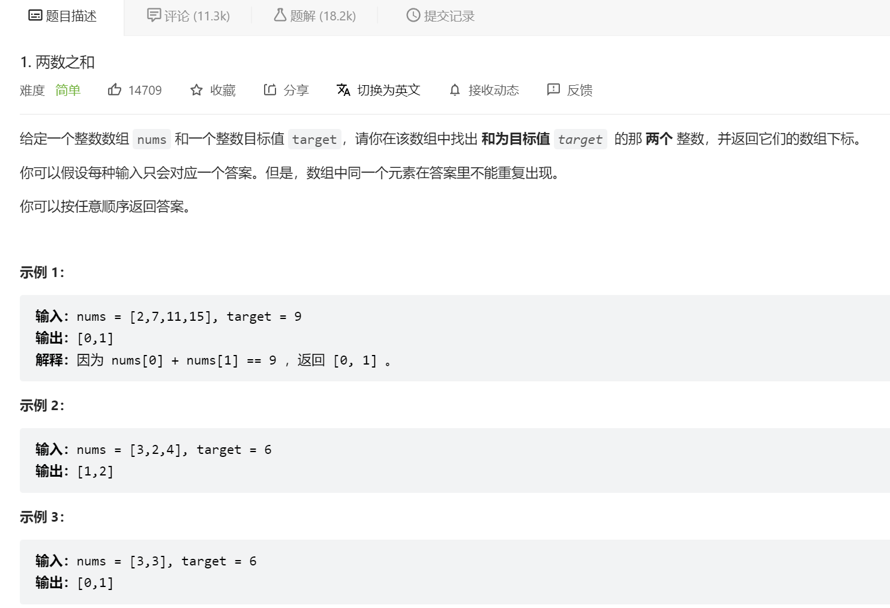
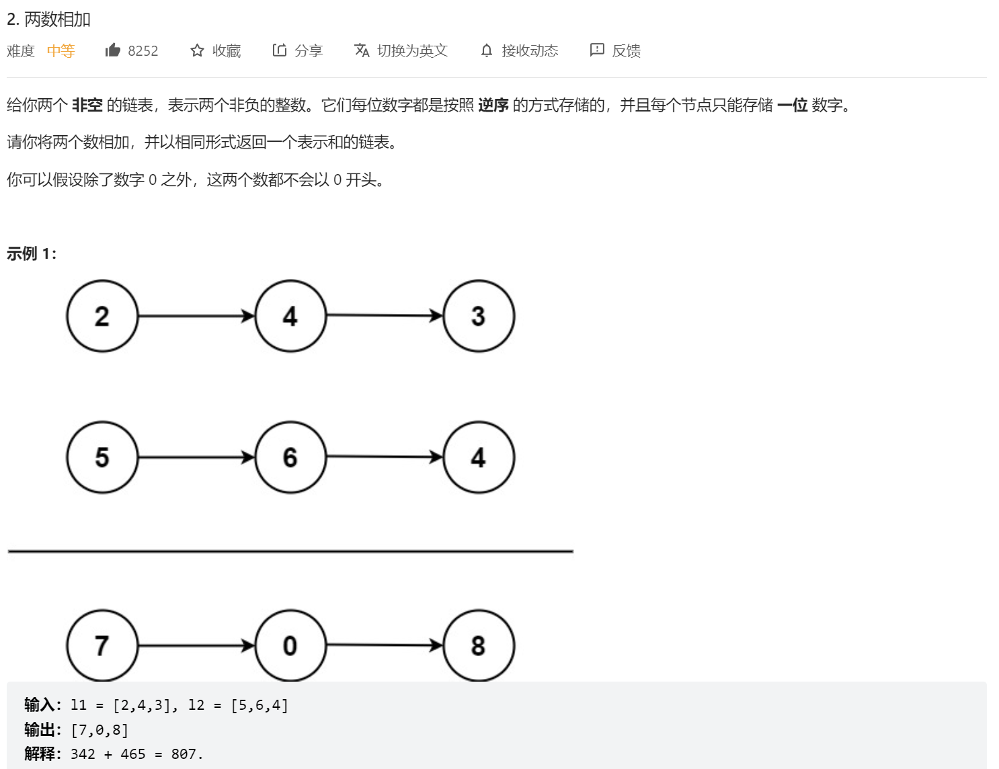

# 语法注意

const void *a
const是定义常量，不可修改。
void的字面意思是“无类型”，void *则为“无类型指针”，void *可以指向任何类型的数据。

这是定义了一个指针a，a可以制指向任意类型的值，但它指向的值必须是常量，在这种情况下，我们不能修改被指向的对象，但可以使指针指向其他对象。

因此，void * 类型指针，这个**类型指针指向了实实在在的存放数据的地址，但是该地址存放的数据的数据类型我们暂时不知道**。

举个例子，我们的动态内存分配就是这样，一开始只是分配地址，但没有知道这块地址用了存放什么，接着强制类型转换，使得它用来存放我们想要存放的内容。

```c
char*str=(char*)malloc(sizeof(char)*13);
```


上面这条代码，malloc()函数分配的地址一开始是void * 类型的，因为我们用来存放char类型数据，所以强制转换为 char *

https://blog.csdn.net/qq_25908839/article/details/102733282


----

## C 库函数 - qsort()

https://www.runoob.com/cprogramming/c-function-qsort.html

下面是 qsort() 函数的声明。

```c
void qsort(void *base, size_t nitems, size_t size, int (*compar)(const void *, const void*))
```

- **base** -- 指向要排序的数组的第一个元素的指针。

- **nitems** -- 由 base 指向的数组中元素的个数。

- **size** -- 数组中每个元素的大小，以字节为单位。

- **compar** -- 用来比较两个元素的函数。

  ```c
  #include <stdio.h>
  #include <stdlib.h>
  
  int values[] = { 88, 56, 100, 2, 25 };
  
  int cmpfunc (const void * a, const void * b)
  {
     return ( *(int*)a - *(int*)b );
  }
  
  int main()
  {
     int n;
  
     printf("排序之前的列表：\n");
     for( n = 0 ; n < 5; n++ ) {
        printf("%d ", values[n]);
     }
  
     qsort(values, 5, sizeof(int), cmpfunc);
  
     printf("\n排序之后的列表：\n");
     for( n = 0 ; n < 5; n++ ) {
        printf("%d ", values[n]);
     }
   
    return(0);
  }
  ```


## hash函数

#### [1. Two Sum](https://leetcode.cn/problems/two-sum/)



```c
//
// Created by cheng on 6/30/2022.
//
#include <stdio.h>
#include <malloc.h>

struct object {
    int val;
    int index;
};

static int compare(const void *a, const void *b)
{
    return ((struct object *) a)->val - ((struct object *) b)->val;
}

int * twoSum(int * nums, int numsSize, int target, int *returnSize) {
    int i, j;
    struct object *objs = malloc(numsSize * sizeof(*objs));//这里注意一下
    for (i = 0; i < numsSize; i++) { //自己构建hashmap
        objs[i].val = nums[i];
        objs[i].index = i;
    }
    //要排序的ojs, numsSize元素个数，每个元素大小，比较函数
    qsort(objs, numsSize, sizeof(*objs), compare);
    int *result = malloc(2 * sizeof(int));
    i = 0;
    j = numsSize - 1;
    while (i < j) {
        int sum = objs[i].val + objs[j].val;
        if (sum < target) {
            i++;
        } else if (sum > target) {
            j--;
        } else {
            result[0] = objs[i].index;
            result[1] = objs[j].index;
            *returnSize = 2;
            return result;
        }
    }
    return NULL;
}


int main() {
    int nums[] = {3, 2,3};
    int a = *nums; //这里根据数组名出来的第一个元素 3
    //sizeof (nums)代表计算nums数组的总字节数 sizeof(*nums)类型占的字节数
    int size = sizeof(nums) / sizeof(*nums);
    int target = 6;
    int count = 0;
    int *indexes = twoSum(nums, size, target, &count);
    if (indexes != NULL) {
        printf("%d %d\n", indexes[0], indexes[1]);
    } else {
        printf("Not found\n");
    }
    return 0;
}
```


## 链表

#### [2. 两数相加](https://leetcode.cn/problems/add-two-numbers/)



```c
#include<stdio.h>
#include <malloc.h>
#include <string.h>
#include <stdlib.h>

struct ListNode {
    int val;
    struct ListNode *next;
};

struct ListNode *addTwoNumbers(struct ListNode *l1, struct ListNode *l2) {
   int carry = 0;
   struct ListNode dummy;
   struct ListNode *p = l1, *prev = &dummy;
   dummy.next = p;
   while (l1 != NULL || l2 != NULL) {
       int sum = 0;
       if (l1 != NULL) {
           sum += l1->val;
           l1 = l1->next;
       }
       if (l2 != NULL) {
           if (p == NULL) {
               prev->next = l2;
               p = l2;
           }
           sum += l2->val;
           l2 = l2->next;
       }
       sum += carry;
       carry = sum / 10;
       p->val = sum % 10;
       prev = p;
       p = p->next;
   }
   if (carry) {
       p = malloc(sizeof(*p));
       p->val = carry;
       p->next = NULL;
       prev->next = p;
   }
   return dummy.next;
}
//构建链表
static struct ListNode *node_build(const char *digits) {
    struct ListNode *res, *p, *prev;
    int first = 1;
    int len = strlen(digits);
    const char *c = digits + len - 1;
    prev = NULL;
    while (len-- > 0) {
        p = malloc(sizeof(*p));
        if (first) {
            first = 0;
            res = p;
        }
        p->val = *c-- - '0';
        p->next = NULL;
        if (prev != NULL) {
            prev->next = p;
        }
        prev = p;
    }
    return res;
}

static void show(struct ListNode *ln){
    int sum = 0, factor = 1;
    while(ln != NULL) {
        sum += ln->val * factor;
        factor *= 10;
        ln = ln->next;
    }
    printf("%d\n", sum);
}

int main(int argc, char **argv) {
    if (argc < 3) {
        fprintf(stderr, "Uasage: ./test n1 n2\n");
        exit(-1);
    }
    struct ListNode *l1 = node_build(argv[1]);
    struct ListNode *l2 = node_build(argv[2]);
    struct ListNode *res = addTwoNumbers(l1, l2);
    show(l1);
    show(l2);
    show(res);
    return 0;
}
```
