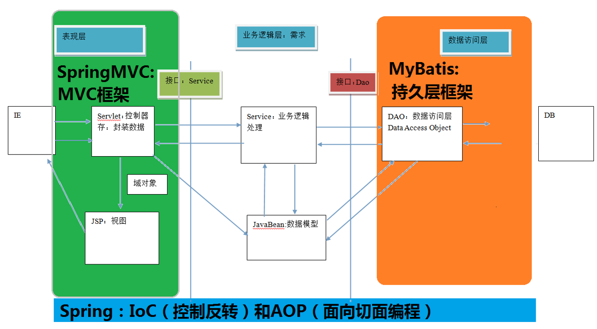
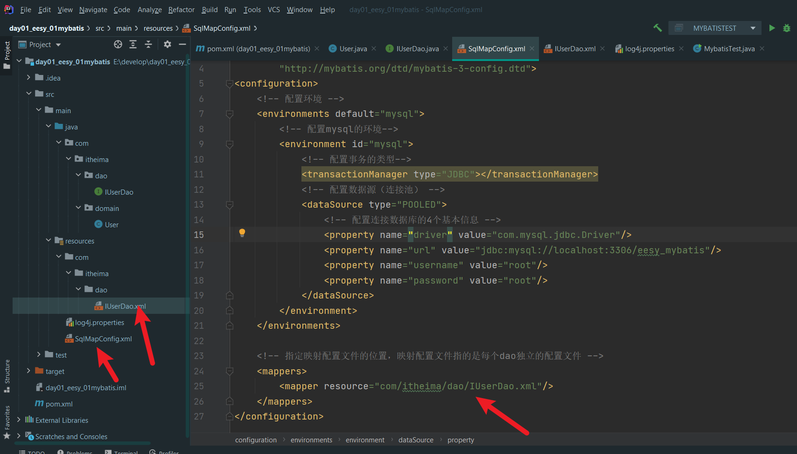
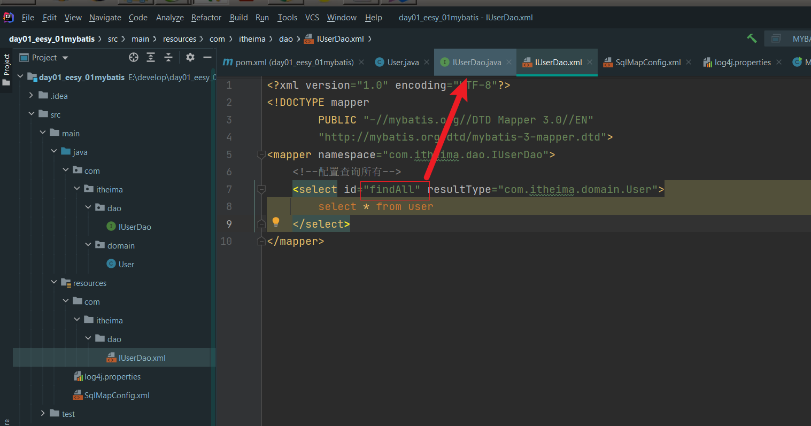
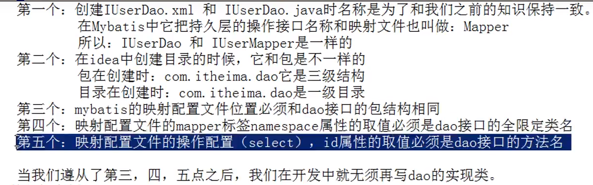

# 资料来源

https://www.bilibili.com/video/BV1Db411s7F5?p=2

# 第一天

**框架三层架构：** 

1. 表现层（SpringMVC）：展现数据

2. 业务层： 处理业务需求

3. 持久层（Mybatis就是持久层框架）： 和数据库交互

看下面的图：



# 环境搭建
## 1 配置pom.xml

```xml
<?xml version="1.0" encoding="UTF-8"?>
<project xmlns="http://maven.apache.org/POM/4.0.0"
         xmlns:xsi="http://www.w3.org/2001/XMLSchema-instance"
         xsi:schemaLocation="http://maven.apache.org/POM/4.0.0 http://maven.apache.org/xsd/maven-4.0.0.xsd">
    <modelVersion>4.0.0</modelVersion>

    <groupId>com.itheima</groupId>
    <artifactId>day01_eesy_01mybatis</artifactId>
    <version>1.0-SNAPSHOT</version>
    <packaging>jar</packaging>

    <dependencies>
        <dependency>
            <groupId>org.mybatis</groupId>
            <artifactId>mybatis</artifactId>
            <version>3.4.5</version>
        </dependency>
        <dependency>
            <groupId>mysql</groupId>
            <artifactId>mysql-connector-java</artifactId>
            <version>5.1.6</version>
        </dependency>
        <dependency>
            <groupId>log4j</groupId>
            <artifactId>log4j</artifactId>
            <version>1.2.12</version>
        </dependency>
        <dependency>
            <groupId>junit</groupId>
            <artifactId>junit</artifactId>
            <version>4.10</version>
        </dependency>
    </dependencies>

    <properties>
        <maven.compiler.source>15</maven.compiler.source>
        <maven.compiler.target>15</maven.compiler.target>
    </properties>


</project>
```

## 2 实体类User.java

```java
public class User implements Serializable {

    private Integer id;
    private String username;
    private Date birthday;
    private String sex;
    private String address;
    public Integer getId() {
        return id;
    }
```

## 3 创建接口IUserDao

```java
public interface IUserDao {
    List<User> findAll();
}
```

## 4 配置resources下的SqlMapConfig.xml



## 5 IUserDao.xml




