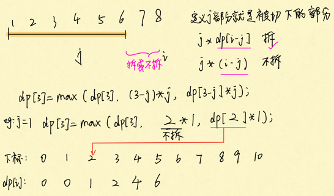
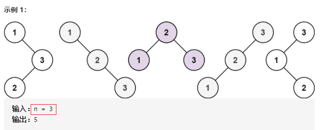
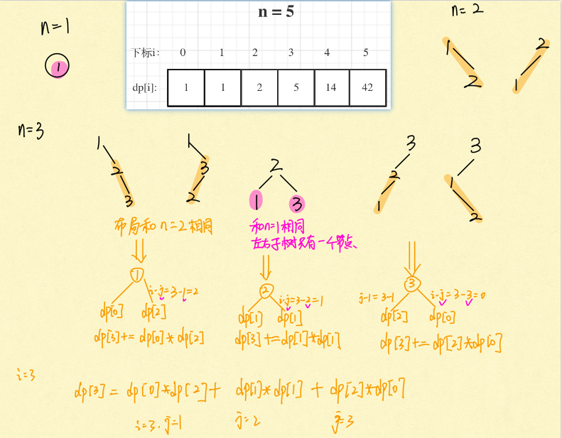
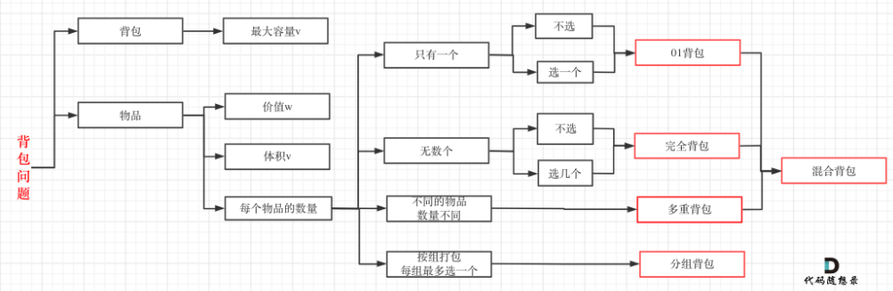
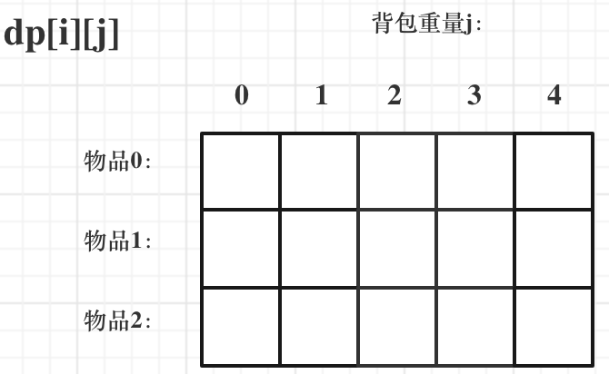
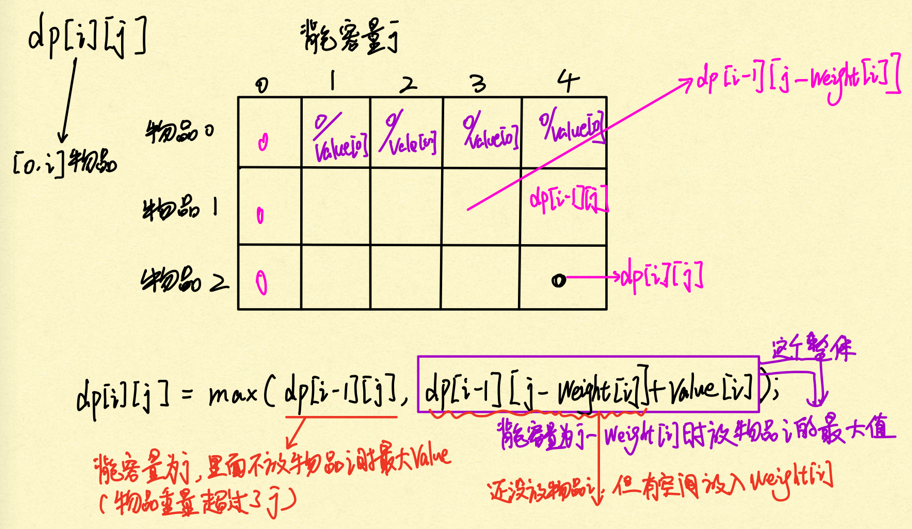
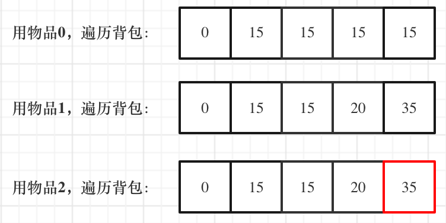
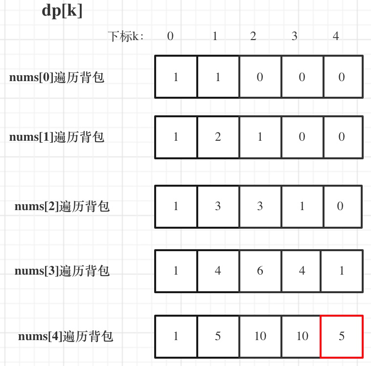

# 动态规划的解题步骤

1. 确定==dp数组==（dp table）以及下标的含义
2. 确定递推公式
3. dp数组如何初始化
4. 确定遍历顺序
5. 举例推导dp数组

#### [509. 斐波那契数](https://leetcode-cn.com/problems/fibonacci-number/)

>该数列由 `0` 和 `1` 开始，后面的每一项数字都是前面两项数字的和。也就是：
>
>```
>F(0) = 0，F(1) = 1
>F(n) = F(n - 1) + F(n - 2)，其中 n > 1
>```
>
>给你 `n` ，请计算 `F(n)` 。
>
>```
>输入：2
>输出：1
>解释：F(2) = F(1) + F(0) = 1 + 0 = 1
>```

1. dp[i]的定义为：第i个数的斐波那契数值是dp[i]

2. **状态转移方程 dp[i] = dp[i - 1] + dp[i - 2];**
3. dp数组如何初始化

```
dp[0] = 0;
dp[1] = 1;
```

4. 从递归公式dp[i] = dp[i - 1] + dp[i - 2];中可以看出，dp[i]是依赖 dp[i - 1] 和 dp[i - 2]，那么遍历的顺序一定是从前到后遍历的

5. 按照这个递推公式dp[i] = dp[i - 1] + dp[i - 2]，我们来推导一下，当N为10的时候，dp数组应该是如下的数列：

   ​	0 1 1 2 3 5 8 13 21 34 55

- 时间复杂度：O(n)
- 空间复杂度：O(1)

| 0    | 1    | 2    | 3    |
| ---- | ---- | ---- | ---- |
| 0    | 1    | 1    | 2    |

n = 3, dp长度=n+ 1 = 3 + 1 = 4

```java
class Solution {
    public int fib(int n) {
        if (n < 2) {
            return n;
        }
        int[] dp = new int[n + 1];//dp的长度确保最后一个元素n也可以被计算到
        dp[0]  = 0;
        dp[1] = 1;
        for (int i = 2; i <= n; i++) {
            dp[i] = dp[i - 1] + dp[i - 2];// array[i]!!!
        }
        return dp[n];
    }
}
```

#### [70. 爬楼梯](https://leetcode-cn.com/problems/climbing-stairs/)

>假设你正在爬楼梯。需要 *n* 阶你才能到达楼顶。
>
>每次你可以爬 1 或 2 个台阶。你有多少种不同的==方法==可以爬到楼顶呢？
>
>**注意：**给定 *n* 是一个正整数。
>
>```
>输入： 3
>输出： 3
>解释： 有三种方法可以爬到楼顶。
>1.  1 阶 + 1 阶 + 1 阶
>2.  1 阶 + 2 阶
>3.  2 阶 + 1 阶
>----
>输入： 2
>输出： 2
>解释： 有两种方法可以爬到楼顶。
>1.  1 阶 + 1 阶
>2.  2 阶
>```
>
>第三层楼梯的状态可以由第二层楼梯 和 到第一层楼梯状态推导出来

1. dp[i]： 爬到第i层楼梯，有dp[i]种方法

2. 递推公式: p[i] = dp[i - 1] + dp[i - 2] 

dp[i - 1]，上i-1层楼梯，有dp[i - 1]种方法，那么再一步跳一个台阶不就是dp[i]了

dp[i - 2]，上i-2层楼梯，有dp[i - 2]种方法，那么再一步跳两个台阶不就是dp[i]了

从递推公式dp[i] = dp[i - 1] + dp[i - 2];中可以看出，遍历顺序一定是从前向后遍历的

3. dp数组如何初始化dp[1] = 1，dp[2] = 2


```java
// 用变量记录代替数组
public int climbStairs(int n) {
    int a = 0, b = 1, c = 0; // 默认需要1次
    for (int i = 1; i <= n; i++) {
        c = a + b;          // f(i - 1) + f(n - 2)
        a = b;              // 记录上一轮的值
        b = c;              // 向后步进1个数
    }
    return c;
}
```

```java
class Solution {
    public int climbStairs(int n) {
        if (n < 3) {
            return n;
        }
        int[] dp = new int[n + 1];
        dp[1] = 1;
        dp[2] = 2;
        for (int i = 3; i <= n; i++) {
            dp[i] = dp[i - 1] + dp[i - 2];
        }
        return dp[n];
    }
}
```

#### [746. 使用最小花费爬楼梯](https://leetcode-cn.com/problems/min-cost-climbing-stairs/)

>数组的每个下标作为一个阶梯，第 `i` 个阶梯对应着一个非负数的体力花费值 `cost[i]`（下标从 `0` 开始）。
>
>每当你爬上一个阶梯你都要花费对应的体力值，一旦支付了相应的体力值，你就可以选择向上爬一个阶梯或者爬两个阶梯。
>
>请你找出达到楼层顶部的最低花费。在开始时，你可以选择从下标为 0 或 1 的元素作为初始阶梯。
>
>>```
>>输入：cost = [10, 15, 20]
>>输出：15
>>解释：最低花费是从 cost[1] 开始，然后走两步即可到阶梯顶，一共花费 15 。
>>最后一步可以理解为:不用花费。
>>----
>>输入：cost = [1, 100, 1, 1, 1, 100, 1, 1, 100, 1]
>>输出：6
>>解释：最低花费方式是从 cost[0] 开始，逐个经过那些 1 ，跳过 cost[3] ，一共花费 6 。
>>```

1. **dp[i]的定义：到达第i个台阶所花费的==最少体力==为dp[i]**。（注意这里认为是第一步一定是要花费）

2. `dp[i] = min(dp[i - 1], dp[i - 2]) + cost[i];`

3. dp[i]由dp[i-1]，dp[i-2]推出，既然初始化所有的dp[i]是不可能的，那么只初始化dp[0]和dp[1]就够了，其他的最终都是dp[0]dp[1]推出。

4. 确定遍历顺序: 是模拟台阶，而且dp[i]又dp[i-1]dp[i-2]推出，所以是从前到后遍历cost数组就可以了。
5. 举例推导dp数组


```java
class Solution {
    public int minCostClimbingStairs(int[] cost) {
        int[] dp = new int[cost.length];
        if (cost.length == 1) {
            return cost[0];
        }
        dp[0] = cost[0];
        dp[1] = cost[1];
        for (int i = 2; i < cost.length; i++) {
            dp[i] = Math.min(dp[i - 1], dp[i - 2]) + cost[i];
        }
        return Math.min(dp[cost.length - 1], dp[cost.length - 2]); //已经处理长度为2的情况
    }
}
```

#### [62. 不同路径](https://leetcode-cn.com/problems/unique-paths/)

>
>一个机器人位于一个 `m x n` 网格的左上角 （起始点在下图中标记为 “Start” ）。
>
>机器人每次只能向下或者向右移动一步。机器人试图达到网格的右下角（在下图中标记为 “Finish” ）。
>
>问总共有多少条不同的路径？
>
>
>
>

```java
class Solution {
    public int uniquePaths(int m, int n) {
        int[][] dp = new int[m][n];
        for (int i = 0; i < m; i++) {
            dp[i][0] = 1;
        }
        for (int i = 0; i < n; i++) {
            dp[0][i] = 1;
        }
        for (int i = 1; i < m; i++) {
            for (int j = 1; j < n; j++) {
                dp[i][j] = dp[i - 1][j] + dp[i][j - 1];//计算到m - 1, n - 1即最后一个元素即可 左边，上面
            }
        }
        return dp[m - 1][n - 1];//要的就是最后一个元素
    }
}
```

#### [63. 不同路径 II](https://leetcode-cn.com/problems/unique-paths-ii/)

>一个机器人位于一个 m x n 网格的左上角 （起始点在下图中标记为“Start” ）。
>
>机器人每次只能向下或者向右移动一步。机器人试图达到网格的右下角（在下图中标记为“Finish”）。
>
>现在考虑网格中有障碍物。那么从左上角到右下角将会有多少条不同的路径？
>
>

1. `dp[i][j] `表示从（0 ，0）出发，到(i,j)有`dp[i][j]`条不同的路径。 
2. `dp[i][j] = dp[i - 1][j] + dp[i][j - 1]`

3. 但这里需要注意一点，因为有了障碍，(i, j)如果就是==障碍==的话应该就==保持初始状态==（初始状态为0）。

```
if (obstacleGrid[i][j] == 0) { // 当(i, j)没有障碍的时候，再推导dp[i][j]
    dp[i][j] = dp[i - 1][j] + dp[i][j - 1];
}
```

4. 初始化：为从(0, 0)的位置到(i, 0)的路径只有一条，所以`dp[i][0]`一定为1，`dp[0][j]`也同理, 但如果(i, 0) 这条边有了障碍之后，障碍之后（包括障碍）都是走不到的位置了，所以障碍之后的`dp[i][0]`应该还是初始值0。

```
for (int i = 0; i < m && obstacleGrid[i][0] == 0; i++) dp[i][0] = 1;
for (int j = 0; j < n && obstacleGrid[0][j] == 0; j++) dp[0][j] = 1;
```

```java
class Solution {
    public int uniquePathsWithObstacles(int[][] obstacleGrid) {
        int m = obstacleGrid.length; 
        int n = obstacleGrid[0].length;
        int[][] dp = new int[m][n];
        dp[0][0] = 1 - obstacleGrid[0][0];//obstacleGrid[0][0]为0说明 dp[0][0] = 1
        for (int i = 1; i < m; i++) {
            if (dp[i - 1][0] == 1 && obstacleGrid[i][0] == 0) { //要确保能到达，前一个dp值必须为1且无障碍
                dp[i][0] = 1;
            }
        }
        for(int j = 1; j < n; j++) {
            if(dp[0][j - 1] == 1 && obstacleGrid[0][j] == 0) {
                dp[0][j] = 1;
            }
        }
        for(int i = 1; i < m; i++) {
            for(int j = 1; j < n; j++) {
                if(obstacleGrid[i][j] == 1) {
                    continue;
                }
                dp[i][j] = dp[i - 1][j] + dp[i][j - 1];
            }
        }
        return dp[m - 1][n - 1];
    }
}
```

#### [343. 整数拆分](https://leetcode-cn.com/problems/integer-break/)

> 给定一个正整数 *n*，将其拆分为**至少**两个正整数的和，并使这些整数的乘积最大化。 返回你可以获得的最大乘积。
>
> ```
> 输入: 10
> 输出: 36
> 解释: 10 = 3 + 3 + 4, 3 × 3 × 4 = 36。
> ----
> 输入: 2
> 输出: 1
> 解释: 2 = 1 + 1, 1 × 1 = 1。
> ```

1. `dp[i]`：分拆数字i，可以得到的最大乘积为`dp[i]`。

2. `dp[i] = max({dp[i], (i - j) * j, dp[i - j] * j})`j * (i - j) 直接相乘, j * dp[i - j]，相当于是拆分(i - j)

3. 我只初始化dp[2] = 1，从dp[i]的定义来说，拆分数字2，得到的最大乘积是1

4. dp[i] 是依靠 dp[i - j]的状态，所以遍历i一定是从前向后遍历，先有dp[i - j]再有dp[i]。

枚举`j`的时候，是从`1`开始的。`i`是从`3`开始，这样dp[i - j]就是dp[2]正好可以通过我们初始化的数值求出来。

j就是切开的位置



```java
class Solution {
    public int integerBreak(int n) {
        //dp[i]为正整数i拆分结果的最大乘积
        int[] dp = new int[n+1];
        dp[2] = 1;
        for (int i = 3; i <= n; i++) {
            for (int j = 1; j < i; j++) {
                //j*(i-j)代表把i拆分为j和i-j两个数相乘
                //j*dp[i-j]代表把i拆分成j和继续把(i-j)这个数拆分，取(i-j)拆分结果中的最大乘积与j相乘
                dp[i] = Math.max(dp[i], Math.max(j * (i - j), j * dp[i - j]));
            }
        }
        return dp[n];
    }
}
```

#### [96. 不同的二叉搜索树](https://leetcode-cn.com/problems/unique-binary-search-trees/)

>给你一个整数 `n` ，求恰由 `n` 个节点组成且节点值从 `1` 到 `n` 互不相同的 **二叉搜索树** 有多少种？返回满足题意的二叉搜索树的种数。
>
>

dp[3]，就是 元素1为头结点搜索树的数量 + 元素2为头结点搜索树的数量 + 元素3为头结点搜索树的数量

元素1为头结点搜索树的数量 = 右子树有2个元素的搜索树数量 * 左子树有0个元素的搜索树数量

元素2为头结点搜索树的数量 = 右子树有1个元素的搜索树数量 * 左子树有1个元素的搜索树数量

元素3为头结点搜索树的数量 = 右子树有0个元素的搜索树数量 * 左子树有2个元素的搜索树数量

有2个元素的搜索树数量就是dp[2]。

有1个元素的搜索树数量就是dp[1]。

有0个元素的搜索树数量就是dp[0]。

所以dp[3] = dp[2] * dp[0] + dp[1] * dp[1] + dp[0] * dp[2]



1. **dp[i] ： 1到i为节点组成的二叉搜索树的个数为dp[i]**。

2. dp[i] += dp[以j为头结点左子树节点数量] * dp[以j为头结点右子树节点数量]

   `j`相当于是`头结点`的元素，从`1`遍历到`i`为止

递推公式：`dp[i] += dp[j - 1] * dp[i - j]`; ，`j-1` 为`j`为头结点左子树节点数量，`i-j` 为以`j`为头结点右子树节点数量

3. 只需要初始化dp[0]就可以了，dp[0] = 1。dp[1] = dp[0] * dp[0]空节点也是一颗二叉树，也是一颗二叉搜索树. 

4. 从递归公式：dp[i] += dp[j - 1] * dp[i - j]可以看出，节点数为i的状态是依靠 i之前节点数的状态。

那么遍历`i`里面`每一个数`作为头结点的状态，用`j`来遍历。

```
for (int i = 1; i <= n; i++) {// 外层的循环为了填充这个dp数组
    for (int j = 1; j <= i; j++) { // 内层循环用来遍历各个元素用作根的情况
        //对于第i个节点，需要考虑1作为根节点直到i作为根节点的情况，所以需要累加
        //一共i个节点，对于根节点j时,左子树的节点个数为j-1，右子树的节点个数为i-j
        dp[i] += dp[j - 1] * dp[i - j];
    }
} 
```

```java
class Solution {
    public int numTrees(int n) {
        int[] dp = new int[n + 1];
        dp[0] = 1;
        for (int i = 0; i <= n; i++) {
            for (int j = 1; j <= i; j++) {
                dp[i] += dp[j - 1] * dp[i - j];
            }
        }
        return dp[n];
    }
}
```

# 背包问题系列：




01背包和完全背包就够用了, 而完全背包又是也是01背包稍作变化而来，即：完全背包的物品数量是无限的。

## 01 背包

有N件物品和一个最多能被重量为W 的背包。第i件物品的重量是weight[i]，得到的价值是value[i] 。**每件物品只能用一次**，求解将哪些物品装入背包里物品价值总和最大。

## 二维dp数组01背包

对于背包问题，有一种写法， 是使用二维数组，即`dp[i][j]` 表示从下标为[0-i]的物品里任意取，放进**容量为j**的背包，价值总和最大是多少。



1. `dp[i][j] `表示从下标为[0-i]的物品里任意取，放进容量为j的背包，价值总和最大是多少。

2. 递归公式：` dp[i][j] = max(dp[i - 1][j], dp[i - 1][j - weight[i]] + value[i]);`

- 由`dp[i - 1`][j]推出，即背包容量为j，里面不放物品i的最大价值，此时`dp[i][j]`就是`dp[i - 1][j]。`(其实就是当物品i的重量大于背包j的重量时，物品i无法放进背包中，所以被背包内的价值依然和前面相同。)
- 由`dp[i - 1][j - weight[i]]`推出，`dp[i - 1][j - weight[i]] `为背包容量为`j - weight[i]`的时候不放物品i的最大价值，那么`dp[i - 1][j - weight[i]] + value[i]` （物品i的价值），就是背包放物品i得到的最大价值

3. **初始化，一定要和dp数组的定义吻合，否则到递推公式的时候就会越来越乱**

- `dp[i][j]`的定义出发，如果背包容量j为0的话，即`dp[i][0]`，无论是选取哪些物品，背包价值总和一定为0。

- `i `是由` i-1` 推导出来，那么i为0的时候就一定要初始化。

  `dp[0][j]`，即：i为0，存放编号0的物品的时候，各个容量的背包所能存放的最大价值。

  当 j < weight[0]的时候，`dp[0][j] `应该是 0，因为背包容量比编号0的物品重量还小。

  当j >= weight[0]是，`dp[0][j] `应该是value[0]，因为背包容量放足够放编号0物品。

```java
for (int j = 0 ; j < weight[0]; j++) {  // 当然这一步，如果把dp数组预先初始化为0了，这一步就可以省略，但很多同学应该没有想清楚这一点。
    dp[0][j] = 0;
}
// 正序遍历
for (int j = weight[0]; j <= bagWeight; j++) {
    dp[0][j] = value[0];
}
```

4. 确定遍历顺序, 有两个遍历的维度：物品与背包重量, **先遍历物品更好理解**。

```java
// weight数组的大小 就是物品个数
for(int i = 1; i < weight.size(); i++) { // 遍历物品
    for(int j = 0; j <= bagWeight; j++) { // 遍历背包容量
        if (j < weight[i]) dp[i][j] = dp[i - 1][j]; 
        else dp[i][j] = max(dp[i - 1][j], dp[i - 1][j - weight[i]] + value[i]);
    }
}
```

**例如：** 背包最大重量为4。

物品为：

|       | 重量 | 价值 |
| ----- | ---- | ---- |
| 物品0 | 1    | 15   |
| 物品1 | 3    | 20   |
| 物品2 | 4    | 30   |

问背包能背的物品最大价值是多少？ 最终结果是`dp[2][4]= 35` 。



```java
public class Bag {
    public static void main(String[] args) {
        int[] weight = {1, 3, 4};
        int[] value = {15, 20, 30};
        int bagSize = 4;
        testWeightBagProblem(weight, value, bagSize);
    }

    public static void testWeightBagProblem(int[] weight, int[] value, int bagSize){
        int wLen = weight.length, value0 = 0;
        //定义dp数组：dp[i][j]表示背包容量为j时，前i个物品能获得的最大价值
        int[][] dp = new int[wLen + 1][bagSize + 1];//物品0，背包容量为0情况需要添加dp长度。
        //初始化：背包容量为0时，能获得的价值都为0 可以省略
//        for (int i = 0; i <= wLen; i++){
//            dp[i][0] = value0;
//        }
        for (int j = weight[0]; j <= bagSize; j++) {
            dp[0][j] = value[0];
        }
        //遍历顺序：先遍历物品，再遍历背包容量
        for (int i = 1; i < wLen; i++){
            for (int j = 0; j <= bagSize; j++){
                if (j < weight[i]){
                    dp[i][j] = dp[i - 1][j];
                }else{
                    dp[i][j] = Math.max(dp[i - 1][j], dp[i - 1][j - weight[i]] + value[i]);
                }
            }
        }
        //打印dp数组
        for (int i = 0; i < wLen; i++){
            for (int j = 0; j <= bagSize; j++){
                System.out.print(dp[i][j] + " ");
            }
            System.out.print("\n");
        }
    }
}
```

# 关于01背包问题（滚动数组）

就是把二维dp降为一维dp

对于背包问题其实状态都是可以压缩的。其实可以发现如果把**dp[i - 1]那一层拷贝到dp[i]**上，表达式完全可以是：`dp[i][j] = max(dp[i][j], dp[i][j - weight[i]] + value[i]);`

**与其把dp[i - 1]这一层拷贝到dp[i]上，不如只用一个一维数组了**，只用dp[j]（一维数组，也可以理解是一个滚动数组）。

这就是滚动数组的由来，需要满足的条件是上一层可以重复利用，直接拷贝到当前层。

`dp[i][j]` 表示从下标为[0-i]的物品里任意取，放进容量为j的背包，价值总和最大是多少。

==现在：==

1. dp[j]表示：容量为j的背包，所背的物品==价值==可以最大为==dp[j]==。
2. dp[j]可以通过dp[j - weight[i]]推导出来，dp[j - weight[i]]表示容量为j - weight[i]的背包所背的最大价值。

dp[j - weight[i]] + value[i] 表示 容量为 j - 物品i重量 的背包 加上 物品i的价值。（也就是容量为j的背包，放入物品i了之后的价值即：dp[j]）

此时dp[j]有两个选择，一个是取自己dp[j]，一个是取dp[j - weight[i]] + value[i]，指定是取最大的，毕竟是求最大价值，

`dp[j] = max(dp[j], dp[j - weight[i]] + value[i]);`

3. dp[j]表示：容量为j的背包，所背的物品价值可以最大为dp[j]，那么**dp[0]就应该是0**，因为背包容量为0所背的物品的最大价值就是0。

4. 一维dp数组遍历顺序

```java
for(int i = 0; i < weight.size(); i++) { // 遍历物品
    for(int j = bagWeight; j >= weight[i]; j--) { // 遍历背包容量
        dp[j] = max(dp[j], dp[j - weight[i]] + value[i]);
    }
}
```

遍历背包的顺序和二维dp的写法是不一样的！

**倒叙遍历是为了保证物品i只被放入一次！**。但如果一旦正序遍历了，那么物品0就会被重复加入多次！

**再来看看两个嵌套for循环的顺序，代码中是==先遍历物品==嵌套遍历背包容量，`不可以`先遍历背包容量嵌套遍历物品**

因为一维dp的写法，背包容量一定是要倒序遍历（原因上面已经讲了），如果遍历背包容量放在上一层，那么每个dp[j]就只会放入一个物品，即：背包里只放入了一个物品。



很符合逻辑： 我们一般都是先要一个一个地遍历物体，然后该物体放到空的背包（背包倒着遍历缩小）里面的时候就有了这个value。背包容量减小的时候可能只能放入初始的物品包含的价值了。 

```java
public class BagID {
    public static void main(String[] args) {
        int[] weight = {1, 3, 4};
        int[] value = {15, 20, 30};
        int bagWeight = 4;
        testWeightBagProblem(weight, value, bagWeight);
    }

    public static void testWeightBagProblem(int[] weight, int[] value, int bagWeight) {
        int wLen = weight.length;
        //dp[j] 表示背包容量为j时，能获得的最大价值
        int[] dp = new int[bagWeight + 1];
        //遍历顺序：先遍历物品，再遍历背包容量
        for (int i = 0; i < wLen; i++) {
            for (int j = bagWeight; j >= weight[i]; j--) {
                dp[j] = Math.max(dp[j], dp[j - weight[i]] + value[i]);
            }
        }
        //打印
        for (int j = 0; j <= bagWeight; j++) {
            System.out.print(dp[j] + " ");
        }
    }
}
```

#### [416. 分割等和子集](https://leetcode-cn.com/problems/partition-equal-subset-sum/)

>给你一个 **只包含正整数** 的 **非空** 数组 `nums` 。请你判断是否可以将这个数组分割成两个子集，使得两个子集的元素和相等。
>
>```
>输入：nums = [1,5,11,5]
>输出：true
>解释：数组可以分割成 [1, 5, 5] 和 [11]。
>-------------------------
>输入：nums = [1,2,3,5]
>输出：false
>解释：数组不能分割成两个元素和相等的子集。
>```

只要找到集合里能够出现 sum / 2 的子集总和，就算是可以分割成两个相同元素和子集了。

- 背包的体积为sum / 2
- 背包要放入的商品（集合里的元素）==重量==为元素的数值，==价值==也为元素的数值
- 背包如何正好装满，说明找到了==总和为 sum / 2== 的子集。
- 背包中每一个元素是==不可重复==放入。

1. 容量为j的背包，所背的物品价值可以最大为dp[j]

   ==> **dp[i]表示 背包总容量是i，最大可以凑成i的子集总和为dp[i]**

2. 01背包的递推公式为：dp[j] = max(dp[j], dp[j - weight[i]] + value[i]);

本题，相当于背包里放入数值，那么物品i的重量是nums[i]，其价值也是nums[i]

`dp[j] = max(dp[j], dp[j - nums[i]] + nums[i])`;

3. 从dp[j]的定义来看，首先dp[0]一定是0。

4. 确定遍历顺序: 

如果使用一维dp数组，**物品遍历的for循环放在外层**，遍历背包的for循环放在内层，且**内层for循环倒叙遍历**！

```
for(int i = 0; i < nums.size(); i++) {
	for(int j = target; j >= nums[i]; j--) {// 每一个元素一定是不可重复放入，所以从大到小遍历
		dp[j] = max(dp[j], dp[j - nums[i]] + nums[i]);
	}
}
```

5. dp[i]的数值一定是小于等于i的。

**如果dp[i] == i 说明，集合中的子集总和正好可以凑成总和i，理解这一点很重要。**

```java
class Solution {
    public boolean canPartition(int[] nums) {
        int sum = 0;
        for (int i : nums) {
            sum += i; //先计算出总sum
        }
        if (sum % 2 == 1) {
            return false; //奇数情况不用考虑
        }
        int target = sum / 2;
        int[] dp = new int[target + 1];// dp[i]表示 背包总容量是i，最大可以凑成i的子集总和为dp[i]
        for (int i = 0; i < nums.length; i++) {// 开始 01背包 先遍历物品，即元素大小
            for (int j = target; j >= nums[i]; j--) { // 每一个元素一定是不可重复放入，所以从大到小遍历
                dp[j] = Math.max(dp[j], dp[j - nums[i]] + nums[i]);
            }
        }
        if (dp[target] == target) {// 开始 01背包
            return true;
        }
        return false;
    }
}
```

#### [1049. 最后一块石头的重量 II](https://leetcode-cn.com/problems/last-stone-weight-ii/)

>有一堆石头，用整数数组 stones 表示。其中 stones[i] 表示第 i 块石头的重量。
>
>每一回合，从中选出任意两块石头，然后将它们一起粉碎。假设石头的重量分别为 x 和 y，且 x <= y。那么粉碎的可能结果如下：
>
>如果 x == y，那么两块石头都会被完全粉碎；
>如果 x != y，那么重量为 x 的石头将会完全粉碎，而重量为 y 的石头新重量为 y-x。
>最后，最多只会剩下一块石头。返回此石头**最小**的可能重量 。如果没有石头剩下，就返回 0。
>
>```
>输入：stones = [2,7,4,1,8,1]
>输出：1
>解释：
>组合 2 和 4，得到 2，所以数组转化为 [2,7,1,8,1]，
>组合 7 和 8，得到 1，所以数组转化为 [2,1,1,1]，
>组合 2 和 1，得到 1，所以数组转化为 [1,1,1]，
>组合 1 和 1，得到 0，所以数组转化为 [1]，这就是最优值。
>```

尽量让石头分成重量相同的两堆，相撞之后剩下的石头最小，**这样就化解成01背包问题了**。

1. **dp[j]表示容量（这里说容量更形象，其实就是重量）为j的背包，最多可以背dp[j]这么重的石头**。

2. `dp[j]= max(dp[j], dp[j - stones[i]] + stone[i])`
3. dp[j]都初始化为0就可以了

4. 确定遍历顺序

```
for(int i = 0; i < stones.size(); i++) {// 遍历物品
	for(int j = target; j >= stone[i]; j--) {// 遍历背包
		dp[j] = Math.max(dp[j], dp[j - stone[i]] + stone[i]);
	}
}
```

**在计算target的时候，target = sum / 2 因为是向下取整，所以sum - dp[target] 一定是大于等于dp[target]的**。

那么相撞之后剩下的最小石头重量就是 (sum - dp[target]) - dp[target]。

```java
class Solution {
    public int lastStoneWeightII(int[] stones) {
        int sum = 0;
        for (int i : stones) {
            sum += i;
        }
        int target = sum / 2;
        int[] dp = new int[target + 1];
        for(int i = 0; i < stones.length; i++) {
            for (int j = target; j >= stones[i]; j--) {
                dp[j] = Math.max(dp[j], dp[j - stones[i]] + stones[i]);
            }
        }
        return sum - dp[target] - dp[target];
    }
}
```

- 时间复杂度：O(m * n) , m是石头总重量（准确的说是总重量的一半），n为石头块数
- 空间复杂度：O(m)


#### [494. 目标和](https://leetcode-cn.com/problems/target-sum/)

>给你一个整数数组 nums 和一个整数 target 。
>
>向数组中的每个整数前添加 '+' 或 '-' ，然后串联起所有整数，可以构造一个表达式 ：
>
>例如，nums = [2, 1] ，可以在 2 之前添加 '+' ，在 1 之前添加 '-' ，然后串联起来得到表达式 "+2-1" 。
>返回可以通过上述方法构造的、运算结果等于 target 的不同 表达式 的数目。
>
>```
>输入：nums = [1,1,1,1,1], target = 3
>输出：5
>解释：一共有 5 种方法让最终目标和为 3 。
>-1 + 1 + 1 + 1 + 1 = 3
>+1 - 1 + 1 + 1 + 1 = 3
>+1 + 1 - 1 + 1 + 1 = 3
>+1 + 1 + 1 - 1 + 1 = 3
>+1 + 1 + 1 + 1 - 1 = 3
>-----------------------------
>输入：nums = [1], target = 1
>输出：1
>```
>
>

如何转化为01背包问题呢。

假设加法的总和为x，那么减法对应的总和就是sum - x, 我们要求的是 x - (sum - x) = target 

加法的总和x = (target + sum) / 2

**此时问题就转化为，装满容量为x背包，有几种方法**。

(target + sum) / 2 应该担心计算的过程中向下取整有没有影响。

```
if ((target+ sum) % 2 == 1) return 0; // 此时没有方案
```

为什么是01背包呢？因为每个物品（题目中的1）只用一次！

本题则是装满有几种方法。其实这就是一个组合问题了。

1. dp[j] 表示：填满j（包括j）这么大容积的包，有dp[i]种方法

使用二维dp数组来求解本题，`dp[i][j]`：使用 下标为[0, i]的nums[i]能够凑满j（包括j）这么大容量的包，有`dp[i][j]`种方法。

2. 确定递推公式

不考虑nums[i]的情况下，填满容量为j - nums[i]的背包，有dp[j - nums[i]]种方法。

对于元素之和等于j - num[i] 的每一种排列，在最后添加 num[i] 之后即可得到一个元素之和等于 j 的排列，因此在计算 dp[j] 时，应该计算所有的 dp[j − num[i]] 之和。

```java
dp[j] += dp[j - nums[i]]
```

**这个公式在后面在讲解背包解决排列组合问题的时候还会用到！**

3. dp数组如何初始化；dp[0] = 1，理论上也很好解释，装满容量为0的背包，有1种方法，就是装0件物品。

4. 输入：nums: [1, 1, 1, 1, 1], target: 3

bagSize = (target + sum) / 2 = (3 + 5) / 2 = 4



```JAVA
class Solution {
    public int findTargetSumWays(int[] nums, int target) {
        int sum = 0;
        for (int num : nums) {
            sum += num;
        }
        if ((target + sum) % 2 != 0) {
            return 0;
        }
        int size = (target + sum) / 2;
        int[] dp = new int[size + 1];
        dp[0] = 1;
        for(int i = 0; i < nums.length; i++) {
            for(int j = size; j >= nums[i]; j--) {
                dp[j] += dp[j - nums[i]];
            }
        }
        return dp[size];
    }
}
```

#### [474. 一和零](https://leetcode-cn.com/problems/ones-and-zeroes/)

>给你一个二进制字符串数组 strs 和两个整数 m 和 n 。
>
>请你找出并返回 strs 的最大==子集==的大小，该==子集中== 最多 有 m 个 0 和 n 个 1 。
>
>如果 x 的所有元素也是 y 的元素，集合 x 是集合 y 的 子集 。
>

输入：strs = ["10", "0001", "111001", "1", "0"], m = 5, n = 3
输出：4
解释：最多有 5 个 0 和 3 个 1 的最大子集是 {"10","0001","1","0"} ，因此答案是 4 。
其他满足题意但较小的子集包括 {"0001","1"} 和 {"10","1","0"} 。{"111001"} 不满足题意，因为它含 4 个 1 ，大于 n 的值 3 。

