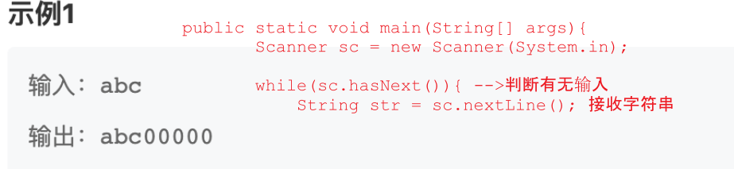
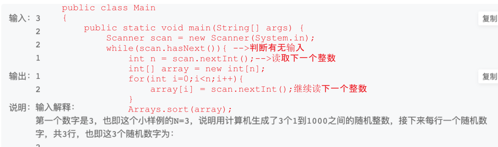
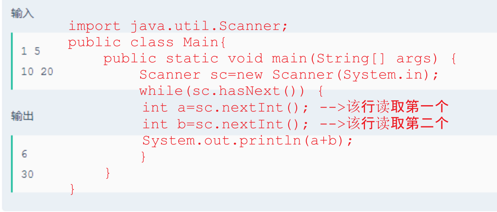
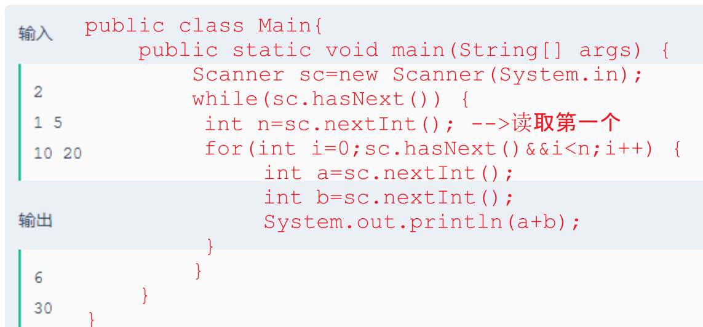

# 牛客网面试题

https://blog.csdn.net/qq_40164190/article/details/81917208

https://www.cnblogs.com/zedosu/p/6661667.html [volatile synschonized的区别](http://www.cnblogs.com/gaoteng/p/4238482.html)

Arrays.toString(array)

`nextInt()`：直至读取到空格或回车之后结束本次的int值；

`next()`:只**读取输入直到空格或回车之后结束本次的String值**。它不能读两个由空格或符号隔开的单词,next()在读取输入后将光标放在同一行中。(next()只读空格之前的数据,并且光标指向本行)

`nextLine()`:读取整行输入为String，包括单词之间的空格和除回车以外的所有符号(它读到行尾)。读取输入后，nextLine()将光标定位在下一行。

###  1 读入单个字符



### 2 读入数组

1. 一行只有一个元素



2. 一行多个元素

   

   也可以直接读取一行

   ```java
   Scanner sc = new Scanner(System.in);
   String[] temp = sc.nextLine().split(" ");
   int a = Integer.parseInt(temp[0]);
   int b = Integer.pareseInt(temp[1]);
   System.out.println(a + b);
   ```

3. 限制行数的输入



```java
 while(sc.hasNext()) {
        		int a=sc.nextInt();
            	int b=sc.nextInt();
            	if(a==0&&b==0) {以某种数据形式结束输入
            		break;
            	}
            	System.out.println(a+b);            	
        	}	
        }
```

`输入`：输入数据有多组, 每行表示一组输入数据。每行不定有n个整数，空格隔开。(1 <= n <= 100)。
`输出`：每组数据输出求和的结果

```java
 public static void main(String[] args){
        Scanner in=new Scanner(System.in);
        while(in.hasNext()){
            String[] temp=in.nextLine().split(" ");
            int sum=0;
            for(String s:temp)
                sum+=Integer.valueOf(s);
            System.out.println(sum);
        }
```


农场有n只鸡鸭排为一个队伍，鸡用“C”表示，鸭用“D”表示。当鸡鸭挨着时会产生矛盾。需要对所排的队伍进行调整，使鸡鸭各在一边。每次调整只能让相邻的鸡和鸭交换位置，现在需要尽快完成队伍调整，你需要计算出最少需要调整多少次可以让上述情况最少。例如：CCDCC->CCCDC->CCCCD这样就能使之前的两处鸡鸭相邻变为一处鸡鸭相邻，需要调整队形两次。  


```java
链接：https://www.nowcoder.com/questionTerminal/f87616abbac44842b43f24ddd3cf49e8
来源：牛客网

import java.io.BufferedReader;
import java.io.IOException;
import java.io.InputStreamReader;
 
public class Solution1_鸡鸭分类问题 {
    public static void main(String[] args) throws IOException {
        BufferedReader bf = new BufferedReader(new InputStreamReader(System.in));
        char[] chars = bf.readLine().toCharArray();
        //分别统计C在前面和D在前面的移动次数
        int retC = 0, retD = 0, count_C = 0, count_D = 0;
        for (int i = 0; i < chars.length; i++) {
            if (chars[i] == 'C') {
                retC += i - count_C;
                count_C++;//记录出现前面出现多少个 'C',从第i个位置把C移动到底count_c个位置需要移动 i - count_c次
            } else {
                retD += i - count_D;
                count_D++;//记录出现前面出现多少个 'D'
            }
        }
        System.out.println(Math.min(retC,retD));
    }
}
```

## **HJ1** **字符串最后一个单词的长度**


```java
import java.util.*;
 
public class Main{
    public static void main(String[] args){
        Scanner in = new Scanner(System.in);
        String s = in.nextLine();
        int i = s.length() - 1;
        int t = 0;
        while(i >= 0 && s.charAt(i) != ' '){
            t++;
            i--;
        }
        System.out.println(t);
    }
}
```

## **HJ2** **计算某字符出现次数**


```java
import java.util.Scanner;

public class Main {
    public static void main(String[] args) {
        Scanner sc = new Scanner(System.in);
        //输入字符串
        String s = sc.nextLine().toLowerCase();
        
        char c = sc.next().toLowerCase().charAt(0);
        
        int count = 0;
        for (int i = 0; i < s.length(); i++) {
            if (s.charAt(i) - c == 0) {
                count++;
            }
        }
        System.out.println(count);
    }
}
```

## **HJ3** **明明的随机数**


```java
import java.util.Scanner;
import java.util.TreeSet;
import java.util.Arrays;
 
public class Main
{
    public static void main(String[] args) {
        Scanner scan = new Scanner(System.in);
        while(scan.hasNext()){
            int n = scan.nextInt();
            int[] array = new int[n];
            for(int i=0;i<n;i++){
                array[i] = scan.nextInt();
            }
            Arrays.sort(array);//对输入的数组进行排序
            //对排好序的数组中重复的数组进行选择输出，首先输出第一个数
            System.out.println(array[0]);
            for(int i=1;i<n;i++){
                if(array[i] != array[i-1])
                    System.out.println(array[i]);
            }
        }
    }
}
```

## **HJ4** **字符串分隔**


```java
import java.util.*;
public class Main{
    public static void main(String[] args){
        Scanner sc = new Scanner(System.in);

        while(sc.hasNext()){
            String str = sc.nextLine();
            StringBuilder sb = new StringBuilder();//牢记字符串缓冲区的建立语法
            sb.append(str);//字符串缓冲区的加入
            int size = str.length();
            int addZero = 8 - size%8;//addzero的可能值包括8
            while((addZero > 0)&&(addZero<8)){//注意边界调节，避免addzero=8
                sb.append("0");//使用‘’或“”都可
                addZero--;
            }
            String str1 = sb.toString();
            while(str1.length()>0){
                System.out.println(str1.substring(0,8));
                str1 = str1.substring(8);
            }

        }
    }
}


```

## **HJ5** **进制转换**


```java
import java.io.*;
import java.util.*;

public class Main{
    public static void main(String[] args) throws Exception{
        Scanner sc = new Scanner(System.in);
        while(sc.hasNextLine()){
            String s = sc.nextLine();
            System.out.println(Integer.parseInt(s.substring(2,s.length()),16));
        }
    }
}
```

