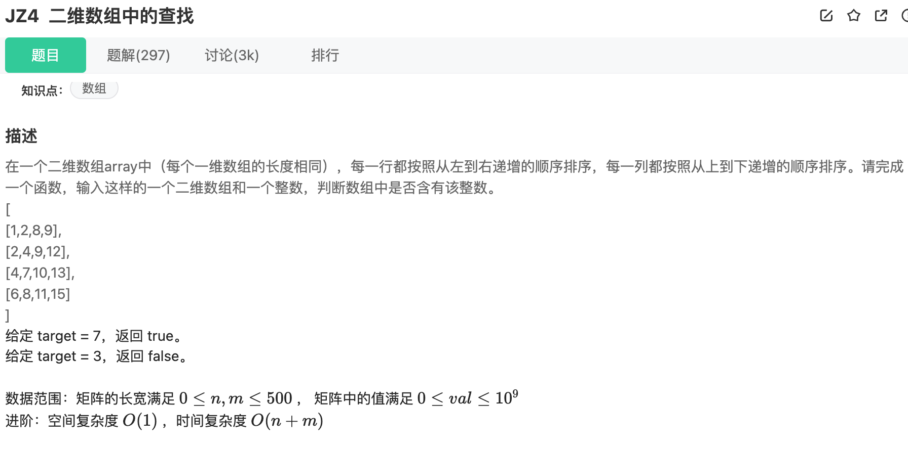
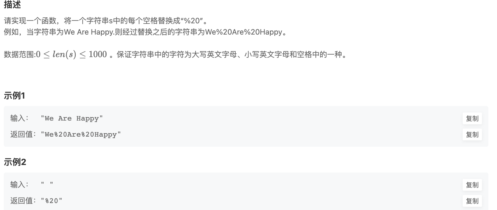
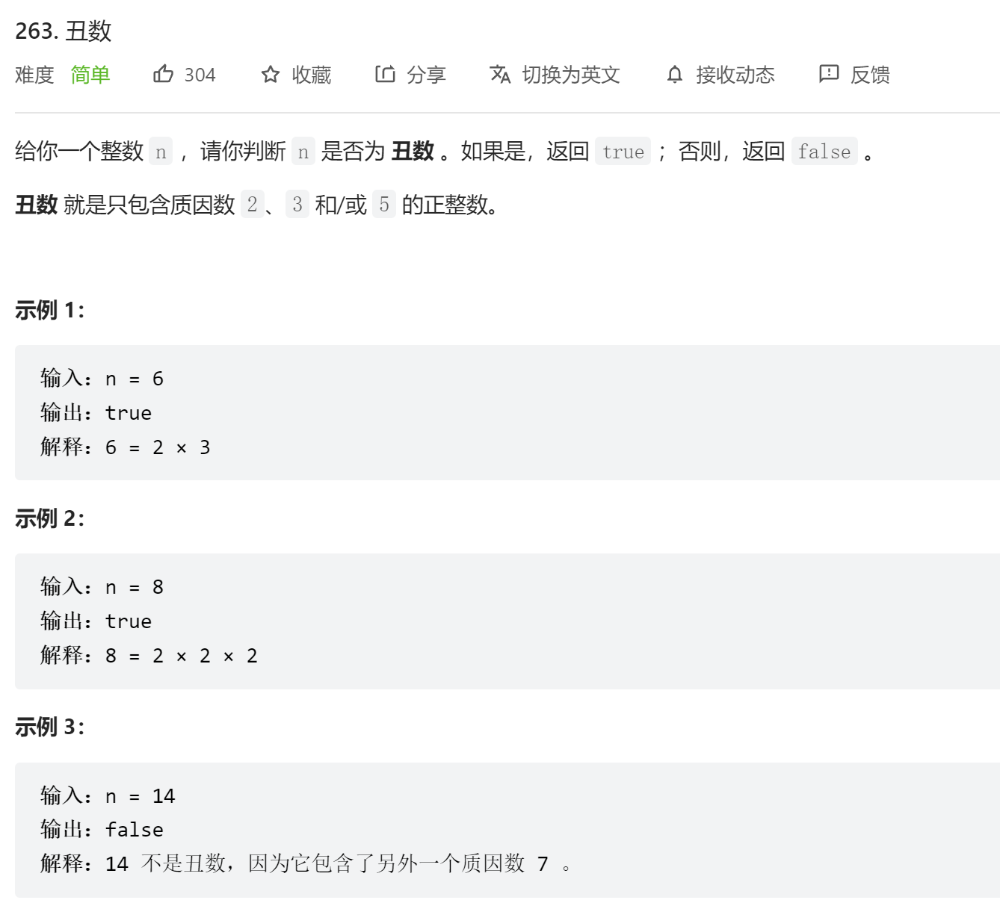

### 剑指offer

#### **JZ4** **二维数组中的查找**



该二维数组中的一个数，小于它的数一定在其左边，大于它的数一定在其下边。因此，从右上角开始查找，就可以根据 target 和当前元素的大小关系来快速地缩小查找区间，每次减少一行或者一列的元素。当前元素的查找区间为左下角的所有元素。

```java
public class Solution {
    public boolean Find(int target, int [][] array) {
        if (array == null || array.length == 0 || array[0].length == 0) {
            return false;
        }
        int rows = array.length;
        int cols = array[0].length;
        int row = 0;
        int col = cols - 1;
        while (row <= rows - 1 && col >= 0) {
            if (array[row][col] == target) {
                return true;
            } else if (array[row][col] < target) {
                row++;
            } else {
                col--;
            }
        }
        return false;
    }
}
```

#### **JZ5** **替换空格**



```java
import java.util.*;


public class Solution {
    /**
     * 代码中的类名、方法名、参数名已经指定，请勿修改，直接返回方法规定的值即可
     *
     * 
     * @param s string字符串 
     * @return string字符串
     */
    public String replaceSpace (String s) {
        // write code here
        StringBuilder sb = new StringBuilder();
        for (int i = 0; i < s.length(); i++) {
            if (s.charAt(i) == ' ') {
                sb.append("%20");
            } else {
                sb.append(s.charAt(i));
            }
        }
        return sb.toString();
    }
}
```

#### **JZ50** **第一个只出现一次的字符**


使用 HashMap 对出现次数进行统计：字符做为 key，出现次数作为 value，遍历字符串每次都将 key 对应的 value 加 1。最后再遍历这个 HashMap 就可以找出出现次数为 1 的字符。

使用整型数组代替 HashMap。ASCII 码只有 128 个字符，因此可以使用长度为 128 的整型数组来存储每个字符出现的次数。

```java
public int FirstNotRepeatingChar(String str) {
    int[] cnts = new int[128];
    for (int i = 0; i < str.length(); i++)
        cnts[str.charAt(i)]++;
    for (int i = 0; i < str.length(); i++)
        if (cnts[str.charAt(i)] == 1)
            return i;
    return -1;
}
```

#### [263. 丑数](https://leetcode-cn.com/problems/ugly-number/)



```java
class Solution {
    public boolean isUgly(int n) {
        if (n <= 0) {
            return false;
        }
        int[] factors = {2, 3, 5};
        for (int factor : factors) {
            while (n % factor == 0) {
                n /= factor;
            }
        }
        return n == 1;
    }
}
```

#### [605. 种花问题](https://leetcode-cn.com/problems/can-place-flowers/)


```java
class Solution {
    public boolean canPlaceFlowers(int[] flowerbed, int n) {
        int size = flowerbed.length;
        for (int i = 0; i < size && n > 0; i++) { //循环条件注意n > 0
            if(flowerbed[i] == 1) { //为1 直接跳过
                continue;
            } 
            //数组边界置0, 取得i 左右两边的值是否种花 
            int pre = i == 0 ? 0 : flowerbed[i - 1];
            int next = i == size - 1 ? 0 : flowerbed[i + 1];  
            if (pre == 0 && next == 0) {
                flowerbed[i] = 1;
                n--;
            }
        }
        return n <= 0;
    }
}
```

