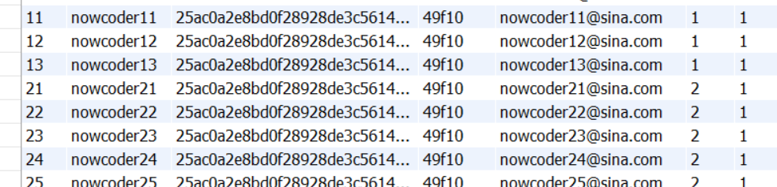

**开启ES:** 

```shell
C:\Users\cheng>d:d
D:\>cd D:\work\elasticsearch-6.4.3\bin
elasticsearch.bat
```

**开启KafKa**

1. 先配置zookeeper管理集群

```shell
C:\Users\cheng>d:                                                                                         
D:\>cd D:\work\kafka_2.13-2.8.0                                                                           
D:\work\kafka_2.13-2.8.0>bin\windows\zookeeper-server-start.bat config\zookeeper.properties   
```

2. 启动Kafka (开另一个窗口)

```shell
C:\Users\cheng>d:                                                                                         
D:\>cd D:\work\kafka_2.13-2.8.0                                                                           
D:\work\kafka_2.13-2.8.0>bin\windows\kafka-server-start.bat config\server.properties 
```

常见报错： 

```
kafka.common.InconsistentClusterIdException: The Cluster ID Lnh8cPXGQsm0svgyhLcJtQ doesn't match stored clusterId Some(sqVS5qbvRZuFAwJYTzr7kA) in meta.properties. The broker is trying to join the wrong cluster. Configured zookeeper.connect may be wrong.
	at kafka.server.KafkaServer.startup(KafkaServer.scala:220)
	at kafka.server.KafkaServerStartable.startup(KafkaServerStartable.scala:44)
	at kafka.Kafka$.main(Kafka.scala:84)
	at kafka.Kafka.main(Kafka.scala)
建议删除 kafka-logs
log.dirs=/tmp/kafka-logs
```

**登录**

账号xixi 密码123  



nowcoder11 12 13 管理员，密码123456 可以删除

nowcoder21 22 23 24 25 版主 可以置顶删除

 

## mysql 

```shell
C:\Users\cheng>mysql -uroot -p
show databases;
mysql> use community;
source D:/work/tables_mysql_innodb.sql;
```

