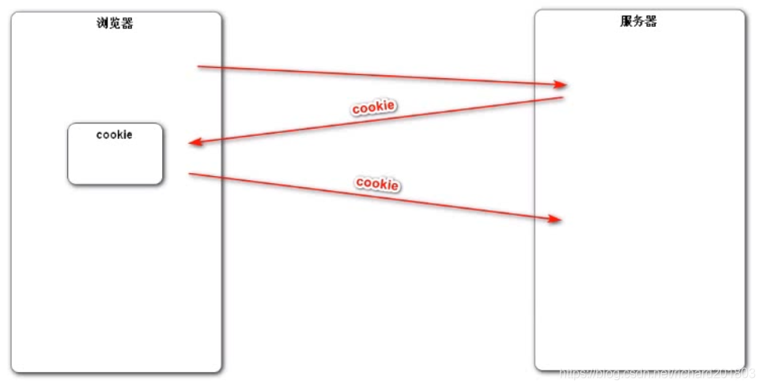
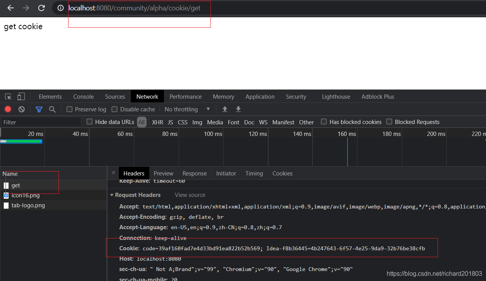

08 会话管理牛客

# 3 会话管理
登录功能需要会话管理方面的内容
## HTTP的基本性质
HTTP是简单的
HTTP是可扩展的
HTTP是无状态的，有会话的


## Cookie
`Cookie`工作原理：想要服务器记住浏览器，浏览器在访问服务器的时候，服务器可以创建Cookie对象，并将cookie对象在响应的时候发送给浏览器；cookie对象中可以携带数据，浏览器得到之后就会保存到本地；浏览器下一次访问时候就会在请求头里将这个cookie带回给服务器，服务器就记住了这个用户。
Cookie是特殊的数据，浏览器得到后自动保存，下次请求自动传送。

写几个小例子来感受一下：

- 先实现浏览器发送请求，然后服务器创建cookie

```java
 // cookie示例

    @RequestMapping(path = "/cookie/set", method = RequestMethod.GET)
    @ResponseBody //返回字符串简单测试一下
    public String setCookie(HttpServletResponse response) {
        //创建完cookie然后存到response里，在响应的时候才能自动携带给浏览器
        // 创建cookie，一个cookie只能存一对key-value
        Cookie cookie = new Cookie("code", CommunityUtil.generateUUID());
        // 设置cookie生效的范围,即访问哪些路径的时候需要发
        cookie.setPath("/community/alpha");
        // 存到内存里 默认关掉会消失 设置cookie的生存时间
        cookie.setMaxAge(60 * 10);
        // 发送cookie，放到response头里面
        response.addCookie(cookie);

        return "set cookie";
    }

```
- 测试


然后再实现浏览器访问服务器怎么带cookie


- 然后再测访问服务器
比如先访问index

接下来写个有效的


得到之前存的code这个对应的cookie，如果想要用到模板，code加到model里带给它


是服务器发送到浏览器，并保存在浏览器端的一小块数据。
浏览器下次访问该服务器时，会自动携带块该数据，将其发送给服务器。
cookie能够弥补http无状态的情况，使用简单，但是cookie存到客服端不安全，容易被盗，所以不存密码。每次发给服务器的时候也会产生流量造成性能上的影响。
于是有了session

## Session 
一般用来存比较**隐私**的数据，而且可以存任何类型大小数据
是服务端对象，但不是http协议的标准。
是`JavaEE`的标准，用于在`服务端`记录客户端信息(`cookie`在`客服端`记录)。
数据存放在**服务端更加安全**，但是也会增加服务端的**内存压力**。
Session本质上依赖于cookie，解决的还是服务器能否记住的问题

服务器创建session对象，存在服务器端。浏览器和服务器是多对一的关系。那么浏览器和`session`之间对应关系就通过`cookie`来找！
所以在响应的时候服务器发给浏览器，通过cookie携带，cookie中存了sessionid。浏览器就会存cookie 当它下次访问就会自动发给服务器，服务器得到sessionID之后就会利用sessionId在内存里找，就能找到浏览器相关数据。


- 写个小例子看看session的使用

```java
 // session示例
    @RequestMapping(path = "/session/set", method = RequestMethod.GET)
    @ResponseBody
    public String setSession(HttpSession session) {
        session.setAttribute("id", 1);
        session.setAttribute("name", "Test");
        return "set session";
    }
```


```java
@RequestMapping(path = "/session/get", method = RequestMethod.GET)
    @ResponseBody
    public String getSession(HttpSession session) {
        System.out.println(session.getAttribute("id"));
        System.out.println(session.getAttribute("name"));
        return "get session";
    }
```


能用cookie就用cookie 只有一台服务器的话随便用session，但是现在网站分布式部署session用得少，是因为
**分布式部署**使用`session`存在的问题：
三台服务器，服务器之前会加一个负载均衡的nginx，浏览器访问这个代理，当浏览器发出请求，于是ngix会分发给某服务器。服务器1会创建一个session，返回sessionId，浏览器保存。但是突然发现服务器1比较忙，那就只能发给服务器3，虽然服务器3也能创建session，但是它本地没有这个session，于是只能创建新的session，第二次请求就得不到session中的数据了。问题的解决方案：1 设置负载均衡分配的策略 

- 1种方式叫粘性session，比如浏览器ip 101, 把101分给服务器1，然后没次都是服务器1处理，但是不保证负载均衡
- 2种方式，同步session，当某一个服务器创建session并存数据后，就会同步给别人。每个服务器都存，于是问题：同步影响性能，服务器之间会有耦合。这个对部署比较有影响
- 3方式。共享session，单独一台服务器，把session都放到这台服务器，其他服务器都向这台服务器找session。但是这台服务器可能单体容易挂掉。 搞个集群和之前就一样了
- 4 方案。所有现在能存cookie就cookie不存session。不方便cookie的就存到数据库里，数据库可以集群，同步没有问题。但是缺点，传统的关系型数据库存在硬盘里，要从内存读数据并发量大的时候性能就问题。于是我们存到`Redis`里。存到MySQL的数据就会迁移到redis里。


- 