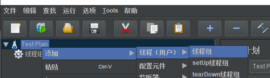
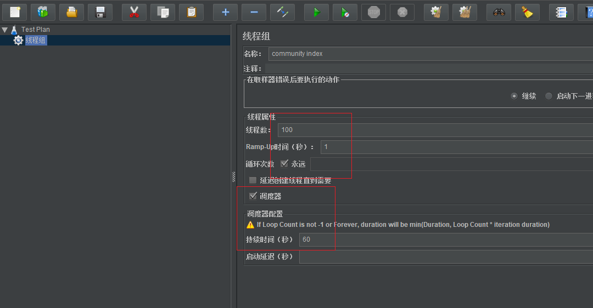
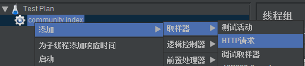
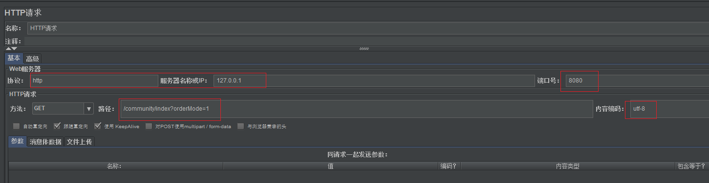

# 7.27  优化网站的性能 


使用压力测试工具，感受缓存的价值！减少对数据库的直接访问

比如两个服务器1、2. 核心是service去访问数据库，app部署在服务器里, 一级本地缓存。两台服务器上的app代码一样，当用户的第一个请求分发到服务器1，应用会从缓存里找数据，如果没有分布式缓存的时候就需要直接访问DB,然后得到数据然后更新到本地缓存，数据就被返回客户端，如果第二次请求给了服务器2的时候，app从缓存取数据取不到，以为你没有登录，于是不能访问数据库。用户相关的就不能放到缓存，如果是和帖子相关的是可以的。只要数据和用户没有强关联就是可以的。Redis可以解决强关联的问题。

比如第一次访问服务器1，看本地缓存没有数据，假如我们用的是Redis, 用户看redis里有没有数据，一看没有就访问DB, 访问DB后就要把数据同步到Redis里，然后再返回给客服端。于是第二台服务器也可以访问Redis，就避免了访问DB, 所以Redis可以跨服务器，缓存各种数据。


## 缓存使用过程：

假如是两级缓存

服务器里面部署APP应用，还有部分空间用于本地一级缓存，请求访问app,先看本地缓存又没，有就还回，没有就看Redis有没有，如果有就返回，没有就访问DB, 第三次访问之后就要同步到二级缓存，然后一级缓存然后返回。通常本地会设置过期时间和大小。


## 优化热门贴子列表

不是按照时间排序缓存，因为经常有人发贴子，需要更新缓存。按照热门程度，需要隔一段时间几乎不变，适合缓存的是数据变化的频率较低。 

我们使用Caffeine,缓存的帖子登不登陆都可以不用。 可以单独用也可以spring整合。不建议用spring整合，因为spring用一个cache manager来管理，但是我们有很多缓存，过期时间和大小都统一的话不太合适。多个缓存管理器反而麻烦。

https://github.com/ben-manes/caffeine 手册

## 导包

```xml
<dependency>
    <groupId>com.github.ben-manes.caffeine</groupId>
    <artifactId>caffeine</artifactId>
    <version>2.7.0</version>
</dependency>

```

## 自定义参数

缓存帖子列表的时候要设置能缓存多少条数据，多长时间释放掉，好让新的数据进来。将来部署到性能好的服务器上可以调大点参数。 

缓存15个页面即可，过期时间3min。 缓存可以主动淘汰，数据变化可以淘汰，还有就是定时淘汰。我们这定时淘汰即可。例如某一个贴子发生变化了，没必要都刷新。到时间了刷新一下即可。

```xml
# caffeine
caffeine.posts.max-size=15
caffeine.posts.expire-seconds=180
```

## 优化查询方法

优化service业务方法，调用service查询的方法。

DiscussPostService.java

```java
@Value("${caffeine.posts.max-size}")
private int maxSize;

@Value("${caffeine.posts.expire-seconds}")
private int expireSeconds;

// Caffeine核心接口: Cache, LoadingCache同步缓存多个线程同时访问就会从数据库取了返回, AsyncLoadingCache异步的支持并发取

// 帖子列表缓存 需要kv，所有的缓存都是按照key缓存value
private LoadingCache<String, List<DiscussPost>> postListCache;

// 帖子总数缓存 缓存不需要初始化多次，服务启动或者第一次调用时候就初始化缓存
private LoadingCache<Integer, Integer> postRowsCache;

@PostConstruct
public void init() {
    // 初始化帖子列表缓存
    postListCache = Caffeine.newBuilder()
            .maximumSize(maxSize)
            .expireAfterWrite(expireSeconds, TimeUnit.SECONDS)
            .build(new CacheLoader<String, List<DiscussPost>>() {
                @Nullable
                @Override
                public List<DiscussPost> load(@NonNull String key) throws Exception {
                    if (key == null || key.length() == 0) {
                        throw new IllegalArgumentException("参数错误!");
                    }

                    String[] params = key.split(":");
                    if (params == null || params.length != 2) {
                        throw new IllegalArgumentException("参数错误!");
                    }

                    int offset = Integer.valueOf(params[0]);
                    int limit = Integer.valueOf(params[1]);

                    // 二级缓存: Redis -> mysql

                    logger.debug("load post list from DB.");
                    return discussPostMapper.selectDiscussPosts(0, offset, limit, 1); //这里直接访问数据库了
                }
            });
    // 初始化帖子总数缓存
    postRowsCache = Caffeine.newBuilder()
            .maximumSize(maxSize)
            .expireAfterWrite(expireSeconds, TimeUnit.SECONDS)
            .build(new CacheLoader<Integer, Integer>() {
                @Nullable
                @Override
                public Integer load(@NonNull Integer key) throws Exception {
                    logger.debug("load post rows from DB.");
                    return discussPostMapper.selectDiscussPostRows(key);
                }
            });
}

public List<DiscussPost> findDiscussPosts(int userId, int offset, int limit, int orderMode) {
    if (userId == 0 && orderMode == 1) { //首页userId为0
        return postListCache.get(offset + ":" + limit);//offset + ":" + limit 作为key
    }

    logger.debug("load post list from DB."); //访问数据库的时候记录一下
    return discussPostMapper.selectDiscussPosts(userId, offset, limit, orderMode);
}

public int findDiscussPostRows(int userId) { //缓存的是帖子列表，用户查自己的不用走缓存
    if (userId == 0) {
        return postRowsCache.get(userId);
    }

    logger.debug("load post rows from DB.");
    return discussPostMapper.selectDiscussPostRows(userId);
}
```

## 测试一下缓存能用

压力测试，测试类可以初始化一些数据，最好数据多一点，访问数据库新能差一点，所以要突出缓存价值。

```java
@RunWith(SpringRunner.class)
@SpringBootTest
@ContextConfiguration(classes = CommunityApplication.class)
public class CaffeineTests {

    @Autowired
    private DiscussPostService postService;

    @Test
    public void initDataForTest() {
        for (int i = 0; i < 300000; i++) {
            DiscussPost post = new DiscussPost();
            post.setUserId(111);
            post.setTitle("互联网求职暖春计划");
            post.setContent("今年的就业形势，确实不容乐观。过了个年，仿佛跳水一般，整个讨论区哀鸿遍野！19届真的没人要了吗？！18届被优化真的没有出路了吗？！大家的“哀嚎”与“悲惨遭遇”牵动了每日潜伏于讨论区的牛客小哥哥小姐姐们的心，于是牛客决定：是时候为大家做点什么了！为了帮助大家度过“寒冬”，牛客网特别联合60+家企业，开启互联网求职暖春计划，面向18届&19届，拯救0 offer！");
            post.setCreateTime(new Date());
            post.setScore(Math.random() * 2000);
            postService.addDiscussPost(post);
        }
    }

    @Test
    public void testCache() {
        System.out.println(postService.findDiscussPosts(0, 0, 10, 1)); // 0 10 第一页10条数据， 1表示热门 第一次缓存没有数据访问数据库
        System.out.println(postService.findDiscussPosts(0, 0, 10, 1));//能够取到缓存中的数据
        System.out.println(postService.findDiscussPosts(0, 0, 10, 1));//能够取到缓存中的数据 三次访问只访问数据库一次打印一次日志
        System.out.println(postService.findDiscussPosts(0, 0, 10, 0));// 查询帖子列表 按照默认排序 要访问数据库
    }
```


### 压力测试不加缓存测一下

1. ServiceLogAspect里

```
//@Component
//@Aspect
不需要访问数据库就打印日志
```

2. DiscussPostService.java里

```java
public List<DiscussPost> findDiscussPosts(int userId, int offset, int limit, int orderMode) {
  //  if (userId == 0 && orderMode == 1) { //首页userId为0
  //      return postListCache.get(offset + ":" + limit);//offset + ":" + limit 作为key
  //  }

    logger.debug("load post list from DB."); //访问数据库的时候记录一下
    return discussPostMapper.selectDiscussPosts(userId, offset, limit, orderMode);
}

public int findDiscussPostRows(int userId) { //缓存的是帖子列表，用户查自己的不用走缓存
   // if (userId == 0) {
   //     return postRowsCache.get(userId);
   // }
```

选择一个好的工具测试`jmeter`

jmeter.apache.org

D:\work\apache-jmeter-5.1.1\bin

jmeter.bat

压力测试是模拟客户端访问服务器，然后看一下性能，而且是模拟很多人一起访问的。

启动服务

1. 添加线程组



2. 线程组配置









### 加缓存测试一下


